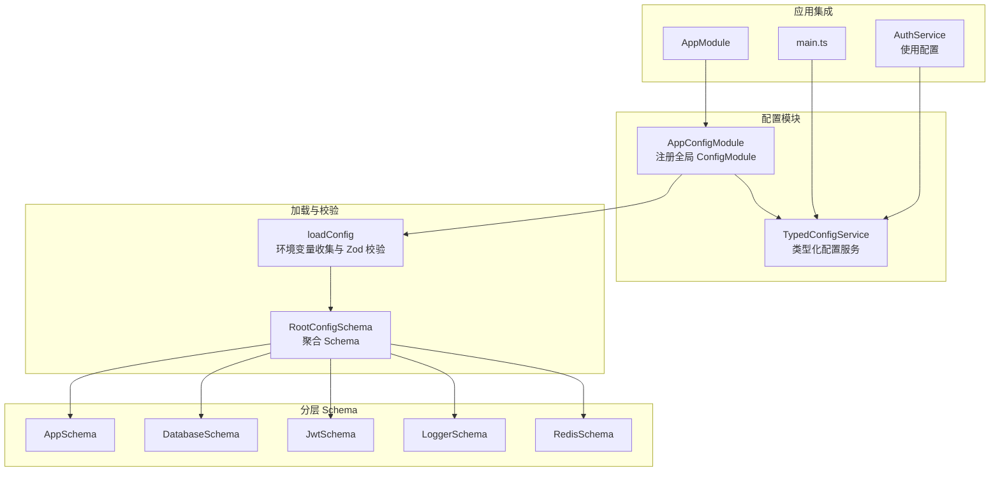
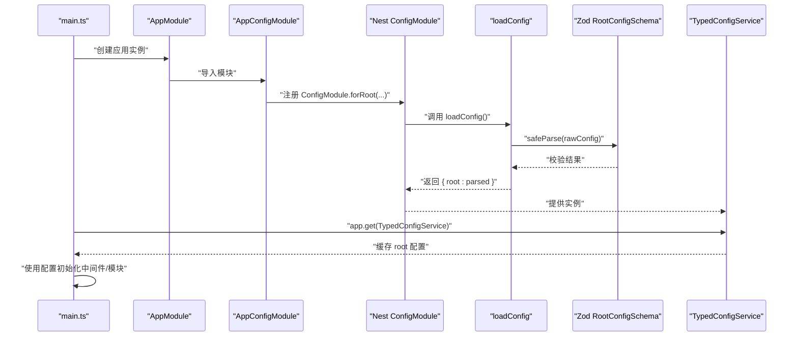
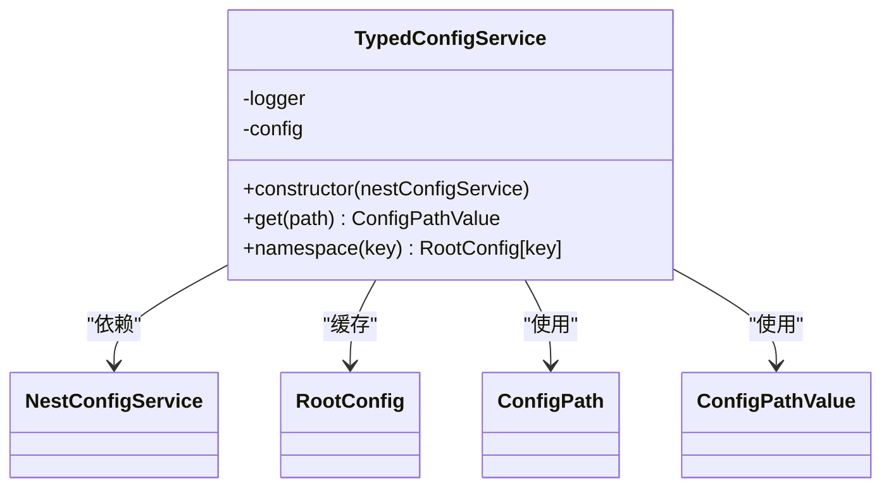
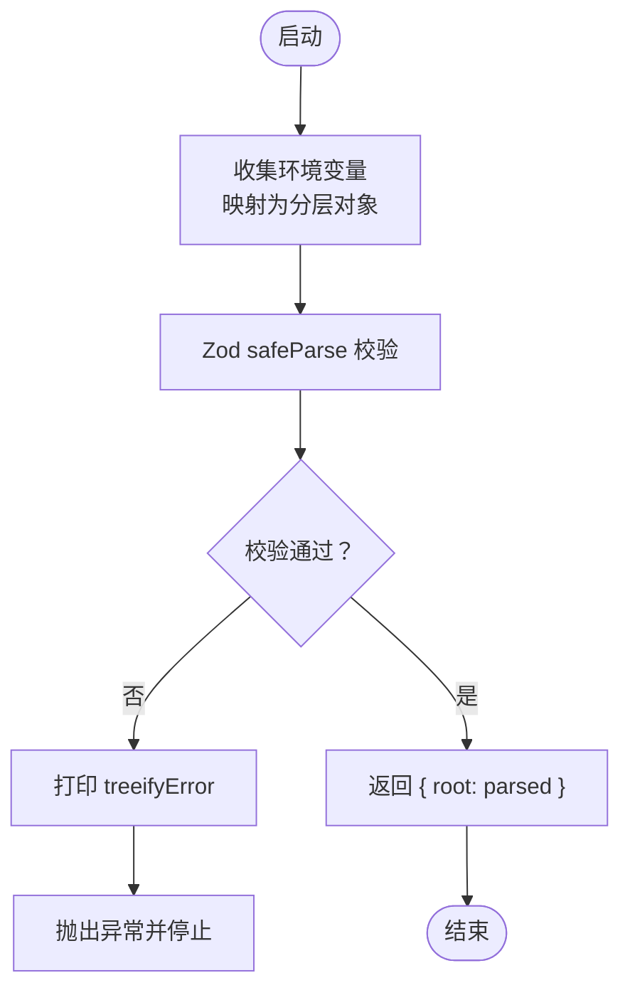
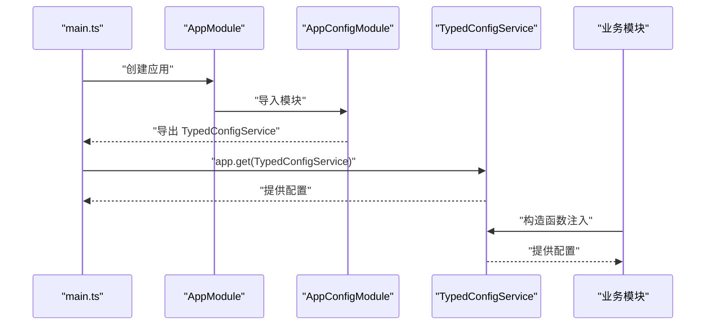
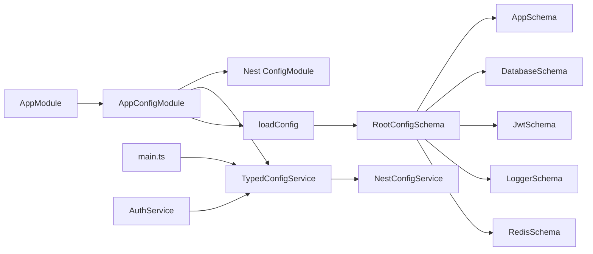

# 配置管理系统

<cite>
**本文引用的文件**
- [config.module.ts](file://apps/nestjs-server/src/config/config.module.ts)
- [typed-config.service.ts](file://apps/nestjs-server/src/config/typed-config.service.ts)
- [config-loader.ts](file://apps/nestjs-server/src/config/config-loader.ts)
- [types.ts](file://apps/nestjs-server/src/config/types.ts)
- [root.schema.ts](file://apps/nestjs-server/src/config/schemas/root.schema.ts)
- [app.schema.ts](file://apps/nestjs-server/src/config/schemas/app.schema.ts)
- [database.schema.ts](file://apps/nestjs-server/src/config/schemas/database.schema.ts)
- [jwt.schema.ts](file://apps/nestjs-server/src/config/schemas/jwt.schema.ts)
- [logger.schema.ts](file://apps/nestjs-server/src/config/schemas/logger.schema.ts)
- [redis.schema.ts](file://apps/nestjs-server/src/config/schemas/redis.schema.ts)
- [app.module.ts](file://apps/nestjs-server/src/app.module.ts)
- [main.ts](file://apps/nestjs-server/src/main.ts)
- [auth.service.ts](file://apps/nestjs-server/src/modules/auth/auth.service.ts)
</cite>

## 目录

1. [简介](#简介)
2. [项目结构](#项目结构)
3. [核心组件](#核心组件)
4. [架构总览](#架构总览)
5. [详细组件分析](#详细组件分析)
6. [依赖关系分析](#依赖关系分析)
7. [性能与可维护性](#性能与可维护性)
8. [故障排查指南](#故障排查指南)
9. [结论](#结论)
10. [附录](#附录)

## 简介

本项目采用基于 Zod 的类型安全配置验证体系，结合 NestJS 的 ConfigModule 实现从环境变量到强类型配置对象的全链路校验与访问。系统通过分层 Schema 组织配置域（命名空间），在应用启动阶段完成严格的数据校验与类型转换，并以 TypedConfigService 提供统一、类型安全的配置读取接口。同时，系统支持多环境差异化配置（开发、测试、生产），并通过依赖注入实现全局访问。

## 项目结构

配置相关代码集中于 apps/nestjs-server/src/config 目录，包含：

- 模块定义：注册全局 ConfigModule 并导出 TypedConfigService
- 加载器：将 process.env 扁平映射为分层配置，并进行 Zod 校验
- 类型工具：通过泛型推导支持点语法路径与值类型
- 分层 Schema：按命名空间拆分（app、database、jwt、logger、redis）
- 强类型服务：提供 get(path) 与 namespace(key) 访问方式

**图示来源**

- [config.module.ts:1-20](file://apps/nestjs-server/src/config/config.module.ts#L1-L20)
- [typed-config.service.ts:1-46](file://apps/nestjs-server/src/config/typed-config.service.ts#L1-L46)
- [config-loader.ts:1-63](file://apps/nestjs-server/src/config/config-loader.ts#L1-L63)
- [root.schema.ts:1-23](file://apps/nestjs-server/src/config/schemas/root.schema.ts#L1-L23)
- [app.schema.ts:1-12](file://apps/nestjs-server/src/config/schemas/app.schema.ts#L1-L12)
- [database.schema.ts:1-11](file://apps/nestjs-server/src/config/schemas/database.schema.ts#L1-L11)
- [jwt.schema.ts:1-11](file://apps/nestjs-server/src/config/schemas/jwt.schema.ts#L1-L11)
- [logger.schema.ts:1-13](file://apps/nestjs-server/src/config/schemas/logger.schema.ts#L1-L13)
- [redis.schema.ts:1-18](file://apps/nestjs-server/src/config/schemas/redis.schema.ts#L1-L18)
- [app.module.ts:1-63](file://apps/nestjs-server/src/app.module.ts#L1-L63)
- [main.ts:1-47](file://apps/nestjs-server/src/main.ts#L1-L47)
- [auth.service.ts:1-151](file://apps/nestjs-server/src/modules/auth/auth.service.ts#L1-L151)

**章节来源**

- [config.module.ts:1-20](file://apps/nestjs-server/src/config/config.module.ts#L1-L20)
- [app.module.ts:1-63](file://apps/nestjs-server/src/app.module.ts#L1-L63)
- [main.ts:1-47](file://apps/nestjs-server/src/main.ts#L1-L47)

## 核心组件

- AppConfigModule：将 ConfigModule 注册为全局模块，加载自定义配置工厂，并根据 NODE_ENV 决定是否忽略 .env 文件。
- loadConfig：将 process.env 映射为分层对象，使用 RootConfigSchema 进行 Zod 校验；校验失败则输出详细错误并阻止启动；成功则返回带 root 键的对象。
- TypedConfigService：构造函数内读取 root 配置并缓存；提供 get(path) 支持点语法访问；提供 namespace(key) 获取命名空间对象；缺失根配置时记录错误并终止进程。
- 类型工具 types.ts：通过 ConfigPath 与 ConfigPathValue 泛型递归推导路径与值类型，限制最大递归深度以避免 TypeScript 性能问题。
- 分层 Schema：按命名空间拆分，每个 Schema 定义字段、默认值与约束，最终由 RootConfigSchema 聚合。

**章节来源**

- [config.module.ts:1-20](file://apps/nestjs-server/src/config/config.module.ts#L1-L20)
- [config-loader.ts:1-63](file://apps/nestjs-server/src/config/config-loader.ts#L1-L63)
- [typed-config.service.ts:1-46](file://apps/nestjs-server/src/config/typed-config.service.ts#L1-L46)
- [types.ts:1-29](file://apps/nestjs-server/src/config/types.ts#L1-L29)
- [root.schema.ts:1-23](file://apps/nestjs-server/src/config/schemas/root.schema.ts#L1-L23)

## 架构总览

下图展示了从启动到配置可用的关键流程：main.ts 获取 TypedConfigService，AppConfigModule 注入 ConfigModule，loadConfig 在启动阶段执行并返回 root 配置，TypedConfigService 缓存该配置，后续模块通过依赖注入获取 TypedConfigService 并读取所需配置。

**图示来源**

- [main.ts:1-47](file://apps/nestjs-server/src/main.ts#L1-L47)
- [app.module.ts:1-63](file://apps/nestjs-server/src/app.module.ts#L1-L63)
- [config.module.ts:1-20](file://apps/nestjs-server/src/config/config.module.ts#L1-L20)
- [config-loader.ts:1-63](file://apps/nestjs-server/src/config/config-loader.ts#L1-L63)
- [root.schema.ts:1-23](file://apps/nestjs-server/src/config/schemas/root.schema.ts#L1-L23)
- [typed-config.service.ts:1-46](file://apps/nestjs-server/src/config/typed-config.service.ts#L1-L46)

## 详细组件分析

### TypedConfigService 实现与使用

- 设计要点
  - 构造函数读取 root 配置并缓存，缺失时立即记录错误并终止进程，确保启动期即发现配置问题。
  - get(path) 支持点语法（如 'jwt.secret'），逐层解析，若路径不存在抛出明确错误。
  - namespace(key) 返回指定命名空间对象，便于一次性读取一组配置。
- 使用示例
  - 在 AuthService 中通过 this.config.get('jwt.secret') 等方式读取 JWT 相关配置。
- 类型安全
  - 结合 types.ts 的 ConfigPath 与 ConfigPathValue，在编译期推导路径与返回值类型，避免运行期类型错误。

**图示来源**

- [typed-config.service.ts:1-46](file://apps/nestjs-server/src/config/typed-config.service.ts#L1-L46)
- [types.ts:1-29](file://apps/nestjs-server/src/config/types.ts#L1-L29)

**章节来源**

- [typed-config.service.ts:1-46](file://apps/nestjs-server/src/config/typed-config.service.ts#L1-L46)
- [auth.service.ts:1-151](file://apps/nestjs-server/src/modules/auth/auth.service.ts#L1-L151)

### 配置加载与验证流程

- 流程说明
  - 将 process.env 映射为分层对象（app、database、jwt、logger、redis）。
  - 使用 RootConfigSchema.safeParse 进行严格校验，失败时输出 treeifyError 并抛出异常阻止启动。
  - 成功后返回 { root: parsed }，供 TypedConfigService 读取。
- 错误处理
  - 校验失败会打印详细错误并终止进程，避免在运行期出现不可预期行为。
  - 根配置缺失同样会触发致命错误。

**图示来源**

- [config-loader.ts:1-63](file://apps/nestjs-server/src/config/config-loader.ts#L1-L63)
- [root.schema.ts:1-23](file://apps/nestjs-server/src/config/schemas/root.schema.ts#L1-L23)

**章节来源**

- [config-loader.ts:1-63](file://apps/nestjs-server/src/config/config-loader.ts#L1-L63)

### 多环境配置管理策略

- 开发环境（development）
  - 默认端口、Swagger 开启、日志级别适中、数据库连接数较小等。
- 测试环境（test）
  - 可通过覆盖环境变量调整数据库、日志与 Redis 行为，便于隔离测试。
- 生产环境（production）
  - ConfigModule 默认忽略 .env 文件，避免意外覆盖；建议通过密钥管理服务注入敏感变量。
- 环境变量控制
  - NODE_ENV 控制默认值与行为；PORT、API_PREFIX、CORS_ORIGIN、ENABLE_SWAGGER 等影响应用启动参数。

**章节来源**

- [app.schema.ts:1-12](file://apps/nestjs-server/src/config/schemas/app.schema.ts#L1-L12)
- [config.module.ts:1-20](file://apps/nestjs-server/src/config/config.module.ts#L1-L20)

### 依赖注入与全局访问机制

- 全局模块
  - AppConfigModule 使用 @Global() 注册为全局模块，任何模块均可直接注入 TypedConfigService。
- 应用入口
  - main.ts 通过 app.get(TypedConfigService) 获取实例，并使用其读取 app 命名空间配置初始化 CORS、全局前缀与 Swagger。
- 模块内使用
  - 业务模块（如 AuthService）通过构造函数注入 TypedConfigService，使用 get 或 namespace 访问配置。

**图示来源**

- [main.ts:1-47](file://apps/nestjs-server/src/main.ts#L1-L47)
- [app.module.ts:1-63](file://apps/nestjs-server/src/app.module.ts#L1-L63)
- [config.module.ts:1-20](file://apps/nestjs-server/src/config/config.module.ts#L1-L20)
- [typed-config.service.ts:1-46](file://apps/nestjs-server/src/config/typed-config.service.ts#L1-L46)

**章节来源**

- [config.module.ts:1-20](file://apps/nestjs-server/src/config/config.module.ts#L1-L20)
- [main.ts:1-47](file://apps/nestjs-server/src/main.ts#L1-L47)
- [app.module.ts:1-63](file://apps/nestjs-server/src/app.module.ts#L1-L63)

### 配置文件结构、默认值与约束

- 根对象结构
  - app、database、jwt、logger、redis 五个命名空间，分别对应各自 Schema。
- 默认值与约束
  - app：nodeEnv 默认 development，port 默认 3000，apiPrefix 默认 'api/v1'，corsOrigin 默认 '\*'，enableSwagger 默认 true。
  - database：provider 默认 sqlite，url 必填，maxConnections 默认 10，logging 默认 false。
  - jwt：secret 与 refreshSecret 至少 32 字符，accessTokenTtl 默认 '15m'，refreshTokenTtl 默认 '7d'。
  - logger：loggerDir 默认 'logs'，loggerLevel 默认 Info，loggerEnableFile 默认 false，loggerMaxFiles 默认 7，loggerMaxSize 默认 '20m'。
  - redis：host 必填，port 默认 6379，db 默认 0，keyPrefix 默认 'nebula:'，connectTimeout 默认 5000，maxRetries 默认 3，lazyConnect 默认 false。
- 类型推导
  - RootConfig 由 RootConfigSchema 推导而来，确保配置对象与 Schema 保持一致。

**章节来源**

- [root.schema.ts:1-23](file://apps/nestjs-server/src/config/schemas/root.schema.ts#L1-L23)
- [app.schema.ts:1-12](file://apps/nestjs-server/src/config/schemas/app.schema.ts#L1-L12)
- [database.schema.ts:1-11](file://apps/nestjs-server/src/config/schemas/database.schema.ts#L1-L11)
- [jwt.schema.ts:1-11](file://apps/nestjs-server/src/config/schemas/jwt.schema.ts#L1-L11)
- [logger.schema.ts:1-13](file://apps/nestjs-server/src/config/schemas/logger.schema.ts#L1-L13)
- [redis.schema.ts:1-18](file://apps/nestjs-server/src/config/schemas/redis.schema.ts#L1-L18)

### 敏感信息保护与配置热更新

- 敏感信息保护
  - 通过 Zod 约束关键字段长度与格式（如 JWT 密钥长度），并在生产环境忽略 .env 文件，降低误注入风险。
  - 建议在生产环境中通过密钥管理服务或平台机密存储注入敏感变量。
- 配置热更新
  - 当前实现为启动期一次性加载并缓存；若需热更新，可在现有基础上引入监听机制或外部配置中心订阅，按需替换缓存对象并通知订阅者。

**章节来源**

- [config-loader.ts:1-63](file://apps/nestjs-server/src/config/config-loader.ts#L1-L63)
- [config.module.ts:1-20](file://apps/nestjs-server/src/config/config.module.ts#L1-L20)

## 依赖关系分析

- 模块耦合
  - AppConfigModule 依赖 ConfigModule 与 loadConfig；TypedConfigService 依赖 NestConfigService 与 RootConfig 类型。
  - 业务模块通过依赖注入使用 TypedConfigService，避免直接依赖 ConfigModule。
- 外部依赖
  - Zod 用于严格校验与类型推导；nestjs-zod 提供全局验证管道与 OpenAPI 清理工具。
- 循环依赖
  - 通过模块化与全局导出避免循环依赖；TypedConfigService 仅在构造函数中读取一次配置。

**图示来源**

- [config.module.ts:1-20](file://apps/nestjs-server/src/config/config.module.ts#L1-L20)
- [typed-config.service.ts:1-46](file://apps/nestjs-server/src/config/typed-config.service.ts#L1-L46)
- [config-loader.ts:1-63](file://apps/nestjs-server/src/config/config-loader.ts#L1-L63)
- [root.schema.ts:1-23](file://apps/nestjs-server/src/config/schemas/root.schema.ts#L1-L23)
- [app.schema.ts:1-12](file://apps/nestjs-server/src/config/schemas/app.schema.ts#L1-L12)
- [database.schema.ts:1-11](file://apps/nestjs-server/src/config/schemas/database.schema.ts#L1-L11)
- [jwt.schema.ts:1-11](file://apps/nestjs-server/src/config/schemas/jwt.schema.ts#L1-L11)
- [logger.schema.ts:1-13](file://apps/nestjs-server/src/config/schemas/logger.schema.ts#L1-L13)
- [redis.schema.ts:1-18](file://apps/nestjs-server/src/config/schemas/redis.schema.ts#L1-L18)
- [app.module.ts:1-63](file://apps/nestjs-server/src/app.module.ts#L1-L63)
- [main.ts:1-47](file://apps/nestjs-server/src/main.ts#L1-L47)
- [auth.service.ts:1-151](file://apps/nestjs-server/src/modules/auth/auth.service.ts#L1-L151)

**章节来源**

- [app.module.ts:1-63](file://apps/nestjs-server/src/app.module.ts#L1-L63)
- [main.ts:1-47](file://apps/nestjs-server/src/main.ts#L1-L47)

## 性能与可维护性

- 性能特性
  - 配置仅在启动期加载一次并缓存，运行期读取为 O(k)（k 为路径层级），开销极低。
  - 类型工具限制最大递归深度，避免 TypeScript 推导性能问题。
- 可维护性
  - 分层 Schema 使配置结构清晰，新增字段只需在对应 Schema 中声明。
  - get 与 namespace 两种访问方式兼顾灵活性与语义化。
  - Zod 校验在编译期与运行期共同保障数据质量。

[本节为通用指导，无需列出具体文件来源]

## 故障排查指南

- 启动时报错“根配置缺失”
  - 检查 loadConfig 是否正确返回 { root: parsed }，确认 Schema 校验通过。
- 环境变量校验失败
  - 查看控制台输出的 treeifyError，定位具体字段与错误原因（如长度不足、类型不符、必填项缺失）。
- 运行期访问路径不存在
  - 检查 get(path) 的路径拼写与命名空间，确保路径与 Schema 一致。
- 生产环境配置未生效
  - 确认 ConfigModule 的 ignoreEnvFile 设置为 true，避免 .env 文件被加载。

**章节来源**

- [typed-config.service.ts:1-46](file://apps/nestjs-server/src/config/typed-config.service.ts#L1-L46)
- [config-loader.ts:1-63](file://apps/nestjs-server/src/config/config-loader.ts#L1-L63)
- [config.module.ts:1-20](file://apps/nestjs-server/src/config/config.module.ts#L1-L20)

## 结论

本配置系统以 Zod 为核心，结合 NestJS 的 ConfigModule 与自定义 TypedConfigService，实现了从环境变量到强类型配置的全链路验证与访问。通过分层 Schema 与全局注入，系统具备良好的可维护性与扩展性；通过严格的默认值与约束，显著降低了运行期风险。建议在生产环境进一步完善密钥管理与配置热更新机制，以满足更高安全性与可用性需求。

[本节为总结性内容，无需列出具体文件来源]

## 附录

### 配置示例与最佳实践

- 示例
  - 读取 JWT 秘钥与过期间隔：使用 this.config.get('jwt.secret') 与 this.config.get('jwt.accessTokenTtl')。
  - 读取数据库连接参数：使用 this.config.namespace('database') 获取完整对象。
- 最佳实践
  - 为关键字段设置最小长度与格式约束（如密钥长度）。
  - 在生产环境禁用 .env 文件加载，改用平台机密存储。
  - 为不同环境准备独立的 Schema 默认值，减少运行期切换成本。
  - 使用 namespace(key) 一次性读取命名空间，避免多次 get 调用。

**章节来源**

- [auth.service.ts:1-151](file://apps/nestjs-server/src/modules/auth/auth.service.ts#L1-L151)
- [typed-config.service.ts:1-46](file://apps/nestjs-server/src/config/typed-config.service.ts#L1-L46)
