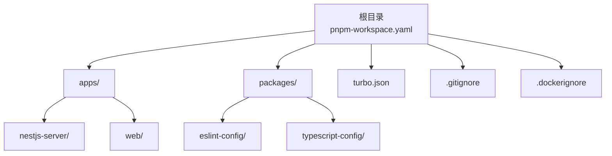
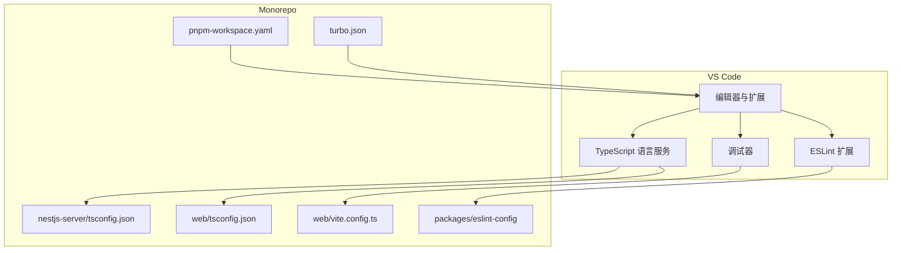
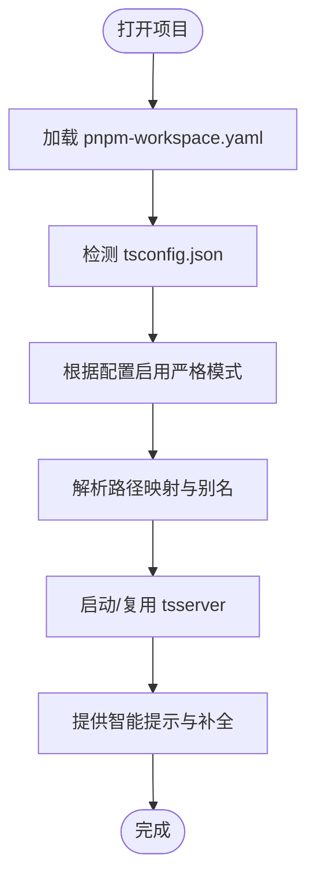
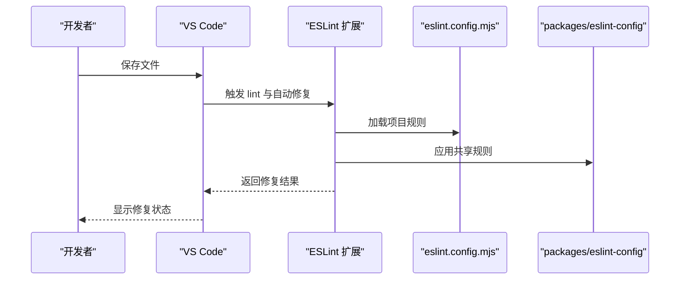
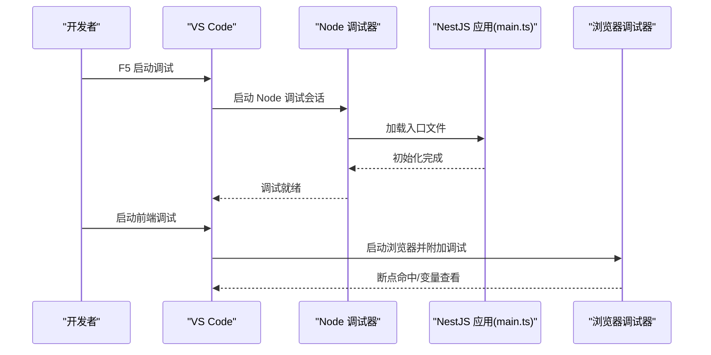
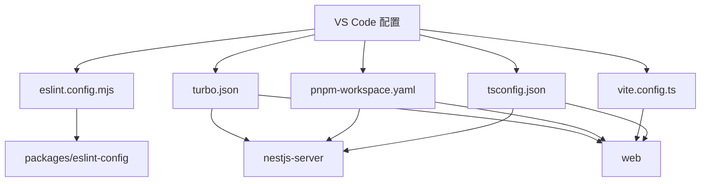

# IDE 配置

<cite>
**本文引用的文件**
- [apps/nestjs-server/package.json](file://apps/nestjs-server/package.json)
- [apps/nestjs-server/tsconfig.json](file://apps/nestjs-server/tsconfig.json)
- [apps/nestjs-server/eslint.config.mjs](file://apps/nestjs-server/eslint.config.mjs)
- [apps/web/package.json](file://apps/web/package.json)
- [apps/web/tsconfig.json](file://apps/web/tsconfig.json)
- [apps/web/vite.config.ts](file://apps/web/vite.config.ts)
- [apps/web/eslint.config.mjs](file://apps/web/eslint.config.mjs)
- [packages/eslint-config/package.json](file://packages/eslint-config/package.json)
- [packages/typescript-config/package.json](file://packages/typescript-config/package.json)
- [turbo.json](file://turbo.json)
- [pnpm-workspace.yaml](file://pnpm-workspace.yaml)
- [apps/nestjs-server/src/main.ts](file://apps/nestjs-server/src/main.ts)
- [apps/web/src/main.tsx](file://apps/web/src/main.tsx)
- [apps/nestjs-server/.dockerignore](file://apps/nestjs-server/.dockerignore)
- [apps/web/.gitignore](file://apps/web/.gitignore)
</cite>

## 目录
1. [简介](#简介)
2. [项目结构](#项目结构)
3. [核心组件](#核心组件)
4. [架构总览](#架构总览)
5. [详细组件分析](#详细组件分析)
6. [依赖关系分析](#依赖关系分析)
7. [性能考虑](#性能考虑)
8. [故障排除指南](#故障排除指南)
9. [结论](#结论)
10. [附录](#附录)

## 简介
本指南面向在 Nebula 项目中进行 TypeScript、React 与 NestJS 开发的团队，提供 VS Code 的推荐配置与插件清单，涵盖智能提示、代码补全、错误检查、调试设置、团队协作规范、快捷键与工作区模板，以及常见问题的解决方案与性能优化建议。内容基于仓库内现有配置文件与工程化实践提炼而来，确保与实际项目保持一致。

## 项目结构
Nebula 是一个基于 pnpm workspaces 的 Monorepo，包含以下主要部分：
- 应用层
  - NestJS 后端应用：apps/nestjs-server
  - React 前端应用：apps/web
- 工具包层
  - ESLint 规则包：packages/eslint-config
  - TypeScript 配置共享包：packages/typescript-config
- 根级配置
  - pnpm 工作区：pnpm-workspace.yaml
  - Turbo 构建系统：turbo.json
  - 通用忽略规则：.gitignore、.dockerignore

下图展示 VS Code 中的工作区视图与文件组织方式（概念示意）：

## 核心组件
本节聚焦于 IDE 配置的关键要素，结合项目中的实际配置文件进行说明。

- TypeScript 配置
  - NestJS 应用的 tsconfig.json 控制编译目标、模块解析策略与严格性选项，建议在 VS Code 中保持与之同步。
  - Web 应用的 tsconfig.json 与 Vite 配置共同决定类型检查与构建行为。
  - 共享 TypeScript 配置包可为多项目统一 TS 行为，减少重复配置。

- ESLint 集成
  - 项目采用 eslintrc 风格的配置文件（apps/*/eslint.config.mjs），VS Code 需启用 ESLint 扩展并配置自动修复与保存时检查。
  - packages/eslint-config 提供团队统一的规则集，建议在本地与 CI 保持一致。

- 包管理与工作区
  - pnpm-workspace.yaml 定义了工作区范围，VS Code 需正确识别 monorepo 结构以支持跨包跳转与智能提示。
  - turbo.json 指定任务与缓存策略，IDE 可通过任务面板或脚本运行器触发。

- 忽略文件
  - .dockerignore 与 .gitignore 决定 VS Code 文件资源管理器的显示与索引范围，避免不必要的文件被纳入搜索与诊断。

章节来源
- [apps/nestjs-server/tsconfig.json](file://apps/nestjs-server/tsconfig.json)
- [apps/web/tsconfig.json](file://apps/web/tsconfig.json)
- [apps/web/vite.config.ts](file://apps/web/vite.config.ts)
- [apps/nestjs-server/eslint.config.mjs](file://apps/nestjs-server/eslint.config.mjs)
- [apps/web/eslint.config.mjs](file://apps/web/eslint.config.mjs)
- [packages/eslint-config/package.json](file://packages/eslint-config/package.json)
- [packages/typescript-config/package.json](file://packages/typescript-config/package.json)
- [pnpm-workspace.yaml](file://pnpm-workspace.yaml)
- [turbo.json](file://turbo.json)
- [apps/nestjs-server/.dockerignore](file://apps/nestjs-server/.dockerignore)
- [apps/web/.gitignore](file://apps/web/.gitignore)

## 架构总览
下图展示 VS Code 在 Nebula 项目中的典型使用场景：编辑器加载工作区、TypeScript 服务解析类型、ESLint 进行静态检查、Vite/Node 启动调试会话。

## 详细组件分析

### TypeScript 配置与智能提示
- NestJS 应用
  - 使用 tsconfig.json 控制编译目标、路径映射与严格模式。建议在 VS Code 设置中选择与该配置匹配的 tsdk 或使用工作区内的 tsserver。
  - 若启用严格模式，IDE 将提供更准确的类型推断与未使用变量/未访问分支等提示。
- Web 应用
  - tsconfig.json 与 Vite 配置共同影响类型检查与导入解析。IDE 需要同时感知 tsconfig 与 Vite 的别名与路径映射。
- 共享配置
  - packages/typescript-config 可作为团队统一的 TS 基线，避免各应用重复维护相似规则。

章节来源
- [apps/nestjs-server/tsconfig.json](file://apps/nestjs-server/tsconfig.json)
- [apps/web/tsconfig.json](file://apps/web/tsconfig.json)
- [apps/web/vite.config.ts](file://apps/web/vite.config.ts)
- [packages/typescript-config/package.json](file://packages/typescript-config/package.json)
- [pnpm-workspace.yaml](file://pnpm-workspace.yaml)

### ESLint 静态检查与代码质量
- 配置位置
  - apps/nestjs-server 与 apps/web 均采用 eslintrc 风格的配置文件（eslint.config.mjs）。VS Code 需启用 ESLint 扩展并配置保存时自动修复。
- 规则来源
  - packages/eslint-config 提供团队统一规则，建议在本地与 CI 保持一致版本。
- 建议设置
  - 在 VS Code 中开启“编辑器保存时自动修复”与“ESLint：始终启用自动修复”，以减少提交前的冲突。

章节来源
- [apps/nestjs-server/eslint.config.mjs](file://apps/nestjs-server/eslint.config.mjs)
- [apps/web/eslint.config.mjs](file://apps/web/eslint.config.mjs)
- [packages/eslint-config/package.json](file://packages/eslint-config/package.json)

### 调试设置（NestJS 与 Web）
- NestJS 应用
  - 使用 main.ts 作为入口，可在 VS Code 中创建 launch.json，选择 Node 启动配置并指向 main.ts。
  - 建议启用“重启时附加”与“延迟启动”以适配热重载或数据库初始化。
- Web 应用（Vite）
  - 使用 Vite 启动开发服务器，可在 VS Code 中创建 Chrome/Edge 调试配置，连接到本地开发端口。
  - 对于 React 组件调试，建议使用“在浏览器中调试”并配合源码映射。

章节来源
- [apps/nestjs-server/src/main.ts](file://apps/nestjs-server/src/main.ts)
- [apps/web/src/main.tsx](file://apps/web/src/main.tsx)
- [apps/web/vite.config.ts](file://apps/web/vite.config.ts)

### 团队协作规范与工作区模板
- 工作区设置
  - 使用 VS Code 的工作区设置（.vscode/settings.json）统一团队的格式化、提示与诊断偏好。
  - 在工作区中固定推荐扩展列表，确保新成员快速上手。
- 插件清单（建议）
  - ESLint、Prettier、TypeScript TSServer、Tailwind CSS 支持、EditorConfig、DotENV、Debugger for Chrome/Firefox、GitLens、Bracket Pair Colorizer。
- 快捷键建议
  - 统一“保存时格式化”“保存时自动修复”“切换分屏”“查找下一个/上一个”等快捷键，减少上下文切换成本。
- 路径与忽略
  - 在工作区设置中显式声明排除项（如 .dockerignore/.gitignore 中的路径），避免 IDE 搜索与索引冗余文件。

章节来源
- [pnpm-workspace.yaml](file://pnpm-workspace.yaml)
- [apps/nestjs-server/.dockerignore](file://apps/nestjs-server/.dockerignore)
- [apps/web/.gitignore](file://apps/web/.gitignore)

## 依赖关系分析
IDE 配置与项目配置之间存在强耦合关系，下图展示 VS Code 与项目配置的依赖关系：

章节来源
- [apps/nestjs-server/tsconfig.json](file://apps/nestjs-server/tsconfig.json)
- [apps/web/tsconfig.json](file://apps/web/tsconfig.json)
- [apps/web/vite.config.ts](file://apps/web/vite.config.ts)
- [apps/nestjs-server/eslint.config.mjs](file://apps/nestjs-server/eslint.config.mjs)
- [apps/web/eslint.config.mjs](file://apps/web/eslint.config.mjs)
- [packages/eslint-config/package.json](file://packages/eslint-config/package.json)
- [pnpm-workspace.yaml](file://pnpm-workspace.yaml)
- [turbo.json](file://turbo.json)

## 性能考虑
- 类型检查与索引
  - 合理使用 tsconfig 的 include/exclude 与 composite/references，避免 IDE 对无关文件进行类型扫描。
  - 在大型 monorepo 中启用增量编译与隔离项目，减少 tsserver 占用。
- Lint 与格式化
  - 将 ESLint 与 Prettier 的执行范围限定在变更文件，避免全量扫描。
  - 在保存时仅执行必要的步骤，避免阻塞主线程。
- 资源占用
  - 关闭不必要的预览标签页与实时搜索，减少内存与 CPU 占用。
  - 使用工作区设置中的排除项，降低文件系统监控压力。

## 故障排除指南
- TypeScript 无法解析路径或模块
  - 确认 tsconfig.json 的路径映射与别名与实际一致；在 VS Code 中选择正确的 TS 版本（内置或工作区内）。
- ESLint 报错或规则不生效
  - 检查 eslint.config.mjs 是否正确加载；确认 packages/eslint-config 的版本与本地一致；清理缓存后重试。
- 调试无法断点
  - 确认 launch.json 的入口文件与运行参数；检查源码映射是否生成；浏览器调试需确保调试器已附加。
- Vite 启动异常
  - 清理 node_modules/.vite 缓存；检查 vite.config.ts 的别名与插件配置；确认端口未被占用。
- 工作区识别错误
  - 确认 pnpm-workspace.yaml 正确声明包路径；在 VS Code 中打开根目录而非子目录；必要时重新加载窗口。

章节来源
- [apps/nestjs-server/tsconfig.json](file://apps/nestjs-server/tsconfig.json)
- [apps/web/tsconfig.json](file://apps/web/tsconfig.json)
- [apps/web/vite.config.ts](file://apps/web/vite.config.ts)
- [apps/nestjs-server/eslint.config.mjs](file://apps/nestjs-server/eslint.config.mjs)
- [apps/web/eslint.config.mjs](file://apps/web/eslint.config.mjs)
- [pnpm-workspace.yaml](file://pnpm-workspace.yaml)

## 结论
通过统一的 TypeScript、ESLint 与调试配置，结合 VS Code 的工作区设置与插件生态，可以显著提升 Nebula 项目的开发效率与一致性。建议团队在工作区设置中固化推荐插件与快捷键，并定期同步 packages/eslint-config 与 packages/typescript-config 的版本，确保本地与 CI 环境一致。

## 附录
- VS Code 推荐插件清单（建议）
  - ESLint、Prettier、TypeScript TSServer、Tailwind CSS 支持、EditorConfig、DotENV、Debugger for Chrome/Firefox、GitLens、Bracket Pair Colorizer。
- 快捷键建议（示例）
  - 保存时格式化：Ctrl+Shift+P -> “首选项：设置保存时格式化”
  - 保存时自动修复：Ctrl+Shift+P -> “首选项：设置保存时自动修复”
  - 切换分屏：Ctrl+\ 或使用鼠标拖拽
  - 查找下一个/上一个：F3 / Shift+F3
- 工作区模板要点
  - 在 .vscode/settings.json 中统一格式化、提示与诊断偏好
  - 在 .vscode/extensions.json 中固定推荐扩展列表
  - 在 .vscode/launch.json 中提供 NestJS 与 Web 的调试配置模板
  - 在 .vscode/tasks.json 中提供常用任务（如启动、测试、构建）