# Shadcn/UI 技能系统

<cite>
**本文档引用的文件**
- [apps/web/src/components/ui/button.tsx](file://apps/web/src/components/ui/button.tsx)
- [apps/web/src/components/ui/card.tsx](file://apps/web/src/components/ui/card.tsx)
- [apps/web/src/components/ui/dialog.tsx](file://apps/web/src/components/ui/dialog.tsx)
- [apps/web/src/components/ui/table.tsx](file://apps/web/src/components/ui/table.tsx)
- [apps/web/src/components/ui/field.tsx](file://apps/web/src/components/ui/field.tsx)
- [apps/web/src/components/ui/pagination.tsx](file://apps/web/src/components/ui/pagination.tsx)
- [apps/web/src/components/data-table/data-table-column-header.tsx](file://apps/web/src/components/data-table/data-table-column-header.tsx)
- [apps/web/src/components/data-table/data-table-pagination.tsx](file://apps/web/src/components/data-table/data-table-pagination.tsx)
- [apps/web/src/components/data-table/data-table-view-options.tsx](file://apps/web/src/components/data-table/data-table-view-options.tsx)
- [apps/web/src/hooks/use-nebula-form.ts](file://apps/web/src/hooks/use-nebula-form.ts)
- [apps/web/src/store/auth.ts](file://apps/web/src/store/auth.ts)
- [apps/web/src/api/modules/auth/api.ts](file://apps/web/src/api/modules/auth/api.ts)
- [apps/web/src/pages/Users.tsx](file://apps/web/src/pages/Users.tsx)
- [apps/web/src/pages/Roles.tsx](file://apps/web/src/pages/Roles.tsx)
- [apps/web/src/pages/Menus.tsx](file://apps/web/src/pages/Menus.tsx)
- [apps/web/src/pages/Login.tsx](file://apps/web/src/pages/Login.tsx)
- [apps/web/src/lib/utils.ts](file://apps/web/src/lib/utils.ts)
- [apps/web/src/main.tsx](file://apps/web/src/main.tsx)
- [apps/nestjs-server/src/modules/auth/auth.service.ts](file://apps/nestjs-server/src/modules/auth/auth.service.ts)
- [apps/nestjs-server/src/modules/menu/menu.service.ts](file://apps/nestjs-server/src/modules/menu/menu.service.ts)
- [apps/nestjs-server/src/app.module.ts](file://apps/nestjs-server/src/app.module.ts)
- [apps/nestjs-server/prisma/schema/Menu.prisma](file://apps/nestjs-server/prisma/schema/Menu.prisma)
- [packages/shared/src/index.ts](file://packages/shared/src/index.ts)
- [apps/web/src/api/index.ts](file://apps/web/src/api/index.ts)
- [apps/web/src/api/modules/menu/api.ts](file://apps/web/src/api/modules/menu/api.ts)
- [apps/web/src/api/modules/menu/hooks.ts](file://apps/web/src/api/modules/menu/hooks.ts)
</cite>

## 更新摘要
**所做更改**
- 新增数据表格组件模块化架构文档
- 更新分页组件系统从 DataTablePagination 到新的 Pagination 组件
- 新增数据表格专用组件的详细说明
- 更新架构概览以反映模块化设计
- 增强数据表格组件系统的依赖关系分析

## 目录
1. [简介](#简介)
2. [项目结构](#项目结构)
3. [核心组件](#核心组件)
4. [架构概览](#架构概览)
5. [详细组件分析](#详细组件分析)
6. [依赖关系分析](#依赖关系分析)
7. [性能考虑](#性能考虑)
8. [故障排除指南](#故障排除指南)
9. [结论](#结论)

## 简介

这是一个基于 NestJS 和 React 的全栈应用，采用 Shadcn/UI 设计系统的技能管理系统。项目实现了完整的用户认证、角色管理、菜单权限管理和数据表格功能，使用了现代化的前端技术栈和后端架构模式。

系统特点：
- 前端使用 React + TypeScript + TailwindCSS + Shadcn/UI 组件库
- 后端使用 NestJS + Prisma ORM + JWT 认证
- 支持响应式设计和无障碍访问
- 实现了完整的 CRUD 操作和数据验证
- 提供了丰富的 UI 组件和交互体验
- **新增**：完整的菜单权限管理系统和表单验证框架
- **新增**：模块化的数据表格组件架构和新的分页组件系统

## 项目结构

项目采用 Monorepo 结构，包含前端 Web 应用、后端 NestJS 服务器和共享类型定义包：

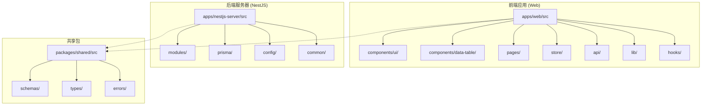

**图表来源**
- [apps/web/src/main.tsx:1-23](file://apps/web/src/main.tsx#L1-L23)
- [apps/nestjs-server/src/app.module.ts:1-67](file://apps/nestjs-server/src/app.module.ts#L1-L67)
- [packages/shared/src/index.ts:1-15](file://packages/shared/src/index.ts#L1-L15)

**章节来源**
- [apps/web/src/main.tsx:1-23](file://apps/web/src/main.tsx#L1-L23)
- [apps/nestjs-server/src/app.module.ts:1-67](file://apps/nestjs-server/src/app.module.ts#L1-L67)
- [packages/shared/src/index.ts:1-15](file://packages/shared/src/index.ts#L1-L15)

## 核心组件

### UI 组件系统

系统实现了完整的 Shadcn/UI 组件库，包括基础组件、复合组件和新增的表单组件：

#### 基础组件
- **Button**: 支持多种变体和尺寸的按钮组件
- **Card**: 卡片布局组件，支持头部、内容、底部等区域
- **Dialog**: 对话框组件，支持模态对话和关闭控制
- **Table**: 数据表格组件，支持排序、分页和响应式设计
- **Field**: 新增的表单字段容器组件，提供统一的表单布局和错误处理
- **Pagination**: 新的分页组件系统，支持多种分页模式和交互方式

#### 复合组件
- **DataTable**: 基于模块化架构的数据表格系统
- **Auth Store**: Zustand 状态管理的认证状态存储

#### 表单组件系统
- **useNebulaForm**: 新增的自定义表单钩子，提供统一的表单处理模式和验证系统

#### 数据表格组件系统
**更新** 数据表格组件已重构为模块化架构，包含多个专用组件：

- **DataTableColumnHeader**: 列标题组件，支持排序和列操作
- **DataTablePagination**: 分页组件，支持服务器端和客户端分页
- **DataTableViewOptions**: 视图选项组件，支持列可见性和显示设置
- **DataTable**: 主数据表格组件，集成所有专用组件

**章节来源**
- [apps/web/src/components/ui/button.tsx:1-68](file://apps/web/src/components/ui/button.tsx#L1-L68)
- [apps/web/src/components/ui/card.tsx:1-89](file://apps/web/src/components/ui/card.tsx#L1-L89)
- [apps/web/src/components/ui/dialog.tsx:1-146](file://apps/web/src/components/ui/dialog.tsx#L1-L146)
- [apps/web/src/components/ui/table.tsx:1-90](file://apps/web/src/components/ui/table.tsx#L1-L90)
- [apps/web/src/components/ui/field.tsx:1-120](file://apps/web/src/components/ui/field.tsx#L1-L120)
- [apps/web/src/components/ui/pagination.tsx:1-150](file://apps/web/src/components/ui/pagination.tsx#L1-L150)
- [apps/web/src/components/data-table/data-table-column-header.tsx:1-120](file://apps/web/src/components/data-table/data-table-column-header.tsx#L1-L120)
- [apps/web/src/components/data-table/data-table-pagination.tsx:1-180](file://apps/web/src/components/data-table/data-table-pagination.tsx#L1-L180)
- [apps/web/src/components/data-table/data-table-view-options.tsx:1-140](file://apps/web/src/components/data-table/data-table-view-options.tsx#L1-L140)
- [apps/web/src/hooks/use-nebula-form.ts:1-200](file://apps/web/src/hooks/use-nebula-form.ts#L1-L200)

### 状态管理

使用 Zustand 实现轻量级状态管理，主要处理认证相关的状态：

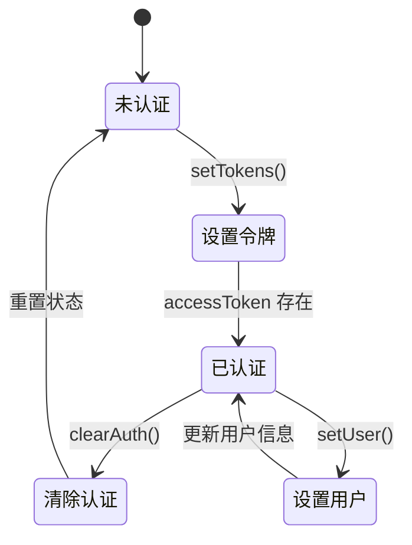

**图表来源**
- [apps/web/src/store/auth.ts:1-64](file://apps/web/src/store/auth.ts#L1-L64)

**章节来源**
- [apps/web/src/store/auth.ts:1-64](file://apps/web/src/store/auth.ts#L1-L64)

## 架构概览

系统采用前后端分离架构，结合了现代的开发模式和技术栈：

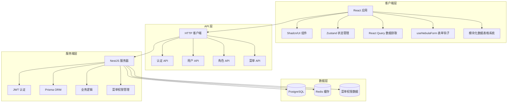

**图表来源**
- [apps/web/src/main.tsx:1-23](file://apps/web/src/main.tsx#L1-L23)
- [apps/web/src/api/modules/auth/api.ts:1-45](file://apps/web/src/api/modules/auth/api.ts#L1-L45)
- [apps/nestjs-server/src/modules/auth/auth.service.ts:1-151](file://apps/nestjs-server/src/modules/auth/auth.service.ts#L1-L151)
- [apps/nestjs-server/src/modules/menu/menu.service.ts:1-121](file://apps/nestjs-server/src/modules/menu/menu.service.ts#L1-L121)

**章节来源**
- [apps/web/src/main.tsx:1-23](file://apps/web/src/main.tsx#L1-L23)
- [apps/web/src/api/modules/auth/api.ts:1-45](file://apps/web/src/api/modules/auth/api.ts#L1-L45)
- [apps/nestjs-server/src/modules/auth/auth.service.ts:1-151](file://apps/nestjs-server/src/modules/auth/auth.service.ts#L1-L151)
- [apps/nestjs-server/src/modules/menu/menu.service.ts:1-121](file://apps/nestjs-server/src/modules/menu/menu.service.ts#L1-L121)

## 详细组件分析

### 认证系统

认证系统实现了完整的用户认证流程，包括登录、注册、刷新令牌和登出功能。

#### 认证服务架构

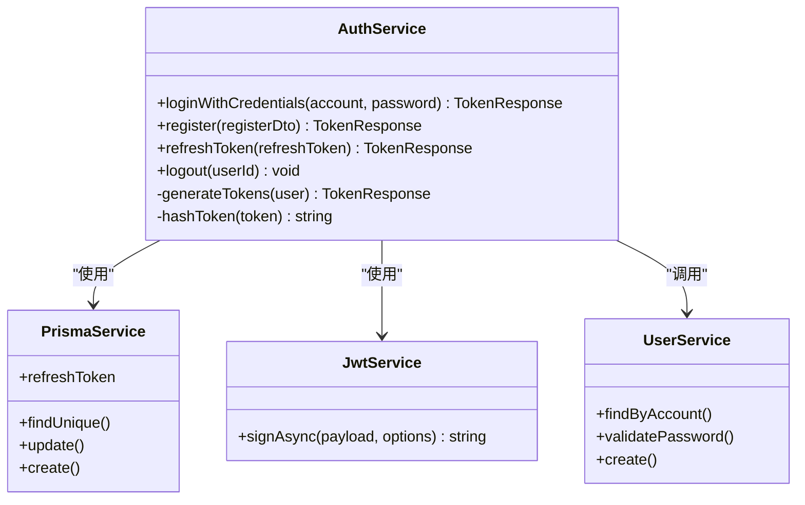

**图表来源**
- [apps/nestjs-server/src/modules/auth/auth.service.ts:14-151](file://apps/nestjs-server/src/modules/auth/auth.service.ts#L14-L151)

#### 认证流程序列图

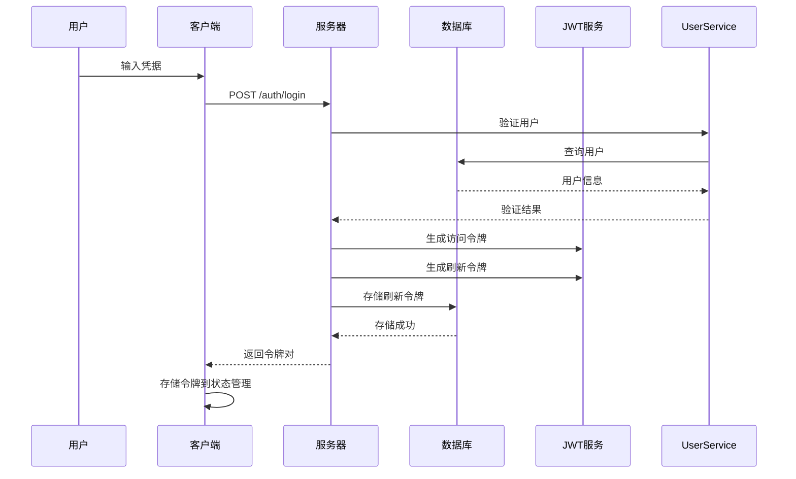

**图表来源**
- [apps/nestjs-server/src/modules/auth/auth.service.ts:29-84](file://apps/nestjs-server/src/modules/auth/auth.service.ts#L29-L84)
- [apps/web/src/api/modules/auth/api.ts:24-30](file://apps/web/src/api/modules/auth/api.ts#L24-L30)

**章节来源**
- [apps/nestjs-server/src/modules/auth/auth.service.ts:1-151](file://apps/nestjs-server/src/modules/auth/auth.service.ts#L1-L151)
- [apps/web/src/api/modules/auth/api.ts:1-45](file://apps/web/src/api/modules/auth/api.ts#L1-L45)

### 菜单权限管理系统

系统实现了完整的菜单权限管理功能，支持层级菜单结构和细粒度权限控制。

#### 菜单服务架构

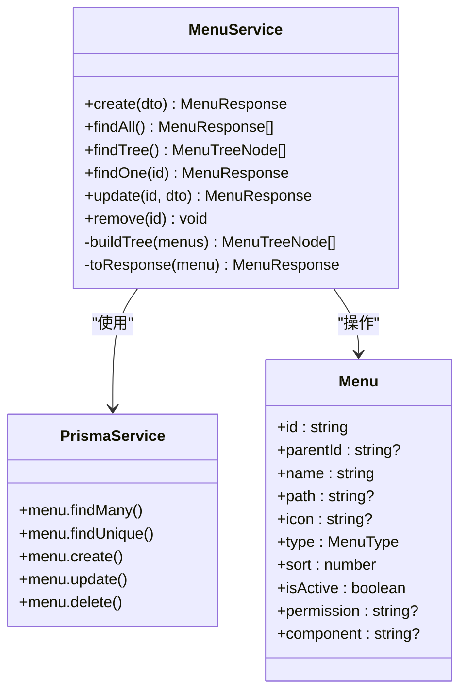

**图表来源**
- [apps/nestjs-server/src/modules/menu/menu.service.ts:15-121](file://apps/nestjs-server/src/modules/menu/menu.service.ts#L15-L121)

#### 菜单树形结构

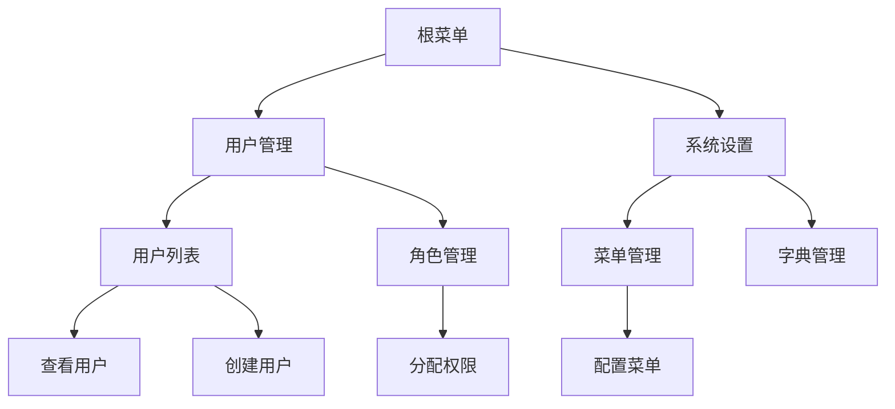

**图表来源**
- [apps/nestjs-server/src/modules/menu/menu.service.ts:85-103](file://apps/nestjs-server/src/modules/menu/menu.service.ts#L85-L103)

**章节来源**
- [apps/nestjs-server/src/modules/menu/menu.service.ts:1-121](file://apps/nestjs-server/src/modules/menu/menu.service.ts#L1-L121)
- [apps/nestjs-server/prisma/schema/Menu.prisma:1-27](file://apps/nestjs-server/prisma/schema/Menu.prisma#L1-L27)

### 数据表格组件系统

**更新** 数据表格组件已重构为模块化架构，提供更清晰的职责分离和更好的可维护性。

#### 模块化架构设计

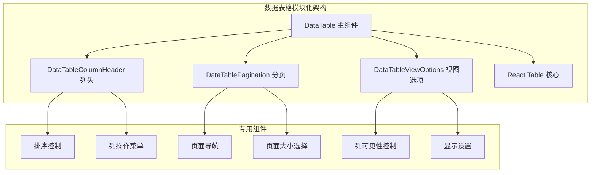

**图表来源**
- [apps/web/src/components/data-table/data-table-column-header.tsx:1-120](file://apps/web/src/components/data-table/data-table-column-header.tsx#L1-L120)
- [apps/web/src/components/data-table/data-table-pagination.tsx:1-180](file://apps/web/src/components/data-table/data-table-pagination.tsx#L1-L180)
- [apps/web/src/components/data-table/data-table-view-options.tsx:1-140](file://apps/web/src/components/data-table/data-table-view-options.tsx#L1-L140)

#### DataTableColumnHeader 组件

列标题组件支持排序功能和列操作菜单：

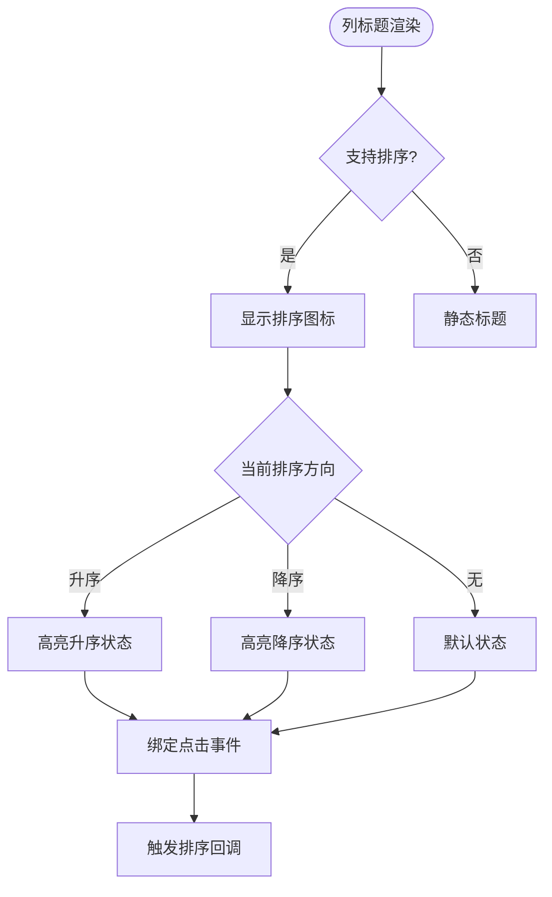

**图表来源**
- [apps/web/src/components/data-table/data-table-column-header.tsx:25-80](file://apps/web/src/components/data-table/data-table-column-header.tsx#L25-L80)

#### DataTablePagination 组件

**更新** 分页组件已重构为新的 Pagination 组件系统，支持更灵活的分页控制：

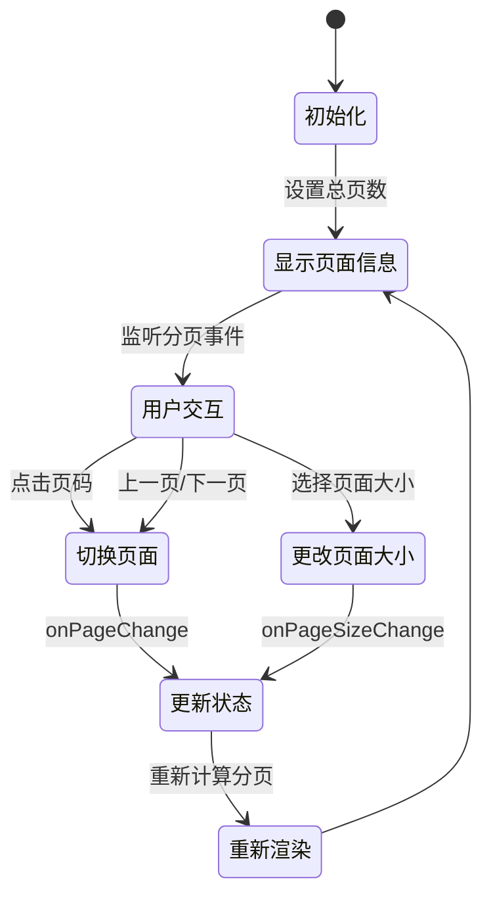

**图表来源**
- [apps/web/src/components/data-table/data-table-pagination.tsx:15-120](file://apps/web/src/components/data-table/data-table-pagination.tsx#L15-L120)

#### DataTableViewOptions 组件

视图选项组件提供列可见性和显示设置功能：

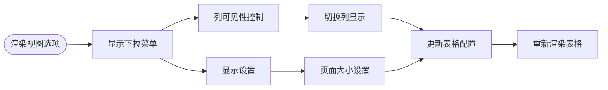

**图表来源**
- [apps/web/src/components/data-table/data-table-view-options.tsx:20-100](file://apps/web/src/components/data-table/data-table-view-options.tsx#L20-L100)

**章节来源**
- [apps/web/src/components/data-table/data-table-column-header.tsx:1-120](file://apps/web/src/components/data-table/data-table-column-header.tsx#L1-L120)
- [apps/web/src/components/data-table/data-table-pagination.tsx:1-180](file://apps/web/src/components/data-table/data-table-pagination.tsx#L1-L180)
- [apps/web/src/components/data-table/data-table-view-options.tsx:1-140](file://apps/web/src/components/data-table/data-table-view-options.tsx#L1-L140)

### 页面组件

#### 用户管理页面

Users 页面实现了完整的用户 CRUD 操作，包括创建、编辑、删除用户功能。

#### 角色管理页面

Roles 页面提供了角色的管理界面，支持角色的增删改查操作。

#### 菜单管理页面

Menus 页面实现了完整的菜单权限管理功能，支持菜单的层级结构管理、权限标识设置和显示控制。

#### 登录页面迁移

Login 页面已完全迁移到新的表单架构，使用 useNebulaForm 钩子提供更好的表单处理模式和验证系统。

**章节来源**
- [apps/web/src/pages/Users.tsx:1-241](file://apps/web/src/pages/Users.tsx#L1-L241)
- [apps/web/src/pages/Roles.tsx:1-202](file://apps/web/src/pages/Roles.tsx#L1-L202)
- [apps/web/src/pages/Menus.tsx:255-441](file://apps/web/src/pages/Menus.tsx#L255-L441)
- [apps/web/src/pages/Login.tsx:1-300](file://apps/web/src/pages/Login.tsx#L1-L300)

## 依赖关系分析

**更新** 依赖关系已更新以反映模块化架构和新的分页组件系统：

```mermaid
graph TB
subgraph "前端依赖"
A[react] --> B[@tanstack/react-table]
A --> C[zustand]
A --> D[react-hook-form]
A --> E[lucide-react]
F[tailwindcss] --> G[clsx]
F --> H[tw-merge]
I[useNebulaForm] --> D
J[Field 组件] --> K[react-hook-form]
L[模块化数据表格] --> B
L --> M[DataTableColumnHeader]
L --> N[DataTablePagination]
L --> O[DataTableViewOptions]
P[Pagination 组件] --> B
end
subgraph "后端依赖"
Q[@nestjs/common] --> R[@nestjs/jwt]
Q --> S[@nestjs/passport]
T[prisma] --> U[@prisma/client]
V[dayjs] --> W[时间处理]
X[菜单权限] --> Y[角色关联]
end
subgraph "共享依赖"
Z[@nebula/shared] --> AA[Zod 验证]
Z --> AB[TypeScript 类型]
Z --> AC[菜单树形结构]
end
A --> Z
Q --> Z
```

**图表来源**
- [apps/web/src/components/ui/button.tsx:1-68](file://apps/web/src/components/ui/button.tsx#L1-L68)
- [apps/web/src/hooks/use-nebula-form.ts:1-200](file://apps/web/src/hooks/use-nebula-form.ts#L1-L200)
- [apps/web/src/components/ui/field.tsx:1-120](file://apps/web/src/components/ui/field.tsx#L1-L120)
- [apps/web/src/components/ui/pagination.tsx:1-150](file://apps/web/src/components/ui/pagination.tsx#L1-L150)
- [apps/web/src/components/data-table/data-table-pagination.tsx:1-180](file://apps/web/src/components/data-table/data-table-pagination.tsx#L1-L180)
- [apps/nestjs-server/src/modules/auth/auth.service.ts:1-151](file://apps/nestjs-server/src/modules/auth/auth.service.ts#L1-L151)
- [apps/nestjs-server/src/modules/menu/menu.service.ts:1-121](file://apps/nestjs-server/src/modules/menu/menu.service.ts#L1-L121)
- [packages/shared/src/index.ts:1-15](file://packages/shared/src/index.ts#L1-L15)

**章节来源**
- [apps/web/src/lib/utils.ts:1-7](file://apps/web/src/lib/utils.ts#L1-L7)
- [apps/web/src/api/index.ts:1-41](file://apps/web/src/api/index.ts#L1-L41)

## 性能考虑

### 前端性能优化

**更新** 性能优化已更新以包含模块化架构的优势：

1. **组件懒加载**: 使用 React.lazy 和 Suspense 实现组件懒加载
2. **状态管理优化**: 使用 Zustand 替代 Redux，减少不必要的重渲染
3. **数据缓存**: 使用 React Query 进行数据缓存和状态同步
4. **样式优化**: 使用 TailwindCSS 的原子化类名，避免样式冲突
5. **表单优化**: useNebulaForm 钩子提供高效的表单状态管理和验证
6. **模块化优化**: 数据表格组件模块化架构减少不必要的重渲染
7. **分页优化**: 新的 Pagination 组件系统提供更高效的分页控制

### 后端性能优化

1. **数据库连接池**: 配置合适的连接池大小
2. **查询优化**: 使用 Prisma 的预取和联接优化
3. **缓存策略**: 使用 Redis 缓存热点数据
4. **限流机制**: 实现多级别的请求限流保护
5. **菜单树优化**: 使用递归查询和内存映射优化菜单树构建

## 故障排除指南

### 常见问题及解决方案

#### 认证相关问题

1. **登录失败**
   - 检查用户名和密码是否正确
   - 验证用户是否被激活
   - 确认密码哈希验证是否通过

#### 表单相关问题

1. **表单验证失败**
   - 检查 useNebulaForm 配置
   - 验证 Zod Schema 定义
   - 确认字段映射是否正确

2. **Field 组件显示异常**
   - 检查 Field 组件的子元素结构
   - 验证 FieldLabel 和 FieldError 的使用
   - 确认 aria-invalid 属性绑定

#### 数据表格相关问题

**更新** 新增数据表格组件相关的故障排除：

1. **数据表格渲染异常**
   - 检查 DataTableColumnHeader 组件的列定义
   - 验证 DataTablePagination 组件的分页状态
   - 确认 DataTableViewOptions 组件的配置

2. **分页功能失效**
   - 检查 Pagination 组件的事件处理器
   - 验证分页参数传递是否正确
   - 确认服务器端分页接口响应

3. **模块化组件导入错误**
   - 检查数据表格组件的导入路径
   - 验证组件导出接口是否完整
   - 确认组件依赖关系正确

#### 菜单权限问题

1. **菜单不显示**
   - 检查菜单的 isVisible 字段
   - 验证用户角色权限
   - 确认菜单层级关系

2. **权限验证失败**
   - 检查权限标识字符串
   - 验证角色与菜单的关联
   - 确认权限匹配规则

**章节来源**
- [apps/nestjs-server/src/modules/auth/auth.service.ts:29-84](file://apps/nestjs-server/src/modules/auth/auth.service.ts#L29-L84)
- [apps/web/src/components/data-table/data-table-pagination.tsx:15-120](file://apps/web/src/components/data-table/data-table-pagination.tsx#L15-L120)
- [apps/web/src/hooks/use-nebula-form.ts:1-200](file://apps/web/src/hooks/use-nebula-form.ts#L1-L200)
- [apps/nestjs-server/src/modules/menu/menu.service.ts:50-83](file://apps/nestjs-server/src/modules/menu/menu.service.ts#L50-L83)

## 结论

这个 Shadcn/UI 技能系统展示了现代全栈应用的最佳实践，结合了优秀的前端组件库和后端架构模式。系统经过重大架构升级，具有以下优势：

1. **模块化设计**: 清晰的项目结构和模块划分
2. **类型安全**: 完整的 TypeScript 类型定义
3. **用户体验**: 响应式的 UI 设计和流畅的交互
4. **可维护性**: 良好的代码组织和文档规范
5. **扩展性**: 灵活的架构支持功能扩展
6. **表单系统**: 新增的 useNebulaForm 钩子提供统一的表单处理模式
7. **权限管理**: 完整的菜单权限管理系统支持细粒度的权限控制
8. **数据表格系统**: 模块化的数据表格组件架构提供更好的可维护性和扩展性
9. **分页组件**: 新的 Pagination 组件系统提供更灵活的分页控制和更好的用户体验

通过使用 Shadcn/UI 组件库、现代化的表单架构、模块化的数据表格系统和菜单权限管理功能，该系统为开发者提供了一个高质量的起点，可以在此基础上快速构建企业级应用。