# UI/UX Pro Max 技能系统

<cite>
**本文档引用的文件**
- [apps/web/src/pages/Users.tsx](file://apps/web/src/pages/Users.tsx)
- [apps/web/src/pages/Roles.tsx](file://apps/web/src/pages/Roles.tsx)
- [apps/web/src/api/modules/user/api.ts](file://apps/web/src/api/modules/user/api.ts)
- [apps/web/src/api/modules/role/api.ts](file://apps/web/src/api/modules/role/api.ts)
- [apps/nestjs-server/src/modules/user/user.service.ts](file://apps/nestjs-server/src/modules/user/user.service.ts)
- [apps/nestjs-server/src/modules/role/role.service.ts](file://apps/nestjs-server/src/modules/role/role.service.ts)
- [apps/web/src/components/data-table/create-column-helper.ts](file://apps/web/src/components/data-table/create-column-helper.ts)
- [apps/web/src/components/data-table/data-table-column-header.tsx](file://apps/web/src/components/data-table/data-table-column-header.tsx)
- [apps/web/src/components/data-table/data-table-pagination.tsx](file://apps/web/src/components/data-table/data-table-pagination.tsx)
- [apps/web/src/components/data-table/data-table-view-options.tsx](file://apps/web/src/components/data-table/data-table-view-options.tsx)
- [apps/web/src/components/data-table/index.ts](file://apps/web/src/components/data-table/index.ts)
- [apps/web/src/components/ui/pagination.tsx](file://apps/web/src/components/ui/pagination.tsx)
- [apps/web/src/hooks/use-nebula-form.ts](file://apps/web/src/hooks/use-nebula-form.ts)
- [apps/web/src/layouts/MainLayout.tsx](file://apps/web/src/layouts/MainLayout.tsx)
- [apps/web/src/router/index.tsx](file://apps/web/src/router/index.tsx)
- [apps/web/src/store/auth.ts](file://apps/web/src/store/auth.ts)
- [apps/web/src/store/ui.ts](file://apps/web/src/store/ui.ts)
- [apps/web/src/components/ui/button.tsx](file://apps/web/src/components/ui/button.tsx)
- [apps/web/src/components/ui/dialog.tsx](file://apps/web/src/components/ui/dialog.tsx)
</cite>

## 更新摘要
**所做更改**
- 更新数据表格组件架构部分，反映从单体 DataTable 组件到模块化组件系统的重构
- 新增模块化数据表格组件详细分析章节
- 更新架构概览以体现新的组件组织方式
- 更新依赖关系分析以反映新的组件结构
- 移除过时的单体 DataTable 组件引用

## 目录
1. [简介](#简介)
2. [项目结构](#项目结构)
3. [核心组件](#核心组件)
4. [架构概览](#架构概览)
5. [详细组件分析](#详细组件分析)
6. [模块化数据表格组件系统](#模块化数据表格组件系统)
7. [依赖关系分析](#依赖关系分析)
8. [性能考虑](#性能考虑)
9. [故障排除指南](#故障排除指南)
10. [结论](#结论)

## 简介

UI/UX Pro Max 技能系统是一个基于 React + NestJS 构建的企业级管理系统，专注于提供卓越的用户体验和界面设计。该系统采用现代化的技术栈，包括 TypeScript、Zod 数据验证、React Hook Form、TanStack Table 等，实现了完整的用户管理和角色管理功能。

系统的核心特色包括：
- **响应式设计**：支持桌面端和移动端的无缝体验
- **主题系统**：内置明暗主题切换功能
- **模块化数据表格**：高性能的模块化数据展示和交互能力
- **表单验证**：基于 Zod 的强类型表单验证
- **状态管理**：使用 Zustand 进行轻量级状态管理
- **路由保护**：完整的认证和授权机制

## 项目结构

该项目采用 Monorepo 结构，主要包含以下核心模块：

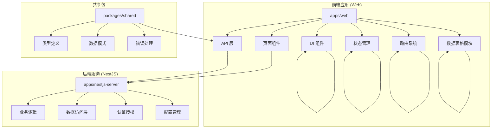

**图表来源**
- [apps/web/src/pages/Users.tsx:1-241](file://apps/web/src/pages/Users.tsx#L1-L241)
- [apps/nestjs-server/src/modules/user/user.service.ts:1-113](file://apps/nestjs-server/src/modules/user/user.service.ts#L1-L113)

**章节来源**
- [apps/web/src/pages/Users.tsx:1-241](file://apps/web/src/pages/Users.tsx#L1-L241)
- [apps/nestjs-server/src/modules/user/user.service.ts:1-113](file://apps/nestjs-server/src/modules/user/user.service.ts#L1-L113)

## 核心组件

### 用户管理系统

用户管理系统是整个 UI/UX Pro Max 技能系统的核心功能模块，提供了完整的用户生命周期管理：

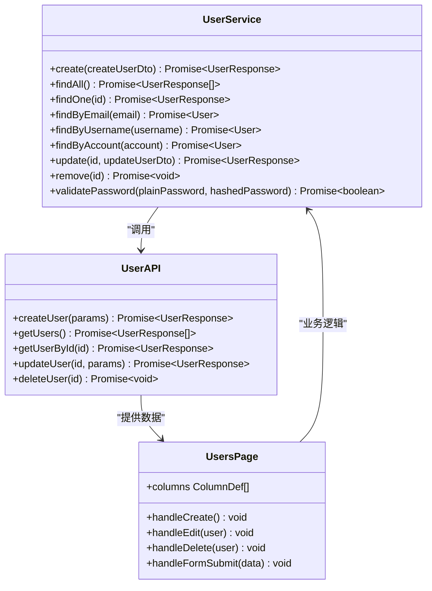

**图表来源**
- [apps/nestjs-server/src/modules/user/user.service.ts:14-113](file://apps/nestjs-server/src/modules/user/user.service.ts#L14-L113)
- [apps/web/src/api/modules/user/api.ts:1-34](file://apps/web/src/api/modules/user/api.ts#L1-L34)
- [apps/web/src/pages/Users.tsx:129-241](file://apps/web/src/pages/Users.tsx#L129-L241)

### 角色管理系统

角色管理系统负责权限控制和菜单分配：

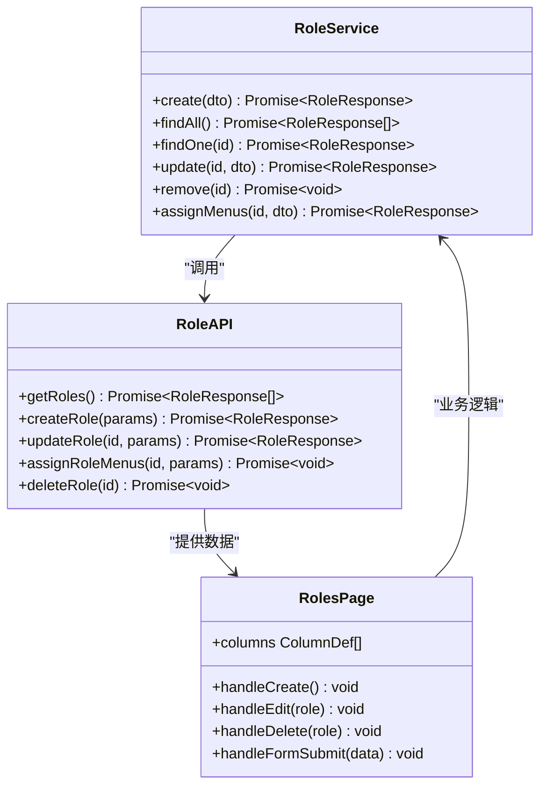

**图表来源**
- [apps/nestjs-server/src/modules/role/role.service.ts:14-128](file://apps/nestjs-server/src/modules/role/role.service.ts#L14-L128)
- [apps/web/src/api/modules/role/api.ts:1-32](file://apps/web/src/api/modules/role/api.ts#L1-L32)
- [apps/web/src/pages/Roles.tsx:96-202](file://apps/web/src/pages/Roles.tsx#L96-L202)

**章节来源**
- [apps/web/src/pages/Users.tsx:1-241](file://apps/web/src/pages/Users.tsx#L1-L241)
- [apps/web/src/pages/Roles.tsx:1-202](file://apps/web/src/pages/Roles.tsx#L1-L202)

## 架构概览

系统采用前后端分离的微服务架构，通过清晰的层次结构实现关注点分离：

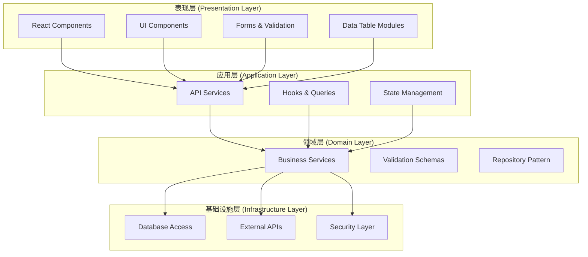

**图表来源**
- [apps/web/src/components/data-table/index.ts:1-50](file://apps/web/src/components/data-table/index.ts#L1-L50)
- [apps/web/src/hooks/use-nebula-form.ts:16-31](file://apps/web/src/hooks/use-nebula-form.ts#L16-L31)
- [apps/nestjs-server/src/modules/user/user.service.ts:14-113](file://apps/nestjs-server/src/modules/user/user.service.ts#L14-L113)

## 详细组件分析

### 表单系统 (Nebula Form)

表单系统采用 React Hook Form + Zod 的组合，提供强大的表单验证和用户体验：

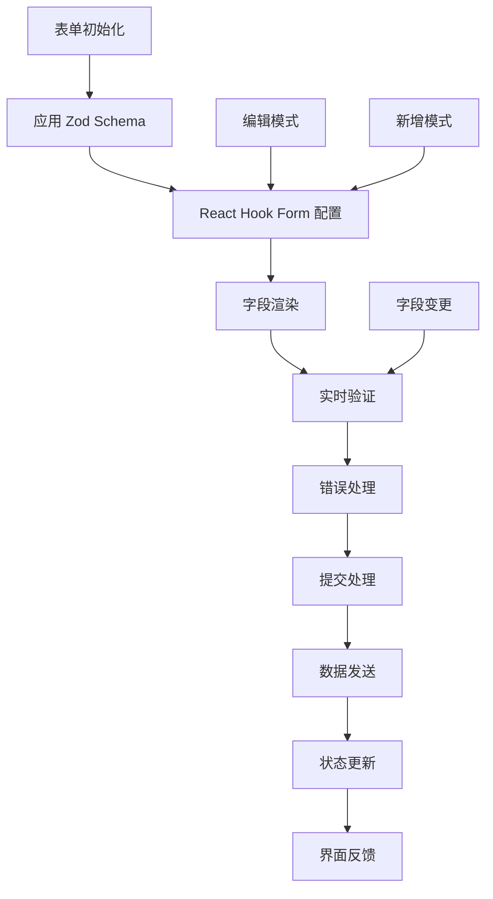

**图表来源**
- [apps/web/src/hooks/use-nebula-form.ts:16-31](file://apps/web/src/hooks/use-nebula-form.ts#L16-L31)
- [apps/web/src/pages/Users.tsx:34-43](file://apps/web/src/pages/Users.tsx#L34-L43)

#### 表单验证流程

1. **Schema 定义**：使用 Zod 定义严格的类型检查
2. **实时验证**：输入时即时反馈验证结果
3. **错误显示**：友好的错误消息提示
4. **提交处理**：统一的提交和错误处理

**章节来源**
- [apps/web/src/hooks/use-nebula-form.ts:1-31](file://apps/web/src/hooks/use-nebula-form.ts#L1-L31)
- [apps/web/src/pages/Users.tsx:31-127](file://apps/web/src/pages/Users.tsx#L31-L127)

### 对话框组件 (Dialog)

对话框组件提供了模态窗口的功能，支持多种交互场景：

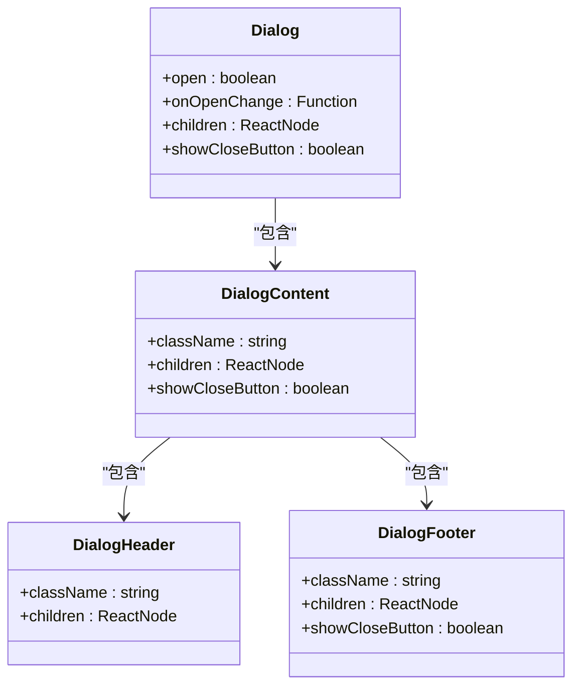

**图表来源**
- [apps/web/src/components/ui/dialog.tsx:10-146](file://apps/web/src/components/ui/dialog.tsx#L10-L146)

**章节来源**
- [apps/web/src/components/ui/dialog.tsx:1-146](file://apps/web/src/components/ui/dialog.tsx#L1-L146)

### 布局系统 (MainLayout)

主布局系统提供了完整的页面框架，包括导航、侧边栏和内容区域：

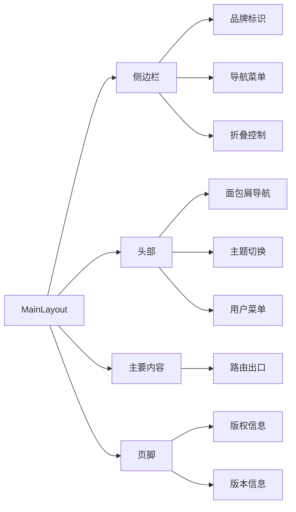

**图表来源**
- [apps/web/src/layouts/MainLayout.tsx:190-338](file://apps/web/src/layouts/MainLayout.tsx#L190-L338)

**章节来源**
- [apps/web/src/layouts/MainLayout.tsx:1-338](file://apps/web/src/layouts/MainLayout.tsx#L1-L338)

## 模块化数据表格组件系统

**更新** 数据表格组件架构已从单体 DataTable 组件重构为模块化组件系统，包括新的列头组件、分页组件和视图选项组件。

数据表格模块化系统由多个专门化的组件构成，每个组件负责特定的功能职责：

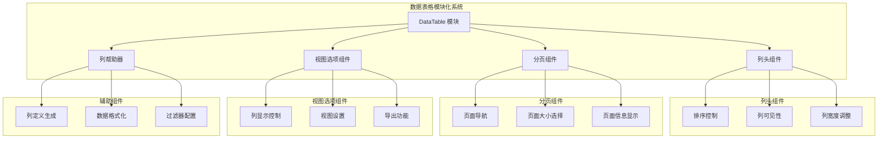

**图表来源**
- [apps/web/src/components/data-table/index.ts:1-50](file://apps/web/src/components/data-table/index.ts#L1-L50)
- [apps/web/src/components/data-table/data-table-column-header.tsx:1-120](file://apps/web/src/components/data-table/data-table-column-header.tsx#L1-L120)
- [apps/web/src/components/data-table/data-table-pagination.tsx:1-80](file://apps/web/src/components/data-table/data-table-pagination.tsx#L1-L80)
- [apps/web/src/components/data-table/data-table-view-options.tsx:1-100](file://apps/web/src/components/data-table/data-table-view-options.tsx#L1-L100)

### 列头组件 (DataTableColumnHeader)

列头组件负责处理表格列的排序、可见性和交互控制：

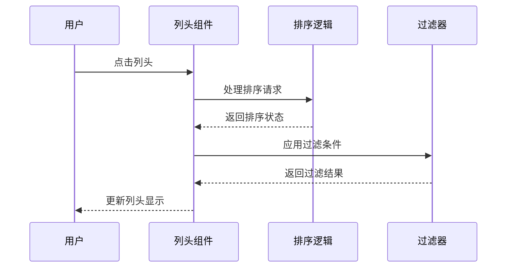

**图表来源**
- [apps/web/src/components/data-table/data-table-column-header.tsx:25-120](file://apps/web/src/components/data-table/data-table-column-header.tsx#L25-L120)

### 分页组件 (DataTablePagination)

分页组件提供完整的页面导航功能，支持页面大小选择和导航控制：

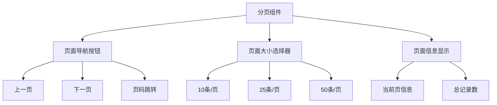

**图表来源**
- [apps/web/src/components/data-table/data-table-pagination.tsx:15-80](file://apps/web/src/components/data-table/data-table-pagination.tsx#L15-L80)
- [apps/web/src/components/ui/pagination.tsx:1-120](file://apps/web/src/components/ui/pagination.tsx#L1-L120)

### 视图选项组件 (DataTableViewOptions)

视图选项组件允许用户自定义表格显示方式和功能：

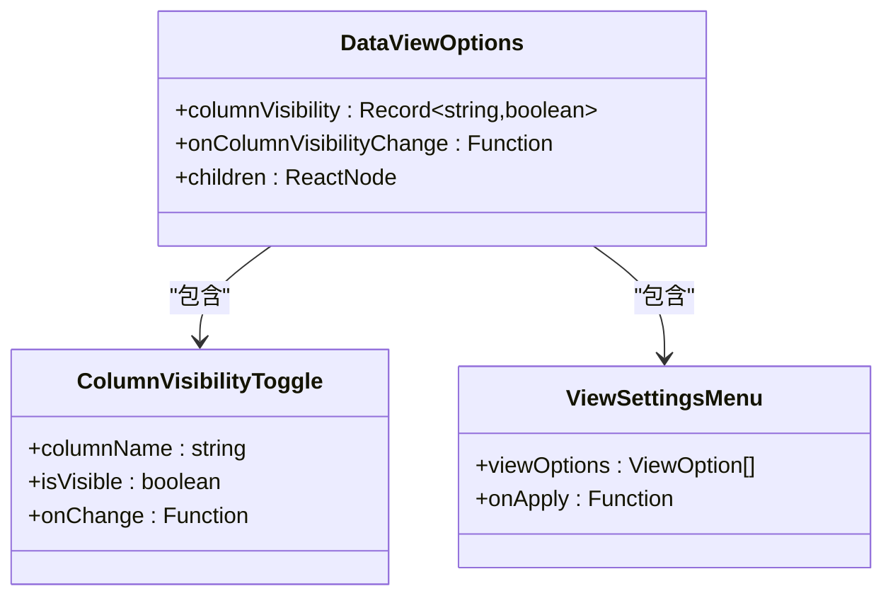

**图表来源**
- [apps/web/src/components/data-table/data-table-view-options.tsx:20-100](file://apps/web/src/components/data-table/data-table-view-options.tsx#L20-L100)

### 列帮助器 (CreateColumnHelper)

列帮助器提供统一的列定义创建和管理功能：

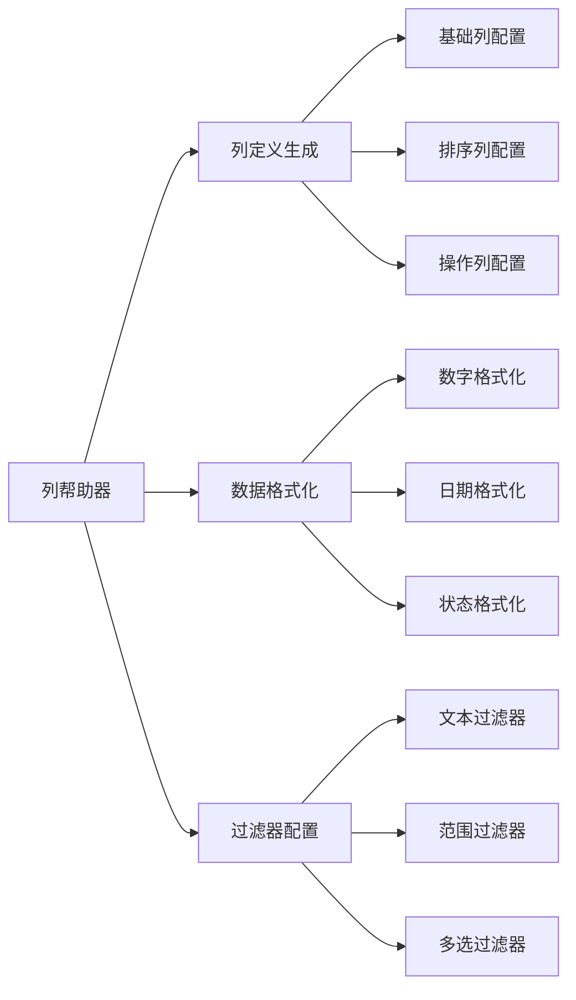

**图表来源**
- [apps/web/src/components/data-table/create-column-helper.ts:1-80](file://apps/web/src/components/data-table/create-column-helper.ts#L1-L80)

**章节来源**
- [apps/web/src/components/data-table/index.ts:1-50](file://apps/web/src/components/data-table/index.ts#L1-L50)
- [apps/web/src/components/data-table/data-table-column-header.tsx:1-120](file://apps/web/src/components/data-table/data-table-column-header.tsx#L1-L120)
- [apps/web/src/components/data-table/data-table-pagination.tsx:1-80](file://apps/web/src/components/data-table/data-table-pagination.tsx#L1-L80)
- [apps/web/src/components/data-table/data-table-view-options.tsx:1-100](file://apps/web/src/components/data-table/data-table-view-options.tsx#L1-L100)
- [apps/web/src/components/data-table/create-column-helper.ts:1-80](file://apps/web/src/components/data-table/create-column-helper.ts#L1-L80)

## 依赖关系分析

系统中的组件依赖关系呈现清晰的层次结构，模块化数据表格系统通过统一的入口点进行组织：

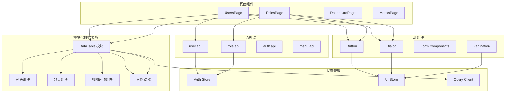

**图表来源**
- [apps/web/src/pages/Users.tsx:1-241](file://apps/web/src/pages/Users.tsx#L1-L241)
- [apps/web/src/pages/Roles.tsx:1-202](file://apps/web/src/pages/Roles.tsx#L1-L202)
- [apps/web/src/api/modules/user/api.ts:1-34](file://apps/web/src/api/modules/user/api.ts#L1-L34)
- [apps/web/src/components/data-table/index.ts:1-50](file://apps/web/src/components/data-table/index.ts#L1-L50)

**章节来源**
- [apps/web/src/router/index.tsx:1-53](file://apps/web/src/router/index.tsx#L1-L53)
- [apps/web/src/store/auth.ts:1-64](file://apps/web/src/store/auth.ts#L1-L64)
- [apps/web/src/store/ui.ts:1-88](file://apps/web/src/store/ui.ts#L1-L88)

## 性能考虑

### 前端性能优化

1. **模块化加载**：数据表格组件按需加载，减少初始包体积
2. **状态缓存**：React Query 的智能缓存机制
3. **虚拟滚动**：大数据集的性能优化
4. **组件记忆化**：React.memo 和 useMemo 的使用
5. **模块化复用**：独立组件的可复用性提高

### 后端性能优化

1. **数据库查询优化**：Prisma 的 select 优化
2. **缓存策略**：Redis 缓存集成
3. **并发处理**：异步任务队列
4. **连接池管理**：数据库连接池优化

## 故障排除指南

### 常见问题及解决方案

#### 表单验证错误
- **症状**：表单提交时报验证错误
- **原因**：Zod Schema 验证失败
- **解决**：检查字段类型和必填项配置

#### 数据加载失败
- **症状**：页面显示加载错误
- **原因**：API 请求失败或网络问题
- **解决**：检查网络连接和服务器状态

#### 认证失效
- **症状**：页面重定向到登录页
- **原因**：Token 过期或无效
- **解决**：重新登录或刷新 Token

#### 数据表格模块化问题
- **症状**：数据表格组件无法正常显示
- **原因**：模块导入路径错误或依赖缺失
- **解决**：检查模块入口文件和依赖关系

**章节来源**
- [apps/web/src/pages/Users.tsx:213-214](file://apps/web/src/pages/Users.tsx#L213-L214)
- [apps/web/src/pages/Roles.tsx:177-178](file://apps/web/src/pages/Roles.tsx#L177-L178)

## 结论

UI/UX Pro Max 技能系统展现了现代前端开发的最佳实践，通过精心设计的架构和组件体系，为用户提供了卓越的使用体验。系统的主要优势包括：

1. **技术栈先进**：采用最新的 React 和 NestJS 生态系统
2. **架构清晰**：分层架构确保了代码的可维护性
3. **用户体验优秀**：响应式设计和流畅的交互体验
4. **开发效率高**：完善的工具链和开发环境
5. **扩展性强**：模块化的架构便于功能扩展
6. **组件复用性高**：模块化组件系统提高了代码复用率

**更新** 最新的模块化数据表格组件系统显著提升了组件的可维护性和可扩展性，通过专门化的组件职责划分，使得数据表格功能更加灵活和强大。这种架构重构为系统的长期发展奠定了坚实的基础。

该系统为类似的企业级管理应用提供了一个优秀的参考模板，展示了如何在保证功能完整性的同时，最大化提升用户体验和开发效率。