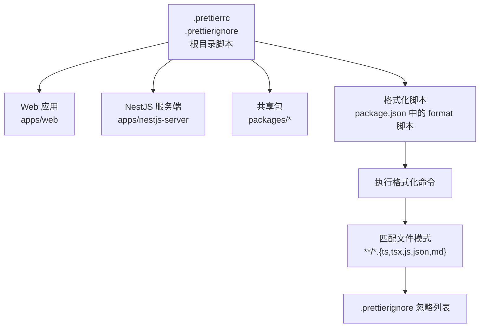
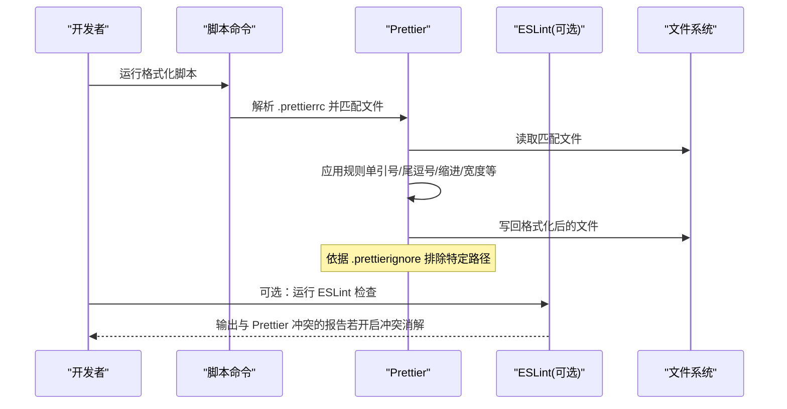
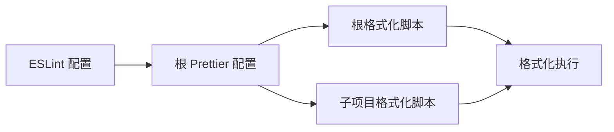

# 代码格式化

<cite>
**本文引用的文件**
- [.prettierrc](file://.prettierrc)
- [.prettierignore](file://.prettierignore)
- [package.json](file://package.json)
- [apps/nestjs-server/package.json](file://apps/nestjs-server/package.json)
- [packages/eslint-config/package.json](file://packages/eslint-config/package.json)
</cite>

## 目录
1. [简介](#简介)
2. [项目结构](#项目结构)
3. [核心组件](#核心组件)
4. [架构总览](#架构总览)
5. [详细组件分析](#详细组件分析)
6. [依赖关系分析](#依赖关系分析)
7. [性能与一致性考量](#性能与一致性考量)
8. [故障排查指南](#故障排查指南)
9. [结论](#结论)
10. [附录](#附录)

## 简介
本文件面向团队与个人开发者，系统性介绍本仓库的代码格式化体系，重点围绕 Prettier 的配置与使用展开，涵盖以下内容：
- Prettier 核心规则项的含义与取舍依据（如单引号、尾逗号、缩进宽度、打印宽度等）
- 命令行格式化脚本与执行范围
- VS Code 推荐插件与“保存时自动格式化”配置思路
- 团队协作中的统一规范与最佳实践
- 常见问题与排障建议

## 项目结构
本仓库采用 monorepo 结构，根目录提供全局 Prettier 配置与忽略规则；各子包可按需覆盖或复用；同时提供统一的格式化脚本入口。

图表来源
- [.prettierrc:1-11](file://.prettierrc#L1-L11)
- [.prettierignore:1-7](file://.prettierignore#L1-L7)
- [package.json:14-14](file://package.json#L14-L14)

章节来源
- [.prettierrc:1-11](file://.prettierrc#L1-L11)
- [.prettierignore:1-7](file://.prettierignore#L1-L7)
- [package.json:14-14](file://package.json#L14-L14)

## 核心组件
- 全局 Prettier 配置：定义统一的格式化风格，确保跨项目、跨编辑器的一致性
- Prettier 忽略规则：排除构建产物、缓存文件与锁文件等非源码路径
- 格式化脚本：通过 npm/pnpm 脚本统一触发格式化流程，支持在 CI 或本地一键执行

章节来源
- [.prettierrc:1-11](file://.prettierrc#L1-L11)
- [.prettierignore:1-7](file://.prettierignore#L1-L7)
- [package.json:14-14](file://package.json#L14-L14)

## 架构总览
下图展示从“触发格式化”到“应用规则”的整体流程，以及与 ESLint 的协同关系（ESLint 使用 prettier 规则进行冲突消解）：

图表来源
- [package.json:14-14](file://package.json#L14-L14)
- [.prettierrc:1-11](file://.prettierrc#L1-L11)
- [.prettierignore:1-7](file://.prettierignore#L1-L7)
- [packages/eslint-config/package.json:12-19](file://packages/eslint-config/package.json#L12-L19)

## 详细组件分析

### Prettier 配置项详解
以下为本仓库启用的核心规则及其作用与取舍依据（不展示具体代码片段，仅说明规则与影响）：
- 单引号：提升字符串一致性，减少转义与视觉噪音
- 尾逗号：增强 diff 友好性，降低合并冲突概率
- 缩进宽度：统一为 2 空格，兼顾可读性与嵌套层级表达
- 打印宽度：100 字符，平衡长链式调用与分行可读性
- 分号：始终保留分号，避免隐式分号带来的歧义
- 箭头函数括号：始终包裹参数，提升一致性与可读性
- 行结束符：自动识别，避免跨平台换行差异
- 方括号内空格：保留空格，提升对象字面量可读性

章节来源
- [.prettierrc:1-11](file://.prettierrc#L1-L11)

### Prettier 忽略规则
- 忽略目录与文件：node_modules、dist、coverage、.turbo、*.tsbuildinfo、pnpm-lock.yaml
- 作用：避免对构建产物、缓存与锁定文件进行格式化，减少误操作与无意义变更

章节来源
- [.prettierignore:1-7](file://.prettierignore#L1-L7)

### 格式化脚本与执行范围
- 根目录脚本：统一匹配 ts、tsx、js、json、md 文件，并通过 .prettierignore 控制忽略范围
- 子项目脚本：nestjs-server 提供更聚焦的 src/test 路径格式化命令
- 执行方式：通过 pnpm/npm/yarn 的脚本入口统一触发

章节来源
- [package.json:14-14](file://package.json#L14-L14)
- [apps/nestjs-server/package.json:10-10](file://apps/nestjs-server/package.json#L10-L10)

### 与 ESLint 的协同
- packages/eslint-config 中引入 prettier 相关依赖，用于关闭与 Prettier 冲突的 ESLint 规则，避免重复格式化检查
- 建议：在团队中统一使用该配置，保证编辑器与 CI 一致的行为

章节来源
- [packages/eslint-config/package.json:12-19](file://packages/eslint-config/package.json#L12-L19)

## 依赖关系分析
- 根目录 Prettier 配置被所有子项目继承使用
- 各子项目可按需扩展自身规则（例如 nestjs-server 的 src/test 聚焦）
- ESLint 配置依赖 Prettier，以消除冲突

图表来源
- [.prettierrc:1-11](file://.prettierrc#L1-L11)
- [package.json:14-14](file://package.json#L14-L14)
- [apps/nestjs-server/package.json:10-10](file://apps/nestjs-server/package.json#L10-L10)
- [packages/eslint-config/package.json:12-19](file://packages/eslint-config/package.json#L12-L19)

## 性能与一致性考量
- 统一规则：减少团队成员对风格的讨论成本，提高协作效率
- 工具链整合：结合 ESLint 的冲突消解，避免重复劳动
- 脚本化：通过脚本统一入口，便于 CI 集成与本地快速执行
- 忽略策略：合理排除构建产物与缓存，避免无效 IO 与误改

## 故障排查指南
- 格式化未生效
  - 检查是否正确安装 Prettier 依赖
  - 确认 .prettierrc 是否存在且可被解析
  - 使用脚本执行前先确认匹配模式是否覆盖目标文件
- 忽略规则导致文件未被格式化
  - 检查 .prettierignore 中是否存在对应条目
  - 如需临时绕过，可在命令中显式指定文件路径
- 与 ESLint 冲突
  - 确保已启用 ESLint 对 Prettier 的冲突消解
  - 在编辑器中同时安装 ESLint 与 Prettier 插件，保持一致行为
- 跨平台换行问题
  - 使用 endOfLine 自动识别，避免手动修改导致的反复冲突

章节来源
- [.prettierrc:1-11](file://.prettierrc#L1-L11)
- [.prettierignore:1-7](file://.prettierignore#L1-L7)
- [packages/eslint-config/package.json:12-19](file://packages/eslint-config/package.json#L12-L19)

## 结论
本仓库通过统一的 Prettier 配置与脚本化流程，实现了跨项目、跨平台的一致代码风格。配合 ESLint 的冲突消解与合理的忽略规则，既提升了开发体验，也降低了协作成本。建议团队在本地与 CI 中统一执行格式化脚本，并在编辑器中启用自动格式化，以维持长期稳定的代码质量。

## 附录

### VS Code 推荐与配置思路
- 插件建议
  - Prettier 官方插件：负责格式化
  - ESLint 插件：负责语法与风格检查
- 保存时自动格式化
  - 在工作区设置中启用“保存时格式化”
  - 设置默认格式化程序为 Prettier
  - 若同时使用 ESLint，确保其规则与 Prettier 不冲突
- 版本与兼容性
  - 保持 Prettier 与 ESLint 插件版本稳定，避免行为漂移

[本节为通用实践建议，不直接分析具体文件，故不附加章节来源]