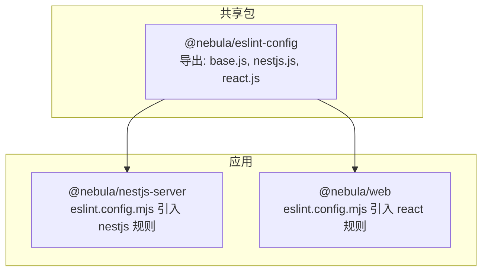
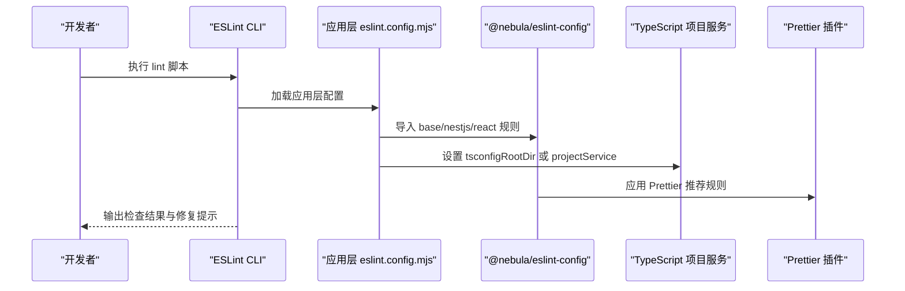
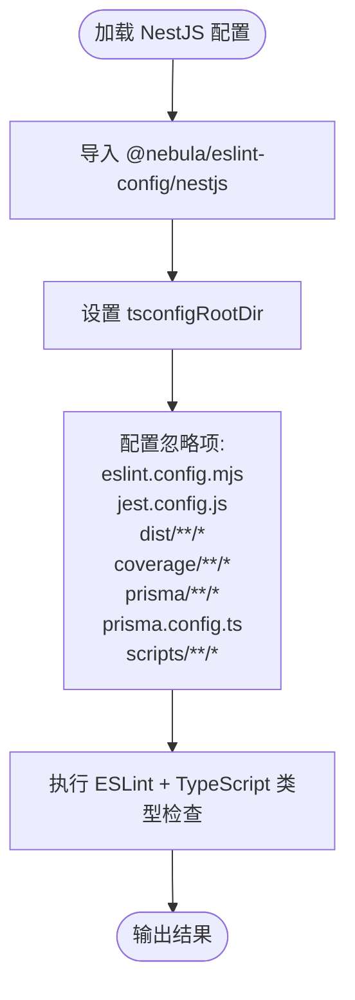
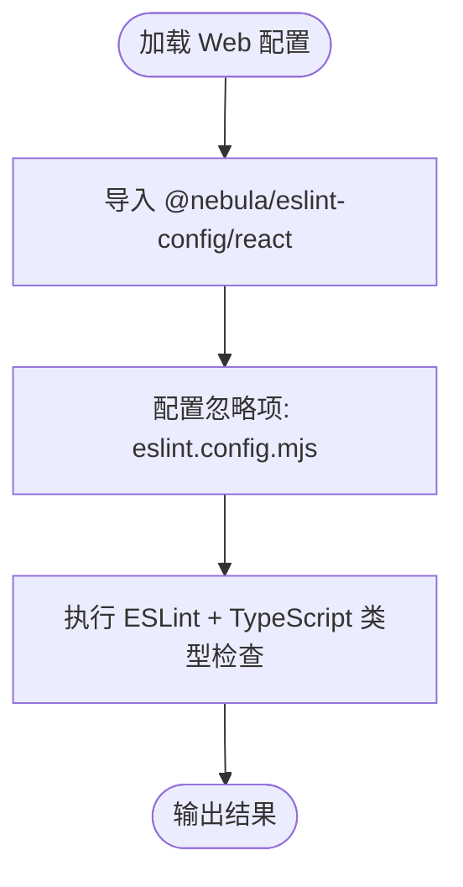
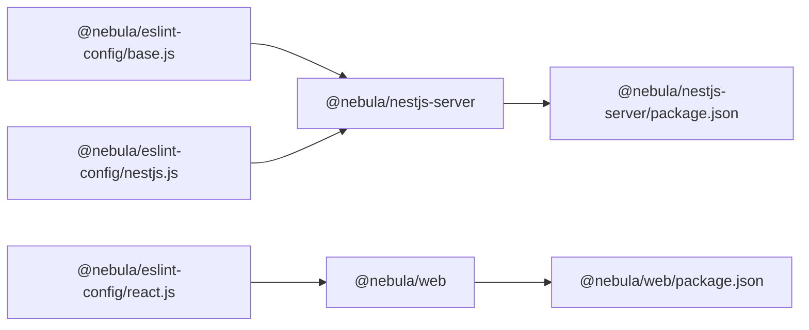

# 代码检查

<cite>
**本文引用的文件**
- [packages/eslint-config/package.json](file://packages/eslint-config/package.json)
- [packages/eslint-config/base.js](file://packages/eslint-config/base.js)
- [packages/eslint-config/nestjs.js](file://packages/eslint-config/nestjs.js)
- [packages/eslint-config/react.js](file://packages/eslint-config/react.js)
- [apps/nestjs-server/eslint.config.mjs](file://apps/nestjs-server/eslint.config.mjs)
- [apps/web/eslint.config.mjs](file://apps/web/eslint.config.mjs)
- [apps/nestjs-server/package.json](file://apps/nestjs-server/package.json)
- [apps/web/package.json](file://apps/web/package.json)
- [package.json](file://package.json)
- [turbo.json](file://turbo.json)
- [pnpm-workspace.yaml](file://pnpm-workspace.yaml)
- [apps/nestjs-server/tsconfig.json](file://apps/nestjs-server/tsconfig.json)
- [apps/web/tsconfig.json](file://apps/web/tsconfig.json)
- [apps/web/vite.config.ts](file://apps/web/vite.config.ts)
- [apps/nestjs-server/src/main.ts](file://apps/nestjs-server/src/main.ts)
- [apps/web/src/main.tsx](file://apps/web/src/main.tsx)
- [apps/web/src/pages/Dashboard.tsx](file://apps/web/src/pages/Dashboard.tsx)
- [apps/nestjs-server/prisma/schema.prisma](file://apps/nestjs-server/prisma/schema.prisma)
- [apps/nestjs-server/prisma.config.ts](file://apps/nestjs-server/prisma.config.ts)
- [apps/nestjs-server/src/prisma/prisma.module.ts](file://apps/nestjs-server/src/prisma/prisma.module.ts)
- [apps/nestjs-server/src/prisma/prisma.service.ts](file://apps/nestjs-server/src/prisma/prisma.service.ts)
- [apps/nestjs-server/.gitignore](file://apps/nestjs-server/.gitignore)
</cite>

## 目录
1. [简介](#简介)
2. [项目结构](#项目结构)
3. [核心组件](#核心组件)
4. [架构总览](#架构总览)
5. [详细组件分析](#详细组件分析)
6. [依赖分析](#依赖分析)
7. [性能考虑](#性能考虑)
8. [故障排查指南](#故障排查指南)
9. [结论](#结论)
10. [附录](#附录)

## 简介
本文件为本仓库的代码检查（ESLint）综合文档，聚焦于 monorepo 中不同技术栈（TypeScript、React、NestJS）的 ESLint 配置与使用方法。内容涵盖：
- 统一的 ESLint 配置包设计与导出约定
- 各应用层（nestjs-server、web）的配置集成方式
- TypeScript 类型检查与 Prettier 的协同策略
- 自定义规则与忽略项的落地实践
- IDE 集成与 CI/CD 流程中的代码检查执行
- 常见问题与编码规范建议

## 项目结构
本项目采用 pnpm workspace + Turbo 的 monorepo 架构，ESLint 配置通过一个独立的共享包统一管理，并在各应用中按需引入。

**图表来源**
- [packages/eslint-config/package.json:6-10](file://packages/eslint-config/package.json#L6-L10)
- [apps/nestjs-server/eslint.config.mjs:1-10](file://apps/nestjs-server/eslint.config.mjs#L1-L10)
- [apps/web/eslint.config.mjs:1-10](file://apps/web/eslint.config.mjs#L1-L10)

**章节来源**
- [pnpm-workspace.yaml:1-12](file://pnpm-workspace.yaml#L1-L12)
- [package.json:1-22](file://package.json#L1-L22)
- [turbo.json:1-26](file://turbo.json#L1-L26)

## 核心组件
- 共享 ESLint 配置包：集中管理基础规则、TypeScript 类型检查、Prettier 协同以及平台级全局变量。
- 应用层配置：在各自项目的 eslint.config.mjs 中引入对应规则集，并补充语言选项与忽略项。
- 脚本与任务编排：通过根脚本与 Turbo 任务统一触发 lint、typecheck、test 等流程。

**章节来源**
- [packages/eslint-config/package.json:1-23](file://packages/eslint-config/package.json#L1-L23)
- [apps/nestjs-server/eslint.config.mjs:1-21](file://apps/nestjs-server/eslint.config.mjs#L1-L21)
- [apps/web/eslint.config.mjs:1-10](file://apps/web/eslint.config.mjs#L1-L10)
- [package.json:5-14](file://package.json#L5-L14)
- [turbo.json:12-14](file://turbo.json#L12-L14)

## 架构总览
下图展示了从命令到具体规则生效的端到端路径，包括应用层配置如何组合共享规则、类型检查如何参与以及忽略项如何影响扫描范围。

**图表来源**
- [apps/nestjs-server/eslint.config.mjs:8-20](file://apps/nestjs-server/eslint.config.mjs#L8-L20)
- [apps/web/eslint.config.mjs:4-9](file://apps/web/eslint.config.mjs#L4-L9)
- [packages/eslint-config/base.js:6-29](file://packages/eslint-config/base.js#L6-L29)
- [packages/eslint-config/nestjs.js:5-16](file://packages/eslint-config/nestjs.js#L5-L16)
- [packages/eslint-config/react.js:5-14](file://packages/eslint-config/react.js#L5-L14)

## 详细组件分析

### 共享配置包（@nebula/eslint-config）
- 导出约定：以命名导出的方式提供 base、nestjs、react 三套规则集，便于按需引入。
- 基础规则（base.js）：
  - 继承官方推荐配置与 TypeScript ESLint 的类型化推荐配置
  - 启用 Prettier 推荐规则，确保格式一致性
  - 通过 projectService 开启基于 tsconfig 的类型检查
  - 定义若干告警级别规则，覆盖显式 any、浮点 Promise、不安全参数/调用等
  - 默认忽略构建产物、覆盖率与 node_modules
- NestJS 规则（nestjs.js）：
  - 在 base 基础上增加 Node 与 Jest 全局变量，设置 sourceType 为 commonjs，适配服务端测试与运行环境
- React 规则（react.js）：
  - 在 base 基础上增加浏览器全局变量，适配前端运行环境

**章节来源**
- [packages/eslint-config/package.json:6-10](file://packages/eslint-config/package.json#L6-L10)
- [packages/eslint-config/base.js:6-29](file://packages/eslint-config/base.js#L6-L29)
- [packages/eslint-config/nestjs.js:5-16](file://packages/eslint-config/nestjs.js#L5-L16)
- [packages/eslint-config/react.js:5-14](file://packages/eslint-config/react.js#L5-L14)

### NestJS 应用（@nebula/nestjs-server）
- 配置集成：
  - 引入 @nebula/eslint-config/nestjs
  - 设置 tsconfigRootDir 指向当前应用目录，确保类型检查指向正确的 tsconfig
  - **更新** 添加 Prisma 数据库文件和脚本目录的忽略模式：
    - `prisma/**/*`：忽略 Prisma 模式文件和相关配置
    - `prisma.config.ts`：忽略 Prisma 配置文件
    - `scripts/**/*`：忽略调试脚本目录
- 脚本与类型检查：
  - 提供 lint 脚本，结合 tsconfig 路径进行源码扫描
  - 提供 typecheck 脚本，配合 TypeScript 编译器进行无 emit 的类型检查
- TypeScript 配置：
  - 继承共享的 NestJS tsconfig，启用路径映射与包含范围

**图表来源**
- [apps/nestjs-server/eslint.config.mjs:8-20](file://apps/nestjs-server/eslint.config.mjs#L8-L20)
- [apps/nestjs-server/package.json:16-17](file://apps/nestjs-server/package.json#L16-L17)
- [apps/nestjs-server/tsconfig.json:1-16](file://apps/nestjs-server/tsconfig.json#L1-L16)

**章节来源**
- [apps/nestjs-server/eslint.config.mjs:1-29](file://apps/nestjs-server/eslint.config.mjs#L1-L29)
- [apps/nestjs-server/package.json:8-24](file://apps/nestjs-server/package.json#L8-L24)
- [apps/nestjs-server/tsconfig.json:1-16](file://apps/nestjs-server/tsconfig.json#L1-L16)

### Web 应用（@nebula/web）
- 配置集成：
  - 引入 @nebula/eslint-config/react
  - 忽略应用自身的 eslint 配置文件
- 脚本与类型检查：
  - 提供 lint 脚本，直接对项目根目录执行
  - 提供 typecheck 脚本，使用 tsc 进行类型检查
- TypeScript 与 Vite 集成：
  - 继承共享的 React tsconfig，配置 bundler 模块解析与路径别名
  - Vite 配置中设置 @ 别名与开发代理

**图表来源**
- [apps/web/eslint.config.mjs:4-9](file://apps/web/eslint.config.mjs#L4-L9)
- [apps/web/package.json:10-11](file://apps/web/package.json#L10-L11)
- [apps/web/tsconfig.json:1-15](file://apps/web/tsconfig.json#L1-L15)
- [apps/web/vite.config.ts:6-22](file://apps/web/vite.config.ts#L6-L22)

**章节来源**
- [apps/web/eslint.config.mjs:1-10](file://apps/web/eslint.config.mjs#L1-L10)
- [apps/web/package.json:6-12](file://apps/web/package.json#L6-L12)
- [apps/web/tsconfig.json:1-15](file://apps/web/tsconfig.json#L1-L15)
- [apps/web/vite.config.ts:1-23](file://apps/web/vite.config.ts#L1-L23)

### Prisma 数据库配置与忽略模式
- Prisma 配置文件：
  - `prisma.config.ts`：定义 Prisma 配置，包括模式路径、迁移目录和种子脚本
  - `prisma/schema.prisma`：定义数据库生成器和数据源配置
- 忽略模式扩展：
  - 在 ESLint 配置中添加 `prisma/**/*` 忽略模式，确保 Prisma 模式文件不参与代码检查
  - 添加 `prisma.config.ts` 忽略模式，避免配置文件被扫描
  - 添加 `scripts/**/*` 忽略模式，排除调试脚本目录
- Git 忽略配置：
  - `.gitignore` 中已包含 Prisma 相关的忽略规则，包括迁移目录、开发数据库文件等

**章节来源**
- [apps/nestjs-server/prisma.config.ts:1-14](file://apps/nestjs-server/prisma.config.ts#L1-L14)
- [apps/nestjs-server/prisma/schema.prisma:1-9](file://apps/nestjs-server/prisma/schema.prisma#L1-L9)
- [apps/nestjs-server/eslint.config.mjs:18-26](file://apps/nestjs-server/eslint.config.mjs#L18-L26)
- [apps/nestjs-server/.gitignore:61-65](file://apps/nestjs-server/.gitignore#L61-L65)

### 类型检查与 Prettier 协同
- 类型检查：
  - 基础规则通过 projectService 启用类型检查；NestJS 应用通过 tsconfigRootDir 明确根目录
  - 两个应用均提供独立的 typecheck 脚本，可与 lint 并行或串行执行
- Prettier：
  - 通过 eslint-plugin-prettier 与 eslint-config-prettier 将格式化纳入 ESLint 流程
  - 建议在本地与 CI 中保持一致的 Prettier 版本与配置

**章节来源**
- [packages/eslint-config/base.js:8-16](file://packages/eslint-config/base.js#L8-L16)
- [apps/nestjs-server/eslint.config.mjs:11-15](file://apps/nestjs-server/eslint.config.mjs#L11-L15)
- [apps/web/package.json:10-11](file://apps/web/package.json#L10-L11)

### 自定义规则与忽略项
- 自定义规则：
  - 基础规则集中定义了若干告警示例，如对显式 any、未处理 Promise、不安全参数/调用等的告警
  - 可根据团队规范在共享包或应用层新增规则，但需注意与 Prettier 的冲突
- 忽略项：
  - 基础规则默认忽略构建产物、覆盖率与 node_modules
  - **更新** NestJS 应用新增 Prisma 和脚本目录的忽略模式，避免误报或性能问题

**章节来源**
- [packages/eslint-config/base.js:18-28](file://packages/eslint-config/base.js#L18-L28)
- [apps/nestjs-server/eslint.config.mjs:18-26](file://apps/nestjs-server/eslint.config.mjs#L18-L26)
- [apps/web/eslint.config.mjs:7](file://apps/web/eslint.config.mjs#L7)

### IDE 集成与 CI/CD 流程
- IDE 集成：
  - VS Code 等编辑器应使用工作区内的 ESLint 与 TypeScript 插件，确保解析到正确的 tsconfig
  - 建议在编辑器中启用保存时自动修复（谨慎使用），并在提交前执行 lint
- CI/CD 流程：
  - 根脚本与 Turbo 任务统一触发 lint、typecheck、test 等步骤
  - 建议在 PR 中强制执行 lint 与 typecheck，失败即阻断合并

**章节来源**
- [package.json:5-14](file://package.json#L5-L14)
- [turbo.json:12-14](file://turbo.json#L12-L14)

## 依赖分析
- 包导出关系：
  - @nebula/eslint-config 作为共享包，被两个应用通过 workspace 引用
- 直接依赖：
  - 基础规则依赖 @eslint/js、typescript-eslint、eslint-config-prettier、eslint-plugin-prettier、globals
- 应用依赖：
  - NestJS 应用依赖 @nebula/eslint-config 与 @nebula/typescript-config
  - Web 应用依赖 @nebula/eslint-config 与 @nebula/typescript-config

**图表来源**
- [packages/eslint-config/base.js:1-30](file://packages/eslint-config/base.js#L1-L30)
- [packages/eslint-config/nestjs.js:1-17](file://packages/eslint-config/nestjs.js#L1-L17)
- [packages/eslint-config/react.js:1-15](file://packages/eslint-config/react.js#L1-L15)
- [apps/nestjs-server/package.json:60-62](file://apps/nestjs-server/package.json#L60-L62)
- [apps/web/package.json:30-32](file://apps/web/package.json#L30-L32)

**章节来源**
- [packages/eslint-config/package.json:11-21](file://packages/eslint-config/package.json#L11-L21)
- [apps/nestjs-server/package.json:60-62](file://apps/nestjs-server/package.json#L60-L62)
- [apps/web/package.json:30-32](file://apps/web/package.json#L30-L32)

## 性能考虑
- 类型检查成本控制：
  - 使用 projectService 或 tsconfigRootDir 精准定位 tsconfig，避免扫描无关目录
  - 在大型项目中，优先执行 lint，再按需执行 typecheck
- 忽略项优化：
  - **更新** 合理利用默认忽略项与应用层忽略项，特别是新增的 Prisma 和脚本目录忽略模式，减少不必要的文件扫描
- 工作区与缓存：
  - Turbo 的任务缓存与仅构建依赖（onlyBuiltDependencies）有助于提升整体开发体验

**章节来源**
- [packages/eslint-config/base.js:12-14](file://packages/eslint-config/base.js#L12-L14)
- [apps/nestjs-server/eslint.config.mjs:11-15](file://apps/nestjs-server/eslint.config.mjs#L11-L15)
- [pnpm-workspace.yaml:5-11](file://pnpm-workspace.yaml#L5-L11)
- [turbo.json:8-11](file://turbo.json#L8-L11)

## 故障排查指南
- 类型检查未生效或报错：
  - 确认应用层已正确设置 tsconfigRootDir 或启用 projectService
  - 检查 tsconfig 路径映射与包含范围是否覆盖目标文件
- Prettier 冲突：
  - 若出现格式化与 ESLint 冲突，确认已启用 eslint-config-prettier 与 eslint-plugin-prettier
  - 在编辑器中禁用重复的格式化插件，避免双重格式化
- 忽略项导致漏检：
  - **更新** 检查应用层忽略项是否过度宽泛，特别是 Prisma 和脚本目录的忽略模式，必要时缩小范围或移除误忽略
- CI 失败：
  - 在 CI 中先执行 lint，再执行 typecheck，确保错误链路清晰
  - 对于大型项目，可拆分任务或启用缓存以缩短流水线时间

**章节来源**
- [apps/nestjs-server/eslint.config.mjs:11-15](file://apps/nestjs-server/eslint.config.mjs#L11-L15)
- [apps/web/eslint.config.mjs:7](file://apps/web/eslint.config.mjs#L7)
- [packages/eslint-config/base.js:18-24](file://packages/eslint-config/base.js#L18-L24)
- [package.json:5-14](file://package.json#L5-L14)

## 结论
本项目通过共享 ESLint 配置包实现了跨技术栈的一致性与可维护性，同时在 NestJS 与 Web 应用中分别针对服务端与前端特性进行了定制。**更新** NestJS 应用现已扩展 ESLint 忽略模式，专门处理 Prisma 数据库文件和调试脚本目录，进一步提升了代码检查的准确性和性能。配合 TypeScript 类型检查与 Prettier 协同、完善的 IDE 与 CI/CD 流程，能够有效提升代码质量与团队协作效率。

## 附录

### 常见问题与编码规范建议
- 告警示例处理：
  - 对显式 any、未处理 Promise、不安全参数/调用等告警示例，建议优先重构为强类型实现，而非简单关闭规则
- 文件组织与路径：
  - 使用路径映射与别名（如 @/*）统一模块引用，减少相对路径复杂度
- React 组件规范：
  - 函数组件优先，合理拆分子组件，避免单文件过大
  - 使用类型安全的 props 与 hooks，减少潜在运行时风险
- NestJS 模块与控制器：
  - 控制器职责单一，服务封装业务逻辑，遵循依赖注入与模块边界
- **新增** Prisma 集成规范：
  - Prisma 模式文件位于 `prisma/schema/` 目录，使用 `prisma/**/*` 忽略模式
  - 配置文件 `prisma.config.ts` 位于项目根目录，使用 `prisma.config.ts` 忽略模式
  - 调试脚本位于 `scripts/` 目录，使用 `scripts/**/*` 忽略模式

**章节来源**
- [packages/eslint-config/base.js:18-24](file://packages/eslint-config/base.js#L18-L24)
- [apps/web/src/pages/Dashboard.tsx:17-52](file://apps/web/src/pages/Dashboard.tsx#L17-L52)
- [apps/nestjs-server/src/main.ts:9-47](file://apps/nestjs-server/src/main.ts#L9-L47)
- [apps/web/src/main.tsx:12-22](file://apps/web/src/main.tsx#L12-L22)
- [apps/nestjs-server/eslint.config.mjs:18-26](file://apps/nestjs-server/eslint.config.mjs#L18-L26)