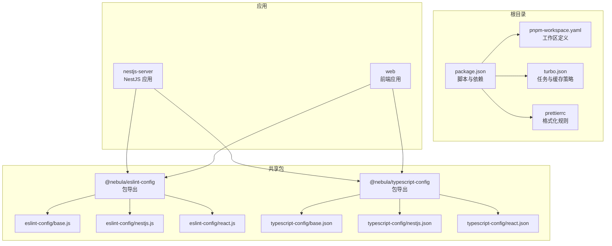
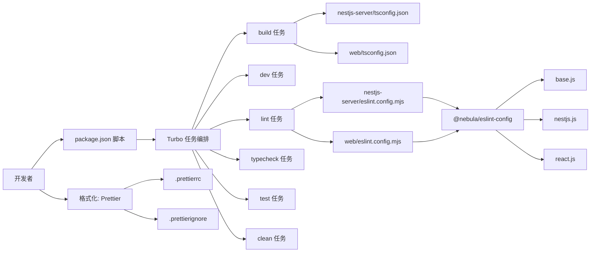
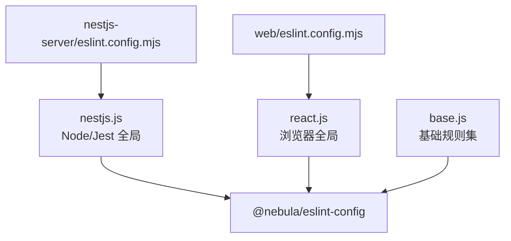
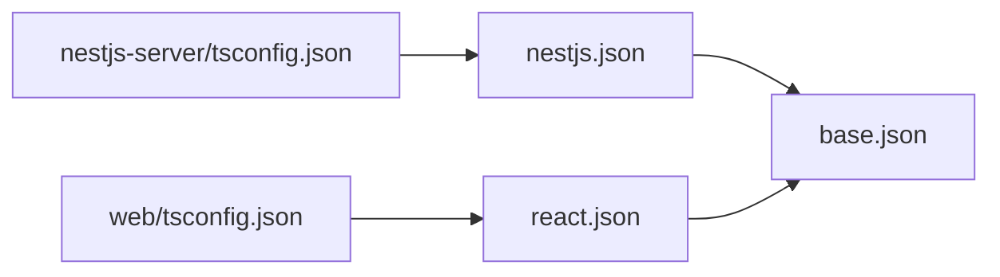
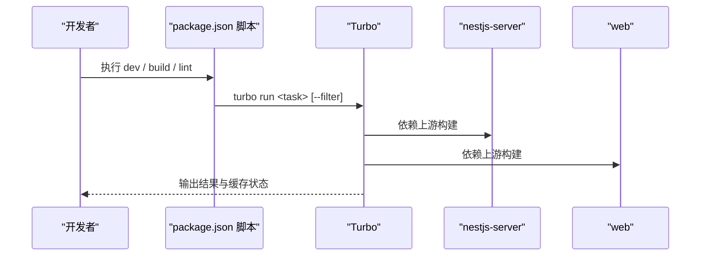
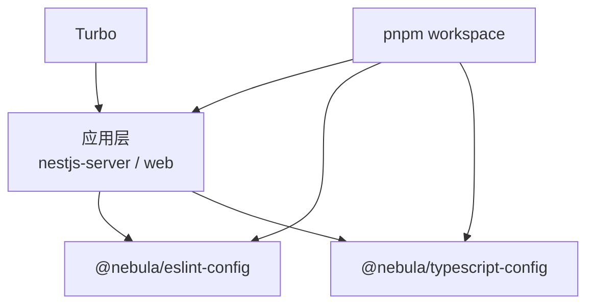

# 开发工具

<cite>
**本文引用的文件**
- [.prettierrc](file://.prettierrc)
- [.prettierignore](file://.prettierignore)
- [package.json](file://package.json)
- [pnpm-workspace.yaml](file://pnpm-workspace.yaml)
- [turbo.json](file://turbo.json)
- [apps/nestjs-server/eslint.config.mjs](file://apps/nestjs-server/eslint.config.mjs)
- [apps/web/eslint.config.mjs](file://apps/web/eslint.config.mjs)
- [packages/eslint-config/package.json](file://packages/eslint-config/package.json)
- [packages/eslint-config/base.js](file://packages/eslint-config/base.js)
- [packages/eslint-config/nestjs.js](file://packages/eslint-config/nestjs.js)
- [packages/eslint-config/react.js](file://packages/eslint-config/react.js)
- [packages/typescript-config/package.json](file://packages/typescript-config/package.json)
- [packages/typescript-config/base.json](file://packages/typescript-config/base.json)
- [packages/typescript-config/nestjs.json](file://packages/typescript-config/nestjs.json)
- [packages/typescript-config/react.json](file://packages/typescript-config/react.json)
- [apps/nestjs-server/tsconfig.json](file://apps/nestjs-server/tsconfig.json)
- [apps/web/tsconfig.json](file://apps/web/tsconfig.json)
</cite>

## 目录
1. [简介](#简介)
2. [项目结构](#项目结构)
3. [核心组件](#核心组件)
4. [架构总览](#架构总览)
5. [详细组件分析](#详细组件分析)
6. [依赖分析](#依赖分析)
7. [性能考虑](#性能考虑)
8. [故障排查指南](#故障排查指南)
9. [结论](#结论)
10. [附录](#附录)

## 简介
本文件系统性梳理本仓库的开发工具链与配置，覆盖以下方面：
- 代码格式化：基于 Prettier 的统一风格与忽略规则
- 代码检查：ESLint 配置分层（基础、NestJS、React），结合 TypeScript 类型检查
- 类型编译：TypeScript 配置模板与各应用扩展
- 构建系统：Turbo 多包构建、任务依赖与缓存策略
- 包管理：pnpm workspace 工作区与仅构建依赖
- 开发与调试：脚手架命令、过滤器与调试技巧
- IDE 推荐：编辑器与插件配置要点
- 团队协作：规范与最佳实践

## 项目结构
本仓库采用 monorepo 结构，使用 pnpm workspace 管理多包；通过 Turbo 统一调度构建、测试、类型检查与 Lint；ESLint 与 Prettier 在 packages 中提供共享配置；TypeScript 配置在 packages 中提供模板并在应用中按需扩展。

图表来源
- [package.json:1-22](file://package.json#L1-L22)
- [pnpm-workspace.yaml:1-12](file://pnpm-workspace.yaml#L1-L12)
- [turbo.json:1-26](file://turbo.json#L1-L26)
- [.prettierrc:1-11](file://.prettierrc#L1-L11)
- [packages/eslint-config/package.json:1-23](file://packages/eslint-config/package.json#L1-L23)
- [packages/eslint-config/base.js:1-30](file://packages/eslint-config/base.js#L1-L30)
- [packages/eslint-config/nestjs.js:1-17](file://packages/eslint-config/nestjs.js#L1-L17)
- [packages/eslint-config/react.js:1-15](file://packages/eslint-config/react.js#L1-L15)
- [packages/typescript-config/package.json:1-11](file://packages/typescript-config/package.json#L1-L11)
- [packages/typescript-config/base.json:1-23](file://packages/typescript-config/base.json#L1-L23)
- [packages/typescript-config/nestjs.json:1-15](file://packages/typescript-config/nestjs.json#L1-L15)
- [packages/typescript-config/react.json:1-11](file://packages/typescript-config/react.json#L1-L11)
- [apps/nestjs-server/tsconfig.json:1-16](file://apps/nestjs-server/tsconfig.json#L1-L16)
- [apps/web/tsconfig.json:1-15](file://apps/web/tsconfig.json#L1-L15)

章节来源
- [package.json:1-22](file://package.json#L1-L22)
- [pnpm-workspace.yaml:1-12](file://pnpm-workspace.yaml#L1-L12)
- [turbo.json:1-26](file://turbo.json#L1-L26)
- [.prettierrc:1-11](file://.prettierrc#L1-L11)

## 核心组件
- Prettier：统一缩进宽度、引号风格、尾随逗号、行宽等规则，并通过忽略文件排除不需要格式化的路径。
- ESLint：以共享包提供基础规则、NestJS 扩展与 React 扩展，结合 TypeScript 类型检查与 Prettier 插件，确保风格与类型安全一致。
- TypeScript：提供基础、NestJS、React 三套 tsconfig 模板，应用通过 extends 继承并局部覆盖。
- Turbo：定义 build/dev/lint/typecheck/test/clean 等任务，设置依赖链与缓存策略。
- pnpm workspace：声明工作区范围与仅构建依赖，减少无关安装与加速构建。

章节来源
- [.prettierrc:1-11](file://.prettierrc#L1-L11)
- [packages/eslint-config/base.js:1-30](file://packages/eslint-config/base.js#L1-L30)
- [packages/eslint-config/nestjs.js:1-17](file://packages/eslint-config/nestjs.js#L1-L17)
- [packages/eslint-config/react.js:1-15](file://packages/eslint-config/react.js#L1-L15)
- [packages/typescript-config/base.json:1-23](file://packages/typescript-config/base.json#L1-L23)
- [packages/typescript-config/nestjs.json:1-15](file://packages/typescript-config/nestjs.json#L1-L15)
- [packages/typescript-config/react.json:1-11](file://packages/typescript-config/react.json#L1-L11)
- [turbo.json:1-26](file://turbo.json#L1-L26)
- [pnpm-workspace.yaml:1-12](file://pnpm-workspace.yaml#L1-L12)

## 架构总览
下图展示开发工具链在 monorepo 中的组织方式与交互关系。

图表来源
- [package.json:5-14](file://package.json#L5-L14)
- [turbo.json:3-24](file://turbo.json#L3-L24)
- [apps/nestjs-server/eslint.config.mjs:1-21](file://apps/nestjs-server/eslint.config.mjs#L1-L21)
- [apps/web/eslint.config.mjs:1-10](file://apps/web/eslint.config.mjs#L1-L10)
- [packages/eslint-config/package.json:6-10](file://packages/eslint-config/package.json#L6-L10)
- [packages/eslint-config/base.js:1-30](file://packages/eslint-config/base.js#L1-L30)
- [packages/eslint-config/nestjs.js:1-17](file://packages/eslint-config/nestjs.js#L1-L17)
- [packages/eslint-config/react.js:1-15](file://packages/eslint-config/react.js#L1-L15)
- [.prettierrc:1-11](file://.prettierrc#L1-L11)
- [.prettierignore](file://.prettierignore)

## 详细组件分析

### Prettier 代码格式化
- 规则来源：根目录配置文件定义统一风格。
- 忽略规则：通过忽略文件排除不需要格式化的路径，避免对生成产物与第三方目录进行格式化。
- 命令集成：根目录脚本提供一键格式化命令，覆盖常见源码与文档后缀。

章节来源
- [.prettierrc:1-11](file://.prettierrc#L1-L11)
- [.prettierignore](file://.prettierignore)
- [package.json:14-14](file://package.json#L14-L14)

### ESLint 代码检查配置
- 共享包导出：通过包的 exports 字段导出基础、NestJS、React 三种配置入口。
- 基础规则：启用 ESLint 推荐规则、TypeScript 类型检查推荐配置、Prettier 插件推荐配置，并开启 tsconfig 根目录解析与全局忽略。
- 应用扩展：
  - NestJS 应用：在基础之上增加 Node/Jest 全局变量与 CommonJS 源类型。
  - Web 应用：在基础之上增加浏览器全局变量。
- 规则要点：对显式 any、未处理 Promise、不安全调用等给出告警；强制与 Prettier 风格保持一致。

图表来源
- [packages/eslint-config/package.json:6-10](file://packages/eslint-config/package.json#L6-L10)
- [packages/eslint-config/base.js:1-30](file://packages/eslint-config/base.js#L1-L30)
- [packages/eslint-config/nestjs.js:1-17](file://packages/eslint-config/nestjs.js#L1-L17)
- [packages/eslint-config/react.js:1-15](file://packages/eslint-config/react.js#L1-L15)
- [apps/nestjs-server/eslint.config.mjs:1-21](file://apps/nestjs-server/eslint.config.mjs#L1-L21)
- [apps/web/eslint.config.mjs:1-10](file://apps/web/eslint.config.mjs#L1-L10)

章节来源
- [packages/eslint-config/package.json:1-23](file://packages/eslint-config/package.json#L1-L23)
- [packages/eslint-config/base.js:1-30](file://packages/eslint-config/base.js#L1-L30)
- [packages/eslint-config/nestjs.js:1-17](file://packages/eslint-config/nestjs.js#L1-L17)
- [packages/eslint-config/react.js:1-15](file://packages/eslint-config/react.js#L1-L15)
- [apps/nestjs-server/eslint.config.mjs:1-21](file://apps/nestjs-server/eslint.config.mjs#L1-L21)
- [apps/web/eslint.config.mjs:1-10](file://apps/web/eslint.config.mjs#L1-L10)

### TypeScript 编译设置
- 基础模板：统一目标、模块、解析策略、严格模式、声明与 SourceMap 等选项。
- NestJS 扩展：启用装饰器元数据与实验特性、移除注释、指定输出目录与类型集合。
- React 扩展：启用 DOM/DOM.Iterable、JSX 运行时、禁止 emit 并声明 Node 类型。
- 应用继承：
  - NestJS 应用：通过 extends 继承 NestJS 模板，并配置路径映射与包含/排除规则。
  - Web 应用：通过 extends 继承 React 模板，并配置 ESNext 模块与 bundler 解析策略。

图表来源
- [packages/typescript-config/base.json:1-23](file://packages/typescript-config/base.json#L1-L23)
- [packages/typescript-config/nestjs.json:1-15](file://packages/typescript-config/nestjs.json#L1-L15)
- [packages/typescript-config/react.json:1-11](file://packages/typescript-config/react.json#L1-L11)
- [apps/nestjs-server/tsconfig.json:1-16](file://apps/nestjs-server/tsconfig.json#L1-L16)
- [apps/web/tsconfig.json:1-15](file://apps/web/tsconfig.json#L1-L15)

章节来源
- [packages/typescript-config/base.json:1-23](file://packages/typescript-config/base.json#L1-L23)
- [packages/typescript-config/nestjs.json:1-15](file://packages/typescript-config/nestjs.json#L1-L15)
- [packages/typescript-config/react.json:1-11](file://packages/typescript-config/react.json#L1-L11)
- [apps/nestjs-server/tsconfig.json:1-16](file://apps/nestjs-server/tsconfig.json#L1-L16)
- [apps/web/tsconfig.json:1-15](file://apps/web/tsconfig.json#L1-L15)

### Turbo 构建系统与缓存策略
- 任务定义：
  - build：依赖上游包构建，输出 dist/.next 目录。
  - dev：非缓存持久任务，适合本地开发。
  - lint/typecheck：依赖构建完成后再执行。
  - test：依赖构建完成。
  - clean：禁用缓存。
- 过滤器：可通过过滤器选择特定应用或包运行任务，如 web 或 nestjs-server。
- 命令：根目录脚本统一聚合 Turbo 任务，便于团队一致操作。

图表来源
- [package.json:5-14](file://package.json#L5-L14)
- [turbo.json:3-24](file://turbo.json#L3-L24)

章节来源
- [turbo.json:1-26](file://turbo.json#L1-L26)
- [package.json:5-14](file://package.json#L5-L14)

### pnpm workspace 工作原理
- 工作区范围：apps/* 与 packages/* 自动纳入工作区。
- 仅构建依赖：声明某些原生/二进制依赖仅在构建阶段需要，避免在运行时重复安装，提升安装效率与一致性。

章节来源
- [pnpm-workspace.yaml:1-12](file://pnpm-workspace.yaml#L1-L12)

## 依赖分析
- 组件耦合：
  - 应用层依赖共享包提供的 ESLint 配置与 TypeScript 模板，降低重复配置成本。
  - Turbo 作为编排层，向上游包建立依赖关系，向下驱动各应用构建与检查。
  - pnpm workspace 为上述依赖提供稳定的包解析与安装环境。
- 外部依赖：
  - ESLint 生态：@eslint/js、typescript-eslint、eslint-config-prettier、eslint-plugin-prettier。
  - Prettier：统一格式化能力。
  - Turbo：多包构建与缓存。
  - pnpm：包管理与工作区。

图表来源
- [apps/nestjs-server/eslint.config.mjs:1-21](file://apps/nestjs-server/eslint.config.mjs#L1-L21)
- [apps/web/eslint.config.mjs:1-10](file://apps/web/eslint.config.mjs#L1-L10)
- [packages/eslint-config/package.json:1-23](file://packages/eslint-config/package.json#L1-L23)
- [packages/typescript-config/package.json:1-11](file://packages/typescript-config/package.json#L1-L11)
- [turbo.json:1-26](file://turbo.json#L1-L26)
- [pnpm-workspace.yaml:1-12](file://pnpm-workspace.yaml#L1-L12)

章节来源
- [packages/eslint-config/package.json:11-21](file://packages/eslint-config/package.json#L11-L21)
- [packages/typescript-config/package.json:1-11](file://packages/typescript-config/package.json#L1-L11)
- [turbo.json:1-26](file://turbo.json#L1-L26)
- [pnpm-workspace.yaml:1-12](file://pnpm-workspace.yaml#L1-L12)

## 性能考虑
- Turbo 缓存与增量构建：利用任务输出与依赖图实现增量构建，减少重复工作量。
- 仅构建依赖：通过 pnpm 的仅构建依赖配置，避免不必要的运行时安装，缩短安装时间。
- ESLint 与 TypeScript：启用类型检查推荐配置与 tsconfig 根目录解析，有助于更快定位问题与减少误报。
- Prettier：统一格式化规则与忽略列表，避免 CI/本地差异导致的反复重写。

## 故障排查指南
- ESLint 报错与 Prettier 冲突
  - 现象：ESLint 与 Prettier 规则冲突导致格式化失败或 CI 报错。
  - 排查：确认共享包已正确引入 Prettier 推荐配置；检查应用层是否覆盖了 tsconfigRootDir 与忽略列表。
  - 参考
    - [packages/eslint-config/base.js:23-24](file://packages/eslint-config/base.js#L23-L24)
    - [apps/nestjs-server/eslint.config.mjs:13-14](file://apps/nestjs-server/eslint.config.mjs#L13-L14)
    - [apps/web/eslint.config.mjs:1-10](file://apps/web/eslint.config.mjs#L1-L10)
- TypeScript 类型错误
  - 现象：类型检查失败或提示未解析模块。
  - 排查：确认应用 tsconfig 正确继承模板；检查路径映射与包含/排除规则；确保仅构建依赖已安装。
  - 参考
    - [apps/nestjs-server/tsconfig.json:1-16](file://apps/nestjs-server/tsconfig.json#L1-L16)
    - [apps/web/tsconfig.json:1-15](file://apps/web/tsconfig.json#L1-L15)
    - [pnpm-workspace.yaml:5-12](file://pnpm-workspace.yaml#L5-L12)
- Turbo 任务卡顿或缓存异常
  - 现象：dev/build 持续缓存命中异常或耗时过长。
  - 排查：检查任务输出定义与依赖链；必要时清理缓存或临时禁用缓存进行验证。
  - 参考
    - [turbo.json:3-24](file://turbo.json#L3-L24)
    - [package.json:5-14](file://package.json#L5-L14)

章节来源
- [packages/eslint-config/base.js:23-24](file://packages/eslint-config/base.js#L23-L24)
- [apps/nestjs-server/eslint.config.mjs:13-14](file://apps/nestjs-server/eslint.config.mjs#L13-L14)
- [apps/web/eslint.config.mjs:1-10](file://apps/web/eslint.config.mjs#L1-L10)
- [apps/nestjs-server/tsconfig.json:1-16](file://apps/nestjs-server/tsconfig.json#L1-L16)
- [apps/web/tsconfig.json:1-15](file://apps/web/tsconfig.json#L1-L15)
- [pnpm-workspace.yaml:5-12](file://pnpm-workspace.yaml#L5-L12)
- [turbo.json:3-24](file://turbo.json#L3-L24)
- [package.json:5-14](file://package.json#L5-L14)

## 结论
本仓库通过共享的 ESLint 与 TypeScript 配置、Turbo 多包构建与 pnpm 工作区，实现了跨应用的一致性与高效率。建议团队遵循以下实践：
- 使用根脚本统一触发任务，避免跨包命令分散。
- 在新增应用时优先复用共享配置模板，减少差异化。
- 严格维护 Prettier 与 ESLint 的一致性，避免 CI/本地差异。
- 合理使用 Turbo 任务过滤器与仅构建依赖，平衡开发体验与安装性能。

## 附录
- IDE 配置与插件建议
  - VSCode
    - 安装 ESLint 与 Prettier 插件，启用保存时格式化与问题自动修复。
    - 设置默认 formatter 为 Prettier，代码格式化程序为 ESLint。
  - WebStorm/IntelliJ
    - 启用 ESLint 与 Prettier 集成，配置保存时自动格式化。
  - 通用建议
    - 在编辑器中启用 TypeScript 诊断与 ESLint 实时检查。
    - 对于 monorepo，确保编辑器识别工作区根目录与包边界。
- 团队协作规范
  - 提交前必须执行格式化与 Lint，保证代码风格一致。
  - 新增规则应先在共享包中统一，再在应用层引用。
  - 发布前执行 typecheck 与 test，确保类型与行为稳定。