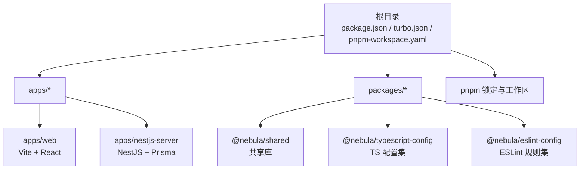
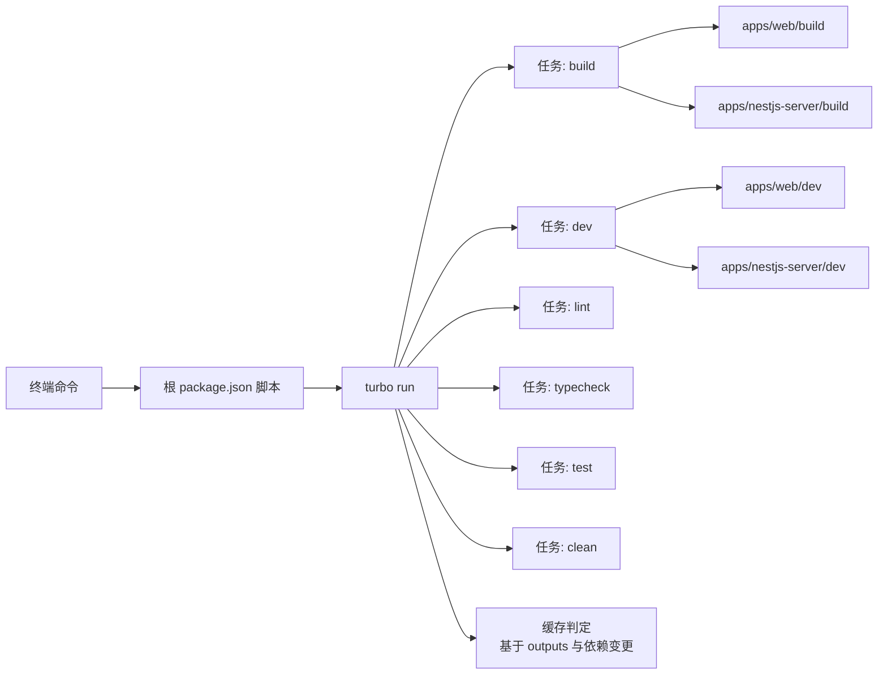
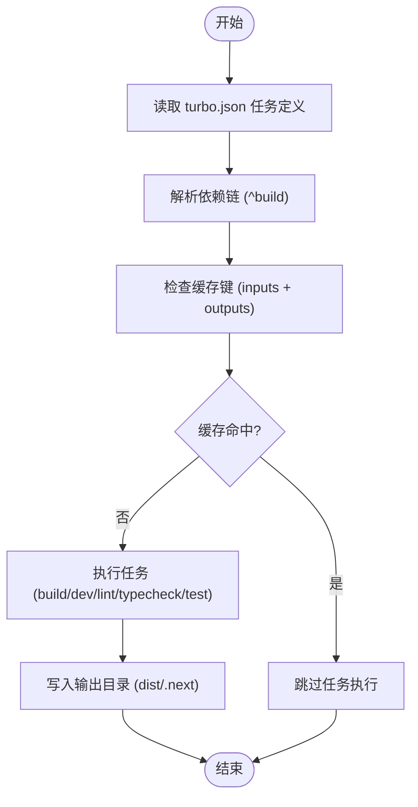
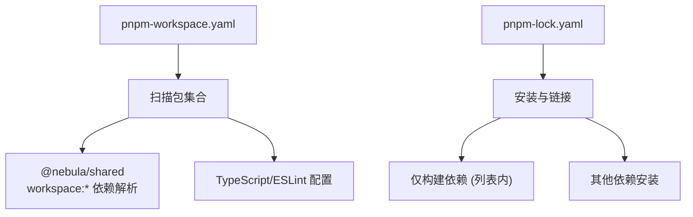
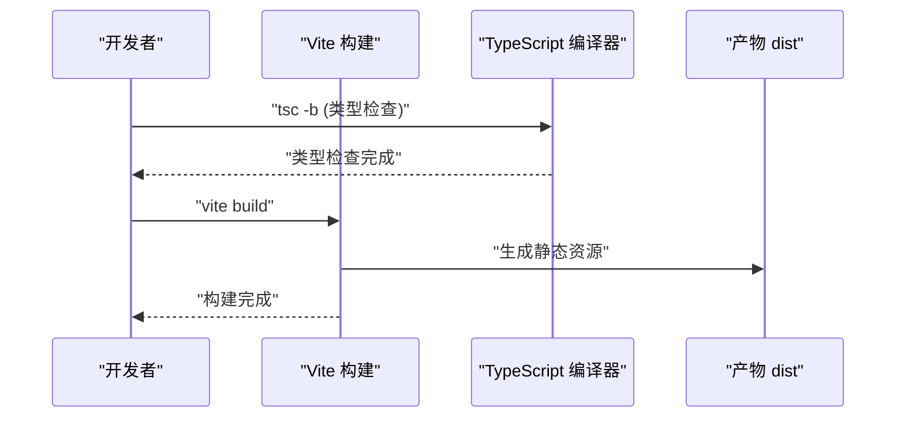
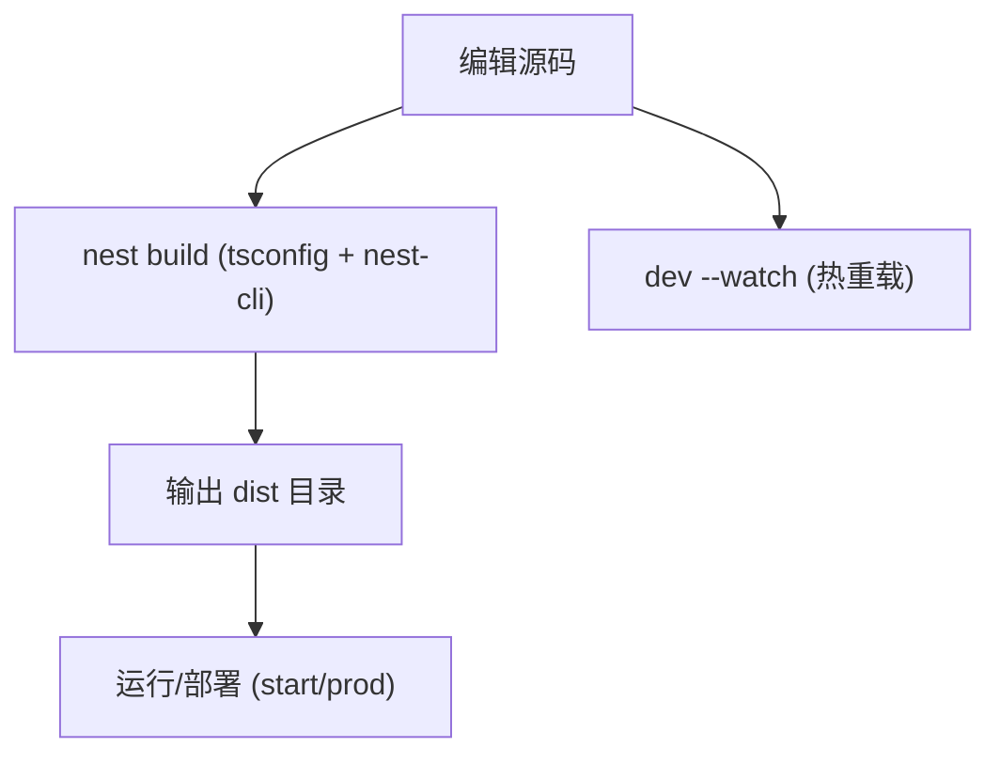
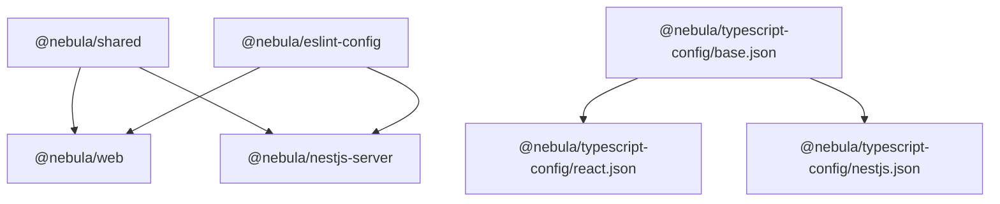
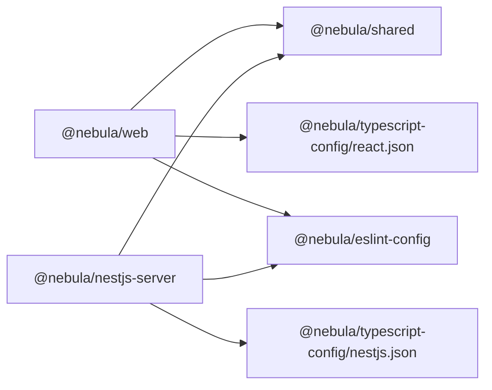

# 构建系统

<cite>
**本文引用的文件**
- [turbo.json](file://turbo.json)
- [pnpm-workspace.yaml](file://pnpm-workspace.yaml)
- [package.json](file://package.json)
- [apps/web/package.json](file://apps/web/package.json)
- [apps/web/vite.config.ts](file://apps/web/vite.config.ts)
- [apps/web/tsconfig.json](file://apps/web/tsconfig.json)
- [apps/nestjs-server/package.json](file://apps/nestjs-server/package.json)
- [apps/nestjs-server/nest-cli.json](file://apps/nestjs-server/nest-cli.json)
- [apps/nestjs-server/tsconfig.json](file://apps/nestjs-server/tsconfig.json)
- [packages/eslint-config/package.json](file://packages/eslint-config/package.json)
- [packages/typescript-config/package.json](file://packages/typescript-config/package.json)
- [packages/typescript-config/base.json](file://packages/typescript-config/base.json)
- [packages/typescript-config/react.json](file://packages/typescript-config/react.json)
- [packages/typescript-config/nestjs.json](file://packages/typescript-config/nestjs.json)
- [packages/shared/package.json](file://packages/shared/package.json)
- [.npmrc](file://.npmrc)
- [pnpm-lock.yaml](file://pnpm-lock.yaml)
</cite>

## 目录

1. [简介](#简介)
2. [项目结构](#项目结构)
3. [核心组件](#核心组件)
4. [架构总览](#架构总览)
5. [详细组件分析](#详细组件分析)
6. [依赖分析](#依赖分析)
7. [性能考量](#性能考量)
8. [故障排查指南](#故障排查指南)
9. [结论](#结论)
10. [附录](#附录)

## 简介

本文件系统性阐述该仓库的构建体系：以 Turbo 为核心的任务编排与缓存引擎，结合 pnpm workspace 的工作区管理与仅构建依赖策略，形成高效的 monorepo 构建流水线。文档覆盖任务依赖关系、输出产物定义、并行执行与增量构建、缓存命中策略、开发与生产的差异化配置、性能监控与故障排查建议，并通过图示帮助读者快速理解各组件之间的交互。

## 项目结构

该仓库采用 monorepo 结构，根目录通过 pnpm workspace 声明工作区包集合，Turbo 负责跨包的任务编排与缓存；应用层包含前端 Web 应用与 NestJS 后端服务，共享层包含 ESLint 规则、TypeScript 配置与共享库。

图表来源

- [pnpm-workspace.yaml:1-12](file://pnpm-workspace.yaml#L1-L12)
- [package.json:1-22](file://package.json#L1-L22)
- [apps/web/package.json:1-44](file://apps/web/package.json#L1-L44)
- [apps/nestjs-server/package.json:1-85](file://apps/nestjs-server/package.json#L1-L85)
- [packages/shared/package.json:1-80](file://packages/shared/package.json#L1-L80)
- [packages/typescript-config/package.json:1-11](file://packages/typescript-config/package.json#L1-L11)
- [packages/eslint-config/package.json:1-23](file://packages/eslint-config/package.json#L1-L23)

章节来源

- [pnpm-workspace.yaml:1-12](file://pnpm-workspace.yaml#L1-L12)
- [package.json:1-22](file://package.json#L1-L22)

## 核心组件

- Turbo 任务编排与缓存
  - 根任务定义：build、dev、lint、typecheck、test、clean
  - 依赖链：上流包先于当前包构建（^build），测试依赖已构建产物
  - 输出物：前端 Next 输出目录与后端 dist 目录纳入缓存判定
  - 开发模式禁用缓存并持久化，避免本地状态被缓存污染
- pnpm 工作区与仅构建依赖
  - 工作区扫描 apps/_ 与 packages/_
  - 仅构建依赖列表限定特定原生/二进制包，减少安装与构建成本
- 应用层构建脚本
  - Web：Vite 构建与类型检查；tsconfig 使用 bundler 模块解析
  - Server：NestJS 编译与类型检查；tsconfig 使用 NodeNext 模块解析
- 共享与工具链
  - @nebula/shared：通过 tsdown 构建为多格式导出
  - @nebula/typescript-config：统一 TS 配置基线与 React/NestJS 扩展
  - @nebula/eslint-config：统一 ESLint 规则与 Prettier 集成

章节来源

- [turbo.json:1-26](file://turbo.json#L1-L26)
- [pnpm-workspace.yaml:1-12](file://pnpm-workspace.yaml#L1-L12)
- [apps/web/package.json:1-44](file://apps/web/package.json#L1-L44)
- [apps/web/tsconfig.json:1-15](file://apps/web/tsconfig.json#L1-L15)
- [apps/nestjs-server/package.json:1-85](file://apps/nestjs-server/package.json#L1-L85)
- [apps/nestjs-server/tsconfig.json:1-16](file://apps/nestjs-server/tsconfig.json#L1-L16)
- [packages/shared/package.json:1-80](file://packages/shared/package.json#L1-L80)
- [packages/typescript-config/package.json:1-11](file://packages/typescript-config/package.json#L1-L11)
- [packages/eslint-config/package.json:1-23](file://packages/eslint-config/package.json#L1-L23)

## 架构总览

下图展示从根脚本到具体任务的调用链路，以及 Turbo 如何根据依赖与输出进行增量构建与缓存判定。

图表来源

- [package.json:5-14](file://package.json#L5-L14)
- [turbo.json:3-24](file://turbo.json#L3-L24)
- [apps/web/package.json:6-12](file://apps/web/package.json#L6-L12)
- [apps/nestjs-server/package.json:8-24](file://apps/nestjs-server/package.json#L8-L24)

## 详细组件分析

### Turbo 任务与缓存策略

- 任务定义与依赖
  - build：依赖上游包的构建结果，输出 dist/** 与 .next/**
  - dev：禁用缓存并持久化，适合本地开发
  - lint/typecheck：依赖上游构建，确保在稳定产物上进行静态分析
  - test：依赖 build，保证测试在已构建产物上运行
  - clean：禁用缓存，避免误删缓存条目
- 增量构建与缓存命中
  - 通过 outputs 列表参与缓存键计算，仅当输入或产物未变时命中缓存
  - 依赖链确保拓扑有序，避免并发冲突
- 并行执行
  - Turbo 默认按拓扑排序并行执行可并行的任务
  - 可通过过滤器选择性执行（如仅 web 或仅 server）

图表来源

- [turbo.json:3-24](file://turbo.json#L3-L24)

章节来源

- [turbo.json:1-26](file://turbo.json#L1-L26)

### pnpm 工作区与仅构建依赖

- 工作区声明
  - apps/_ 与 packages/_ 自动纳入工作区，支持 workspace:\* 依赖
- 仅构建依赖
  - 列表内包在安装时仅构建其二进制部分，减少整体安装时间与内存占用
  - 常见项包括数据库驱动、原生模块等
- 安装行为控制
  - .npmrc 中启用 hoist、自动安装 peer、关闭严格 peer 校验，提升兼容性与安装速度

图表来源

- [pnpm-workspace.yaml:1-12](file://pnpm-workspace.yaml#L1-L12)
- [.npmrc:1-4](file://.npmrc#L1-L4)
- [pnpm-lock.yaml:1-200](file://pnpm-lock.yaml#L1-L200)

章节来源

- [pnpm-workspace.yaml:1-12](file://pnpm-workspace.yaml#L1-L12)
- [.npmrc:1-4](file://.npmrc#L1-L4)
- [pnpm-lock.yaml:1-200](file://pnpm-lock.yaml#L1-L200)

### Web 应用（Vite + React）构建

- 构建流程
  - 先执行 tsc -b 进行类型检查，再执行 vite build 产出静态资源
  - 类型检查与构建分离，便于在 CI 中提前发现类型问题
- 开发体验
  - Vite 提供快速热更新与代理配置，开发服务器默认端口与 API 代理指向后端
- TypeScript 配置
  - 继承 @nebula/typescript-config/react.json，使用 ESNext 模块与 bundler 解析
  - 路径别名 @/\* 指向 src，便于模块导入

图表来源

- [apps/web/package.json:6-12](file://apps/web/package.json#L6-L12)
- [apps/web/vite.config.ts:1-23](file://apps/web/vite.config.ts#L1-L23)
- [apps/web/tsconfig.json:1-15](file://apps/web/tsconfig.json#L1-L15)

章节来源

- [apps/web/package.json:1-44](file://apps/web/package.json#L1-L44)
- [apps/web/vite.config.ts:1-23](file://apps/web/vite.config.ts#L1-L23)
- [apps/web/tsconfig.json:1-15](file://apps/web/tsconfig.json#L1-L15)

### NestJS 服务（Nest + Prisma）构建

- 构建与启动
  - build 使用 nest build 编译为 dist
  - dev 使用 nest start --watch 进行开发调试
- TypeScript 与路径映射
  - 继承 @nebula/typescript-config/nestjs.json，使用 NodeNext 模块解析
  - 路径别名 @/_、@modules/_、@common/_、@config/_ 映射源码目录
- Nest CLI 配置
  - 删除输出目录开关，确保每次构建从干净状态开始

图表来源

- [apps/nestjs-server/package.json:8-24](file://apps/nestjs-server/package.json#L8-L24)
- [apps/nestjs-server/tsconfig.json:1-16](file://apps/nestjs-server/tsconfig.json#L1-L16)
- [apps/nestjs-server/nest-cli.json:1-9](file://apps/nestjs-server/nest-cli.json#L1-L9)

章节来源

- [apps/nestjs-server/package.json:1-85](file://apps/nestjs-server/package.json#L1-L85)
- [apps/nestjs-server/tsconfig.json:1-16](file://apps/nestjs-server/tsconfig.json#L1-L16)
- [apps/nestjs-server/nest-cli.json:1-9](file://apps/nestjs-server/nest-cli.json#L1-L9)

### 共享库与工具链

- @nebula/shared
  - 通过 tsdown 构建为多格式导出（ESM/CJS 与对应 d.ts）
  - 作为 workspace:\* 被 Web 与 Server 复用
- @nebula/typescript-config
  - base.json 提供严格 TS 基线
  - react.json/nestjs.json 分别扩展前端与后端场景
- @nebula/eslint-config
  - 导出基础规则与前端/后端专用扩展
  - 与 Prettier 集成，统一代码风格

图表来源

- [packages/shared/package.json:64-69](file://packages/shared/package.json#L64-L69)
- [packages/typescript-config/base.json:1-23](file://packages/typescript-config/base.json#L1-L23)
- [packages/typescript-config/react.json:1-11](file://packages/typescript-config/react.json#L1-L11)
- [packages/typescript-config/nestjs.json:1-15](file://packages/typescript-config/nestjs.json#L1-L15)
- [packages/eslint-config/package.json:6-10](file://packages/eslint-config/package.json#L6-L10)

章节来源

- [packages/shared/package.json:1-80](file://packages/shared/package.json#L1-L80)
- [packages/typescript-config/package.json:1-11](file://packages/typescript-config/package.json#L1-L11)
- [packages/typescript-config/base.json:1-23](file://packages/typescript-config/base.json#L1-L23)
- [packages/typescript-config/react.json:1-11](file://packages/typescript-config/react.json#L1-L11)
- [packages/typescript-config/nestjs.json:1-15](file://packages/typescript-config/nestjs.json#L1-L15)
- [packages/eslint-config/package.json:1-23](file://packages/eslint-config/package.json#L1-L23)

## 依赖分析

- 包间依赖
  - Web 与 Server 均依赖 @nebula/shared，实现业务与类型复用
  - TypeScript 与 ESLint 配置通过 workspace:\* 在各包中复用
- 任务耦合
  - lint/typecheck 依赖 build，确保在稳定产物上进行静态分析
  - test 依赖 build，避免测试在未构建产物上运行
- 外部依赖与原生包
  - pnpm 仅构建依赖列表限制原生/二进制包的全量构建范围

图表来源

- [apps/web/package.json:14-29](file://apps/web/package.json#L14-L29)
- [apps/nestjs-server/package.json:26-58](file://apps/nestjs-server/package.json#L26-L58)
- [packages/typescript-config/react.json:1-11](file://packages/typescript-config/react.json#L1-L11)
- [packages/typescript-config/nestjs.json:1-15](file://packages/typescript-config/nestjs.json#L1-L15)
- [packages/eslint-config/package.json:6-10](file://packages/eslint-config/package.json#L6-L10)

章节来源

- [apps/web/package.json:1-44](file://apps/web/package.json#L1-L44)
- [apps/nestjs-server/package.json:1-85](file://apps/nestjs-server/package.json#L1-L85)
- [packages/eslint-config/package.json:1-23](file://packages/eslint-config/package.json#L1-L23)

## 性能考量

- 并行执行
  - Turbo 按拓扑顺序并行执行独立任务，充分利用多核 CPU
  - 可通过过滤器缩小执行范围（如只对 web 或 server 执行）
- 增量构建与缓存
  - 依据 outputs 列表与输入变更判断缓存命中，避免重复编译
  - dev 任务禁用缓存并持久化，保障开发体验
- 仅构建依赖
  - 仅对原生/二进制包执行构建，降低安装与编译成本
- 类型检查分离
  - Web 先执行 tsc -b，可在 CI 中尽早暴露类型错误，缩短反馈周期
- 模块解析与打包
  - Web 使用 bundler 解析，Server 使用 NodeNext，减少不必要的打包开销

## 故障排查指南

- 构建失败或缓存异常
  - 清理缓存后重试：执行清理任务，确认 outputs 是否正确
  - 检查依赖链是否完整，确保上游包先于当前包构建
- 开发模式异常
  - dev 任务禁用缓存，若出现状态不一致，重启开发进程
  - 检查 Vite 代理配置与端口占用情况
- 类型检查报错
  - 确认 tsconfig 继承链正确（react.json / nestjs.json）
  - 检查路径别名与 include/exclude 配置
- 依赖安装问题
  - 检查 .npmrc 设置与 pnpm-workspace.yaml 声明
  - 若涉及原生包，确认仅构建依赖列表是否覆盖相关包
- 产物不一致
  - 确保 lint/typecheck/test 依赖 build，避免在未构建产物上运行

章节来源

- [turbo.json:3-24](file://turbo.json#L3-L24)
- [apps/web/vite.config.ts:13-22](file://apps/web/vite.config.ts#L13-L22)
- [apps/web/tsconfig.json:4-13](file://apps/web/tsconfig.json#L4-L13)
- [apps/nestjs-server/tsconfig.json:3-15](file://apps/nestjs-server/tsconfig.json#L3-L15)
- [.npmrc:1-4](file://.npmrc#L1-L4)
- [pnpm-workspace.yaml:1-12](file://pnpm-workspace.yaml#L1-L12)

## 结论

该构建系统以 Turbo 为“大脑”，以 pnpm workspace 为“骨架”，在 monorepo 场景下实现了高并发、可预测且可缓存的构建流水线。通过明确的任务依赖、产物输出定义与仅构建依赖策略，系统在开发效率与构建稳定性之间取得平衡。配合统一的 TypeScript 与 ESLint 配置，进一步提升了团队协作的一致性与可维护性。

## 附录

- 常用命令
  - 构建：根脚本调用 turbo run build
  - 开发：turbo run dev 或分别针对 web/server 的过滤执行
  - 静态分析：lint 与 typecheck
  - 测试：test（依赖已构建产物）
  - 清理：clean（禁用缓存）
- 关键配置要点
  - turbo.json 的 tasks 与 outputs
  - pnpm-workspace.yaml 的包扫描与仅构建依赖
  - 各应用的 tsconfig 与 nest-cli.json
  - .npmrc 的安装行为控制

章节来源

- [package.json:5-14](file://package.json#L5-L14)
- [turbo.json:1-26](file://turbo.json#L1-L26)
- [pnpm-workspace.yaml:1-12](file://pnpm-workspace.yaml#L1-L12)
- [apps/web/tsconfig.json:1-15](file://apps/web/tsconfig.json#L1-L15)
- [apps/nestjs-server/nest-cli.json:1-9](file://apps/nestjs-server/nest-cli.json#L1-L9)
- [.npmrc:1-4](file://.npmrc#L1-L4)
