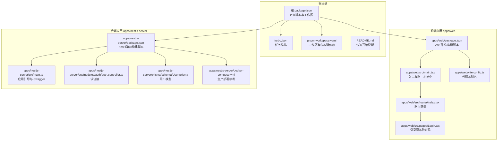
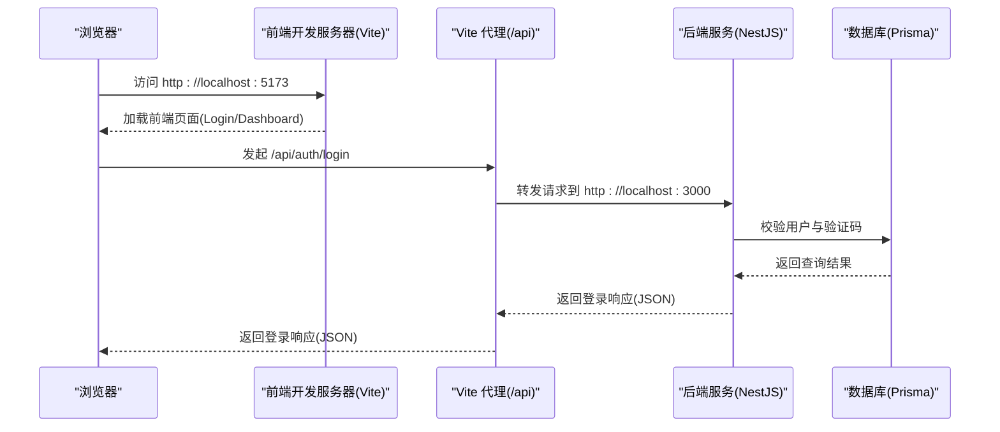
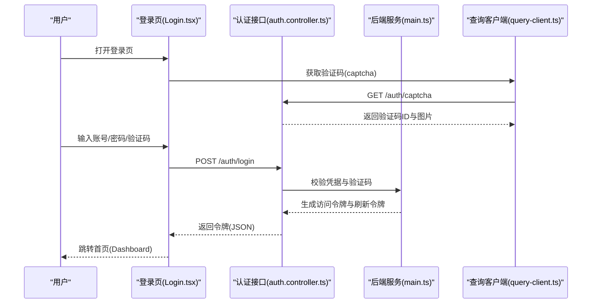
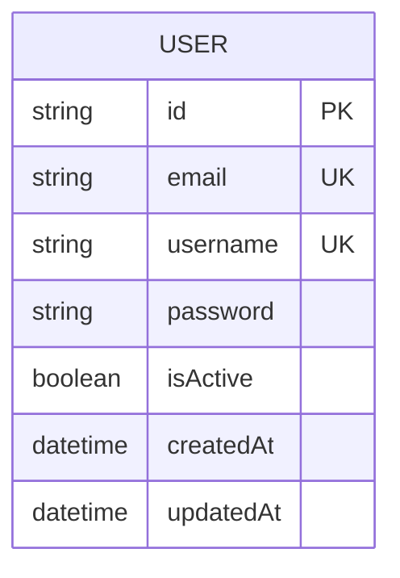
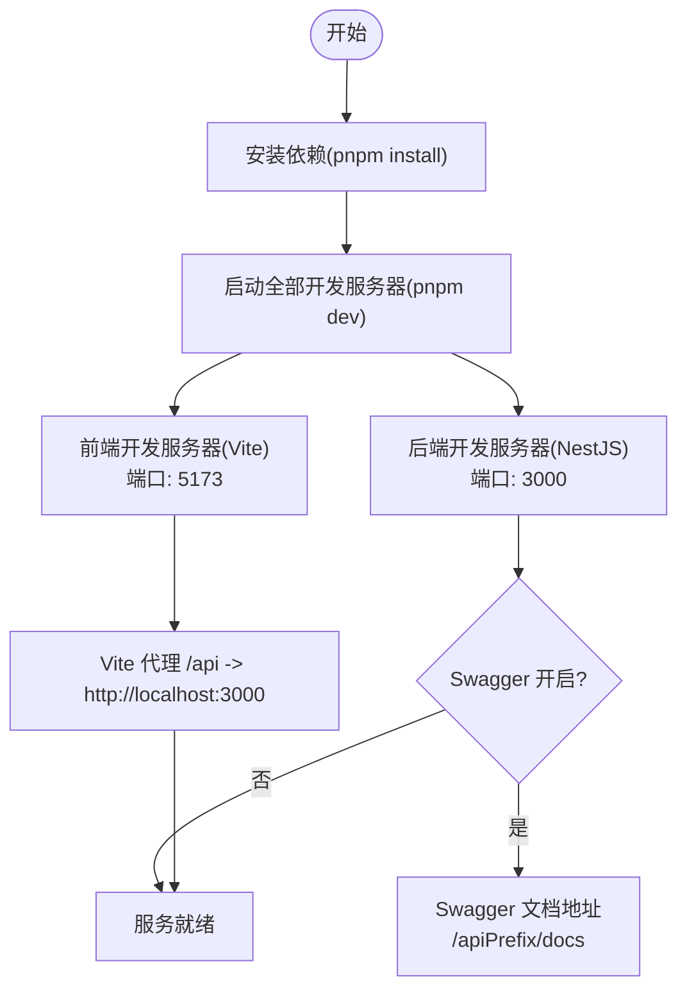
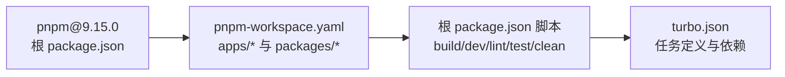

# 快速开始

<cite>
**本文引用的文件**
- [README.md](file://README.md)
- [package.json](file://package.json)
- [pnpm-workspace.yaml](file://pnpm-workspace.yaml)
- [turbo.json](file://turbo.json)
- [apps/nestjs-server/package.json](file://apps/nestjs-server/package.json)
- [apps/web/package.json](file://apps/web/package.json)
- [apps/nestjs-server/src/main.ts](file://apps/nestjs-server/src/main.ts)
- [apps/web/src/main.tsx](file://apps/web/src/main.tsx)
- [apps/web/vite.config.ts](file://apps/web/vite.config.ts)
- [apps/nestjs-server/docker-compose.yml](file://apps/nestjs-server/docker-compose.yml)
- [apps/nestjs-server/src/modules/auth/auth.controller.ts](file://apps/nestjs-server/src/modules/auth/auth.controller.ts)
- [apps/web/src/pages/Login.tsx](file://apps/web/src/pages/Login.tsx)
- [apps/web/src/router/index.tsx](file://apps/web/src/router/index.tsx)
- [apps/nestjs-server/prisma/schema/User.prisma](file://apps/nestjs-server/prisma/schema/User.prisma)
</cite>

## 目录

1. [简介](#简介)
2. [项目结构](#项目结构)
3. [核心组件](#核心组件)
4. [架构总览](#架构总览)
5. [详细组件分析](#详细组件分析)
6. [依赖分析](#依赖分析)
7. [性能考虑](#性能考虑)
8. [故障排除指南](#故障排除指南)
9. [结论](#结论)
10. [附录](#附录)

## 简介

本指南面向首次接触 Nebula 的开发者，目标是在约 15 分钟内完成环境准备、依赖安装、开发服务器启动，并通过浏览器访问前端页面、登录系统，理解项目的基本运行流程与核心功能。项目采用 pnpm 工作区与 Turbo 构建管线，后端基于 NestJS，前端基于 React + Vite，数据库使用 Prisma 与 SQLite（开发环境），并通过 Docker Compose 提供生产级部署参考。

## 项目结构

Nebula 是一个基于 pnpm 工作区与 Turbo 的单仓库（monorepo）工程，主要包含以下部分：

- apps/web：前端应用（React + Vite）
- apps/nestjs-server：后端服务（NestJS + Prisma）
- packages/\*：共享包（如 ESLint、TypeScript 配置等）
- 根目录脚本与工作区配置：统一构建、开发、测试、格式化等命令

图表来源

- [README.md:17-44](file://README.md#L17-L44)
- [package.json:5-21](file://package.json#L5-L21)
- [turbo.json:1-26](file://turbo.json#L1-L26)
- [pnpm-workspace.yaml:1-12](file://pnpm-workspace.yaml#L1-L12)
- [apps/web/package.json:6-13](file://apps/web/package.json#L6-L13)
- [apps/web/src/main.tsx:1-20](file://apps/web/src/main.tsx#L1-L20)
- [apps/web/src/router/index.tsx:12-48](file://apps/web/src/router/index.tsx#L12-L48)
- [apps/web/src/pages/Login.tsx:60-92](file://apps/web/src/pages/Login.tsx#L60-L92)
- [apps/web/vite.config.ts:6-22](file://apps/web/vite.config.ts#L6-L22)
- [apps/nestjs-server/package.json:8-25](file://apps/nestjs-server/package.json#L8-L25)
- [apps/nestjs-server/src/main.ts:9-46](file://apps/nestjs-server/src/main.ts#L9-L46)
- [apps/nestjs-server/src/modules/auth/auth.controller.ts:30-114](file://apps/nestjs-server/src/modules/auth/auth.controller.ts#L30-L114)
- [apps/nestjs-server/prisma/schema/User.prisma:1-15](file://apps/nestjs-server/prisma/schema/User.prisma#L1-L15)
- [apps/nestjs-server/docker-compose.yml:1-37](file://apps/nestjs-server/docker-compose.yml#L1-L37)

章节来源

- [README.md:5-15](file://README.md#L5-L15)
- [package.json:1-22](file://package.json#L1-L22)
- [turbo.json:1-26](file://turbo.json#L1-L26)
- [pnpm-workspace.yaml:1-12](file://pnpm-workspace.yaml#L1-L12)

## 核心组件

- 前端应用（apps/web）
  - 使用 Vite 作为开发服务器与打包工具，提供热更新与快速启动体验
  - 通过 React Router 管理页面路由，登录页集成验证码与表单校验
  - 通过本地代理将 /api 请求转发至后端服务（默认端口 3000）
- 后端服务（apps/nestjs-server）
  - 使用 NestJS 框架，启用 Swagger 文档（可配置开关）
  - 提供认证相关接口（验证码、注册、登录、刷新、退出、获取用户资料）
  - 使用 Prisma 管理数据库模型与迁移（开发环境为 SQLite）
- 工作区与构建
  - pnpm 工作区统一管理包依赖与脚本
  - Turbo 统一编排构建、开发、测试、类型检查等任务

章节来源

- [apps/web/package.json:6-13](file://apps/web/package.json#L6-L13)
- [apps/web/vite.config.ts:13-21](file://apps/web/vite.config.ts#L13-L21)
- [apps/nestjs-server/package.json:8-25](file://apps/nestjs-server/package.json#L8-L25)
- [apps/nestjs-server/src/main.ts:24-33](file://apps/nestjs-server/src/main.ts#L24-L33)
- [apps/nestjs-server/src/modules/auth/auth.controller.ts:38-114](file://apps/nestjs-server/src/modules/auth/auth.controller.ts#L38-L114)

## 架构总览

下图展示了从浏览器到后端服务的整体调用链路，以及前端开发服务器与后端服务之间的代理关系。

图表来源

- [apps/web/vite.config.ts:15-20](file://apps/web/vite.config.ts#L15-L20)
- [apps/nestjs-server/src/modules/auth/auth.controller.ts:63-76](file://apps/nestjs-server/src/modules/auth/auth.controller.ts#L63-L76)
- [apps/web/src/pages/Login.tsx:79-92](file://apps/web/src/pages/Login.tsx#L79-L92)

## 详细组件分析

### 前端登录流程

- 用户在前端登录页输入账号、密码与验证码
- 前端触发登录请求，同时调用验证码接口获取 SVG 图片与验证码 ID
- 登录成功后，前端根据返回的令牌进行后续受保护资源访问

图表来源

- [apps/web/src/pages/Login.tsx:60-92](file://apps/web/src/pages/Login.tsx#L60-L92)
- [apps/nestjs-server/src/modules/auth/auth.controller.ts:38-76](file://apps/nestjs-server/src/modules/auth/auth.controller.ts#L38-L76)
- [apps/nestjs-server/src/main.ts:9-46](file://apps/nestjs-server/src/main.ts#L9-L46)

章节来源

- [apps/web/src/pages/Login.tsx:60-221](file://apps/web/src/pages/Login.tsx#L60-L221)
- [apps/nestjs-server/src/modules/auth/auth.controller.ts:38-114](file://apps/nestjs-server/src/modules/auth/auth.controller.ts#L38-L114)

### 数据模型与数据库

- 用户模型包含唯一邮箱、用户名、密码、状态与时间戳等字段
- 开发环境使用 SQLite（由 Prisma 适配器与 Better SQLite3 支持）

图表来源

- [apps/nestjs-server/prisma/schema/User.prisma:1-15](file://apps/nestjs-server/prisma/schema/User.prisma#L1-L15)

章节来源

- [apps/nestjs-server/prisma/schema/User.prisma:1-15](file://apps/nestjs-server/prisma/schema/User.prisma#L1-L15)

### 开发服务器启动流程

- 根目录提供统一开发命令，Turbo 并行启动前端与后端开发服务器
- 前端开发服务器默认端口为 5173，后端服务默认端口为 3000
- Vite 将 /api 前缀的请求代理到后端服务，便于前后端联调

图表来源

- [README.md:17-29](file://README.md#L17-L29)
- [package.json:5-14](file://package.json#L5-L14)
- [turbo.json:8-11](file://turbo.json#L8-L11)
- [apps/web/vite.config.ts:13-21](file://apps/web/vite.config.ts#L13-L21)
- [apps/nestjs-server/src/main.ts:24-33](file://apps/nestjs-server/src/main.ts#L24-L33)

章节来源

- [README.md:17-29](file://README.md#L17-L29)
- [package.json:5-14](file://package.json#L5-L14)
- [turbo.json:8-11](file://turbo.json#L8-L11)
- [apps/web/vite.config.ts:13-21](file://apps/web/vite.config.ts#L13-L21)
- [apps/nestjs-server/src/main.ts:24-33](file://apps/nestjs-server/src/main.ts#L24-L33)

## 依赖分析

- 包管理器与版本
  - 使用 pnpm 作为包管理器，版本在根 package.json 中声明
  - 工作区通过 pnpm-workspace.yaml 声明，包含 apps 与 packages 下的包
- 任务编排
  - Turbo 统一定义 build/dev/lint/typecheck/test/clean 等任务
  - 根 package.json 中的脚本通过 Turbo 调度各子包任务
- 仅构建依赖
  - pnpm-workspace.yaml 中声明了仅需构建的依赖列表，减少不必要的二进制下载

图表来源

- [package.json:20](file://package.json#L20)
- [pnpm-workspace.yaml:1-12](file://pnpm-workspace.yaml#L1-12)
- [turbo.json:3-24](file://turbo.json#L3-L24)
- [package.json:5-14](file://package.json#L5-L14)

章节来源

- [package.json:16-21](file://package.json#L16-L21)
- [pnpm-workspace.yaml:1-12](file://pnpm-workspace.yaml#L1-L12)
- [turbo.json:1-26](file://turbo.json#L1-L26)
- [package.json:5-14](file://package.json#L5-L14)

## 性能考虑

- 开发阶段
  - 前端使用 Vite 的 HMR（热模块替换）提升开发体验
  - 后端使用 NestJS 的 watch 模式实现快速重启
- 生产部署
  - Docker Compose 提供 PostgreSQL 与应用容器的组合部署参考
  - 可通过调整 Swagger 开关与日志级别优化启动与运行时性能

## 故障排除指南

- 无法启动开发服务器
  - 确认已执行依赖安装命令
  - 检查端口占用（前端 5173、后端 3000）
- 登录失败或验证码无效
  - 确认前端已成功获取验证码并携带验证码 ID
  - 检查后端认证接口是否正常响应
- API 代理失败
  - 确认 Vite 代理配置指向正确的后端地址
- Swagger 文档不可见
  - 检查后端配置中的 Swagger 开关与全局前缀

章节来源

- [apps/web/vite.config.ts:15-20](file://apps/web/vite.config.ts#L15-L20)
- [apps/nestjs-server/src/main.ts:24-33](file://apps/nestjs-server/src/main.ts#L24-L33)
- [apps/web/src/pages/Login.tsx:79-92](file://apps/web/src/pages/Login.tsx#L79-L92)

## 结论

通过本快速开始指南，您已经完成了环境准备、依赖安装与开发服务器启动，并成功登录系统。建议在理解基础流程后，进一步探索认证接口、路由配置与数据库模型，逐步扩展功能。

## 附录

### 环境要求

- Node.js 与 pnpm
  - pnpm 版本在根 package.json 中声明
  - 请使用与声明版本一致或兼容的 Node.js 版本
- 操作系统
  - Windows/Linux/macOS 均可运行（推荐使用最新 LTS 版本）

章节来源

- [package.json:20](file://package.json#L20)

### 依赖安装步骤

- 在项目根目录执行依赖安装命令
- 安装完成后，即可进入开发模式

章节来源

- [README.md:19-23](file://README.md#L19-L23)

### 开发服务器启动流程

- 启动全部开发服务器
- 浏览器访问前端地址，登录后进入后台页面

章节来源

- [README.md:25-29](file://README.md#L25-L29)

### 核心命令说明

- 构建所有包
- 启动开发服务器（前端与后端）
- 仅启动前端开发服务器
- 仅启动后端开发服务器
- 代码风格与格式化
- 类型检查
- 单元测试与 E2E 测试
- 清理构建产物

章节来源

- [README.md:31-44](file://README.md#L31-L44)
- [package.json:5-14](file://package.json#L5-L14)

### 首次运行验证步骤

- 访问前端登录页，输入任意账号与密码
- 若出现登录错误提示，请确认后端服务已启动且可访问
- 成功登录后，应跳转至仪表盘页面

章节来源

- [apps/web/src/pages/Login.tsx:60-92](file://apps/web/src/pages/Login.tsx#L60-L92)
- [apps/web/src/router/index.tsx:12-48](file://apps/web/src/router/index.tsx#L12-L48)

### 生产部署参考

- 使用 Docker Compose 启动应用与数据库容器
- 环境变量包括数据库连接、JWT 密钥与跨域配置等

章节来源

- [apps/nestjs-server/docker-compose.yml:1-37](file://apps/nestjs-server/docker-compose.yml#L1-L37)
