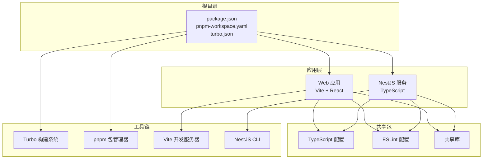
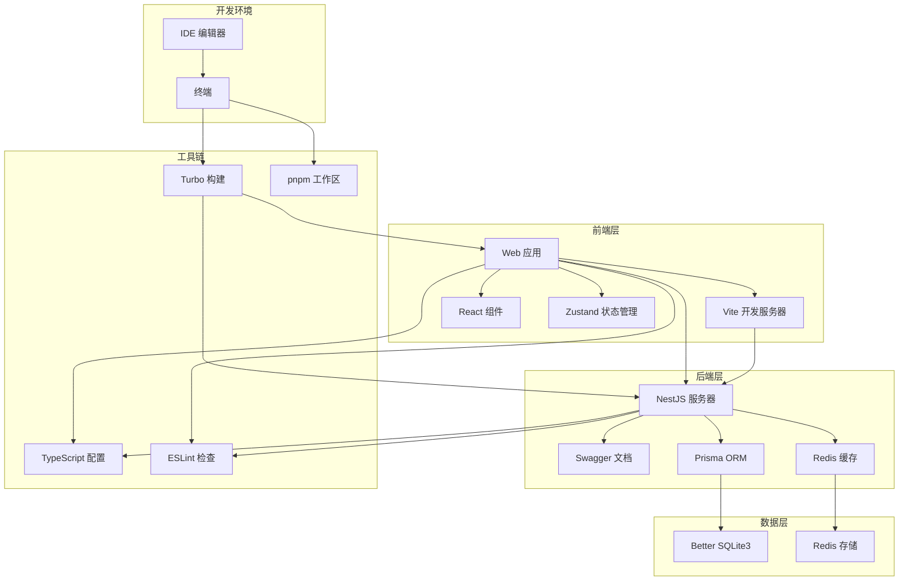
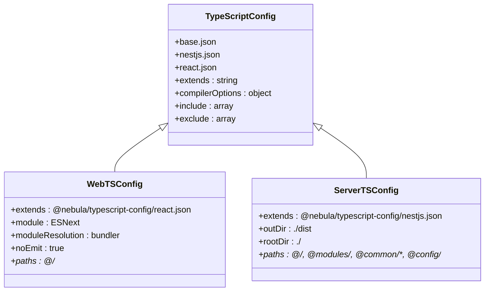
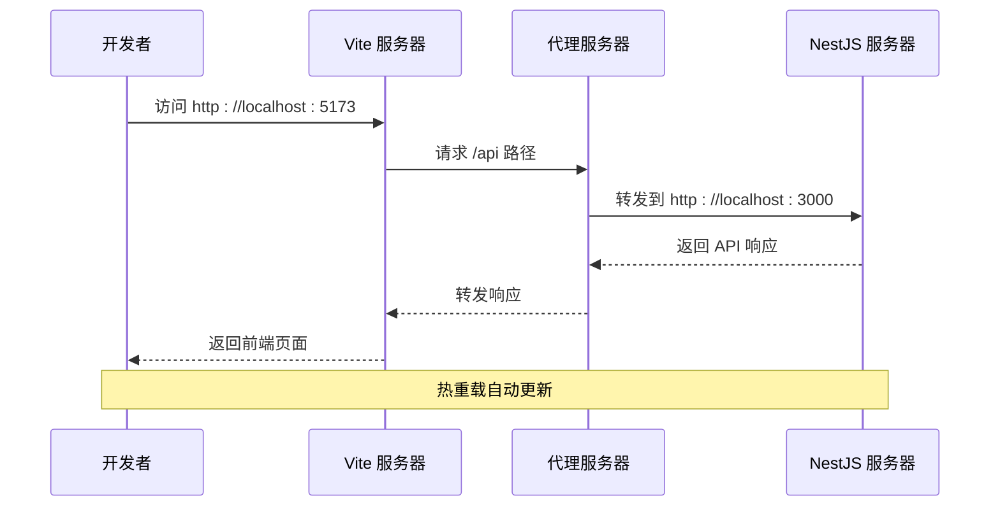
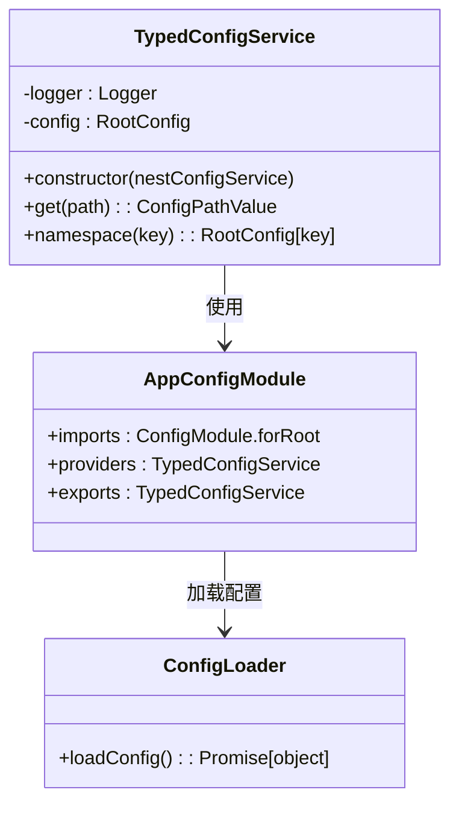

# 开发环境问题排查指南

<cite>
**本文档引用的文件**
- [package.json](file://package.json)
- [pnpm-workspace.yaml](file://pnpm-workspace.yaml)
- [turbo.json](file://turbo.json)
- [apps/nestjs-server/package.json](file://apps/nestjs-server/package.json)
- [apps/web/package.json](file://apps/web/package.json)
- [apps/web/tsconfig.json](file://apps/web/tsconfig.json)
- [apps/nestjs-server/tsconfig.json](file://apps/nestjs-server/tsconfig.json)
- [apps/web/vite.config.ts](file://apps/web/vite.config.ts)
- [apps/nestjs-server/nest-cli.json](file://apps/nestjs-server/nest-cli.json)
- [.gitignore](file://.gitignore)
- [apps/nestjs-server/.gitignore](file://apps/nestjs-server/.gitignore)
- [apps/web/src/main.tsx](file://apps/web/src/main.tsx)
- [apps/nestjs-server/src/main.ts](file://apps/nestjs-server/src/main.ts)
- [apps/nestjs-server/src/config/config.module.ts](file://apps/nestjs-server/src/config/config.module.ts)
- [apps/nestjs-server/src/config/typed-config.service.ts](file://apps/nestjs-server/src/config/typed-config.service.ts)
- [packages/typescript-config/package.json](file://packages/typescript-config/package.json)
- [packages/eslint-config/package.json](file://packages/eslint-config/package.json)
</cite>

## 目录

1. [简介](#简介)
2. [项目结构](#项目结构)
3. [核心组件](#核心组件)
4. [架构概览](#架构概览)
5. [详细组件分析](#详细组件分析)
6. [依赖关系分析](#依赖关系分析)
7. [性能考虑](#性能考虑)
8. [故障排除指南](#故障排除指南)
9. [结论](#结论)

## 简介

本指南旨在帮助开发者快速识别和解决 Nebula Monorepo 项目中的常见开发环境问题。该仓库采用 pnpm 工作区、Turbo 构建系统和 Vite/NestJS 技术栈，支持 React 前端和 NestJS 后端的现代化开发流程。

## 项目结构

该项目采用 monorepo 结构，主要包含以下核心目录：



**图表来源**

- [package.json:1-22](file://package.json#L1-L22)
- [pnpm-workspace.yaml:1-12](file://pnpm-workspace.yaml#L1-L12)
- [turbo.json:1-26](file://turbo.json#L1-L26)

**章节来源**

- [package.json:1-22](file://package.json#L1-L22)
- [pnpm-workspace.yaml:1-12](file://pnpm-workspace.yaml#L1-L12)
- [turbo.json:1-26](file://turbo.json#L1-L26)

## 核心组件

### 包管理器配置

项目使用 pnpm 作为包管理器，并通过工作区配置实现多包管理：

- **包管理器版本**: pnpm@9.15.0
- **工作区范围**: apps/_ 和 packages/_
- **仅构建依赖**: @nestjs/core、@prisma/engines、better-sqlite3、prisma 等

### 构建系统

Turbo 提供了统一的构建任务管理和缓存机制：

- **构建任务**: build（依赖上游包构建）
- **开发任务**: dev（持久化任务，禁用缓存）
- **类型检查**: typecheck（依赖构建）
- **测试任务**: test（依赖构建）

### 技术栈配置

前端使用 Vite + React + TypeScript，后端使用 NestJS + TypeScript：

- **前端版本**: React 19.1.0、Vite 8.0.0、TypeScript 6.0.3
- **后端版本**: NestJS 11.0.1、TypeScript 6.0.3
- **状态管理**: Zustand（前端）、NestJS 内置（后端）

**章节来源**

- [package.json:16-20](file://package.json#L16-L20)
- [pnpm-workspace.yaml:1-12](file://pnpm-workspace.yaml#L1-L12)
- [turbo.json:3-24](file://turbo.json#L3-L24)
- [apps/web/package.json:14-42](file://apps/web/package.json#L14-L42)
- [apps/nestjs-server/package.json:26-83](file://apps/nestjs-server/package.json#L26-L83)

## 架构概览



**图表来源**

- [apps/web/vite.config.ts:6-22](file://apps/web/vite.config.ts#L6-L22)
- [apps/nestjs-server/src/main.ts:9-46](file://apps/nestjs-server/src/main.ts#L9-L46)
- [apps/web/package.json:14-42](file://apps/web/package.json#L14-L42)
- [apps/nestjs-server/package.json:26-83](file://apps/nestjs-server/package.json#L26-L83)

## 详细组件分析

### TypeScript 配置分析

项目采用分层的 TypeScript 配置策略：



**图表来源**

- [packages/typescript-config/package.json:1-11](file://packages/typescript-config/package.json#L1-L11)
- [apps/web/tsconfig.json:1-15](file://apps/web/tsconfig.json#L1-L15)
- [apps/nestjs-server/tsconfig.json:1-16](file://apps/nestjs-server/tsconfig.json#L1-L16)

### Vite 开发服务器配置

前端开发服务器提供了完整的开发体验：



**图表来源**

- [apps/web/vite.config.ts:13-21](file://apps/web/vite.config.ts#L13-L21)

### NestJS 配置管理系统

后端采用了强类型的配置管理方案：



**图表来源**

- [apps/nestjs-server/src/config/typed-config.service.ts:6-46](file://apps/nestjs-server/src/config/typed-config.service.ts#L6-L46)
- [apps/nestjs-server/src/config/config.module.ts:1-20](file://apps/nestjs-server/src/config/config.module.ts#L1-L20)

**章节来源**

- [apps/web/tsconfig.json:1-15](file://apps/web/tsconfig.json#L1-L15)
- [apps/nestjs-server/tsconfig.json:1-16](file://apps/nestjs-server/tsconfig.json#L1-L16)
- [apps/web/vite.config.ts:1-23](file://apps/web/vite.config.ts#L1-L23)
- [apps/nestjs-server/src/config/typed-config.service.ts:1-46](file://apps/nestjs-server/src/config/typed-config.service.ts#L1-L46)
- [apps/nestjs-server/src/config/config.module.ts:1-20](file://apps/nestjs-server/src/config/config.module.ts#L1-L20)

## 依赖关系分析

```mermaid
graph TB
subgraph "前端依赖"
React[react: ^19.1.0]
ReactDOM[react-dom: ^19.1.0]
Zustand[zustand: ^5.0.14]
TanStack[tanstack/react-query: ^5.59.0]
Vite[vite: ^8.0.0]
TypeScript[typescript: ^6.0.3]
end
subgraph "后端依赖"
NestJS[nestjs: ^11.0.1]
Prisma[prisma: ^7.8.0]
Redis[redis: ^6.0.0]
Passport[passport: ^0.7.0]
JWT[nestjs-jwt: ^11.0.2]
Swagger[nestjs-swagger: ^11.4.4]
end
subgraph "开发依赖"
Turbo[turbo: ^2.3.0]
ESLint[eslint: ^9.18.0]
Prettier[prettier: ^3.4.2]
TSConfig[@nebula/typescript-config: workspace:*]
ESLintConfig[@nebula/eslint-config: workspace:*]
end
React --> Zustand
React --> TanStack
Vite --> React
NestJS --> Passport
NestJS --> JWT
NestJS --> Swagger
Prisma --> Redis
Turbo --> Vite
Turbo --> NestJS
ESLint --> TSConfig
Prettier --> ESLintConfig
```

**图表来源**

- [apps/web/package.json:14-42](file://apps/web/package.json#L14-L42)
- [apps/nestjs-server/package.json:26-83](file://apps/nestjs-server/package.json#L26-L83)
- [package.json:16-19](file://package.json#L16-L19)

**章节来源**

- [apps/web/package.json:14-42](file://apps/web/package.json#L14-L42)
- [apps/nestjs-server/package.json:26-83](file://apps/nestjs-server/package.json#L26-L83)
- [package.json:16-19](file://package.json#L16-L19)

## 性能考虑

### 构建性能优化

- **Turbo 缓存**: 利用增量构建和缓存机制提升构建速度
- **并行执行**: 多包同时构建，充分利用多核 CPU
- **持久化任务**: 开发模式下保持服务常驻，减少重启开销

### 开发服务器性能

- **热重载**: Vite 提供快速的模块热替换
- **按需编译**: 只编译变更的模块
- **代理配置**: 避免跨域问题，提高开发效率

## 故障排除指南

### Node.js 版本兼容性问题

**问题症状**:

- 安装依赖时报错，提示 Node.js 版本过低
- 运行时出现语法错误或 API 不可用

**诊断步骤**:

1. 检查当前 Node.js 版本
2. 对比项目要求的最低版本
3. 查看 package.json 中的 engines 字段

**解决方案**:

- 升级 Node.js 到推荐版本
- 使用 nvm 或类似工具管理多个 Node.js 版本
- 清理缓存后重新安装依赖

**章节来源**

- [package.json:20](file://package.json#L20)

### pnpm 工作区依赖安装失败

**问题症状**:

- 工作区包无法正确链接
- 依赖安装过程中出现循环依赖错误
- 构建时找不到工作区内的包

**诊断步骤**:

1. 检查 pnpm-workspace.yaml 配置
2. 验证包的 version 字段是否为 workspace:\*
3. 确认包名符合规范

**解决方案**:

1. 运行 `pnpm install --frozen-lockfile`
2. 清理 node_modules 和 pnpm-store
3. 检查网络连接和 registry 配置

**章节来源**

- [pnpm-workspace.yaml:1-12](file://pnpm-workspace.yaml#L1-12)
- [apps/web/package.json:16](file://apps/web/package.json#L16)
- [apps/nestjs-server/package.json:28](file://apps/nestjs-server/package.json#L28)

### TypeScript 编译错误

**问题症状**:

- 类型检查失败
- 编译时报错，无法生成输出文件
- IDE 中显示类型错误

**常见错误类型及解决方案**:

1. **路径映射错误**
   - 检查 tsconfig.json 中的 paths 配置
   - 确保 @/\* 映射到正确的源码目录

2. **模块解析问题**
   - 验证 moduleResolution 设置
   - 检查工作区包的导出配置

3. **类型声明冲突**
   - 清理类型缓存文件
   - 检查重复的类型声明

**章节来源**

- [apps/web/tsconfig.json:4-11](file://apps/web/tsconfig.json#L4-L11)
- [apps/nestjs-server/tsconfig.json:3-12](file://apps/nestjs-server/tsconfig.json#L3-L12)

### 热重载不生效

**问题症状**:

- 修改代码后页面不刷新
- 控制台显示热更新失败
- 开发服务器异常退出

**诊断步骤**:

1. 检查 Vite 配置中的 server.watch 选项
2. 验证文件监听权限
3. 检查是否有文件被 .gitignore 排除

**解决方案**:

1. 重启 Vite 开发服务器
2. 检查防火墙设置
3. 更新 Vite 到最新版本

**章节来源**

- [apps/web/vite.config.ts:13-21](file://apps/web/vite.config.ts#L13-L21)

### 开发服务器启动失败

**问题症状**:

- Vite 服务器启动失败
- 端口被占用
- CORS 配置错误

**诊断步骤**:

1. 检查端口占用情况
2. 验证代理配置
3. 确认环境变量设置

**解决方案**:

1. 更改开发端口配置
2. 检查防火墙设置
3. 验证代理目标服务器状态

**章节来源**

- [apps/web/vite.config.ts:13-21](file://apps/web/vite.config.ts#L13-L21)

### 环境变量配置问题

**问题症状**:

- 应用启动时缺少配置
- 配置加载失败
- 生产环境配置缺失

**诊断步骤**:

1. 检查 .env 文件是否存在
2. 验证配置文件格式
3. 确认 NODE_ENV 设置

**解决方案**:

1. 创建对应的 .env 文件
2. 验证配置项完整性
3. 检查配置加载逻辑

**章节来源**

- [.gitignore:15-19](file://.gitignore#L15-L19)
- [apps/nestjs-server/.gitignore:41-46](file://apps/nestjs-server/.gitignore#L41-L46)
- [apps/nestjs-server/src/config/config.module.ts:9-14](file://apps/nestjs-server/src/config/config.module.ts#L9-L14)

### IDE 配置建议

**VS Code 推荐设置**:

1. 安装 TypeScript 和 JavaScript 扩展包
2. 配置工作区推荐扩展
3. 设置编辑器格式化规则
4. 启用 TypeScript 智能感知

**配置要点**:

- 使用工作区级别的 TypeScript 配置
- 配置路径映射支持
- 启用 ESLint 和 Prettier 集成

**章节来源**

- [.gitignore:32-38](file://.gitignore#L32-L38)
- [apps/web/tsconfig.json:8-10](file://apps/web/tsconfig.json#L8-L10)
- [apps/nestjs-server/tsconfig.json:6-11](file://apps/nestjs-server/tsconfig.json#L6-L11)

## 结论

本指南涵盖了 Nebula Monorepo 项目开发环境中的主要问题和解决方案。通过理解项目的技术栈配置、构建系统和开发工具链，开发者可以更有效地进行问题诊断和解决。

关键要点包括：

- 正确的包管理器和工作区配置
- TypeScript 配置的一致性
- 开发服务器的正确设置
- 环境变量的安全管理
- IDE 的最佳实践配置

建议在遇到新问题时，按照故障排除指南的步骤逐一排查，并参考相关配置文件的具体设置。
