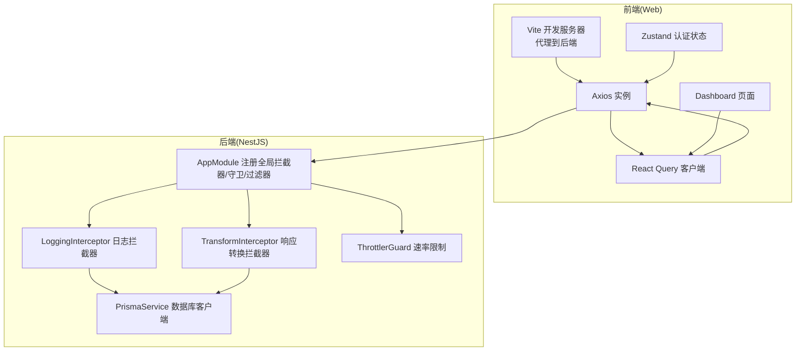
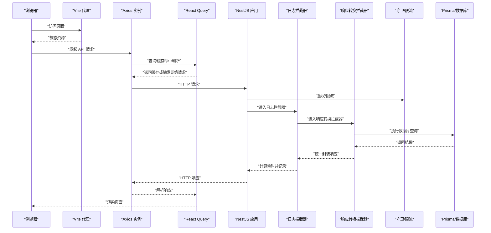
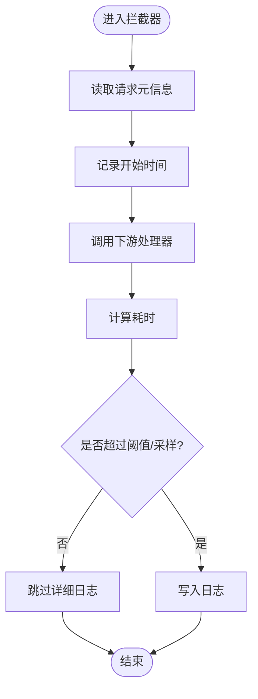
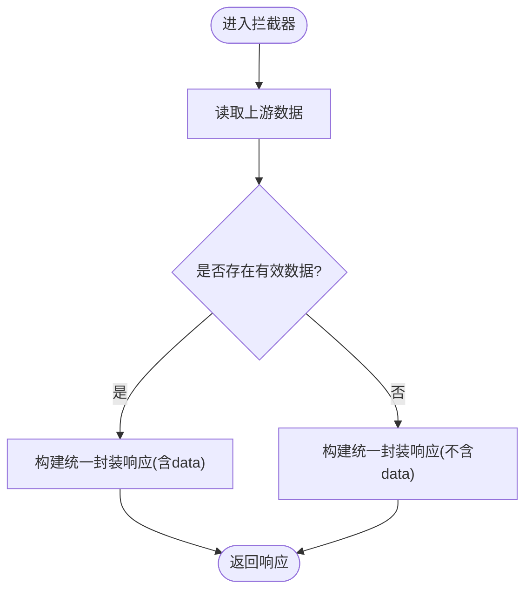
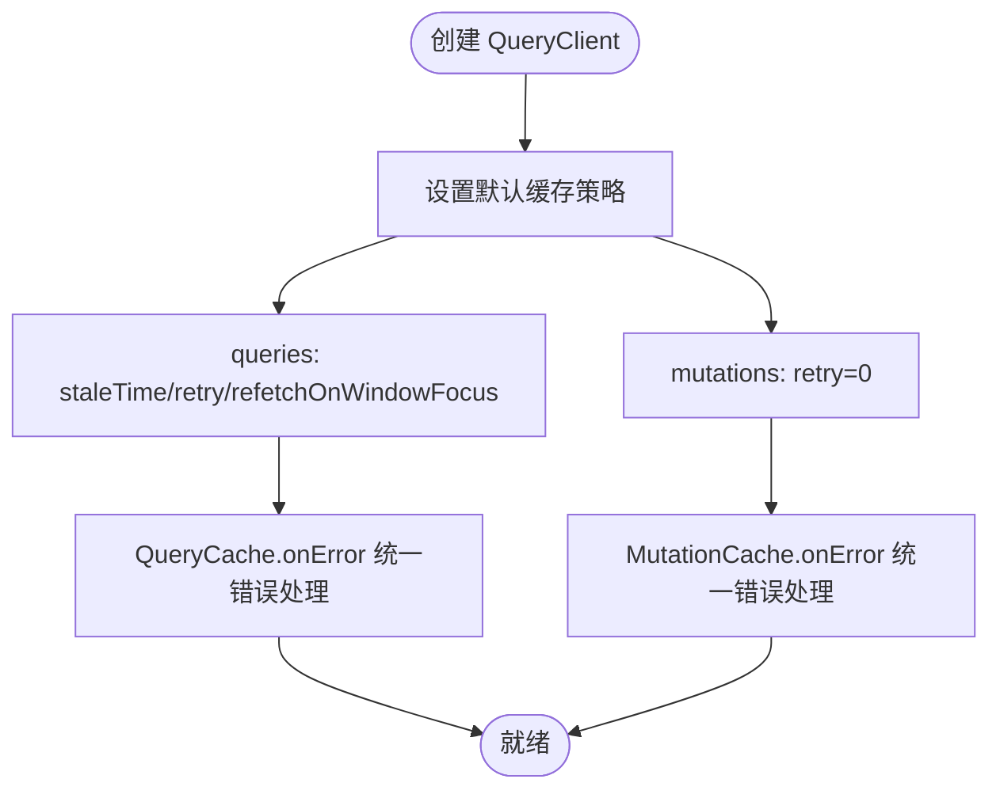
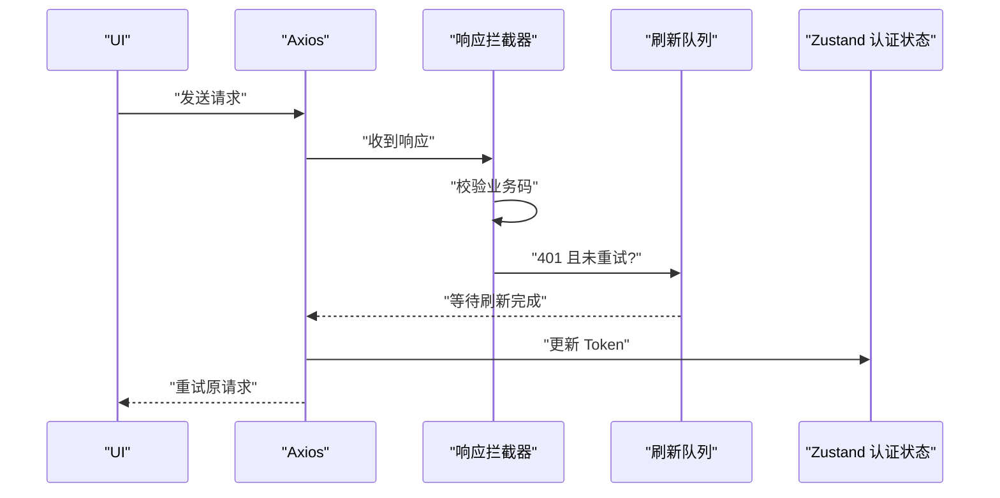
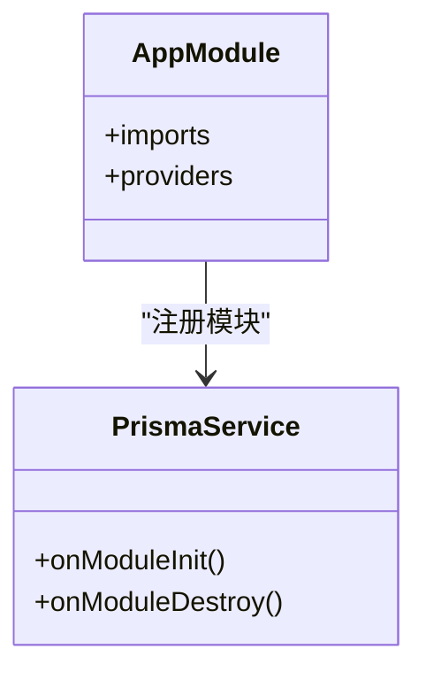
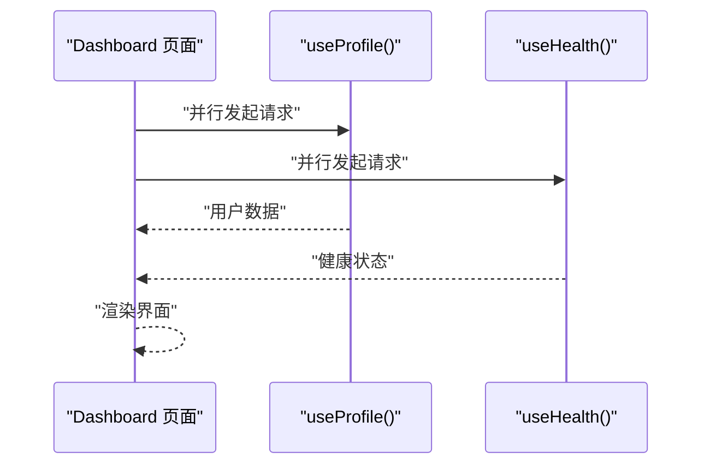
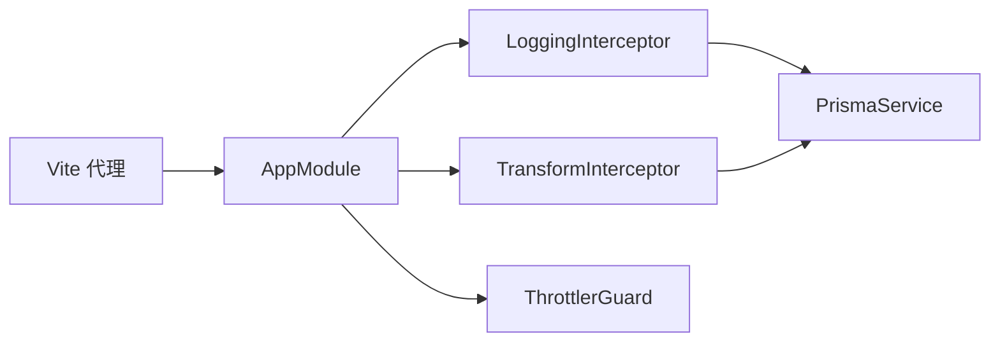

# 性能问题

<cite>
**本文引用的文件**
- [apps/nestjs-server/src/app.module.ts](file://apps/nestjs-server/src/app.module.ts)
- [apps/nestjs-server/src/common/interceptors/logging.interceptor.ts](file://apps/nestjs-server/src/common/interceptors/logging.interceptor.ts)
- [apps/nestjs-server/src/common/interceptors/transform.interceptor.ts](file://apps/nestjs-server/src/common/interceptors/transform.interceptor.ts)
- [apps/nestjs-server/src/common/guards/throttler.guard.ts](file://apps/nestjs-server/src/common/guards/throttler.guard.ts)
- [apps/nestjs-server/src/modules/logger/log-query.service.ts](file://apps/nestjs-server/src/modules/logger/log-query.service.ts)
- [apps/web/src/api/core/query-client.ts](file://apps/web/src/api/core/query-client.ts)
- [apps/web/src/api/core/http.ts](file://apps/web/src/api/core/http.ts)
- [apps/web/src/store/auth.ts](file://apps/web/src/store/auth.ts)
- [apps/web/src/pages/Dashboard.tsx](file://apps/web/src/pages/Dashboard.tsx)
- [apps/web/vite.config.ts](file://apps/web/vite.config.ts)
- [apps/nestjs-server/src/prisma/prisma.service.ts](file://apps/nestjs-server/src/prisma/prisma.service.ts)
</cite>

## 目录
1. [简介](#简介)
2. [项目结构](#项目结构)
3. [核心组件](#核心组件)
4. [架构总览](#架构总览)
5. [详细组件分析](#详细组件分析)
6. [依赖关系分析](#依赖关系分析)
7. [性能考量](#性能考量)
8. [故障排查指南](#故障排查指南)
9. [结论](#结论)
10. [附录](#附录)

## 简介
本指南聚焦于应用程序的性能问题诊断与优化，覆盖以下关键领域：
- 请求日志拦截器的性能影响评估与优化建议
- 响应转换拦截器的优化策略
- React Query 缓存策略调优
- 数据库查询性能优化
- 性能监控指标解读
- 内存泄漏检测技巧
- 并发请求处理最佳实践
- 缓存策略、网络请求与前端渲染性能提升方案

## 项目结构
该仓库采用前后端分离架构：
- 后端基于 NestJS，使用拦截器、守卫、过滤器等中间件层实现横切关注点；数据库访问通过 Prisma 客户端封装。
- 前端基于 Vite + React，使用 Axios 发起网络请求，React Query 负责缓存与状态管理，Zustand 管理认证状态。

图表来源
- [apps/web/vite.config.ts:13-21](file://apps/web/vite.config.ts#L13-L21)
- [apps/web/src/api/core/http.ts:66-80](file://apps/web/src/api/core/http.ts#L66-L80)
- [apps/web/src/api/core/query-client.ts:5-31](file://apps/web/src/api/core/query-client.ts#L5-L31)
- [apps/web/src/store/auth.ts:30-63](file://apps/web/src/store/auth.ts#L30-L63)
- [apps/web/src/pages/Dashboard.tsx:81-83](file://apps/web/src/pages/Dashboard.tsx#L81-L83)
- [apps/nestjs-server/src/app.module.ts:19-62](file://apps/nestjs-server/src/app.module.ts#L19-L62)
- [apps/nestjs-server/src/common/interceptors/logging.interceptor.ts:10-28](file://apps/nestjs-server/src/common/interceptors/logging.interceptor.ts#L10-L28)
- [apps/nestjs-server/src/common/interceptors/transform.interceptor.ts:13-34](file://apps/nestjs-server/src/common/interceptors/transform.interceptor.ts#L13-L34)
- [apps/nestjs-server/src/common/guards/throttler.guard.ts:20-31](file://apps/nestjs-server/src/common/guards/throttler.guard.ts#L20-L31)
- [apps/nestjs-server/src/prisma/prisma.service.ts:10-26](file://apps/nestjs-server/src/prisma/prisma.service.ts#L10-L26)

章节来源
- [apps/web/vite.config.ts:13-21](file://apps/web/vite.config.ts#L13-L21)
- [apps/nestjs-server/src/app.module.ts:19-62](file://apps/nestjs-server/src/app.module.ts#L19-L62)

## 核心组件
- 全局拦截器与守卫
  - 日志拦截器：记录请求方法、URL、用户、IP、UA 及耗时，便于定位慢请求与错误路径。
  - 响应转换拦截器：统一封装响应格式，避免重复序列化与分支逻辑。
  - 速率限制守卫：按短/中/长窗口限流，可对特定路由跳过。
- 前端网络与缓存
  - Axios 请求/响应拦截器：统一鉴权头注入、业务错误抛出、Token 刷新队列与重试。
  - React Query：默认查询缓存、过期时间、refetch 控制、错误回调。
  - Zustand 认证状态：持久化存储 Token，减少重复登录开销。
- 数据库访问
  - PrismaService：根据配置选择 SQLite 或 PostgreSQL，模块初始化/销毁时连接/断开。

章节来源
- [apps/nestjs-server/src/common/interceptors/logging.interceptor.ts:10-28](file://apps/nestjs-server/src/common/interceptors/logging.interceptor.ts#L10-L28)
- [apps/nestjs-server/src/common/interceptors/transform.interceptor.ts:13-34](file://apps/nestjs-server/src/common/interceptors/transform.interceptor.ts#L13-L34)
- [apps/nestjs-server/src/common/guards/throttler.guard.ts:20-31](file://apps/nestjs-server/src/common/guards/throttler.guard.ts#L20-L31)
- [apps/web/src/api/core/http.ts:94-179](file://apps/web/src/api/core/http.ts#L94-L179)
- [apps/web/src/api/core/query-client.ts:5-31](file://apps/web/src/api/core/query-client.ts#L5-L31)
- [apps/web/src/store/auth.ts:30-63](file://apps/web/src/store/auth.ts#L30-L63)
- [apps/nestjs-server/src/prisma/prisma.service.ts:10-26](file://apps/nestjs-server/src/prisma/prisma.service.ts#L10-L26)

## 架构总览
下图展示一次典型请求从浏览器到数据库的全链路，以及性能关键点：

图表来源
- [apps/web/vite.config.ts:13-21](file://apps/web/vite.config.ts#L13-L21)
- [apps/web/src/api/core/http.ts:94-179](file://apps/web/src/api/core/http.ts#L94-L179)
- [apps/web/src/api/core/query-client.ts:5-31](file://apps/web/src/api/core/query-client.ts#L5-L31)
- [apps/nestjs-server/src/app.module.ts:35-59](file://apps/nestjs-server/src/app.module.ts#L35-L59)
- [apps/nestjs-server/src/common/interceptors/logging.interceptor.ts:10-28](file://apps/nestjs-server/src/common/interceptors/logging.interceptor.ts#L10-L28)
- [apps/nestjs-server/src/common/interceptors/transform.interceptor.ts:13-34](file://apps/nestjs-server/src/common/interceptors/transform.interceptor.ts#L13-L34)
- [apps/nestjs-server/src/prisma/prisma.service.ts:28-34](file://apps/nestjs-server/src/prisma/prisma.service.ts#L28-L34)

## 详细组件分析

### 请求日志拦截器性能影响分析
- 当前实现
  - 在请求进入时记录基础信息，在响应完成时计算耗时并记录。
  - 使用同步时间戳与日志输出，属于轻量级开销。
- 性能风险
  - 高频请求场景下，频繁字符串拼接与日志写入可能成为瓶颈。
  - 若日志级别设置为 DEBUG/TRACE，会产生大量 IO。
- 优化建议
  - 将耗时阈值与采样率结合，仅记录超过阈值的请求。
  - 对高 QPS 接口开启低采样率或关闭详细字段（如 UA/IP）。
  - 使用异步/批量日志写入，避免阻塞主请求线程。
  - 将日志落盘与网络上报解耦，必要时使用缓冲队列。

图表来源
- [apps/nestjs-server/src/common/interceptors/logging.interceptor.ts:10-28](file://apps/nestjs-server/src/common/interceptors/logging.interceptor.ts#L10-L28)

章节来源
- [apps/nestjs-server/src/common/interceptors/logging.interceptor.ts:10-28](file://apps/nestjs-server/src/common/interceptors/logging.interceptor.ts#L10-L28)

### 响应转换拦截器优化策略
- 当前实现
  - 统一包装响应结构，按需携带 data 字段，减少前端分支判断。
- 性能收益
  - 减少重复序列化与条件分支，降低前端解析成本。
- 优化建议
  - 对无返回体的请求（如删除）避免携带 data 字段，缩小响应体积。
  - 对大对象分页/列表接口，优先使用分页参数，避免一次性传输海量数据。
  - 在后端进行必要的字段裁剪与压缩，减少网络带宽占用。

图表来源
- [apps/nestjs-server/src/common/interceptors/transform.interceptor.ts:13-34](file://apps/nestjs-server/src/common/interceptors/transform.interceptor.ts#L13-L34)

章节来源
- [apps/nestjs-server/src/common/interceptors/transform.interceptor.ts:13-34](file://apps/nestjs-server/src/common/interceptors/transform.interceptor.ts#L13-L34)

### React Query 缓存策略调优
- 默认配置要点
  - 查询默认重试次数有限，针对未授权错误直接停止重试。
  - 设置合理的 staleTime，控制“陈旧”判定。
  - 关闭窗口焦点自动刷新，避免不必要的后台刷新。
  - 禁止变更（mutation）重试，防止副作用重复触发。
- 优化建议
  - 针对高频读取接口缩短 staleTime，提高一致性。
  - 对热点数据启用背景刷新，但限制并发数量。
  - 使用查询键（queryKey）精细化缓存，避免跨页面污染。
  - 对需要实时性的接口禁用缓存或设置极短 staleTime。
  - 结合前端页面生命周期，主动清理不再使用的缓存。

图表来源
- [apps/web/src/api/core/query-client.ts:5-31](file://apps/web/src/api/core/query-client.ts#L5-L31)

章节来源
- [apps/web/src/api/core/query-client.ts:5-31](file://apps/web/src/api/core/query-client.ts#L5-L31)

### 网络请求优化与并发处理
- Axios 拦截器
  - 自动注入 Authorization 头，减少重复代码。
  - 统一业务错误抛出与 UI 提示。
  - Token 刷新采用队列机制，避免并发刷新导致的重复请求。
- 并发最佳实践
  - 合理设置超时时间，避免长时间挂起。
  - 对同源多请求合并或去重，减少重复网络往返。
  - 使用 AbortController 中断不再需要的请求。
  - 对上传/下载大文件使用流式处理，避免内存峰值。

图表来源
- [apps/web/src/api/core/http.ts:94-179](file://apps/web/src/api/core/http.ts#L94-L179)
- [apps/web/src/store/auth.ts:30-63](file://apps/web/src/store/auth.ts#L30-L63)

章节来源
- [apps/web/src/api/core/http.ts:94-179](file://apps/web/src/api/core/http.ts#L94-L179)
- [apps/web/src/store/auth.ts:30-63](file://apps/web/src/store/auth.ts#L30-L63)

### 数据库查询性能优化
- Prisma 配置
  - 支持 SQLite 与 PostgreSQL，开发环境可选 SQLite，生产环境推荐 PostgreSQL。
  - 模块初始化/销毁时连接/断开，确保生命周期可控。
- 优化建议
  - 使用索引覆盖常用查询字段，避免全表扫描。
  - 分页查询使用游标分页或基于索引的 LIMIT/OFFSET。
  - 批量插入/更新使用事务，减少往返次数。
  - 避免 N+1 查询，使用 include/@@relation 预加载关联。
  - 对复杂统计类查询考虑物化视图或缓存中间结果。

图表来源
- [apps/nestjs-server/src/prisma/prisma.service.ts:6-35](file://apps/nestjs-server/src/prisma/prisma.service.ts#L6-L35)
- [apps/nestjs-server/src/app.module.ts:29-34](file://apps/nestjs-server/src/app.module.ts#L29-L34)

章节来源
- [apps/nestjs-server/src/prisma/prisma.service.ts:10-26](file://apps/nestjs-server/src/prisma/prisma.service.ts#L10-L26)

### 前端渲染性能提升
- 页面现状
  - Dashboard 页面在加载时会并行拉取用户资料与健康检查数据。
- 优化建议
  - 使用 Suspense/渐进式渲染，优先展示骨架屏或占位符。
  - 对不关键的区域延迟加载（懒加载组件/路由）。
  - 合理拆分组件，避免不必要的重渲染。
  - 使用 React.memo/useMemo/useCallback 缓存计算结果。
  - 减少 DOM 层级与样式复杂度，避免过度重排重绘。

图表来源
- [apps/web/src/pages/Dashboard.tsx:81-83](file://apps/web/src/pages/Dashboard.tsx#L81-L83)

章节来源
- [apps/web/src/pages/Dashboard.tsx:81-83](file://apps/web/src/pages/Dashboard.tsx#L81-L83)

## 依赖关系分析
- 全局注册点
  - AppModule 将拦截器、守卫、过滤器、验证管道等作为全局提供者，确保横切逻辑贯穿所有控制器。
- 前后端交互
  - 前端通过 Vite 代理将 /api 请求转发至 NestJS 服务，简化跨域与本地联调。
- 日志查询
  - 后端提供日志查询服务，支持按级别、关键词、时间范围筛选，便于定位性能问题。

图表来源
- [apps/nestjs-server/src/app.module.ts:35-59](file://apps/nestjs-server/src/app.module.ts#L35-L59)
- [apps/web/vite.config.ts:15-20](file://apps/web/vite.config.ts#L15-L20)

章节来源
- [apps/nestjs-server/src/app.module.ts:19-62](file://apps/nestjs-server/src/app.module.ts#L19-L62)
- [apps/web/vite.config.ts:15-20](file://apps/web/vite.config.ts#L15-L20)

## 性能考量
- 指标与观测
  - 后端：请求耗时分布、错误率、吞吐量、数据库慢查询数、Redis/缓存命中率。
  - 前端：首屏时间、交互延迟、内存占用、帧率、网络请求数与大小。
- 监控与告警
  - 建议接入 APM（如 OpenTelemetry），对关键链路埋点。
  - 对慢请求与错误进行分级告警，结合日志查询服务定位根因。
- 资源与并发
  - 合理设置限流参数，避免雪崩效应。
  - 对数据库连接池与 Redis 连接数进行压测与容量规划。
  - 前端对并发请求进行节流与去重，避免 UI 卡顿。

## 故障排查指南
- 常见问题与定位
  - 慢请求：利用日志拦截器记录的耗时与用户信息，筛选异常路径。
  - 业务错误：响应拦截器统一抛出，结合 UI 错误提示与日志查询服务定位。
  - 认证失败：检查 Axios 响应拦截器中的 401 分支与刷新队列逻辑。
  - 内存泄漏：前端使用 React DevTools Profiler 与浏览器内存快照，排查组件卸载与事件监听清理。
- 工具与方法
  - 后端日志查询服务支持关键词、时间范围筛选，快速定位问题时间段。
  - 前端使用 React DevTools Profiler 与 Performance 面板分析渲染热点。

章节来源
- [apps/nestjs-server/src/modules/logger/log-query.service.ts:31-83](file://apps/nestjs-server/src/modules/logger/log-query.service.ts#L31-L83)
- [apps/web/src/api/core/http.ts:121-179](file://apps/web/src/api/core/http.ts#L121-L179)

## 结论
通过在拦截器、拦截器、缓存与数据库层面的系统性优化，并配合完善的监控与告警体系，可以显著提升应用的整体性能与稳定性。建议以日志与指标为抓手，持续迭代缓存策略与并发控制，逐步消除瓶颈并提升用户体验。

## 附录
- 术语说明
  - 拦截器：在请求/响应阶段插入处理逻辑的中间件。
  - 速率限制：按时间窗口限制请求频率，防止滥用与雪崩。
  - 缓存命中：查询结果来自缓存而非数据库，降低延迟与压力。
- 参考实现位置
  - 全局拦截器与守卫注册：[apps/nestjs-server/src/app.module.ts:35-59](file://apps/nestjs-server/src/app.module.ts#L35-L59)
  - 日志拦截器：[apps/nestjs-server/src/common/interceptors/logging.interceptor.ts:10-28](file://apps/nestjs-server/src/common/interceptors/logging.interceptor.ts#L10-L28)
  - 响应转换拦截器：[apps/nestjs-server/src/common/interceptors/transform.interceptor.ts:13-34](file://apps/nestjs-server/src/common/interceptors/transform.interceptor.ts#L13-L34)
  - 速率限制守卫：[apps/nestjs-server/src/common/guards/throttler.guard.ts:20-31](file://apps/nestjs-server/src/common/guards/throttler.guard.ts#L20-L31)
  - React Query 客户端：[apps/web/src/api/core/query-client.ts:5-31](file://apps/web/src/api/core/query-client.ts#L5-L31)
  - Axios 请求/响应拦截器：[apps/web/src/api/core/http.ts:94-179](file://apps/web/src/api/core/http.ts#L94-L179)
  - 认证状态（Zustand）：[apps/web/src/store/auth.ts:30-63](file://apps/web/src/store/auth.ts#L30-L63)
  - Prisma 服务：[apps/nestjs-server/src/prisma/prisma.service.ts:10-26](file://apps/nestjs-server/src/prisma/prisma.service.ts#L10-L26)
  - Vite 代理配置：[apps/web/vite.config.ts:15-20](file://apps/web/vite.config.ts#L15-L20)