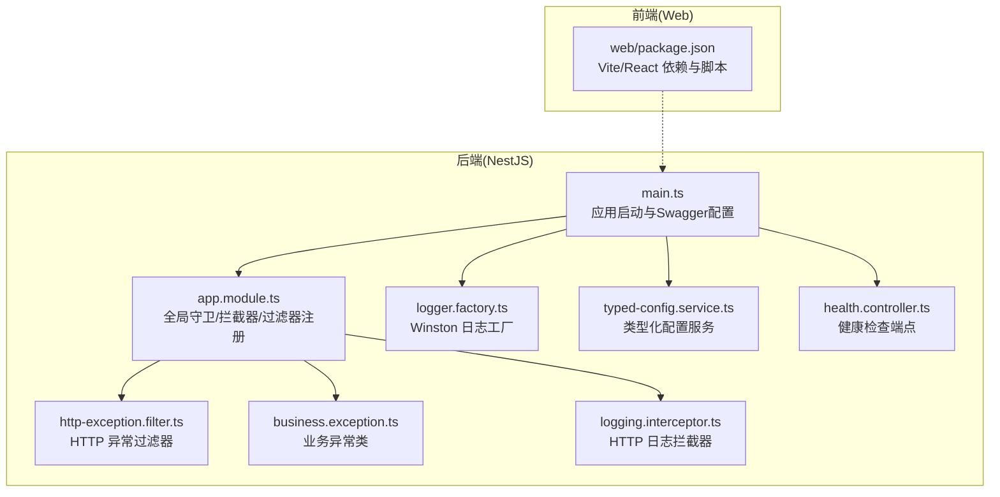
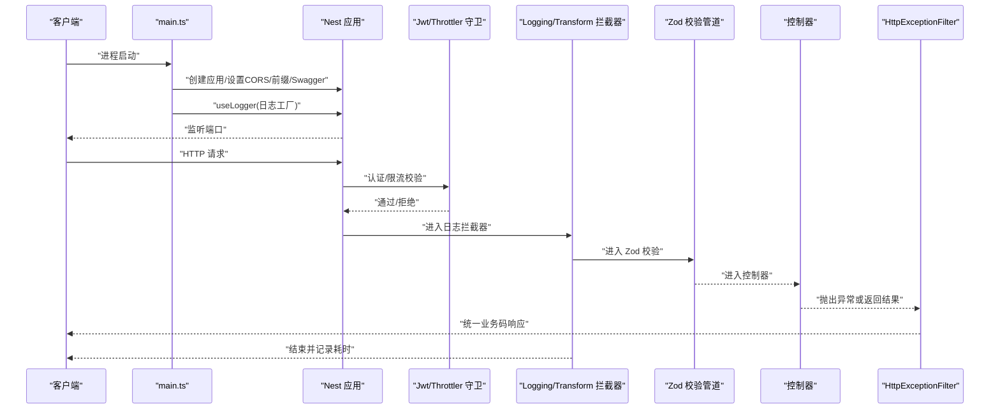
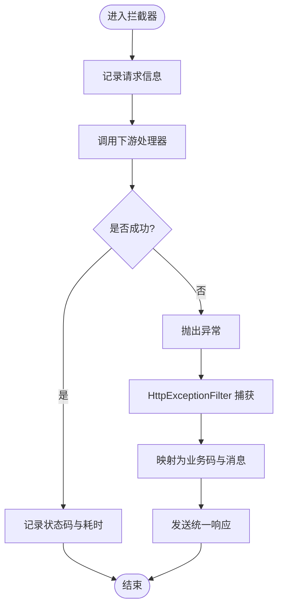
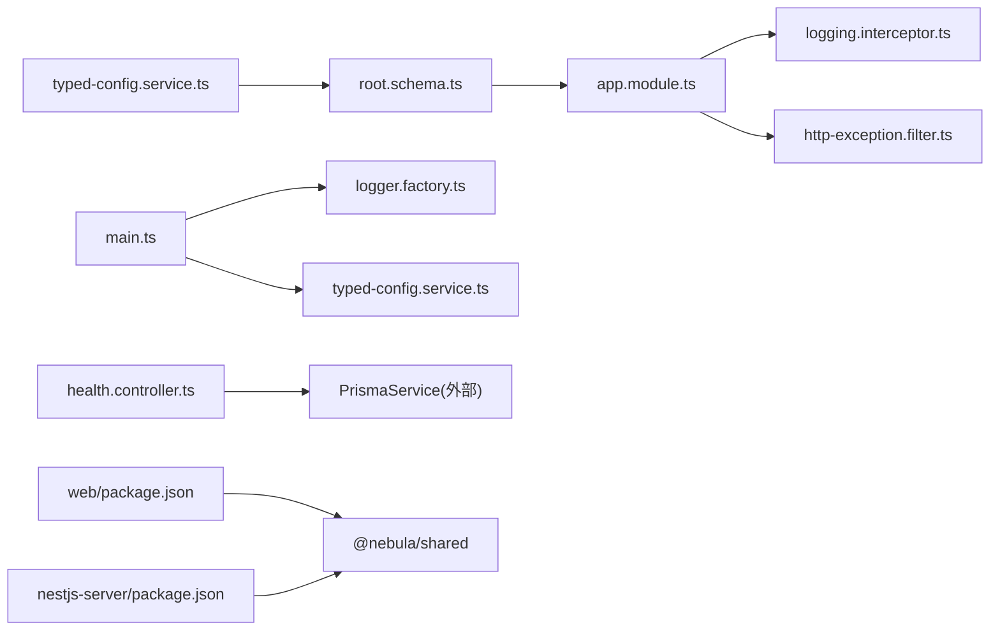
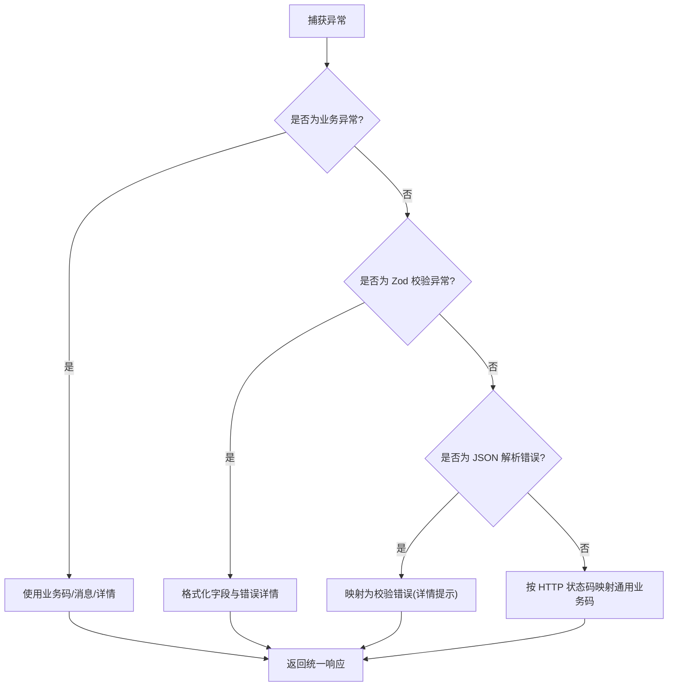

# 故障排除

<cite>
**本文引用的文件**
- [apps/nestjs-server/src/main.ts](file://apps/nestjs-server/src/main.ts)
- [apps/nestjs-server/src/app.module.ts](file://apps/nestjs-server/src/app.module.ts)
- [apps/nestjs-server/src/common/filters/http-exception.filter.ts](file://apps/nestjs-server/src/common/filters/http-exception.filter.ts)
- [apps/nestjs-server/src/common/exceptions/business.exception.ts](file://apps/nestjs-server/src/common/exceptions/business.exception.ts)
- [apps/nestjs-server/src/common/interceptors/logging.interceptor.ts](file://apps/nestjs-server/src/common/interceptors/logging.interceptor.ts)
- [apps/nestjs-server/src/modules/logger/logger.factory.ts](file://apps/nestjs-server/src/modules/logger/logger.factory.ts)
- [apps/nestjs-server/src/config/typed-config.service.ts](file://apps/nestjs-server/src/config/typed-config.service.ts)
- [apps/nestjs-server/src/common/enums/biz-code.enum.ts](file://apps/nestjs-server/src/common/enums/biz-code.enum.ts)
- [apps/nestjs-server/src/modules/health/health.controller.ts](file://apps/nestjs-server/src/modules/health/health.controller.ts)
- [apps/nestjs-server/package.json](file://apps/nestjs-server/package.json)
- [apps/nestjs-server/src/config/schemas/root.schema.ts](file://apps/nestjs-server/src/config/schemas/root.schema.ts)
- [apps/nestjs-server/test/app.e2e-spec.ts](file://apps/nestjs-server/test/app.e2e-spec.ts)
- [apps/nestjs-server/docker-compose.yml](file://apps/nestjs-server/docker-compose.yml)
- [apps/nestjs-server/Dockerfile](file://apps/nestjs-server/Dockerfile)
- [apps/web/package.json](file://apps/web/package.json)
</cite>

## 目录
1. [简介](#简介)
2. [项目结构](#项目结构)
3. [核心组件](#核心组件)
4. [架构总览](#架构总览)
5. [详细组件分析](#详细组件分析)
6. [依赖关系分析](#依赖关系分析)
7. [性能考虑](#性能考虑)
8. [故障排除指南](#故障排除指南)
9. [结论](#结论)
10. [附录](#附录)

## 简介
本指南面向开发与运维人员，聚焦于开发环境问题、运行时错误、性能问题与部署故障的诊断与解决。文档覆盖日志系统使用、错误过滤器工作原理、异常处理机制、调试工具与性能分析方法，并提供问题报告流程、社区支持资源与升级迁移建议。

## 项目结构
后端采用 NestJS 应用，前端为 Vite + React 应用，二者通过统一的共享包与业务码规范协同。关键运行路径包括启动入口、全局拦截器与过滤器、日志工厂、配置服务以及健康检查端点。

**图表来源**
- [apps/nestjs-server/src/main.ts:1-47](file://apps/nestjs-server/src/main.ts#L1-L47)
- [apps/nestjs-server/src/app.module.ts:1-61](file://apps/nestjs-server/src/app.module.ts#L1-L61)
- [apps/nestjs-server/src/modules/logger/logger.factory.ts:1-127](file://apps/nestjs-server/src/modules/logger/logger.factory.ts#L1-L127)
- [apps/nestjs-server/src/config/typed-config.service.ts:1-46](file://apps/nestjs-server/src/config/typed-config.service.ts#L1-L46)
- [apps/nestjs-server/src/common/filters/http-exception.filter.ts:1-208](file://apps/nestjs-server/src/common/filters/http-exception.filter.ts#L1-L208)
- [apps/nestjs-server/src/common/exceptions/business.exception.ts:1-42](file://apps/nestjs-server/src/common/exceptions/business.exception.ts#L1-L42)
- [apps/nestjs-server/src/common/interceptors/logging.interceptor.ts:1-30](file://apps/nestjs-server/src/common/interceptors/logging.interceptor.ts#L1-L30)
- [apps/nestjs-server/src/modules/health/health.controller.ts:1-86](file://apps/nestjs-server/src/modules/health/health.controller.ts#L1-L86)
- [apps/web/package.json:1-44](file://apps/web/package.json#L1-L44)

**章节来源**
- [apps/nestjs-server/src/main.ts:1-47](file://apps/nestjs-server/src/main.ts#L1-L47)
- [apps/nestjs-server/src/app.module.ts:1-61](file://apps/nestjs-server/src/app.module.ts#L1-L61)
- [apps/web/package.json:1-44](file://apps/web/package.json#L1-L44)

## 核心组件
- 启动与中间件
  - 应用启动在入口文件中完成，启用关闭钩子、CORS、全局前缀与可选 Swagger 文档。
  - 使用类型化配置服务读取命名空间配置，初始化日志记录器并注入应用。
- 全局治理
  - 全局注册认证守卫、限流守卫、日志与数据转换拦截器、Zod 校验管道与 HTTP 异常过滤器。
- 日志系统
  - 基于 Winston 的日志工厂，支持控制台输出与按日轮转的文件输出，彩色/非彩色格式，元数据清洗。
- 错误与异常
  - 统一业务异常类，承载业务码与消息；HTTP 异常过滤器负责将各类异常映射为统一的业务码响应。
- 健康检查
  - 提供健康状态与数据库连通性检查端点，便于容器编排与外部探针使用。

**章节来源**
- [apps/nestjs-server/src/main.ts:9-44](file://apps/nestjs-server/src/main.ts#L9-L44)
- [apps/nestjs-server/src/app.module.ts:18-60](file://apps/nestjs-server/src/app.module.ts#L18-L60)
- [apps/nestjs-server/src/modules/logger/logger.factory.ts:85-126](file://apps/nestjs-server/src/modules/logger/logger.factory.ts#L85-L126)
- [apps/nestjs-server/src/common/exceptions/business.exception.ts:16-41](file://apps/nestjs-server/src/common/exceptions/business.exception.ts#L16-L41)
- [apps/nestjs-server/src/common/filters/http-exception.filter.ts:16-68](file://apps/nestjs-server/src/common/filters/http-exception.filter.ts#L16-L68)
- [apps/nestjs-server/src/modules/health/health.controller.ts:48-63](file://apps/nestjs-server/src/modules/health/health.controller.ts#L48-L63)

## 架构总览
下图展示启动流程、请求处理链路与日志/异常处理的关键节点。

**图表来源**
- [apps/nestjs-server/src/main.ts:9-44](file://apps/nestjs-server/src/main.ts#L9-L44)
- [apps/nestjs-server/src/app.module.ts:33-57](file://apps/nestjs-server/src/app.module.ts#L33-L57)
- [apps/nestjs-server/src/common/interceptors/logging.interceptor.ts:10-28](file://apps/nestjs-server/src/common/interceptors/logging.interceptor.ts#L10-L28)
- [apps/nestjs-server/src/common/filters/http-exception.filter.ts:20-68](file://apps/nestjs-server/src/common/filters/http-exception.filter.ts#L20-L68)

## 详细组件分析

### 启动与配置加载
- 关键点
  - 启用关闭钩子以优雅退出。
  - 从类型化配置服务读取命名空间配置，设置 CORS、全局前缀与 Swagger。
  - 使用日志工厂创建并注入应用日志记录器。
- 常见问题
  - 配置缺失：根配置不存在会导致进程退出。
  - 端口占用：启动失败需检查端口占用与防火墙。
  - CORS 设置：origin 列表需与前端域名一致，避免跨域失败。

**章节来源**
- [apps/nestjs-server/src/main.ts:9-44](file://apps/nestjs-server/src/main.ts#L9-L44)
- [apps/nestjs-server/src/config/typed-config.service.ts:11-18](file://apps/nestjs-server/src/config/typed-config.service.ts#L11-L18)

### 全局拦截器与过滤器
- 日志拦截器
  - 记录请求方法、URL、用户 ID、IP、UA 与响应状态码及耗时。
- HTTP 异常过滤器
  - 区分业务异常与通用 HttpException，解析 Zod 校验错误与 JSON 解析错误，映射为统一业务码与消息。
- 业务异常类
  - 统一携带业务码、消息与细节（如校验错误列表），自动映射 HTTP 状态码。

**图表来源**
- [apps/nestjs-server/src/common/interceptors/logging.interceptor.ts:10-28](file://apps/nestjs-server/src/common/interceptors/logging.interceptor.ts#L10-L28)
- [apps/nestjs-server/src/common/filters/http-exception.filter.ts:20-68](file://apps/nestjs-server/src/common/filters/http-exception.filter.ts#L20-L68)

**章节来源**
- [apps/nestjs-server/src/common/interceptors/logging.interceptor.ts:1-30](file://apps/nestjs-server/src/common/interceptors/logging.interceptor.ts#L1-L30)
- [apps/nestjs-server/src/common/filters/http-exception.filter.ts:16-68](file://apps/nestjs-server/src/common/filters/http-exception.filter.ts#L16-L68)
- [apps/nestjs-server/src/common/exceptions/business.exception.ts:16-41](file://apps/nestjs-server/src/common/exceptions/business.exception.ts#L16-L41)

### 日志系统与日志工厂
- 功能特性
  - 控制台输出：开发模式彩色输出，生产模式去色。
  - 文件输出：按日轮转，分别输出综合日志与错误日志，支持最大文件大小与保留天数。
  - 元数据清洗：对日志上下文中的敏感字段进行清理，避免泄露。
- 使用建议
  - 开发：提高日志级别以获得更细粒度信息。
  - 生产：开启文件输出，合理设置最大文件大小与保留策略。
  - 安全：避免在日志中打印敏感信息，必要时使用清洗工具。

**章节来源**
- [apps/nestjs-server/src/modules/logger/logger.factory.ts:85-126](file://apps/nestjs-server/src/modules/logger/logger.factory.ts#L85-L126)

### 健康检查端点
- 能力
  - 数据库连通性检测与服务运行时长、时间戳等基础信息。
  - Ping 端点用于快速验证服务可用性。
- 使用场景
  - 容器编排健康探针、CI/CD 部署后验证、负载均衡摘除判断。

**章节来源**
- [apps/nestjs-server/src/modules/health/health.controller.ts:48-63](file://apps/nestjs-server/src/modules/health/health.controller.ts#L48-L63)

## 依赖关系分析
- 后端依赖
  - 核心框架与工具：NestJS、Winston、Swagger、Prisma、Redis、Passport/JWT、Zod 等。
  - 类型化配置：基于 Zod Schema 的根配置聚合，提供命名空间访问。
- 前端依赖
  - React、Vite、TanStack React Query、Axios 等，与共享包协同。

**图表来源**
- [apps/nestjs-server/src/config/typed-config.service.ts:1-46](file://apps/nestjs-server/src/config/typed-config.service.ts#L1-L46)
- [apps/nestjs-server/src/config/schemas/root.schema.ts:11-22](file://apps/nestjs-server/src/config/schemas/root.schema.ts#L11-L22)
- [apps/nestjs-server/src/app.module.ts:1-61](file://apps/nestjs-server/src/app.module.ts#L1-L61)
- [apps/nestjs-server/src/common/interceptors/logging.interceptor.ts:1-30](file://apps/nestjs-server/src/common/interceptors/logging.interceptor.ts#L1-L30)
- [apps/nestjs-server/src/common/filters/http-exception.filter.ts:1-208](file://apps/nestjs-server/src/common/filters/http-exception.filter.ts#L1-L208)
- [apps/nestjs-server/src/main.ts:1-47](file://apps/nestjs-server/src/main.ts#L1-L47)
- [apps/nestjs-server/src/modules/logger/logger.factory.ts:1-127](file://apps/nestjs-server/src/modules/logger/logger.factory.ts#L1-L127)
- [apps/nestjs-server/src/modules/health/health.controller.ts:1-86](file://apps/nestjs-server/src/modules/health/health.controller.ts#L1-L86)
- [apps/web/package.json:1-44](file://apps/web/package.json#L1-L44)
- [apps/nestjs-server/package.json:1-85](file://apps/nestjs-server/package.json#L1-L85)

**章节来源**
- [apps/nestjs-server/src/config/typed-config.service.ts:1-46](file://apps/nestjs-server/src/config/typed-config.service.ts#L1-L46)
- [apps/nestjs-server/src/config/schemas/root.schema.ts:11-22](file://apps/nestjs-server/src/config/schemas/root.schema.ts#L11-L22)
- [apps/nestjs-server/package.json:26-58](file://apps/nestjs-server/package.json#L26-L58)
- [apps/web/package.json:14-28](file://apps/web/package.json#L14-L28)

## 性能考虑
- 日志开销
  - 文件日志会带来磁盘 IO，建议在高并发场景下调低日志级别或减少结构化元数据。
- 请求链路
  - 拦截器与过滤器顺序影响延迟，建议仅在必要处添加额外处理。
- 缓存与限流
  - 全局限流已启用，注意阈值设置与客户端重试策略。
- 数据库
  - 健康检查包含数据库连通性验证，数据库慢查询会影响整体响应。

[本节为通用指导，无需列出章节来源]

## 故障排除指南

### 开发环境问题
- 症状：启动时报“缺少根配置”或进程立即退出
  - 排查：确认环境变量与配置文件中存在根配置，检查命名空间读取是否正确。
  - 处理：修复配置后重新启动。
- 症状：CORS 导致跨域失败
  - 排查：核对 CORS origin 列表与前端域名是否匹配。
  - 处理：更新 CORS 配置并重启服务。
- 症状：Swagger 文档无法访问
  - 排查：确认 Swagger 开关与全局前缀设置。
  - 处理：调整开关与前缀后刷新页面。

**章节来源**
- [apps/nestjs-server/src/config/typed-config.service.ts:14-18](file://apps/nestjs-server/src/config/typed-config.service.ts#L14-L18)
- [apps/nestjs-server/src/main.ts:19-33](file://apps/nestjs-server/src/main.ts#L19-L33)

### 运行时错误
- 症状：接口返回统一业务码与消息
  - 排查：查看异常过滤器映射逻辑，区分业务异常与通用异常。
  - 处理：根据业务码定位模块，修正参数或权限。
- 症状：Zod 校验失败
  - 排查：异常过滤器会提取校验错误列表。
  - 处理：依据字段路径与提示修正请求体。
- 症状：JSON 解析错误
  - 排查：异常过滤器识别 JSON 解析错误并映射为校验错误。
  - 处理：检查请求体格式与字符编码。

**图表来源**
- [apps/nestjs-server/src/common/filters/http-exception.filter.ts:29-145](file://apps/nestjs-server/src/common/filters/http-exception.filter.ts#L29-L145)

**章节来源**
- [apps/nestjs-server/src/common/filters/http-exception.filter.ts:16-68](file://apps/nestjs-server/src/common/filters/http-exception.filter.ts#L16-L68)
- [apps/nestjs-server/src/common/exceptions/business.exception.ts:16-41](file://apps/nestjs-server/src/common/exceptions/business.exception.ts#L16-L41)

### 性能问题
- 症状：响应缓慢
  - 排查：查看日志拦截器记录的耗时，定位慢点。
  - 处理：优化数据库查询、缓存热点数据、减少不必要的序列化。
- 症状：CPU 或内存升高
  - 排查：结合健康检查与日志，观察数据库与外部依赖状态。
  - 处理：增加资源配额、优化查询、启用更严格的限流。

**章节来源**
- [apps/nestjs-server/src/common/interceptors/logging.interceptor.ts:10-28](file://apps/nestjs-server/src/common/interceptors/logging.interceptor.ts#L10-L28)
- [apps/nestjs-server/src/modules/health/health.controller.ts:48-63](file://apps/nestjs-server/src/modules/health/health.controller.ts#L48-L63)

### 部署故障
- 症状：容器启动后立即退出
  - 排查：检查数据库连接字符串与健康检查条件。
  - 处理：修正环境变量与数据库镜像版本。
- 症状：端口不可达
  - 排查：确认容器端口映射与主机防火墙。
  - 处理：修改映射或放通端口。
- 症状：Swagger 不可用
  - 排查：确认 Swagger 开关与全局前缀。
  - 处理：调整配置并重建镜像。

**章节来源**
- [apps/nestjs-server/docker-compose.yml:6-17](file://apps/nestjs-server/docker-compose.yml#L6-L17)
- [apps/nestjs-server/Dockerfile:1-20](file://apps/nestjs-server/Dockerfile#L1-L20)
- [apps/nestjs-server/src/main.ts:24-33](file://apps/nestjs-server/src/main.ts#L24-L33)

### 日志系统使用
- 查看控制台日志：开发模式下彩色输出，便于快速定位。
- 查看文件日志：生产模式下按日轮转，分别输出综合与错误日志。
- 调整日志级别：通过配置服务读取日志级别，平衡可观测性与性能。
- 清洗敏感信息：日志工厂会对元数据进行清洗，避免敏感字段泄露。

**章节来源**
- [apps/nestjs-server/src/modules/logger/logger.factory.ts:85-126](file://apps/nestjs-server/src/modules/logger/logger.factory.ts#L85-L126)
- [apps/nestjs-server/src/main.ts:16-17](file://apps/nestjs-server/src/main.ts#L16-L17)

### 调试工具与性能分析
- 启动脚本
  - 开发模式：启用热重载与调试模式。
  - 生产模式：使用构建产物启动。
- 单元与端到端测试
  - 使用 Jest 与 Supertest 进行测试，支持覆盖率统计与断点调试。
- 前端调试
  - Vite 提供热更新与源码映射，配合 React DevTools 使用。

**章节来源**
- [apps/nestjs-server/package.json:8-24](file://apps/nestjs-server/package.json#L8-L24)
- [apps/nestjs-server/test/app.e2e-spec.ts:10-21](file://apps/nestjs-server/test/app.e2e-spec.ts#L10-L21)
- [apps/web/package.json:6-12](file://apps/web/package.json#L6-L12)

### 监控指标解读
- 健康检查
  - status: ok 表示正常，degraded 表示降级。
  - database: connected 表示数据库连通，disconnected 表示断开。
  - uptime: 服务运行时长（秒）。
  - timestamp: 当前时间。
- 建议
  - 将健康检查接入探针，异常时触发告警与自动恢复。

**章节来源**
- [apps/nestjs-server/src/modules/health/health.controller.ts:48-63](file://apps/nestjs-server/src/modules/health/health.controller.ts#L48-L63)

### 问题报告流程
- 收集信息
  - 环境：操作系统、Node 版本、依赖版本。
  - 配置：关键配置片段（脱敏后）。
  - 日志：最近一次错误与相关请求的日志片段。
  - 复现步骤：最小可复现步骤与预期/实际行为。
- 提交渠道
  - 使用仓库 Issue 模板提交，附上上述信息与截图/附件。
- 社区支持
  - 参考项目 README 与贡献指南，遵守行为准则。

[本节为流程性内容，无需列出章节来源]

### 升级与迁移指南
- 依赖升级
  - 使用锁定文件保证一致性，升级前先执行安装与测试。
- 配置迁移
  - 根配置 Schema 已定义命名空间，升级时保持键名与类型兼容。
- 日志与异常
  - 业务码与消息来自共享包，升级时同步前后端业务码定义。
- 前后端联调
  - 升级后优先验证健康检查与关键接口，确保无破坏性变更。

**章节来源**
- [apps/nestjs-server/src/config/schemas/root.schema.ts:11-22](file://apps/nestjs-server/src/config/schemas/root.schema.ts#L11-L22)
- [apps/nestjs-server/src/common/enums/biz-code.enum.ts:1-16](file://apps/nestjs-server/src/common/enums/biz-code.enum.ts#L1-L16)
- [apps/nestjs-server/package.json:26-58](file://apps/nestjs-server/package.json#L26-L58)
- [apps/web/package.json:14-28](file://apps/web/package.json#L14-L28)

## 结论
通过统一的异常与日志体系、全局拦截与过滤器、类型化配置与健康检查，本项目提供了完善的可观测性与可维护性。遇到问题时，建议从配置与日志入手，结合健康检查与测试用例快速定位并修复。

[本节为总结性内容，无需列出章节来源]

## 附录
- 快速参考
  - 启动命令：开发、调试、生产模式脚本位于后端包脚本中。
  - 健康检查端点：根路径与 ping 路径，返回结构明确。
  - 配置命名空间：app、database、jwt、logger、redis。

**章节来源**
- [apps/nestjs-server/package.json:8-24](file://apps/nestjs-server/package.json#L8-L24)
- [apps/nestjs-server/src/modules/health/health.controller.ts:48-84](file://apps/nestjs-server/src/modules/health/health.controller.ts#L48-L84)
- [apps/nestjs-server/src/config/schemas/root.schema.ts:11-17](file://apps/nestjs-server/src/config/schemas/root.schema.ts#L11-L17)