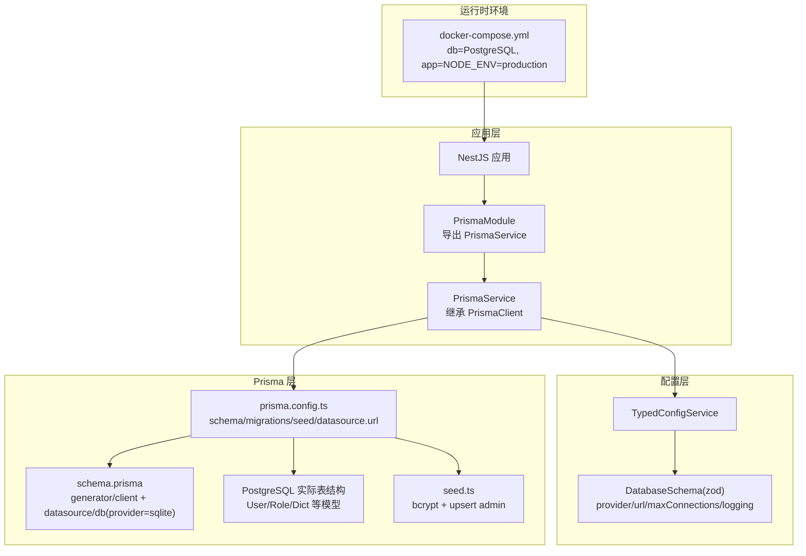
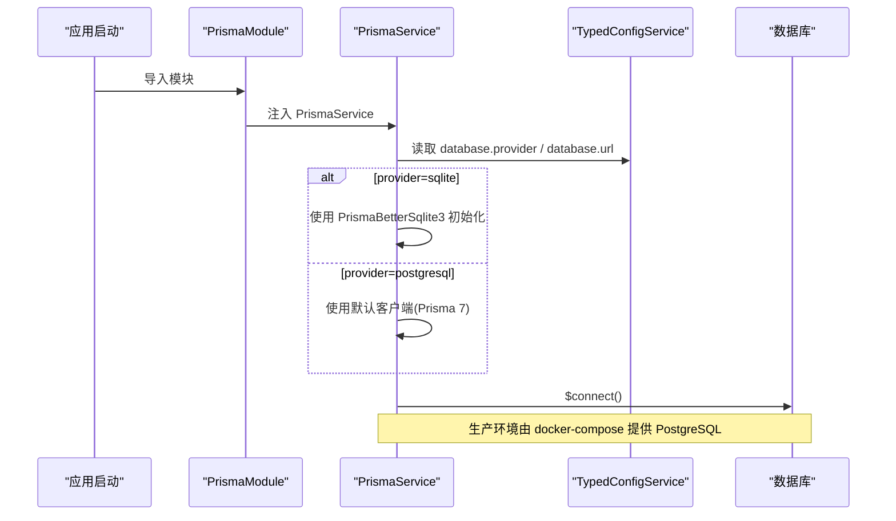
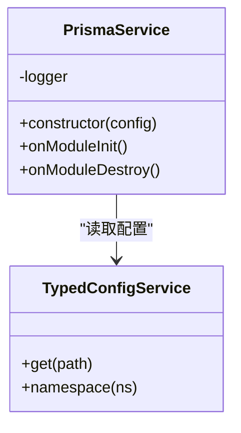
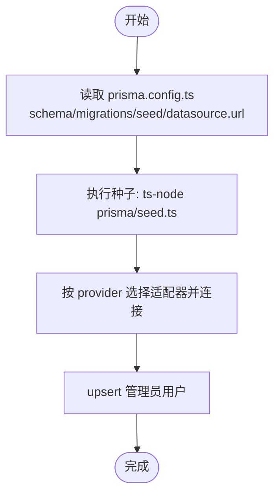
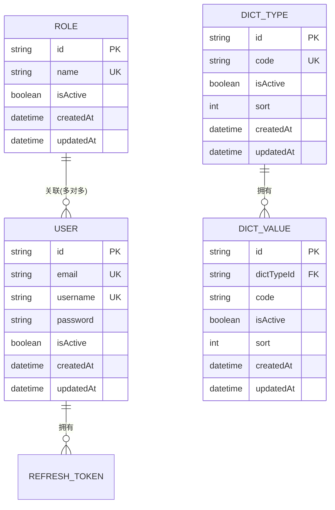
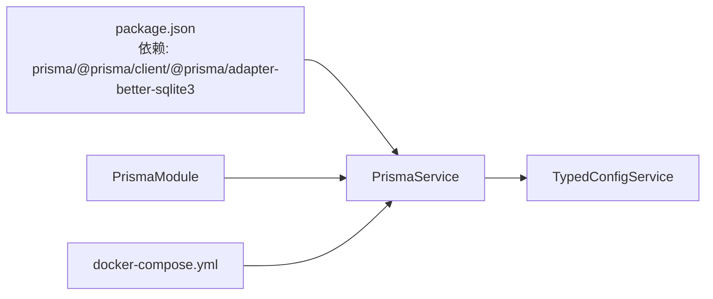

# 数据库问题

<cite>
**本文引用的文件**
- [schema.prisma](file://apps/nestjs-server/prisma/schema.prisma)
- [prisma.config.ts](file://apps/nestjs-server/prisma.config.ts)
- [seed.ts](file://apps/nestjs-server/prisma/seed.ts)
- [prisma.service.ts](file://apps/nestjs-server/src/prisma/prisma.service.ts)
- [prisma.module.ts](file://apps/nestjs-server/src/prisma/prisma.module.ts)
- [database.schema.ts](file://apps/nestjs-server/src/config/schemas/database.schema.ts)
- [typed-config.service.ts](file://apps/nestjs-server/src/config/typed-config.service.ts)
- [docker-compose.yml](file://apps/nestjs-server/docker-compose.yml)
- [User.prisma](file://apps/nestjs-server/prisma/schema/User.prisma)
- [Role.prisma](file://apps/nestjs-server/prisma/schema/Role.prisma)
- [Dict.prisma](file://apps/nestjs-server/prisma/schema/Dict.prisma)
- [AuthService.ts](file://apps/nestjs-server/src/modules/auth/auth.service.ts)
- [log-query.service.ts](file://apps/nestjs-server/src/modules/logger/log-query.service.ts)
- [package.json](file://apps/nestjs-server/package.json)
</cite>

## 目录

1. [简介](#简介)
2. [项目结构](#项目结构)
3. [核心组件](#核心组件)
4. [架构总览](#架构总览)
5. [详细组件分析](#详细组件分析)
6. [依赖关系分析](#依赖关系分析)
7. [性能考量](#性能考量)
8. [故障排查指南](#故障排查指南)
9. [结论](#结论)
10. [附录](#附录)

## 简介

本指南聚焦于 Prisma ORM 在本项目中的使用与常见问题排查，覆盖数据库连接失败、Schema 变更同步、种子数据导入失败、查询性能问题以及事务处理异常等场景。同时提供 Prisma CLI 使用要点、迁移与数据一致性检查方法，并给出连接池配置优化与查询优化最佳实践。

## 项目结构

- 应用采用 NestJS + Prisma 架构，数据库适配器为 better-sqlite3（开发环境），生产环境默认使用 PostgreSQL（由 docker-compose 提供）。
- Prisma 配置通过独立的 prisma.config.ts 管理，包含 schema 路径、迁移目录与种子脚本。
- Prisma 客户端在应用启动时通过 PrismaService 初始化并注入全局模块，供业务模块使用。

图表来源

- [prisma.module.ts:1-10](file://apps/nestjs-server/src/prisma/prisma.module.ts#L1-L10)
- [prisma.service.ts:1-36](file://apps/nestjs-server/src/prisma/prisma.service.ts#L1-L36)
- [prisma.config.ts:1-14](file://apps/nestjs-server/prisma.config.ts#L1-L14)
- [schema.prisma:1-9](file://apps/nestjs-server/prisma/schema.prisma#L1-L9)
- [docker-compose.yml:1-54](file://apps/nestjs-server/docker-compose.yml#L1-L54)

章节来源

- [prisma.config.ts:1-14](file://apps/nestjs-server/prisma.config.ts#L1-L14)
- [prisma.service.ts:1-36](file://apps/nestjs-server/src/prisma/prisma.service.ts#L1-L36)
- [prisma.module.ts:1-10](file://apps/nestjs-server/src/prisma/prisma.module.ts#L1-L10)
- [database.schema.ts:1-11](file://apps/nestjs-server/src/config/schemas/database.schema.ts#L1-L11)
- [docker-compose.yml:1-54](file://apps/nestjs-server/docker-compose.yml#L1-L54)

## 核心组件

- PrismaService：负责根据配置选择 SQLite 或 PostgreSQL 适配器，初始化连接并在模块销毁时断开；日志中会输出当前数据库提供方。
- PrismaModule：全局导出 PrismaService，便于各业务模块注入使用。
- 配置系统：TypedConfigService 支持点语法读取配置；DatabaseSchema 定义了 provider、url、maxConnections、logging 等键。
- Prisma CLI 配置：prisma.config.ts 统一管理 schema、migrations、seed 与 datasource.url。
- 种子脚本：seed.ts 使用 bcrypt 对密码加盐，通过 upsert 创建管理员用户。

章节来源

- [prisma.service.ts:6-35](file://apps/nestjs-server/src/prisma/prisma.service.ts#L6-L35)
- [prisma.module.ts:1-10](file://apps/nestjs-server/src/prisma/prisma.module.ts#L1-L10)
- [typed-config.service.ts:23-36](file://apps/nestjs-server/src/config/typed-config.service.ts#L23-L36)
- [database.schema.ts:3-8](file://apps/nestjs-server/src/config/schemas/database.schema.ts#L3-L8)
- [prisma.config.ts:4-13](file://apps/nestjs-server/prisma.config.ts#L4-L13)
- [seed.ts:11-31](file://apps/nestjs-server/prisma/seed.ts#L11-L31)

## 架构总览

下图展示从应用启动到数据库交互的关键流程，包括连接初始化、查询执行与日志记录。

图表来源

- [prisma.module.ts:1-10](file://apps/nestjs-server/src/prisma/prisma.module.ts#L1-L10)
- [prisma.service.ts:10-26](file://apps/nestjs-server/src/prisma/prisma.service.ts#L10-L26)
- [docker-compose.yml:8-9](file://apps/nestjs-server/docker-compose.yml#L8-L9)

## 详细组件分析

### PrismaService 连接与生命周期

- 依据配置选择适配器：当 provider 为 sqlite 时，使用 PrismaBetterSqlite3 并传入 url；否则走默认客户端。
- onModuleInit/onModuleDestroy 生命周期钩子确保连接与断开时机正确。
- 日志输出当前数据库提供方，便于快速定位环境差异。

图表来源

- [prisma.service.ts:7-35](file://apps/nestjs-server/src/prisma/prisma.service.ts#L7-L35)
- [typed-config.service.ts:23-44](file://apps/nestjs-server/src/config/typed-config.service.ts#L23-L44)

章节来源

- [prisma.service.ts:10-26](file://apps/nestjs-server/src/prisma/prisma.service.ts#L10-L26)
- [prisma.service.ts:28-34](file://apps/nestjs-server/src/prisma/prisma.service.ts#L28-L34)

### Prisma CLI 与迁移/种子

- prisma.config.ts 指定 schema 目录、迁移路径与种子命令；datasource.url 来自环境变量。
- 种子脚本 seed.ts 使用 better-sqlite3 适配器，bcrypt 加密后 upsert 管理员用户。
- 建议在本地开发使用 sqlite，生产使用 PostgreSQL；迁移与种子策略需保持一致。

图表来源

- [prisma.config.ts:4-13](file://apps/nestjs-server/prisma.config.ts#L4-L13)
- [seed.ts:5-9](file://apps/nestjs-server/prisma/seed.ts#L5-L9)
- [seed.ts:14-24](file://apps/nestjs-server/prisma/seed.ts#L14-L24)

章节来源

- [prisma.config.ts:4-13](file://apps/nestjs-server/prisma.config.ts#L4-L13)
- [seed.ts:1-41](file://apps/nestjs-server/prisma/seed.ts#L1-L41)

### 数据模型与索引

- User/Role/Dict 等模型定义字段、唯一约束、时间戳与关系映射。
- DictType/DictValue 存在复合唯一与索引，有助于高效查询与去重。

图表来源

- [User.prisma:1-15](file://apps/nestjs-server/prisma/schema/User.prisma#L1-L15)
- [Role.prisma:1-13](file://apps/nestjs-server/prisma/schema/Role.prisma#L1-L13)
- [Dict.prisma:1-34](file://apps/nestjs-server/prisma/schema/Dict.prisma#L1-L34)

章节来源

- [User.prisma:1-15](file://apps/nestjs-server/prisma/schema/User.prisma#L1-L15)
- [Role.prisma:1-13](file://apps/nestjs-server/prisma/schema/Role.prisma#L1-L13)
- [Dict.prisma:1-34](file://apps/nestjs-server/prisma/schema/Dict.prisma#L1-L34)

### 查询与日志辅助

- LogQueryService 提供日志检索能力，可按级别、关键词、时间范围与模块过滤，便于定位慢查询与错误。
- 建议开启数据库查询日志（见“性能考量”），结合该服务定位问题。

章节来源

- [log-query.service.ts:31-83](file://apps/nestjs-server/src/modules/logger/log-query.service.ts#L31-L83)
- [log-query.service.ts:98-112](file://apps/nestjs-server/src/modules/logger/log-query.service.ts#L98-L112)

## 依赖关系分析

- Prisma 适配器与客户端版本由 package.json 统一声明，确保与 Prisma 7 兼容。
- PrismaService 依赖 TypedConfigService 读取数据库配置；PrismaModule 全局导出以供业务模块注入。
- docker-compose 将应用与 PostgreSQL 容器编排，生产环境默认使用 PostgreSQL。

图表来源

- [package.json:38-50](file://apps/nestjs-server/package.json#L38-L50)
- [prisma.module.ts:1-10](file://apps/nestjs-server/src/prisma/prisma.module.ts#L1-L10)
- [prisma.service.ts:10-26](file://apps/nestjs-server/src/prisma/prisma.service.ts#L10-L26)
- [docker-compose.yml:8-9](file://apps/nestjs-server/docker-compose.yml#L8-L9)

章节来源

- [package.json:26-58](file://apps/nestjs-server/package.json#L26-L58)
- [prisma.module.ts:1-10](file://apps/nestjs-server/src/prisma/prisma.module.ts#L1-L10)
- [prisma.service.ts:10-26](file://apps/nestjs-server/src/prisma/prisma.service.ts#L10-L26)
- [docker-compose.yml:1-54](file://apps/nestjs-server/docker-compose.yml#L1-L54)

## 性能考量

- 连接池与并发
  - 配置项 maxConnections 控制最大连接数，默认 10；生产环境建议结合数据库承载能力与 QPS 调优。
  - SQLite 在高并发写入场景存在锁竞争风险，建议优先使用 PostgreSQL。
- 查询日志与监控
  - 启用数据库查询日志（参考配置项 logging），配合 LogQueryService 快速筛选错误与慢查询。
  - 对高频查询建立必要索引（如 DictType.code、DictValue.dictTypeId/code 复合唯一）。
- 写入优化
  - 批量操作使用事务包裹，减少往返次数；避免 N+1 查询，优先使用 include/@@select。
- 迁移与 Schema 同步
  - 使用 Prisma CLI 生成与应用迁移，确保 schema.prisma 与实际表结构一致；生产环境务必先在预发布验证。

章节来源

- [database.schema.ts:6-7](file://apps/nestjs-server/src/config/schemas/database.schema.ts#L6-L7)
- [Dict.prisma:12-13](file://apps/nestjs-server/prisma/schema/Dict.prisma#L12-L13)
- [Dict.prisma:30-31](file://apps/nestjs-server/prisma/schema/Dict.prisma#L30-L31)

## 故障排查指南

### 1. 数据库连接失败

- 症状
  - 应用启动时报连接错误或无法访问数据库。
- 排查步骤
  - 确认环境变量 DATABASE_PROVIDER 与 DATABASE_URL 是否正确（生产环境由 docker-compose 设置）。
  - 若 provider=sqlite，确认 dev.db 文件路径与权限；若 provider=postgresql，确认容器健康与网络连通。
  - 查看 PrismaService 初始化日志输出的数据库提供方是否符合预期。
- 相关位置
  - [prisma.service.ts:10-26](file://apps/nestjs-server/src/prisma/prisma.service.ts#L10-L26)
  - [docker-compose.yml:8-9](file://apps/nestjs-server/docker-compose.yml#L8-L9)

章节来源

- [prisma.service.ts:10-26](file://apps/nestjs-server/src/prisma/prisma.service.ts#L10-L26)
- [docker-compose.yml:17-19](file://apps/nestjs-server/docker-compose.yml#L17-L19)

### 2. Schema 变更同步问题

- 症状
  - 运行时出现字段缺失、类型不匹配或迁移报错。
- 排查步骤
  - 使用 Prisma CLI 生成迁移并应用；确保 prisma.config.ts 的 schema 与 migrations 路径正确。
  - 检查 schema.prisma 中的 provider 与 datasource.url 是否与当前环境一致。
  - 如需回滚，先备份数据库再执行迁移回退。
- 相关位置
  - [prisma.config.ts:4-13](file://apps/nestjs-server/prisma.config.ts#L4-L13)
  - [schema.prisma:6-9](file://apps/nestjs-server/prisma/schema.prisma#L6-L9)

章节来源

- [prisma.config.ts:4-13](file://apps/nestjs-server/prisma.config.ts#L4-L13)
- [schema.prisma:1-9](file://apps/nestjs-server/prisma/schema.prisma#L1-L9)

### 3. 种子数据导入失败

- 症状
  - 启动时种子脚本报错，无法创建管理员用户。
- 排查步骤
  - 确认种子脚本使用的适配器与数据库类型一致（better-sqlite3 仅适用于 sqlite）。
  - 检查 DATABASE_URL 是否指向正确的 sqlite 文件路径或 PostgreSQL 地址。
  - 关注 bcrypt 加密与 upsert 逻辑，确保邮箱唯一性与密码哈希正常。
- 相关位置
  - [seed.ts:5-9](file://apps/nestjs-server/prisma/seed.ts#L5-L9)
  - [seed.ts:14-24](file://apps/nestjs-server/prisma/seed.ts#L14-L24)

章节来源

- [seed.ts:1-41](file://apps/nestjs-server/prisma/seed.ts#L1-L41)

### 4. 查询性能问题

- 症状
  - 接口响应缓慢，数据库负载较高。
- 排查步骤
  - 开启数据库查询日志，使用 LogQueryService 过滤错误与慢查询。
  - 分析高频查询是否缺少索引；对 DictType.code、DictValue.dictTypeId/code 建立合适索引。
  - 避免 N+1 查询，合并 include/select；批量写入使用事务。
- 相关位置
  - [log-query.service.ts:31-83](file://apps/nestjs-server/src/modules/logger/log-query.service.ts#L31-L83)
  - [Dict.prisma:12-13](file://apps/nestjs-server/prisma/schema/Dict.prisma#L12-L13)
  - [Dict.prisma:30-31](file://apps/nestjs-server/prisma/schema/Dict.prisma#L30-L31)

章节来源

- [log-query.service.ts:31-83](file://apps/nestjs-server/src/modules/logger/log-query.service.ts#L31-L83)
- [Dict.prisma:12-13](file://apps/nestjs-server/prisma/schema/Dict.prisma#L12-L13)
- [Dict.prisma:30-31](file://apps/nestjs-server/prisma/schema/Dict.prisma#L30-L31)

### 5. 事务处理异常

- 症状
  - 业务操作部分成功，数据状态不一致。
- 排查步骤
  - 将相关写入操作放入 PrismaClient 事务块，保证原子性。
  - 记录事务边界与异常堆栈，结合日志定位失败点。
  - 对并发写入场景增加重试与幂等判断。
- 相关位置
  - [AuthService.ts:105-142](file://apps/nestjs-server/src/modules/auth/auth.service.ts#L105-L142)

章节来源

- [AuthService.ts:105-142](file://apps/nestjs-server/src/modules/auth/auth.service.ts#L105-L142)

### 6. 数据一致性检查

- 建议方法
  - 定期比对 schema.prisma 与数据库实际结构，确保字段、索引与约束一致。
  - 对关键业务（如用户、角色、字典）执行抽样校验，核对唯一性与完整性。
  - 使用 Prisma CLI 导出数据快照与对比工具进行回归验证。

章节来源

- [schema.prisma:1-9](file://apps/nestjs-server/prisma/schema.prisma#L1-L9)
- [User.prisma:1-15](file://apps/nestjs-server/prisma/schema/User.prisma#L1-L15)
- [Role.prisma:1-13](file://apps/nestjs-server/prisma/schema/Role.prisma#L1-L13)
- [Dict.prisma:1-34](file://apps/nestjs-server/prisma/schema/Dict.prisma#L1-L34)

## 结论

本项目基于 Prisma 7 与 better-sqlite3/PostgreSQL 双栈实现，具备良好的开发与生产兼容性。通过规范化的配置、统一的 CLI 管理与完善的日志检索机制，能够有效定位与解决数据库相关问题。建议在生产环境优先使用 PostgreSQL，并结合索引、事务与连接池调优持续提升稳定性与性能。

## 附录

### Prisma CLI 使用要点

- 生成迁移：prisma migrate dev
- 应用迁移：prisma migrate deploy
- 生成客户端：prisma generate
- 执行种子：prisma db seed
- 检查数据库状态：prisma db pull / db push（谨慎使用）

章节来源

- [prisma.config.ts:6-8](file://apps/nestjs-server/prisma.config.ts#L6-L8)

### 数据库连接池配置优化

- maxConnections：根据数据库承载能力与请求峰值调整。
- logging：开发阶段开启，生产按需启用。
- SQLite 与 PostgreSQL 的并发特性差异较大，建议生产使用 PostgreSQL。

章节来源

- [database.schema.ts:6](file://apps/nestjs-server/src/config/schemas/database.schema.ts#L6)
- [prisma.service.ts:14-23](file://apps/nestjs-server/src/prisma/prisma.service.ts#L14-L23)
