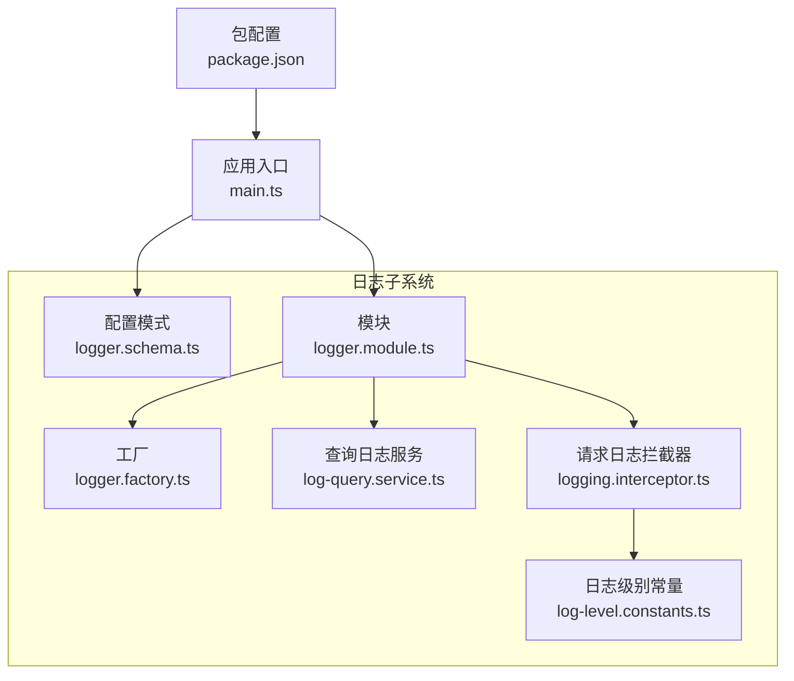
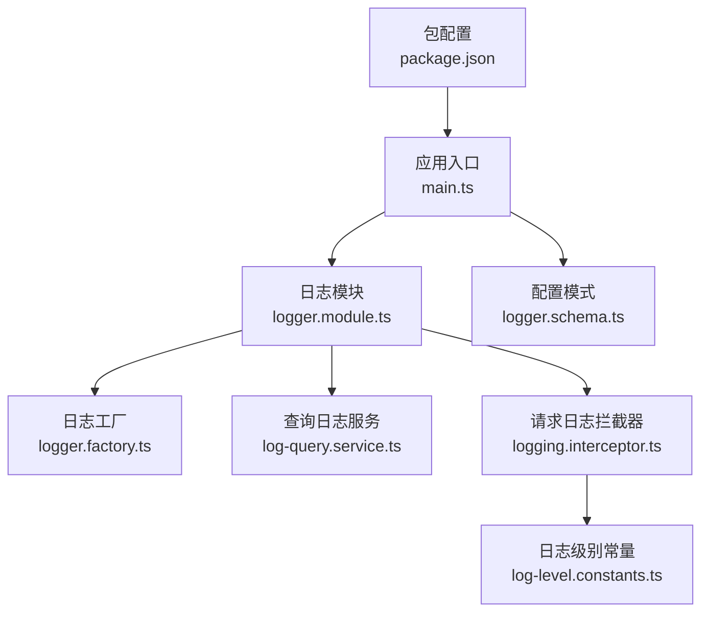
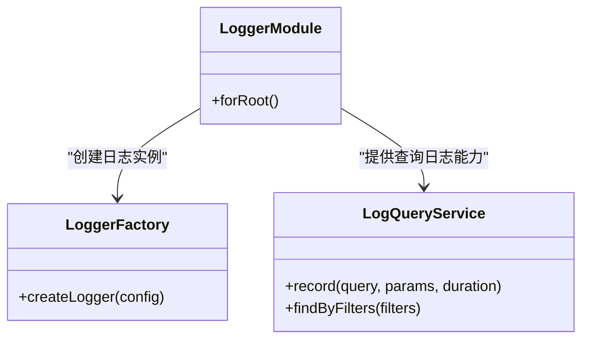
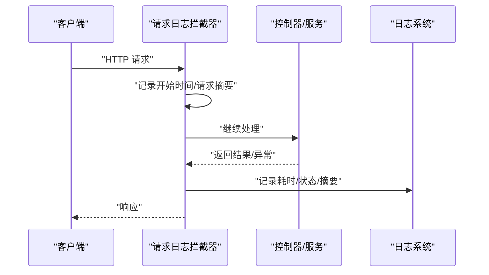
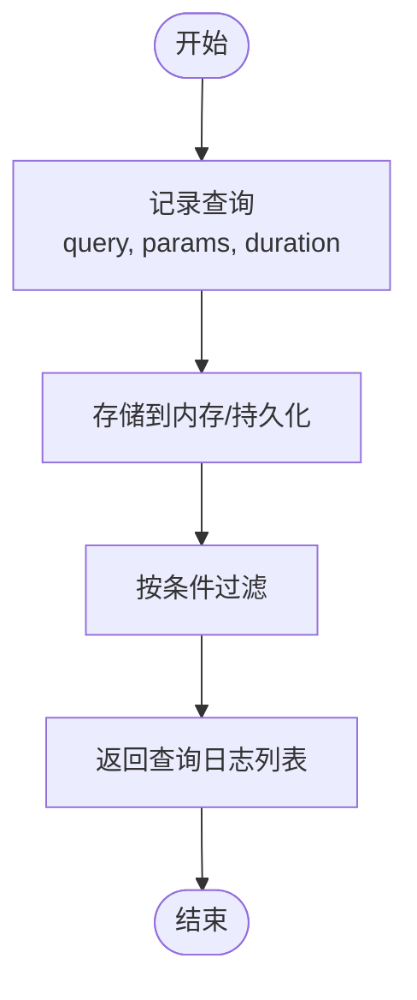
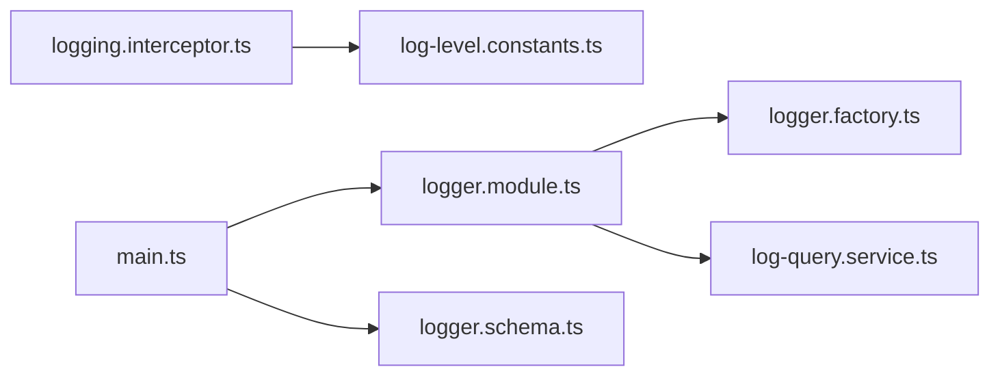

# 日志和调试

<cite>
**本文引用的文件**
- [logger.schema.ts](file://apps/nestjs-server/src/config/schemas/logger.schema.ts)
- [logger.factory.ts](file://apps/nestjs-server/src/modules/logger/logger.factory.ts)
- [logger.module.ts](file://apps/nestjs-server/src/modules/logger/logger.module.ts)
- [log-query.service.ts](file://apps/nestjs-server/src/modules/logger/log-query.service.ts)
- [logging.interceptor.ts](file://apps/nestjs-server/src/common/interceptors/logging.interceptor.ts)
- [log-level.constants.ts](file://apps/nestjs-server/src/common/constants/log-level.constants.ts)
- [main.ts](file://apps/nestjs-server/src/main.ts)
- [package.json](file://apps/nestjs-server/package.json)
- [debug-password.ts](file://apps/nestjs-server/scripts/debug-password.ts)
- [debug-token.ts](file://apps/nestjs-server/scripts/debug-token.ts)
</cite>

## 目录
1. [简介](#简介)
2. [项目结构](#项目结构)
3. [核心组件](#核心组件)
4. [架构总览](#架构总览)
5. [详细组件分析](#详细组件分析)
6. [依赖关系分析](#依赖关系分析)
7. [性能考量](#性能考量)
8. [故障排查指南](#故障排查指南)
9. [结论](#结论)
10. [附录](#附录)

## 简介
本指南聚焦于应用程序的日志系统与调试实践，覆盖配置项、日志级别、拦截器集成、查询日志服务以及开发/生产环境的调试策略。文档基于仓库中的 NestJS 后端实现，重点围绕日志模块、拦截器与配置模式展开，并提供可操作的调试脚本与流程图示。

## 项目结构
后端采用 NestJS 架构，日志相关能力集中在以下位置：
- 配置模式：定义日志配置的类型与校验
- 工厂与模块：封装日志实例创建与注入
- 查询日志服务：用于记录与检索 SQL 查询日志
- 全局拦截器：统一记录请求/响应与处理耗时
- 常量：集中管理日志级别枚举
- 应用入口：应用启动与全局配置挂载
- 调试脚本：密码与令牌调试辅助

图表来源
- [logger.schema.ts:1-200](file://apps/nestjs-server/src/config/schemas/logger.schema.ts#L1-L200)
- [logger.factory.ts:1-200](file://apps/nestjs-server/src/modules/logger/logger.factory.ts#L1-L200)
- [logger.module.ts:1-200](file://apps/nestjs-server/src/modules/logger/logger.module.ts#L1-L200)
- [log-query.service.ts:1-200](file://apps/nestjs-server/src/modules/logger/log-query.service.ts#L1-L200)
- [logging.interceptor.ts:1-200](file://apps/nestjs-server/src/common/interceptors/logging.interceptor.ts#L1-L200)
- [log-level.constants.ts:1-200](file://apps/nestjs-server/src/common/constants/log-level.constants.ts#L1-L200)
- [main.ts:1-200](file://apps/nestjs-server/src/main.ts#L1-L200)
- [package.json:1-200](file://apps/nestjs-server/package.json#L1-L200)

章节来源
- [logger.schema.ts:1-200](file://apps/nestjs-server/src/config/schemas/logger.schema.ts#L1-L200)
- [logger.factory.ts:1-200](file://apps/nestjs-server/src/modules/logger/logger.factory.ts#L1-L200)
- [logger.module.ts:1-200](file://apps/nestjs-server/src/modules/logger/logger.module.ts#L1-L200)
- [log-query.service.ts:1-200](file://apps/nestjs-server/src/modules/logger/log-query.service.ts#L1-L200)
- [logging.interceptor.ts:1-200](file://apps/nestjs-server/src/common/interceptors/logging.interceptor.ts#L1-L200)
- [log-level.constants.ts:1-200](file://apps/nestjs-server/src/common/constants/log-level.constants.ts#L1-L200)
- [main.ts:1-200](file://apps/nestjs-server/src/main.ts#L1-L200)
- [package.json:1-200](file://apps/nestjs-server/package.json#L1-L200)

## 核心组件
- 配置模式（logger.schema.ts）：定义日志配置的结构与默认值，确保在不同环境下的可配置性与一致性。
- 工厂（logger.factory.ts）：根据配置创建日志实例，支持多通道输出与格式化策略。
- 模块（logger.module.ts）：声明并导出日志服务，供其他模块按需注入。
- 查询日志服务（log-query.service.ts）：提供查询日志的记录与检索能力，便于数据库层问题定位。
- 请求日志拦截器（logging.interceptor.ts）：统一记录请求路径、方法、参数摘要、响应状态与耗时。
- 日志级别常量（log-level.constants.ts）：集中定义可用的日志级别，避免魔法字符串。
- 应用入口（main.ts）：挂载全局配置与模块，确保日志系统在应用启动阶段生效。
- 调试脚本（scripts/debug-password.ts、scripts/debug-token.ts）：辅助开发期验证密码处理与令牌生成逻辑。

章节来源
- [logger.schema.ts:1-200](file://apps/nestjs-server/src/config/schemas/logger.schema.ts#L1-L200)
- [logger.factory.ts:1-200](file://apps/nestjs-server/src/modules/logger/logger.factory.ts#L1-L200)
- [logger.module.ts:1-200](file://apps/nestjs-server/src/modules/logger/logger.module.ts#L1-L200)
- [log-query.service.ts:1-200](file://apps/nestjs-server/src/modules/logger/log-query.service.ts#L1-L200)
- [logging.interceptor.ts:1-200](file://apps/nestjs-server/src/common/interceptors/logging.interceptor.ts#L1-L200)
- [log-level.constants.ts:1-200](file://apps/nestjs-server/src/common/constants/log-level.constants.ts#L1-L200)
- [main.ts:1-200](file://apps/nestjs-server/src/main.ts#L1-L200)
- [debug-password.ts:1-200](file://apps/nestjs-server/scripts/debug-password.ts#L1-L200)
- [debug-token.ts:1-200](file://apps/nestjs-server/scripts/debug-token.ts#L1-L200)

## 架构总览
下图展示了日志系统在应用中的装配与调用关系，以及拦截器如何贯穿请求生命周期进行日志采集。

图表来源
- [main.ts:1-200](file://apps/nestjs-server/src/main.ts#L1-L200)
- [logger.module.ts:1-200](file://apps/nestjs-server/src/modules/logger/logger.module.ts#L1-L200)
- [logger.factory.ts:1-200](file://apps/nestjs-server/src/modules/logger/logger.factory.ts#L1-L200)
- [log-query.service.ts:1-200](file://apps/nestjs-server/src/modules/logger/log-query.service.ts#L1-L200)
- [logging.interceptor.ts:1-200](file://apps/nestjs-server/src/common/interceptors/logging.interceptor.ts#L1-L200)
- [log-level.constants.ts:1-200](file://apps/nestjs-server/src/common/constants/log-level.constants.ts#L1-L200)
- [logger.schema.ts:1-200](file://apps/nestjs-server/src/config/schemas/logger.schema.ts#L1-L200)
- [package.json:1-200](file://apps/nestjs-server/package.json#L1-L200)

## 详细组件分析

### 配置模式与日志级别
- 配置模式负责定义日志配置的字段、默认值与校验规则，确保在开发与生产环境具备一致的配置入口。
- 日志级别常量集中管理可用级别，便于在拦截器与业务代码中统一使用，降低维护成本。

章节来源
- [logger.schema.ts:1-200](file://apps/nestjs-server/src/config/schemas/logger.schema.ts#L1-L200)
- [log-level.constants.ts:1-200](file://apps/nestjs-server/src/common/constants/log-level.constants.ts#L1-L200)

### 日志工厂与模块
- 工厂根据配置创建日志实例，支持多输出通道与格式化策略，便于扩展到文件、控制台或外部日志平台。
- 模块负责声明与导出日志服务，供控制器、服务等组件通过依赖注入使用。

图表来源
- [logger.module.ts:1-200](file://apps/nestjs-server/src/modules/logger/logger.module.ts#L1-L200)
- [logger.factory.ts:1-200](file://apps/nestjs-server/src/modules/logger/logger.factory.ts#L1-L200)
- [log-query.service.ts:1-200](file://apps/nestjs-server/src/modules/logger/log-query.service.ts#L1-L200)

章节来源
- [logger.module.ts:1-200](file://apps/nestjs-server/src/modules/logger/logger.module.ts#L1-L200)
- [logger.factory.ts:1-200](file://apps/nestjs-server/src/modules/logger/logger.factory.ts#L1-L200)
- [log-query.service.ts:1-200](file://apps/nestjs-server/src/modules/logger/log-query.service.ts#L1-L200)

### 请求日志拦截器
- 拦截器在请求进入与退出时记录关键信息，如路径、方法、参数摘要、状态码与耗时，有助于快速定位异常与性能瓶颈。
- 通过日志级别常量控制输出粒度，避免在高并发场景下产生过多冗余日志。

图表来源
- [logging.interceptor.ts:1-200](file://apps/nestjs-server/src/common/interceptors/logging.interceptor.ts#L1-L200)
- [log-level.constants.ts:1-200](file://apps/nestjs-server/src/common/constants/log-level.constants.ts#L1-L200)

章节来源
- [logging.interceptor.ts:1-200](file://apps/nestjs-server/src/common/interceptors/logging.interceptor.ts#L1-L200)
- [log-level.constants.ts:1-200](file://apps/nestjs-server/src/common/constants/log-level.constants.ts#L1-L200)

### 查询日志服务
- 提供对 SQL 查询的记录与检索能力，支持按过滤条件查询，便于数据库层问题定位与性能分析。

图表来源
- [log-query.service.ts:1-200](file://apps/nestjs-server/src/modules/logger/log-query.service.ts#L1-L200)

章节来源
- [log-query.service.ts:1-200](file://apps/nestjs-server/src/modules/logger/log-query.service.ts#L1-L200)

### 应用入口与包配置
- 应用入口负责挂载模块与配置，确保日志系统在应用启动阶段即可用。
- 包配置文件定义运行时依赖与脚本命令，便于本地调试与构建。

章节来源
- [main.ts:1-200](file://apps/nestjs-server/src/main.ts#L1-L200)
- [package.json:1-200](file://apps/nestjs-server/package.json#L1-L200)

### 调试脚本
- 密码调试脚本：辅助验证密码处理流程与哈希逻辑。
- 令牌调试脚本：辅助验证令牌生成与解析逻辑。

章节来源
- [debug-password.ts:1-200](file://apps/nestjs-server/scripts/debug-password.ts#L1-L200)
- [debug-token.ts:1-200](file://apps/nestjs-server/scripts/debug-token.ts#L1-L200)

## 依赖关系分析
- 拦截器依赖日志级别常量以控制输出粒度。
- 模块同时依赖工厂与查询日志服务，形成“创建—使用”的清晰边界。
- 应用入口依赖模块与配置模式，保证日志系统在启动时完成装配。

图表来源
- [logging.interceptor.ts:1-200](file://apps/nestjs-server/src/common/interceptors/logging.interceptor.ts#L1-L200)
- [log-level.constants.ts:1-200](file://apps/nestjs-server/src/common/constants/log-level.constants.ts#L1-L200)
- [logger.module.ts:1-200](file://apps/nestjs-server/src/modules/logger/logger.module.ts#L1-L200)
- [logger.factory.ts:1-200](file://apps/nestjs-server/src/modules/logger/logger.factory.ts#L1-L200)
- [log-query.service.ts:1-200](file://apps/nestjs-server/src/modules/logger/log-query.service.ts#L1-L200)
- [main.ts:1-200](file://apps/nestjs-server/src/main.ts#L1-L200)
- [logger.schema.ts:1-200](file://apps/nestjs-server/src/config/schemas/logger.schema.ts#L1-L200)

章节来源
- [logging.interceptor.ts:1-200](file://apps/nestjs-server/src/common/interceptors/logging.interceptor.ts#L1-L200)
- [log-level.constants.ts:1-200](file://apps/nestjs-server/src/common/constants/log-level.constants.ts#L1-L200)
- [logger.module.ts:1-200](file://apps/nestjs-server/src/modules/logger/logger.module.ts#L1-L200)
- [logger.factory.ts:1-200](file://apps/nestjs-server/src/modules/logger/logger.factory.ts#L1-L200)
- [log-query.service.ts:1-200](file://apps/nestjs-server/src/modules/logger/log-query.service.ts#L1-L200)
- [main.ts:1-200](file://apps/nestjs-server/src/main.ts#L1-L200)
- [logger.schema.ts:1-200](file://apps/nestjs-server/src/config/schemas/logger.schema.ts#L1-L200)

## 性能考量
- 使用拦截器统一记录耗时，有助于识别慢请求与潜在阻塞点。
- 查询日志服务应结合过滤条件与分页策略，避免在高并发场景下造成内存压力。
- 日志级别应按环境调整：开发环境可更详细，生产环境建议适度收敛，减少 I/O 开销。
- 对于高频写入场景，建议将日志输出至异步通道或外部日志平台，避免阻塞主业务线程。

## 故障排查指南
- 快速定位异常请求：通过拦截器记录的状态码与耗时，筛选异常时间段内的请求。
- 数据库问题排查：利用查询日志服务记录的 SQL 与耗时，结合数据库慢查询日志进行对比分析。
- 日志级别调整：在开发环境提升日志级别以获取更多上下文，在生产环境保持合理级别以控制开销。
- 断点调试：在控制器与服务的关键节点设置断点，配合拦截器输出的请求摘要进行逐步跟踪。
- 远程调试：在容器或服务器环境中启用远程调试端口，结合 IDE 的远程连接功能进行调试。
- 错误追踪：结合异常过滤器与拦截器输出，建立统一的错误追踪链路，便于跨模块定位问题。

## 结论
该日志与调试体系通过配置模式、工厂与模块化设计实现了可插拔的日志能力；拦截器与查询日志服务提供了全链路可观测性；结合调试脚本与合理的日志级别策略，能够在开发与生产环境中高效定位问题并优化性能。

## 附录
- 开发环境调试建议
  - 提升日志级别，开启详细拦截器输出
  - 使用调试脚本验证密码与令牌流程
  - 在关键服务设置断点，观察请求生命周期
- 生产环境调试建议
  - 控制日志级别，避免过度 I/O
  - 使用查询日志服务进行定向检索
  - 结合外部日志平台进行聚合与告警