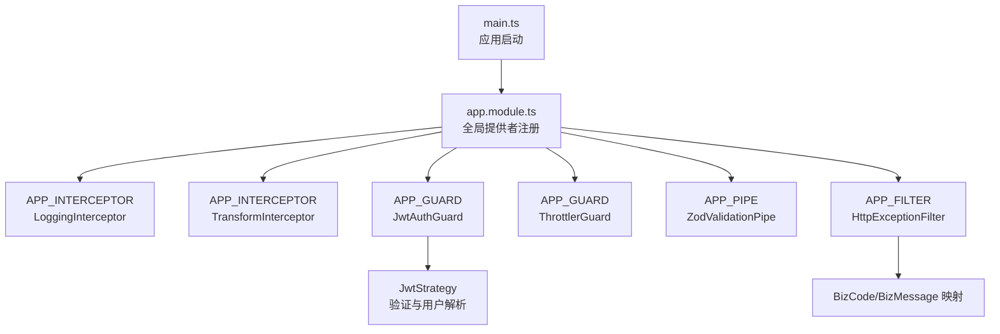
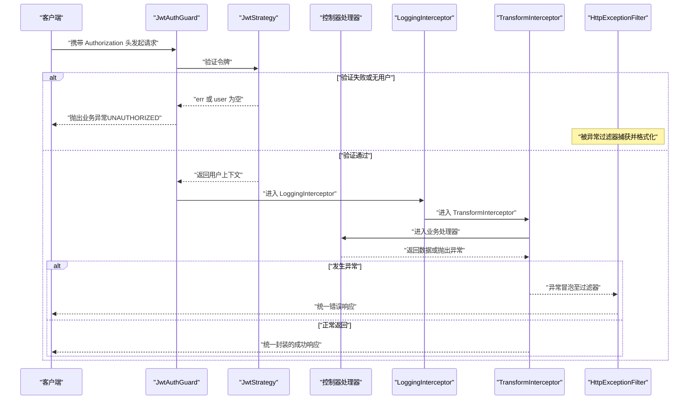
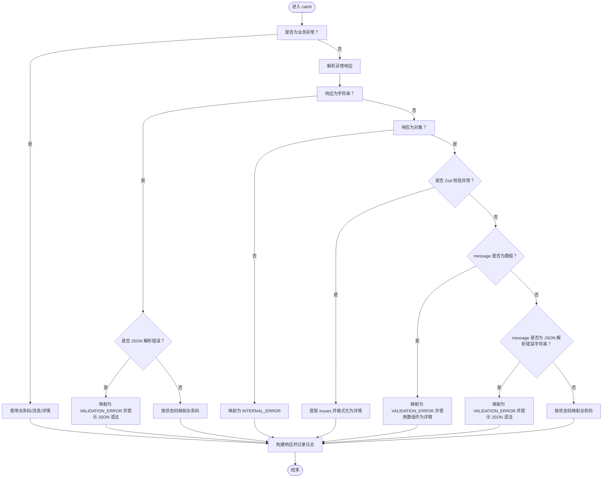
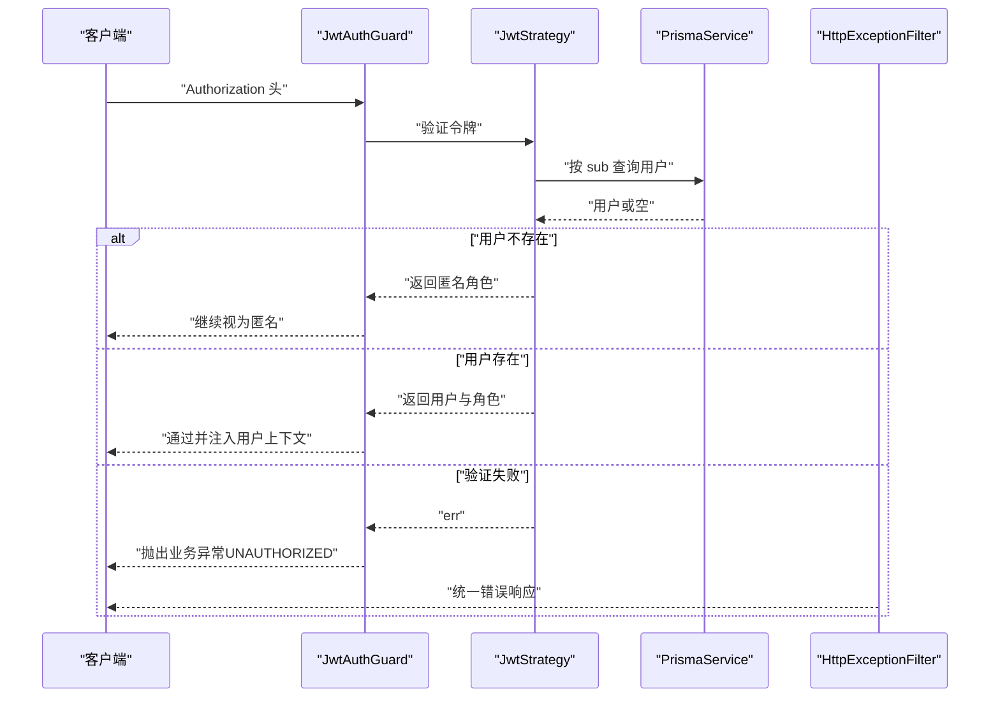
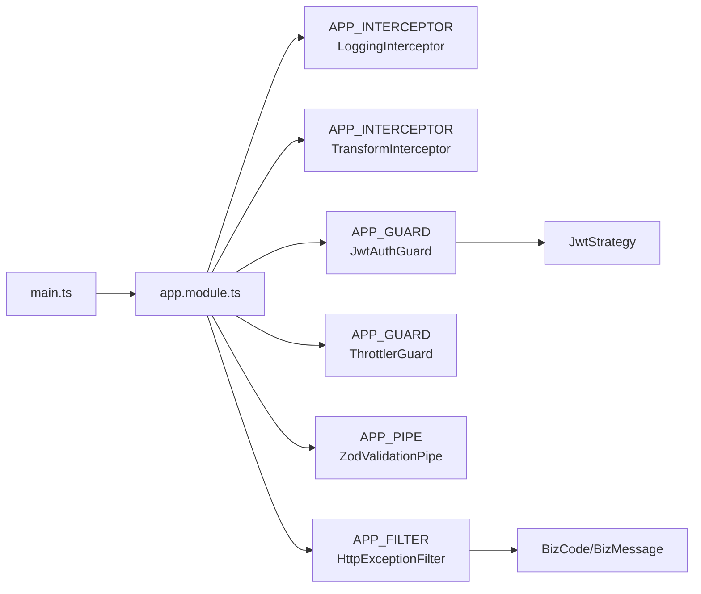

# 运行时错误

<cite>
**本文引用的文件**
- [apps/nestjs-server/src/main.ts](file://apps/nestjs-server/src/main.ts)
- [apps/nestjs-server/src/app.module.ts](file://apps/nestjs-server/src/app.module.ts)
- [apps/nestjs-server/src/common/filters/http-exception.filter.ts](file://apps/nestjs-server/src/common/filters/http-exception.filter.ts)
- [apps/nestjs-server/src/common/exceptions/business.exception.ts](file://apps/nestjs-server/src/common/exceptions/business.exception.ts)
- [apps/nestjs-server/src/common/enums/biz-code.enum.ts](file://apps/nestjs-server/src/common/enums/biz-code.enum.ts)
- [apps/nestjs-server/src/common/dto/api-error-response.dto.ts](file://apps/nestjs-server/src/common/dto/api-error-response.dto.ts)
- [apps/nestjs-server/src/common/guards/jwt-auth.guard.ts](file://apps/nestjs-server/src/common/guards/jwt-auth.guard.ts)
- [apps/nestjs-server/src/modules/auth/strategies/jwt.strategy.ts](file://apps/nestjs-server/src/modules/auth/strategies/jwt.strategy.ts)
- [apps/nestjs-server/src/common/interceptors/logging.interceptor.ts](file://apps/nestjs-server/src/common/interceptors/logging.interceptor.ts)
- [apps/nestjs-server/src/common/interceptors/transform.interceptor.ts](file://apps/nestjs-server/src/common/interceptors/transform.interceptor.ts)
- [apps/nestjs-server/src/common/guards/throttler.guard.ts](file://apps/nestjs-server/src/common/guards/throttler.guard.ts)
- [apps/nestjs-server/src/common/decorators/public.decorator.ts](file://apps/nestjs-server/src/common/decorators/public.decorator.ts)
- [apps/nestjs-server/src/common/decorators/skip-throttle.decorator.ts](file://apps/nestjs-server/src/common/decorators/skip-throttle.decorator.ts)
- [apps/nestjs-server/src/config/typed-config.service.ts](file://apps/nestjs-server/src/config/typed-config.service.ts)
</cite>

## 目录

1. [简介](#简介)
2. [项目结构](#项目结构)
3. [核心组件](#核心组件)
4. [架构总览](#架构总览)
5. [详细组件分析](#详细组件分析)
6. [依赖关系分析](#依赖关系分析)
7. [性能与可观测性](#性能与可观测性)
8. [故障排查指南](#故障排查指南)
9. [结论](#结论)
10. [附录](#附录)

## 简介

本指南聚焦于应用程序运行时错误的排查与处理，覆盖以下主题：

- HTTP 异常过滤器的工作原理与错误映射策略
- 业务异常的捕获与处理流程
- JWT 认证失败的排查步骤与常见原因
- 错误日志分析方法、异常堆栈跟踪解读
- 常见错误代码的含义说明
- 请求拦截、响应处理与中间件执行顺序的调试技巧

## 项目结构

后端基于 NestJS 构建，全局注册了拦截器、守卫、管道与异常过滤器，形成统一的请求生命周期处理链。启动阶段完成 CORS、Swagger、全局前缀设置与日志初始化。

图表来源

- [apps/nestjs-server/src/main.ts:9-47](file://apps/nestjs-server/src/main.ts#L9-L47)
- [apps/nestjs-server/src/app.module.ts:19-63](file://apps/nestjs-server/src/app.module.ts#L19-L63)

章节来源

- [apps/nestjs-server/src/main.ts:9-47](file://apps/nestjs-server/src/main.ts#L9-L47)
- [apps/nestjs-server/src/app.module.ts:19-63](file://apps/nestjs-server/src/app.module.ts#L19-L63)

## 核心组件

- 异常过滤器：统一捕获并格式化错误响应，将 HTTP 状态映射为业务码，支持 Zod 校验错误与 JSON 解析错误的特殊处理。
- 业务异常：封装业务码、消息与可选详情，便于在业务层精确抛出并被过滤器识别。
- JWT 守卫与策略：负责认证拦截、令牌解析与用户上下文注入；失败时抛出业务异常。
- 日志与响应转换：拦截器记录请求与耗时，并将成功响应统一封装为 {code,message,data?} 结构。
- 配置服务：提供强类型配置读取能力，支撑启动与运行期行为。

章节来源

- [apps/nestjs-server/src/common/filters/http-exception.filter.ts:16-68](file://apps/nestjs-server/src/common/filters/http-exception.filter.ts#L16-L68)
- [apps/nestjs-server/src/common/exceptions/business.exception.ts:16-41](file://apps/nestjs-server/src/common/exceptions/business.exception.ts#L16-L41)
- [apps/nestjs-server/src/common/guards/jwt-auth.guard.ts:17-42](file://apps/nestjs-server/src/common/guards/jwt-auth.guard.ts#L17-L42)
- [apps/nestjs-server/src/modules/auth/strategies/jwt.strategy.ts:9-49](file://apps/nestjs-server/src/modules/auth/strategies/jwt.strategy.ts#L9-L49)
- [apps/nestjs-server/src/common/interceptors/logging.interceptor.ts:6-29](file://apps/nestjs-server/src/common/interceptors/logging.interceptor.ts#L6-L29)
- [apps/nestjs-server/src/common/interceptors/transform.interceptor.ts:9-36](file://apps/nestjs-server/src/common/interceptors/transform.interceptor.ts#L9-L36)
- [apps/nestjs-server/src/config/typed-config.service.ts:6-46](file://apps/nestjs-server/src/config/typed-config.service.ts#L6-L46)

## 架构总览

下图展示一次典型请求的执行顺序与错误处理路径：

图表来源

- [apps/nestjs-server/src/common/guards/jwt-auth.guard.ts:23-41](file://apps/nestjs-server/src/common/guards/jwt-auth.guard.ts#L23-L41)
- [apps/nestjs-server/src/modules/auth/strategies/jwt.strategy.ts:22-47](file://apps/nestjs-server/src/modules/auth/strategies/jwt.strategy.ts#L22-L47)
- [apps/nestjs-server/src/common/interceptors/logging.interceptor.ts:10-27](file://apps/nestjs-server/src/common/interceptors/logging.interceptor.ts#L10-L27)
- [apps/nestjs-server/src/common/interceptors/transform.interceptor.ts:13-33](file://apps/nestjs-server/src/common/interceptors/transform.interceptor.ts#L13-L33)
- [apps/nestjs-server/src/common/filters/http-exception.filter.ts:20-68](file://apps/nestjs-server/src/common/filters/http-exception.filter.ts#L20-L68)

## 详细组件分析

### HTTP 异常过滤器（HttpExceptionFilter）

- 捕获范围：专门捕获 HttpException 及其子类，包括业务异常与框架抛出的异常。
- 业务异常优先处理：当捕获到业务异常时，直接使用其携带的业务码与消息，并写入警告日志。
- 其他异常映射：
  - Zod 校验异常：提取字段级问题并格式化为详情数组。
  - class-validator 校验异常：将 message 数组作为详情。
  - JSON 解析错误：识别特定字符串模式，映射为“参数校验失败”，并提示 JSON 语法问题。
  - 其他字符串消息：按 HTTP 状态映射到通用业务码。
- 响应结构：统一为 {code,message,details?}，状态码与业务码一致。
- 日志记录：对每条错误请求记录请求方法、URL、业务码与消息，便于审计与定位。

图表来源

- [apps/nestjs-server/src/common/filters/http-exception.filter.ts:20-145](file://apps/nestjs-server/src/common/filters/http-exception.filter.ts#L20-L145)

章节来源

- [apps/nestjs-server/src/common/filters/http-exception.filter.ts:16-68](file://apps/nestjs-server/src/common/filters/http-exception.filter.ts#L16-L68)
- [apps/nestjs-server/src/common/dto/api-error-response.dto.ts:4-10](file://apps/nestjs-server/src/common/dto/api-error-response.dto.ts#L4-L10)
- [apps/nestjs-server/src/common/enums/biz-code.enum.ts:15](file://apps/nestjs-server/src/common/enums/biz-code.enum.ts#L15)

### 业务异常（BusinessException）

- 设计目的：在业务层以统一方式抛出错误，避免散落的 HttpException 使用。
- 关键属性：业务码、业务消息、可选详情（如字段校验错误列表）。
- 自动映射：构造函数根据业务码解析 HTTP 状态码，保证响应状态与业务码一致。
- 使用建议：优先在服务层与控制器层抛出该异常，确保上层过滤器能正确识别与格式化。

章节来源

- [apps/nestjs-server/src/common/exceptions/business.exception.ts:16-41](file://apps/nestjs-server/src/common/exceptions/business.exception.ts#L16-L41)
- [apps/nestjs-server/src/common/enums/biz-code.enum.ts:15](file://apps/nestjs-server/src/common/enums/biz-code.enum.ts#L15)

### JWT 认证流程与排查

- 守卫逻辑：JwtAuthGuard 在非公开路由中委托父类 AuthGuard('jwt') 进行认证；若 err 或 user 为空，则抛出业务异常（通常为 UNAUTHORIZED）。
- 策略逻辑：JwtStrategy 从 Authorization 头提取令牌并验证，随后查询数据库加载用户角色信息；若找不到用户则返回匿名角色集合。
- 排查要点：
  - 令牌格式与签名：确认 Bearer 令牌有效且未过期。
  - 秘钥一致性：核对服务端配置的密钥与签发方一致。
  - 用户存在性：确认数据库中是否存在对应 ID 的用户。
  - 公开接口：若接口需放行，使用公共装饰器标记，避免被守卫拦截。

图表来源

- [apps/nestjs-server/src/common/guards/jwt-auth.guard.ts:23-41](file://apps/nestjs-server/src/common/guards/jwt-auth.guard.ts#L23-L41)
- [apps/nestjs-server/src/modules/auth/strategies/jwt.strategy.ts:22-47](file://apps/nestjs-server/src/modules/auth/strategies/jwt.strategy.ts#L22-L47)
- [apps/nestjs-server/src/common/filters/http-exception.filter.ts:29-44](file://apps/nestjs-server/src/common/filters/http-exception.filter.ts#L29-L44)

章节来源

- [apps/nestjs-server/src/common/guards/jwt-auth.guard.ts:17-42](file://apps/nestjs-server/src/common/guards/jwt-auth.guard.ts#L17-L42)
- [apps/nestjs-server/src/modules/auth/strategies/jwt.strategy.ts:9-49](file://apps/nestjs-server/src/modules/auth/strategies/jwt.strategy.ts#L9-L49)
- [apps/nestjs-server/src/common/decorators/public.decorator.ts:3-4](file://apps/nestjs-server/src/common/decorators/public.decorator.ts#L3-L4)

### 日志与响应转换拦截器

- LoggingInterceptor：记录请求方法、URL、用户 ID、IP、UA 以及响应状态与耗时，便于快速定位慢请求与异常。
- TransformInterceptor：将成功响应统一封装为 {code,message,data?}，并允许通过反射注入自定义响应消息；无数据时省略 data 字段。

章节来源

- [apps/nestjs-server/src/common/interceptors/logging.interceptor.ts:6-29](file://apps/nestjs-server/src/common/interceptors/logging.interceptor.ts#L6-L29)
- [apps/nestjs-server/src/common/interceptors/transform.interceptor.ts:9-36](file://apps/nestjs-server/src/common/interceptors/transform.interceptor.ts#L9-L36)

### 速率限制与跳过装饰器

- ThrottlerGuard：基于装饰器元数据决定是否跳过限流；默认提供 short、medium、long 三档策略。
- SkipThrottle：对高频但低风险接口（如健康检查）进行放行，避免误伤。

章节来源

- [apps/nestjs-server/src/common/guards/throttler.guard.ts:11-32](file://apps/nestjs-server/src/common/guards/throttler.guard.ts#L11-L32)
- [apps/nestjs-server/src/common/decorators/skip-throttle.decorator.ts:11](file://apps/nestjs-server/src/common/decorators/skip-throttle.decorator.ts#L11)

## 依赖关系分析

- 启动阶段：main.ts 初始化应用、日志、CORS、Swagger 与全局前缀。
- 全局注册：app.module.ts 将拦截器、守卫、管道与过滤器注册为全局提供者，形成统一的请求处理链。
- 业务码来源：业务码与消息映射来自共享包，确保前后端一致。

图表来源

- [apps/nestjs-server/src/main.ts:9-47](file://apps/nestjs-server/src/main.ts#L9-L47)
- [apps/nestjs-server/src/app.module.ts:19-63](file://apps/nestjs-server/src/app.module.ts#L19-L63)
- [apps/nestjs-server/src/common/enums/biz-code.enum.ts:15](file://apps/nestjs-server/src/common/enums/biz-code.enum.ts#L15)

章节来源

- [apps/nestjs-server/src/main.ts:9-47](file://apps/nestjs-server/src/main.ts#L9-L47)
- [apps/nestjs-server/src/app.module.ts:19-63](file://apps/nestjs-server/src/app.module.ts#L19-L63)

## 性能与可观测性

- 日志记录：HTTP 请求与响应耗时、状态码、用户标识均被记录，便于定位慢请求与异常。
- 统一响应：TransformInterceptor 确保成功响应结构一致，简化前端处理。
- 速率限制：ThrottlerGuard 提供多档限流策略，SkipThrottle 支持对特定接口放行。
- 配置强类型：TypedConfigService 提供点语法读取与命名空间访问，降低配置错误概率。

章节来源

- [apps/nestjs-server/src/common/interceptors/logging.interceptor.ts:10-27](file://apps/nestjs-server/src/common/interceptors/logging.interceptor.ts#L10-L27)
- [apps/nestjs-server/src/common/interceptors/transform.interceptor.ts:13-33](file://apps/nestjs-server/src/common/interceptors/transform.interceptor.ts#L13-L33)
- [apps/nestjs-server/src/common/guards/throttler.guard.ts:20-31](file://apps/nestjs-server/src/common/guards/throttler.guard.ts#L20-L31)
- [apps/nestjs-server/src/config/typed-config.service.ts:23-44](file://apps/nestjs-server/src/config/typed-config.service.ts#L23-L44)

## 故障排查指南

### 一、HTTP 异常过滤器工作原理与错误映射

- 业务异常：直接透传业务码与消息，记录警告日志，响应体包含 code、message、details（如有）。
- Zod 校验异常：提取字段级问题，统一格式化为详情数组；字段缺失场景自动转为中文“必填”提示。
- class-validator 校验异常：将 message 数组作为详情返回。
- JSON 解析错误：识别特定字符串模式，映射为“参数校验失败”，并提示 JSON 语法问题。
- 其他字符串消息：按 HTTP 状态映射到通用业务码（如 400→VALIDATION_ERROR、401→UNAUTHORIZED、403→FORBIDDEN、404→NOT_FOUND、500→INTERNAL_ERROR）。
- 响应结构：始终为 {code,message,details?}，状态码与业务码一致。

章节来源

- [apps/nestjs-server/src/common/filters/http-exception.filter.ts:29-68](file://apps/nestjs-server/src/common/filters/http-exception.filter.ts#L29-L68)
- [apps/nestjs-server/src/common/filters/http-exception.filter.ts:106-145](file://apps/nestjs-server/src/common/filters/http-exception.filter.ts#L106-L145)
- [apps/nestjs-server/src/common/filters/http-exception.filter.ts:191-206](file://apps/nestjs-server/src/common/filters/http-exception.filter.ts#L191-L206)

### 二、业务异常的捕获与处理

- 抛出位置：在服务层或控制器层使用业务异常抛出，明确业务码与消息。
- 捕获与格式化：异常过滤器识别业务异常，直接使用其业务码与消息生成响应。
- 详情字段：当需要向客户端展示字段级错误时，在构造业务异常时传入详情数组。

章节来源

- [apps/nestjs-server/src/common/exceptions/business.exception.ts:24-40](file://apps/nestjs-server/src/common/exceptions/business.exception.ts#L24-L40)
- [apps/nestjs-server/src/common/filters/http-exception.filter.ts:29-44](file://apps/nestjs-server/src/common/filters/http-exception.filter.ts#L29-L44)

### 三、JWT 认证失败排查步骤

- 步骤 1：确认请求头是否包含有效的 Bearer 令牌。
- 步骤 2：核对服务端配置的密钥与签发方一致。
- 步骤 3：检查令牌是否过期或被篡改。
- 步骤 4：确认数据库中是否存在对应 ID 的用户；若不存在，策略会返回匿名角色，守卫不会抛出异常。
- 步骤 5：若接口应放行，使用公共装饰器标记，避免被 JwtAuthGuard 拦截。
- 步骤 6：查看日志中是否出现“未授权”相关记录，结合请求方法与 URL 快速定位。

章节来源

- [apps/nestjs-server/src/common/guards/jwt-auth.guard.ts:36-41](file://apps/nestjs-server/src/common/guards/jwt-auth.guard.ts#L36-L41)
- [apps/nestjs-server/src/modules/auth/strategies/jwt.strategy.ts:22-47](file://apps/nestjs-server/src/modules/auth/strategies/jwt.strategy.ts#L22-L47)
- [apps/nestjs-server/src/common/decorators/public.decorator.ts:3-4](file://apps/nestjs-server/src/common/decorators/public.decorator.ts#L3-L4)

### 四、错误日志分析方法

- 请求级日志：由日志拦截器记录请求方法、URL、用户 ID、IP、UA 与耗时，便于定位慢请求与异常。
- 错误级日志：异常过滤器在捕获异常时记录业务码、HTTP 状态与请求信息，便于审计与回溯。
- 建议：结合时间戳与用户 ID 进行聚合分析，优先关注高频错误与高耗时请求。

章节来源

- [apps/nestjs-server/src/common/interceptors/logging.interceptor.ts:14-26](file://apps/nestjs-server/src/common/interceptors/logging.interceptor.ts#L14-L26)
- [apps/nestjs-server/src/common/filters/http-exception.filter.ts:32-57](file://apps/nestjs-server/src/common/filters/http-exception.filter.ts#L32-L57)

### 五、异常堆栈跟踪解读

- 业务异常：堆栈通常出现在业务层抛出点，异常过滤器会将其转换为统一错误响应。
- 认证异常：JwtAuthGuard 在验证失败时抛出业务异常，堆栈指向守卫的处理函数。
- 校验异常：Zod 与 class-validator 的异常会被异常过滤器识别并格式化为字段级详情。
- 建议：优先查看异常过滤器的日志记录，再结合业务层调用栈定位具体问题。

章节来源

- [apps/nestjs-server/src/common/exceptions/business.exception.ts:24-40](file://apps/nestjs-server/src/common/exceptions/business.exception.ts#L24-L40)
- [apps/nestjs-server/src/common/guards/jwt-auth.guard.ts:36-41](file://apps/nestjs-server/src/common/guards/jwt-auth.guard.ts#L36-L41)
- [apps/nestjs-server/src/common/filters/http-exception.filter.ts:106-145](file://apps/nestjs-server/src/common/filters/http-exception.filter.ts#L106-L145)

### 六、常见错误代码含义

- 通用错误：1xxx
  - 10xx：认证模块相关错误
  - 11xx：用户模块相关错误
  - 12xx：菜单模块相关错误
  - 13xx：角色模块相关错误
  - 14xx：字典模块相关错误
- 业务码来源：所有业务码与消息映射来自共享包，确保前后端一致。
- 常见状态码映射：
  - 400 → VALIDATION_ERROR
  - 401 → UNAUTHORIZED
  - 403 → FORBIDDEN
  - 404 → NOT_FOUND
  - 500 → INTERNAL_ERROR

章节来源

- [apps/nestjs-server/src/common/enums/biz-code.enum.ts:6-15](file://apps/nestjs-server/src/common/enums/biz-code.enum.ts#L6-L15)
- [apps/nestjs-server/src/common/filters/http-exception.filter.ts:191-206](file://apps/nestjs-server/src/common/filters/http-exception.filter.ts#L191-L206)

### 七、请求拦截、响应处理与中间件执行顺序调试技巧

- 执行顺序：JwtAuthGuard → LoggingInterceptor → TransformInterceptor → 控制器处理器 → 异常过滤器（若发生异常）。
- 调试建议：
  - 在 JwtAuthGuard 的 canActive 与 handleRequest 中添加断点，观察是否进入守卫逻辑。
  - 在 LoggingInterceptor 的 intercept 中打印请求上下文，确认用户 ID 与 IP。
  - 在 TransformInterceptor 的 intercept 中检查响应封装是否符合预期。
  - 若异常未被捕获，检查是否抛出了非 HttpException；必要时改用业务异常。
- 速率限制：对可疑接口使用 SkipThrottle 装饰器临时放行，排除限流干扰。

章节来源

- [apps/nestjs-server/src/common/guards/jwt-auth.guard.ts:23-41](file://apps/nestjs-server/src/common/guards/jwt-auth.guard.ts#L23-L41)
- [apps/nestjs-server/src/common/interceptors/logging.interceptor.ts:10-27](file://apps/nestjs-server/src/common/interceptors/logging.interceptor.ts#L10-L27)
- [apps/nestjs-server/src/common/interceptors/transform.interceptor.ts:13-33](file://apps/nestjs-server/src/common/interceptors/transform.interceptor.ts#L13-L33)
- [apps/nestjs-server/src/common/guards/throttler.guard.ts:20-31](file://apps/nestjs-server/src/common/guards/throttler.guard.ts#L20-L31)
- [apps/nestjs-server/src/common/decorators/skip-throttle.decorator.ts:11](file://apps/nestjs-server/src/common/decorators/skip-throttle.decorator.ts#L11)

## 结论

通过统一的异常过滤器、业务异常与 JWT 认证机制，系统实现了运行时错误的标准化处理与可观测性。配合拦截器的日志记录与响应封装，能够快速定位问题并提供一致的错误体验。建议在业务开发中优先使用业务异常，并结合公共装饰器与跳过限流装饰器合理配置路由行为，以获得最佳的可维护性与稳定性。

## 附录

- 启动与配置：应用启动时完成日志初始化、CORS 设置、Swagger 文档与全局前缀配置。
- 全局提供者：拦截器、守卫、管道与过滤器均以全局方式注册，确保一致的行为。

章节来源

- [apps/nestjs-server/src/main.ts:9-47](file://apps/nestjs-server/src/main.ts#L9-L47)
- [apps/nestjs-server/src/app.module.ts:35-60](file://apps/nestjs-server/src/app.module.ts#L35-L60)
