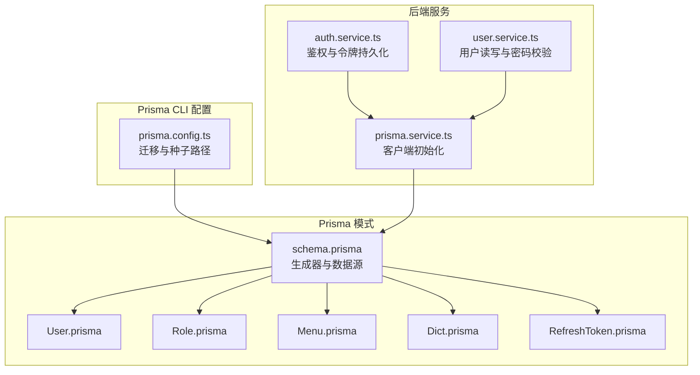
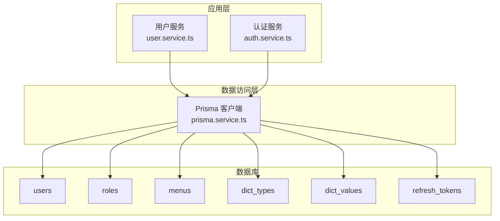
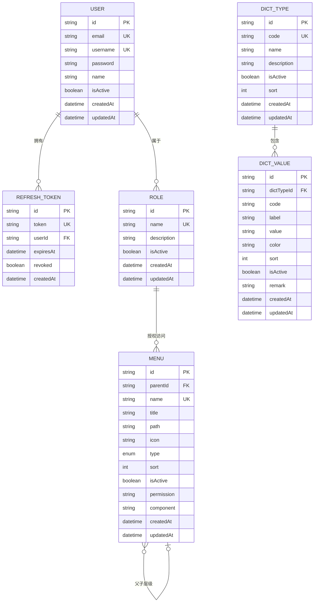
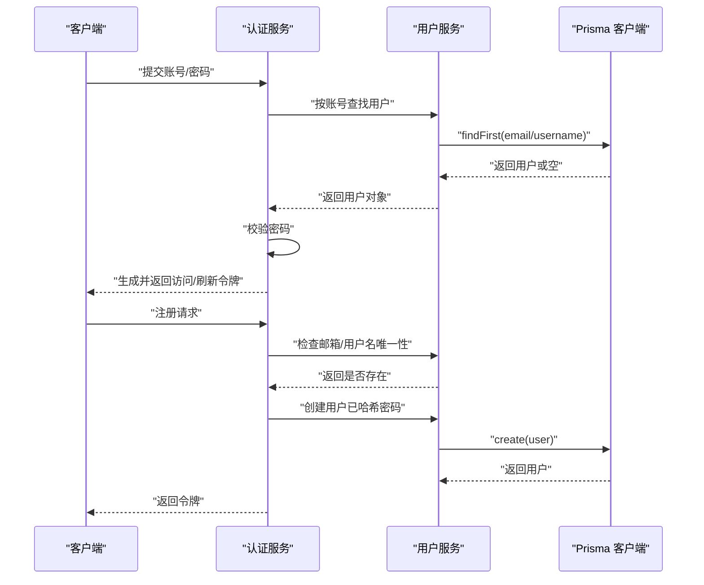
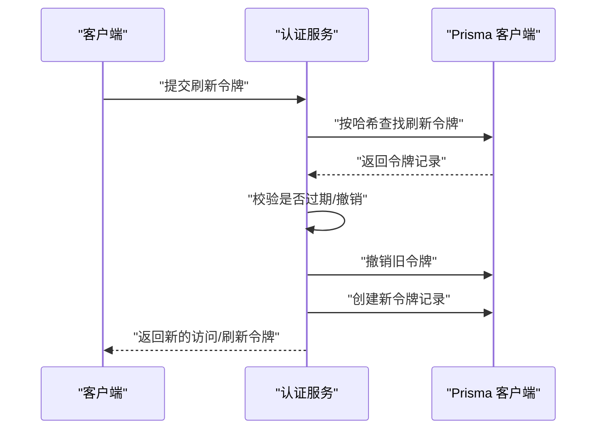
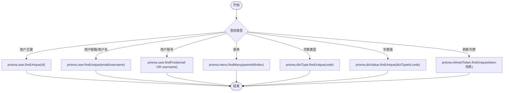
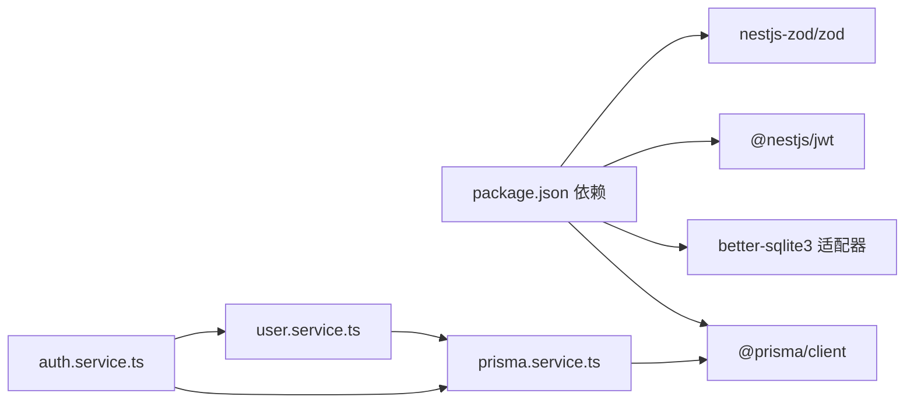

# 数据库设计

<cite>
**本文引用的文件**
- [schema.prisma](file://apps/nestjs-server/prisma/schema.prisma)
- [User.prisma](file://apps/nestjs-server/prisma/schema/User.prisma)
- [Role.prisma](file://apps/nestjs-server/prisma/schema/Role.prisma)
- [Menu.prisma](file://apps/nestjs-server/prisma/schema/Menu.prisma)
- [Dict.prisma](file://apps/nestjs-server/prisma/schema/Dict.prisma)
- [RefreshToken.prisma](file://apps/nestjs-server/prisma/schema/RefreshToken.prisma)
- [prisma.config.ts](file://apps/nestjs-server/prisma.config.ts)
- [seed.ts](file://apps/nestjs-server/prisma/seed.ts)
- [prisma.service.ts](file://apps/nestjs-server/src/prisma/prisma.service.ts)
- [auth.service.ts](file://apps/nestjs-server/src/modules/auth/auth.service.ts)
- [user.service.ts](file://apps/nestjs-server/src/modules/user/user.service.ts)
- [user.dto.ts](file://apps/nestjs-server/src/modules/user/dto/user.dto.ts)
- [auth.dto.ts](file://apps/nestjs-server/src/modules/auth/dto/auth.dto.ts)
- [database.schema.ts](file://apps/nestjs-server/src/config/schemas/database.schema.ts)
- [package.json](file://apps/nestjs-server/package.json)
</cite>

## 目录

1. [简介](#简介)
2. [项目结构](#项目结构)
3. [核心组件](#核心组件)
4. [架构总览](#架构总览)
5. [详细组件分析](#详细组件分析)
6. [依赖分析](#依赖分析)
7. [性能考虑](#性能考虑)
8. [故障排查指南](#故障排查指南)
9. [结论](#结论)
10. [附录](#附录)

## 简介

本文件系统化梳理基于 Prisma ORM 的数据库设计与架构，重点覆盖用户、角色、菜单、字典与刷新令牌等核心实体的设计与约束，解释字段语义、索引策略与查询优化思路；同时给出迁移与种子脚本、版本管理与数据完整性保障方案，并结合后端服务展示典型数据交互流程与事务处理要点。

## 项目结构

数据库模式采用 Prisma 模块化 schema 设计，按功能域拆分至独立文件，统一在根 schema 中声明生成器与数据源；Prisma CLI 配置集中于 prisma.config.ts，支持迁移目录、种子脚本与环境变量驱动的 datasource URL。

图表来源

- [schema.prisma:1-9](file://apps/nestjs-server/prisma/schema.prisma#L1-L9)
- [prisma.config.ts:1-14](file://apps/nestjs-server/prisma.config.ts#L1-L14)
- [prisma.service.ts:1-36](file://apps/nestjs-server/src/prisma/prisma.service.ts#L1-L36)
- [auth.service.ts:1-151](file://apps/nestjs-server/src/modules/auth/auth.service.ts#L1-L151)
- [user.service.ts:1-113](file://apps/nestjs-server/src/modules/user/user.service.ts#L1-L113)

章节来源

- [schema.prisma:1-9](file://apps/nestjs-server/prisma/schema.prisma#L1-L9)
- [prisma.config.ts:1-14](file://apps/nestjs-server/prisma.config.ts#L1-L14)

## 核心组件

- 用户（User）
  - 主键：UUID
  - 唯一约束：email、username
  - 默认值：isActive=true、createdAt=now()、updatedAt=now()
  - 关系：一对多（RefreshToken）、多对多（Role）
  - 表映射：users
- 角色（Role）
  - 主键：UUID
  - 唯一约束：name
  - 默认值：isActive=true、createdAt=now()、updatedAt=now()
  - 关系：多对多（User）、多对多（Menu）
  - 表映射：roles
- 菜单（Menu）
  - 主键：UUID
  - 唯一约束：name
  - 默认值：type=menu、sort=0、isActive=true、createdAt=now()、updatedAt=now()
  - 层级：自引用父子关系（parentId -> id），删除时级联
  - 索引：parentId
  - 关系：多对多（Role）
  - 表映射：menus
- 字典类型（DictType）
  - 主键：UUID
  - 唯一约束：code
  - 默认值：sort=0、isActive=true、createdAt=now()、updatedAt=now()
  - 关系：一对多（DictValue）
  - 索引：code
  - 表映射：dict_types
- 字典值（DictValue）
  - 主键：UUID
  - 唯一约束：(dictTypeId, code)
  - 默认值：sort=0、isActive=true、createdAt=now()、updatedAt=now()
  - 外键：dictTypeId -> DictType(id)，删除时级联
  - 索引：dictTypeId
  - 表映射：dict_values
- 刷新令牌（RefreshToken）
  - 主键：UUID
  - 唯一约束：token（哈希存储）
  - 默认值：revoked=false、createdAt=now()
  - 外键：userId -> User(id)，删除时级联
  - 索引：userId
  - 表映射：refresh_tokens

章节来源

- [User.prisma:1-15](file://apps/nestjs-server/prisma/schema/User.prisma#L1-L15)
- [Role.prisma:1-13](file://apps/nestjs-server/prisma/schema/Role.prisma#L1-L13)
- [Menu.prisma:1-28](file://apps/nestjs-server/prisma/schema/Menu.prisma#L1-L28)
- [Dict.prisma:1-34](file://apps/nestjs-server/prisma/schema/Dict.prisma#L1-L34)
- [RefreshToken.prisma:1-12](file://apps/nestjs-server/prisma/schema/RefreshToken.prisma#L1-L12)

## 架构总览

下图展示 Prisma 客户端、后端服务与数据库之间的交互关系，以及令牌刷新与用户管理的关键流程。

图表来源

- [prisma.service.ts:1-36](file://apps/nestjs-server/src/prisma/prisma.service.ts#L1-L36)
- [user.service.ts:1-113](file://apps/nestjs-server/src/modules/user/user.service.ts#L1-L113)
- [auth.service.ts:1-151](file://apps/nestjs-server/src/modules/auth/auth.service.ts#L1-L151)
- [User.prisma:1-15](file://apps/nestjs-server/prisma/schema/User.prisma#L1-L15)
- [Role.prisma:1-13](file://apps/nestjs-server/prisma/schema/Role.prisma#L1-L13)
- [Menu.prisma:1-28](file://apps/nestjs-server/prisma/schema/Menu.prisma#L1-L28)
- [Dict.prisma:1-34](file://apps/nestjs-server/prisma/schema/Dict.prisma#L1-L34)
- [RefreshToken.prisma:1-12](file://apps/nestjs-server/prisma/schema/RefreshToken.prisma#L1-L12)

## 详细组件分析

### 实体关系图（ER）

图表来源

- [User.prisma:1-15](file://apps/nestjs-server/prisma/schema/User.prisma#L1-L15)
- [Role.prisma:1-13](file://apps/nestjs-server/prisma/schema/Role.prisma#L1-L13)
- [Menu.prisma:1-28](file://apps/nestjs-server/prisma/schema/Menu.prisma#L1-L28)
- [Dict.prisma:1-34](file://apps/nestjs-server/prisma/schema/Dict.prisma#L1-L34)
- [RefreshToken.prisma:1-12](file://apps/nestjs-server/prisma/schema/RefreshToken.prisma#L1-L12)

### 登录与注册序列图

图表来源

- [auth.service.ts:29-57](file://apps/nestjs-server/src/modules/auth/auth.service.ts#L29-L57)
- [user.service.ts:17-31](file://apps/nestjs-server/src/modules/user/user.service.ts#L17-L31)
- [user.dto.ts:1-26](file://apps/nestjs-server/src/modules/user/dto/user.dto.ts#L1-L26)
- [auth.dto.ts:1-30](file://apps/nestjs-server/src/modules/auth/dto/auth.dto.ts#L1-L30)

### 刷新令牌序列图

图表来源

- [auth.service.ts:64-84](file://apps/nestjs-server/src/modules/auth/auth.service.ts#L64-L84)
- [RefreshToken.prisma:1-12](file://apps/nestjs-server/prisma/schema/RefreshToken.prisma#L1-L12)

### 查询流程与索引策略

- 用户查询
  - 按主键查询：高效
  - 按邮箱/用户名查询：依赖唯一索引
  - 按账号（邮箱或用户名）查询：使用 OR 条件，建议在应用层限制只传一个条件以命中索引
- 菜单查询
  - 父子层级：利用 parentId 索引进行层级遍历
  - 授权查询：通过角色-菜单关联表进行多对多过滤
- 字典查询
  - 字典类型按 code 查询：命中唯一索引
  - 字典值按 (dictTypeId, code) 组合唯一：避免重复，提升定位效率
- 刷新令牌
  - 存储使用哈希 token，按唯一索引查找；按 userId 建立索引便于批量撤销

图表来源

- [user.service.ts:40-77](file://apps/nestjs-server/src/modules/user/user.service.ts#L40-L77)
- [Menu.prisma:25-26](file://apps/nestjs-server/prisma/schema/Menu.prisma#L25-L26)
- [Dict.prisma:12-31](file://apps/nestjs-server/prisma/schema/Dict.prisma#L12-L31)
- [RefreshToken.prisma:3-10](file://apps/nestjs-server/prisma/schema/RefreshToken.prisma#L3-L10)

### 事务与并发控制

- 当前实现未显式开启事务块，多数操作为单表读写；若需跨表一致性变更，应在服务层包裹 Prisma 事务以保证原子性。
- 建议在以下场景使用事务：
  - 用户注册：创建用户 + 初始化默认角色绑定
  - 菜单授权：批量更新角色-菜单关联
  - 刷新令牌：撤销旧令牌 + 写入新令牌
- 并发冲突：唯一约束（email、username、name、token）由数据库强制保证，应用层可捕获约束异常并转换为业务错误码。

章节来源

- [auth.service.ts:64-84](file://apps/nestjs-server/src/modules/auth/auth.service.ts#L64-L84)
- [user.service.ts:79-97](file://apps/nestjs-server/src/modules/user/user.service.ts#L79-L97)
- [User.prisma:2-4](file://apps/nestjs-server/prisma/schema/User.prisma#L2-L4)
- [Menu.prisma:12-12](file://apps/nestjs-server/prisma/schema/Menu.prisma#L12-L12)
- [RefreshToken.prisma:3-3](file://apps/nestjs-server/prisma/schema/RefreshToken.prisma#L3-L3)

## 依赖分析

- Prisma 客户端
  - 适配器：SQLite 使用 better-sqlite3 适配器；PostgreSQL 通过 prisma.config.ts 的 datasource.url 动态注入
  - 日志：可通过配置开关启用查询日志（logging）
- 后端服务
  - 认证服务依赖用户服务与 Prisma 客户端；用户服务封装用户 CRUD 与密码校验
  - DTO 与 Schema 保持前后端一致，响应层对时间字段做格式化

图表来源

- [package.json:26-56](file://apps/nestjs-server/package.json#L26-L56)
- [prisma.service.ts:1-36](file://apps/nestjs-server/src/prisma/prisma.service.ts#L1-L36)
- [auth.service.ts:1-151](file://apps/nestjs-server/src/modules/auth/auth.service.ts#L1-L151)
- [user.service.ts:1-113](file://apps/nestjs-server/src/modules/user/user.service.ts#L1-L113)

章节来源

- [package.json:26-56](file://apps/nestjs-server/package.json#L26-L56)
- [prisma.service.ts:10-26](file://apps/nestjs-server/src/prisma/prisma.service.ts#L10-L26)
- [database.schema.ts:1-11](file://apps/nestjs-server/src/config/schemas/database.schema.ts#L1-L11)

## 性能考虑

- 索引与唯一约束
  - 已在高频查询字段上建立唯一索引（email、username、name、token、(dictTypeId,code)），减少回表与排序成本
  - 在 parentId 上建立普通索引，支撑层级查询与遍历
- 查询选择
  - 使用 select 精简返回字段，降低序列化开销
  - 对于列表查询，优先使用 where + 分页参数（offset/limit 或 cursor）
- 缓存策略
  - 对热点菜单树与字典值可引入缓存层，降低数据库压力
- 日志与监控
  - 可通过配置开启数据库查询日志，辅助慢查询定位
- 迁移与预热
  - 使用迁移脚本管理结构演进；种子脚本用于本地开发初始数据

章节来源

- [User.prisma:2-4](file://apps/nestjs-server/prisma/schema/User.prisma#L2-L4)
- [Menu.prisma:12-12](file://apps/nestjs-server/prisma/schema/Menu.prisma#L12-L12)
- [Menu.prisma:25-26](file://apps/nestjs-server/prisma/schema/Menu.prisma#L25-L26)
- [Dict.prisma:12-31](file://apps/nestjs-server/prisma/schema/Dict.prisma#L12-L31)
- [RefreshToken.prisma:3-3](file://apps/nestjs-server/prisma/schema/RefreshToken.prisma#L3-L3)
- [user.service.ts:103-111](file://apps/nestjs-server/src/modules/user/user.service.ts#L103-L111)
- [database.schema.ts:6-8](file://apps/nestjs-server/src/config/schemas/database.schema.ts#L6-L8)

## 故障排查指南

- 常见业务错误
  - 用户不存在/凭据无效：登录失败时抛出相应业务异常
  - 邮箱/用户名已被注册：注册阶段前置校验 + 数据库唯一约束兜底
  - 刷新令牌无效/已撤销/过期：刷新流程中统一校验并拒绝
- 数据库连接问题
  - SQLite：确认 dev.db 文件存在与权限；better-sqlite3 适配器初始化成功
  - PostgreSQL：检查 DATABASE_URL 环境变量与网络连通性
- 日志与调试
  - 开启数据库日志（logging）观察 SQL 执行情况
  - 使用调试脚本验证密码哈希与令牌生成逻辑

章节来源

- [auth.service.ts:29-37](file://apps/nestjs-server/src/modules/auth/auth.service.ts#L29-L37)
- [auth.service.ts:44-57](file://apps/nestjs-server/src/modules/auth/auth.service.ts#L44-L57)
- [auth.service.ts:64-84](file://apps/nestjs-server/src/modules/auth/auth.service.ts#L64-L84)
- [user.service.ts:46-48](file://apps/nestjs-server/src/modules/user/user.service.ts#L46-L48)
- [prisma.service.ts:14-26](file://apps/nestjs-server/src/prisma/prisma.service.ts#L14-L26)
- [database.schema.ts:4-8](file://apps/nestjs-server/src/config/schemas/database.schema.ts#L4-L8)

## 结论

本设计以 Prisma 为核心，围绕用户-角色-菜单构建 RBAC 基础设施，配合字典体系与刷新令牌机制，形成完整的认证授权闭环。通过合理的索引与唯一约束、精简的选择集与可选的日志监控，兼顾了易维护性与运行效率。建议在跨表一致性需求场景引入显式事务，并结合缓存与迁移策略持续优化。

## 附录

### 迁移与版本管理

- 迁移目录：prisma/migrations
- 种子脚本：ts-node prisma/seed.ts
- 数据源 URL：由 DATABASE_URL 环境变量提供

章节来源

- [prisma.config.ts:6-12](file://apps/nestjs-server/prisma.config.ts#L6-L12)
- [seed.ts:1-41](file://apps/nestjs-server/prisma/seed.ts#L1-L41)

### 数据完整性与约束

- 唯一性：email、username、name、token、(dictTypeId, code)
- 外键：dictTypeId -> DictType(id)、userId -> User(id)
- 删除策略：菜单父子级联、字典值与用户刷新令牌级联
- 默认值：isActive、sort、type、createdAt、updatedAt

章节来源

- [User.prisma:2-9](file://apps/nestjs-server/prisma/schema/User.prisma#L2-L9)
- [Role.prisma:2-9](file://apps/nestjs-server/prisma/schema/Role.prisma#L2-L9)
- [Menu.prisma:8-23](file://apps/nestjs-server/prisma/schema/Menu.prisma#L8-L23)
- [Dict.prisma:16-33](file://apps/nestjs-server/prisma/schema/Dict.prisma#L16-L33)
- [RefreshToken.prisma:1-11](file://apps/nestjs-server/prisma/schema/RefreshToken.prisma#L1-L11)
