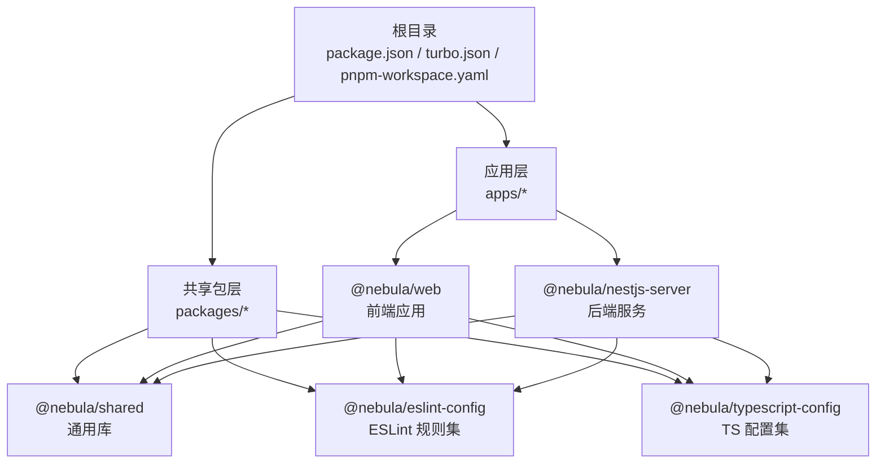
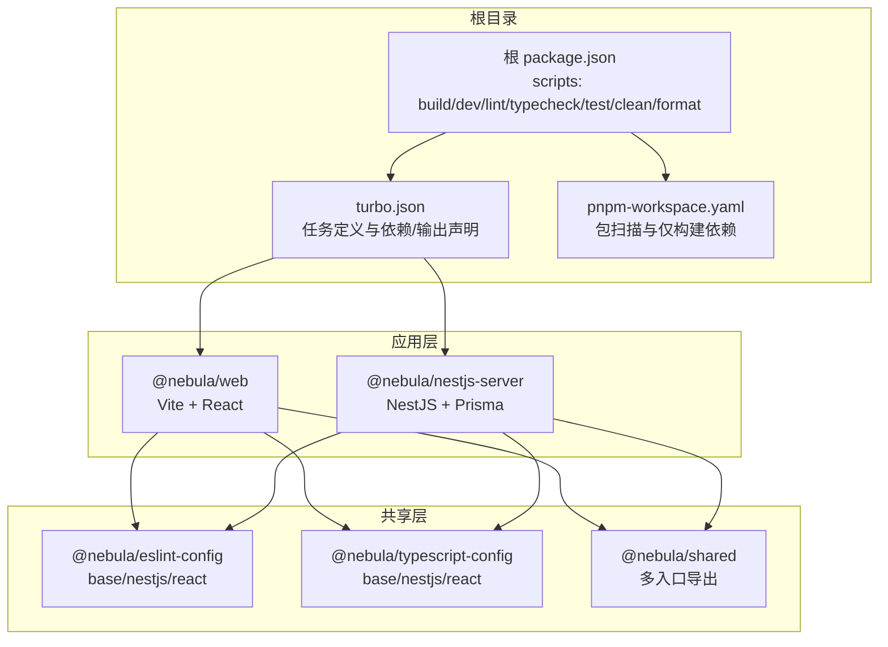
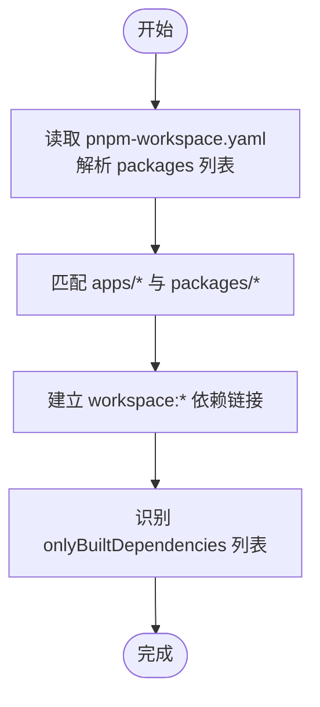
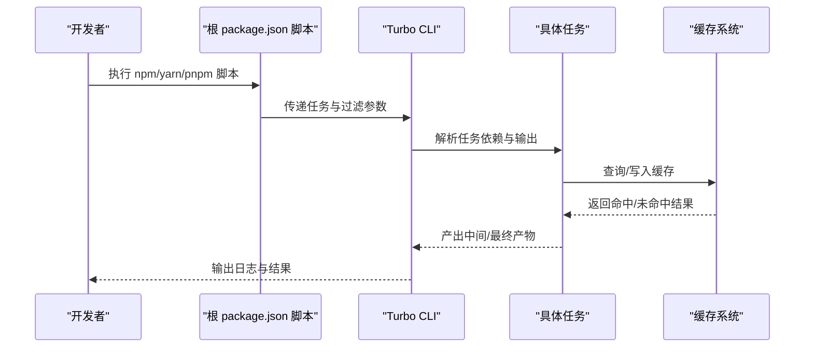
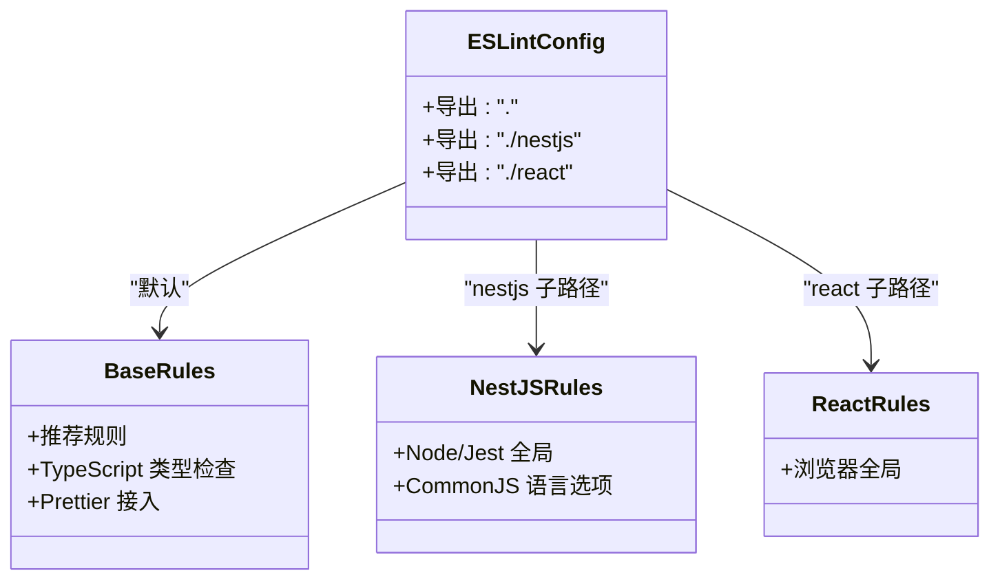
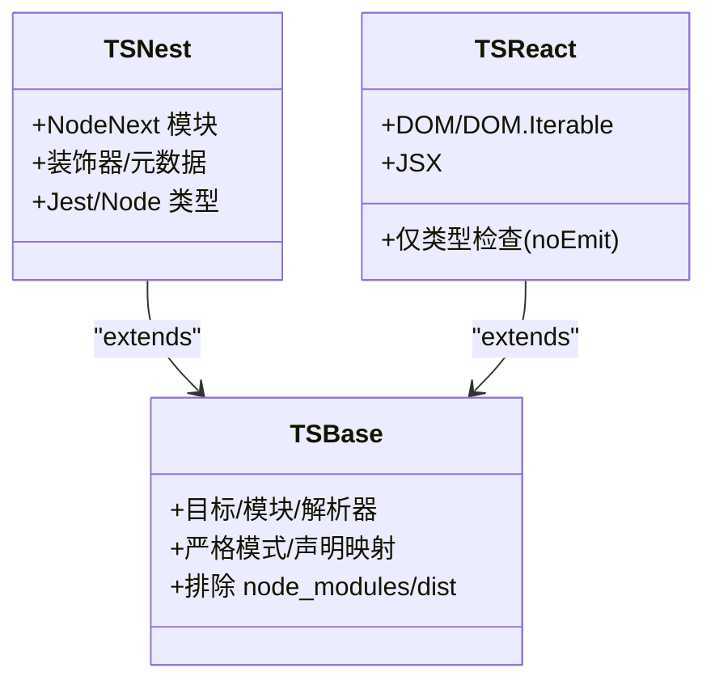
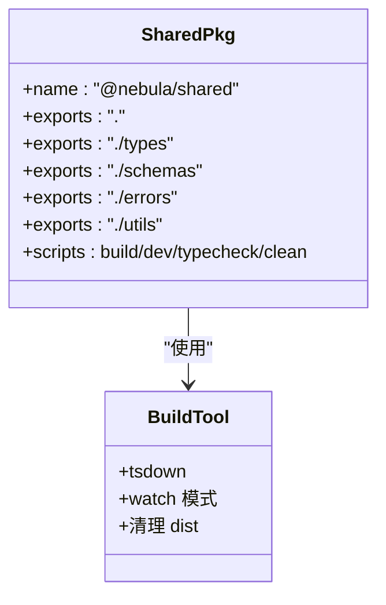
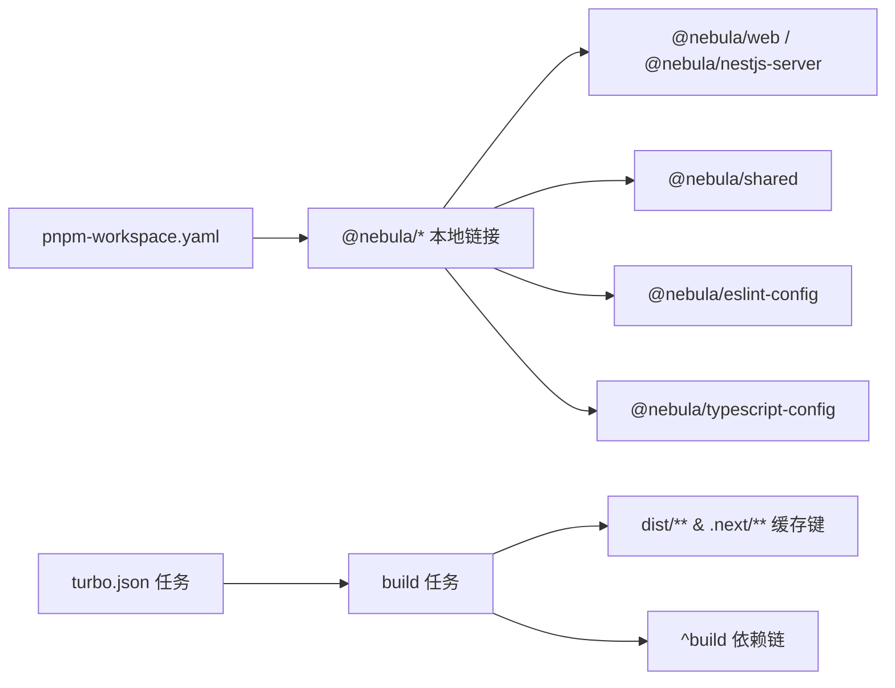

# Monorepo 架构

<cite>
**本文引用的文件**
- [pnpm-workspace.yaml](file://pnpm-workspace.yaml)
- [turbo.json](file://turbo.json)
- [package.json](file://package.json)
- [packages/eslint-config/package.json](file://packages/eslint-config/package.json)
- [packages/eslint-config/base.js](file://packages/eslint-config/base.js)
- [packages/eslint-config/nestjs.js](file://packages/eslint-config/nestjs.js)
- [packages/eslint-config/react.js](file://packages/eslint-config/react.js)
- [packages/typescript-config/package.json](file://packages/typescript-config/package.json)
- [packages/typescript-config/base.json](file://packages/typescript-config/base.json)
- [packages/typescript-config/nestjs.json](file://packages/typescript-config/nestjs.json)
- [packages/typescript-config/react.json](file://packages/typescript-config/react.json)
- [packages/shared/package.json](file://packages/shared/package.json)
- [apps/nestjs-server/package.json](file://apps/nestjs-server/package.json)
- [apps/nestjs-server/nest-cli.json](file://apps/nestjs-server/nest-cli.json)
- [apps/nestjs-server/tsconfig.json](file://apps/nestjs-server/tsconfig.json)
- [apps/nestjs-server/prisma.config.ts](file://apps/nestjs-server/prisma.config.ts)
- [apps/web/package.json](file://apps/web/package.json)
- [apps/web/vite.config.ts](file://apps/web/vite.config.ts)
</cite>

## 目录
1. [引言](#引言)
2. [项目结构](#项目结构)
3. [核心组件](#核心组件)
4. [架构总览](#架构总览)
5. [详细组件分析](#详细组件分析)
6. [依赖关系分析](#依赖关系分析)
7. [性能考量](#性能考量)
8. [故障排查指南](#故障排查指南)
9. [结论](#结论)
10. [附录](#附录)

## 引言
本文件系统性梳理该 Monorepo 的工程化体系，重点围绕 pnpm workspace 的包发现与版本策略、Turbo 构建与缓存机制展开，同时结合 ESLint 与 TypeScript 配置包在多包场景下的复用方式，帮助读者快速理解并落地高效的多包协作流程。

## 项目结构
仓库采用“根目录 + 多包”的组织方式，核心由以下部分组成：
- 根级工作区配置：定义包扫描范围与需要单独构建的依赖白名单
- 根级脚本与工具：统一通过 Turbo 管理任务流，借助 Prettier 统一格式化
- 应用层（apps）：包含前端 Web 应用与后端 NestJS 服务
- 共享包（packages）：提供可复用的 ESLint 规则、TypeScript 配置与通用库

图表来源
- [pnpm-workspace.yaml:1-12](file://pnpm-workspace.yaml#L1-L12)
- [package.json:1-22](file://package.json#L1-L22)
- [apps/web/package.json:1-44](file://apps/web/package.json#L1-L44)
- [apps/nestjs-server/package.json:1-85](file://apps/nestjs-server/package.json#L1-L85)
- [packages/eslint-config/package.json:1-23](file://packages/eslint-config/package.json#L1-L23)
- [packages/typescript-config/package.json:1-11](file://packages/typescript-config/package.json#L1-L11)
- [packages/shared/package.json:1-80](file://packages/shared/package.json#L1-L80)

章节来源
- [pnpm-workspace.yaml:1-12](file://pnpm-workspace.yaml#L1-L12)
- [package.json:1-22](file://package.json#L1-L22)

## 核心组件
- pnpm workspace：统一包发现与链接，支持 workspace:* 版本策略，减少重复安装
- Turbo：统一的任务编排、增量构建与缓存，按任务粒度控制依赖链与输出产物
- ESLint 配置包：提供 base、nestjs、react 三套规则集，供不同应用复用
- TypeScript 配置包：提供 base、nestjs、react 三套 tsconfig，确保类型检查一致性
- 共享库包：以多入口导出形式提供通用类型、校验、工具模块，供前后端复用

章节来源
- [pnpm-workspace.yaml:1-12](file://pnpm-workspace.yaml#L1-L12)
- [turbo.json:1-26](file://turbo.json#L1-L26)
- [packages/eslint-config/package.json:1-23](file://packages/eslint-config/package.json#L1-L23)
- [packages/typescript-config/package.json:1-11](file://packages/typescript-config/package.json#L1-L11)
- [packages/shared/package.json:1-80](file://packages/shared/package.json#L1-L80)

## 架构总览
下图展示 Monorepo 的整体运行时视图：根脚本通过 Turbo 调度各任务；应用层根据各自配置进行构建/开发；共享包为应用提供统一的编码规范与基础能力。

图表来源
- [package.json:5-14](file://package.json#L5-L14)
- [turbo.json:3-24](file://turbo.json#L3-L24)
- [pnpm-workspace.yaml:1-12](file://pnpm-workspace.yaml#L1-L12)
- [apps/web/package.json:14-12](file://apps/web/package.json#L14-L12)
- [apps/nestjs-server/package.json:58-62](file://apps/nestjs-server/package.json#L58-L62)
- [packages/eslint-config/package.json:6-10](file://packages/eslint-config/package.json#L6-L10)
- [packages/typescript-config/package.json:5-9](file://packages/typescript-config/package.json#L5-L9)
- [packages/shared/package.json:6-56](file://packages/shared/package.json#L6-L56)

## 详细组件分析

### pnpm workspace 配置与包发现
- 包扫描范围：通过通配符匹配 apps/* 与 packages/*，自动纳入工作区
- 仅构建依赖：对特定二进制或原生依赖（如数据库驱动、Prisma 引擎等）启用 onlyBuiltDependencies，避免重复安装与跨平台兼容问题
- 版本策略：应用与共享包普遍使用 workspace:*，实现本地开发时的即时同步与最小化锁文件体积

图表来源
- [pnpm-workspace.yaml:1-12](file://pnpm-workspace.yaml#L1-L12)

章节来源
- [pnpm-workspace.yaml:1-12](file://pnpm-workspace.yaml#L1-L12)

### Turbo 任务编排与缓存策略
- 任务定义：build、dev、lint、typecheck、test、clean 等
- 依赖链：当前任务 dependsOn 上游任务（如 build 依赖 ^build），确保拓扑有序
- 输出声明：build 声明 dist/** 与 .next/**，作为缓存命中依据
- 行为特性：dev 任务禁用缓存并持久化，保证开发体验；clean 明确不缓存
- 根脚本：通过 npm scripts 将任务委派给 Turbo，支持按过滤器定向运行

图表来源
- [package.json:5-14](file://package.json#L5-L14)
- [turbo.json:3-24](file://turbo.json#L3-L24)

章节来源
- [turbo.json:1-26](file://turbo.json#L1-L26)
- [package.json:5-14](file://package.json#L5-L14)

### ESLint 配置包（多入口导出）
- 导出结构：以多子路径导出 base、nestjs、react 三套配置，便于按需引入
- 规则集：基于推荐规则与 Prettier 接入，统一风格与质量基线
- 应用集成：应用通过 workspace:* 引入对应导出，避免重复维护

图表来源
- [packages/eslint-config/package.json:6-10](file://packages/eslint-config/package.json#L6-L10)
- [packages/eslint-config/base.js:6-28](file://packages/eslint-config/base.js#L6-L28)
- [packages/eslint-config/nestjs.js:5-16](file://packages/eslint-config/nestjs.js#L5-L16)
- [packages/eslint-config/react.js:5-14](file://packages/eslint-config/react.js#L5-L14)

章节来源
- [packages/eslint-config/package.json:1-23](file://packages/eslint-config/package.json#L1-L23)
- [packages/eslint-config/base.js:1-30](file://packages/eslint-config/base.js#L1-L30)
- [packages/eslint-config/nestjs.js:1-17](file://packages/eslint-config/nestjs.js#L1-L17)
- [packages/eslint-config/react.js:1-15](file://packages/eslint-config/react.js#L1-L15)

### TypeScript 配置包（多入口导出）
- 导出结构：base.json、nestjs.json、react.json，均通过 extends 继承基础配置
- 适用场景：Node 后端、React 前端以及通用基础配置
- 应用集成：应用 tsconfig.extends 指向对应配置，确保一致的编译行为与严格性

图表来源
- [packages/typescript-config/base.json:1-23](file://packages/typescript-config/base.json#L1-L23)
- [packages/typescript-config/nestjs.json:1-15](file://packages/typescript-config/nestjs.json#L1-L15)
- [packages/typescript-config/react.json:1-11](file://packages/typescript-config/react.json#L1-L11)

章节来源
- [packages/typescript-config/package.json:1-11](file://packages/typescript-config/package.json#L1-L11)
- [packages/typescript-config/base.json:1-23](file://packages/typescript-config/base.json#L1-L23)
- [packages/typescript-config/nestjs.json:1-15](file://packages/typescript-config/nestjs.json#L1-L15)
- [packages/typescript-config/react.json:1-11](file://packages/typescript-config/react.json#L1-L11)

### 共享库包（多入口导出与构建）
- 多入口导出：index、types、schemas、errors、utils 等子路径，分别提供不同维度的 API
- 构建工具：使用 tsdown 进行打包，支持 ESM/CJS 与类型声明输出
- 应用集成：通过 workspace:* 引入，形成统一的业务与工具抽象

图表来源
- [packages/shared/package.json:6-68](file://packages/shared/package.json#L6-L68)

章节来源
- [packages/shared/package.json:1-80](file://packages/shared/package.json#L1-L80)

### 应用层配置要点

#### Web 应用（Vite + React）
- 代理与端口：本地开发通过 Vite 代理到后端服务端口，提升联调效率
- 路径别名：@ 指向 src，简化导入路径
- 依赖复用：共享库与 ESLint/TS 配置通过 workspace:* 引入

章节来源
- [apps/web/vite.config.ts:1-23](file://apps/web/vite.config.ts#L1-L23)
- [apps/web/package.json:14-32](file://apps/web/package.json#L14-L32)

#### NestJS 服务（Nest + Prisma）
- CLI 与编译：通过 nest-cli.json 定义源码根与输出目录
- 类型检查：继承共享 TS 配置，统一严格性
- 数据迁移：通过 prisma.config.ts 配置 schema、migrations 与种子脚本

章节来源
- [apps/nestjs-server/nest-cli.json:1-9](file://apps/nestjs-server/nest-cli.json#L1-L9)
- [apps/nestjs-server/tsconfig.json:1-16](file://apps/nestjs-server/tsconfig.json#L1-L16)
- [apps/nestjs-server/prisma.config.ts:1-14](file://apps/nestjs-server/prisma.config.ts#L1-L14)
- [apps/nestjs-server/package.json:58-62](file://apps/nestjs-server/package.json#L58-L62)

## 依赖关系分析
- 包发现与链接：pnpm-workspace.yaml 决定哪些包参与工作区，workspace:* 使应用与共享包之间形成本地链接
- 任务依赖：turbo.json 中的 dependsOn 形成拓扑顺序，build 依赖上游包的构建产物
- 输出缓存：build 任务声明 dist/** 与 .next/**，作为缓存键的一部分，避免不必要的重算
- 开发体验：dev 任务禁用缓存并持久化，提高迭代速度

图表来源
- [pnpm-workspace.yaml:1-12](file://pnpm-workspace.yaml#L1-L12)
- [turbo.json:3-24](file://turbo.json#L3-L24)
- [apps/web/package.json:14-12](file://apps/web/package.json#L14-L12)
- [apps/nestjs-server/package.json:58-62](file://apps/nestjs-server/package.json#L58-L62)
- [packages/shared/package.json:6-68](file://packages/shared/package.json#L6-L68)

章节来源
- [pnpm-workspace.yaml:1-12](file://pnpm-workspace.yaml#L1-L12)
- [turbo.json:3-24](file://turbo.json#L3-L24)

## 性能考量
- 增量构建：Turbo 基于任务输出与输入变更判断是否跳过，显著缩短本地与 CI 时间
- 并行执行：在满足依赖约束的前提下，尽可能并行执行独立任务
- 仅构建依赖：通过 onlyBuiltDependencies 减少跨平台二进制的重复安装成本
- 类型检查：将 typecheck 与 lint 作为独立任务，避免与构建强耦合，提升反馈速度
- 开发模式：dev 任务禁用缓存并持久化，确保热更新与调试体验

## 故障排查指南
- 依赖未解析或版本冲突
  - 确认 pnpm-workspace.yaml 的包扫描范围是否覆盖目标包
  - 检查 workspace:* 是否正确指向共享包
- 构建缓存异常
  - 清理缓存后重试，确认 turbo.json 的输出声明是否与实际产物一致
- 开发代理失效
  - 检查 Vite 代理配置与后端服务端口是否一致
- 类型检查失败
  - 确认应用 tsconfig.extends 是否正确指向共享 TS 配置
- ESLint 报错
  - 检查应用是否正确引入对应导出（base/nestjs/react）

章节来源
- [pnpm-workspace.yaml:1-12](file://pnpm-workspace.yaml#L1-L12)
- [turbo.json:3-24](file://turbo.json#L3-L24)
- [apps/web/vite.config.ts:13-21](file://apps/web/vite.config.ts#L13-L21)
- [apps/nestjs-server/tsconfig.json:1-2](file://apps/nestjs-server/tsconfig.json#L1-L2)
- [packages/eslint-config/package.json:6-10](file://packages/eslint-config/package.json#L6-L10)

## 结论
该 Monorepo 通过 pnpm workspace 与 Turbo 的组合，实现了清晰的包发现、版本共享与高效构建。配合多入口导出的 ESLint 与 TypeScript 配置包，以及共享库包，显著降低了重复配置成本，提升了团队协作效率。建议在持续演进中完善任务粒度划分与缓存策略，进一步优化开发与 CI 体验。

## 附录
- 使用指南（示例命令）
  - 全量构建：执行根脚本中的 build
  - 分别启动前端与后端：使用 dev:web 与 dev:server
  - 统一格式化：执行 format
  - 类型检查与 Lint：分别执行 typecheck 与 lint
  - 单测与覆盖率：执行 test
  - 清理缓存与产物：执行 clean

章节来源
- [package.json:5-14](file://package.json#L5-L14)