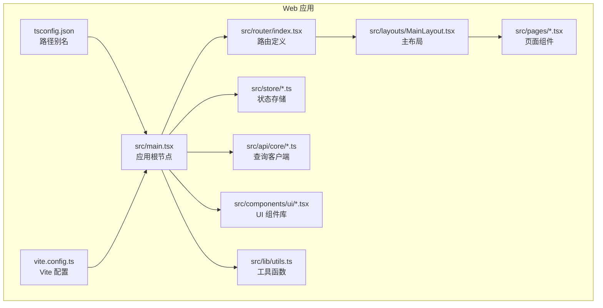
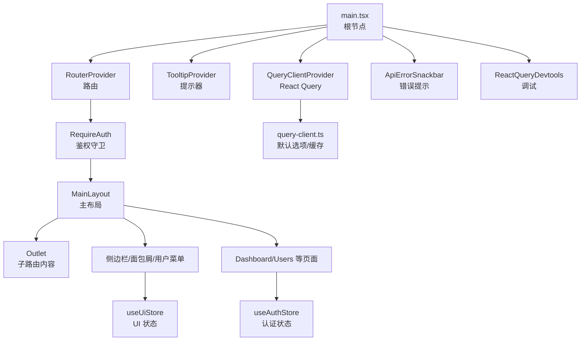
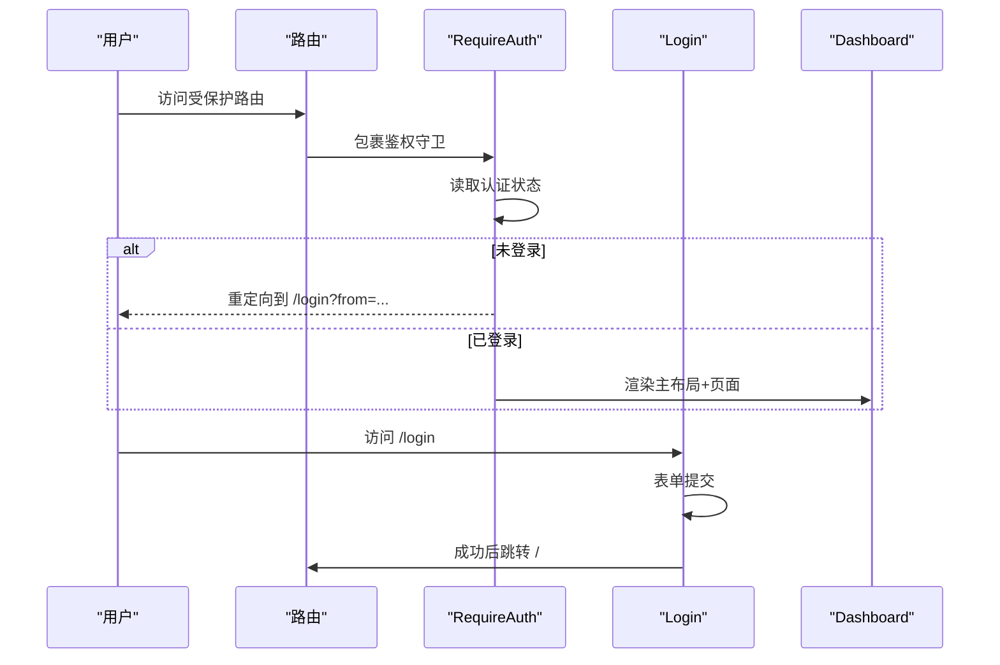
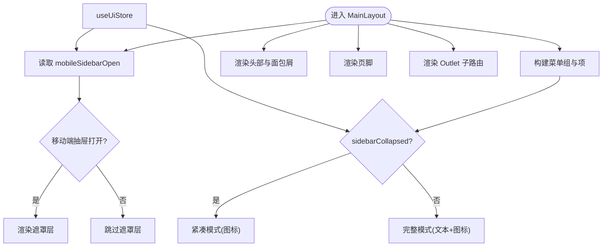
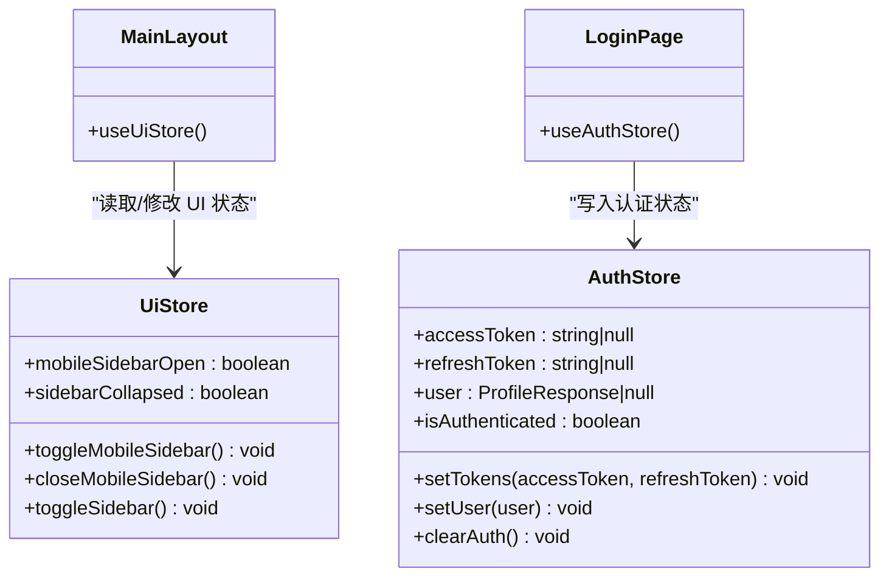
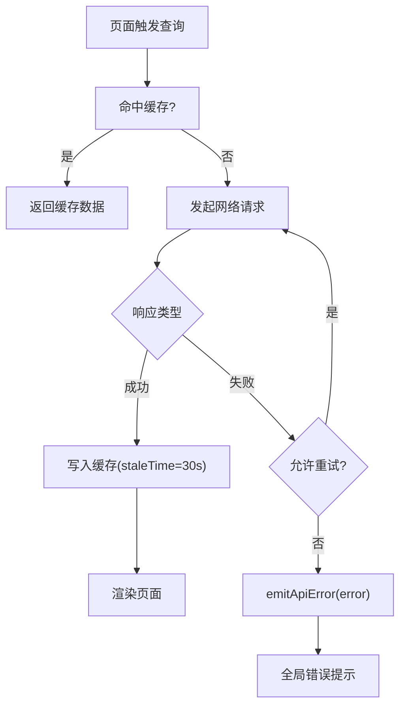
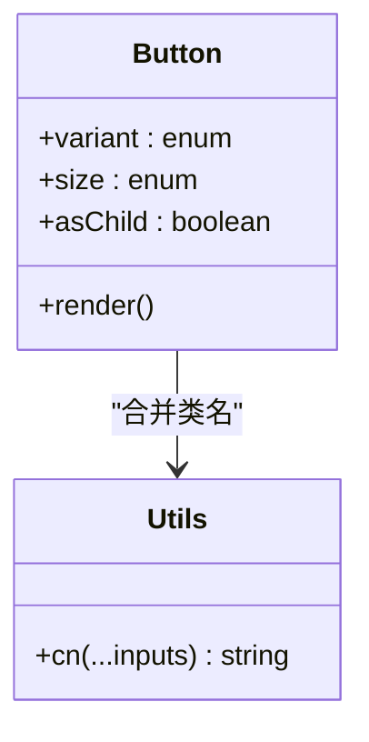
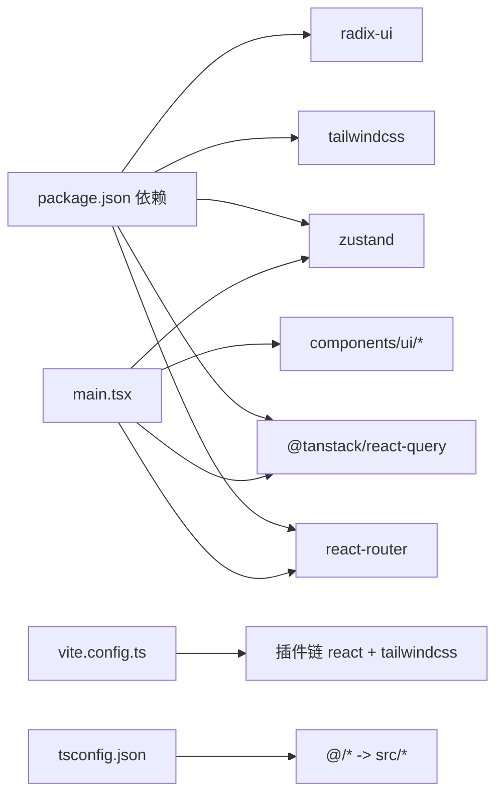

# 前端架构

<cite>
**本文引用的文件**
- [vite.config.ts](file://apps/web/vite.config.ts)
- [main.tsx](file://apps/web/src/main.tsx)
- [router/index.tsx](file://apps/web/src/router/index.tsx)
- [store/index.ts](file://apps/web/src/store/index.ts)
- [store/auth.ts](file://apps/web/src/store/auth.ts)
- [store/ui.ts](file://apps/web/src/store/ui.ts)
- [api/core/query-client.ts](file://apps/web/src/api/core/query-client.ts)
- [layouts/MainLayout.tsx](file://apps/web/src/layouts/MainLayout.tsx)
- [components/RequireAuth.tsx](file://apps/web/src/components/RequireAuth.tsx)
- [pages/Dashboard.tsx](file://apps/web/src/pages/Dashboard.tsx)
- [pages/Login.tsx](file://apps/web/src/pages/Login.tsx)
- [components/ui/button.tsx](file://apps/web/src/components/ui/button.tsx)
- [lib/utils.ts](file://apps/web/src/lib/utils.ts)
- [tsconfig.json](file://apps/web/tsconfig.json)
- [package.json](file://apps/web/package.json)
</cite>

## 目录

1. [引言](#引言)
2. [项目结构](#项目结构)
3. [核心组件](#核心组件)
4. [架构总览](#架构总览)
5. [组件详解](#组件详解)
6. [依赖关系分析](#依赖关系分析)
7. [性能考量](#性能考量)
8. [故障排查指南](#故障排查指南)
9. [结论](#结论)
10. [附录](#附录)

## 引言

本文件面向 React 19 应用的前端架构，系统性梳理应用的目录结构、路由体系、布局模式、状态管理、数据流与构建配置。文档同时总结组件设计模式、生命周期与事件处理最佳实践，并提供可落地的性能优化建议与排障指引。

## 项目结构

应用采用“单体前端 + 多模块 API”组织方式，核心入口在 Web 应用，通过别名路径统一导入，配合 Vite 开发服务器与代理，实现与后端 NestJS 服务的联调。

**图示来源**

- [main.tsx:1-23](file://apps/web/src/main.tsx#L1-L23)
- [router/index.tsx:1-51](file://apps/web/src/router/index.tsx#L1-L51)
- [layouts/MainLayout.tsx:1-317](file://apps/web/src/layouts/MainLayout.tsx#L1-L317)
- [store/index.ts:1-3](file://apps/web/src/store/index.ts#L1-L3)
- [api/core/query-client.ts:1-32](file://apps/web/src/api/core/query-client.ts#L1-L32)
- [components/ui/button.tsx:1-68](file://apps/web/src/components/ui/button.tsx#L1-L68)
- [lib/utils.ts:1-7](file://apps/web/src/lib/utils.ts#L1-L7)
- [tsconfig.json:1-15](file://apps/web/tsconfig.json#L1-L15)
- [vite.config.ts:1-23](file://apps/web/vite.config.ts#L1-L23)

**章节来源**

- [main.tsx:1-23](file://apps/web/src/main.tsx#L1-L23)
- [router/index.tsx:1-51](file://apps/web/src/router/index.tsx#L1-L51)
- [layouts/MainLayout.tsx:1-317](file://apps/web/src/layouts/MainLayout.tsx#L1-L317)
- [store/index.ts:1-3](file://apps/web/src/store/index.ts#L1-L3)
- [api/core/query-client.ts:1-32](file://apps/web/src/api/core/query-client.ts#L1-L32)
- [components/ui/button.tsx:1-68](file://apps/web/src/components/ui/button.tsx#L1-L68)
- [lib/utils.ts:1-7](file://apps/web/src/lib/utils.ts#L1-L7)
- [tsconfig.json:1-15](file://apps/web/tsconfig.json#L1-L15)
- [vite.config.ts:1-23](file://apps/web/vite.config.ts#L1-L23)

## 核心组件

- 应用根节点与 Provider 层
  - 在根节点集中注入查询客户端、提示器上下文、路由提供者与错误提示组件，并开启查询调试工具。
  - 参考路径：[main.tsx:1-23](file://apps/web/src/main.tsx#L1-L23)
- 路由与鉴权守卫
  - 使用浏览器路由，顶层登录页直出；受保护路由通过鉴权守卫包裹，未登录自动跳转登录页。
  - 参考路径：[router/index.tsx:1-51](file://apps/web/src/router/index.tsx#L1-L51)、[components/RequireAuth.tsx:1-14](file://apps/web/src/components/RequireAuth.tsx#L1-L14)
- 主布局与导航
  - 提供响应式侧边栏、面包屑、用户下拉菜单与内容区 Outlet；支持移动端抽屉与桌面端折叠。
  - 参考路径：[layouts/MainLayout.tsx:1-317](file://apps/web/src/layouts/MainLayout.tsx#L1-L317)
- 状态管理
  - 认证状态使用 Zustand + devtools + persist 存储令牌与用户信息；UI 状态（侧边栏、移动端抽屉）同样使用 Zustand。
  - 参考路径：[store/auth.ts:1-64](file://apps/web/src/store/auth.ts#L1-L64)、[store/ui.ts:1-43](file://apps/web/src/store/ui.ts#L1-L43)、[store/index.ts:1-3](file://apps/web/src/store/index.ts#L1-L3)
- 数据流与缓存
  - React Query 作为统一数据层，默认重试策略、过期时间与窗口焦点行为已配置；全局错误通过 Snackbar 统一上报。
  - 参考路径：[api/core/query-client.ts:1-32](file://apps/web/src/api/core/query-client.ts#L1-L32)
- UI 组件与样式
  - 基于 class-variance-authority 的按钮变体系统，结合 Tailwind 与 clsx/tailwind-merge 实现可组合样式。
  - 参考路径：[components/ui/button.tsx:1-68](file://apps/web/src/components/ui/button.tsx#L1-L68)、[lib/utils.ts:1-7](file://apps/web/src/lib/utils.ts#L1-L7)
- 构建与开发环境
  - Vite 插件链含 React 与 TailwindCSS；路径别名 @ 指向 src；开发服务器端口 5173 并代理 /api 到后端 3000。
  - 参考路径：[vite.config.ts:1-23](file://apps/web/vite.config.ts#L1-L23)、[tsconfig.json:1-15](file://apps/web/tsconfig.json#L1-L15)、[package.json:1-44](file://apps/web/package.json#L1-L44)

**章节来源**

- [main.tsx:1-23](file://apps/web/src/main.tsx#L1-L23)
- [router/index.tsx:1-51](file://apps/web/src/router/index.tsx#L1-L51)
- [components/RequireAuth.tsx:1-14](file://apps/web/src/components/RequireAuth.tsx#L1-L14)
- [layouts/MainLayout.tsx:1-317](file://apps/web/src/layouts/MainLayout.tsx#L1-L317)
- [store/auth.ts:1-64](file://apps/web/src/store/auth.ts#L1-L64)
- [store/ui.ts:1-43](file://apps/web/src/store/ui.ts#L1-L43)
- [store/index.ts:1-3](file://apps/web/src/store/index.ts#L1-L3)
- [api/core/query-client.ts:1-32](file://apps/web/src/api/core/query-client.ts#L1-L32)
- [components/ui/button.tsx:1-68](file://apps/web/src/components/ui/button.tsx#L1-L68)
- [lib/utils.ts:1-7](file://apps/web/src/lib/utils.ts#L1-L7)
- [vite.config.ts:1-23](file://apps/web/vite.config.ts#L1-L23)
- [tsconfig.json:1-15](file://apps/web/tsconfig.json#L1-L15)
- [package.json:1-44](file://apps/web/package.json#L1-L44)

## 架构总览

应用采用“路由驱动 + 查询客户端 + 轻量状态”的前端架构，强调：

- 路由分层：登录直出、受保护路由通过守卫；主布局承载导航与内容区。
- 状态分层：认证状态持久化，UI 状态轻量化；页面组件专注展示与交互。
- 数据层：React Query 统一管理请求、缓存与错误；API 错误通过全局 Snackbar 上报。
- 样式与组件：基于变体系统的 UI 组件，统一风格与可维护性。

**图示来源**

- [main.tsx:1-23](file://apps/web/src/main.tsx#L1-L23)
- [router/index.tsx:1-51](file://apps/web/src/router/index.tsx#L1-L51)
- [components/RequireAuth.tsx:1-14](file://apps/web/src/components/RequireAuth.tsx#L1-L14)
- [layouts/MainLayout.tsx:1-317](file://apps/web/src/layouts/MainLayout.tsx#L1-L317)
- [api/core/query-client.ts:1-32](file://apps/web/src/api/core/query-client.ts#L1-L32)
- [store/auth.ts:1-64](file://apps/web/src/store/auth.ts#L1-L64)
- [store/ui.ts:1-43](file://apps/web/src/store/ui.ts#L1-L43)

## 组件详解

### 路由与鉴权流程

- 流程说明
  - 用户访问受保护路由时，鉴权守卫读取认证状态；若未登录则重定向至登录页并携带来源位置。
  - 登录成功后清除表单状态并跳转首页。
- 关键点
  - 路由定义集中于路由器文件；登录页独立直出，避免被守卫拦截。
  - 页面组件通过 React Query Hooks 获取数据，统一错误处理。

**图示来源**

- [router/index.tsx:1-51](file://apps/web/src/router/index.tsx#L1-L51)
- [components/RequireAuth.tsx:1-14](file://apps/web/src/components/RequireAuth.tsx#L1-L14)
- [pages/Login.tsx:1-221](file://apps/web/src/pages/Login.tsx#L1-L221)

**章节来源**

- [router/index.tsx:1-51](file://apps/web/src/router/index.tsx#L1-L51)
- [components/RequireAuth.tsx:1-14](file://apps/web/src/components/RequireAuth.tsx#L1-L14)
- [pages/Login.tsx:1-221](file://apps/web/src/pages/Login.tsx#L1-L221)

### 主布局与导航

- 功能要点
  - 响应式侧边栏：桌面端可折叠，移动端抽屉滑入；面包屑根据路径映射显示。
  - 用户菜单：展示头像与基本信息，提供退出登录动作。
  - 内容区：Outlet 承载子路由页面。
- 状态联动
  - UI 状态（移动端抽屉开关、侧边栏折叠）通过 UI Store 控制；认证状态用于用户菜单渲染。

**图示来源**

- [layouts/MainLayout.tsx:1-317](file://apps/web/src/layouts/MainLayout.tsx#L1-L317)
- [store/ui.ts:1-43](file://apps/web/src/store/ui.ts#L1-L43)

**章节来源**

- [layouts/MainLayout.tsx:1-317](file://apps/web/src/layouts/MainLayout.tsx#L1-L317)
- [store/ui.ts:1-43](file://apps/web/src/store/ui.ts#L1-L43)

### 状态管理策略

- 认证状态（Zustand）
  - 存储访问令牌、刷新令牌、用户信息与登录态；支持持久化与水合逻辑。
  - 提供设置令牌、设置用户、清理认证等动作。
- UI 状态（Zustand）
  - 移动端抽屉开关、侧边栏折叠状态；动作包括切换与关闭。
- 导出聚合
  - 通过 store/index.ts 汇总导出，便于页面组件按需引入。

**图示来源**

- [store/auth.ts:1-64](file://apps/web/src/store/auth.ts#L1-L64)
- [store/ui.ts:1-43](file://apps/web/src/store/ui.ts#L1-L43)
- [layouts/MainLayout.tsx:1-317](file://apps/web/src/layouts/MainLayout.tsx#L1-L317)
- [pages/Login.tsx:1-221](file://apps/web/src/pages/Login.tsx#L1-L221)

**章节来源**

- [store/auth.ts:1-64](file://apps/web/src/store/auth.ts#L1-L64)
- [store/ui.ts:1-43](file://apps/web/src/store/ui.ts#L1-L43)
- [store/index.ts:1-3](file://apps/web/src/store/index.ts#L1-L3)

### 数据流与查询缓存

- 默认策略
  - 查询：最多重试 2 次；当业务错误为未授权时禁用重试；缓存 30 秒；窗口聚焦不自动刷新。
  - 变更：不重试。
- 全局错误
  - 查询与变更错误均通过统一事件通道上报至错误提示组件。
- 页面示例
  - 仪表盘页面使用多个查询钩子，分别处理加载、错误与渲染分支。

**图示来源**

- [api/core/query-client.ts:1-32](file://apps/web/src/api/core/query-client.ts#L1-L32)
- [pages/Dashboard.tsx:1-205](file://apps/web/src/pages/Dashboard.tsx#L1-L205)

**章节来源**

- [api/core/query-client.ts:1-32](file://apps/web/src/api/core/query-client.ts#L1-L32)
- [pages/Dashboard.tsx:1-205](file://apps/web/src/pages/Dashboard.tsx#L1-L205)

### 组件设计模式与样式系统

- 按钮变体系统
  - 基于 class-variance-authority 定义变体与尺寸，结合 radix slot 支持语义化渲染。
- 样式合并
  - 使用 clsx 与 tailwind-merge 合理合并类名，避免冲突与重复。
- 路径别名
  - tsconfig 中配置 @/_ 指向 src/_，提升导入可读性与一致性。

**图示来源**

- [components/ui/button.tsx:1-68](file://apps/web/src/components/ui/button.tsx#L1-L68)
- [lib/utils.ts:1-7](file://apps/web/src/lib/utils.ts#L1-L7)

**章节来源**

- [components/ui/button.tsx:1-68](file://apps/web/src/components/ui/button.tsx#L1-L68)
- [lib/utils.ts:1-7](file://apps/web/src/lib/utils.ts#L1-L7)
- [tsconfig.json:1-15](file://apps/web/tsconfig.json#L1-L15)

## 依赖关系分析

- 模块耦合
  - 路由与布局解耦：布局仅依赖 UI 状态与认证状态，不直接依赖具体页面。
  - 页面组件通过查询钩子与状态钩子与数据层交互，职责清晰。
- 外部依赖
  - React 19、React Router 7、React Query 5、Zustand、TailwindCSS、Radix UI 等。
- 构建与开发
  - Vite 提供热更新与代理；TypeScript 路径别名与严格类型检查保障可维护性。

**图示来源**

- [package.json:1-44](file://apps/web/package.json#L1-L44)
- [vite.config.ts:1-23](file://apps/web/vite.config.ts#L1-L23)
- [tsconfig.json:1-15](file://apps/web/tsconfig.json#L1-L15)
- [main.tsx:1-23](file://apps/web/src/main.tsx#L1-L23)

**章节来源**

- [package.json:1-44](file://apps/web/package.json#L1-L44)
- [vite.config.ts:1-23](file://apps/web/vite.config.ts#L1-L23)
- [tsconfig.json:1-15](file://apps/web/tsconfig.json#L1-L15)
- [main.tsx:1-23](file://apps/web/src/main.tsx#L1-L23)

## 性能考量

- 查询缓存与重试
  - 合理的 staleTime 与重试次数减少无效请求；对未授权错误禁用重试，避免循环。
- 窗口聚焦策略
  - 关闭窗口聚焦自动刷新，降低后台标签页资源消耗。
- 组件渲染
  - 使用 useMemo 优化复杂计算与 HTML 片段渲染；按钮变体系统减少重复样式判断。
- 样式体积
  - TailwindCSS 按需引入与合并类名，避免无用样式打包。
- 构建优化
  - 生产构建先执行类型检查再打包，确保产物稳定性。

**章节来源**

- [api/core/query-client.ts:1-32](file://apps/web/src/api/core/query-client.ts#L1-L32)
- [pages/Login.tsx:1-221](file://apps/web/src/pages/Login.tsx#L1-L221)
- [components/ui/button.tsx:1-68](file://apps/web/src/components/ui/button.tsx#L1-L68)
- [package.json:1-44](file://apps/web/package.json#L1-L44)

## 故障排查指南

- 登录失败
  - 检查验证码 ID 是否存在；确认表单字段与自动填充属性；观察登录变更的错误状态。
  - 参考路径：[pages/Login.tsx:1-221](file://apps/web/src/pages/Login.tsx#L1-L221)
- 未登录跳转
  - 确认鉴权守卫是否正确读取认证状态；检查登录成功后是否调用了设置令牌与用户信息的动作。
  - 参考路径：[components/RequireAuth.tsx:1-14](file://apps/web/src/components/RequireAuth.tsx#L1-L14)、[store/auth.ts:1-64](file://apps/web/src/store/auth.ts#L1-L64)
- API 错误提示
  - 若出现全局错误提示，请检查查询/变更错误回调与共享错误事件通道。
  - 参考路径：[api/core/query-client.ts:1-32](file://apps/web/src/api/core/query-client.ts#L1-L32)
- 样式异常
  - 检查路径别名与类名合并函数是否正确；确认 Tailwind 配置与插件版本兼容。
  - 参考路径：[tsconfig.json:1-15](file://apps/web/tsconfig.json#L1-L15)、[lib/utils.ts:1-7](file://apps/web/src/lib/utils.ts#L1-L7)、[vite.config.ts:1-23](file://apps/web/vite.config.ts#L1-L23)

**章节来源**

- [pages/Login.tsx:1-221](file://apps/web/src/pages/Login.tsx#L1-L221)
- [components/RequireAuth.tsx:1-14](file://apps/web/src/components/RequireAuth.tsx#L1-L14)
- [store/auth.ts:1-64](file://apps/web/src/store/auth.ts#L1-L64)
- [api/core/query-client.ts:1-32](file://apps/web/src/api/core/query-client.ts#L1-L32)
- [lib/utils.ts:1-7](file://apps/web/src/lib/utils.ts#L1-L7)
- [tsconfig.json:1-15](file://apps/web/tsconfig.json#L1-L15)
- [vite.config.ts:1-23](file://apps/web/vite.config.ts#L1-L23)

## 结论

本项目以 React 19 为基础，结合 React Router 7、React Query 5 与 Zustand，形成“路由驱动 + 查询客户端 + 轻量状态”的清晰架构。通过主布局与 UI Store 实现一致的导航体验，通过查询客户端统一数据流与错误处理。Vite 与 TailwindCSS 提供高效的开发与样式能力。整体设计具备良好的可扩展性与可维护性。

## 附录

- 开发与构建命令
  - 开发：vite
  - 预览：vite preview
  - 类型检查：tsc --noEmit
  - Lint：eslint .
- 关键配置参考
  - Vite 插件与代理：[vite.config.ts:1-23](file://apps/web/vite.config.ts#L1-L23)
  - TypeScript 路径别名：[tsconfig.json:1-15](file://apps/web/tsconfig.json#L1-L15)
  - 依赖与脚本：[package.json:1-44](file://apps/web/package.json#L1-L44)
