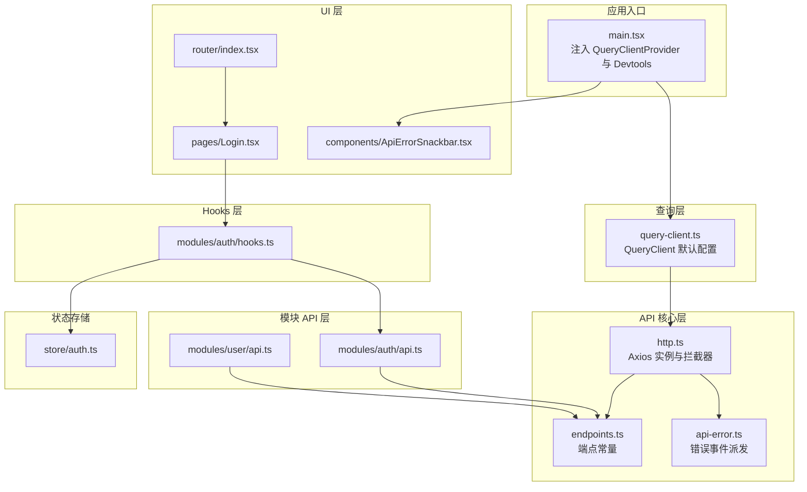
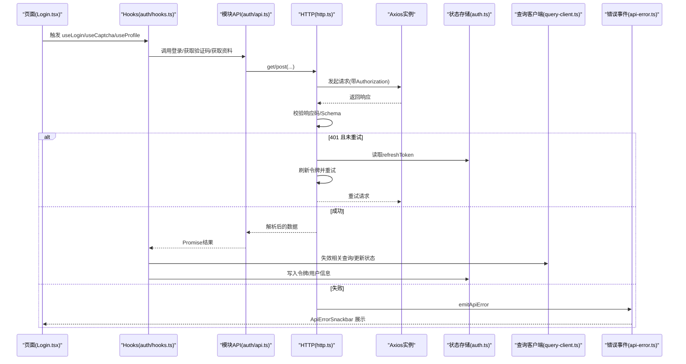
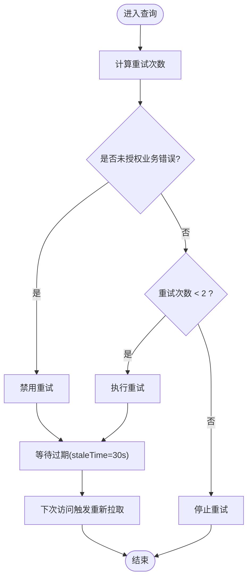
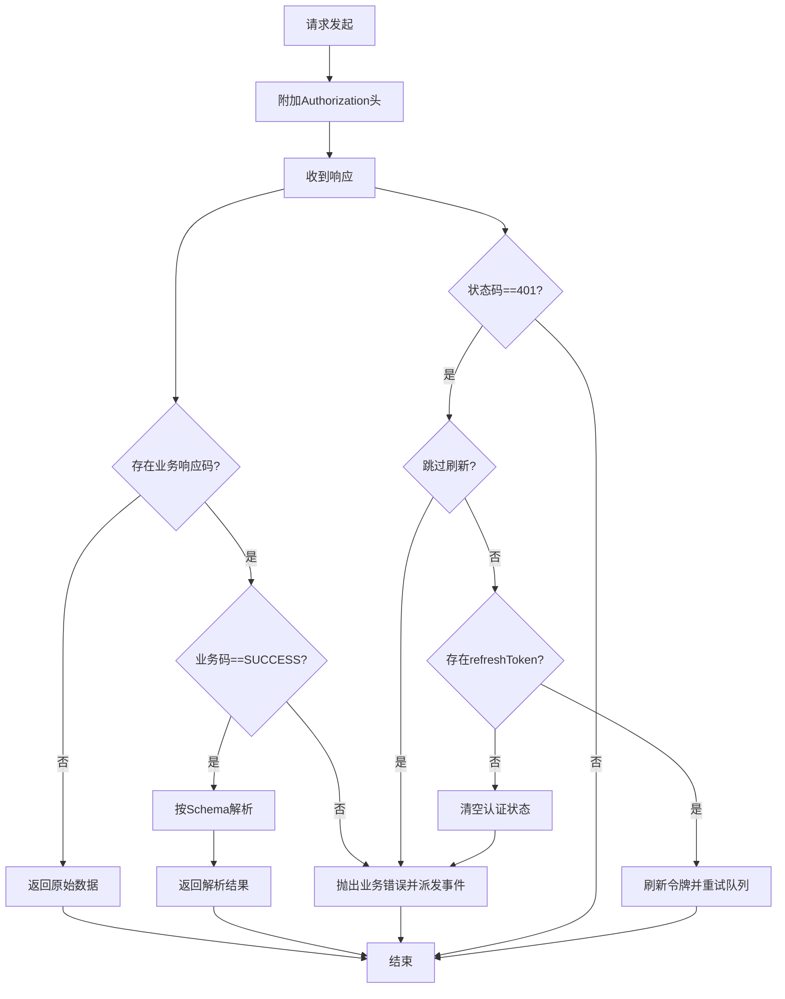
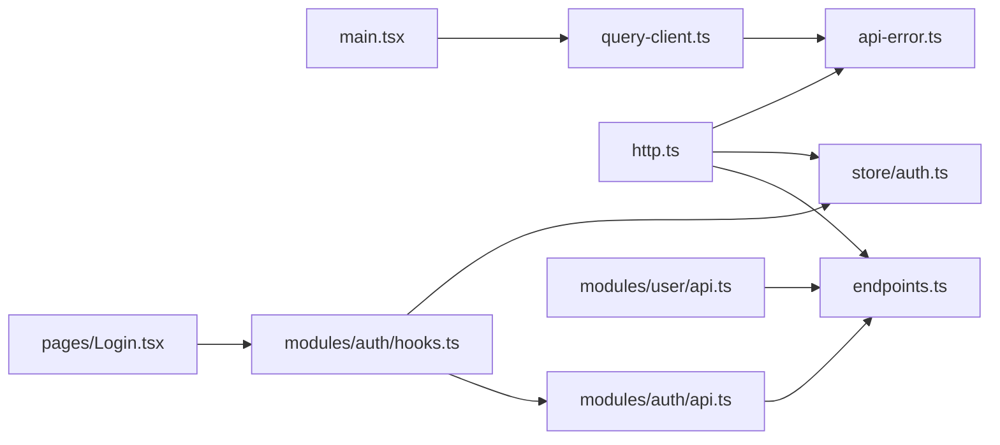

# 数据获取策略

<cite>
**本文引用的文件**
- [apps/web/src/main.tsx](file://apps/web/src/main.tsx)
- [apps/web/src/api/core/query-client.ts](file://apps/web/src/api/core/query-client.ts)
- [apps/web/src/api/core/http.ts](file://apps/web/src/api/core/http.ts)
- [apps/web/src/api/core/endpoints.ts](file://apps/web/src/api/core/endpoints.ts)
- [apps/web/src/api/core/api-error.ts](file://apps/web/src/api/core/api-error.ts)
- [apps/web/src/api/modules/auth/api.ts](file://apps/web/src/api/modules/auth/api.ts)
- [apps/web/src/api/modules/auth/hooks.ts](file://apps/web/src/api/modules/auth/hooks.ts)
- [apps/web/src/api/modules/user/api.ts](file://apps/web/src/api/modules/user/api.ts)
- [apps/web/src/store/auth.ts](file://apps/web/src/store/auth.ts)
- [apps/web/src/pages/Login.tsx](file://apps/web/src/pages/Login.tsx)
- [apps/web/src/components/ApiErrorSnackbar.tsx](file://apps/web/src/components/ApiErrorSnackbar.tsx)
- [apps/web/src/router/index.tsx](file://apps/web/src/router/index.tsx)
- [packages/shared/src/index.ts](file://packages/shared/src/index.ts)
</cite>

## 目录

1. [引言](#引言)
2. [项目结构](#项目结构)
3. [核心组件](#核心组件)
4. [架构总览](#架构总览)
5. [详细组件分析](#详细组件分析)
6. [依赖关系分析](#依赖关系分析)
7. [性能考量](#性能考量)
8. [故障排查指南](#故障排查指南)
9. [结论](#结论)
10. [附录：最佳实践与示例](#附录最佳实践与示例)

## 引言

本文件系统性梳理前端数据获取策略，围绕 TanStack React Query 的配置与使用、API 客户端设计、请求/响应拦截、缓存与失效、并发与重试、错误处理与离线体验展开，并结合具体页面与模块 Hook 的使用，给出可操作的最佳实践与排障建议。

## 项目结构

前端采用“模块化 API 层 + React Query 查询层 + 页面组件”的分层组织：

- 应用入口通过 Provider 注入 QueryClient，并挂载全局错误提示与开发工具
- API 核心层封装 axios 实例、统一拦截器、端点常量与错误事件派发
- 模块 API 层基于端点常量与 Schema 校验，提供类型安全的 CRUD 方法
- Hooks 层将 API 方法绑定为查询/变更，负责状态启用、失效与副作用
- 认证状态由独立状态存储持久化，驱动查询启用条件与全局失效

图表来源

- [apps/web/src/main.tsx:1-23](file://apps/web/src/main.tsx#L1-L23)
- [apps/web/src/api/core/query-client.ts:1-32](file://apps/web/src/api/core/query-client.ts#L1-L32)
- [apps/web/src/api/core/http.ts:1-236](file://apps/web/src/api/core/http.ts#L1-L236)
- [apps/web/src/api/core/endpoints.ts:1-21](file://apps/web/src/api/core/endpoints.ts#L1-L21)
- [apps/web/src/api/core/api-error.ts:1-45](file://apps/web/src/api/core/api-error.ts#L1-L45)
- [apps/web/src/api/modules/auth/api.ts:1-45](file://apps/web/src/api/modules/auth/api.ts#L1-L45)
- [apps/web/src/api/modules/user/api.ts:1-34](file://apps/web/src/api/modules/user/api.ts#L1-L34)
- [apps/web/src/api/modules/auth/hooks.ts:1-49](file://apps/web/src/api/modules/auth/hooks.ts#L1-L49)
- [apps/web/src/store/auth.ts:1-64](file://apps/web/src/store/auth.ts#L1-L64)
- [apps/web/src/pages/Login.tsx:1-221](file://apps/web/src/pages/Login.tsx#L1-L221)
- [apps/web/src/components/ApiErrorSnackbar.tsx:1-58](file://apps/web/src/components/ApiErrorSnackbar.tsx#L1-L58)
- [apps/web/src/router/index.tsx:1-51](file://apps/web/src/router/index.tsx#L1-L51)

章节来源

- [apps/web/src/main.tsx:1-23](file://apps/web/src/main.tsx#L1-L23)
- [apps/web/src/api/core/query-client.ts:1-32](file://apps/web/src/api/core/query-client.ts#L1-L32)
- [apps/web/src/api/core/http.ts:1-236](file://apps/web/src/api/core/http.ts#L1-L236)
- [apps/web/src/api/core/endpoints.ts:1-21](file://apps/web/src/api/core/endpoints.ts#L1-L21)
- [apps/web/src/api/core/api-error.ts:1-45](file://apps/web/src/api/core/api-error.ts#L1-L45)
- [apps/web/src/api/modules/auth/api.ts:1-45](file://apps/web/src/api/modules/auth/api.ts#L1-L45)
- [apps/web/src/api/modules/user/api.ts:1-34](file://apps/web/src/api/modules/user/api.ts#L1-L34)
- [apps/web/src/api/modules/auth/hooks.ts:1-49](file://apps/web/src/api/modules/auth/hooks.ts#L1-L49)
- [apps/web/src/store/auth.ts:1-64](file://apps/web/src/store/auth.ts#L1-L64)
- [apps/web/src/pages/Login.tsx:1-221](file://apps/web/src/pages/Login.tsx#L1-L221)
- [apps/web/src/components/ApiErrorSnackbar.tsx:1-58](file://apps/web/src/components/ApiErrorSnackbar.tsx#L1-L58)
- [apps/web/src/router/index.tsx:1-51](file://apps/web/src/router/index.tsx#L1-L51)

## 核心组件

- 查询客户端（React Query）
  - 统一默认配置：查询重试策略、过期时间、窗口焦点重拉取开关
  - 全局错误缓存回调：统一派发业务错误
- HTTP 客户端（Axios）
  - 请求头注入令牌、响应统一封装与 Schema 校验
  - 401 自动刷新令牌与重试，失败时抛出业务错误并派发事件
- 端点常量
  - 统一管理 API 前缀与路径，便于集中维护与替换
- 错误事件派发
  - 将错误转换为可监听的自定义事件，UI 可订阅展示
- 模块 API 与 Hooks
  - 类型安全的 CRUD 方法与查询/变更 Hook，配合状态存储驱动启用与失效

章节来源

- [apps/web/src/api/core/query-client.ts:1-32](file://apps/web/src/api/core/query-client.ts#L1-L32)
- [apps/web/src/api/core/http.ts:1-236](file://apps/web/src/api/core/http.ts#L1-L236)
- [apps/web/src/api/core/endpoints.ts:1-21](file://apps/web/src/api/core/endpoints.ts#L1-L21)
- [apps/web/src/api/core/api-error.ts:1-45](file://apps/web/src/api/core/api-error.ts#L1-L45)
- [apps/web/src/api/modules/auth/api.ts:1-45](file://apps/web/src/api/modules/auth/api.ts#L1-L45)
- [apps/web/src/api/modules/auth/hooks.ts:1-49](file://apps/web/src/api/modules/auth/hooks.ts#L1-L49)
- [apps/web/src/store/auth.ts:1-64](file://apps/web/src/store/auth.ts#L1-L64)

## 架构总览

下图展示了从页面到查询层、HTTP 层与状态存储的整体调用链路，以及错误事件在各层的传播路径。

图表来源

- [apps/web/src/pages/Login.tsx:1-221](file://apps/web/src/pages/Login.tsx#L1-L221)
- [apps/web/src/api/modules/auth/hooks.ts:1-49](file://apps/web/src/api/modules/auth/hooks.ts#L1-L49)
- [apps/web/src/api/modules/auth/api.ts:1-45](file://apps/web/src/api/modules/auth/api.ts#L1-L45)
- [apps/web/src/api/core/http.ts:1-236](file://apps/web/src/api/core/http.ts#L1-L236)
- [apps/web/src/store/auth.ts:1-64](file://apps/web/src/store/auth.ts#L1-L64)
- [apps/web/src/api/core/query-client.ts:1-32](file://apps/web/src/api/core/query-client.ts#L1-L32)
- [apps/web/src/api/core/api-error.ts:1-45](file://apps/web/src/api/core/api-error.ts#L1-L45)

## 详细组件分析

### 查询客户端与缓存策略

- 默认查询行为
  - 重试：普通请求最多重试 2 次；当业务错误为未授权时禁用重试
  - 过期时间：默认 30 秒，避免频繁重复请求
  - 窗口焦点重拉取：关闭，减少不必要的网络抖动
- 默认变更行为
  - 默认不重试，避免副作用重复执行
- 全局错误处理
  - 查询/变更错误均通过统一事件派发，便于 UI 一致化提示

图表来源

- [apps/web/src/api/core/query-client.ts:16-30](file://apps/web/src/api/core/query-client.ts#L16-L30)

章节来源

- [apps/web/src/api/core/query-client.ts:1-32](file://apps/web/src/api/core/query-client.ts#L1-L32)

### HTTP 客户端与拦截器

- 请求拦截
  - 从状态存储读取访问令牌，自动附加 Authorization 头
- 响应拦截
  - 对非业务成功码抛出业务错误并派发事件
  - 支持通过 meta.responseSchema 进行响应体 Zod 校验，失败时抛出业务错误
- 401 自动刷新与重试
  - 无重试标记且未跳过刷新时，尝试刷新令牌并排队重试所有等待中的请求
  - 刷新失败则清空认证状态并派发错误
- 超时与基础配置
  - 超时 15 秒，统一 Content-Type

图表来源

- [apps/web/src/api/core/http.ts:94-179](file://apps/web/src/api/core/http.ts#L94-L179)

章节来源

- [apps/web/src/api/core/http.ts:1-236](file://apps/web/src/api/core/http.ts#L1-L236)

### 端点常量与模块 API

- 端点常量
  - 通过环境变量控制基础 URL，集中管理路径，便于切换环境与版本
- 模块 API
  - 基于端点常量与 Zod Schema，提供类型安全的 GET/POST/PATCH/DELETE 方法
  - 所有方法均返回解析后的强类型数据，降低上层判断成本

章节来源

- [apps/web/src/api/core/endpoints.ts:1-21](file://apps/web/src/api/core/endpoints.ts#L1-L21)
- [apps/web/src/api/modules/auth/api.ts:1-45](file://apps/web/src/api/modules/auth/api.ts#L1-L45)
- [apps/web/src/api/modules/user/api.ts:1-34](file://apps/web/src/api/modules/user/api.ts#L1-L34)
- [packages/shared/src/index.ts:1-15](file://packages/shared/src/index.ts#L1-L15)

### Hooks 与状态联动

- 登录/注册/注销/验证码/资料等查询/变更
- 登录成功写入令牌并失效相关查询；注销清理状态并清空缓存
- 资料查询根据是否存在访问令牌启用，避免无效请求

章节来源

- [apps/web/src/api/modules/auth/hooks.ts:1-49](file://apps/web/src/api/modules/auth/hooks.ts#L1-L49)
- [apps/web/src/store/auth.ts:1-64](file://apps/web/src/store/auth.ts#L1-L64)

### 错误事件与 UI 提示

- 错误事件
  - 将业务错误映射为可监听的自定义事件，避免重复通知
- 错误提示组件
  - 订阅错误事件并在 3 秒后自动隐藏，支持手动关闭

章节来源

- [apps/web/src/api/core/api-error.ts:1-45](file://apps/web/src/api/core/api-error.ts#L1-L45)
- [apps/web/src/components/ApiErrorSnackbar.tsx:1-58](file://apps/web/src/components/ApiErrorSnackbar.tsx#L1-L58)

### 页面与路由集成

- 登录页使用验证码查询与登录变更，结合错误提示与路由跳转
- 路由守卫与布局组件确保仅在已认证状态下访问受保护页面

章节来源

- [apps/web/src/pages/Login.tsx:1-221](file://apps/web/src/pages/Login.tsx#L1-L221)
- [apps/web/src/router/index.tsx:1-51](file://apps/web/src/router/index.tsx#L1-L51)

## 依赖关系分析

- 入口依赖
  - main.tsx 依赖 query-client.ts 提供的 QueryClient，并注入 ReactQueryDevtools
- 查询层依赖
  - query-client.ts 依赖 api-error.ts 进行错误事件派发
- API 层依赖
  - http.ts 依赖 endpoints.ts、auth 状态存储与共享错误类型
  - 各模块 API 依赖 endpoints.ts 与共享 Schema
- UI 层依赖
  - 页面与组件依赖 hooks 与错误提示组件

图表来源

- [apps/web/src/main.tsx:1-23](file://apps/web/src/main.tsx#L1-L23)
- [apps/web/src/api/core/query-client.ts:1-32](file://apps/web/src/api/core/query-client.ts#L1-L32)
- [apps/web/src/api/core/http.ts:1-236](file://apps/web/src/api/core/http.ts#L1-L236)
- [apps/web/src/api/core/endpoints.ts:1-21](file://apps/web/src/api/core/endpoints.ts#L1-L21)
- [apps/web/src/api/core/api-error.ts:1-45](file://apps/web/src/api/core/api-error.ts#L1-L45)
- [apps/web/src/api/modules/auth/api.ts:1-45](file://apps/web/src/api/modules/auth/api.ts#L1-L45)
- [apps/web/src/api/modules/user/api.ts:1-34](file://apps/web/src/api/modules/user/api.ts#L1-L34)
- [apps/web/src/api/modules/auth/hooks.ts:1-49](file://apps/web/src/api/modules/auth/hooks.ts#L1-L49)
- [apps/web/src/store/auth.ts:1-64](file://apps/web/src/store/auth.ts#L1-L64)
- [apps/web/src/pages/Login.tsx:1-221](file://apps/web/src/pages/Login.tsx#L1-L221)

章节来源

- [apps/web/src/main.tsx:1-23](file://apps/web/src/main.tsx#L1-L23)
- [apps/web/src/api/core/query-client.ts:1-32](file://apps/web/src/api/core/query-client.ts#L1-L32)
- [apps/web/src/api/core/http.ts:1-236](file://apps/web/src/api/core/http.ts#L1-L236)
- [apps/web/src/api/core/endpoints.ts:1-21](file://apps/web/src/api/core/endpoints.ts#L1-L21)
- [apps/web/src/api/core/api-error.ts:1-45](file://apps/web/src/api/core/api-error.ts#L1-L45)
- [apps/web/src/api/modules/auth/api.ts:1-45](file://apps/web/src/api/modules/auth/api.ts#L1-L45)
- [apps/web/src/api/modules/user/api.ts:1-34](file://apps/web/src/api/modules/user/api.ts#L1-L34)
- [apps/web/src/api/modules/auth/hooks.ts:1-49](file://apps/web/src/api/modules/auth/hooks.ts#L1-L49)
- [apps/web/src/store/auth.ts:1-64](file://apps/web/src/store/auth.ts#L1-L64)
- [apps/web/src/pages/Login.tsx:1-221](file://apps/web/src/pages/Login.tsx#L1-L221)

## 性能考量

- 缓存与过期
  - 通过默认 staleTime 控制缓存新鲜度，避免过度请求
  - 在关键场景（如登录）主动失效相关查询，保证数据一致性
- 并发与去重
  - React Query 默认对相同 queryKey 的并发请求进行去重，减少重复网络开销
- 重试策略
  - 限制最大重试次数，避免雪崩效应；对未授权错误禁用重试，防止无效重放
- 网络超时
  - 合理设置超时，提升用户体验与稳定性

## 故障排查指南

- 401 未授权
  - 检查状态存储中是否存在 refreshToken；若无则需重新登录
  - 若刷新失败，确认服务端令牌刷新接口可用与响应格式正确
- 业务错误未弹窗
  - 确认错误事件监听是否生效；检查 api-error.ts 的事件派发逻辑
- 查询不更新
  - 确认 queryKey 是否正确；必要时手动失效相关查询
- 登录后仍显示未登录
  - 检查登录成功后是否调用了失效相关查询与写入令牌
- 路由跳转异常
  - 确认路由守卫与状态存储初始化逻辑

章节来源

- [apps/web/src/api/core/http.ts:133-179](file://apps/web/src/api/core/http.ts#L133-L179)
- [apps/web/src/api/core/api-error.ts:16-42](file://apps/web/src/api/core/api-error.ts#L16-L42)
- [apps/web/src/api/modules/auth/hooks.ts:12-48](file://apps/web/src/api/modules/auth/hooks.ts#L12-L48)
- [apps/web/src/store/auth.ts:30-64](file://apps/web/src/store/auth.ts#L30-L64)

## 结论

本项目通过“查询客户端 + HTTP 客户端 + 模块 API + Hooks + 状态存储”的分层设计，实现了类型安全、可维护、可扩展的数据获取策略。查询层提供统一的缓存、重试与失效控制；HTTP 层完成鉴权、校验与自动刷新；UI 层通过 Hooks 与错误事件实现一致化的交互与反馈。整体方案兼顾性能与可靠性，适合中大型前端应用的数据获取场景。

## 附录：最佳实践与示例

- 使用建议
  - 为每个查询设置稳定且语义明确的 queryKey，便于失效与调试
  - 对幂等读请求开启合理的 staleTime，对写操作在成功后主动失效相关查询
  - 对需要实时性的列表或统计类数据，考虑关闭过期或缩短 staleTime
  - 在变更成功后，优先使用 queryClient.invalidateQueries 或特定 queryKey 失效
- 错误处理
  - 通过 api-error.ts 统一派发错误事件，UI 组件订阅展示
  - 对网络异常与业务错误分别处理，避免重复提示
- 离线支持
  - 当前实现主要面向在线场景；如需离线，可在 HTTP 层增加缓存策略与本地持久化方案
- 示例参考
  - 登录流程：页面触发登录变更 → 成功写入令牌 → 失效资料查询 → 跳转首页
  - 获取验证码：查询启用条件为未登录状态，失败时支持手动刷新

章节来源

- [apps/web/src/pages/Login.tsx:62-92](file://apps/web/src/pages/Login.tsx#L62-L92)
- [apps/web/src/api/modules/auth/hooks.ts:12-21](file://apps/web/src/api/modules/auth/hooks.ts#L12-L21)
- [apps/web/src/api/core/api-error.ts:16-42](file://apps/web/src/api/core/api-error.ts#L16-L42)
