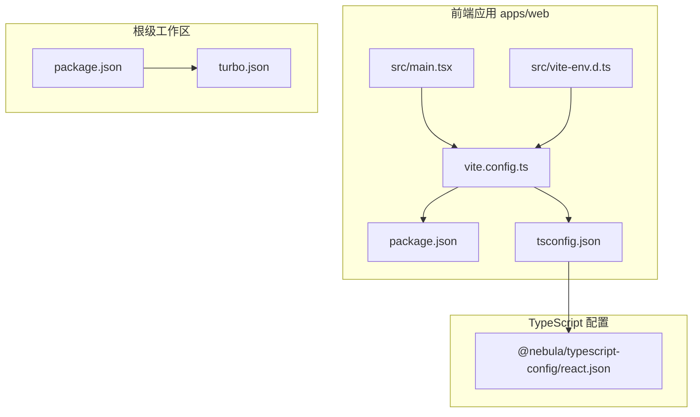
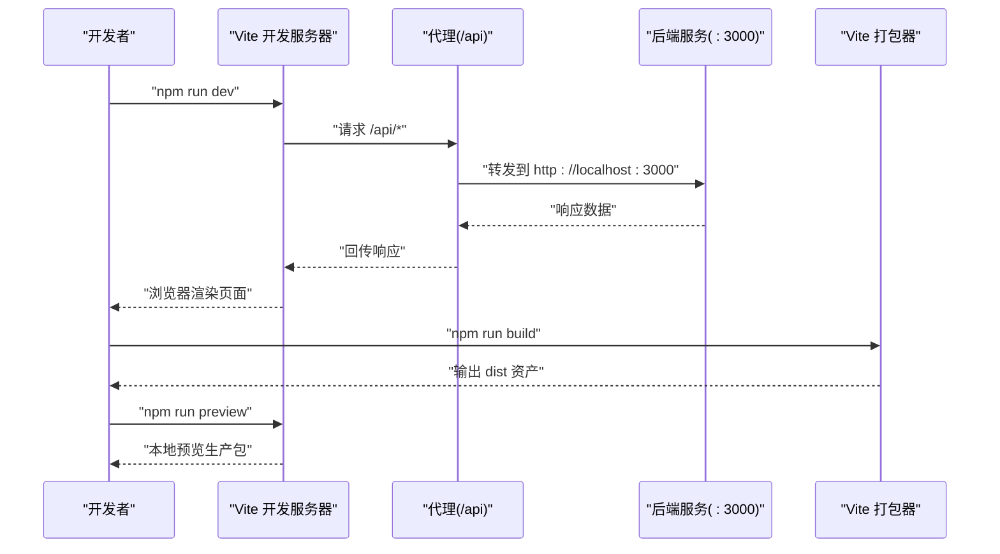
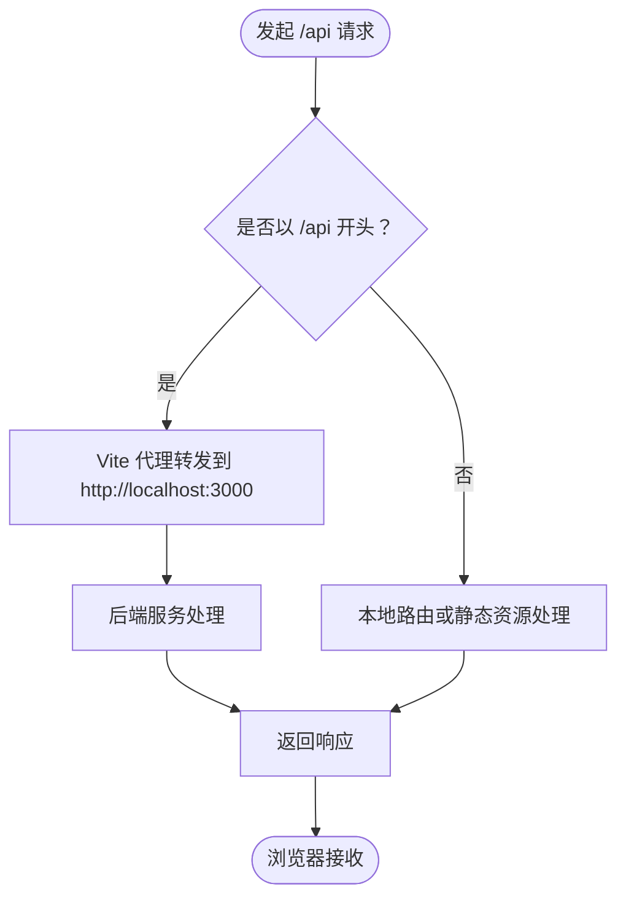
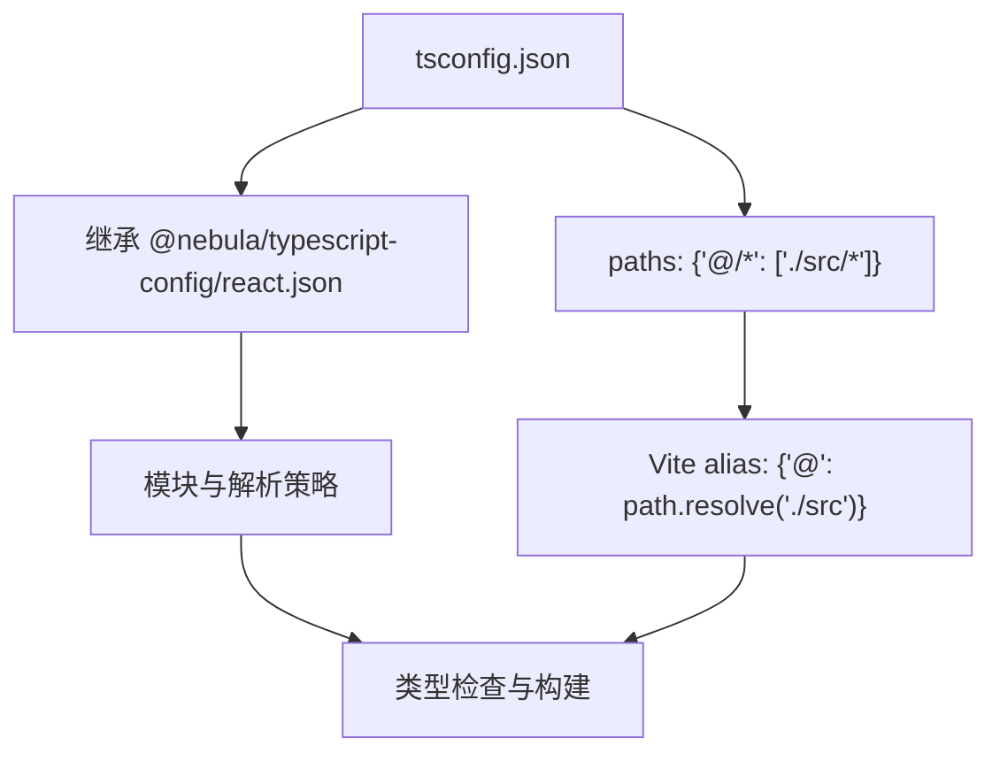
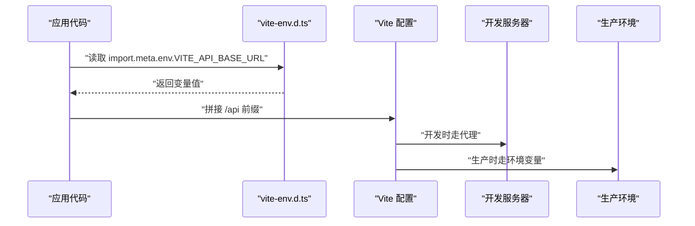
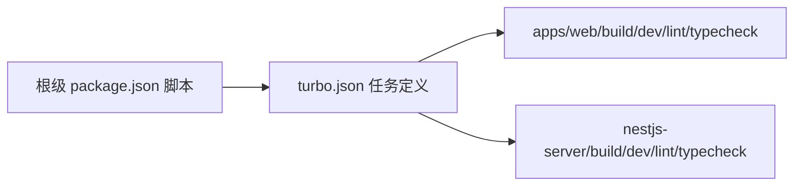
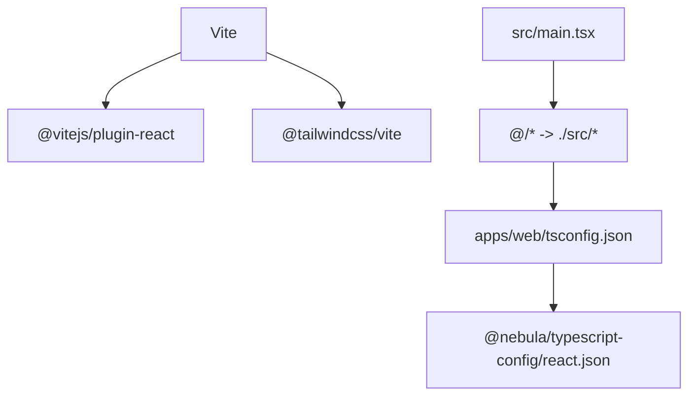

# 构建配置

<cite>
**本文引用的文件**
- [apps/web/vite.config.ts](file://apps/web/vite.config.ts)
- [apps/web/package.json](file://apps/web/package.json)
- [apps/web/tsconfig.json](file://apps/web/tsconfig.json)
- [apps/web/src/vite-env.d.ts](file://apps/web/src/vite-env.d.ts)
- [apps/web/src/main.tsx](file://apps/web/src/main.tsx)
- [packages/typescript-config/react.json](file://packages/typescript-config/react.json)
- [package.json](file://package.json)
- [turbo.json](file://turbo.json)
- [.trae/documents/frontend-api-integration-plan.md](file://.trae/documents/frontend-api-integration-plan.md)
</cite>

## 目录
1. [简介](#简介)
2. [项目结构](#项目结构)
3. [核心组件](#核心组件)
4. [架构总览](#架构总览)
5. [详细组件分析](#详细组件分析)
6. [依赖关系分析](#依赖关系分析)
7. [性能考虑](#性能考虑)
8. [故障排查指南](#故障排查指南)
9. [结论](#结论)
10. [附录](#附录)

## 简介
本文件系统性梳理前端应用的构建配置与优化策略，聚焦于 Vite 的开发服务器、热模块替换（HMR）、代理设置、TypeScript 路径别名与编译选项，并结合 monorepo 场景下的多任务编排与环境变量使用，给出生产构建优化、代码分割与资源压缩建议，以及部署前准备与常见问题排查方法。

## 项目结构
前端应用位于 apps/web，采用 Vite 作为构建与开发工具，TypeScript 提供类型安全，TailwindCSS 通过插件接入，React 19 作为视图层框架。根级 package.json 使用 Turbo 进行多包任务编排，支持并行执行构建、开发、类型检查与 Lint。

**图表来源**
- [apps/web/vite.config.ts:1-23](file://apps/web/vite.config.ts#L1-L23)
- [apps/web/package.json:1-44](file://apps/web/package.json#L1-L44)
- [apps/web/tsconfig.json:1-15](file://apps/web/tsconfig.json#L1-L15)
- [apps/web/src/vite-env.d.ts:1-10](file://apps/web/src/vite-env.d.ts#L1-L10)
- [apps/web/src/main.tsx:1-23](file://apps/web/src/main.tsx#L1-L23)
- [packages/typescript-config/react.json:1-11](file://packages/typescript-config/react.json#L1-L11)
- [package.json:1-22](file://package.json#L1-L22)
- [turbo.json:1-25](file://turbo.json#L1-L25)

**章节来源**
- [apps/web/vite.config.ts:1-23](file://apps/web/vite.config.ts#L1-L23)
- [apps/web/package.json:1-44](file://apps/web/package.json#L1-L44)
- [apps/web/tsconfig.json:1-15](file://apps/web/tsconfig.json#L1-L15)
- [apps/web/src/vite-env.d.ts:1-10](file://apps/web/src/vite-env.d.ts#L1-L10)
- [apps/web/src/main.tsx:1-23](file://apps/web/src/main.tsx#L1-L23)
- [packages/typescript-config/react.json:1-11](file://packages/typescript-config/react.json#L1-L11)
- [package.json:1-22](file://package.json#L1-L22)
- [turbo.json:1-25](file://turbo.json#L1-L25)

## 核心组件
- Vite 开发服务器与代理
  - 开发端口与本地代理规则，将 /api 前缀转发至后端服务，便于前后端联调。
- 插件生态
  - React 插件用于 JSX 转换与 HMR；TailwindCSS 插件用于样式扫描与生成。
- 路径别名与 TypeScript 配置
  - 通过 tsconfig.json 的 paths 与 Vite 的 resolve.alias 统一映射 @ 到 src 目录，提升导入可读性与一致性。
- 环境变量声明
  - 在 vite-env.d.ts 中声明 VITE_API_BASE_URL，确保在开发与生产中对 API 基础地址进行灵活配置。
- 任务编排
  - 根级脚本通过 Turbo 并行执行各包的构建与开发任务，提高整体效率。

**章节来源**
- [apps/web/vite.config.ts:6-22](file://apps/web/vite.config.ts#L6-L22)
- [apps/web/tsconfig.json:8-11](file://apps/web/tsconfig.json#L8-L11)
- [apps/web/src/vite-env.d.ts:3-5](file://apps/web/src/vite-env.d.ts#L3-L5)
- [package.json:5-14](file://package.json#L5-L14)
- [turbo.json:3-24](file://turbo.json#L3-L24)

## 架构总览
下图展示前端开发与构建的关键流程：开发服务器启动、代理转发、TypeScript 类型检查、打包与预览。

**图表来源**
- [apps/web/vite.config.ts:13-21](file://apps/web/vite.config.ts#L13-L21)
- [apps/web/package.json:6-12](file://apps/web/package.json#L6-L12)
- [apps/web/src/vite-env.d.ts:3-5](file://apps/web/src/vite-env.d.ts#L3-L5)

## 详细组件分析

### Vite 开发服务器与代理
- 开发端口
  - 固定开发端口，便于团队统一与网络配置。
- 代理规则
  - 将以 /api 开头的请求转发到后端服务，changeOrigin 用于解决跨域与 Host 头部问题。
- 与文档约定的协同
  - 文档中明确 API 前缀为 /api，与 Vite 代理保持一致，确保开发体验稳定。

**图表来源**
- [apps/web/vite.config.ts:15-20](file://apps/web/vite.config.ts#L15-L20)
- [.trae/documents/frontend-api-integration-plan.md:68-68](file://.trae/documents/frontend-api-integration-plan.md#L68-L68)

**章节来源**
- [apps/web/vite.config.ts:13-21](file://apps/web/vite.config.ts#L13-L21)
- [.trae/documents/frontend-api-integration-plan.md:68-68](file://.trae/documents/frontend-api-integration-plan.md#L68-L68)

### TypeScript 配置与路径别名
- 配置继承
  - 继承 @nebula/typescript-config/react.json，统一 React JSX 语法规则与 DOM 类库。
- 模块与解析
  - ESNext 模块与 bundler 解析策略，避免 emit，配合 Vite/Turbo 的类型检查流程。
- 路径别名
  - tsconfig.json 的 paths 与 Vite 的 alias 保持一致，均将 @ 映射到 src，减少相对路径复杂度。
- 包含范围
  - include 覆盖源码与 Vite 配置文件，确保类型检查覆盖到构建配置。

**图表来源**
- [apps/web/tsconfig.json:3-12](file://apps/web/tsconfig.json#L3-L12)
- [packages/typescript-config/react.json:3-9](file://packages/typescript-config/react.json#L3-L9)
- [apps/web/vite.config.ts:8-12](file://apps/web/vite.config.ts#L8-L12)

**章节来源**
- [apps/web/tsconfig.json:3-12](file://apps/web/tsconfig.json#L3-L12)
- [packages/typescript-config/react.json:3-9](file://packages/typescript-config/react.json#L3-L9)
- [apps/web/vite.config.ts:8-12](file://apps/web/vite.config.ts#L8-L12)

### 环境变量与 API 基础地址
- 声明
  - 在 vite-env.d.ts 中声明 VITE_API_BASE_URL，使 import.meta.env 下可用。
- 使用场景
  - 开发环境默认空字符串，走 Vite 代理；生产环境通过部署平台注入该变量，指向实际后端域名。
- 与文档约定
  - 文档明确 API 前缀为 /api，且支持通过 VITE_API_BASE_URL 覆盖，确保前后端解耦。

**图表来源**
- [apps/web/src/vite-env.d.ts:3-5](file://apps/web/src/vite-env.d.ts#L3-L5)
- [apps/web/vite.config.ts:15-20](file://apps/web/vite.config.ts#L15-L20)
- [.trae/documents/frontend-api-integration-plan.md:267-269](file://.trae/documents/frontend-api-integration-plan.md#L267-L269)

**章节来源**
- [apps/web/src/vite-env.d.ts:3-5](file://apps/web/src/vite-env.d.ts#L3-L5)
- [apps/web/vite.config.ts:15-20](file://apps/web/vite.config.ts#L15-L20)
- [.trae/documents/frontend-api-integration-plan.md:267-269](file://.trae/documents/frontend-api-integration-plan.md#L267-L269)

### 任务编排与多包协作
- 根级脚本
  - 通过 Turbo 并行执行构建、开发、类型检查与 Lint，加速迭代。
- 任务定义
  - build、dev、lint、typecheck、test、clean 等任务在 turbo.json 中定义，控制缓存与依赖顺序。
- 工作区
  - 使用 pnpm workspace，前端包与共享包协同，避免重复安装与版本漂移。

**图表来源**
- [package.json:5-14](file://package.json#L5-L14)
- [turbo.json:3-24](file://turbo.json#L3-L24)

**章节来源**
- [package.json:5-14](file://package.json#L5-L14)
- [turbo.json:3-24](file://turbo.json#L3-L24)

## 依赖关系分析
- Vite 与插件
  - Vite 作为核心构建器，依赖 React 插件与 TailwindCSS 插件；插件版本与 Vite 版本兼容。
- TypeScript 配置链路
  - tsconfig.json 继承共享配置，确保 React 与 DOM 类型、JSX 规范一致。
- 应用入口
  - main.tsx 通过 @ 别名导入 API、路由与样式，体现路径别名与模块解析的一致性。

**图表来源**
- [apps/web/vite.config.ts:3-4](file://apps/web/vite.config.ts#L3-L4)
- [apps/web/tsconfig.json:3-11](file://apps/web/tsconfig.json#L3-L11)
- [packages/typescript-config/react.json:3-9](file://packages/typescript-config/react.json#L3-L9)
- [apps/web/src/main.tsx:6-10](file://apps/web/src/main.tsx#L6-L10)

**章节来源**
- [apps/web/vite.config.ts:3-4](file://apps/web/vite.config.ts#L3-L4)
- [apps/web/tsconfig.json:3-11](file://apps/web/tsconfig.json#L3-L11)
- [packages/typescript-config/react.json:3-9](file://packages/typescript-config/react.json#L3-L9)
- [apps/web/src/main.tsx:6-10](file://apps/web/src/main.tsx#L6-L10)

## 性能考虑
- 开发阶段
  - 使用 Vite 的原生 HMR，避免全量刷新；合理拆分路由与组件，降低首次构建体积。
  - 代理仅转发必要路径，避免无关流量进入代理链路。
- 类型检查与构建
  - 采用 noEmit 与独立的类型检查命令，缩短构建时间；在 CI 中并行执行 typecheck。
- 生产构建优化建议
  - 代码分割：利用动态 import 对路由与功能模块进行懒加载，减少首屏体积。
  - 资源压缩：启用最小化与 Tree Shaking（Vite 默认开启），结合现代浏览器目标与合适的 polyfill。
  - 缓存策略：静态资源采用长效缓存，HTML 与 JS 采用协商缓存；构建产物加入内容哈希。
  - 样式优化：TailwindCSS 插件按需扫描，避免引入未使用样式。
- 任务并行
  - 通过 Turbo 并行执行多个包的构建与类型检查，缩短整体等待时间。

[本节为通用性能指导，不直接分析具体文件，故无“章节来源”]

## 故障排查指南
- 代理无效或 404
  - 确认请求路径是否以 /api 开头；检查代理 target 与 changeOrigin 设置；核对后端服务端口与连通性。
- 环境变量未生效
  - 确认 VITE_ 前缀的变量在运行时可见；开发环境为空字符串走代理，生产环境需正确注入。
- 路径别名失效
  - 确保 tsconfig.json 与 Vite 配置中的 @ 别名指向同一目录；重启开发服务器以重新解析。
- 类型检查报错
  - 使用独立的类型检查命令定位问题；检查 tsconfig.json 的 include/exclude 是否覆盖到相关文件。
- 构建失败或内存不足
  - 在大型项目中适当增加 Node 内存上限；拆分构建任务，优先并行执行独立包的构建。

**章节来源**
- [apps/web/vite.config.ts:13-21](file://apps/web/vite.config.ts#L13-L21)
- [apps/web/src/vite-env.d.ts:3-5](file://apps/web/src/vite-env.d.ts#L3-L5)
- [apps/web/tsconfig.json:8-12](file://apps/web/tsconfig.json#L8-L12)
- [package.json:5-14](file://package.json#L5-L14)

## 结论
本项目在 Vite 与 TypeScript 的加持下，实现了清晰的开发体验与可维护的构建配置。通过统一的路径别名、严格的类型约束、合理的代理与环境变量管理，以及 Turbo 的多包并行编排，显著提升了开发效率与构建稳定性。后续可在生产构建中进一步完善代码分割与资源压缩策略，以获得更优的首屏性能与用户体验。

## 附录
- 关键文件速览
  - Vite 配置：[apps/web/vite.config.ts:1-23](file://apps/web/vite.config.ts#L1-L23)
  - 包脚本与依赖：[apps/web/package.json:1-44](file://apps/web/package.json#L1-L44)
  - TypeScript 配置：[apps/web/tsconfig.json:1-15](file://apps/web/tsconfig.json#L1-L15)
  - 环境变量声明：[apps/web/src/vite-env.d.ts:1-10](file://apps/web/src/vite-env.d.ts#L1-L10)
  - 应用入口：[apps/web/src/main.tsx:1-23](file://apps/web/src/main.tsx#L1-L23)
  - 共享 TypeScript 配置：[packages/typescript-config/react.json:1-11](file://packages/typescript-config/react.json#L1-L11)
  - 根级脚本与任务：[package.json:1-22](file://package.json#L1-L22)、[turbo.json:1-25](file://turbo.json#L1-L25)
  - 文档约定（API 前缀与代理）：[.trae/documents/frontend-api-integration-plan.md:68-68](file://.trae/documents/frontend-api-integration-plan.md#L68-L68)