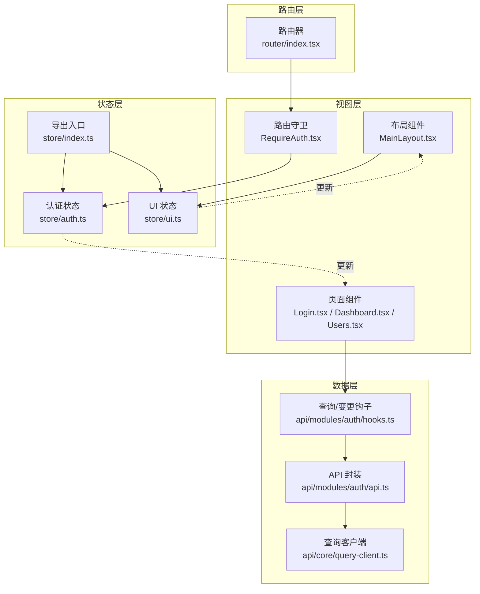
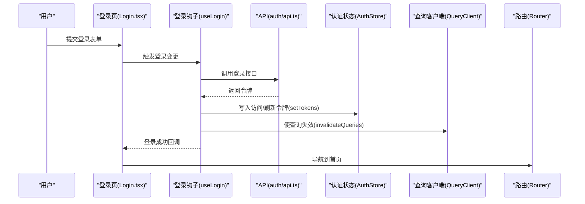
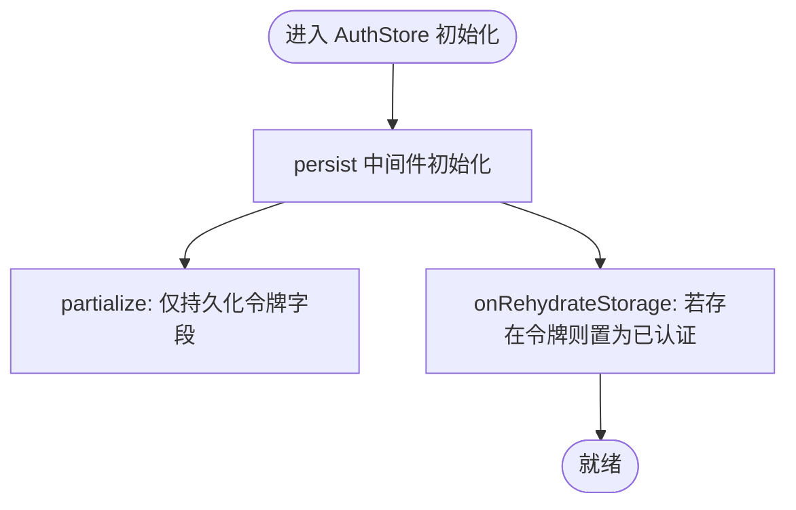
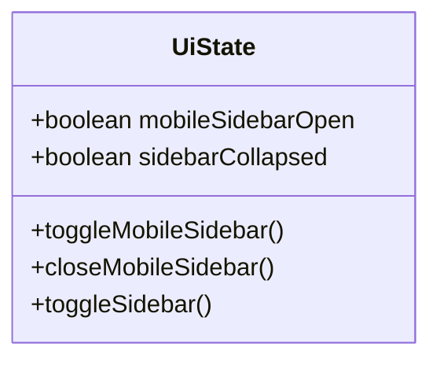
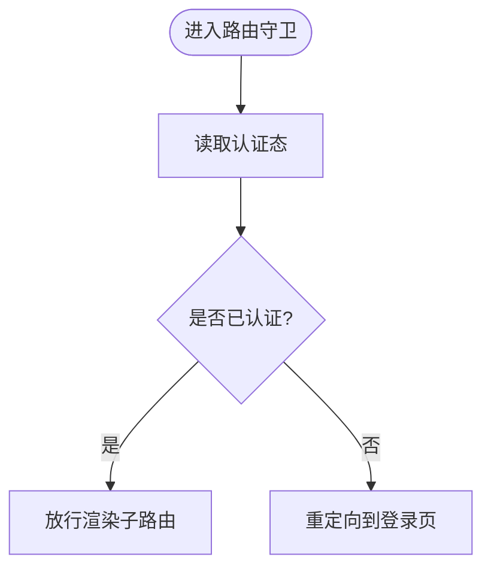
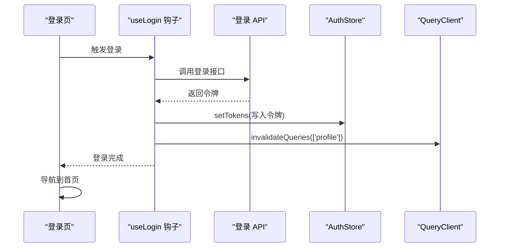
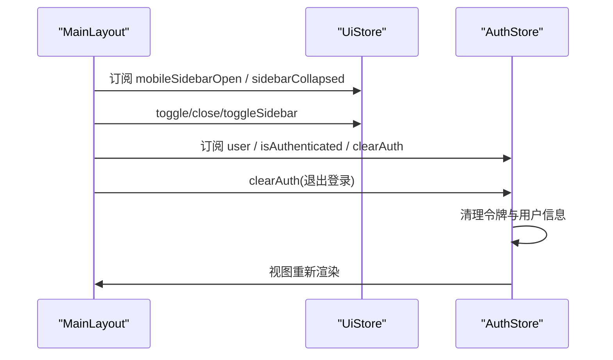
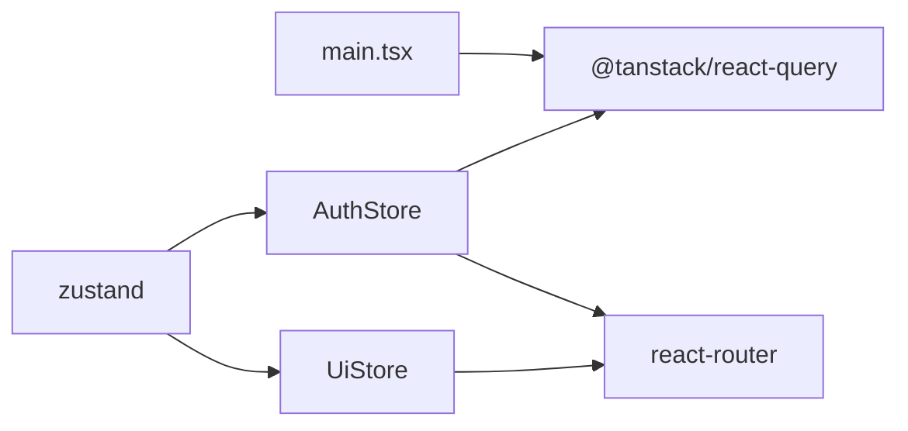

# 状态管理系统

<cite>
**本文引用的文件**
- [apps/web/src/store/index.ts](file://apps/web/src/store/index.ts)
- [apps/web/src/store/auth.ts](file://apps/web/src/store/auth.ts)
- [apps/web/src/store/ui.ts](file://apps/web/src/store/ui.ts)
- [apps/web/src/main.tsx](file://apps/web/src/main.tsx)
- [apps/web/src/pages/Login.tsx](file://apps/web/src/pages/Login.tsx)
- [apps/web/src/components/RequireAuth.tsx](file://apps/web/src/components/RequireAuth.tsx)
- [apps/web/src/layouts/MainLayout.tsx](file://apps/web/src/layouts/MainLayout.tsx)
- [apps/web/src/router/index.tsx](file://apps/web/src/router/index.tsx)
- [apps/web/src/api/modules/auth/hooks.ts](file://apps/web/src/api/modules/auth/hooks.ts)
- [apps/web/src/api/modules/auth/api.ts](file://apps/web/src/api/modules/auth/api.ts)
- [apps/web/package.json](file://apps/web/package.json)
- [package.json](file://package.json)
</cite>

## 目录

1. [简介](#简介)
2. [项目结构](#项目结构)
3. [核心组件](#核心组件)
4. [架构总览](#架构总览)
5. [详细组件分析](#详细组件分析)
6. [依赖分析](#依赖分析)
7. [性能考虑](#性能考虑)
8. [故障排查指南](#故障排查指南)
9. [结论](#结论)
10. [附录：使用示例与最佳实践](#附录使用示例与最佳实践)

## 简介

本文件系统性梳理前端 Web 应用中的 Zustand 状态管理实现，涵盖全局状态组织、模块划分、状态更新机制、认证与 UI 状态分离、状态持久化、订阅与异步更新、调试与性能优化等主题，并结合路由守卫与 API 层的集成，给出可复用的最佳实践与示例路径。

## 项目结构

Web 前端采用 Zustand 将状态按“认证态”和“UI 态”分层管理，配合 React Router 实现路由守卫，通过 TanStack React Query 管理服务端数据与缓存失效，形成“状态层（Zustand）—视图层（React）—数据层（React Query + API）—路由层（React Router）”的清晰分层。

图表来源

- [apps/web/src/store/index.ts:1-3](file://apps/web/src/store/index.ts#L1-L3)
- [apps/web/src/store/auth.ts:1-64](file://apps/web/src/store/auth.ts#L1-L64)
- [apps/web/src/store/ui.ts:1-43](file://apps/web/src/store/ui.ts#L1-L43)
- [apps/web/src/pages/Login.tsx:1-221](file://apps/web/src/pages/Login.tsx#L1-L221)
- [apps/web/src/layouts/MainLayout.tsx:1-317](file://apps/web/src/layouts/MainLayout.tsx#L1-L317)
- [apps/web/src/components/RequireAuth.tsx:1-14](file://apps/web/src/components/RequireAuth.tsx#L1-L14)
- [apps/web/src/router/index.tsx:1-51](file://apps/web/src/router/index.tsx#L1-L51)
- [apps/web/src/api/modules/auth/hooks.ts:1-49](file://apps/web/src/api/modules/auth/hooks.ts#L1-L49)
- [apps/web/src/api/modules/auth/api.ts:1-45](file://apps/web/src/api/modules/auth/api.ts#L1-L45)

章节来源

- [apps/web/src/store/index.ts:1-3](file://apps/web/src/store/index.ts#L1-L3)
- [apps/web/src/store/auth.ts:1-64](file://apps/web/src/store/auth.ts#L1-L64)
- [apps/web/src/store/ui.ts:1-43](file://apps/web/src/store/ui.ts#L1-L43)
- [apps/web/src/main.tsx:1-23](file://apps/web/src/main.tsx#L1-L23)
- [apps/web/src/router/index.tsx:1-51](file://apps/web/src/router/index.tsx#L1-L51)

## 核心组件

- 认证状态模块（AuthStore）
  - 职责：维护访问令牌、刷新令牌、用户信息与认证态；提供设置令牌、设置用户、清理认证等动作；支持持久化与去hydration。
  - 关键点：使用持久化中间件仅持久化令牌字段；去hydration 时根据令牌计算认证态；提供 devtools 调试。
- UI 状态模块（UiStore）
  - 职责：维护移动端侧边栏开关与桌面端侧边栏折叠状态；提供切换、关闭、折叠等动作；使用 devtools 调试。
- 状态导出入口（store/index.ts）
  - 职责：统一导出各模块的 Hook，便于上层组件按需引入。
- 路由守卫（RequireAuth）
  - 职责：基于认证态进行路由拦截，未认证则重定向至登录页。
- 页面与布局（Login.tsx、MainLayout.tsx）
  - 职责：登录页负责触发登录流程并写入认证状态；布局页消费 UI 状态与认证状态，渲染导航与用户菜单。

章节来源

- [apps/web/src/store/auth.ts:1-64](file://apps/web/src/store/auth.ts#L1-L64)
- [apps/web/src/store/ui.ts:1-43](file://apps/web/src/store/ui.ts#L1-L43)
- [apps/web/src/store/index.ts:1-3](file://apps/web/src/store/index.ts#L1-L3)
- [apps/web/src/components/RequireAuth.tsx:1-14](file://apps/web/src/components/RequireAuth.tsx#L1-L14)
- [apps/web/src/pages/Login.tsx:1-221](file://apps/web/src/pages/Login.tsx#L1-L221)
- [apps/web/src/layouts/MainLayout.tsx:1-317](file://apps/web/src/layouts/MainLayout.tsx#L1-L317)

## 架构总览

Zustand 在本项目中承担“轻量、可组合、可调试”的状态中心，与 React Router 的路由守卫配合实现鉴权控制，与 React Query 协作完成服务端数据拉取与缓存失效。整体流程如下：

图表来源

- [apps/web/src/pages/Login.tsx:79-92](file://apps/web/src/pages/Login.tsx#L79-L92)
- [apps/web/src/api/modules/auth/hooks.ts:12-22](file://apps/web/src/api/modules/auth/hooks.ts#L12-L22)
- [apps/web/src/api/modules/auth/api.ts:28-30](file://apps/web/src/api/modules/auth/api.ts#L28-L30)
- [apps/web/src/store/auth.ts:36-46](file://apps/web/src/store/auth.ts#L36-L46)

## 详细组件分析

### 认证状态模块（AuthStore）

- 数据结构
  - 字段：访问令牌、刷新令牌、用户信息、认证态布尔值。
  - 动作：设置令牌、设置用户、清理认证。
- 持久化策略
  - 仅持久化令牌字段，避免持久化敏感的用户信息。
  - 去 hydration 时根据令牌计算认证态，确保重启后仍能正确识别已登录。
- 调试与开发体验
  - 使用 devtools 中间件，命名 store 与动作，便于时间旅行调试。
- 异步更新与副作用
  - 登录成功后写入令牌并使相关查询失效；登出后清理认证并清空查询缓存。

图表来源

- [apps/web/src/store/auth.ts:48-62](file://apps/web/src/store/auth.ts#L48-L62)

章节来源

- [apps/web/src/store/auth.ts:1-64](file://apps/web/src/store/auth.ts#L1-L64)

### UI 状态模块（UiStore）

- 数据结构
  - 字段：移动端侧边栏开关、桌面端侧边栏折叠状态。
  - 动作：切换移动端侧边栏、关闭移动端侧边栏、切换桌面端折叠状态。
- 调试与开发体验
  - 使用 devtools 中间件，命名 store，便于观察 UI 状态变化。
- 与布局组件的协作
  - 布局组件订阅 UI 状态，动态控制侧边栏显示与宽度、面包屑位置等。

图表来源

- [apps/web/src/store/ui.ts:4-18](file://apps/web/src/store/ui.ts#L4-L18)

章节来源

- [apps/web/src/store/ui.ts:1-43](file://apps/web/src/store/ui.ts#L1-L43)
- [apps/web/src/layouts/MainLayout.tsx:172-316](file://apps/web/src/layouts/MainLayout.tsx#L172-L316)

### 路由守卫与状态联动（RequireAuth）

- 逻辑
  - 读取认证态，未认证则重定向至登录页并携带来源地址。
- 与认证状态的耦合
  - 依赖 AuthStore 的认证态字段进行判断。

图表来源

- [apps/web/src/components/RequireAuth.tsx:4-13](file://apps/web/src/components/RequireAuth.tsx#L4-L13)
- [apps/web/src/store/auth.ts:10](file://apps/web/src/store/auth.ts#L10)

章节来源

- [apps/web/src/components/RequireAuth.tsx:1-14](file://apps/web/src/components/RequireAuth.tsx#L1-L14)
- [apps/web/src/router/index.tsx:1-51](file://apps/web/src/router/index.tsx#L1-L51)

### 登录流程与状态更新（Login → AuthStore）

- 流程
  - 用户提交表单 → 调用登录钩子 → 发起登录请求 → 成功后写入令牌 → 使查询失效 → 导航首页。
- 关键点
  - 登录成功后通过 AuthStore 写入令牌，同时使 profile 等查询失效，保证后续读取最新数据。
  - 登录页在挂载时检测已登录状态，直接跳转首页。

图表来源

- [apps/web/src/pages/Login.tsx:68-92](file://apps/web/src/pages/Login.tsx#L68-L92)
- [apps/web/src/api/modules/auth/hooks.ts:12-22](file://apps/web/src/api/modules/auth/hooks.ts#L12-L22)
- [apps/web/src/store/auth.ts:36-46](file://apps/web/src/store/auth.ts#L36-L46)

章节来源

- [apps/web/src/pages/Login.tsx:1-221](file://apps/web/src/pages/Login.tsx#L1-L221)
- [apps/web/src/api/modules/auth/hooks.ts:1-49](file://apps/web/src/api/modules/auth/hooks.ts#L1-L49)
- [apps/web/src/api/modules/auth/api.ts:1-45](file://apps/web/src/api/modules/auth/api.ts#L1-L45)

### 布局与 UI 状态（MainLayout）

- 功能
  - 订阅 UI 状态，控制移动端侧边栏显隐与桌面端侧边栏折叠。
  - 订阅认证状态，渲染用户头像与退出登录动作。
- 交互
  - 通过按钮事件调用 UI 状态的动作，改变布局状态。
  - 退出登录时调用认证状态的动作，清理认证并清空查询缓存。

图表来源

- [apps/web/src/layouts/MainLayout.tsx:172-316](file://apps/web/src/layouts/MainLayout.tsx#L172-L316)
- [apps/web/src/store/ui.ts:20-42](file://apps/web/src/store/ui.ts#L20-L42)
- [apps/web/src/store/auth.ts:44-46](file://apps/web/src/store/auth.ts#L44-L46)

章节来源

- [apps/web/src/layouts/MainLayout.tsx:1-317](file://apps/web/src/layouts/MainLayout.tsx#L1-L317)
- [apps/web/src/store/ui.ts:1-43](file://apps/web/src/store/ui.ts#L1-L43)
- [apps/web/src/store/auth.ts:1-64](file://apps/web/src/store/auth.ts#L1-L64)

## 依赖分析

- Zustand 版本与安装
  - Web 应用依赖 zustand，版本在应用包中声明。
- 与其他库的集成
  - 与 TanStack React Query 协同：通过钩子在登录成功后使查询失效，在登出后清空缓存。
  - 与 React Router 协同：路由守卫基于认证态进行拦截。
  - 与开发工具协同：devtools 中间件用于调试。

图表来源

- [apps/web/package.json:28](file://apps/web/package.json#L28)
- [apps/web/src/main.tsx:4-20](file://apps/web/src/main.tsx#L4-L20)
- [apps/web/src/api/modules/auth/hooks.ts:12-22](file://apps/web/src/api/modules/auth/hooks.ts#L12-L22)

章节来源

- [apps/web/package.json:1-44](file://apps/web/package.json#L1-L44)
- [apps/web/src/main.tsx:1-23](file://apps/web/src/main.tsx#L1-L23)
- [apps/web/src/api/modules/auth/hooks.ts:1-49](file://apps/web/src/api/modules/auth/hooks.ts#L1-L49)

## 性能考虑

- 状态粒度拆分
  - 将认证态与 UI 态分离，降低无关渲染范围，提升局部更新效率。
- 选择器订阅
  - 使用选择器订阅所需字段，避免整块状态变化导致的不必要重渲染。
- 持久化瘦身
  - 仅持久化令牌字段，减少存储体积与序列化开销。
- 查询缓存管理
  - 登录成功后仅使必要查询失效，避免全量刷新；登出后清空缓存，防止脏数据。
- 开发期调试成本
  - devtools 仅在开发环境启用，避免生产环境性能损耗。

## 故障排查指南

- 无法登录或登录后无反应
  - 检查登录钩子是否成功写入令牌；确认查询失效是否触发。
  - 参考路径：[apps/web/src/api/modules/auth/hooks.ts:12-22](file://apps/web/src/api/modules/auth/hooks.ts#L12-L22)
- 登录后仍被重定向到登录页
  - 检查认证态是否正确写入；确认路由守卫逻辑。
  - 参考路径：[apps/web/src/components/RequireAuth.tsx:4-13](file://apps/web/src/components/RequireAuth.tsx#L4-L13)
- 退出登录后界面未刷新
  - 检查登出钩子是否调用了清理认证与清空查询缓存。
  - 参考路径：[apps/web/src/api/modules/auth/hooks.ts:30-39](file://apps/web/src/api/modules/auth/hooks.ts#L30-L39)
- 侧边栏状态异常
  - 检查 UI 状态的动作调用与布局订阅；确认 devtools 是否显示预期变化。
  - 参考路径：[apps/web/src/layouts/MainLayout.tsx:172-316](file://apps/web/src/layouts/MainLayout.tsx#L172-L316)

章节来源

- [apps/web/src/api/modules/auth/hooks.ts:1-49](file://apps/web/src/api/modules/auth/hooks.ts#L1-L49)
- [apps/web/src/components/RequireAuth.tsx:1-14](file://apps/web/src/components/RequireAuth.tsx#L1-L14)
- [apps/web/src/layouts/MainLayout.tsx:1-317](file://apps/web/src/layouts/MainLayout.tsx#L1-L317)

## 结论

本项目通过 Zustand 将认证态与 UI 态解耦，结合路由守卫与 React Query，实现了清晰、可维护且易调试的状态管理方案。建议在大型应用中继续坚持“按职责拆分状态模块、最小化订阅范围、谨慎持久化敏感数据”的原则，并充分利用 devtools 与查询缓存策略保障性能与一致性。

## 附录：使用示例与最佳实践

- 在页面中使用认证状态
  - 示例路径：[apps/web/src/pages/Login.tsx:68-92](file://apps/web/src/pages/Login.tsx#L68-L92)
- 在布局中使用 UI 状态
  - 示例路径：[apps/web/src/layouts/MainLayout.tsx:172-316](file://apps/web/src/layouts/MainLayout.tsx#L172-L316)
- 在路由守卫中使用认证状态
  - 示例路径：[apps/web/src/components/RequireAuth.tsx:4-13](file://apps/web/src/components/RequireAuth.tsx#L4-L13)
- 在钩子中写入认证状态并使查询失效
  - 示例路径：[apps/web/src/api/modules/auth/hooks.ts:12-22](file://apps/web/src/api/modules/auth/hooks.ts#L12-L22)
- 在登出时清理认证与查询缓存
  - 示例路径：[apps/web/src/api/modules/auth/hooks.ts:30-39](file://apps/web/src/api/modules/auth/hooks.ts#L30-L39)
