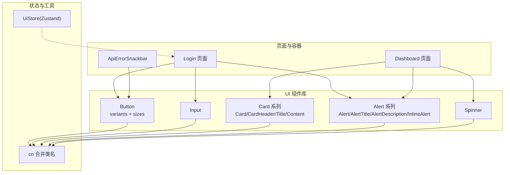
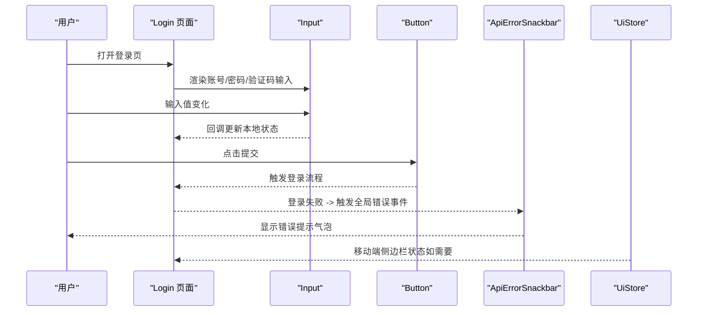
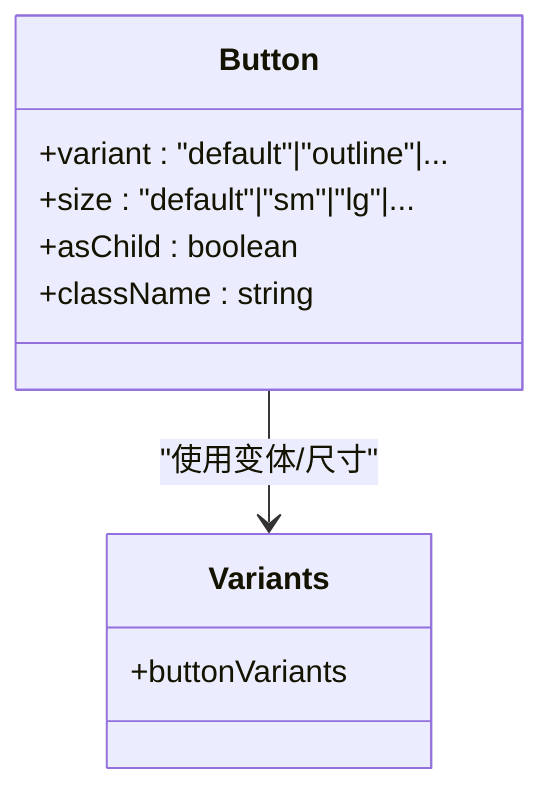
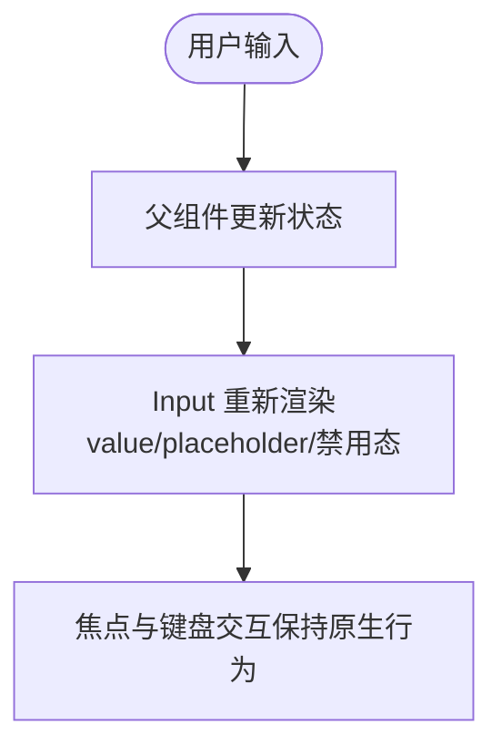
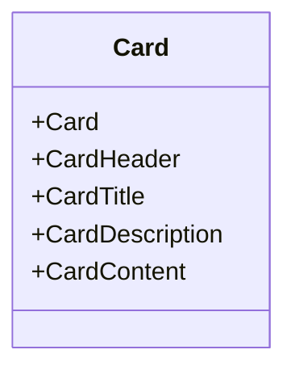
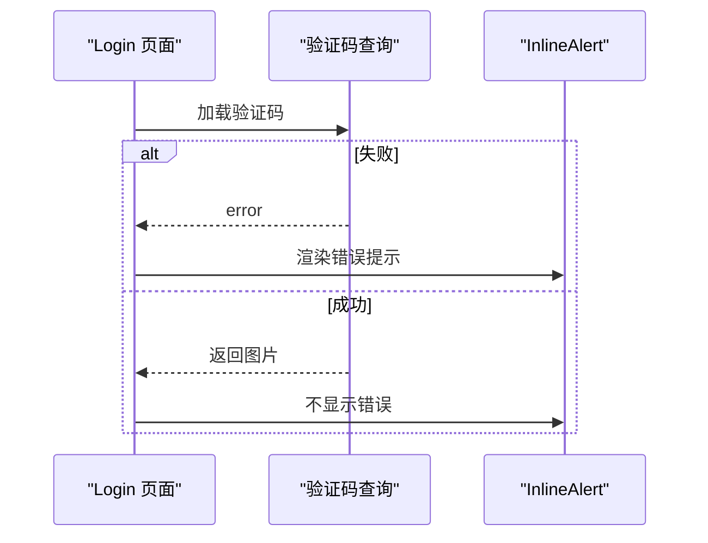
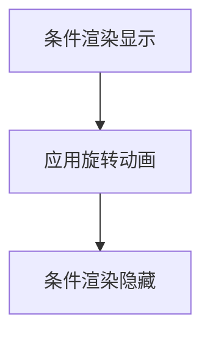
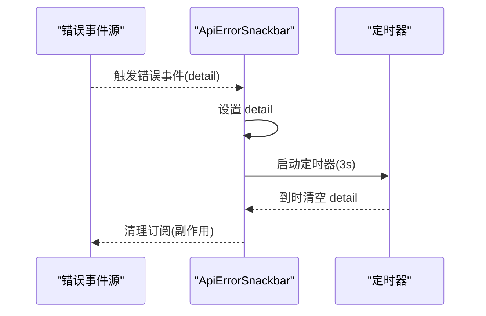
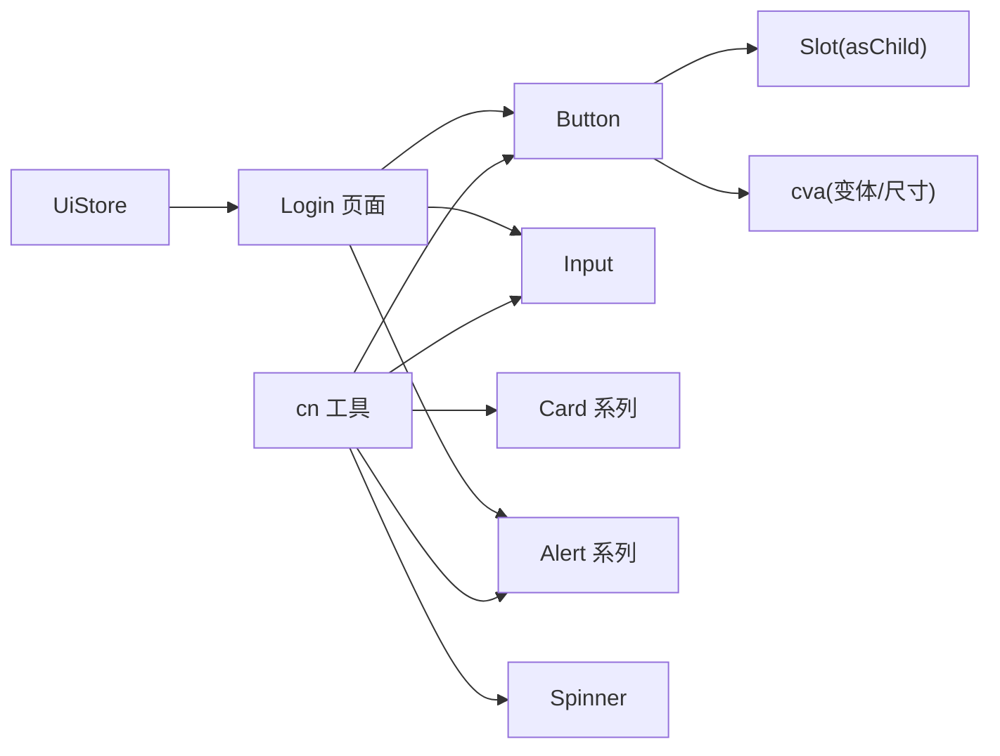

# 组件设计模式

<cite>
**本文引用的文件**
- [apps/web/src/components/ui/button.tsx](file://apps/web/src/components/ui/button.tsx)
- [apps/web/src/components/ui/input.tsx](file://apps/web/src/components/ui/input.tsx)
- [apps/web/src/components/ui/card.tsx](file://apps/web/src/components/ui/card.tsx)
- [apps/web/src/components/ui/alert.tsx](file://apps/web/src/components/ui/alert.tsx)
- [apps/web/src/components/ui/spinner.tsx](file://apps/web/src/components/ui/spinner.tsx)
- [apps/web/src/lib/utils.ts](file://apps/web/src/lib/utils.ts)
- [apps/web/src/components/ApiErrorSnackbar.tsx](file://apps/web/src/components/ApiErrorSnackbar.tsx)
- [apps/web/src/store/ui.ts](file://apps/web/src/store/ui.ts)
- [apps/web/src/pages/Login.tsx](file://apps/web/src/pages/Login.tsx)
- [apps/web/src/pages/Dashboard.tsx](file://apps/web/src/pages/Dashboard.tsx)
- [apps/web/src/styles/index.css](file://apps/web/src/styles/index.css)
</cite>

## 目录

1. 引言
2. 项目结构
3. 核心组件
4. 架构总览
5. 详细组件分析
6. 依赖关系分析
7. 性能考量
8. 故障排查指南
9. 结论
10. 附录

## 引言

本文件系统性梳理本仓库中的 React 组件设计模式，重点覆盖以下方面：

- UI 组件库的组织结构与原子设计思想
- 受控与非受控组件的区分及表单设计模式
- 错误处理与状态提示的通用机制
- 组件 Props 接口设计、TypeScript 类型约束与组合模式
- 具体组件实现示例：按钮、输入框、卡片、警告与加载指示器的设计思路与最佳实践

## 项目结构

前端位于 apps/web，采用按功能域分层的组织方式：

- components/ui：原子与复合 UI 组件库
- components：页面级容器组件与业务组件
- pages：页面入口与布局
- store：全局状态（Zustand）
- api：与后端交互的查询与变更封装（React Query）
- lib：通用工具函数
- styles：主题变量与基础样式

图表来源

- [apps/web/src/components/ui/button.tsx:1-68](file://apps/web/src/components/ui/button.tsx#L1-L68)
- [apps/web/src/components/ui/input.tsx:1-19](file://apps/web/src/components/ui/input.tsx#L1-L19)
- [apps/web/src/components/ui/card.tsx:1-49](file://apps/web/src/components/ui/card.tsx#L1-L49)
- [apps/web/src/components/ui/alert.tsx:1-62](file://apps/web/src/components/ui/alert.tsx#L1-L62)
- [apps/web/src/components/ui/spinner.tsx:1-13](file://apps/web/src/components/ui/spinner.tsx#L1-L13)
- [apps/web/src/lib/utils.ts:1-7](file://apps/web/src/lib/utils.ts#L1-L7)
- [apps/web/src/components/ApiErrorSnackbar.tsx:1-58](file://apps/web/src/components/ApiErrorSnackbar.tsx#L1-L58)
- [apps/web/src/store/ui.ts:1-43](file://apps/web/src/store/ui.ts#L1-L43)
- [apps/web/src/pages/Login.tsx:1-221](file://apps/web/src/pages/Login.tsx#L1-L221)
- [apps/web/src/pages/Dashboard.tsx:1-205](file://apps/web/src/pages/Dashboard.tsx#L1-L205)

章节来源

- [apps/web/src/pages/Login.tsx:1-221](file://apps/web/src/pages/Login.tsx#L1-L221)
- [apps/web/src/pages/Dashboard.tsx:1-205](file://apps/web/src/pages/Dashboard.tsx#L1-L205)
- [apps/web/src/components/ApiErrorSnackbar.tsx:1-58](file://apps/web/src/components/ApiErrorSnackbar.tsx#L1-L58)
- [apps/web/src/store/ui.ts:1-43](file://apps/web/src/store/ui.ts#L1-L43)

## 核心组件

本节聚焦于 UI 组件库中的核心组件及其设计要点。

- Button（变体与尺寸）
  - 设计要点：使用 class-variance-authority 定义变体与尺寸；支持 asChild 透传为任意元素；通过 data-\* 属性暴露语义化槽位；合并类名工具统一处理。
  - 关键实现参考：[buttonVariants 定义:7-42](file://apps/web/src/components/ui/button.tsx#L7-L42)，[Button 组件实现:44-67](file://apps/web/src/components/ui/button.tsx#L44-L67)，[类名合并工具:4-6](file://apps/web/src/lib/utils.ts#L4-L6)。

- Input（受控输入）
  - 设计要点：基于原生 input，注入语义化槽位与焦点环样式；通过 React.ComponentProps<'input'> 透传原生属性；受控模式由父组件维护 value 与 onChange。
  - 关键实现参考：[Input 组件实现:4-16](file://apps/web/src/components/ui/input.tsx#L4-L16)。

- Card 系列（复合容器）
  - 设计要点：拆分为 Card、CardHeader、CardTitle、CardDescription、CardContent，便于组合与覆盖；统一 data-slot 语义化标识。
  - 关键实现参考：[Card 系列实现:4-48](file://apps/web/src/components/ui/card.tsx#L4-L48)。

- Alert 系列（状态提示）
  - 设计要点：Alert 提供基础容器；InlineAlert 封装图标与标题；支持 destructive 变体；用于错误或警告场景。
  - 关键实现参考：[Alert 系列实现:19-61](file://apps/web/src/components/ui/alert.tsx#L19-L61)。

- Spinner（加载指示）
  - 设计要点：固定尺寸与动画类，配合父容器居中展示。
  - 关键实现参考：[Spinner 实现:3-12](file://apps/web/src/components/ui/spinner.tsx#L3-L12)。

章节来源

- [apps/web/src/components/ui/button.tsx:1-68](file://apps/web/src/components/ui/button.tsx#L1-L68)
- [apps/web/src/components/ui/input.tsx:1-19](file://apps/web/src/components/ui/input.tsx#L1-L19)
- [apps/web/src/components/ui/card.tsx:1-49](file://apps/web/src/components/ui/card.tsx#L1-L49)
- [apps/web/src/components/ui/alert.tsx:1-62](file://apps/web/src/components/ui/alert.tsx#L1-L62)
- [apps/web/src/components/ui/spinner.tsx:1-13](file://apps/web/src/components/ui/spinner.tsx#L1-L13)
- [apps/web/src/lib/utils.ts:1-7](file://apps/web/src/lib/utils.ts#L1-L7)

## 架构总览

下图展示了页面如何消费 UI 组件与状态管理，以及错误提示的传播链路。

图表来源

- [apps/web/src/pages/Login.tsx:79-92](file://apps/web/src/pages/Login.tsx#L79-L92)
- [apps/web/src/components/ApiErrorSnackbar.tsx:10-28](file://apps/web/src/components/ApiErrorSnackbar.tsx#L10-L28)
- [apps/web/src/store/ui.ts:20-42](file://apps/web/src/store/ui.ts#L20-L42)

## 详细组件分析

### Button 组件分析

- 设计模式
  - 变体与尺寸：通过 cva 定义 variant 与 size 两维风格矩阵，默认值清晰，易于扩展。
  - 组合与透传：asChild 支持将 Button 作为任意元素根节点渲染，提升可组合性。
  - 语义化槽位：data-slot、data-variant、data-size 便于测试与主题切换。
- TypeScript 约束
  - 使用 VariantProps<typeof buttonVariants> 将变体/尺寸类型安全地混入组件 Props。
  - 继承原生 button 属性，确保无障碍与键盘交互一致。
- 复用策略
  - 通过变体与尺寸参数化不同视觉状态；结合 data-\* 属性与主题变量实现主题一致性。

图表来源

- [apps/web/src/components/ui/button.tsx:7-42](file://apps/web/src/components/ui/button.tsx#L7-L42)
- [apps/web/src/components/ui/button.tsx:44-67](file://apps/web/src/components/ui/button.tsx#L44-L67)

章节来源

- [apps/web/src/components/ui/button.tsx:1-68](file://apps/web/src/components/ui/button.tsx#L1-L68)

### Input 组件分析

- 设计模式
  - 受控组件：父组件通过 value 与 onChange 控制输入值，避免 DOM 与状态分离。
  - 无障碍与焦点：保留原生 input 行为，自动获得焦点环与禁用态样式。
- TypeScript 约束
  - 透传 React.ComponentProps<'input'>，保证类型安全与向后兼容。
- 复用策略
  - 在表单中统一使用，结合 Card、Alert 等组合形成完整表单区块。

图表来源

- [apps/web/src/components/ui/input.tsx:4-16](file://apps/web/src/components/ui/input.tsx#L4-L16)
- [apps/web/src/pages/Login.tsx:123-147](file://apps/web/src/pages/Login.tsx#L123-L147)

章节来源

- [apps/web/src/components/ui/input.tsx:1-19](file://apps/web/src/components/ui/input.tsx#L1-L19)
- [apps/web/src/pages/Login.tsx:1-221](file://apps/web/src/pages/Login.tsx#L1-L221)

### Card 系列组件分析

- 设计模式
  - 组合式容器：将标题、描述、内容拆分为独立子组件，便于局部替换与样式覆盖。
  - 语义化槽位：data-slot 便于主题与测试识别。
- 复用策略
  - 在 Dashboard 中作为统计卡片与状态面板的基础容器，统一边框、阴影与内间距。

图表来源

- [apps/web/src/components/ui/card.tsx:4-48](file://apps/web/src/components/ui/card.tsx#L4-L48)

章节来源

- [apps/web/src/components/ui/card.tsx:1-49](file://apps/web/src/components/ui/card.tsx#L1-L49)
- [apps/web/src/pages/Dashboard.tsx:98-193](file://apps/web/src/pages/Dashboard.tsx#L98-L193)

### Alert 系列组件分析

- 设计模式
  - 基础容器与内联封装：Alert 提供基础容器，InlineAlert 封装图标与标题，适合错误与提示场景。
  - 变体控制：destructive 变体用于错误状态，颜色与图标随变体切换。
- 复用策略
  - 在登录页与仪表盘中分别用于验证码加载失败与健康检查失败提示。

图表来源

- [apps/web/src/pages/Login.tsx:164-185](file://apps/web/src/pages/Login.tsx#L164-L185)
- [apps/web/src/components/ui/alert.tsx:37-59](file://apps/web/src/components/ui/alert.tsx#L37-L59)

章节来源

- [apps/web/src/components/ui/alert.tsx:1-62](file://apps/web/src/components/ui/alert.tsx#L1-L62)
- [apps/web/src/pages/Login.tsx:1-221](file://apps/web/src/pages/Login.tsx#L1-L221)
- [apps/web/src/pages/Dashboard.tsx:122-128](file://apps/web/src/pages/Dashboard.tsx#L122-L128)

### Spinner 组件分析

- 设计模式
  - 单一职责：仅负责旋转动画与尺寸控制，常与条件渲染配合。
- 复用策略
  - 在登录页与仪表盘中用于加载态占位。

图表来源

- [apps/web/src/components/ui/spinner.tsx:3-12](file://apps/web/src/components/ui/spinner.tsx#L3-L12)
- [apps/web/src/pages/Login.tsx:165-168](file://apps/web/src/pages/Login.tsx#L165-L168)
- [apps/web/src/pages/Dashboard.tsx:122-125](file://apps/web/src/pages/Dashboard.tsx#L122-L125)

章节来源

- [apps/web/src/components/ui/spinner.tsx:1-13](file://apps/web/src/components/ui/spinner.tsx#L1-L13)
- [apps/web/src/pages/Login.tsx:1-221](file://apps/web/src/pages/Login.tsx#L1-L221)
- [apps/web/src/pages/Dashboard.tsx:1-205](file://apps/web/src/pages/Dashboard.tsx#L1-L205)

### 错误处理与全局提示

- 设计模式
  - 事件驱动：ApiErrorSnackbar 订阅全局错误事件，自动弹出并在定时后关闭。
  - 状态管理：通过 useState 管理当前详情，useEffect 管理订阅与清理。
- 复用策略
  - 作为全局提示层，统一错误与警告的呈现风格与交互。

图表来源

- [apps/web/src/components/ApiErrorSnackbar.tsx:7-57](file://apps/web/src/components/ApiErrorSnackbar.tsx#L7-L57)

章节来源

- [apps/web/src/components/ApiErrorSnackbar.tsx:1-58](file://apps/web/src/components/ApiErrorSnackbar.tsx#L1-L58)

### 主题与样式系统

- 设计要点
  - CSS 自定义属性：通过 :root 与 .dark 定义主题变量，支持明暗主题切换。
  - Tailwind 层：@layer base 应用基础样式，确保组件默认外观一致。
- 复用策略
  - 组件通过语义化 data-slot 与主题变量协同，无需硬编码颜色。

章节来源

- [apps/web/src/styles/index.css:51-130](file://apps/web/src/styles/index.css#L51-L130)

## 依赖关系分析

- 组件间耦合
  - Button/Input/Card/Alert/Spinner 均依赖 cn 工具进行类名合并，降低样式耦合。
  - 页面组件通过 props 与回调与受控输入交互，避免直接操作 DOM。
- 外部依赖
  - class-variance-authority：用于变体与尺寸的声明式样式生成。
  - radix-ui Slot：用于 asChild 透传。
  - Zustand：UiStore 管理 UI 状态（移动端侧边栏、折叠状态）。
  - React Query：页面层的数据加载与错误处理。

图表来源

- [apps/web/src/lib/utils.ts:4-6](file://apps/web/src/lib/utils.ts#L4-L6)
- [apps/web/src/components/ui/button.tsx:2-5](file://apps/web/src/components/ui/button.tsx#L2-L5)
- [apps/web/src/store/ui.ts:20-42](file://apps/web/src/store/ui.ts#L20-L42)
- [apps/web/src/pages/Login.tsx:1-221](file://apps/web/src/pages/Login.tsx#L1-L221)

章节来源

- [apps/web/src/lib/utils.ts:1-7](file://apps/web/src/lib/utils.ts#L1-L7)
- [apps/web/src/components/ui/button.tsx:1-68](file://apps/web/src/components/ui/button.tsx#L1-L68)
- [apps/web/src/store/ui.ts:1-43](file://apps/web/src/store/ui.ts#L1-L43)

## 性能考量

- 样式合并
  - 使用 twMerge 与 clsx 合并类名，避免重复与冲突，减少重绘。
- 条件渲染
  - Spinner 与错误提示按需渲染，避免不必要的 DOM 更新。
- 状态粒度
  - UiStore 仅管理 UI 状态，避免与业务数据混合导致不必要重渲染。
- 表单受控
  - Input 采用受控模式，减少外部状态同步成本，同时利于表单验证与联动。

## 故障排查指南

- 输入无响应
  - 检查父组件是否正确传递 value 与 onChange；确认 Input 是否被禁用。
  - 参考：[Input 组件实现:4-16](file://apps/web/src/components/ui/input.tsx#L4-L16)
- 按钮样式异常
  - 检查 variant/size 参数是否在定义范围内；确认 data-slot 与主题变量生效。
  - 参考：[Button 变体定义:7-42](file://apps/web/src/components/ui/button.tsx#L7-L42)
- 错误提示未消失
  - 检查 ApiErrorSnackbar 的定时器与 detail 状态；确认事件订阅是否正确清理。
  - 参考：[ApiErrorSnackbar:16-28](file://apps/web/src/components/ApiErrorSnackbar.tsx#L16-L28)
- 主题色不生效
  - 检查 :root 与 .dark 中的主题变量是否正确设置；确认组件是否使用语义化类名。
  - 参考：[主题变量:51-118](file://apps/web/src/styles/index.css#L51-L118)

章节来源

- [apps/web/src/components/ui/input.tsx:1-19](file://apps/web/src/components/ui/input.tsx#L1-L19)
- [apps/web/src/components/ui/button.tsx:1-68](file://apps/web/src/components/ui/button.tsx#L1-L68)
- [apps/web/src/components/ApiErrorSnackbar.tsx:1-58](file://apps/web/src/components/ApiErrorSnackbar.tsx#L1-L58)
- [apps/web/src/styles/index.css:51-130](file://apps/web/src/styles/index.css#L51-L130)

## 结论

本仓库的组件设计遵循“原子 + 复合”的组织方式，通过变体/尺寸参数化、语义化槽位与类名合并工具，实现了高可组合性与强一致性。页面层以受控组件为核心，结合全局错误提示与轻量状态管理，形成清晰的交互与反馈闭环。建议在新增组件时延续上述模式：优先拆分子组件、明确 Props 类型、使用变体/尺寸扩展样式、通过 data-\* 属性增强可测试性与可维护性。

## 附录

- 组件 Props 设计建议
  - 优先使用 React.ComponentProps<'原生标签'>透传原生能力
  - 使用 VariantProps 从 cva 中提取变体/尺寸类型
  - 通过 asChild 支持语义化与可组合性
- 表单设计模式
  - 受控组件：由父组件维护 value 与 onChange
  - 非受控组件：适用于一次性读取值的场景（如文件选择）
- 错误处理
  - 使用事件订阅 + 定时器的全局提示模式，统一错误呈现
- 组合模式
  - Card/Alert/Spinner 等小而专的组件组合成复杂页面区块
