# 组件设计模式

<cite>
**本文引用的文件**
- [apps/web/src/components/ui/button.tsx](file://apps/web/src/components/ui/button.tsx)
- [apps/web/src/components/ui/input.tsx](file://apps/web/src/components/ui/input.tsx)
- [apps/web/src/components/ui/card.tsx](file://apps/web/src/components/ui/card.tsx)
- [apps/web/src/components/ui/alert.tsx](file://apps/web/src/components/ui/alert.tsx)
- [apps/web/src/components/ui/spinner.tsx](file://apps/web/src/components/ui/spinner.tsx)
- [apps/web/src/components/ui/field.tsx](file://apps/web/src/components/ui/field.tsx)
- [apps/web/src/hooks/use-nebula-form.ts](file://apps/web/src/hooks/use-nebula-form.ts)
- [apps/web/src/lib/utils.ts](file://apps/web/src/lib/utils.ts)
- [apps/web/src/components/ApiErrorSnackbar.tsx](file://apps/web/src/components/ApiErrorSnackbar.tsx)
- [apps/web/src/store/ui.ts](file://apps/web/src/store/ui.ts)
- [apps/web/src/pages/Login.tsx](file://apps/web/src/pages/Login.tsx)
- [apps/web/src/pages/Menus.tsx](file://apps/web/src/pages/Menus.tsx)
- [apps/web/src/pages/Users.tsx](file://apps/web/src/pages/Users.tsx)
- [apps/web/src/pages/Dashboard.tsx](file://apps/web/src/pages/Dashboard.tsx)
- [apps/web/src/styles/index.css](file://apps/web/src/styles/index.css)
</cite>

## 更新摘要
**所做更改**
- 新增 Field 组件系统章节，详细介绍从传统 Form 组件模式向 Field 组件系统的演进
- 更新表单设计模式部分，增加 Field 组件的无障碍支持和 ARIA 属性
- 新增 Field 组件的可访问性设计和数据验证反馈机制
- 更新依赖关系分析，反映 Field 组件与表单 Hook 的集成

## 目录

1. 引言
2. 项目结构
3. 核心组件
4. 架构总览
5. 详细组件分析
6. Field 组件系统
7. 表单设计模式演进
8. 依赖关系分析
9. 性能考量
10. 故障排查指南
11. 结论
12. 附录

## 引言

本文件系统性梳理本仓库中的 React 组件设计模式，重点覆盖以下方面：

- UI 组件库的组织结构与原子设计思想
- 从传统 Form 组件模式向 Field 组件系统的重大演进
- 受控与非受控组件的区分及表单设计模式
- 错误处理与状态提示的通用机制
- 组件 Props 接口设计、TypeScript 类型约束与组合模式
- 具体组件实现示例：按钮、输入框、卡片、警告与加载指示器的设计思路与最佳实践

## 项目结构

前端位于 apps/web，采用按功能域分层的组织方式：

- components/ui：原子与复合 UI 组件库，包含新增的 Field 组件系统
- components：页面级容器组件与业务组件
- pages：页面入口与布局
- store：全局状态（Zustand）
- api：与后端交互的查询与变更封装（React Query）
- hooks：自定义 Hook，包含新增的 useNebulaForm
- lib：通用工具函数
- styles：主题变量与基础样式

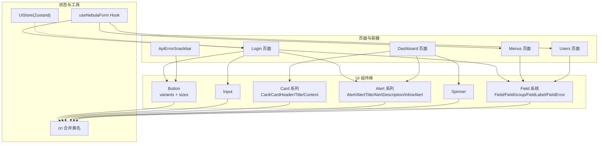

**图表来源**
- [apps/web/src/components/ui/field.tsx:1-222](file://apps/web/src/components/ui/field.tsx#L1-L222)
- [apps/web/src/hooks/use-nebula-form.ts:1-30](file://apps/web/src/hooks/use-nebula-form.ts#L1-L30)

## 核心组件

本节聚焦于 UI 组件库中的核心组件及其设计要点。

- Button（变体与尺寸）
  - 设计要点：使用 class-variance-authority 定义变体与尺寸；支持 asChild 透传为任意元素；通过 data-* 属性暴露语义化槽位；合并类名工具统一处理。
  - 关键实现参考：[buttonVariants 定义:7-42](file://apps/web/src/components/ui/button.tsx#L7-L42)，[Button 组件实现:44-67](file://apps/web/src/components/ui/button.tsx#L44-L67)，[类名合并工具:4-6](file://apps/web/src/lib/utils.ts#L4-L6)。

- Input（受控输入）
  - 设计要点：基于原生 input，注入语义化槽位与焦点环样式；通过 React.ComponentProps<'input'> 透传原生属性；受控模式由父组件维护 value 与 onChange。
  - 关键实现参考：[Input 组件实现:4-16](file://apps/web/src/components/ui/input.tsx#L4-L16)。

- Card 系列（复合容器）
  - 设计要点：拆分为 Card、CardHeader、CardTitle、CardDescription、CardContent，便于组合与覆盖；统一 data-slot 语义化标识。
  - 关键实现参考：[Card 系列实现:4-48](file://apps/web/src/components/ui/card.tsx#L4-L48)。

- Alert 系列（状态提示）
  - 设计要点：Alert 提供基础容器；InlineAlert 封装图标与标题；支持 destructive 变体；用于错误或警告场景。
  - 关键实现参考：[Alert 系列实现:19-61](file://apps/web/src/components/ui/alert.tsx#L19-L61)。

- Spinner（加载指示）
  - 设计要点：固定尺寸与动画类，配合父容器居中展示。
  - 关键实现参考：[Spinner 实现:3-12](file://apps/web/src/components/ui/spinner.tsx#L3-L12)。

**章节来源**
- [apps/web/src/components/ui/button.tsx:1-68](file://apps/web/src/components/ui/button.tsx#L1-L68)
- [apps/web/src/components/ui/input.tsx:1-19](file://apps/web/src/components/ui/input.tsx#L1-L19)
- [apps/web/src/components/ui/card.tsx:1-49](file://apps/web/src/components/ui/card.tsx#L1-L49)
- [apps/web/src/components/ui/alert.tsx:1-62](file://apps/web/src/components/ui/alert.tsx#L1-L62)
- [apps/web/src/components/ui/spinner.tsx:1-13](file://apps/web/src/components/ui/spinner.tsx#L1-L13)
- [apps/web/src/lib/utils.ts:1-7](file://apps/web/src/lib/utils.ts#L1-L7)

## 架构总览

下图展示了页面如何消费 UI 组件与状态管理，以及错误提示的传播链路。新增的 Field 组件系统为表单提供了更强的可访问性和数据验证反馈能力。

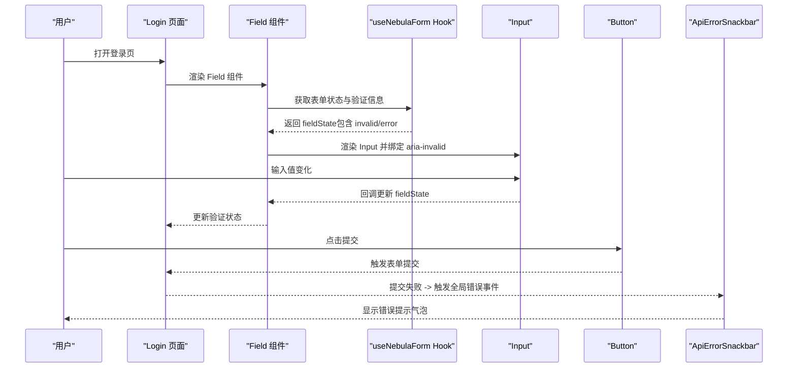

**图表来源**
- [apps/web/src/pages/Login.tsx:148-179](file://apps/web/src/pages/Login.tsx#L148-L179)
- [apps/web/src/hooks/use-nebula-form.ts:16-30](file://apps/web/src/hooks/use-nebula-form.ts#L16-L30)
- [apps/web/src/components/ApiErrorSnackbar.tsx:10-28](file://apps/web/src/components/ApiErrorSnackbar.tsx#L10-L28)

## 详细组件分析

### Button 组件分析

- 设计模式
  - 变体与尺寸：通过 cva 定义 variant 与 size 两维风格矩阵，默认值清晰，易于扩展。
  - 组合与透传：asChild 支持将 Button 作为任意元素根节点渲染，提升可组合性。
  - 语义化槽位：data-slot、data-variant、data-size 便于测试与主题切换。
- TypeScript 约束
  - 使用 VariantProps<typeof buttonVariants> 将变体/尺寸类型安全地混入组件 Props。
  - 继承原生 button 属性，确保无障碍与键盘交互一致。
- 复用策略
  - 通过变体与尺寸参数化不同视觉状态；结合 data-* 属性与主题变量实现主题一致性。

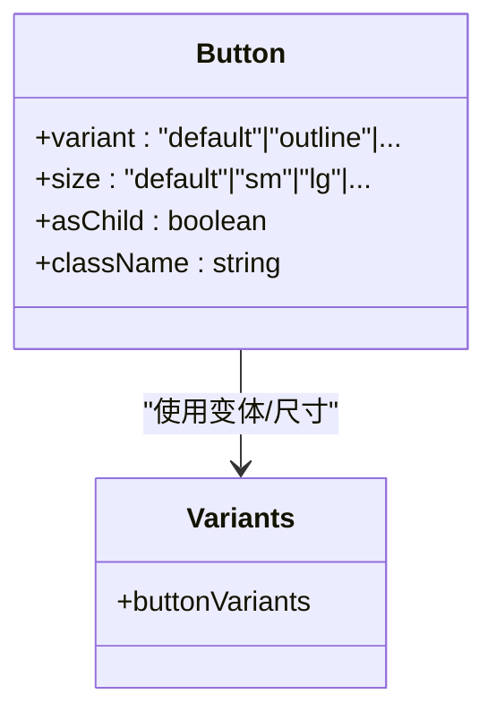

**图表来源**
- [apps/web/src/components/ui/button.tsx:7-42](file://apps/web/src/components/ui/button.tsx#L7-L42)
- [apps/web/src/components/ui/button.tsx:44-67](file://apps/web/src/components/ui/button.tsx#L44-L67)

**章节来源**
- [apps/web/src/components/ui/button.tsx:1-68](file://apps/web/src/components/ui/button.tsx#L1-L68)

### Input 组件分析

- 设计模式
  - 受控组件：父组件通过 value 与 onChange 控制输入值，避免 DOM 与状态分离。
  - 无障碍与焦点：保留原生 input 行为，自动获得焦点环与禁用态样式。
- TypeScript 约束
  - 透传 React.ComponentProps<'input'>，保证类型安全与向后兼容。
- 复用策略
  - 在表单中统一使用，结合 Card、Alert、Field 等组合形成完整表单区块。


**图表来源**
- [apps/web/src/components/ui/input.tsx:4-16](file://apps/web/src/components/ui/input.tsx#L4-L16)
- [apps/web/src/pages/Login.tsx:123-147](file://apps/web/src/pages/Login.tsx#L123-L147)

**章节来源**
- [apps/web/src/components/ui/input.tsx:1-19](file://apps/web/src/components/ui/input.tsx#L1-L19)
- [apps/web/src/pages/Login.tsx:1-221](file://apps/web/src/pages/Login.tsx#L1-L221)

### Card 系列组件分析

- 设计模式
  - 组合式容器：将标题、描述、内容拆分为独立子组件，便于局部替换与样式覆盖。
  - 语义化槽位：data-slot 便于主题与测试识别。
- 复用策略
  - 在 Dashboard 中作为统计卡片与状态面板的基础容器，统一边框、阴影与内间距。

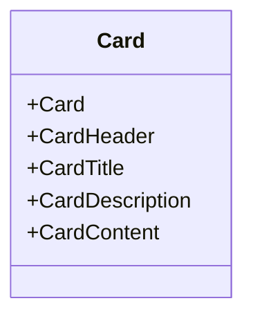

**图表来源**
- [apps/web/src/components/ui/card.tsx:4-48](file://apps/web/src/components/ui/card.tsx#L4-L48)

**章节来源**
- [apps/web/src/components/ui/card.tsx:1-49](file://apps/web/src/components/ui/card.tsx#L1-L49)
- [apps/web/src/pages/Dashboard.tsx:98-193](file://apps/web/src/pages/Dashboard.tsx#L98-L193)

### Alert 系列组件分析

- 设计模式
  - 基础容器与内联封装：Alert 提供基础容器，InlineAlert 封装图标与标题，适合错误与提示场景。
  - 变体控制：destructive 变体用于错误状态，颜色与图标随变体切换。
- 复用策略
  - 在登录页与仪表盘中分别用于验证码加载失败与健康检查失败提示。

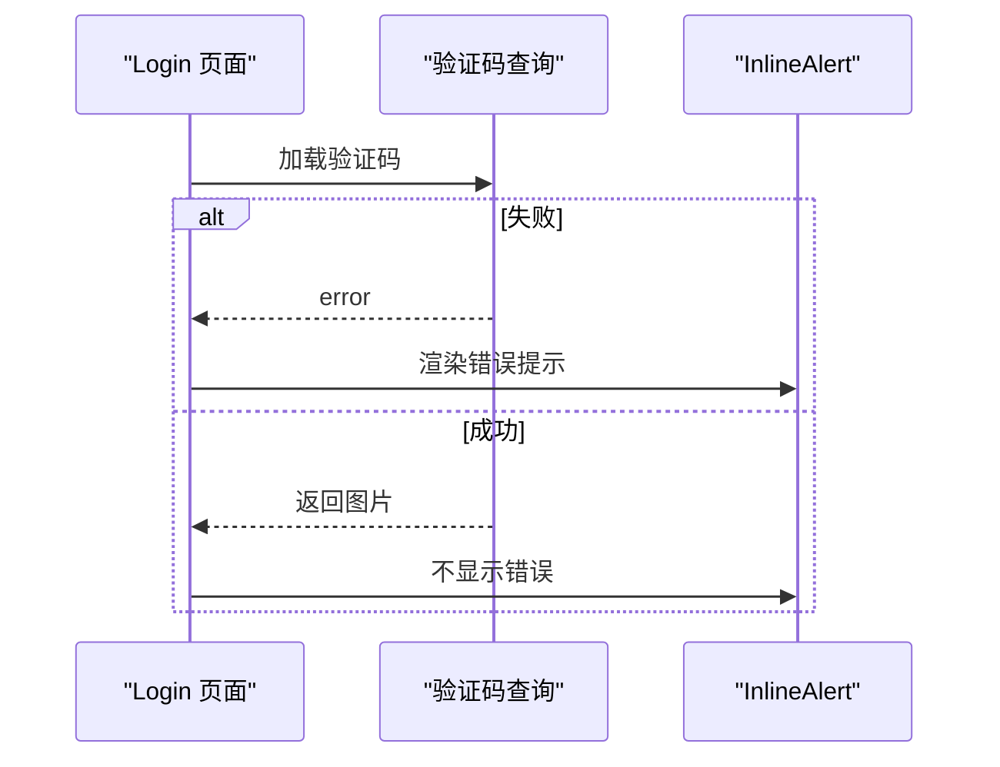

**图表来源**
- [apps/web/src/pages/Login.tsx:164-185](file://apps/web/src/pages/Login.tsx#L164-L185)
- [apps/web/src/components/ui/alert.tsx:37-59](file://apps/web/src/components/ui/alert.tsx#L37-L59)

**章节来源**
- [apps/web/src/components/ui/alert.tsx:1-62](file://apps/web/src/components/ui/alert.tsx#L1-L62)
- [apps/web/src/pages/Login.tsx:1-221](file://apps/web/src/pages/Login.tsx#L1-L221)
- [apps/web/src/pages/Dashboard.tsx:122-128](file://apps/web/src/pages/Dashboard.tsx#L122-L128)

### Spinner 组件分析

- 设计模式
  - 单一职责：仅负责旋转动画与尺寸控制，常与条件渲染配合。
- 复用策略
  - 在登录页与仪表盘中用于加载态占位。

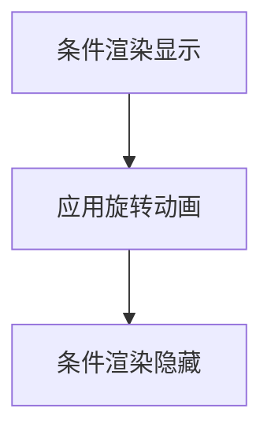

**图表来源**
- [apps/web/src/components/ui/spinner.tsx:3-12](file://apps/web/src/components/ui/spinner.tsx#L3-L12)
- [apps/web/src/pages/Login.tsx:165-168](file://apps/web/src/pages/Login.tsx#L165-L168)
- [apps/web/src/pages/Dashboard.tsx:122-125](file://apps/web/src/pages/Dashboard.tsx#L122-L125)

**章节来源**
- [apps/web/src/components/ui/spinner.tsx:1-13](file://apps/web/src/components/ui/spinner.tsx#L1-L13)
- [apps/web/src/pages/Login.tsx:1-221](file://apps/web/src/pages/Login.tsx#L1-L221)
- [apps/web/src/pages/Dashboard.tsx:1-205](file://apps/web/src/pages/Dashboard.tsx#L1-L205)

### 错误处理与全局提示

- 设计模式
  - 事件驱动：ApiErrorSnackbar 订阅全局错误事件，自动弹出并在定时后关闭。
  - 状态管理：通过 useState 管理当前详情，useEffect 管理订阅与清理。
- 复用策略
  - 作为全局提示层，统一错误与警告的呈现风格与交互。

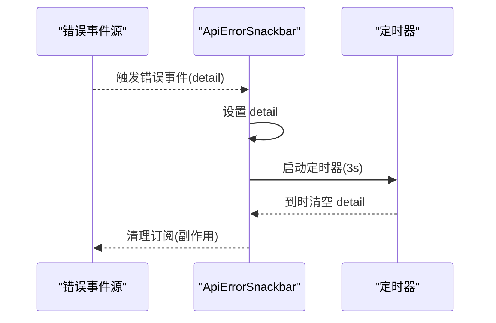

**图表来源**
- [apps/web/src/components/ApiErrorSnackbar.tsx:7-57](file://apps/web/src/components/ApiErrorSnackbar.tsx#L7-L57)

**章节来源**
- [apps/web/src/components/ApiErrorSnackbar.tsx:1-58](file://apps/web/src/components/ApiErrorSnackbar.tsx#L1-L58)

### 主题与样式系统

- 设计要点
  - CSS 自定义属性：通过 :root 与 .dark 定义主题变量，支持明暗主题切换。
  - Tailwind 层：@layer base 应用基础样式，确保组件默认外观一致。
- 复用策略
  - 组件通过语义化 data-slot 与主题变量协同，无需硬编码颜色。

**章节来源**
- [apps/web/src/styles/index.css:51-130](file://apps/web/src/styles/index.css#L51-L130)

## Field 组件系统

### Field 组件系统概述

Field 组件系统代表了从传统 Form 组件模式向更灵活、更具可访问性的表单架构的重大演进。该系统提供了更好的语义化结构、ARIA 属性支持和数据验证反馈机制。

### 核心组件架构

Field 组件系统包含多个专门的子组件，每个都针对特定的表单场景进行了优化：

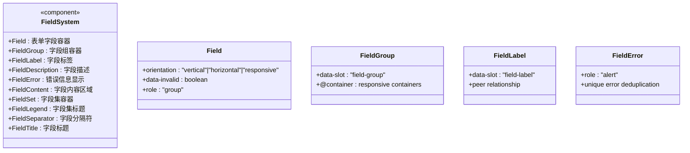

**图表来源**
- [apps/web/src/components/ui/field.tsx:67-222](file://apps/web/src/components/ui/field.tsx#L67-L222)

### 可访问性增强

Field 组件系统在可访问性方面有显著改进：

- **语义化结构**：使用适当的 HTML 语义标记，如 `role="group"` 和 `aria-labelledby`
- **ARIA 属性**：支持 `aria-invalid`、`aria-describedby` 等无障碍属性
- **键盘导航**：保持原生表单控件的键盘交互行为
- **屏幕阅读器支持**：通过语义化标签和描述文本提供良好的辅助技术支持

### 数据验证反馈

Field 组件系统提供了强大的数据验证反馈机制：

- **实时验证状态**：通过 `data-invalid` 属性实时反映字段验证状态
- **错误信息聚合**：自动去重和格式化错误消息
- **多错误支持**：支持显示多个验证错误
- **与表单 Hook 集成**：无缝集成 React Hook Form 的验证状态

**章节来源**
- [apps/web/src/components/ui/field.tsx:1-222](file://apps/web/src/components/ui/field.tsx#L1-L222)

## 表单设计模式演进

### 从 Form 到 Field 的转变

传统的 Form 组件模式存在以下局限性：

- 缺乏语义化结构
- 可访问性支持不足
- 验证状态反馈有限
- 样式定制困难

Field 组件系统解决了这些问题：

#### 1. 语义化表单结构

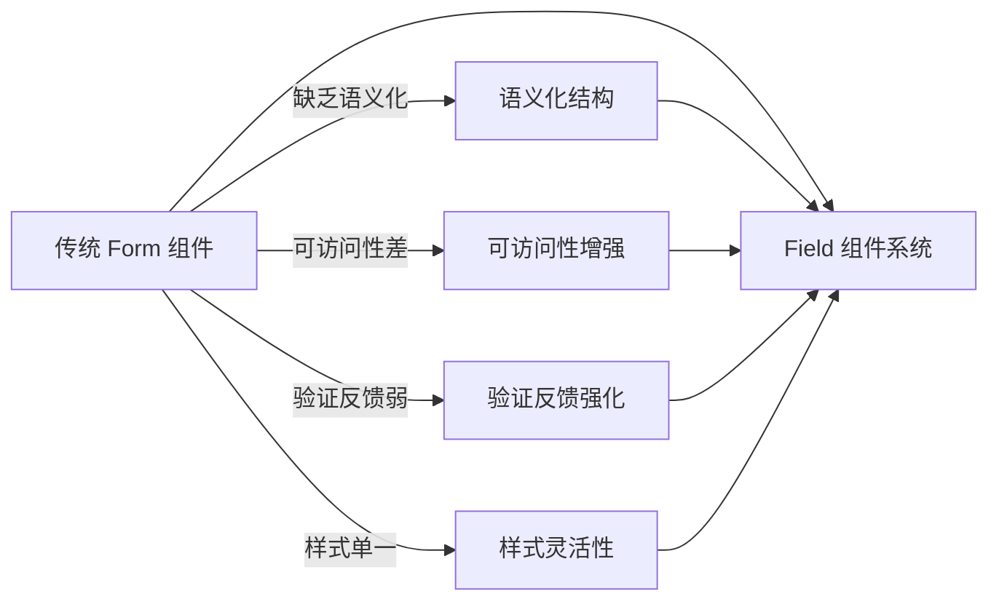

#### 2. 响应式布局支持

Field 组件系统支持多种布局方向：

- **垂直布局**：默认布局，适合表单页面
- **水平布局**：适合设置页面和紧凑布局
- **响应式布局**：根据屏幕尺寸自动调整布局

#### 3. 组件化表单构建

Field 组件系统鼓励组件化的表单构建方式：

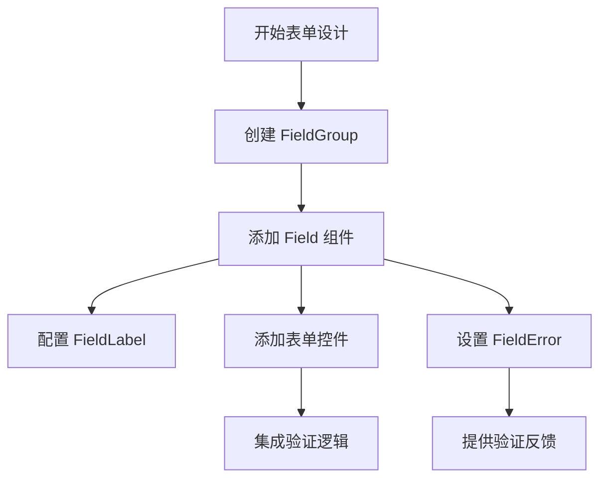

### 最佳实践

#### 1. 字段状态管理

```typescript
<Controller
  name="fieldName"
  control={form.control}
  render={({ field, fieldState }) => (
    <Field data-invalid={fieldState.invalid}>
      <FieldLabel htmlFor={field.name}>
        {fieldState.invalid ? "❌ 字段名称" : "字段名称"}
      </FieldLabel>
      <Input
        {...field}
        id={field.name}
        aria-invalid={fieldState.invalid}
      />
      {fieldState.invalid && <FieldError errors={[fieldState.error]} />}
    </Field>
  )}
/>
```

#### 2. 错误处理策略

Field 组件系统提供了灵活的错误处理机制：

- **单个错误**：直接显示错误消息
- **多个错误**：显示错误列表
- **自定义错误**：支持自定义错误内容

#### 3. 可访问性实现

```typescript
<Field data-invalid={fieldState.invalid}>
  <FieldLabel 
    htmlFor={field.name}
    className={fieldState.invalid ? "text-destructive" : ""}
  >
    {fieldState.invalid ? "⚠️ " : ""}用户名
  </FieldLabel>
  <Input
    {...field}
    id={field.name}
    aria-invalid={fieldState.invalid}
    aria-describedby={`${field.name}-description`}
  />
  <FieldDescription id={`${field.name}-description`}>
    请输入有效的用户名
  </FieldDescription>
  {fieldState.invalid && (
    <FieldError errors={[fieldState.error]}>
      {fieldState.error?.message}
    </FieldError>
  )}
</Field>
```

**章节来源**
- [apps/web/src/pages/Login.tsx:148-179](file://apps/web/src/pages/Login.tsx#L148-L179)
- [apps/web/src/pages/Menus.tsx:186-224](file://apps/web/src/pages/Menus.tsx#L186-L224)
- [apps/web/src/pages/Users.tsx:36-110](file://apps/web/src/pages/Users.tsx#L36-L110)

## 依赖关系分析

- 组件间耦合
  - Button/Input/Card/Alert/Spinner 均依赖 cn 工具进行类名合并，降低样式耦合。
  - Field 组件系统依赖 Label 和 Separator 组件，提供语义化标签和分隔符功能。
  - 页面组件通过 useNebulaForm Hook 与 Field 组件系统集成，实现类型安全的表单管理。
- 外部依赖
  - class-variance-authority：用于变体与尺寸的声明式样式生成。
  - radix-ui Slot：用于 asChild 透传。
  - Zustand：UiStore 管理 UI 状态（移动端侧边栏、折叠状态）。
  - React Query：页面层的数据加载与错误处理。
  - React Hook Form：提供表单状态管理和验证功能。
  - Zod：提供运行时类型验证和类型推断。

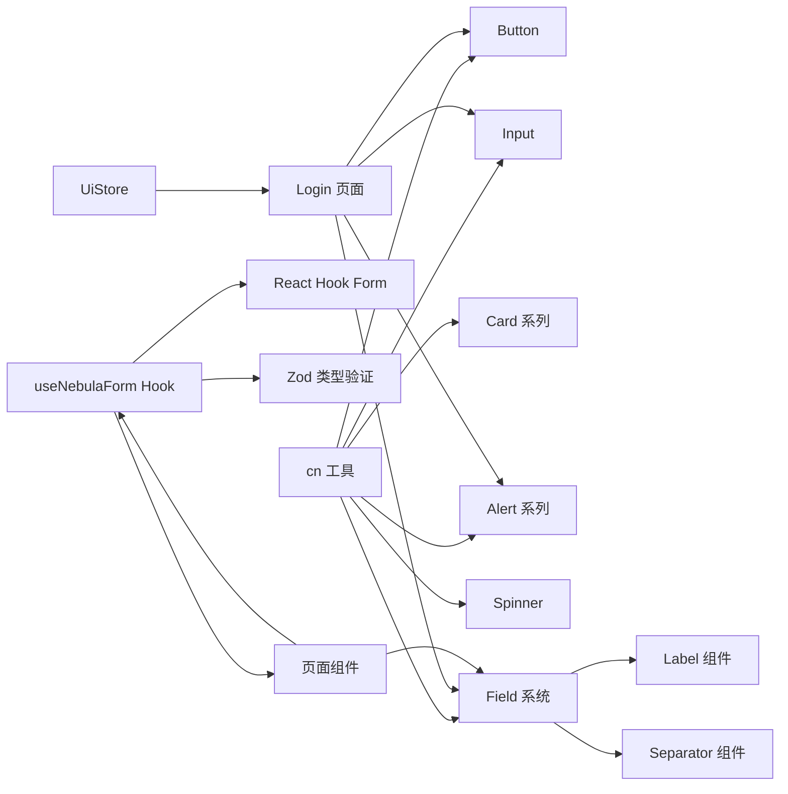

**图表来源**
- [apps/web/src/lib/utils.ts:4-6](file://apps/web/src/lib/utils.ts#L4-L6)
- [apps/web/src/components/ui/button.tsx:2-5](file://apps/web/src/components/ui/button.tsx#L2-L5)
- [apps/web/src/components/ui/field.tsx:4-6](file://apps/web/src/components/ui/field.tsx#L4-L6)
- [apps/web/src/hooks/use-nebula-form.ts:1-30](file://apps/web/src/hooks/use-nebula-form.ts#L1-L30)
- [apps/web/src/store/ui.ts:20-42](file://apps/web/src/store/ui.ts#L20-L42)

**章节来源**
- [apps/web/src/lib/utils.ts:1-7](file://apps/web/src/lib/utils.ts#L1-L7)
- [apps/web/src/components/ui/button.tsx:1-68](file://apps/web/src/components/ui/button.tsx#L1-L68)
- [apps/web/src/components/ui/field.tsx:1-222](file://apps/web/src/components/ui/field.tsx#L1-L222)
- [apps/web/src/hooks/use-nebula-form.ts:1-30](file://apps/web/src/hooks/use-nebula-form.ts#L1-L30)
- [apps/web/src/store/ui.ts:1-43](file://apps/web/src/store/ui.ts#L1-L43)

## 性能考量

- 样式合并
  - 使用 twMerge 与 clsx 合并类名，避免重复与冲突，减少重绘。
- 条件渲染
  - Spinner 与错误提示按需渲染，避免不必要的 DOM 更新。
- 状态粒度
  - UiStore 仅管理 UI 状态，避免与业务数据混合导致不必要重渲染。
- 表单受控
  - Input 采用受控模式，减少外部状态同步成本，同时利于表单验证与联动。
- **新增** Field 组件系统优化
  - 使用 useMemo 优化错误消息计算，避免重复渲染
  - 通过 data-* 属性实现样式状态管理，减少 JavaScript 计算
  - 支持响应式容器，优化移动端体验

## 故障排查指南

- 输入无响应
  - 检查父组件是否正确传递 value 与 onChange；确认 Input 是否被禁用。
  - 参考：[Input 组件实现:4-16](file://apps/web/src/components/ui/input.tsx#L4-L16)
- 按钮样式异常
  - 检查 variant/size 参数是否在定义范围内；确认 data-slot 与主题变量生效。
  - 参考：[Button 变体定义:7-42](file://apps/web/src/components/ui/button.tsx#L7-L42)
- 错误提示未消失
  - 检查 ApiErrorSnackbar 的定时器与 detail 状态；确认事件订阅是否正确清理。
  - 参考：[ApiErrorSnackbar:16-28](file://apps/web/src/components/ApiErrorSnackbar.tsx#L16-L28)
- 主题色不生效
  - 检查 :root 与 .dark 中的主题变量是否正确设置；确认组件是否使用语义化类名。
  - 参考：[主题变量:51-118](file://apps/web/src/styles/index.css#L51-L118)
- **新增** Field 组件问题
  - 检查 Field 组件的 orientation 属性是否正确设置
  - 确认 aria-invalid 属性与 data-invalid 属性同步更新
  - 验证 FieldError 组件是否正确接收和显示错误信息
  - 参考：[Field 组件实现:67-222](file://apps/web/src/components/ui/field.tsx#L67-L222)

**章节来源**
- [apps/web/src/components/ui/input.tsx:1-19](file://apps/web/src/components/ui/input.tsx#L1-L19)
- [apps/web/src/components/ui/button.tsx:1-68](file://apps/web/src/components/ui/button.tsx#L1-L68)
- [apps/web/src/components/ApiErrorSnackbar.tsx:1-58](file://apps/web/src/components/ApiErrorSnackbar.tsx#L1-L58)
- [apps/web/src/styles/index.css:51-130](file://apps/web/src/styles/index.css#L51-L130)
- [apps/web/src/components/ui/field.tsx:1-222](file://apps/web/src/components/ui/field.tsx#L1-L222)

## 结论

本仓库的组件设计经历了从传统 Form 组件模式向现代 Field 组件系统的重大演进。新的架构通过引入语义化结构、增强可访问性支持、提供强大的数据验证反馈机制，实现了更高水平的用户体验和开发效率。

新架构的核心优势包括：

- **可访问性优先**：通过语义化标记和 ARIA 属性提供良好的辅助技术支持
- **类型安全**：结合 Zod 和 React Hook Form，提供完整的类型推断和验证
- **组件化设计**：Field 组件系统鼓励模块化的表单构建方式
- **响应式支持**：内置响应式布局，适应不同设备和屏幕尺寸
- **错误处理**：提供灵活且强大的错误显示和反馈机制

建议在新增组件时延续 Field 组件系统的设计理念：优先使用语义化组件、确保可访问性、提供清晰的错误反馈、保持类型安全，并通过 data-* 属性增强可测试性和可维护性。

## 附录

### 组件 Props 设计建议

- 优先使用 React.ComponentProps<'原生标签'>透传原生能力
- 使用 VariantProps 从 cva 中提取变体/尺寸类型
- 通过 asChild 支持语义化与可组合性
- **新增** Field 组件系统：使用 data-invalid 和 aria-invalid 属性同步状态

### 表单设计模式

- **传统模式**：Form 组件 + 直接的表单控件
- **Field 模式**：Field 组件 + Controller 包装的表单控件
- **受控组件**：由父组件维护 value 与 onChange
- **非受控组件**：适用于一次性读取值的场景（如文件选择）

### 错误处理

- 使用事件订阅 + 定时器的全局提示模式，统一错误呈现
- **新增** Field 组件系统：提供本地化的错误显示和反馈

### 组合模式

- Card/Alert/Spinner 等小而专的组件组合成复杂页面区块
- **新增** Field 组件系统：FieldGroup + Field + FieldLabel + FieldError 的组合模式

### Field 组件系统最佳实践

- 使用 FieldGroup 包装相关字段
- 为每个字段提供清晰的 FieldLabel
- 集成 FieldError 组件显示验证状态
- 根据场景选择合适的 orientation（vertical/horizontal/responsive）
- 确保正确的 ARIA 属性设置和可访问性支持