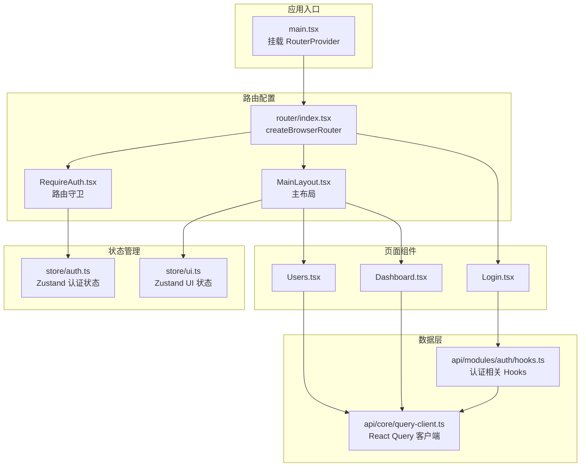
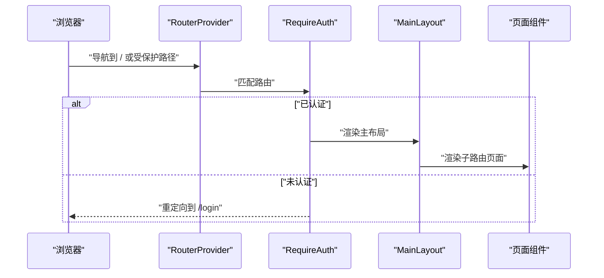
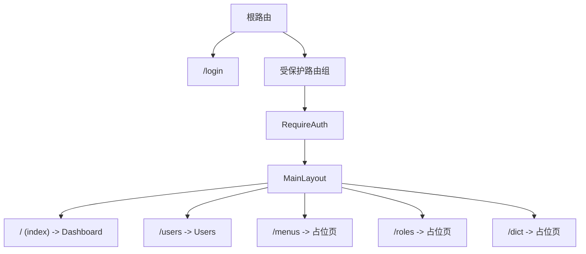
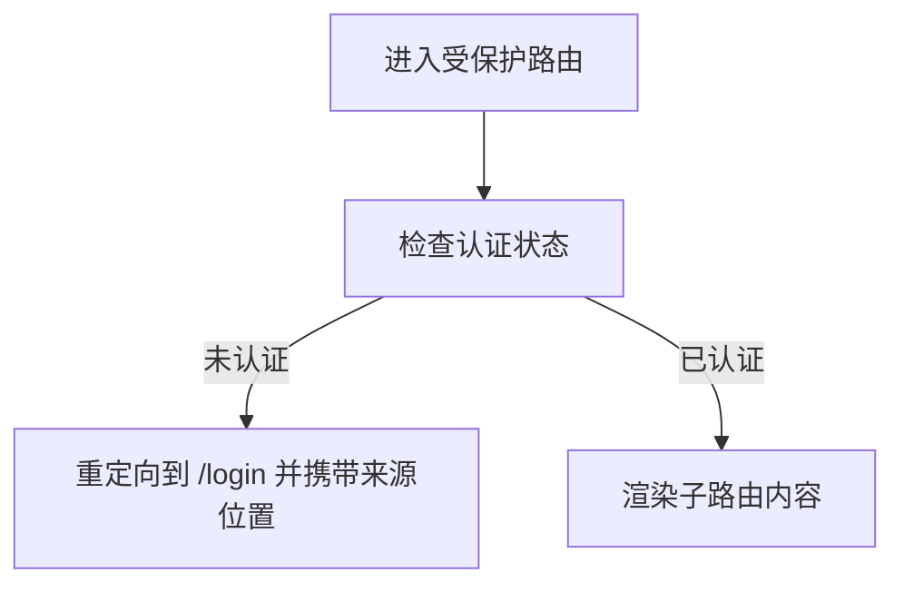
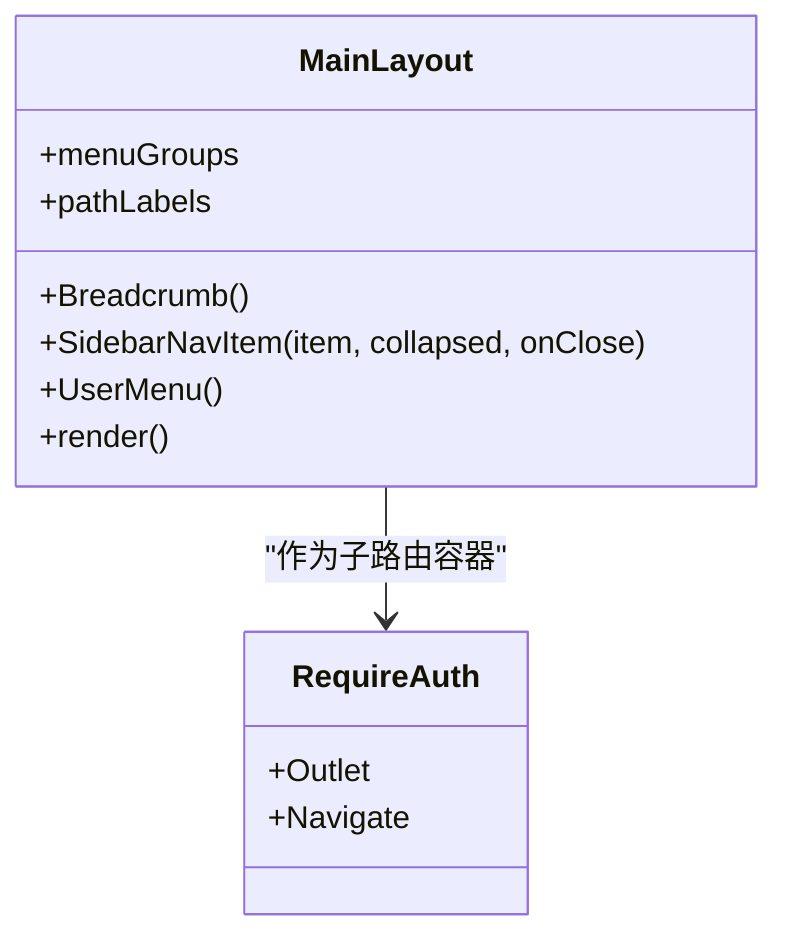
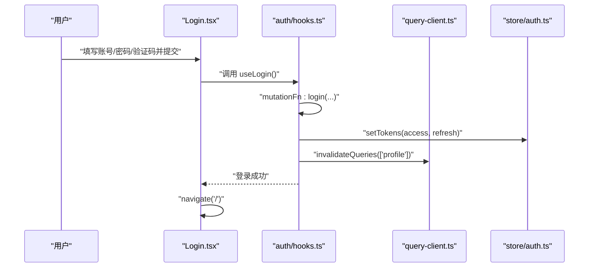
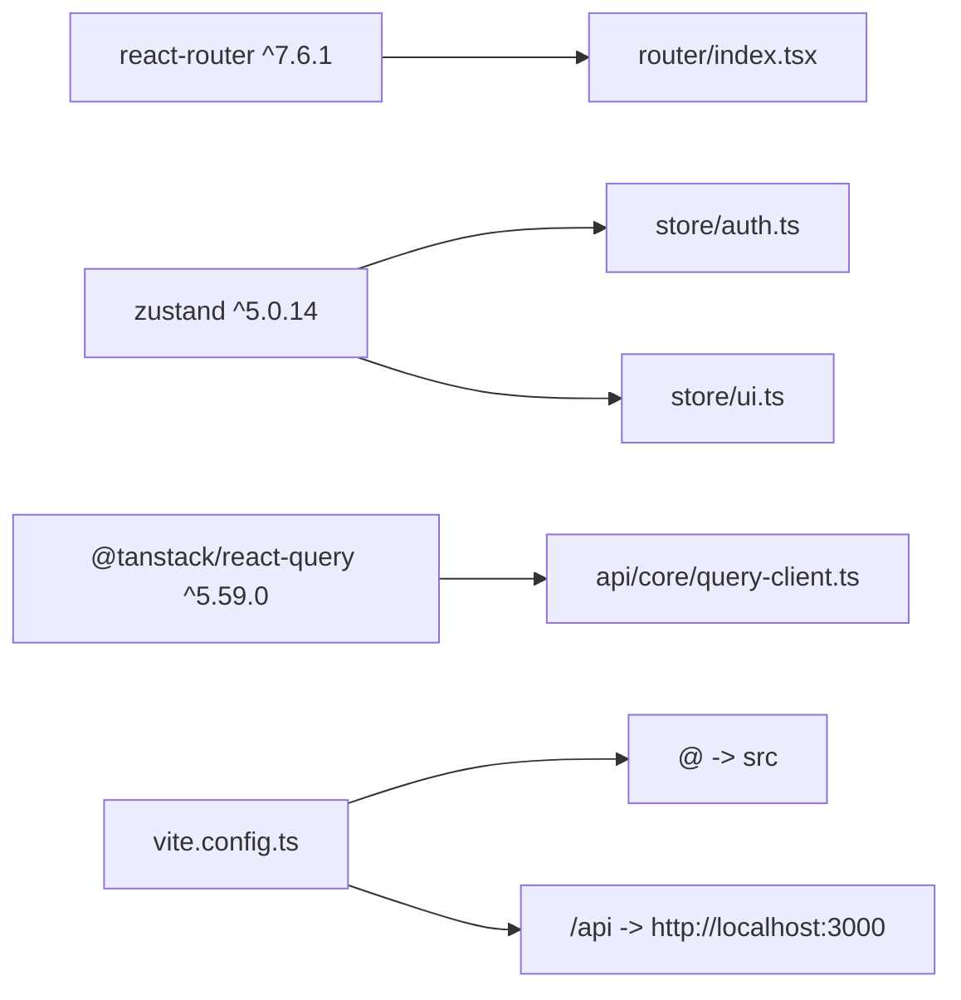

# 路由系统设计

<cite>
**本文档引用的文件**
- [apps/web/src/router/index.tsx](file://apps/web/src/router/index.tsx)
- [apps/web/src/main.tsx](file://apps/web/src/main.tsx)
- [apps/web/src/layouts/MainLayout.tsx](file://apps/web/src/layouts/MainLayout.tsx)
- [apps/web/src/components/RequireAuth.tsx](file://apps/web/src/components/RequireAuth.tsx)
- [apps/web/src/store/auth.ts](file://apps/web/src/store/auth.ts)
- [apps/web/src/store/ui.ts](file://apps/web/src/store/ui.ts)
- [apps/web/src/pages/Dashboard.tsx](file://apps/web/src/pages/Dashboard.tsx)
- [apps/web/src/pages/Login.tsx](file://apps/web/src/pages/Login.tsx)
- [apps/web/src/pages/Users.tsx](file://apps/web/src/pages/Users.tsx)
- [apps/web/src/api/modules/auth/hooks.ts](file://apps/web/src/api/modules/auth/hooks.ts)
- [apps/web/src/api/core/query-client.ts](file://apps/web/src/api/core/query-client.ts)
- [apps/web/package.json](file://apps/web/package.json)
- [apps/web/vite.config.ts](file://apps/web/vite.config.ts)
</cite>

## 目录
1. [简介](#简介)
2. [项目结构](#项目结构)
3. [核心组件](#核心组件)
4. [架构总览](#架构总览)
5. [详细组件分析](#详细组件分析)
6. [依赖关系分析](#依赖关系分析)
7. [性能考虑](#性能考虑)
8. [故障排除指南](#故障排除指南)
9. [结论](#结论)
10. [附录](#附录)

## 简介
本文件系统性梳理了基于 React Router 7 的前端路由体系设计，涵盖路由层级结构、嵌套路由设计、路由守卫机制、主布局组件模式、页面组件组织方式、路由参数传递、懒加载与代码分割、路由预加载策略，以及路由状态管理最佳实践。文档同时结合实际源码路径，为技术与非技术读者提供可操作的参考。

## 项目结构
Web 应用采用分层清晰的目录组织：
- 路由入口与配置位于 `apps/web/src/router/index.tsx`
- 应用根节点在 `apps/web/src/main.tsx` 中挂载 RouterProvider
- 主布局组件 `MainLayout` 提供侧边栏、面包屑、页头与页脚
- 页面组件按功能模块划分，如仪表盘、登录、用户管理等
- 路由守卫通过 `RequireAuth` 组件实现
- 状态管理使用 Zustand，分别维护认证状态与 UI 状态
- 数据层通过 React Query 管理查询与缓存

**图表来源**
- [apps/web/src/main.tsx:12-22](file://apps/web/src/main.tsx#L12-L22)
- [apps/web/src/router/index.tsx:12-48](file://apps/web/src/router/index.tsx#L12-L48)
- [apps/web/src/components/RequireAuth.tsx:4-13](file://apps/web/src/components/RequireAuth.tsx#L4-L13)
- [apps/web/src/layouts/MainLayout.tsx:172-316](file://apps/web/src/layouts/MainLayout.tsx#L172-L316)
- [apps/web/src/pages/Login.tsx:60-220](file://apps/web/src/pages/Login.tsx#L60-L220)
- [apps/web/src/pages/Dashboard.tsx:81-196](file://apps/web/src/pages/Dashboard.tsx#L81-L196)
- [apps/web/src/pages/Users.tsx:6-33](file://apps/web/src/pages/Users.tsx#L6-L33)
- [apps/web/src/store/auth.ts:30-63](file://apps/web/src/store/auth.ts#L30-L63)
- [apps/web/src/store/ui.ts:20-42](file://apps/web/src/store/ui.ts#L20-L42)
- [apps/web/src/api/core/query-client.ts:5-31](file://apps/web/src/api/core/query-client.ts#L5-L31)
- [apps/web/src/api/modules/auth/hooks.ts:5-48](file://apps/web/src/api/modules/auth/hooks.ts#L5-L48)

**章节来源**
- [apps/web/src/main.tsx:12-22](file://apps/web/src/main.tsx#L12-L22)
- [apps/web/src/router/index.tsx:12-48](file://apps/web/src/router/index.tsx#L12-L48)

## 核心组件
- 路由器实例：通过 `createBrowserRouter` 创建，集中定义路径与组件映射
- 路由守卫：`RequireAuth` 在受保护路由前校验认证状态
- 主布局：`MainLayout` 提供侧边栏导航、面包屑、页头与内容区域
- 页面组件：登录、仪表盘、用户管理等，职责单一且与数据层解耦
- 状态管理：Zustand 认证状态持久化与 UI 状态（侧边栏折叠、移动端开关）

**章节来源**
- [apps/web/src/router/index.tsx:12-48](file://apps/web/src/router/index.tsx#L12-L48)
- [apps/web/src/components/RequireAuth.tsx:4-13](file://apps/web/src/components/RequireAuth.tsx#L4-L13)
- [apps/web/src/layouts/MainLayout.tsx:172-316](file://apps/web/src/layouts/MainLayout.tsx#L172-L316)
- [apps/web/src/store/auth.ts:30-63](file://apps/web/src/store/auth.ts#L30-L63)
- [apps/web/src/store/ui.ts:20-42](file://apps/web/src/store/ui.ts#L20-L42)

## 架构总览
React Router 7 的路由体系采用“顶层路由器 + 嵌套路由 + 路由守卫”的组合模式：
- 顶层路由：登录页直连；受保护路由通过 `RequireAuth` 包裹
- 嵌套层级：`RequireAuth` -> `MainLayout` -> 具体页面（仪表盘、用户管理等）
- 导航与状态：`MainLayout` 内部使用 `NavLink` 实现导航高亮与侧边栏交互，UI 状态由 `useUiStore` 管理
- 认证流程：登录成功后写入认证状态，触发查询失效与重定向

**图表来源**
- [apps/web/src/main.tsx:16](file://apps/web/src/main.tsx#L16)
- [apps/web/src/components/RequireAuth.tsx:4-13](file://apps/web/src/components/RequireAuth.tsx#L4-L13)
- [apps/web/src/layouts/MainLayout.tsx:172-316](file://apps/web/src/layouts/MainLayout.tsx#L172-L316)
- [apps/web/src/router/index.tsx:12-48](file://apps/web/src/router/index.tsx#L12-L48)

## 详细组件分析

### 路由配置与层级结构
- 顶层路由：登录页直连 `/login`
- 受保护路由：通过 `RequireAuth` 包裹，内部为 `MainLayout`，再嵌套具体页面
- 首页默认展示：通过 index 路由指向仪表盘
- 待开发页面：菜单、角色、字典等以占位页形式预留路由

**图表来源**
- [apps/web/src/router/index.tsx:12-48](file://apps/web/src/router/index.tsx#L12-L48)

**章节来源**
- [apps/web/src/router/index.tsx:12-48](file://apps/web/src/router/index.tsx#L12-L48)

### 路由守卫机制
- 守卫组件读取当前路径与认证状态
- 未认证时重定向至登录页，并携带来源位置
- 已认证则渲染子路由内容

**图表来源**
- [apps/web/src/components/RequireAuth.tsx:4-13](file://apps/web/src/components/RequireAuth.tsx#L4-L13)

**章节来源**
- [apps/web/src/components/RequireAuth.tsx:4-13](file://apps/web/src/components/RequireAuth.tsx#L4-L13)
- [apps/web/src/store/auth.ts:30-63](file://apps/web/src/store/auth.ts#L30-L63)

### 主布局组件设计模式
- 菜单配置：通过配置数组生成导航项，支持图标与文本
- 面包屑：根据路径映射显示当前页面标签
- 侧边栏：支持桌面端折叠与移动端滑出，状态由 UI Store 管理
- 页头与页脚：统一的头部工具区与页脚版权信息
- 内容区域：通过 `Outlet` 渲染子路由页面

**图表来源**
- [apps/web/src/layouts/MainLayout.tsx:32-46](file://apps/web/src/layouts/MainLayout.tsx#L32-L46)
- [apps/web/src/layouts/MainLayout.tsx:49-55](file://apps/web/src/layouts/MainLayout.tsx#L49-L55)
- [apps/web/src/layouts/MainLayout.tsx:75-115](file://apps/web/src/layouts/MainLayout.tsx#L75-L115)
- [apps/web/src/layouts/MainLayout.tsx:118-169](file://apps/web/src/layouts/MainLayout.tsx#L118-L169)
- [apps/web/src/layouts/MainLayout.tsx:172-316](file://apps/web/src/layouts/MainLayout.tsx#L172-L316)

**章节来源**
- [apps/web/src/layouts/MainLayout.tsx:32-46](file://apps/web/src/layouts/MainLayout.tsx#L32-L46)
- [apps/web/src/layouts/MainLayout.tsx:49-55](file://apps/web/src/layouts/MainLayout.tsx#L49-L55)
- [apps/web/src/layouts/MainLayout.tsx:75-115](file://apps/web/src/layouts/MainLayout.tsx#L75-L115)
- [apps/web/src/layouts/MainLayout.tsx:118-169](file://apps/web/src/layouts/MainLayout.tsx#L118-L169)
- [apps/web/src/layouts/MainLayout.tsx:172-316](file://apps/web/src/layouts/MainLayout.tsx#L172-L316)

### 页面组件组织方式
- 登录页：负责表单输入、验证码加载与登录提交，成功后重定向至首页
- 仪表盘：展示欢迎语、统计卡片与服务状态，依赖健康检查与用户资料查询
- 用户管理：展示用户列表，处理加载与错误状态

**图表来源**
- [apps/web/src/pages/Login.tsx:60-220](file://apps/web/src/pages/Login.tsx#L60-L220)
- [apps/web/src/api/modules/auth/hooks.ts:12-22](file://apps/web/src/api/modules/auth/hooks.ts#L12-L22)
- [apps/web/src/api/core/query-client.ts:5-31](file://apps/web/src/api/core/query-client.ts#L5-L31)
- [apps/web/src/store/auth.ts:36-46](file://apps/web/src/store/auth.ts#L36-L46)

**章节来源**
- [apps/web/src/pages/Login.tsx:60-220](file://apps/web/src/pages/Login.tsx#L60-L220)
- [apps/web/src/pages/Dashboard.tsx:81-196](file://apps/web/src/pages/Dashboard.tsx#L81-L196)
- [apps/web/src/pages/Users.tsx:6-33](file://apps/web/src/pages/Users.tsx#L6-L33)
- [apps/web/src/api/modules/auth/hooks.ts:5-48](file://apps/web/src/api/modules/auth/hooks.ts#L5-L48)
- [apps/web/src/api/core/query-client.ts:5-31](file://apps/web/src/api/core/query-client.ts#L5-L31)

### 路由参数传递
- 当前实现未使用动态路由参数与查询参数，导航通过静态路径完成
- 若需扩展参数传递，可在路由定义中使用路径参数并在页面组件中通过路由钩子读取

**章节来源**
- [apps/web/src/router/index.tsx:24-44](file://apps/web/src/router/index.tsx#L24-L44)

### 路由懒加载与代码分割
- 当前路由直接导入页面组件，未使用 React.lazy 与 Suspense
- 推荐方案：对大型页面组件使用动态导入进行懒加载，结合骨架屏提升首屏体验

**章节来源**
- [apps/web/src/router/index.tsx:4-6](file://apps/web/src/router/index.tsx#L4-L6)

### 路由预加载策略
- 当前未实现预加载逻辑
- 建议：在用户悬停导航项或即将进入页面时，提前触发相关查询（如用户资料、菜单树）以减少白屏时间

**章节来源**
- [apps/web/src/layouts/MainLayout.tsx:236-245](file://apps/web/src/layouts/MainLayout.tsx#L236-L245)
- [apps/web/src/api/core/query-client.ts:16-31](file://apps/web/src/api/core/query-client.ts#L16-L31)

## 依赖关系分析
- 路由层依赖：React Router 7、Zustand、React Query
- 构建层：Vite 配置别名与代理，便于开发调试
- 组件层：UI 基于 shadcn 组件库，样式使用 TailwindCSS

**图表来源**
- [apps/web/package.json:25](file://apps/web/package.json#L25)
- [apps/web/src/router/index.tsx:1-3](file://apps/web/src/router/index.tsx#L1-L3)
- [apps/web/src/store/auth.ts:1-2](file://apps/web/src/store/auth.ts#L1-L2)
- [apps/web/src/store/ui.ts:1](file://apps/web/src/store/ui.ts#L1)
- [apps/web/src/api/core/query-client.ts:1-3](file://apps/web/src/api/core/query-client.ts#L1-L3)
- [apps/web/vite.config.ts:8-21](file://apps/web/vite.config.ts#L8-L21)

**章节来源**
- [apps/web/package.json:14-28](file://apps/web/package.json#L14-L28)
- [apps/web/vite.config.ts:8-21](file://apps/web/vite.config.ts#L8-L21)

## 性能考虑
- 查询缓存与过期：React Query 默认查询缓存 30 秒，窗口聚焦不自动刷新，避免频繁请求
- 重试策略：业务错误中的未授权场景不重试，普通错误最多重试两次
- 认证失效：登录成功后主动失效 profile 查询，确保数据一致性
- UI 状态：侧边栏折叠与移动端开关状态本地持久化，减少重复计算

**章节来源**
- [apps/web/src/api/core/query-client.ts:16-31](file://apps/web/src/api/core/query-client.ts#L16-L31)
- [apps/web/src/store/auth.ts:44-46](file://apps/web/src/store/auth.ts#L44-L46)
- [apps/web/src/store/ui.ts:20-42](file://apps/web/src/store/ui.ts#L20-L42)

## 故障排除指南
- 登录失败：检查验证码 ID 是否存在、账号密码是否正确；登录失败会显示错误提示
- 未认证跳转：若未登录访问受保护路由，将被重定向到登录页并携带来源位置
- 数据加载异常：React Query 的全局错误处理器会统一上报 API 错误，页面组件可根据状态显示错误提示
- 侧边栏异常：UI Store 提供切换与关闭方法，确认事件绑定与状态同步

**章节来源**
- [apps/web/src/pages/Login.tsx:199-203](file://apps/web/src/pages/Login.tsx#L199-L203)
- [apps/web/src/components/RequireAuth.tsx:8-10](file://apps/web/src/components/RequireAuth.tsx#L8-L10)
- [apps/web/src/api/core/query-client.ts:7-15](file://apps/web/src/api/core/query-client.ts#L7-L15)
- [apps/web/src/store/ui.ts:26-38](file://apps/web/src/store/ui.ts#L26-L38)

## 结论
该路由系统以 React Router 7 为核心，结合 RequireAuth 守卫与 MainLayout 布局，实现了清晰的层级结构与良好的用户体验。通过 Zustand 管理认证与 UI 状态，配合 React Query 的查询缓存与错误处理，整体具备可维护性与可扩展性。建议后续引入懒加载与预加载策略，进一步优化性能与交互体验。

## 附录
- 路由配置示例：参考 [apps/web/src/router/index.tsx:12-48](file://apps/web/src/router/index.tsx#L12-L48)
- 导航组件实现：参考 [apps/web/src/layouts/MainLayout.tsx:236-245](file://apps/web/src/layouts/MainLayout.tsx#L236-L245)
- 路由状态管理最佳实践：
  - 认证状态持久化与恢复：参考 [apps/web/src/store/auth.ts:30-63](file://apps/web/src/store/auth.ts#L30-L63)
  - UI 状态本地化：参考 [apps/web/src/store/ui.ts:20-42](file://apps/web/src/store/ui.ts#L20-L42)
  - 查询客户端配置：参考 [apps/web/src/api/core/query-client.ts:5-31](file://apps/web/src/api/core/query-client.ts#L5-L31)