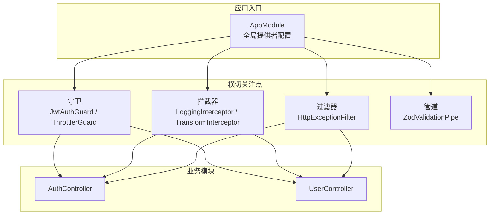
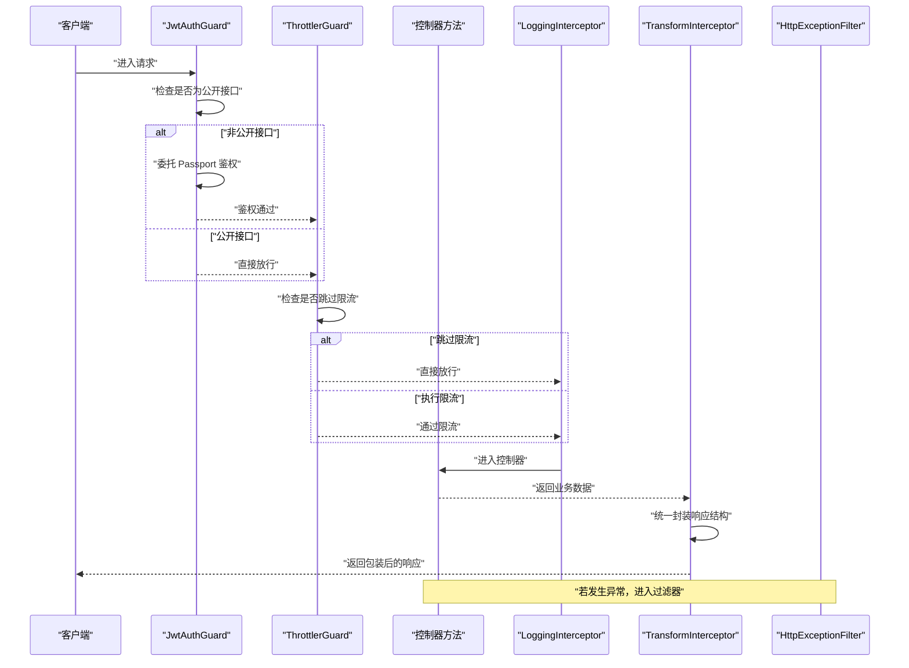
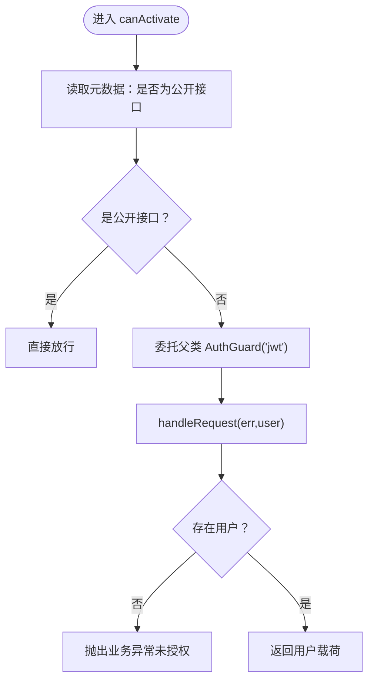
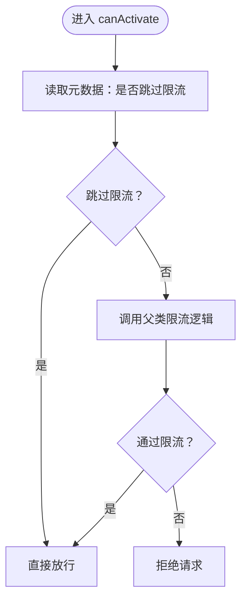
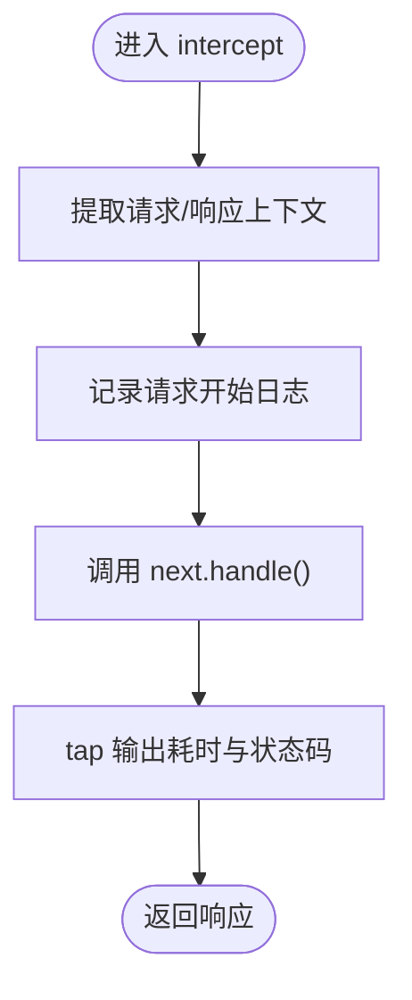
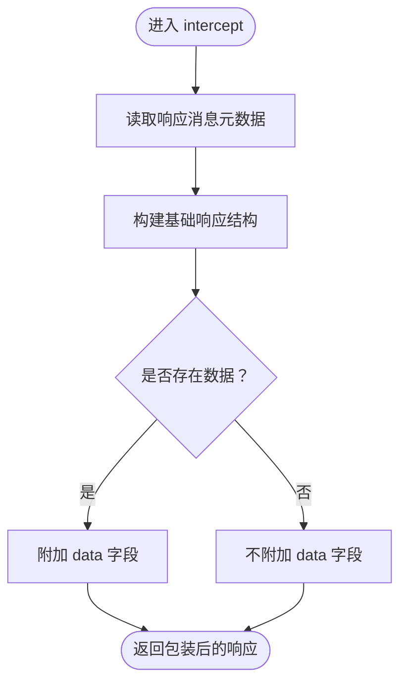
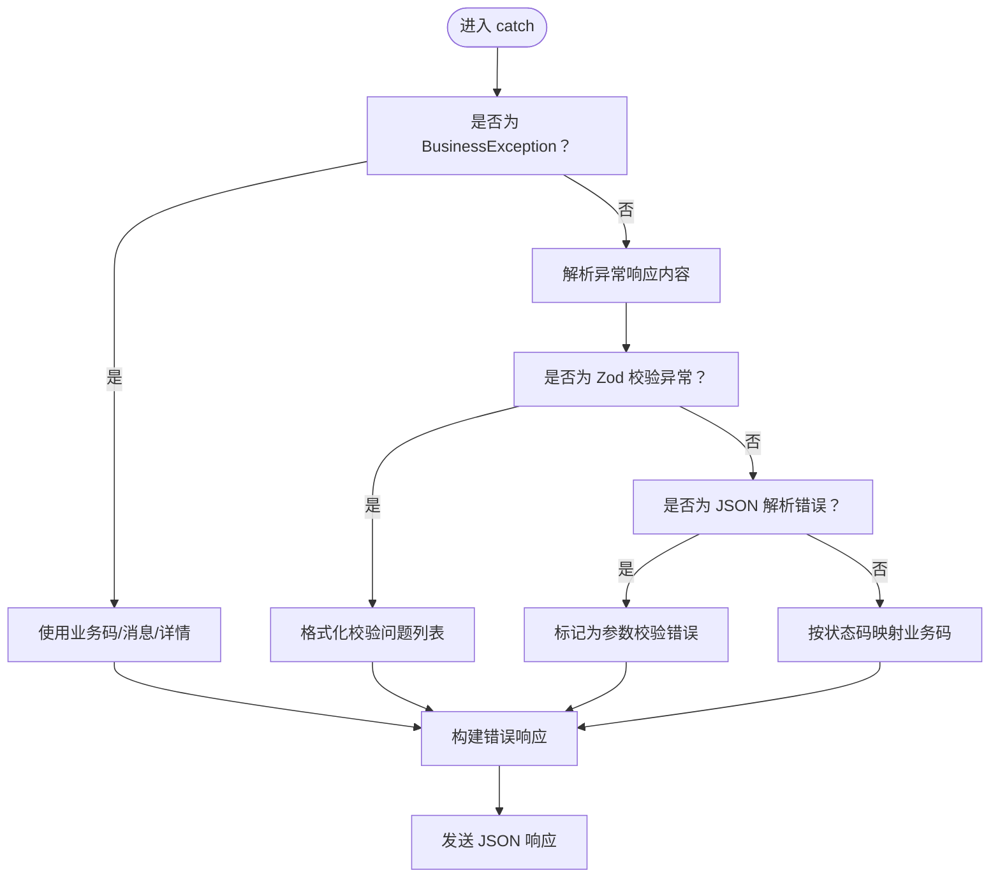
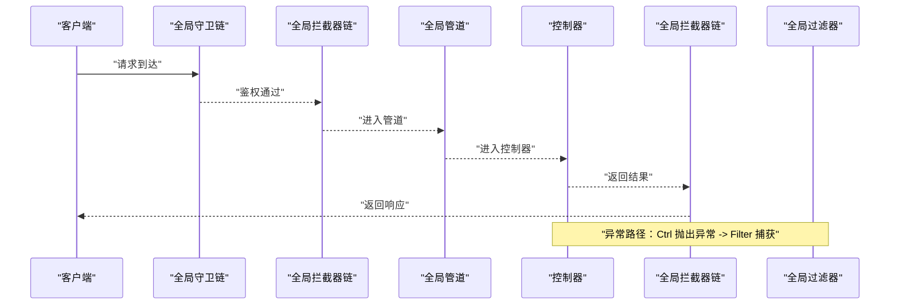
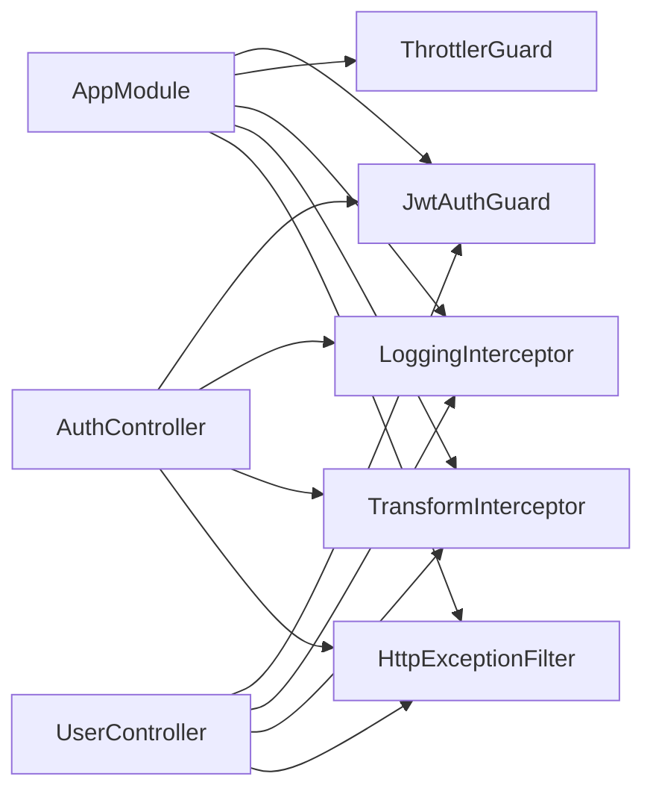

# 中间件与拦截器

<cite>
**本文引用的文件**
- [apps/nestjs-server/src/app.module.ts](file://apps/nestjs-server/src/app.module.ts)
- [apps/nestjs-server/src/common/guards/jwt-auth.guard.ts](file://apps/nestjs-server/src/common/guards/jwt-auth.guard.ts)
- [apps/nestjs-server/src/common/guards/throttler.guard.ts](file://apps/nestjs-server/src/common/guards/throttler.guard.ts)
- [apps/nestjs-server/src/common/decorators/public.decorator.ts](file://apps/nestjs-server/src/common/decorators/public.decorator.ts)
- [apps/nestjs-server/src/common/decorators/skip-throttle.decorator.ts](file://apps/nestjs-server/src/common/decorators/skip-throttle.decorator.ts)
- [apps/nestjs-server/src/common/interceptors/logging.interceptor.ts](file://apps/nestjs-server/src/common/interceptors/logging.interceptor.ts)
- [apps/nestjs-server/src/common/interceptors/transform.interceptor.ts](file://apps/nestjs-server/src/common/interceptors/transform.interceptor.ts)
- [apps/nestjs-server/src/common/filters/http-exception.filter.ts](file://apps/nestjs-server/src/common/filters/http-exception.filter.ts)
- [apps/nestjs-server/src/common/dto/api-response.dto.ts](file://apps/nestjs-server/src/common/dto/api-response.dto.ts)
- [apps/nestjs-server/src/common/dto/api-error-response.dto.ts](file://apps/nestjs-server/src/common/dto/api-error-response.dto.ts)
- [apps/nestjs-server/src/common/enums/biz-code.enum.ts](file://apps/nestjs-server/src/common/enums/biz-code.enum.ts)
- [apps/nestjs-server/src/common/exceptions/business.exception.ts](file://apps/nestjs-server/src/common/exceptions/business.exception.ts)
- [apps/nestjs-server/src/common/decorators/api-success-response.decorator.ts](file://apps/nestjs-server/src/common/decorators/api-success-response.decorator.ts)
- [apps/nestjs-server/src/common/decorators/response-message.decorator.ts](file://apps/nestjs-server/src/common/decorators/response-message.decorator.ts)
- [apps/nestjs-server/src/modules/auth/auth.controller.ts](file://apps/nestjs-server/src/modules/auth/auth.controller.ts)
- [apps/nestjs-server/src/modules/user/user.controller.ts](file://apps/nestjs-server/src/modules/user/user.controller.ts)
</cite>

## 目录

1. [引言](#引言)
2. [项目结构](#项目结构)
3. [核心组件](#核心组件)
4. [架构总览](#架构总览)
5. [详细组件分析](#详细组件分析)
6. [依赖关系分析](#依赖关系分析)
7. [性能考量](#性能考量)
8. [故障排查指南](#故障排查指南)
9. [结论](#结论)
10. [附录](#附录)

## 引言

本文件系统性梳理并解释 NestJS 请求处理管道中的中间件与拦截器工作机制，重点覆盖以下方面：

- 守卫（Guards）的身份验证与授权逻辑，包括 JWT 守卫与节流守卫的实现要点
- 拦截器（Interceptors）在数据转换、日志记录与响应包装方面的职责
- 过滤器（Filters）的错误处理与异常捕获机制
- 请求生命周期中各组件的执行顺序与调用时机
- 自定义中间件（守卫/拦截器）的开发指南与实践建议

## 项目结构

本项目采用模块化组织方式，核心横切关注点通过全局提供者集中配置，形成统一的请求处理管道。

图表来源

- [apps/nestjs-server/src/app.module.ts:19-62](file://apps/nestjs-server/src/app.module.ts#L19-L62)

章节来源

- [apps/nestjs-server/src/app.module.ts:19-62](file://apps/nestjs-server/src/app.module.ts#L19-L62)

## 核心组件

- 守卫（Guards）
  - JwtAuthGuard：基于 Passport 的 JWT 守卫，结合反射判断是否为公开接口；鉴权失败时抛出业务异常
  - ThrottlerGuard：继承自 @nestjs/throttler 的 ThrottlerGuard，支持通过装饰器跳过速率限制
- 拦截器（Interceptors）
  - LoggingInterceptor：记录请求方法、URL、用户标识、IP、UA 以及响应状态码与耗时
  - TransformInterceptor：统一包装响应结构，按需携带 data 字段，并支持通过装饰器设置响应消息
- 过滤器（Filters）
  - HttpExceptionFilter：将 HttpException 映射为统一的业务错误响应，兼容 Zod 校验异常与 JSON 解析错误
- 管道（Pipes）
  - ZodValidationPipe：统一请求参数校验，与 Swagger 文档联动

章节来源

- [apps/nestjs-server/src/common/guards/jwt-auth.guard.ts:17-42](file://apps/nestjs-server/src/common/guards/jwt-auth.guard.ts#L17-L42)
- [apps/nestjs-server/src/common/guards/throttler.guard.ts:10-32](file://apps/nestjs-server/src/common/guards/throttler.guard.ts#L10-L32)
- [apps/nestjs-server/src/common/interceptors/logging.interceptor.ts:6-29](file://apps/nestjs-server/src/common/interceptors/logging.interceptor.ts#L6-L29)
- [apps/nestjs-server/src/common/interceptors/transform.interceptor.ts:9-35](file://apps/nestjs-server/src/common/interceptors/transform.interceptor.ts#L9-L35)
- [apps/nestjs-server/src/common/filters/http-exception.filter.ts:16-68](file://apps/nestjs-server/src/common/filters/http-exception.filter.ts#L16-L68)
- [apps/nestjs-server/src/app.module.ts:35-59](file://apps/nestjs-server/src/app.module.ts#L35-L59)

## 架构总览

下图展示一次典型请求在应用内的处理流程，包括守卫、拦截器与过滤器的协作关系。

图表来源

- [apps/nestjs-server/src/common/guards/jwt-auth.guard.ts:23-41](file://apps/nestjs-server/src/common/guards/jwt-auth.guard.ts#L23-L41)
- [apps/nestjs-server/src/common/guards/throttler.guard.ts:20-31](file://apps/nestjs-server/src/common/guards/throttler.guard.ts#L20-L31)
- [apps/nestjs-server/src/common/interceptors/logging.interceptor.ts:10-28](file://apps/nestjs-server/src/common/interceptors/logging.interceptor.ts#L10-L28)
- [apps/nestjs-server/src/common/interceptors/transform.interceptor.ts:13-34](file://apps/nestjs-server/src/common/interceptors/transform.interceptor.ts#L13-L34)
- [apps/nestjs-server/src/common/filters/http-exception.filter.ts:20-68](file://apps/nestjs-server/src/common/filters/http-exception.filter.ts#L20-L68)

## 详细组件分析

### 守卫（Guards）

#### JWT 守卫（JwtAuthGuard）

- 功能要点
  - 通过反射读取“是否为公开接口”的元数据，公开接口直接放行
  - 非公开接口委托父类 AuthGuard('jwt') 完成鉴权
  - handleRequest 中对鉴权失败场景抛出业务异常，便于统一错误处理
- 关键行为
  - 公开接口装饰器：Public
  - 用户载荷类型扩展：RequestWithUser
- 适用范围
  - 默认启用于全局，受控制器/方法级装饰器影响

图表来源

- [apps/nestjs-server/src/common/guards/jwt-auth.guard.ts:23-41](file://apps/nestjs-server/src/common/guards/jwt-auth.guard.ts#L23-L41)
- [apps/nestjs-server/src/common/decorators/public.decorator.ts:3-4](file://apps/nestjs-server/src/common/decorators/public.decorator.ts#L3-L4)

章节来源

- [apps/nestjs-server/src/common/guards/jwt-auth.guard.ts:17-42](file://apps/nestjs-server/src/common/guards/jwt-auth.guard.ts#L17-L42)
- [apps/nestjs-server/src/common/decorators/public.decorator.ts:3-4](file://apps/nestjs-server/src/common/decorators/public.decorator.ts#L3-L4)

#### 节流守卫（ThrottlerGuard）

- 功能要点
  - 通过反射读取“是否跳过限流”的元数据，显式标记的接口绕过限流
  - 默认继承 @nestjs/throttler 的限流策略，支持多组限流配置
- 适用范围
  - 默认启用于全局，可通过装饰器在控制器或方法上跳过

图表来源

- [apps/nestjs-server/src/common/guards/throttler.guard.ts:20-31](file://apps/nestjs-server/src/common/guards/throttler.guard.ts#L20-L31)
- [apps/nestjs-server/src/common/decorators/skip-throttle.decorator.ts:3-11](file://apps/nestjs-server/src/common/decorators/skip-throttle.decorator.ts#L3-L11)

章节来源

- [apps/nestjs-server/src/common/guards/throttler.guard.ts:10-32](file://apps/nestjs-server/src/common/guards/throttler.guard.ts#L10-L32)
- [apps/nestjs-server/src/common/decorators/skip-throttle.decorator.ts:3-11](file://apps/nestjs-server/src/common/decorators/skip-throttle.decorator.ts#L3-L11)

### 拦截器（Interceptors）

#### 日志拦截器（LoggingInterceptor）

- 功能要点
  - 记录请求方法、URL、用户 ID、IP、UA
  - 记录响应状态码与耗时
  - 使用 RxJS tap 在下游处理完成后输出耗时统计
- 注意事项
  - 依赖 JwtAuthGuard 注入的用户载荷以识别用户

图表来源

- [apps/nestjs-server/src/common/interceptors/logging.interceptor.ts:10-28](file://apps/nestjs-server/src/common/interceptors/logging.interceptor.ts#L10-L28)

章节来源

- [apps/nestjs-server/src/common/interceptors/logging.interceptor.ts:6-29](file://apps/nestjs-server/src/common/interceptors/logging.interceptor.ts#L6-L29)

#### 响应转换拦截器（TransformInterceptor）

- 功能要点
  - 统一包装响应结构，包含 code、message、data（可选）
  - 通过反射读取响应消息元数据，决定 message 字段内容
  - 仅在存在数据时携带 data 字段，符合 REST 语义
- 类型契约
  - 输出类型为 ApiResponseType<T>，由共享包提供

图表来源

- [apps/nestjs-server/src/common/interceptors/transform.interceptor.ts:13-34](file://apps/nestjs-server/src/common/interceptors/transform.interceptor.ts#L13-L34)
- [apps/nestjs-server/src/common/decorators/response-message.decorator.ts:3-4](file://apps/nestjs-server/src/common/decorators/response-message.decorator.ts#L3-L4)
- [apps/nestjs-server/src/common/dto/api-response.dto.ts:13](file://apps/nestjs-server/src/common/dto/api-response.dto.ts#L13)

章节来源

- [apps/nestjs-server/src/common/interceptors/transform.interceptor.ts:9-35](file://apps/nestjs-server/src/common/interceptors/transform.interceptor.ts#L9-L35)
- [apps/nestjs-server/src/common/decorators/response-message.decorator.ts:3-4](file://apps/nestjs-server/src/common/decorators/response-message.decorator.ts#L3-L4)
- [apps/nestjs-server/src/common/dto/api-response.dto.ts:13](file://apps/nestjs-server/src/common/dto/api-response.dto.ts#L13)

### 过滤器（Filters）

#### HTTP 异常过滤器（HttpExceptionFilter）

- 功能要点
  - 捕获 HttpException 并映射为统一业务错误响应
  - 优先处理业务异常 BusinessException，保留其业务码与消息
  - 支持 Zod 校验异常与 JSON 解析错误的特殊分支
  - 将 HTTP 状态码映射为业务码，保证对外一致的错误语义
- 输出结构
  - 使用 ApiErrorResponseDto，包含 code、message、details（可选）

图表来源

- [apps/nestjs-server/src/common/filters/http-exception.filter.ts:20-68](file://apps/nestjs-server/src/common/filters/http-exception.filter.ts#L20-L68)
- [apps/nestjs-server/src/common/dto/api-error-response.dto.ts:4-10](file://apps/nestjs-server/src/common/dto/api-error-response.dto.ts#L4-L10)
- [apps/nestjs-server/src/common/enums/biz-code.enum.ts:15](file://apps/nestjs-server/src/common/enums/biz-code.enum.ts#L15)
- [apps/nestjs-server/src/common/exceptions/business.exception.ts:24-40](file://apps/nestjs-server/src/common/exceptions/business.exception.ts#L24-L40)

章节来源

- [apps/nestjs-server/src/common/filters/http-exception.filter.ts:16-207](file://apps/nestjs-server/src/common/filters/http-exception.filter.ts#L16-L207)
- [apps/nestjs-server/src/common/dto/api-error-response.dto.ts:1-11](file://apps/nestjs-server/src/common/dto/api-error-response.dto.ts#L1-L11)
- [apps/nestjs-server/src/common/enums/biz-code.enum.ts:15](file://apps/nestjs-server/src/common/enums/biz-code.enum.ts#L15)
- [apps/nestjs-server/src/common/exceptions/business.exception.ts:16-41](file://apps/nestjs-server/src/common/exceptions/business.exception.ts#L16-L41)

### 请求生命周期与执行顺序

图表来源

- [apps/nestjs-server/src/app.module.ts:35-59](file://apps/nestjs-server/src/app.module.ts#L35-L59)

章节来源

- [apps/nestjs-server/src/app.module.ts:35-59](file://apps/nestjs-server/src/app.module.ts#L35-L59)

### 控制器示例与装饰器配合

- 认证模块控制器
  - 使用 Public 装饰器标注公开接口（如验证码、注册、登录、刷新）
  - 使用 Throttle 装饰器对高频接口进行限流控制
  - 使用 ApiSuccessResponse / ApiSuccessNoDataResponse 标注成功响应结构
- 用户模块控制器
  - 默认受 JwtAuthGuard 保护（Bearer 认证）
  - 使用 ApiSuccessResponse / ApiSuccessNoDataResponse 标注成功响应结构

章节来源

- [apps/nestjs-server/src/modules/auth/auth.controller.ts:38-113](file://apps/nestjs-server/src/modules/auth/auth.controller.ts#L38-L113)
- [apps/nestjs-server/src/modules/user/user.controller.ts:24-78](file://apps/nestjs-server/src/modules/user/user.controller.ts#L24-L78)
- [apps/nestjs-server/src/common/decorators/api-success-response.decorator.ts:88-126](file://apps/nestjs-server/src/common/decorators/api-success-response.decorator.ts#L88-L126)

## 依赖关系分析

图表来源

- [apps/nestjs-server/src/app.module.ts:35-59](file://apps/nestjs-server/src/app.module.ts#L35-L59)
- [apps/nestjs-server/src/modules/auth/auth.controller.ts:30-36](file://apps/nestjs-server/src/modules/auth/auth.controller.ts#L30-L36)
- [apps/nestjs-server/src/modules/user/user.controller.ts:24-26](file://apps/nestjs-server/src/modules/user/user.controller.ts#L24-L26)

章节来源

- [apps/nestjs-server/src/app.module.ts:35-59](file://apps/nestjs-server/src/app.module.ts#L35-L59)
- [apps/nestjs-server/src/modules/auth/auth.controller.ts:30-36](file://apps/nestjs-server/src/modules/auth/auth.controller.ts#L30-L36)
- [apps/nestjs-server/src/modules/user/user.controller.ts:24-26](file://apps/nestjs-server/src/modules/user/user.controller.ts#L24-L26)

## 性能考量

- 拦截器链路
  - LoggingInterceptor 与 TransformInterceptor 均为轻量操作，主要成本在 IO 与字符串拼接
  - 建议在高并发场景下避免在拦截器中进行重型计算或阻塞 IO
- 限流策略
  - ThrottlerGuard 支持多组限流配置，应结合业务峰值合理设置 TTL 与 limit
  - 对高频健康检查等接口使用 SkipThrottle 装饰器避免误伤
- 鉴权链路
  - JwtAuthGuard 依赖 Passport，建议优化令牌签发与缓存策略，减少鉴权开销

## 故障排查指南

- 未授权访问
  - 现象：JwtAuthGuard 抛出业务异常
  - 排查：确认接口是否正确标注 Public；检查令牌有效性与签名
- 频繁触发限流
  - 现象：ThrottlerGuard 拒绝请求
  - 排查：确认是否需要对特定接口使用 SkipThrottle；调整限流配置
- 响应结构不符合预期
  - 现象：缺少 data 或 message 不一致
  - 排查：确认是否使用了 ApiSuccessResponse / ApiSuccessNoDataResponse；检查 ResponseMessage 元数据
- 错误响应格式异常
  - 现象：错误响应未遵循统一结构
  - 排查：确认 HttpExceptionFilter 是否生效；检查 BusinessException 的使用

章节来源

- [apps/nestjs-server/src/common/guards/jwt-auth.guard.ts:36-41](file://apps/nestjs-server/src/common/guards/jwt-auth.guard.ts#L36-L41)
- [apps/nestjs-server/src/common/guards/throttler.guard.ts:20-31](file://apps/nestjs-server/src/common/guards/throttler.guard.ts#L20-L31)
- [apps/nestjs-server/src/common/interceptors/transform.interceptor.ts:13-34](file://apps/nestjs-server/src/common/interceptors/transform.interceptor.ts#L13-L34)
- [apps/nestjs-server/src/common/filters/http-exception.filter.ts:20-68](file://apps/nestjs-server/src/common/filters/http-exception.filter.ts#L20-L68)
- [apps/nestjs-server/src/common/exceptions/business.exception.ts:24-40](file://apps/nestjs-server/src/common/exceptions/business.exception.ts#L24-L40)

## 结论

本项目通过全局提供者将守卫、拦截器、过滤器与管道整合进统一的请求处理管道，实现了：

- 明确的鉴权与限流策略
- 统一的日志与响应包装
- 友好的错误处理与可观测性
  在新增自定义中间件时，建议遵循现有模式：通过装饰器声明元数据，通过全局提供者集中装配，确保一致的用户体验与运维体验。

## 附录

### 自定义中间件开发指南

- 守卫（Guards）
  - 通过反射读取元数据，决定是否放行或执行特定逻辑
  - 在 handleRequest 中统一处理鉴权失败场景
- 拦截器（Interceptors）
  - 在 intercept 中组合 RxJS 操作符，实现日志、转换、指标等横切逻辑
  - 保持无副作用原则，避免阻塞主业务流
- 过滤器（Filters）
  - 专注于异常捕获与统一错误响应
  - 对不同异常类型进行差异化处理，提升可观测性

### 实际应用示例

- 公开接口
  - 使用 Public 装饰器标注，避免鉴权
- 高频接口
  - 使用 Throttle 装饰器配置限流；必要时使用 SkipThrottle
- 成功响应
  - 使用 ApiSuccessResponse 标注返回数据结构；使用 ApiSuccessNoDataResponse 标注无数据返回
- 错误响应
  - 使用 ApiGlobalErrors 统一注入 400/500 错误文档

章节来源

- [apps/nestjs-server/src/common/decorators/public.decorator.ts:3-4](file://apps/nestjs-server/src/common/decorators/public.decorator.ts#L3-L4)
- [apps/nestjs-server/src/common/decorators/skip-throttle.decorator.ts:3-11](file://apps/nestjs-server/src/common/decorators/skip-throttle.decorator.ts#L3-L11)
- [apps/nestjs-server/src/common/decorators/api-success-response.decorator.ts:88-126](file://apps/nestjs-server/src/common/decorators/api-success-response.decorator.ts#L88-L126)
- [apps/nestjs-server/src/common/decorators/api-success-response.decorator.ts:136-148](file://apps/nestjs-server/src/common/decorators/api-success-response.decorator.ts#L136-L148)
- [apps/nestjs-server/src/modules/auth/auth.controller.ts:38-113](file://apps/nestjs-server/src/modules/auth/auth.controller.ts#L38-L113)
- [apps/nestjs-server/src/modules/user/user.controller.ts:24-78](file://apps/nestjs-server/src/modules/user/user.controller.ts#L24-L78)
