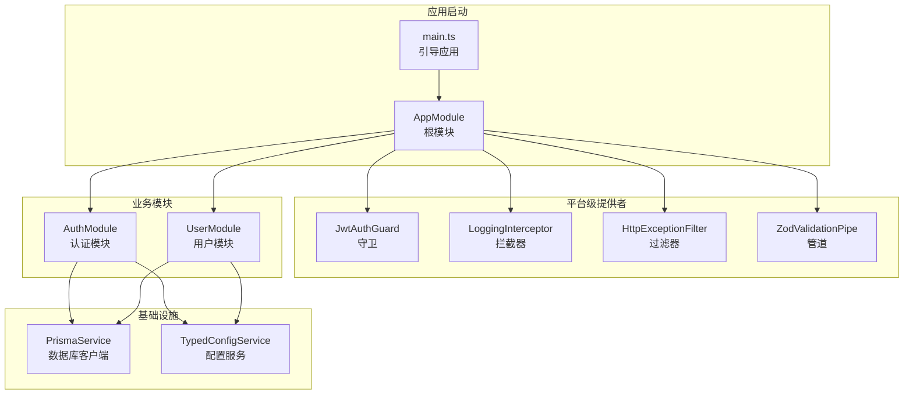
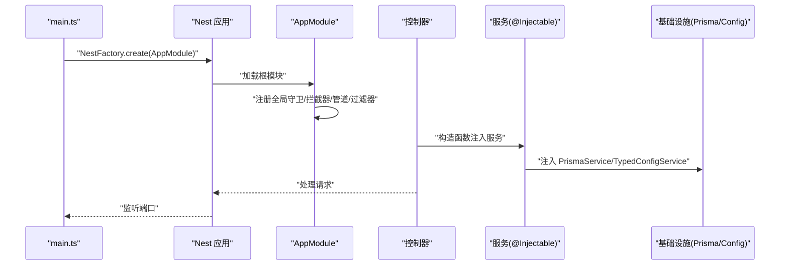
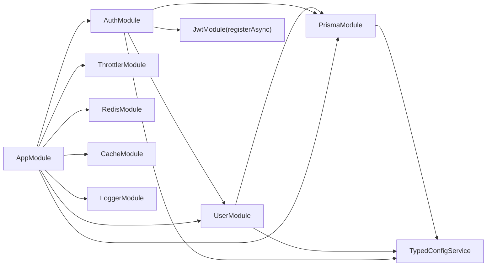

# 依赖注入机制

<cite>
**本文引用的文件**
- [apps/nestjs-server/src/app.module.ts](file://apps/nestjs-server/src/app.module.ts)
- [apps/nestjs-server/src/main.ts](file://apps/nestjs-server/src/main.ts)
- [apps/nestjs-server/src/modules/auth/auth.module.ts](file://apps/nestjs-server/src/modules/auth/auth.module.ts)
- [apps/nestjs-server/src/modules/user/user.module.ts](file://apps/nestjs-server/src/modules/user/user.module.ts)
- [apps/nestjs-server/src/modules/auth/auth.service.ts](file://apps/nestjs-server/src/modules/auth/auth.service.ts)
- [apps/nestjs-server/src/modules/user/user.service.ts](file://apps/nestjs-server/src/modules/user/user.service.ts)
- [apps/nestjs-server/src/common/guards/jwt-auth.guard.ts](file://apps/nestjs-server/src/common/guards/jwt-auth.guard.ts)
- [apps/nestjs-server/src/common/interceptors/logging.interceptor.ts](file://apps/nestjs-server/src/common/interceptors/logging.interceptor.ts)
- [apps/nestjs-server/src/common/filters/http-exception.filter.ts](file://apps/nestjs-server/src/common/filters/http-exception.filter.ts)
- [apps/nestjs-server/src/common/decorators/public.decorator.ts](file://apps/nestjs-server/src/common/decorators/public.decorator.ts)
- [apps/nestjs-server/src/common/decorators/skip-throttle.decorator.ts](file://apps/nestjs-server/src/common/decorators/skip-throttle.decorator.ts)
- [apps/nestjs-server/src/common/decorators/response-message.decorator.ts](file://apps/nestjs-server/src/common/decorators/response-message.decorator.ts)
- [apps/nestjs-server/src/common/decorators/api-success-response.decorator.ts](file://apps/nestjs-server/src/common/decorators/api-success-response.decorator.ts)
- [apps/nestjs-server/src/config/typed-config.service.ts](file://apps/nestjs-server/src/config/typed-config.service.ts)
- [apps/nestjs-server/src/prisma/prisma.service.ts](file://apps/nestjs-server/src/prisma/prisma.service.ts)
</cite>

## 目录
1. [引言](#引言)
2. [项目结构](#项目结构)
3. [核心组件](#核心组件)
4. [架构总览](#架构总览)
5. [详细组件分析](#详细组件分析)
6. [依赖关系分析](#依赖关系分析)
7. [性能考量](#性能考量)
8. [故障排查指南](#故障排查指南)
9. [结论](#结论)
10. [附录](#附录)

## 引言
本文件系统化梳理本项目的依赖注入（DI）机制，结合 NestJS IoC 容器的实际实现，解释提供者类型、作用域、装饰器使用、依赖解析流程以及循环依赖处理策略，并通过控制器、服务、守卫、拦截器、过滤器等组件实例展示 DI 的落地方式。同时给出最佳实践与常见陷阱，帮助读者在复杂模块中构建可维护、可测试的依赖关系。

## 项目结构
本项目采用多模块架构，根模块集中注册全局提供者与平台级中间件（如守卫、拦截器、管道、过滤器），并通过子模块按功能划分边界，形成清晰的层次化依赖图。

图表来源
- [apps/nestjs-server/src/main.ts:1-47](file://apps/nestjs-server/src/main.ts#L1-L47)
- [apps/nestjs-server/src/app.module.ts:1-63](file://apps/nestjs-server/src/app.module.ts#L1-L63)
- [apps/nestjs-server/src/modules/auth/auth.module.ts:1-35](file://apps/nestjs-server/src/modules/auth/auth.module.ts#L1-L35)
- [apps/nestjs-server/src/modules/user/user.module.ts:1-11](file://apps/nestjs-server/src/modules/user/user.module.ts#L1-L11)
- [apps/nestjs-server/src/prisma/prisma.service.ts:1-36](file://apps/nestjs-server/src/prisma/prisma.service.ts#L1-L36)
- [apps/nestjs-server/src/config/typed-config.service.ts:1-46](file://apps/nestjs-server/src/config/typed-config.service.ts#L1-L46)

章节来源
- [apps/nestjs-server/src/main.ts:1-47](file://apps/nestjs-server/src/main.ts#L1-L47)
- [apps/nestjs-server/src/app.module.ts:1-63](file://apps/nestjs-server/src/app.module.ts#L1-L63)

## 核心组件
- 提供者类型与作用域
  - 类提供者：通过 @Injectable() 标注的服务（如 AuthService、UserService、PrismaService、TypedConfigService）默认单例作用域；在模块内按需注入。
  - 工厂提供者：例如 AuthModule 中对 JwtModule.registerAsync 的 useFactory 形式，通过注入 TypedConfigService 动态生成配置。
  - 值提供者：在根模块通过 provide + useValue 注入常量或外部实例（本仓库未见显式 useValue 示例，但机制可用）。
  - 异步提供者：useFactory 可返回 Promise；useExisting/useClass 可配合异步生命周期钩子。
  - 作用域：请求作用域（Request-scoped）用于需要按请求隔离状态的场景；作用域（Default）即单例；应用级（Singleton）与单例相同。本项目以单例为主，未见显式请求作用域示例。
- 装饰器
  - @Injectable()：标注可被容器管理的类。
  - @Inject()：按令牌注入依赖（本仓库未直接使用，但可通过 provide 自定义令牌）。
  - @Optional()：允许注入的依赖可选（本仓库未直接使用）。
  - 元数据装饰器：如 Public、SkipThrottle、ResponseMessage、ApiSuccessResponse 等，通过 SetMetadata 注入元数据，由守卫/拦截器/反射器读取。
- 平台级提供者注册
  - 根模块通过 APP_GUARD、APP_INTERCEPTOR、APP_PIPE、APP_FILTER 将守卫、拦截器、管道、过滤器注册为全局生效。

章节来源
- [apps/nestjs-server/src/app.module.ts:35-60](file://apps/nestjs-server/src/app.module.ts#L35-L60)
- [apps/nestjs-server/src/modules/auth/auth.module.ts:16-28](file://apps/nestjs-server/src/modules/auth/auth.module.ts#L16-L28)
- [apps/nestjs-server/src/common/guards/jwt-auth.guard.ts:17-43](file://apps/nestjs-server/src/common/guards/jwt-auth.guard.ts#L17-L43)
- [apps/nestjs-server/src/common/decorators/public.decorator.ts:1-5](file://apps/nestjs-server/src/common/decorators/public.decorator.ts#L1-L5)
- [apps/nestjs-server/src/common/decorators/skip-throttle.decorator.ts:1-12](file://apps/nestjs-server/src/common/decorators/skip-throttle.decorator.ts#L1-L12)
- [apps/nestjs-server/src/common/decorators/response-message.decorator.ts:1-5](file://apps/nestjs-server/src/common/decorators/response-message.decorator.ts#L1-L5)
- [apps/nestjs-server/src/common/decorators/api-success-response.decorator.ts:1-149](file://apps/nestjs-server/src/common/decorators/api-success-response.decorator.ts#L1-L149)

## 架构总览
下图展示从应用引导到请求处理的关键依赖流向：main.ts 创建应用，AppModule 注册全局守卫/拦截器/管道/过滤器，业务模块通过 @Injectable 依赖注入 PrismaService、TypedConfigService 等基础设施服务。

图表来源
- [apps/nestjs-server/src/main.ts:9-38](file://apps/nestjs-server/src/main.ts#L9-L38)
- [apps/nestjs-server/src/app.module.ts:19-61](file://apps/nestjs-server/src/app.module.ts#L19-L61)
- [apps/nestjs-server/src/modules/auth/auth.service.ts:14-21](file://apps/nestjs-server/src/modules/auth/auth.service.ts#L14-L21)
- [apps/nestjs-server/src/modules/user/user.service.ts:13-15](file://apps/nestjs-server/src/modules/user/user.service.ts#L13-L15)
- [apps/nestjs-server/src/prisma/prisma.service.ts:6-26](file://apps/nestjs-server/src/prisma/prisma.service.ts#L6-L26)
- [apps/nestjs-server/src/config/typed-config.service.ts:6-18](file://apps/nestjs-server/src/config/typed-config.service.ts#L6-L18)

## 详细组件分析

### 1) 提供者与作用域
- 单例服务
  - PrismaService：数据库客户端，实现 OnModuleInit/OnModuleDestroy 生命周期钩子，保证连接/断开一致性。
  - TypedConfigService：封装 @nestjs/config 的访问，提供点语法与命名空间读取能力。
  - AuthService/UserService：业务服务，通过构造函数注入 PrismaService、JwtService、TypedConfigService 等。
- 工厂提供者
  - AuthModule 使用 JwtModule.registerAsync，通过 useFactory 注入 TypedConfigService 动态生成 JWT 配置。
- 作用域说明
  - 本项目以单例为主；若需请求作用域（如需要按请求隔离的状态），可在 @Injectable() 上声明对应作用域（本仓库未出现显式示例）。

章节来源
- [apps/nestjs-server/src/prisma/prisma.service.ts:6-35](file://apps/nestjs-server/src/prisma/prisma.service.ts#L6-L35)
- [apps/nestjs-server/src/config/typed-config.service.ts:6-45](file://apps/nestjs-server/src/config/typed-config.service.ts#L6-L45)
- [apps/nestjs-server/src/modules/auth/auth.module.ts:16-28](file://apps/nestjs-server/src/modules/auth/auth.module.ts#L16-L28)
- [apps/nestjs-server/src/modules/auth/auth.service.ts:14-21](file://apps/nestjs-server/src/modules/auth/auth.service.ts#L14-L21)
- [apps/nestjs-server/src/modules/user/user.service.ts:13-15](file://apps/nestjs-server/src/modules/user/user.service.ts#L13-L15)

### 2) 装饰器与元数据
- 元数据装饰器
  - Public：标记公开接口，JwtAuthGuard 通过 Reflector 读取元数据决定放行。
  - SkipThrottle：标记跳过速率限制的接口。
  - ResponseMessage：为响应设置统一消息。
  - ApiSuccessResponse/ApiGlobalErrors：生成统一的成功/错误响应 OpenAPI 文档结构。
- 使用要点
  - 元数据通过 SetMetadata 注入，守卫/拦截器/反射器在运行时读取，实现非侵入式控制。

章节来源
- [apps/nestjs-server/src/common/guards/jwt-auth.guard.ts:17-43](file://apps/nestjs-server/src/common/guards/jwt-auth.guard.ts#L17-L43)
- [apps/nestjs-server/src/common/decorators/public.decorator.ts:1-5](file://apps/nestjs-server/src/common/decorators/public.decorator.ts#L1-L5)
- [apps/nestjs-server/src/common/decorators/skip-throttle.decorator.ts:1-12](file://apps/nestjs-server/src/common/decorators/skip-throttle.decorator.ts#L1-L12)
- [apps/nestjs-server/src/common/decorators/response-message.decorator.ts:1-5](file://apps/nestjs-server/src/common/decorators/response-message.decorator.ts#L1-L5)
- [apps/nestjs-server/src/common/decorators/api-success-response.decorator.ts:70-149](file://apps/nestjs-server/src/common/decorators/api-success-response.decorator.ts#L70-L149)

### 3) 控制器中的依赖注入
- 控制器通过构造函数注入服务，从而获得业务能力与基础设施能力。
- 示例：AuthModule 导出 AuthService，UserModule 导出 UserService，控制器可直接消费这些服务。

章节来源
- [apps/nestjs-server/src/modules/auth/auth.module.ts:31-32](file://apps/nestjs-server/src/modules/auth/auth.module.ts#L31-L32)
- [apps/nestjs-server/src/modules/user/user.module.ts:7-8](file://apps/nestjs-server/src/modules/user/user.module.ts#L7-L8)

### 4) 服务中的依赖注入
- 服务通过 @Injectable() 标注，构造函数注入其他服务或基础设施（如 PrismaService、TypedConfigService）。
- 服务间依赖通过模块导出/导入进行解耦。

章节来源
- [apps/nestjs-server/src/modules/auth/auth.service.ts:14-21](file://apps/nestjs-server/src/modules/auth/auth.service.ts#L14-L21)
- [apps/nestjs-server/src/modules/user/user.service.ts:13-15](file://apps/nestjs-server/src/modules/user/user.service.ts#L13-L15)

### 5) 守卫中的依赖注入
- JwtAuthGuard 通过 Reflector 读取元数据，结合 AuthGuard('jwt') 实现鉴权逻辑。
- 可注入其他服务以扩展鉴权规则。

章节来源
- [apps/nestjs-server/src/common/guards/jwt-auth.guard.ts:17-43](file://apps/nestjs-server/src/common/guards/jwt-auth.guard.ts#L17-L43)

### 6) 拦截器中的依赖注入
- LoggingInterceptor 记录请求日志，注入 Logger 并在拦截链中输出耗时与状态码。
- 可通过上下文获取请求/响应对象，实现统一日志与指标采集。

章节来源
- [apps/nestjs-server/src/common/interceptors/logging.interceptor.ts:6-29](file://apps/nestjs-server/src/common/interceptors/logging.interceptor.ts#L6-L29)

### 7) 过滤器中的依赖注入
- HttpExceptionFilter 统一处理业务异常与 HTTP 异常，将错误映射为应用级响应格式。
- 支持 Zod 校验异常与 JSON 解析错误的特殊处理。

章节来源
- [apps/nestjs-server/src/common/filters/http-exception.filter.ts:16-68](file://apps/nestjs-server/src/common/filters/http-exception.filter.ts#L16-L68)

### 8) 依赖解析与循环依赖处理
- 解析顺序
  - 容器先解析模块导入关系，再解析模块内的提供者与控制器。
  - 构造函数参数按类型与令牌匹配注入，优先使用模块内提供的实例。
- 循环依赖
  - 若出现 A 依赖 B，B 又依赖 A 的情况，建议通过“延迟注入”或“Reflector/动态获取”规避。
  - 本项目未出现显式循环依赖，但可参考以下模式：
    - 使用 forwardRef 或在运行时通过 app.get 动态解析（仅在极少数场景使用）。
    - 将共享依赖提升至更高层级模块，减少双向依赖。

章节来源
- [apps/nestjs-server/src/app.module.ts:19-34](file://apps/nestjs-server/src/app.module.ts#L19-L34)
- [apps/nestjs-server/src/modules/auth/auth.module.ts:12-32](file://apps/nestjs-server/src/modules/auth/auth.module.ts#L12-L32)

## 依赖关系分析
- 模块依赖
  - AppModule 导入多个子模块与第三方模块（Throttler、Redis、Prisma、Auth、User、Health、Logger 等）。
  - AuthModule 依赖 UserModule 与 JwtModule（通过 registerAsync 注入配置）。
  - UserModule 依赖 PrismaModule（通过 PrismaService 提供数据库能力）。
- 提供者依赖
  - AuthService 依赖 PrismaService、UserService、JwtService、TypedConfigService。
  - UserService 依赖 PrismaService。
  - PrismaService 依赖 TypedConfigService 以选择数据库适配器。

图表来源
- [apps/nestjs-server/src/app.module.ts:19-34](file://apps/nestjs-server/src/app.module.ts#L19-L34)
- [apps/nestjs-server/src/modules/auth/auth.module.ts:12-32](file://apps/nestjs-server/src/modules/auth/auth.module.ts#L12-L32)
- [apps/nestjs-server/src/modules/user/user.module.ts:5-9](file://apps/nestjs-server/src/modules/user/user.module.ts#L5-L9)
- [apps/nestjs-server/src/prisma/prisma.service.ts:6-26](file://apps/nestjs-server/src/prisma/prisma.service.ts#L6-L26)
- [apps/nestjs-server/src/config/typed-config.service.ts:6-18](file://apps/nestjs-server/src/config/typed-config.service.ts#L6-L18)

章节来源
- [apps/nestjs-server/src/app.module.ts:19-34](file://apps/nestjs-server/src/app.module.ts#L19-L34)
- [apps/nestjs-server/src/modules/auth/auth.module.ts:12-32](file://apps/nestjs-server/src/modules/auth/auth.module.ts#L12-L32)
- [apps/nestjs-server/src/modules/user/user.module.ts:5-9](file://apps/nestjs-server/src/modules/user/user.module.ts#L5-L9)

## 性能考量
- 单例服务复用：PrismaService、TypedConfigService 等应保持单例，避免重复初始化带来的资源浪费。
- 异步提供者：useFactory 返回 Promise 时，注意避免阻塞主进程；必要时拆分任务或引入队列。
- 拦截器/守卫：尽量减少昂贵操作（如远程调用、磁盘 IO），必要时缓存结果。
- 全局提供者：APP_GUARD/APP_INTERCEPTOR/APP_PIPE/APP_FILTER 会影响所有请求，应确保其性能与稳定性。

## 故障排查指南
- 配置缺失
  - TypedConfigService 在构造阶段校验根配置是否存在，缺失时会记录错误并终止进程。请检查配置加载与环境变量。
- 数据库连接
  - PrismaService 在 onModuleInit/onModuleDestroy 中执行连接/断开，若连接失败，检查数据库 URL 与适配器配置。
- 鉴权失败
  - JwtAuthGuard 会在 handleRequest 中抛出业务异常，确认令牌有效性、签名密钥与过期时间。
- 日志与异常
  - LoggingInterceptor 输出请求与响应摘要；HttpExceptionFilter 统一错误响应，便于定位问题。

章节来源
- [apps/nestjs-server/src/config/typed-config.service.ts:14-18](file://apps/nestjs-server/src/config/typed-config.service.ts#L14-L18)
- [apps/nestjs-server/src/prisma/prisma.service.ts:28-34](file://apps/nestjs-server/src/prisma/prisma.service.ts#L28-L34)
- [apps/nestjs-server/src/common/guards/jwt-auth.guard.ts:36-41](file://apps/nestjs-server/src/common/guards/jwt-auth.guard.ts#L36-L41)
- [apps/nestjs-server/src/common/interceptors/logging.interceptor.ts:10-28](file://apps/nestjs-server/src/common/interceptors/logging.interceptor.ts#L10-L28)
- [apps/nestjs-server/src/common/filters/http-exception.filter.ts:20-68](file://apps/nestjs-server/src/common/filters/http-exception.filter.ts#L20-L68)

## 结论
本项目通过模块化与依赖注入实现了清晰的职责分离：根模块负责平台级提供者与全局中间件，业务模块通过 @Injectable 服务组合领域能力，基础设施服务（Prisma、Config）贯穿于各层。借助元数据装饰器与 Reflector，鉴权、日志、异常处理等横切关注点得以统一管理。遵循单例优先、避免循环依赖、合理使用工厂提供者与异步生命周期钩子，是构建高性能、可维护 NestJS 应用的关键。

## 附录
- 最佳实践
  - 明确模块边界，按功能拆分子模块；通过 exports 导出必要的服务。
  - 优先使用 @Injectable 单例服务；仅在确有需要时使用请求作用域。
  - 使用工厂提供者集中处理跨模块配置与外部依赖初始化。
  - 通过元数据装饰器与 Reflector 实现非侵入式控制（如公开接口、跳过限流）。
  - 全局提供者影响面广，务必进行充分测试与性能评估。
- 常见陷阱
  - 忽视循环依赖导致的初始化失败；优先通过重构降低耦合。
  - 将过多业务逻辑放入守卫/拦截器；应保持其职责单一。
  - 配置服务未正确加载导致运行时错误；确保配置模块在根模块中先行导入。