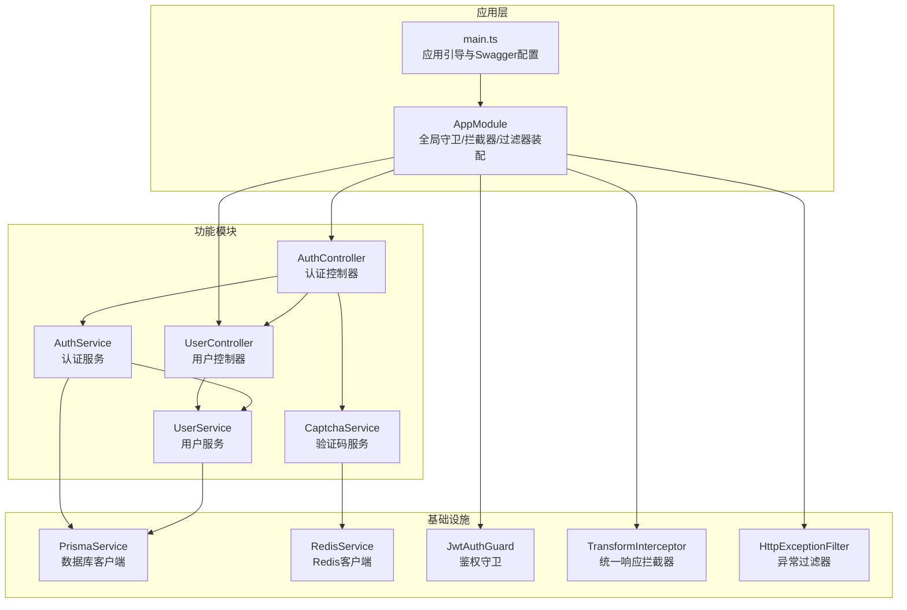
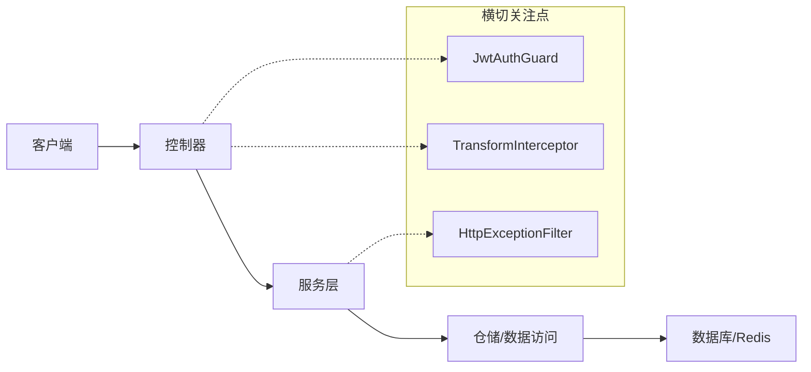
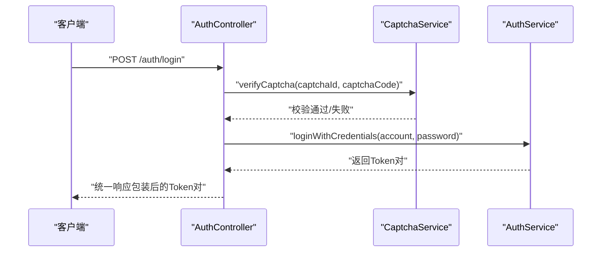
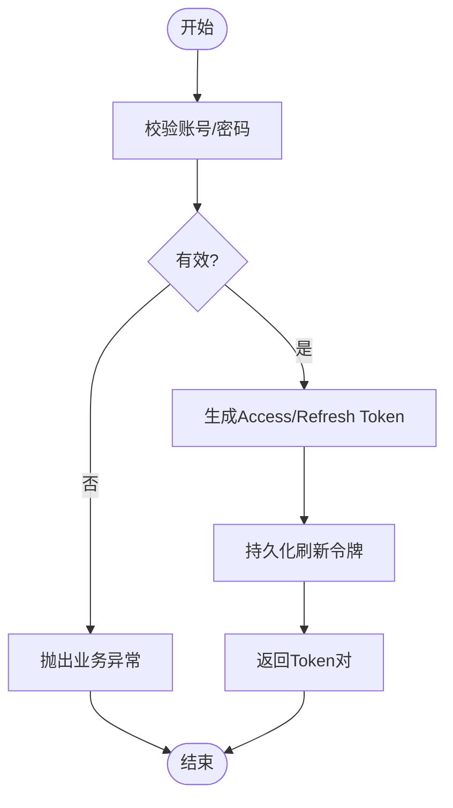
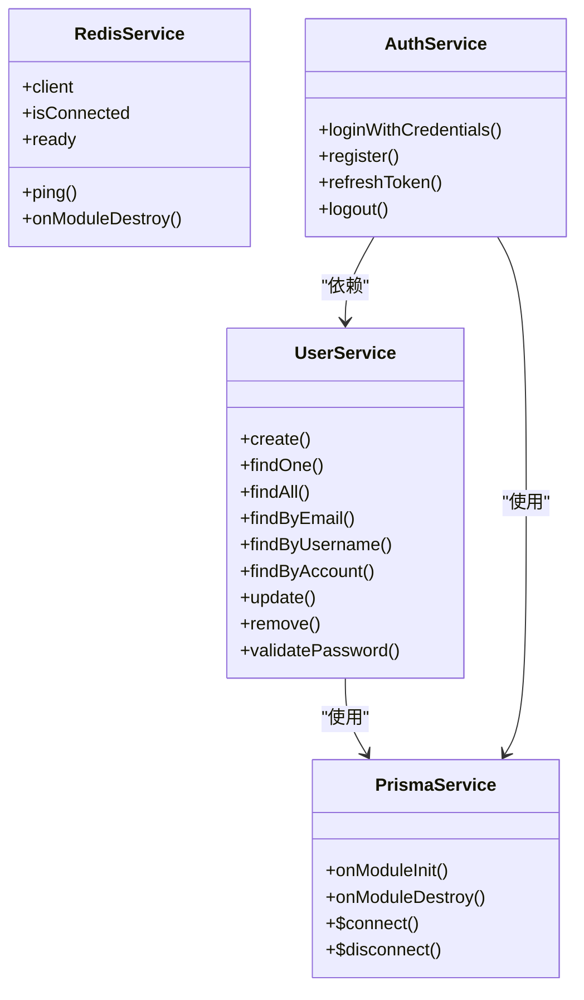
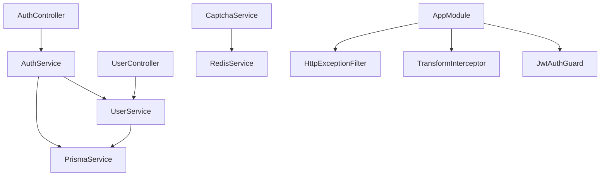

# 分层架构设计

<cite>
**本文引用的文件**
- [apps/nestjs-server/src/app.module.ts](file://apps/nestjs-server/src/app.module.ts)
- [apps/nestjs-server/src/main.ts](file://apps/nestjs-server/src/main.ts)
- [apps/nestjs-server/src/modules/auth/auth.controller.ts](file://apps/nestjs-server/src/modules/auth/auth.controller.ts)
- [apps/nestjs-server/src/modules/auth/auth.service.ts](file://apps/nestjs-server/src/modules/auth/auth.service.ts)
- [apps/nestjs-server/src/modules/auth/captcha.service.ts](file://apps/nestjs-server/src/modules/auth/captcha.service.ts)
- [apps/nestjs-server/src/modules/auth/dto/auth.dto.ts](file://apps/nestjs-server/src/modules/auth/dto/auth.dto.ts)
- [apps/nestjs-server/src/modules/user/user.controller.ts](file://apps/nestjs-server/src/modules/user/user.controller.ts)
- [apps/nestjs-server/src/modules/user/user.service.ts](file://apps/nestjs-server/src/modules/user/user.service.ts)
- [apps/nestjs-server/src/modules/user/dto/user.dto.ts](file://apps/nestjs-server/src/modules/user/dto/user.dto.ts)
- [apps/nestjs-server/src/prisma/prisma.service.ts](file://apps/nestjs-server/src/prisma/prisma.service.ts)
- [apps/nestjs-server/src/common/interceptors/transform.interceptor.ts](file://apps/nestjs-server/src/common/interceptors/transform.interceptor.ts)
- [apps/nestjs-server/src/common/exceptions/business.exception.ts](file://apps/nestjs-server/src/common/exceptions/business.exception.ts)
- [apps/nestjs-server/src/common/filters/http-exception.filter.ts](file://apps/nestjs-server/src/common/filters/http-exception.filter.ts)
- [apps/nestjs-server/src/common/guards/jwt-auth.guard.ts](file://apps/nestjs-server/src/common/guards/jwt-auth.guard.ts)
- [apps/nestjs-server/src/common/decorators/api-success-response.decorator.ts](file://apps/nestjs-server/src/common/decorators/api-success-response.decorator.ts)
- [apps/nestjs-server/src/common/enums/biz-code.enum.ts](file://apps/nestjs-server/src/common/enums/biz-code.enum.ts)
- [apps/nestjs-server/src/modules/redis/redis.service.ts](file://apps/nestjs-server/src/modules/redis/redis.service.ts)
</cite>

## 目录

1. [引言](#引言)
2. [项目结构](#项目结构)
3. [核心组件](#核心组件)
4. [架构总览](#架构总览)
5. [详细组件分析](#详细组件分析)
6. [依赖关系分析](#依赖关系分析)
7. [性能考虑](#性能考虑)
8. [故障排查指南](#故障排查指南)
9. [结论](#结论)

## 引言

本文件面向“控制器-服务-仓储”三层架构，系统化梳理控制器层、服务层与数据访问层的职责边界、交互模式与数据流，并结合认证与用户两大模块的实际实现，给出错误传播机制与异常处理策略。目标是帮助读者快速理解并高效扩展该分层架构。

## 项目结构

- 应用入口与全局配置位于根模块与引导文件，负责装配模块、注册守卫/拦截器/过滤器、启用 Swagger 文档等。
- 功能按模块划分：认证模块、用户模块、缓存/Redis 模块、健康检查、日志等。
- 数据访问通过 PrismaService 提供统一客户端；RedisService 提供验证码等临时数据的高可靠缓存能力。
- 控制器仅负责请求处理、参数校验与响应格式化；服务层封装核心业务逻辑与事务边界；仓储层由 Prisma 代理具体数据库操作。

图表来源

- [apps/nestjs-server/src/app.module.ts:19-62](file://apps/nestjs-server/src/app.module.ts#L19-L62)
- [apps/nestjs-server/src/main.ts:9-47](file://apps/nestjs-server/src/main.ts#L9-L47)
- [apps/nestjs-server/src/modules/auth/auth.controller.ts:30-115](file://apps/nestjs-server/src/modules/auth/auth.controller.ts#L30-L115)
- [apps/nestjs-server/src/modules/auth/auth.service.ts:14-151](file://apps/nestjs-server/src/modules/auth/auth.service.ts#L14-L151)
- [apps/nestjs-server/src/modules/auth/captcha.service.ts:18-67](file://apps/nestjs-server/src/modules/auth/captcha.service.ts#L18-L67)
- [apps/nestjs-server/src/modules/user/user.controller.ts:24-79](file://apps/nestjs-server/src/modules/user/user.controller.ts#L24-L79)
- [apps/nestjs-server/src/modules/user/user.service.ts:13-113](file://apps/nestjs-server/src/modules/user/user.service.ts#L13-L113)
- [apps/nestjs-server/src/prisma/prisma.service.ts:6-36](file://apps/nestjs-server/src/prisma/prisma.service.ts#L6-L36)
- [apps/nestjs-server/src/modules/redis/redis.service.ts:18-149](file://apps/nestjs-server/src/modules/redis/redis.service.ts#L18-L149)

章节来源

- [apps/nestjs-server/src/app.module.ts:19-62](file://apps/nestjs-server/src/app.module.ts#L19-L62)
- [apps/nestjs-server/src/main.ts:9-47](file://apps/nestjs-server/src/main.ts#L9-L47)

## 核心组件

- 控制器层（Controller）
  - 职责：接收请求、进行参数校验（Zod）、调用服务层、返回统一响应包装。
  - 示例：认证控制器与用户控制器分别暴露登录/注册/刷新/登出/获取资料等接口。
- 服务层（Service）
  - 职责：封装核心业务逻辑、协调多个子服务、处理事务边界、与仓储交互。
  - 示例：认证服务负责登录凭据校验、注册、刷新令牌与登出；用户服务负责用户增删改查与密码校验。
- 数据访问层（Repository/Prisma）
  - 职责：屏蔽数据库细节，提供类型安全的数据读写接口。
  - 实现：PrismaService 统一客户端；RedisService 提供验证码等临时数据缓存。

章节来源

- [apps/nestjs-server/src/modules/auth/auth.controller.ts:30-115](file://apps/nestjs-server/src/modules/auth/auth.controller.ts#L30-L115)
- [apps/nestjs-server/src/modules/auth/auth.service.ts:14-151](file://apps/nestjs-server/src/modules/auth/auth.service.ts#L14-L151)
- [apps/nestjs-server/src/modules/user/user.controller.ts:24-79](file://apps/nestjs-server/src/modules/user/user.controller.ts#L24-L79)
- [apps/nestjs-server/src/modules/user/user.service.ts:13-113](file://apps/nestjs-server/src/modules/user/user.service.ts#L13-L113)
- [apps/nestjs-server/src/prisma/prisma.service.ts:6-36](file://apps/nestjs-server/src/prisma/prisma.service.ts#L6-L36)
- [apps/nestjs-server/src/modules/redis/redis.service.ts:18-149](file://apps/nestjs-server/src/modules/redis/redis.service.ts#L18-L149)

## 架构总览

三层架构遵循“关注点分离”原则：

- 控制器层只做“薄壳”，负责路由、参数校验与响应包装。
- 服务层聚合业务规则，必要时开启数据库事务，保证一致性。
- 仓储层由 Prisma/Redis 提供，统一抽象数据库与缓存操作。

图表来源

- [apps/nestjs-server/src/app.module.ts:35-60](file://apps/nestjs-server/src/app.module.ts#L35-L60)
- [apps/nestjs-server/src/common/interceptors/transform.interceptor.ts:9-36](file://apps/nestjs-server/src/common/interceptors/transform.interceptor.ts#L9-L36)
- [apps/nestjs-server/src/common/filters/http-exception.filter.ts:16-68](file://apps/nestjs-server/src/common/filters/http-exception.filter.ts#L16-L68)
- [apps/nestjs-server/src/common/guards/jwt-auth.guard.ts:17-43](file://apps/nestjs-server/src/common/guards/jwt-auth.guard.ts#L17-L43)

## 详细组件分析

### 控制器层职责与交互

- 请求处理：控制器通过装饰器声明路由、HTTP 方法、鉴权与节流策略。
- 参数验证：基于 Zod 的 DTO 在进入控制器方法前完成强类型校验。
- 响应格式化：统一由拦截器将业务结果包装为 { code, message, data? } 结构。
- 示例路径：
  - 登录流程：[apps/nestjs-server/src/modules/auth/auth.controller.ts:63-76](file://apps/nestjs-server/src/modules/auth/auth.controller.ts#L63-L76)
  - 注册流程：[apps/nestjs-server/src/modules/auth/auth.controller.ts:50-61](file://apps/nestjs-server/src/modules/auth/auth.controller.ts#L50-L61)
  - 获取用户资料：[apps/nestjs-server/src/modules/auth/auth.controller.ts:104-113](file://apps/nestjs-server/src/modules/auth/auth.controller.ts#L104-L113)

图表来源

- [apps/nestjs-server/src/modules/auth/auth.controller.ts:63-76](file://apps/nestjs-server/src/modules/auth/auth.controller.ts#L63-L76)
- [apps/nestjs-server/src/modules/auth/captcha.service.ts:48-65](file://apps/nestjs-server/src/modules/auth/captcha.service.ts#L48-L65)
- [apps/nestjs-server/src/modules/auth/auth.service.ts:29-37](file://apps/nestjs-server/src/modules/auth/auth.service.ts#L29-L37)

章节来源

- [apps/nestjs-server/src/modules/auth/auth.controller.ts:30-115](file://apps/nestjs-server/src/modules/auth/auth.controller.ts#L30-L115)
- [apps/nestjs-server/src/common/decorators/api-success-response.decorator.ts:88-126](file://apps/nestjs-server/src/common/decorators/api-success-response.decorator.ts#L88-L126)
- [apps/nestjs-server/src/common/interceptors/transform.interceptor.ts:9-36](file://apps/nestjs-server/src/common/interceptors/transform.interceptor.ts#L9-L36)

### 服务层核心业务与事务管理

- 认证服务
  - 凭据登录：查询用户并校验密码，生成访问/刷新令牌，持久化刷新令牌。
  - 注册：前置邮箱/用户名唯一性检查，创建用户并生成令牌。
  - 刷新：校验刷新令牌有效性，撤销旧令牌并发放新令牌。
  - 登出：撤销用户所有未失效刷新令牌。
- 用户服务
  - 创建：密码哈希后入库，返回脱敏用户信息。
  - 查询：提供列表、单个、按邮箱/用户名/账号查询。
  - 更新/删除：先断言存在，再执行更新/删除。
- 事务管理
  - 采用 Prisma 的原子性操作；对于跨表/并发敏感场景，可在服务层以事务包裹（例如注册+创建刷新令牌）。

图表来源

- [apps/nestjs-server/src/modules/auth/auth.service.ts:29-37](file://apps/nestjs-server/src/modules/auth/auth.service.ts#L29-L37)
- [apps/nestjs-server/src/modules/auth/auth.service.ts:105-142](file://apps/nestjs-server/src/modules/auth/auth.service.ts#L105-L142)

章节来源

- [apps/nestjs-server/src/modules/auth/auth.service.ts:14-151](file://apps/nestjs-server/src/modules/auth/auth.service.ts#L14-L151)
- [apps/nestjs-server/src/modules/user/user.service.ts:13-113](file://apps/nestjs-server/src/modules/user/user.service.ts#L13-L113)

### 数据访问层抽象与数据库操作封装

- PrismaService
  - 统一客户端，支持 SQLite 与 PostgreSQL；模块生命周期内自动连接/断开。
  - 通过 select 精准投影，避免泄露敏感字段。
- RedisService
  - 懒加载客户端、后台连接、指数退避重连、连接状态监控。
  - 验证码服务使用 Redis 存储验证码并设置 TTL，一次性使用。

图表来源

- [apps/nestjs-server/src/prisma/prisma.service.ts:6-36](file://apps/nestjs-server/src/prisma/prisma.service.ts#L6-L36)
- [apps/nestjs-server/src/modules/redis/redis.service.ts:18-149](file://apps/nestjs-server/src/modules/redis/redis.service.ts#L18-L149)
- [apps/nestjs-server/src/modules/user/user.service.ts:13-113](file://apps/nestjs-server/src/modules/user/user.service.ts#L13-L113)
- [apps/nestjs-server/src/modules/auth/auth.service.ts:14-151](file://apps/nestjs-server/src/modules/auth/auth.service.ts#L14-L151)

章节来源

- [apps/nestjs-server/src/prisma/prisma.service.ts:6-36](file://apps/nestjs-server/src/prisma/prisma.service.ts#L6-L36)
- [apps/nestjs-server/src/modules/redis/redis.service.ts:18-149](file://apps/nestjs-server/src/modules/redis/redis.service.ts#L18-L149)

### 验证码服务与缓存策略

- 生成验证码：使用 SVG-Captcha 生成图片与文本，异步写入 Redis 并设置过期时间。
- 验证验证码：一次性读取并删除，防止重放攻击。
- 适用场景：登录/注册等高风险操作前置校验，降低暴力破解风险。

章节来源

- [apps/nestjs-server/src/modules/auth/captcha.service.ts:18-67](file://apps/nestjs-server/src/modules/auth/captcha.service.ts#L18-L67)

### DTO 与响应包装

- DTO：基于 Zod Schema 的强类型输入/输出，前后端字段保持一致。
- 响应包装：拦截器统一输出 { code, message, data? }，Swagger 文档通过装饰器自动生成。

章节来源

- [apps/nestjs-server/src/modules/auth/dto/auth.dto.ts:1-30](file://apps/nestjs-server/src/modules/auth/dto/auth.dto.ts#L1-L30)
- [apps/nestjs-server/src/modules/user/dto/user.dto.ts:1-26](file://apps/nestjs-server/src/modules/user/dto/user.dto.ts#L1-L26)
- [apps/nestjs-server/src/common/interceptors/transform.interceptor.ts:9-36](file://apps/nestjs-server/src/common/interceptors/transform.interceptor.ts#L9-L36)
- [apps/nestjs-server/src/common/decorators/api-success-response.decorator.ts:88-126](file://apps/nestjs-server/src/common/decorators/api-success-response.decorator.ts#L88-L126)

## 依赖关系分析

- 控制器依赖服务；服务依赖仓储（Prisma/Redis）。
- 全局守卫负责鉴权；全局拦截器负责统一响应；全局过滤器负责异常转换。
- DTO 与枚举来自共享包，确保前后端一致性。

图表来源

- [apps/nestjs-server/src/app.module.ts:35-60](file://apps/nestjs-server/src/app.module.ts#L35-L60)
- [apps/nestjs-server/src/modules/auth/auth.controller.ts:30-115](file://apps/nestjs-server/src/modules/auth/auth.controller.ts#L30-L115)
- [apps/nestjs-server/src/modules/user/user.controller.ts:24-79](file://apps/nestjs-server/src/modules/user/user.controller.ts#L24-L79)
- [apps/nestjs-server/src/modules/auth/auth.service.ts:14-151](file://apps/nestjs-server/src/modules/auth/auth.service.ts#L14-L151)
- [apps/nestjs-server/src/modules/user/user.service.ts:13-113](file://apps/nestjs-server/src/modules/user/user.service.ts#L13-L113)
- [apps/nestjs-server/src/prisma/prisma.service.ts:6-36](file://apps/nestjs-server/src/prisma/prisma.service.ts#L6-L36)
- [apps/nestjs-server/src/modules/redis/redis.service.ts:18-149](file://apps/nestjs-server/src/modules/redis/redis.service.ts#L18-L149)

章节来源

- [apps/nestjs-server/src/app.module.ts:19-62](file://apps/nestjs-server/src/app.module.ts#L19-L62)

## 性能考虑

- 懒加载与后台连接：RedisService 首次访问才创建客户端，后台发起连接，避免阻塞应用启动。
- 并发与事务：服务层对关键流程（如注册）使用并发安全的原子操作；必要时引入 Prisma 事务。
- 缓存命中与过期：验证码使用 TTL，减少数据库压力；Redis 连接具备指数退避与最大重试限制。
- 响应与日志：拦截器统一包装响应，减少重复逻辑；日志工厂按配置输出，便于定位问题。

## 故障排查指南

- 业务异常（BusinessException）
  - 服务层抛出，携带业务码与消息；过滤器将其转换为统一错误响应结构。
  - 参考：[apps/nestjs-server/src/common/exceptions/business.exception.ts:16-42](file://apps/nestjs-server/src/common/exceptions/business.exception.ts#L16-L42)
- 异常过滤器（HttpExceptionFilter）
  - 将 HttpException 映射为业务码与消息；对 Zod 校验错误与 JSON 解析错误进行专门处理。
  - 参考：[apps/nestjs-server/src/common/filters/http-exception.filter.ts:16-208](file://apps/nestjs-server/src/common/filters/http-exception.filter.ts#L16-L208)
- 鉴权失败
  - JwtAuthGuard 在未授权时抛出业务异常，确保统一错误格式。
  - 参考：[apps/nestjs-server/src/common/guards/jwt-auth.guard.ts:36-41](file://apps/nestjs-server/src/common/guards/jwt-auth.guard.ts#L36-L41)
- 参数校验失败
  - ZodValidationPipe 自动将校验错误映射为业务错误，details 字段包含字段级错误列表。
  - 参考：[apps/nestjs-server/src/common/filters/http-exception.filter.ts:105-114](file://apps/nestjs-server/src/common/filters/http-exception.filter.ts#L105-L114)

章节来源

- [apps/nestjs-server/src/common/exceptions/business.exception.ts:16-42](file://apps/nestjs-server/src/common/exceptions/business.exception.ts#L16-L42)
- [apps/nestjs-server/src/common/filters/http-exception.filter.ts:16-208](file://apps/nestjs-server/src/common/filters/http-exception.filter.ts#L16-L208)
- [apps/nestjs-server/src/common/guards/jwt-auth.guard.ts:36-41](file://apps/nestjs-server/src/common/guards/jwt-auth.guard.ts#L36-L41)

## 结论

本项目通过清晰的三层分层与横切关注点（守卫/拦截器/过滤器），实现了高内聚、低耦合的服务架构。控制器层专注请求与响应，服务层封装业务与事务，仓储层抽象数据访问。配合统一的异常与响应模型、强类型的 DTO 以及可靠的缓存与数据库客户端，整体具备良好的可维护性与扩展性。
