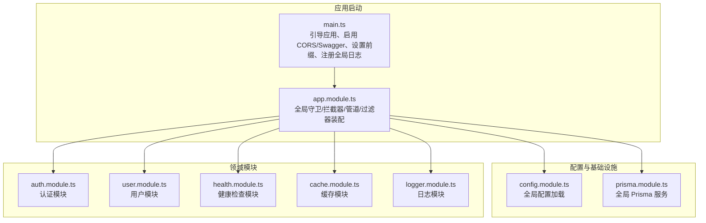
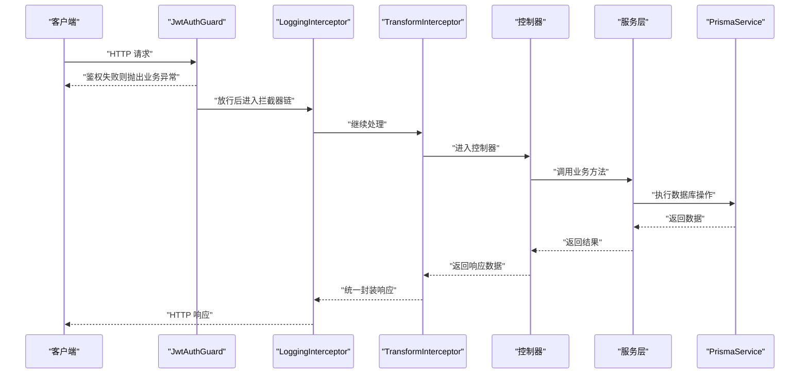
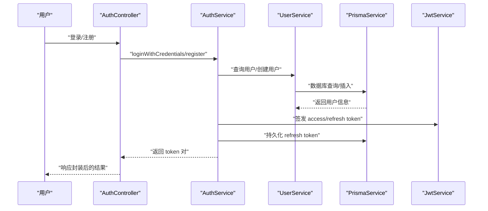
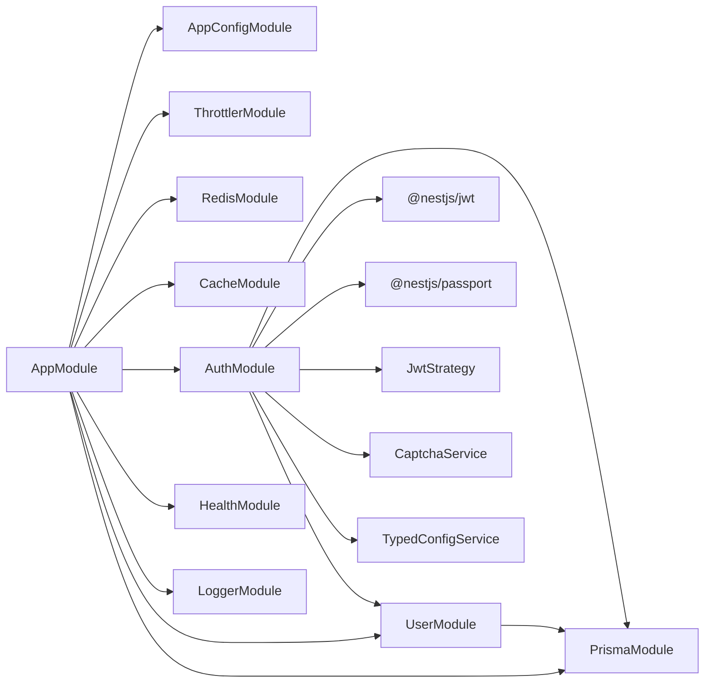

# 后端架构

<cite>
**本文引用的文件**
- [apps/nestjs-server/src/main.ts](file://apps/nestjs-server/src/main.ts)
- [apps/nestjs-server/src/app.module.ts](file://apps/nestjs-server/src/app.module.ts)
- [apps/nestjs-server/src/common/filters/http-exception.filter.ts](file://apps/nestjs-server/src/common/filters/http-exception.filter.ts)
- [apps/nestjs-server/src/common/guards/jwt-auth.guard.ts](file://apps/nestjs-server/src/common/guards/jwt-auth.guard.ts)
- [apps/nestjs-server/src/common/interceptors/logging.interceptor.ts](file://apps/nestjs-server/src/common/interceptors/logging.interceptor.ts)
- [apps/nestjs-server/src/common/interceptors/transform.interceptor.ts](file://apps/nestjs-server/src/common/interceptors/transform.interceptor.ts)
- [apps/nestjs-server/src/common/decorators/public.decorator.ts](file://apps/nestjs-server/src/common/decorators/public.decorator.ts)
- [apps/nestjs-server/src/modules/auth/auth.module.ts](file://apps/nestjs-server/src/modules/auth/auth.module.ts)
- [apps/nestjs-server/src/modules/auth/auth.service.ts](file://apps/nestjs-server/src/modules/auth/auth.service.ts)
- [apps/nestjs-server/src/modules/user/user.module.ts](file://apps/nestjs-server/src/modules/user/user.module.ts)
- [apps/nestjs-server/src/modules/user/user.service.ts](file://apps/nestjs-server/src/modules/user/user.service.ts)
- [apps/nestjs-server/src/prisma/prisma.module.ts](file://apps/nestjs-server/src/prisma/prisma.module.ts)
- [apps/nestjs-server/src/config/config.module.ts](file://apps/nestjs-server/src/config/config.module.ts)
- [apps/nestjs-server/src/common/enums/biz-code.enum.ts](file://apps/nestjs-server/src/common/enums/biz-code.enum.ts)
- [apps/nestjs-server/src/common/dto/api-response.dto.ts](file://apps/nestjs-server/src/common/dto/api-response.dto.ts)
</cite>

## 目录
1. [引言](#引言)
2. [项目结构](#项目结构)
3. [核心组件](#核心组件)
4. [架构总览](#架构总览)
5. [详细组件分析](#详细组件分析)
6. [依赖分析](#依赖分析)
7. [性能考虑](#性能考虑)
8. [故障排查指南](#故障排查指南)
9. [结论](#结论)
10. [附录](#附录)

## 引言
本文件面向后端架构与开发团队，系统化梳理 NestJS 应用的整体架构设计与模块化组织原则，重点覆盖以下方面：
- 依赖注入与模块生命周期
- 控制器、服务层与数据访问层的职责划分与交互模式
- 中间件、拦截器、过滤器、守卫的使用场景与实现方式
- 错误处理策略、日志记录与性能监控设计理念
- 架构图与具体代码示例路径

## 项目结构
后端采用多模块分层组织，入口在应用模块中集中装配全局守卫、拦截器、验证管道与过滤器，并通过子模块划分功能域（认证、用户、健康检查、缓存、日志等）。配置通过全局配置模块加载，Prisma 以全局模块提供数据访问能力。

**图表来源**
- [apps/nestjs-server/src/main.ts:1-47](file://apps/nestjs-server/src/main.ts#L1-L47)
- [apps/nestjs-server/src/app.module.ts:1-63](file://apps/nestjs-server/src/app.module.ts#L1-L63)
- [apps/nestjs-server/src/config/config.module.ts:1-20](file://apps/nestjs-server/src/config/config.module.ts#L1-L20)
- [apps/nestjs-server/src/prisma/prisma.module.ts:1-10](file://apps/nestjs-server/src/prisma/prisma.module.ts#L1-L10)

**章节来源**
- [apps/nestjs-server/src/main.ts:1-47](file://apps/nestjs-server/src/main.ts#L1-L47)
- [apps/nestjs-server/src/app.module.ts:1-63](file://apps/nestjs-server/src/app.module.ts#L1-L63)
- [apps/nestjs-server/src/config/config.module.ts:1-20](file://apps/nestjs-server/src/config/config.module.ts#L1-L20)
- [apps/nestjs-server/src/prisma/prisma.module.ts:1-10](file://apps/nestjs-server/src/prisma/prisma.module.ts#L1-L10)

## 核心组件
- 应用引导与全局配置
  - 在引导函数中创建应用实例、启用关闭钩子、读取配置、设置 CORS、全局前缀与可选 Swagger 文档，并注入自定义日志工厂。
  - 参考路径：[apps/nestjs-server/src/main.ts:1-47](file://apps/nestjs-server/src/main.ts#L1-L47)
- 应用模块装配
  - 通过导入多个子模块构建应用骨架；通过 APP_* 提供者注册全局守卫、拦截器、验证管道与过滤器。
  - 参考路径：[apps/nestjs-server/src/app.module.ts:1-63](file://apps/nestjs-server/src/app.module.ts#L1-L63)
- 配置模块
  - 全局注册配置模块，加载自定义配置加载器，生产环境忽略 .env 文件，避免污染。
  - 参考路径：[apps/nestjs-server/src/config/config.module.ts:1-20](file://apps/nestjs-server/src/config/config.module.ts#L1-L20)
- 数据访问层
  - Prisma 以全局模块提供服务，所有模块可直接注入使用。
  - 参考路径：[apps/nestjs-server/src/prisma/prisma.module.ts:1-10](file://apps/nestjs-server/src/prisma/prisma.module.ts#L1-L10)

**章节来源**
- [apps/nestjs-server/src/main.ts:1-47](file://apps/nestjs-server/src/main.ts#L1-L47)
- [apps/nestjs-server/src/app.module.ts:1-63](file://apps/nestjs-server/src/app.module.ts#L1-L63)
- [apps/nestjs-server/src/config/config.module.ts:1-20](file://apps/nestjs-server/src/config/config.module.ts#L1-L20)
- [apps/nestjs-server/src/prisma/prisma.module.ts:1-10](file://apps/nestjs-server/src/prisma/prisma.module.ts#L1-L10)

## 架构总览
下图展示从请求进入至响应返回的关键流程，包括守卫鉴权、拦截器日志与转换、服务层处理以及数据访问层操作。

**图表来源**
- [apps/nestjs-server/src/common/guards/jwt-auth.guard.ts:1-43](file://apps/nestjs-server/src/common/guards/jwt-auth.guard.ts#L1-L43)
- [apps/nestjs-server/src/common/interceptors/logging.interceptor.ts:1-30](file://apps/nestjs-server/src/common/interceptors/logging.interceptor.ts#L1-L30)
- [apps/nestjs-server/src/common/interceptors/transform.interceptor.ts:1-36](file://apps/nestjs-server/src/common/interceptors/transform.interceptor.ts#L1-L36)
- [apps/nestjs-server/src/modules/auth/auth.service.ts:1-151](file://apps/nestjs-server/src/modules/auth/auth.service.ts#L1-L151)
- [apps/nestjs-server/src/modules/user/user.service.ts:1-113](file://apps/nestjs-server/src/modules/user/user.service.ts#L1-L113)
- [apps/nestjs-server/src/prisma/prisma.module.ts:1-10](file://apps/nestjs-server/src/prisma/prisma.module.ts#L1-L10)

## 详细组件分析

### 依赖注入与模块生命周期
- 模块生命周期
  - 应用引导阶段完成模块初始化与提供者注册；应用运行期通过依赖注入解析各组件。
  - 关键点：全局守卫/拦截器/管道/过滤器在应用模块一次性注册，贯穿所有路由。
- 依赖注入实践
  - 服务层通过构造函数注入 PrismaService、其他服务与配置服务；控制器仅负责参数绑定与调用服务。
  - 示例路径：
    - [apps/nestjs-server/src/modules/auth/auth.service.ts:14-21](file://apps/nestjs-server/src/modules/auth/auth.service.ts#L14-L21)
    - [apps/nestjs-server/src/modules/user/user.service.ts:13-15](file://apps/nestjs-server/src/modules/user/user.service.ts#L13-L15)

**章节来源**
- [apps/nestjs-server/src/app.module.ts:35-60](file://apps/nestjs-server/src/app.module.ts#L35-L60)
- [apps/nestjs-server/src/modules/auth/auth.service.ts:14-21](file://apps/nestjs-server/src/modules/auth/auth.service.ts#L14-L21)
- [apps/nestjs-server/src/modules/user/user.service.ts:13-15](file://apps/nestjs-server/src/modules/user/user.service.ts#L13-L15)

### 控制器、服务层与数据访问层
- 职责划分
  - 控制器：接收请求、参数校验、调用服务、返回响应（由拦截器统一封装）。
  - 服务层：编排业务逻辑、调用数据访问层、处理业务异常。
  - 数据访问层：基于 PrismaService 执行数据库 CRUD。
- 交互模式
  - 控制器不直接操作数据库，服务层聚合业务规则，Prisma 作为单一数据源。
  - 示例路径：
    - [apps/nestjs-server/src/modules/user/user.service.ts:17-31](file://apps/nestjs-server/src/modules/user/user.service.ts#L17-L31)
    - [apps/nestjs-server/src/modules/auth/auth.service.ts:29-37](file://apps/nestjs-server/src/modules/auth/auth.service.ts#L29-L37)

**章节来源**
- [apps/nestjs-server/src/modules/user/user.service.ts:1-113](file://apps/nestjs-server/src/modules/user/user.service.ts#L1-L113)
- [apps/nestjs-server/src/modules/auth/auth.service.ts:1-151](file://apps/nestjs-server/src/modules/auth/auth.service.ts#L1-L151)
- [apps/nestjs-server/src/prisma/prisma.module.ts:1-10](file://apps/nestjs-server/src/prisma/prisma.module.ts#L1-L10)

### 守卫（Guards）
- JwtAuthGuard
  - 基于 Passport 的 JWT 守卫，结合反射判断是否为公开接口；鉴权失败统一抛出业务异常。
  - 公开接口可通过装饰器标注跳过鉴权。
  - 示例路径：
    - [apps/nestjs-server/src/common/guards/jwt-auth.guard.ts:17-42](file://apps/nestjs-server/src/common/guards/jwt-auth.guard.ts#L17-L42)
    - [apps/nestjs-server/src/common/decorators/public.decorator.ts:1-5](file://apps/nestjs-server/src/common/decorators/public.decorator.ts#L1-L5)

**章节来源**
- [apps/nestjs-server/src/common/guards/jwt-auth.guard.ts:1-43](file://apps/nestjs-server/src/common/guards/jwt-auth.guard.ts#L1-L43)
- [apps/nestjs-server/src/common/decorators/public.decorator.ts:1-5](file://apps/nestjs-server/src/common/decorators/public.decorator.ts#L1-L5)

### 拦截器（Interceptors）
- LoggingInterceptor
  - 记录请求开始与结束的日志，包含方法、URL、用户标识、IP、UA 与耗时。
  - 示例路径：[apps/nestjs-server/src/common/interceptors/logging.interceptor.ts:10-28](file://apps/nestjs-server/src/common/interceptors/logging.interceptor.ts#L10-L28)
- TransformInterceptor
  - 统一响应结构，自动注入业务码与消息；支持通过反射注入响应消息；对空数据进行条件封装。
  - 示例路径：[apps/nestjs-server/src/common/interceptors/transform.interceptor.ts:13-34](file://apps/nestjs-server/src/common/interceptors/transform.interceptor.ts#L13-L34)

**章节来源**
- [apps/nestjs-server/src/common/interceptors/logging.interceptor.ts:1-30](file://apps/nestjs-server/src/common/interceptors/logging.interceptor.ts#L1-L30)
- [apps/nestjs-server/src/common/interceptors/transform.interceptor.ts:1-36](file://apps/nestjs-server/src/common/interceptors/transform.interceptor.ts#L1-L36)
- [apps/nestjs-server/src/common/dto/api-response.dto.ts:1-14](file://apps/nestjs-server/src/common/dto/api-response.dto.ts#L1-L14)

### 过滤器（Filters）
- HttpExceptionFilter
  - 统一捕获 HTTP 异常，区分业务异常与通用异常；支持 Zod 校验异常与 JSON 解析错误识别；将响应映射为业务码与消息。
  - 示例路径：
    - [apps/nestjs-server/src/common/filters/http-exception.filter.ts:20-68](file://apps/nestjs-server/src/common/filters/http-exception.filter.ts#L20-L68)
    - [apps/nestjs-server/src/common/enums/biz-code.enum.ts:1-16](file://apps/nestjs-server/src/common/enums/biz-code.enum.ts#L1-L16)

**章节来源**
- [apps/nestjs-server/src/common/filters/http-exception.filter.ts:1-208](file://apps/nestjs-server/src/common/filters/http-exception.filter.ts#L1-L208)
- [apps/nestjs-server/src/common/enums/biz-code.enum.ts:1-16](file://apps/nestjs-server/src/common/enums/biz-code.enum.ts#L1-L16)

### 中间件（Middleware）
- 当前项目未显式定义自定义 Express 中间件；全局 CORS 与 Swagger 在引导阶段通过应用实例方法启用。
- 参考路径：[apps/nestjs-server/src/main.ts:19-33](file://apps/nestjs-server/src/main.ts#L19-L33)

**章节来源**
- [apps/nestjs-server/src/main.ts:19-33](file://apps/nestjs-server/src/main.ts#L19-L33)

### 验证与管道（Validation & Pipes）
- 全局注册 ZodValidationPipe，提供请求体与参数的强类型校验。
- 参考路径：[apps/nestjs-server/src/app.module.ts:49-50](file://apps/nestjs-server/src/app.module.ts#L49-L50)

**章节来源**
- [apps/nestjs-server/src/app.module.ts:49-50](file://apps/nestjs-server/src/app.module.ts#L49-L50)

### 错误处理策略
- 业务异常 BusinessException 由业务层抛出，过滤器将其映射为统一业务码与消息。
- 通用 HTTP 异常由过滤器解析并映射到业务码，同时记录告警日志。
- JSON 解析错误与 Zod 校验错误具备专门分支处理与人性化提示。
- 参考路径：
  - [apps/nestjs-server/src/common/filters/http-exception.filter.ts:29-68](file://apps/nestjs-server/src/common/filters/http-exception.filter.ts#L29-L68)
  - [apps/nestjs-server/src/common/filters/http-exception.filter.ts:105-144](file://apps/nestjs-server/src/common/filters/http-exception.filter.ts#L105-L144)

**章节来源**
- [apps/nestjs-server/src/common/filters/http-exception.filter.ts:1-208](file://apps/nestjs-server/src/common/filters/http-exception.filter.ts#L1-L208)

### 日志记录系统
- 自定义日志工厂在引导阶段注入应用日志器；HTTP 请求日志由拦截器记录。
- 参考路径：
  - [apps/nestjs-server/src/main.ts:16-17](file://apps/nestjs-server/src/main.ts#L16-L17)
  - [apps/nestjs-server/src/common/interceptors/logging.interceptor.ts:8-27](file://apps/nestjs-server/src/common/interceptors/logging.interceptor.ts#L8-L27)

**章节来源**
- [apps/nestjs-server/src/main.ts:16-17](file://apps/nestjs-server/src/main.ts#L16-L17)
- [apps/nestjs-server/src/common/interceptors/logging.interceptor.ts:1-30](file://apps/nestjs-server/src/common/interceptors/logging.interceptor.ts#L1-L30)

### 性能监控与限流
- 应用模块注册 ThrottlerModule 并配置多组限流策略（短、中、长窗口），可与自定义 ThrottlerGuard 协作。
- 参考路径：[apps/nestjs-server/src/app.module.ts:22-26](file://apps/nestjs-server/src/app.module.ts#L22-L26)

**章节来源**
- [apps/nestjs-server/src/app.module.ts:22-26](file://apps/nestjs-server/src/app.module.ts#L22-L26)

### 认证与授权流程

**图表来源**
- [apps/nestjs-server/src/modules/auth/auth.controller.ts](file://apps/nestjs-server/src/modules/auth/auth.controller.ts)
- [apps/nestjs-server/src/modules/auth/auth.service.ts:29-84](file://apps/nestjs-server/src/modules/auth/auth.service.ts#L29-L84)
- [apps/nestjs-server/src/modules/user/user.service.ts:17-31](file://apps/nestjs-server/src/modules/user/user.service.ts#L17-L31)
- [apps/nestjs-server/src/prisma/prisma.module.ts:1-10](file://apps/nestjs-server/src/prisma/prisma.module.ts#L1-L10)

## 依赖分析
- 模块耦合与导出
  - AppModule 导入并装配各功能模块；PrismaModule 以全局模块导出 PrismaService，供任意模块注入。
  - AuthModule 导出 AuthService，供其他模块复用。
- 外部依赖集成
  - JWT、Passport、Swagger、Throttler、Zod 等通过模块化方式接入，避免在业务代码中分散配置。
- 关键依赖关系图

**图表来源**
- [apps/nestjs-server/src/app.module.ts:19-34](file://apps/nestjs-server/src/app.module.ts#L19-L34)
- [apps/nestjs-server/src/modules/auth/auth.module.ts:12-32](file://apps/nestjs-server/src/modules/auth/auth.module.ts#L12-L32)
- [apps/nestjs-server/src/modules/user/user.module.ts:5-9](file://apps/nestjs-server/src/modules/user/user.module.ts#L5-L9)
- [apps/nestjs-server/src/prisma/prisma.module.ts:4-8](file://apps/nestjs-server/src/prisma/prisma.module.ts#L4-L8)

**章节来源**
- [apps/nestjs-server/src/app.module.ts:1-63](file://apps/nestjs-server/src/app.module.ts#L1-L63)
- [apps/nestjs-server/src/modules/auth/auth.module.ts:1-35](file://apps/nestjs-server/src/modules/auth/auth.module.ts#L1-L35)
- [apps/nestjs-server/src/modules/user/user.module.ts:1-11](file://apps/nestjs-server/src/modules/user/user.module.ts#L1-L11)
- [apps/nestjs-server/src/prisma/prisma.module.ts:1-10](file://apps/nestjs-server/src/prisma/prisma.module.ts#L1-L10)

## 性能考虑
- 全局拦截器与过滤器会增加每次请求的处理开销，建议：
  - 仅保留必要拦截器，避免在 LoggingInterceptor 中进行昂贵操作。
  - 对高频接口使用更细粒度的拦截器控制或按需启用。
- 限流策略已在应用模块配置，建议结合业务场景调整窗口与阈值。
- 数据库访问：
  - 使用 PrismaService 的选择投影减少不必要的字段传输。
  - 对热点查询使用缓存模块（CacheModule/RedisModule）降低数据库压力。

## 故障排查指南
- 常见问题定位
  - 鉴权失败：确认 JwtAuthGuard 是否正确配置，公开接口是否添加了公共装饰器。
  - 响应格式异常：检查 TransformInterceptor 是否生效，响应消息是否通过反射注入。
  - 参数校验失败：确认 ZodValidationPipe 生效，查看过滤器对 Zod 校验错误的格式化输出。
  - 日志缺失：确认自定义日志工厂已注入，HTTP 日志拦截器是否正常工作。
- 排查步骤
  - 查看引导日志与 Swagger 文档路径，确认应用启动成功。
  - 使用浏览器或工具访问 Swagger 文档，验证接口签名与响应结构。
  - 结合过滤器日志与拦截器日志定位异常发生阶段。

**章节来源**
- [apps/nestjs-server/src/common/guards/jwt-auth.guard.ts:23-41](file://apps/nestjs-server/src/common/guards/jwt-auth.guard.ts#L23-L41)
- [apps/nestjs-server/src/common/interceptors/transform.interceptor.ts:16-24](file://apps/nestjs-server/src/common/interceptors/transform.interceptor.ts#L16-L24)
- [apps/nestjs-server/src/common/filters/http-exception.filter.ts:105-144](file://apps/nestjs-server/src/common/filters/http-exception.filter.ts#L105-L144)
- [apps/nestjs-server/src/common/interceptors/logging.interceptor.ts:10-27](file://apps/nestjs-server/src/common/interceptors/logging.interceptor.ts#L10-L27)
- [apps/nestjs-server/src/main.ts:35-43](file://apps/nestjs-server/src/main.ts#L35-L43)

## 结论
本项目遵循 NestJS 模块化与依赖注入最佳实践，通过全局守卫、拦截器、验证管道与过滤器形成统一的横切关注点；认证与用户模块职责清晰，服务层承担业务编排，数据访问层由 Prisma 统一管理。整体架构具备良好的扩展性与可维护性，建议在后续迭代中持续完善监控指标与缓存策略，进一步提升系统性能与稳定性。

## 附录
- 代码示例路径索引
  - 应用引导与全局配置：[apps/nestjs-server/src/main.ts:1-47](file://apps/nestjs-server/src/main.ts#L1-L47)
  - 应用模块装配：[apps/nestjs-server/src/app.module.ts:1-63](file://apps/nestjs-server/src/app.module.ts#L1-L63)
  - 配置模块：[apps/nestjs-server/src/config/config.module.ts:1-20](file://apps/nestjs-server/src/config/config.module.ts#L1-L20)
  - 数据访问层：[apps/nestjs-server/src/prisma/prisma.module.ts:1-10](file://apps/nestjs-server/src/prisma/prisma.module.ts#L1-L10)
  - 认证模块装配：[apps/nestjs-server/src/modules/auth/auth.module.ts:1-35](file://apps/nestjs-server/src/modules/auth/auth.module.ts#L1-L35)
  - 用户模块装配：[apps/nestjs-server/src/modules/user/user.module.ts:1-11](file://apps/nestjs-server/src/modules/user/user.module.ts#L1-L11)
  - 业务服务示例：[apps/nestjs-server/src/modules/auth/auth.service.ts:1-151](file://apps/nestjs-server/src/modules/auth/auth.service.ts#L1-L151), [apps/nestjs-server/src/modules/user/user.service.ts:1-113](file://apps/nestjs-server/src/modules/user/user.service.ts#L1-L113)
  - 守卫示例：[apps/nestjs-server/src/common/guards/jwt-auth.guard.ts:1-43](file://apps/nestjs-server/src/common/guards/jwt-auth.guard.ts#L1-L43)
  - 拦截器示例：[apps/nestjs-server/src/common/interceptors/logging.interceptor.ts:1-30](file://apps/nestjs-server/src/common/interceptors/logging.interceptor.ts#L1-L30), [apps/nestjs-server/src/common/interceptors/transform.interceptor.ts:1-36](file://apps/nestjs-server/src/common/interceptors/transform.interceptor.ts#L1-L36)
  - 过滤器示例：[apps/nestjs-server/src/common/filters/http-exception.filter.ts:1-208](file://apps/nestjs-server/src/common/filters/http-exception.filter.ts#L1-L208)
  - 业务码枚举：[apps/nestjs-server/src/common/enums/biz-code.enum.ts:1-16](file://apps/nestjs-server/src/common/enums/biz-code.enum.ts#L1-L16)
  - 统一响应类型：[apps/nestjs-server/src/common/dto/api-response.dto.ts:1-14](file://apps/nestjs-server/src/common/dto/api-response.dto.ts#L1-L14)