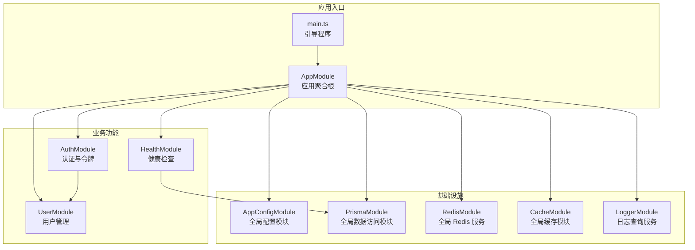
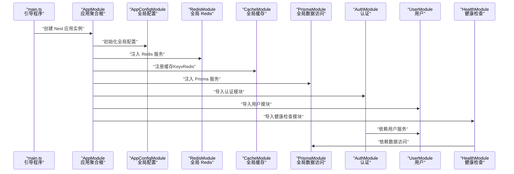
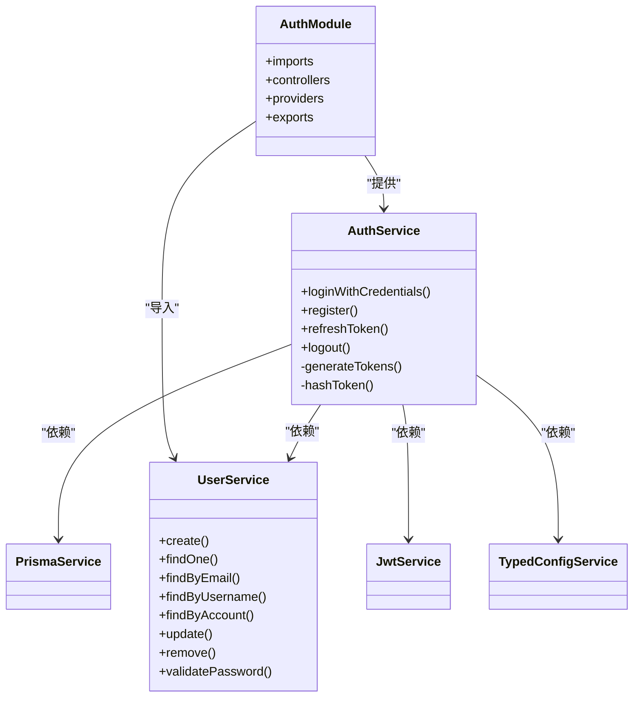
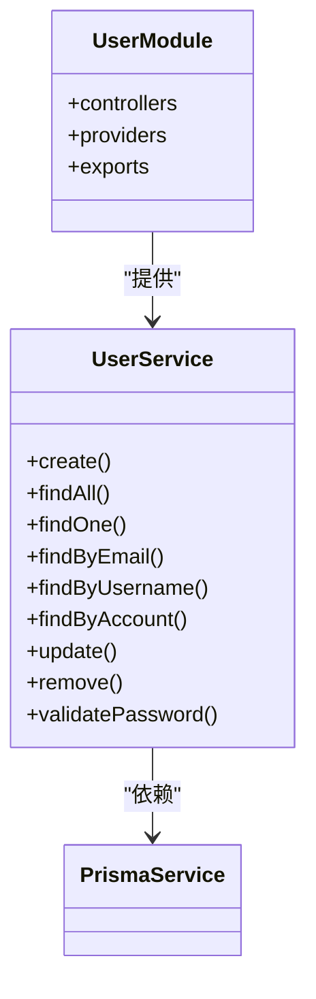
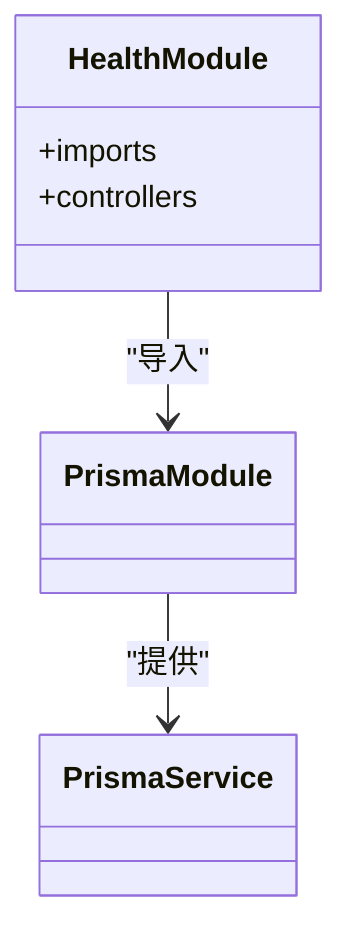
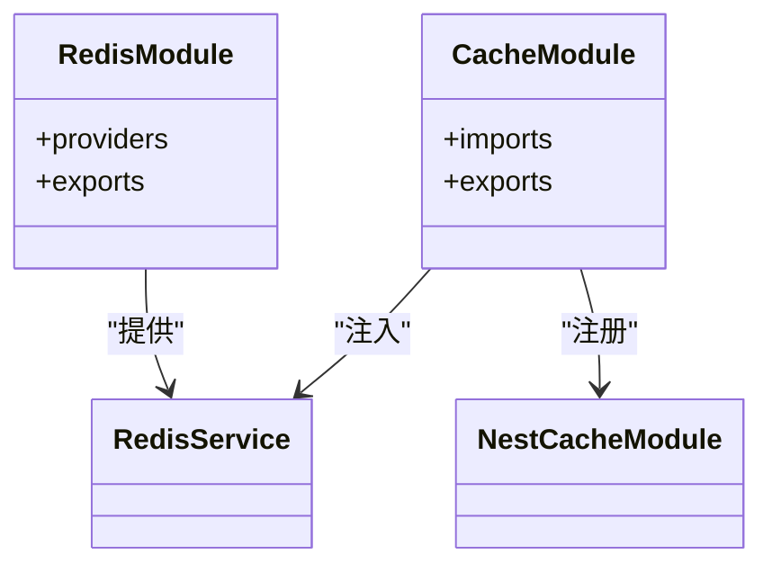
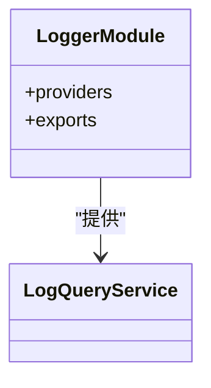
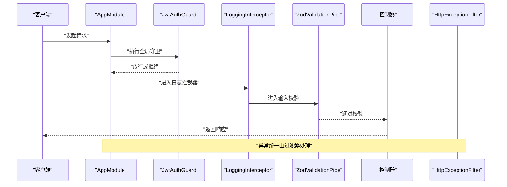
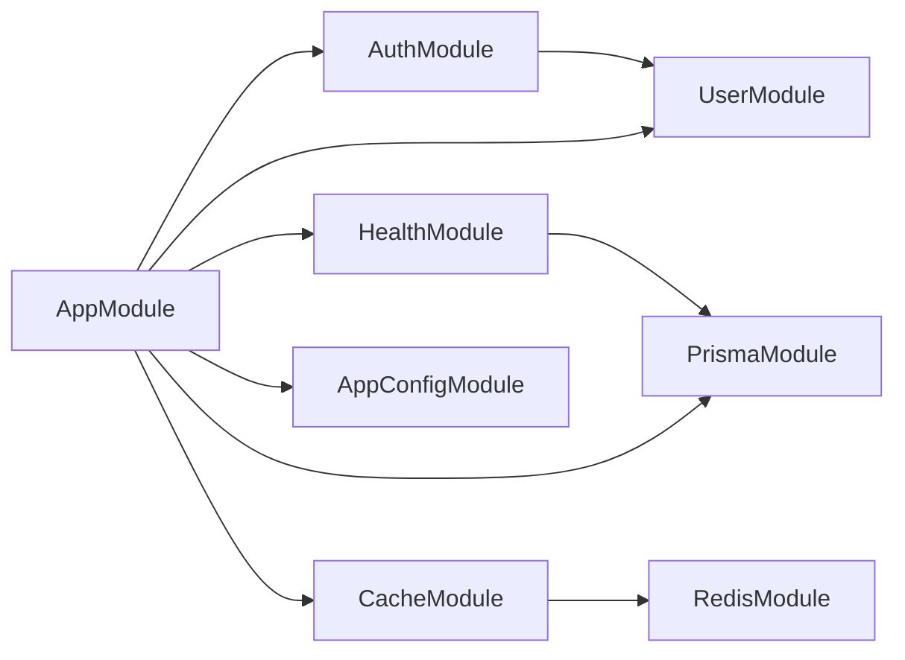

# 模块化设计模式

<cite>
**本文引用的文件**
- [apps/nestjs-server/src/app.module.ts](file://apps/nestjs-server/src/app.module.ts)
- [apps/nestjs-server/src/main.ts](file://apps/nestjs-server/src/main.ts)
- [apps/nestjs-server/src/modules/auth/auth.module.ts](file://apps/nestjs-server/src/modules/auth/auth.module.ts)
- [apps/nestjs-server/src/modules/auth/auth.service.ts](file://apps/nestjs-server/src/modules/auth/auth.service.ts)
- [apps/nestjs-server/src/modules/user/user.module.ts](file://apps/nestjs-server/src/modules/user/user.module.ts)
- [apps/nestjs-server/src/modules/user/user.service.ts](file://apps/nestjs-server/src/modules/user/user.service.ts)
- [apps/nestjs-server/src/modules/health/health.module.ts](file://apps/nestjs-server/src/modules/health/health.module.ts)
- [apps/nestjs-server/src/modules/cache/cache.module.ts](file://apps/nestjs-server/src/modules/cache/cache.module.ts)
- [apps/nestjs-server/src/modules/logger/logger.module.ts](file://apps/nestjs-server/src/modules/logger/logger.module.ts)
- [apps/nestjs-server/src/modules/redis/redis.module.ts](file://apps/nestjs-server/src/modules/redis/redis.module.ts)
- [apps/nestjs-server/src/prisma/prisma.module.ts](file://apps/nestjs-server/src/prisma/prisma.module.ts)
- [apps/nestjs-server/src/config/config.module.ts](file://apps/nestjs-server/src/config/config.module.ts)
- [apps/nestjs-server/src/common/guards/jwt-auth.guard.ts](file://apps/nestjs-server/src/common/guards/jwt-auth.guard.ts)
- [apps/nestjs-server/src/common/interceptors/logging.interceptor.ts](file://apps/nestjs-server/src/common/interceptors/logging.interceptor.ts)
- [apps/nestjs-server/src/common/filters/http-exception.filter.ts](file://apps/nestjs-server/src/common/filters/http-exception.filter.ts)
</cite>

## 目录

1. [引言](#引言)
2. [项目结构](#项目结构)
3. [核心组件](#核心组件)
4. [架构总览](#架构总览)
5. [详细组件分析](#详细组件分析)
6. [依赖分析](#依赖分析)
7. [性能考虑](#性能考虑)
8. [故障排查指南](#故障排查指南)
9. [结论](#结论)
10. [附录](#附录)

## 引言

本文件系统性梳理并阐释本项目的模块化设计模式，围绕 NestJS 模块系统的架构原理与最佳实践展开，重点覆盖以下主题：

- 模块的创建、导入与导出机制
- 全局模块、可选模块与动态模块的使用场景与实现方式
- 模块间的依赖注入关系与生命周期管理
- 功能模块的组织原则与设计思路（认证、用户、健康检查等）
- 实际应用场景与代码级流程图示

通过逐层递进的方式，帮助读者在理解现有实现的基础上，构建可扩展、可维护的模块化架构。

## 项目结构

本项目采用多模块分层组织，入口应用模块集中编排各功能模块；配置、数据访问、鉴权、缓存、日志、健康检查等功能模块按职责拆分，形成高内聚、低耦合的模块体系。

图表来源

- [apps/nestjs-server/src/app.module.ts:19-34](file://apps/nestjs-server/src/app.module.ts#L19-L34)
- [apps/nestjs-server/src/main.ts:9-35](file://apps/nestjs-server/src/main.ts#L9-L35)
- [apps/nestjs-server/src/config/config.module.ts:6-18](file://apps/nestjs-server/src/config/config.module.ts#L6-L18)
- [apps/nestjs-server/src/prisma/prisma.module.ts:4-8](file://apps/nestjs-server/src/prisma/prisma.module.ts#L4-L8)
- [apps/nestjs-server/src/modules/redis/redis.module.ts:4-7](file://apps/nestjs-server/src/modules/redis/redis.module.ts#L4-L7)
- [apps/nestjs-server/src/modules/cache/cache.module.ts:7-18](file://apps/nestjs-server/src/modules/cache/cache.module.ts#L7-L18)
- [apps/nestjs-server/src/modules/auth/auth.module.ts:12-32](file://apps/nestjs-server/src/modules/auth/auth.module.ts#L12-L32)
- [apps/nestjs-server/src/modules/user/user.module.ts:5-8](file://apps/nestjs-server/src/modules/user/user.module.ts#L5-L8)
- [apps/nestjs-server/src/modules/health/health.module.ts:5-7](file://apps/nestjs-server/src/modules/health/health.module.ts#L5-L7)
- [apps/nestjs-server/src/modules/logger/logger.module.ts:4-6](file://apps/nestjs-server/src/modules/logger/logger.module.ts#L4-L6)

章节来源

- [apps/nestjs-server/src/app.module.ts:1-63](file://apps/nestjs-server/src/app.module.ts#L1-L63)
- [apps/nestjs-server/src/main.ts:1-47](file://apps/nestjs-server/src/main.ts#L1-L47)

## 核心组件

本节聚焦于模块系统的“创建—导入—导出”三要素，以及全局模块、动态模块、可选模块的实践要点。

- 创建模块
  - 使用装饰器声明模块，指定 imports、controllers、providers、exports 字段，明确模块边界与对外暴露能力。
  - 示例：认证模块通过 imports 引入用户模块、Passport 与 JWT 动态模块；通过 exports 暴露服务供其他模块使用。
  - 参考路径：[apps/nestjs-server/src/modules/auth/auth.module.ts:12-32](file://apps/nestjs-server/src/modules/auth/auth.module.ts#L12-L32)

- 导入模块
  - 在父模块 imports 中引入子模块，实现依赖传递与共享资源复用。
  - 示例：应用模块集中导入配置、数据访问、缓存、认证、用户、健康检查、日志等模块。
  - 参考路径：[apps/nestjs-server/src/app.module.ts:20-34](file://apps/nestjs-server/src/app.module.ts#L20-L34)

- 导出模块
  - 通过 exports 将内部 provider 暴露给其他模块使用，避免重复实例化与耦合。
  - 示例：用户模块导出 UserService；认证模块导出 AuthService；全局模块导出服务供任意模块注入。
  - 参考路径：[apps/nestjs-server/src/modules/user/user.module.ts:7-8](file://apps/nestjs-server/src/modules/user/user.module.ts#L7-L8), [apps/nestjs-server/src/modules/auth/auth.module.ts:32](file://apps/nestjs-server/src/modules/auth/auth.module.ts#L32)

- 全局模块
  - 使用 @Global() 装饰器使模块在全局范围内可用，无需重复导入。
  - 示例：配置模块、数据访问模块、Redis 模块均标记为全局模块，便于跨模块注入。
  - 参考路径：[apps/nestjs-server/src/config/config.module.ts:6](file://apps/nestjs-server/src/config/config.module.ts#L6), [apps/nestjs-server/src/prisma/prisma.module.ts:4](file://apps/nestjs-server/src/prisma/prisma.module.ts#L4), [apps/nestjs-server/src/modules/redis/redis.module.ts:4](file://apps/nestjs-server/src/modules/redis/redis.module.ts#L4)

- 动态模块
  - 使用 registerAsync/useFactory 注册动态配置，结合注入器完成延迟初始化与参数装配。
  - 示例：认证模块的 JWT 动态注册从配置服务读取密钥与过期时间；缓存模块动态配置 Redis 存储。
  - 参考路径：[apps/nestjs-server/src/modules/auth/auth.module.ts:16-28](file://apps/nestjs-server/src/modules/auth/auth.module.ts#L16-L28), [apps/nestjs-server/src/modules/cache/cache.module.ts:8-17](file://apps/nestjs-server/src/modules/cache/cache.module.ts#L8-L17)

- 可选模块
  - 通过 imports 中的条件判断或外部配置控制模块是否启用，实现按需加载。
  - 示例：应用模块中对 Redis、缓存、健康检查等模块的引入可根据环境或需求调整。
  - 参考路径：[apps/nestjs-server/src/app.module.ts:20-34](file://apps/nestjs-server/src/app.module.ts#L20-L34)

章节来源

- [apps/nestjs-server/src/modules/auth/auth.module.ts:12-32](file://apps/nestjs-server/src/modules/auth/auth.module.ts#L12-L32)
- [apps/nestjs-server/src/app.module.ts:20-34](file://apps/nestjs-server/src/app.module.ts#L20-L34)
- [apps/nestjs-server/src/modules/user/user.module.ts:5-8](file://apps/nestjs-server/src/modules/user/user.module.ts#L5-L8)
- [apps/nestjs-server/src/config/config.module.ts:6](file://apps/nestjs-server/src/config/config.module.ts#L6)
- [apps/nestjs-server/src/prisma/prisma.module.ts:4](file://apps/nestjs-server/src/prisma/prisma.module.ts#L4)
- [apps/nestjs-server/src/modules/redis/redis.module.ts:4](file://apps/nestjs-server/src/modules/redis/redis.module.ts#L4)
- [apps/nestjs-server/src/modules/cache/cache.module.ts:8-17](file://apps/nestjs-server/src/modules/cache/cache.module.ts#L8-L17)

## 架构总览

下图展示应用启动后，模块间依赖与控制流的关键交互：

图表来源

- [apps/nestjs-server/src/main.ts:9-35](file://apps/nestjs-server/src/main.ts#L9-L35)
- [apps/nestjs-server/src/app.module.ts:19-34](file://apps/nestjs-server/src/app.module.ts#L19-L34)
- [apps/nestjs-server/src/config/config.module.ts:6-18](file://apps/nestjs-server/src/config/config.module.ts#L6-L18)
- [apps/nestjs-server/src/modules/redis/redis.module.ts:4-7](file://apps/nestjs-server/src/modules/redis/redis.module.ts#L4-L7)
- [apps/nestjs-server/src/modules/cache/cache.module.ts:7-18](file://apps/nestjs-server/src/modules/cache/cache.module.ts#L7-L18)
- [apps/nestjs-server/src/prisma/prisma.module.ts:4-8](file://apps/nestjs-server/src/prisma/prisma.module.ts#L4-L8)
- [apps/nestjs-server/src/modules/auth/auth.module.ts:12-32](file://apps/nestjs-server/src/modules/auth/auth.module.ts#L12-L32)
- [apps/nestjs-server/src/modules/health/health.module.ts:5-7](file://apps/nestjs-server/src/modules/health/health.module.ts#L5-L7)

## 详细组件分析

### 认证模块（AuthModule）

- 设计目标
  - 提供基于 JWT 的登录、注册、刷新与登出能力；封装令牌签发与持久化逻辑；与用户模块解耦。
- 关键点
  - 动态注册 JWT：从配置服务读取密钥与过期时间，确保配置驱动与灵活性。
  - 依赖注入：AuthService 同时依赖 PrismaService、UserService、JwtService、TypedConfigService。
  - 导出服务：向其他模块暴露 AuthService，便于控制器或其他服务调用。
- 依赖关系

图表来源

- [apps/nestjs-server/src/modules/auth/auth.module.ts:12-32](file://apps/nestjs-server/src/modules/auth/auth.module.ts#L12-L32)
- [apps/nestjs-server/src/modules/auth/auth.service.ts:14-21](file://apps/nestjs-server/src/modules/auth/auth.service.ts#L14-L21)
- [apps/nestjs-server/src/modules/user/user.service.ts:13-15](file://apps/nestjs-server/src/modules/user/user.service.ts#L13-L15)

章节来源

- [apps/nestjs-server/src/modules/auth/auth.module.ts:12-32](file://apps/nestjs-server/src/modules/auth/auth.module.ts#L12-L32)
- [apps/nestjs-server/src/modules/auth/auth.service.ts:14-151](file://apps/nestjs-server/src/modules/auth/auth.service.ts#L14-L151)
- [apps/nestjs-server/src/modules/user/user.service.ts:13-113](file://apps/nestjs-server/src/modules/user/user.service.ts#L13-L113)

### 用户模块（UserModule）

- 设计目标
  - 提供用户 CRUD 与密码校验等基础能力；为认证模块提供用户数据支持。
- 关键点
  - 仅导出 UserService，避免控制器与业务细节外溢。
  - 与 PrismaService 协作，保证数据访问的一致性与安全性。
- 依赖关系

图表来源

- [apps/nestjs-server/src/modules/user/user.module.ts:5-8](file://apps/nestjs-server/src/modules/user/user.module.ts#L5-L8)
- [apps/nestjs-server/src/modules/user/user.service.ts:13-15](file://apps/nestjs-server/src/modules/user/user.service.ts#L13-L15)

章节来源

- [apps/nestjs-server/src/modules/user/user.module.ts:5-11](file://apps/nestjs-server/src/modules/user/user.module.ts#L5-L11)
- [apps/nestjs-server/src/modules/user/user.service.ts:13-113](file://apps/nestjs-server/src/modules/user/user.service.ts#L13-L113)

### 健康检查模块（HealthModule）

- 设计目标
  - 提供系统健康状态检查接口；复用 PrismaModule 进行数据库连通性验证。
- 关键点
  - 通过导入 PrismaModule 获取 PrismaService，减少重复实现。
- 依赖关系

图表来源

- [apps/nestjs-server/src/modules/health/health.module.ts:5-7](file://apps/nestjs-server/src/modules/health/health.module.ts#L5-L7)
- [apps/nestjs-server/src/prisma/prisma.module.ts:4-8](file://apps/nestjs-server/src/prisma/prisma.module.ts#L4-L8)

章节来源

- [apps/nestjs-server/src/modules/health/health.module.ts:1-10](file://apps/nestjs-server/src/modules/health/health.module.ts#L1-L10)
- [apps/nestjs-server/src/prisma/prisma.module.ts:1-10](file://apps/nestjs-server/src/prisma/prisma.module.ts#L1-L10)

### 缓存模块（CacheModule）与全局 Redis（RedisModule）

- 设计目标
  - 以全局缓存模块提供统一的缓存能力；RedisModule 作为全局 Redis 服务，被缓存模块消费。
- 关键点
  - CacheModule 使用 registerAsync 注册缓存，注入 RedisService 并配置 KeyvRedis 存储。
  - RedisModule 与 PrismaModule 一样标记为全局模块，便于跨模块注入。
- 依赖关系

图表来源

- [apps/nestjs-server/src/modules/cache/cache.module.ts:7-18](file://apps/nestjs-server/src/modules/cache/cache.module.ts#L7-L18)
- [apps/nestjs-server/src/modules/redis/redis.module.ts:4-7](file://apps/nestjs-server/src/modules/redis/redis.module.ts#L4-L7)

章节来源

- [apps/nestjs-server/src/modules/cache/cache.module.ts:1-22](file://apps/nestjs-server/src/modules/cache/cache.module.ts#L1-L22)
- [apps/nestjs-server/src/modules/redis/redis.module.ts:1-10](file://apps/nestjs-server/src/modules/redis/redis.module.ts#L1-L10)

### 日志模块（LoggerModule）

- 设计目标
  - 提供日志查询服务，供其他模块使用；通过导出服务实现能力复用。
- 关键点
  - 仅导出 LogQueryService，保持模块边界清晰。
- 依赖关系

图表来源

- [apps/nestjs-server/src/modules/logger/logger.module.ts:4-6](file://apps/nestjs-server/src/modules/logger/logger.module.ts#L4-L6)

章节来源

- [apps/nestjs-server/src/modules/logger/logger.module.ts:1-9](file://apps/nestjs-server/src/modules/logger/logger.module.ts#L1-L9)

### 应用模块（AppModule）与全局守卫/拦截器/过滤器

- 设计目标
  - 作为应用聚合根，集中导入各功能模块；通过 providers 注入全局守卫、拦截器、管道与过滤器。
- 关键点
  - 安全：全局 JwtAuthGuard 与自定义 ThrottlerGuard 保护路由。
  - 可观测性：全局 LoggingInterceptor 记录请求日志；TransformInterceptor 统一响应包装。
  - 错误处理：全局 HttpExceptionFilter 统一异常转换与返回格式。
  - 输入校验：全局 ZodValidationPipe 提供请求体校验。
- 控制流

图表来源

- [apps/nestjs-server/src/app.module.ts:35-59](file://apps/nestjs-server/src/app.module.ts#L35-L59)
- [apps/nestjs-server/src/common/guards/jwt-auth.guard.ts:17-42](file://apps/nestjs-server/src/common/guards/jwt-auth.guard.ts#L17-L42)
- [apps/nestjs-server/src/common/interceptors/logging.interceptor.ts:7-28](file://apps/nestjs-server/src/common/interceptors/logging.interceptor.ts#L7-L28)
- [apps/nestjs-server/src/common/filters/http-exception.filter.ts:16-68](file://apps/nestjs-server/src/common/filters/http-exception.filter.ts#L16-L68)

章节来源

- [apps/nestjs-server/src/app.module.ts:19-61](file://apps/nestjs-server/src/app.module.ts#L19-L61)
- [apps/nestjs-server/src/common/guards/jwt-auth.guard.ts:1-43](file://apps/nestjs-server/src/common/guards/jwt-auth.guard.ts#L1-L43)
- [apps/nestjs-server/src/common/interceptors/logging.interceptor.ts:1-30](file://apps/nestjs-server/src/common/interceptors/logging.interceptor.ts#L1-L30)
- [apps/nestjs-server/src/common/filters/http-exception.filter.ts:1-208](file://apps/nestjs-server/src/common/filters/http-exception.filter.ts#L1-L208)

## 依赖分析

- 模块耦合与内聚
  - AuthModule 与 UserModule 存在直接依赖，体现“认证依赖用户”的合理边界。
  - HealthModule 依赖 PrismaModule，形成“监控依赖数据访问”的清晰职责。
  - CacheModule 依赖 RedisModule，体现“缓存依赖存储”的常见组合。
- 外部依赖与集成点
  - JWT、Passport、缓存存储（KeyvRedis）、Swagger 文档生成等。
- 循环依赖规避
  - 通过 exports 明确暴露边界，避免在 imports 中互相引用造成循环。

图表来源

- [apps/nestjs-server/src/app.module.ts:19-34](file://apps/nestjs-server/src/app.module.ts#L19-L34)
- [apps/nestjs-server/src/modules/auth/auth.module.ts:12-32](file://apps/nestjs-server/src/modules/auth/auth.module.ts#L12-L32)
- [apps/nestjs-server/src/modules/health/health.module.ts:5-7](file://apps/nestjs-server/src/modules/health/health.module.ts#L5-L7)
- [apps/nestjs-server/src/modules/cache/cache.module.ts:7-18](file://apps/nestjs-server/src/modules/cache/cache.module.ts#L7-L18)
- [apps/nestjs-server/src/modules/redis/redis.module.ts:4-7](file://apps/nestjs-server/src/modules/redis/redis.module.ts#L4-L7)
- [apps/nestjs-server/src/prisma/prisma.module.ts:4-8](file://apps/nestjs-server/src/prisma/prisma.module.ts#L4-L8)
- [apps/nestjs-server/src/config/config.module.ts:6-18](file://apps/nestjs-server/src/config/config.module.ts#L6-L18)

章节来源

- [apps/nestjs-server/src/app.module.ts:19-34](file://apps/nestjs-server/src/app.module.ts#L19-L34)
- [apps/nestjs-server/src/modules/auth/auth.module.ts:12-32](file://apps/nestjs-server/src/modules/auth/auth.module.ts#L12-L32)
- [apps/nestjs-server/src/modules/health/health.module.ts:5-7](file://apps/nestjs-server/src/modules/health/health.module.ts#L5-L7)
- [apps/nestjs-server/src/modules/cache/cache.module.ts:7-18](file://apps/nestjs-server/src/modules/cache/cache.module.ts#L7-L18)
- [apps/nestjs-server/src/modules/redis/redis.module.ts:4-7](file://apps/nestjs-server/src/modules/redis/redis.module.ts#L4-L7)
- [apps/nestjs-server/src/prisma/prisma.module.ts:4-8](file://apps/nestjs-server/src/prisma/prisma.module.ts#L4-L8)
- [apps/nestjs-server/src/config/config.module.ts:6-18](file://apps/nestjs-server/src/config/config.module.ts#L6-L18)

## 性能考虑

- 全局模块的使用
  - 将高频使用的配置、缓存、Redis 等服务标记为全局模块，减少重复导入与实例化开销。
- 动态模块的延迟初始化
  - 通过 registerAsync 延迟装配配置与外部依赖，降低启动时阻塞。
- 缓存策略
  - 使用 KeyvRedis 作为缓存存储，结合合理的 TTL 与并发访问控制，提升读写性能。
- 请求链路优化
  - 全局拦截器与过滤器应尽量轻量，避免在热路径上进行重 IO 操作。

## 故障排查指南

- 全局守卫与权限
  - 若出现未授权访问，检查 JwtAuthGuard 是否正确识别公共接口注解，确认 Reflector 的元数据覆盖是否生效。
  - 参考路径：[apps/nestjs-server/src/common/guards/jwt-auth.guard.ts:23-34](file://apps/nestjs-server/src/common/guards/jwt-auth.guard.ts#L23-L34)
- 日志与可观测性
  - 通过 LoggingInterceptor 输出请求方法、URL、状态码与耗时，定位慢请求与异常路径。
  - 参考路径：[apps/nestjs-server/src/common/interceptors/logging.interceptor.ts:10-27](file://apps/nestjs-server/src/common/interceptors/logging.interceptor.ts#L10-L27)
- 异常统一处理
  - HttpExceptionFilter 将业务异常与通用 HTTP 异常映射为统一响应格式，便于前端与监控系统消费。
  - 参考路径：[apps/nestjs-server/src/common/filters/http-exception.filter.ts:16-68](file://apps/nestjs-server/src/common/filters/http-exception.filter.ts#L16-L68)
- 配置与启动
  - 确认 AppConfigModule 已正确加载配置并导出 TypedConfigService；main.ts 中的 CORS、Swagger、全局前缀等设置符合预期。
  - 参考路径：[apps/nestjs-server/src/config/config.module.ts:6-18](file://apps/nestjs-server/src/config/config.module.ts#L6-L18), [apps/nestjs-server/src/main.ts:14-33](file://apps/nestjs-server/src/main.ts#L14-L33)

章节来源

- [apps/nestjs-server/src/common/guards/jwt-auth.guard.ts:17-42](file://apps/nestjs-server/src/common/guards/jwt-auth.guard.ts#L17-L42)
- [apps/nestjs-server/src/common/interceptors/logging.interceptor.ts:7-28](file://apps/nestjs-server/src/common/interceptors/logging.interceptor.ts#L7-L28)
- [apps/nestjs-server/src/common/filters/http-exception.filter.ts:16-68](file://apps/nestjs-server/src/common/filters/http-exception.filter.ts#L16-L68)
- [apps/nestjs-server/src/config/config.module.ts:6-18](file://apps/nestjs-server/src/config/config.module.ts#L6-L18)
- [apps/nestjs-server/src/main.ts:14-33](file://apps/nestjs-server/src/main.ts#L14-L33)

## 结论

本项目通过模块化设计实现了清晰的职责划分与可扩展的架构。全局模块与动态模块的恰当使用提升了配置灵活性与启动效率；认证、用户、缓存、日志、健康检查等模块围绕依赖注入与导出机制协同工作，形成稳定可靠的业务基座。建议在后续演进中持续遵循“高内聚、低耦合、显式依赖、最小暴露面”的原则，进一步完善测试与文档，确保模块化架构的长期可维护性。

## 附录

- 最佳实践清单
  - 使用 @Global() 仅限于真正需要全局可见的服务（如配置、Redis、数据访问）。
  - 动态模块优先使用 registerAsync，配合 useFactory 与 inject，实现配置驱动与依赖注入。
  - 通过 exports 明确模块对外暴露能力，避免在 imports 中互相导入造成循环。
  - 全局守卫/拦截器/过滤器应保持轻量，避免成为性能瓶颈。
  - 为每个功能模块提供独立的 DTO、Service、Controller，并在模块内收敛边界。
