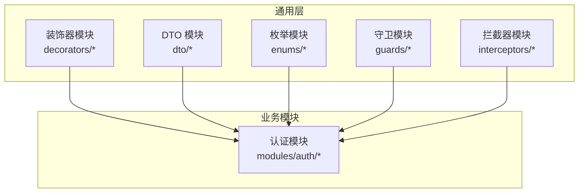
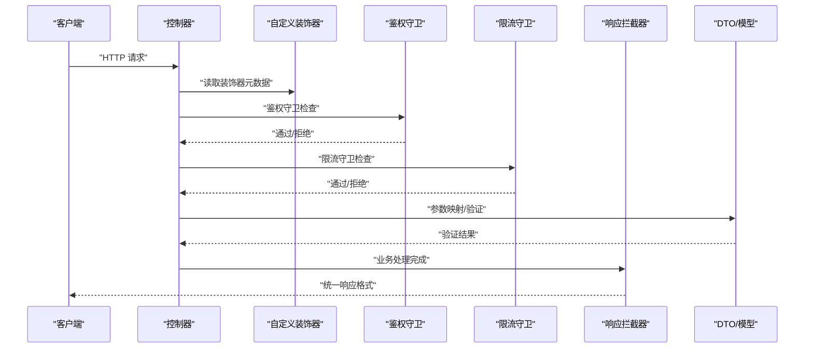
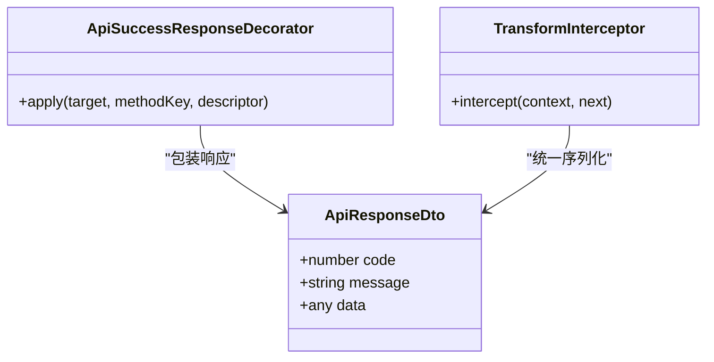
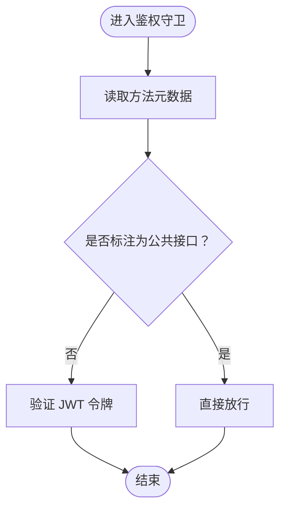
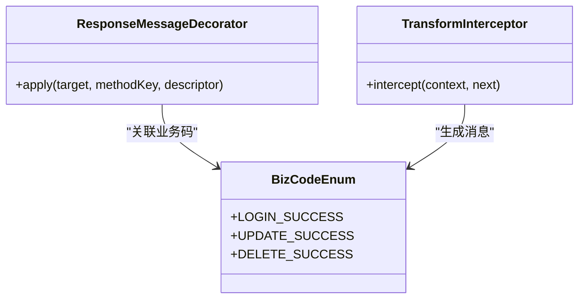
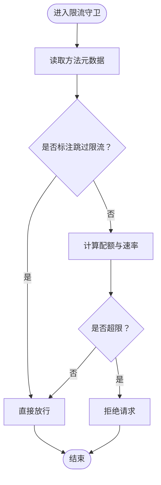
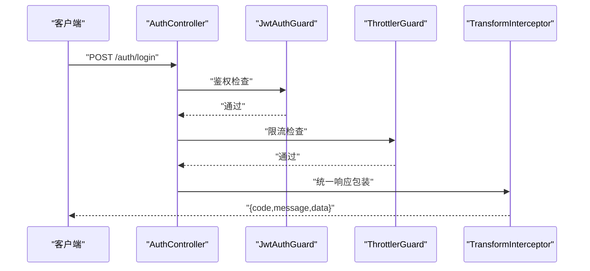
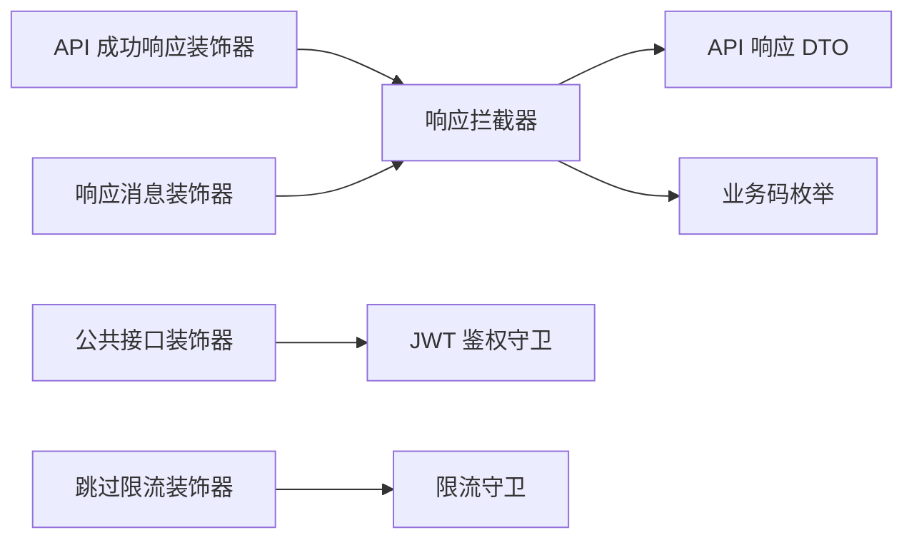

# 装饰器模式应用

<cite>
**本文引用的文件**
- [api-success-response.decorator.ts](file://apps/nestjs-server/src/common/decorators/api-success-response.decorator.ts)
- [public.decorator.ts](file://apps/nestjs-server/src/common/decorators/public.decorator.ts)
- [response-message.decorator.ts](file://apps/nestjs-server/src/common/decorators/response-message.decorator.ts)
- [skip-throttle.decorator.ts](file://apps/nestjs-server/src/common/decorators/skip-throttle.decorator.ts)
- [auth.controller.ts](file://apps/nestjs-server/src/modules/auth/auth.controller.ts)
- [jwt-auth.guard.ts](file://apps/nestjs-server/src/common/guards/jwt-auth.guard.ts)
- [throttler.guard.ts](file://apps/nestjs-server/src/common/guards/throttler.guard.ts)
- [transform.interceptor.ts](file://apps/nestjs-server/src/common/interceptors/transform.interceptor.ts)
- [logging.interceptor.ts](file://apps/nestjs-server/src/common/interceptors/logging.interceptor.ts)
- [api-response.dto.ts](file://apps/nestjs-server/src/common/dto/api-response.dto.ts)
- [api-error-response.dto.ts](file://apps/nestjs-server/src/common/dto/api-error-response.dto.ts)
- [biz-code.enum.ts](file://apps/nestjs-server/src/common/enums/biz-code.enum.ts)
- [auth.service.ts](file://apps/nestjs-server/src/modules/auth/auth.service.ts)
- [app.module.ts](file://apps/nestjs-server/src/app.module.ts)
- [main.ts](file://apps/nestjs-server/src/main.ts)
</cite>

## 目录

1. [引言](#引言)
2. [项目结构](#项目结构)
3. [核心组件](#核心组件)
4. [架构总览](#架构总览)
5. [详细组件分析](#详细组件分析)
6. [依赖关系分析](#依赖关系分析)
7. [性能考量](#性能考量)
8. [故障排查指南](#故障排查指南)
9. [结论](#结论)
10. [附录](#附录)

## 引言

本文件系统性梳理并深入解析该 NestJS 项目中装饰器模式的应用与实现，覆盖内置装饰器（如 Controller、Get、Post、Body、Param 等）的使用方式与执行机制，以及自定义装饰器（如 API 成功响应装饰器、公共接口装饰器、响应消息装饰器、跳过限流装饰器）的设计思路与最佳实践。文档同时解释装饰器的执行顺序与组合策略，并通过路由保护、参数验证、响应格式化等典型场景展示其工程化价值。

## 项目结构

该项目采用多包工作区组织，后端服务位于 apps/nestjs-server，装饰器相关代码集中于 apps/nestjs-server/src/common/decorators。装饰器通常与守卫（guards）、拦截器（interceptors）、DTO（数据传输对象）协同工作，形成统一的横切关注点处理链路。

**图表来源**

- [api-success-response.decorator.ts](file://apps/nestjs-server/src/common/decorators/api-success-response.decorator.ts)
- [public.decorator.ts](file://apps/nestjs-server/src/common/decorators/public.decorator.ts)
- [response-message.decorator.ts](file://apps/nestjs-server/src/common/decorators/response-message.decorator.ts)
- [skip-throttle.decorator.ts](file://apps/nestjs-server/src/common/decorators/skip-throttle.decorator.ts)
- [auth.controller.ts](file://apps/nestjs-server/src/modules/auth/auth.controller.ts)

**章节来源**

- [app.module.ts](file://apps/nestjs-server/src/app.module.ts)
- [main.ts](file://apps/nestjs-server/src/main.ts)

## 核心组件

本项目中的装饰器主要分为以下几类：

- 自定义响应装饰器：用于统一 API 成功响应格式，确保返回结构一致。
- 公共接口装饰器：标记无需鉴权的公开接口。
- 响应消息装饰器：为成功响应注入可读的消息字段。
- 跳过限流装饰器：允许特定接口绕过请求频率限制。

这些装饰器与守卫、拦截器、DTO 协同，构成“输入校验—鉴权—业务处理—输出格式化”的完整链路。

**章节来源**

- [api-success-response.decorator.ts](file://apps/nestjs-server/src/common/decorators/api-success-response.decorator.ts)
- [public.decorator.ts](file://apps/nestjs-server/src/common/decorators/public.decorator.ts)
- [response-message.decorator.ts](file://apps/nestjs-server/src/common/decorators/response-message.decorator.ts)
- [skip-throttle.decorator.ts](file://apps/nestjs-server/src/common/decorators/skip-throttle.decorator.ts)
- [api-response.dto.ts](file://apps/nestjs-server/src/common/dto/api-response.dto.ts)
- [biz-code.enum.ts](file://apps/nestjs-server/src/common/enums/biz-code.enum.ts)

## 架构总览

下图展示了从客户端请求到响应返回的关键路径，以及装饰器、守卫与拦截器的协作关系。

**图表来源**

- [auth.controller.ts](file://apps/nestjs-server/src/modules/auth/auth.controller.ts)
- [jwt-auth.guard.ts](file://apps/nestjs-server/src/common/guards/jwt-auth.guard.ts)
- [throttler.guard.ts](file://apps/nestjs-server/src/common/guards/throttler.guard.ts)
- [transform.interceptor.ts](file://apps/nestjs-server/src/common/interceptors/transform.interceptor.ts)
- [api-response.dto.ts](file://apps/nestjs-server/src/common/dto/api-response.dto.ts)

## 详细组件分析

### 自定义响应装饰器：API 成功响应装饰器

- 设计目标：统一 API 成功响应的数据结构，便于前端消费与错误收敛。
- 实现要点：通过装饰器在编译期或运行时收集控制器方法的元数据，结合拦截器对成功响应进行包装。
- 使用建议：与响应消息装饰器配合，保证消息一致性；与业务异常体系配合，避免混用不同响应格式。

**图表来源**

- [api-success-response.decorator.ts](file://apps/nestjs-server/src/common/decorators/api-success-response.decorator.ts)
- [api-response.dto.ts](file://apps/nestjs-server/src/common/dto/api-response.dto.ts)
- [transform.interceptor.ts](file://apps/nestjs-server/src/common/interceptors/transform.interceptor.ts)

**章节来源**

- [api-success-response.decorator.ts](file://apps/nestjs-server/src/common/decorators/api-success-response.decorator.ts)
- [api-response.dto.ts](file://apps/nestjs-server/src/common/dto/api-response.dto.ts)
- [transform.interceptor.ts](file://apps/nestjs-server/src/common/interceptors/transform.interceptor.ts)

### 公共接口装饰器：跳过鉴权

- 设计目标：标识无需 JWT 鉴权的公开接口，如登录、注册、验证码等。
- 实现要点：通过装饰器在元数据中打标，鉴权守卫根据该标记决定是否放行。
- 使用建议：仅对明确的公开接口使用；避免误用导致安全风险。

**图表来源**

- [public.decorator.ts](file://apps/nestjs-server/src/common/decorators/public.decorator.ts)
- [jwt-auth.guard.ts](file://apps/nestjs-server/src/common/guards/jwt-auth.guard.ts)

**章节来源**

- [public.decorator.ts](file://apps/nestjs-server/src/common/decorators/public.decorator.ts)
- [jwt-auth.guard.ts](file://apps/nestjs-server/src/common/guards/jwt-auth.guard.ts)

### 响应消息装饰器：统一消息语义

- 设计目标：为成功响应注入统一的消息字段，提升前端提示一致性。
- 实现要点：装饰器在编译期记录消息模板，在拦截器阶段按模板生成最终消息。
- 使用建议：与业务码枚举配合，确保消息与状态码一一对应。

**图表来源**

- [response-message.decorator.ts](file://apps/nestjs-server/src/common/decorators/response-message.decorator.ts)
- [biz-code.enum.ts](file://apps/nestjs-server/src/common/enums/biz-code.enum.ts)
- [transform.interceptor.ts](file://apps/nestjs-server/src/common/interceptors/transform.interceptor.ts)

**章节来源**

- [response-message.decorator.ts](file://apps/nestjs-server/src/common/decorators/response-message.decorator.ts)
- [biz-code.enum.ts](file://apps/nestjs-server/src/common/enums/biz-code.enum.ts)
- [transform.interceptor.ts](file://apps/nestjs-server/src/common/interceptors/transform.interceptor.ts)

### 跳过限流装饰器：灵活控制流量

- 设计目标：允许特定接口绕过全局限流策略，如健康检查、日志上报等。
- 实现要点：装饰器标记方法级豁免，限流守卫在决策前读取该标记。
- 使用建议：谨慎使用，仅对低频且稳定的接口启用。

**图表来源**

- [skip-throttle.decorator.ts](file://apps/nestjs-server/src/common/decorators/skip-throttle.decorator.ts)
- [throttler.guard.ts](file://apps/nestjs-server/src/common/guards/throttler.guard.ts)

**章节来源**

- [skip-throttle.decorator.ts](file://apps/nestjs-server/src/common/decorators/skip-throttle.decorator.ts)
- [throttler.guard.ts](file://apps/nestjs-server/src/common/guards/throttler.guard.ts)

### 控制器示例：认证模块

- 作用：演示装饰器在控制器中的组合使用，包括鉴权、限流、响应格式化等。
- 关键点：通过装饰器声明式地表达横切需求，减少样板代码。

**图表来源**

- [auth.controller.ts](file://apps/nestjs-server/src/modules/auth/auth.controller.ts)
- [jwt-auth.guard.ts](file://apps/nestjs-server/src/common/guards/jwt-auth.guard.ts)
- [throttler.guard.ts](file://apps/nestjs-server/src/common/guards/throttler.guard.ts)
- [transform.interceptor.ts](file://apps/nestjs-server/src/common/interceptors/transform.interceptor.ts)

**章节来源**

- [auth.controller.ts](file://apps/nestjs-server/src/modules/auth/auth.controller.ts)
- [auth.service.ts](file://apps/nestjs-server/src/modules/auth/auth.service.ts)

## 依赖关系分析

装饰器与守卫、拦截器之间存在松耦合的依赖关系，通过元数据与管道机制实现横切功能的组合。

**图表来源**

- [api-success-response.decorator.ts](file://apps/nestjs-server/src/common/decorators/api-success-response.decorator.ts)
- [public.decorator.ts](file://apps/nestjs-server/src/common/decorators/public.decorator.ts)
- [response-message.decorator.ts](file://apps/nestjs-server/src/common/decorators/response-message.decorator.ts)
- [skip-throttle.decorator.ts](file://apps/nestjs-server/src/common/decorators/skip-throttle.decorator.ts)
- [jwt-auth.guard.ts](file://apps/nestjs-server/src/common/guards/jwt-auth.guard.ts)
- [throttler.guard.ts](file://apps/nestjs-server/src/common/guards/throttler.guard.ts)
- [transform.interceptor.ts](file://apps/nestjs-server/src/common/interceptors/transform.interceptor.ts)
- [api-response.dto.ts](file://apps/nestjs-server/src/common/dto/api-response.dto.ts)
- [biz-code.enum.ts](file://apps/nestjs-server/src/common/enums/biz-code.enum.ts)

**章节来源**

- [app.module.ts](file://apps/nestjs-server/src/app.module.ts)

## 性能考量

- 元数据读取成本：装饰器在运行时读取元数据，建议避免在热路径上频繁反射调用。
- 拦截器链路：拦截器顺序影响整体延迟，应将轻量逻辑前置，重逻辑靠后。
- 守卫短路：鉴权失败应尽早返回，减少后续中间件开销。
- 缓存与复用：对重复的 DTO 序列化与消息拼接结果可考虑缓存。

## 故障排查指南

- 鉴权失败：确认公共接口装饰器是否正确标注，以及守卫是否生效。
- 响应格式异常：检查响应拦截器是否被正确注册，以及 DTO 字段是否匹配。
- 限流误伤：核对跳过限流装饰器是否应用于正确方法，避免过度豁免。
- 日志定位：通过日志拦截器输出上下文信息，辅助问题定位。

**章节来源**

- [logging.interceptor.ts](file://apps/nestjs-server/src/common/interceptors/logging.interceptor.ts)
- [api-error-response.dto.ts](file://apps/nestjs-server/src/common/dto/api-error-response.dto.ts)

## 结论

该 NestJS 项目通过装饰器模式将鉴权、限流、响应格式化等横切关注点以声明式方式融入控制器层，显著提升了代码可读性与可维护性。建议在团队内推广统一的装饰器命名规范与使用边界，持续优化拦截器与守卫的执行顺序，确保在安全性与性能之间取得平衡。

## 附录

- 内置装饰器参考：Controller、Get、Post、Body、Param 等在控制器中用于声明路由与绑定参数，结合 DTO 进行自动验证与转换。
- 最佳实践清单：
  - 将横切逻辑下沉至装饰器与拦截器，保持控制器简洁。
  - 明确装饰器职责边界，避免多重装饰器之间的冲突。
  - 对关键接口进行性能评估，必要时引入缓存与异步处理。
  - 统一日志与监控埋点，便于问题追踪与容量规划。
