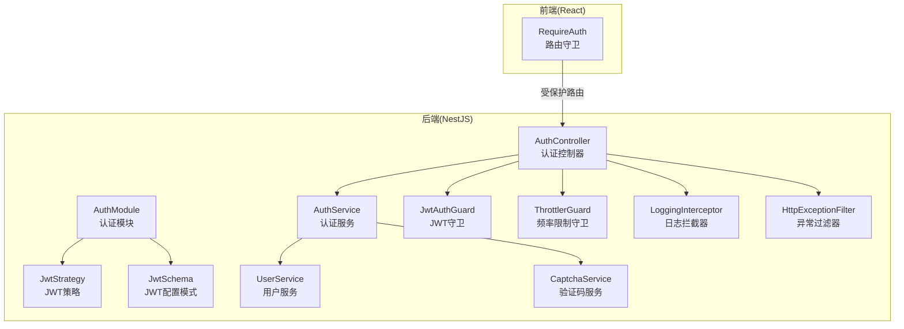
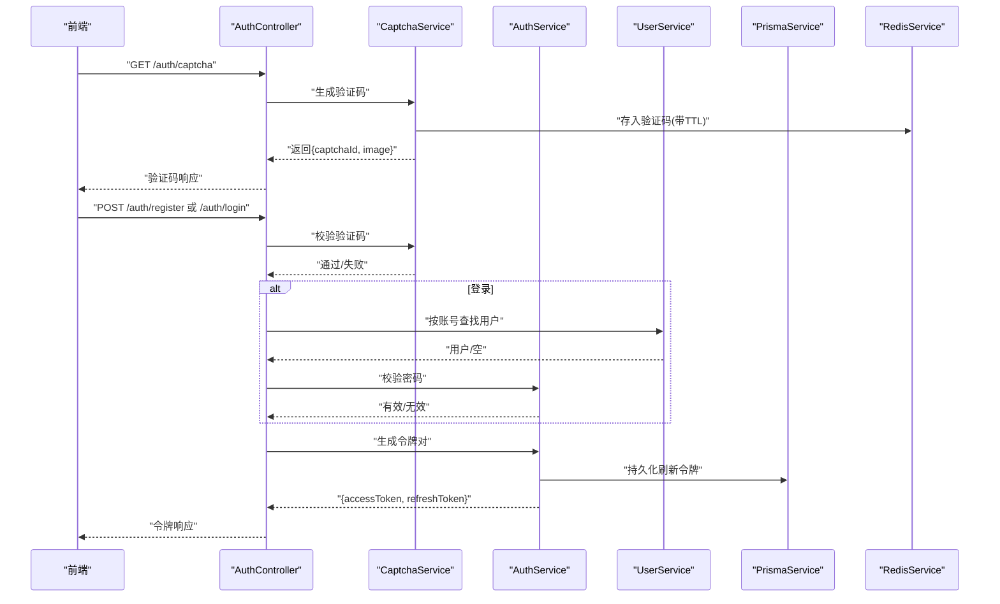
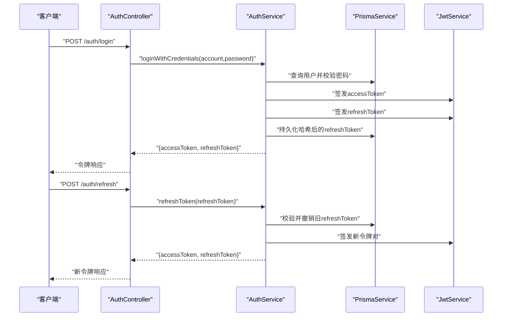
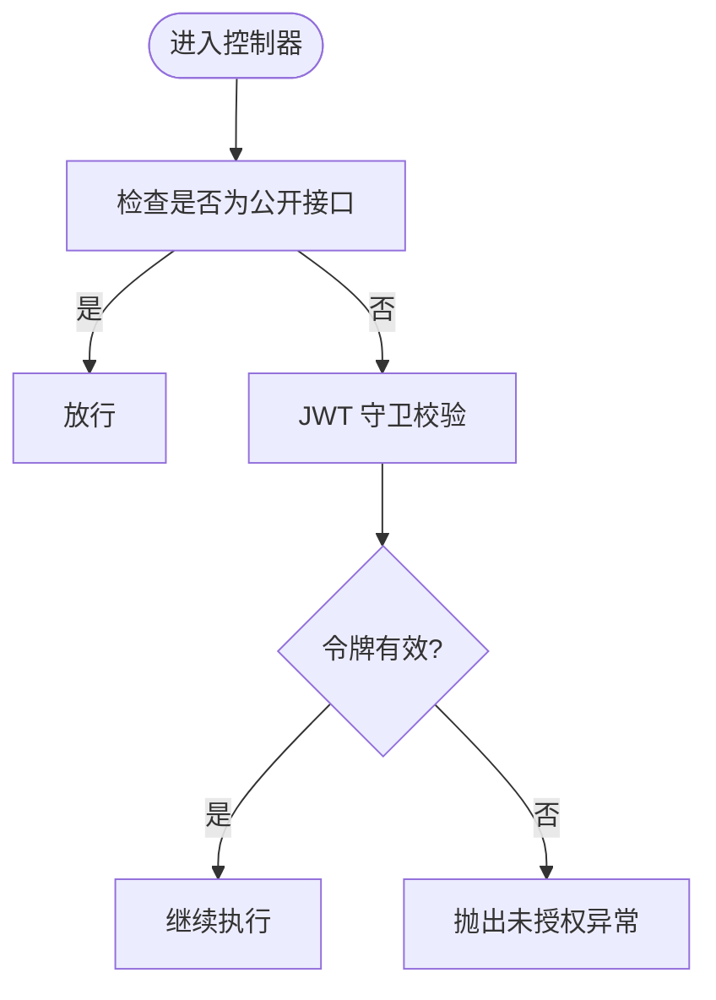
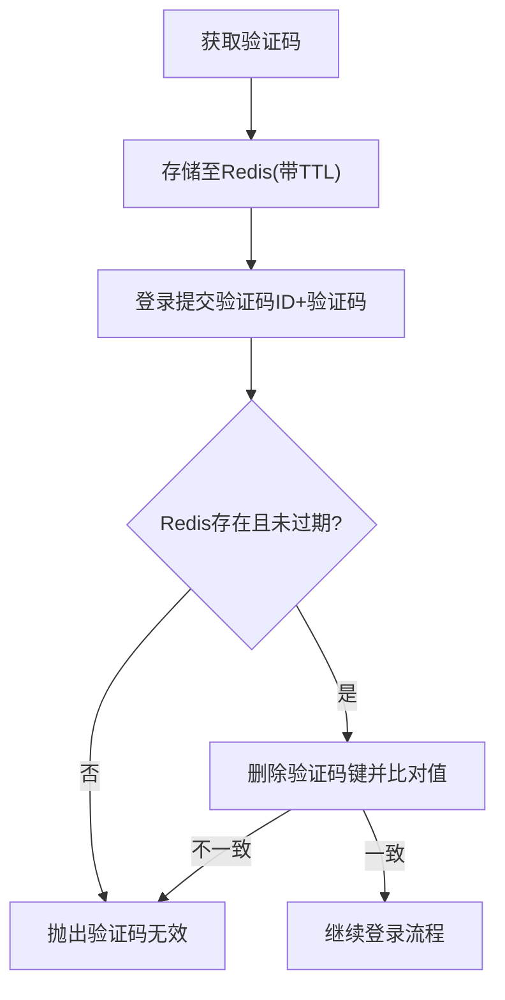
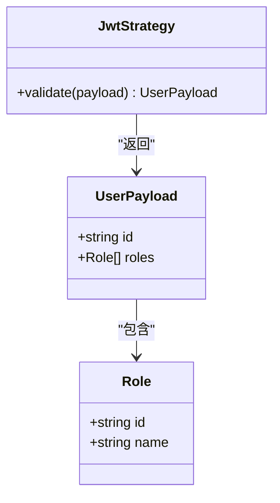
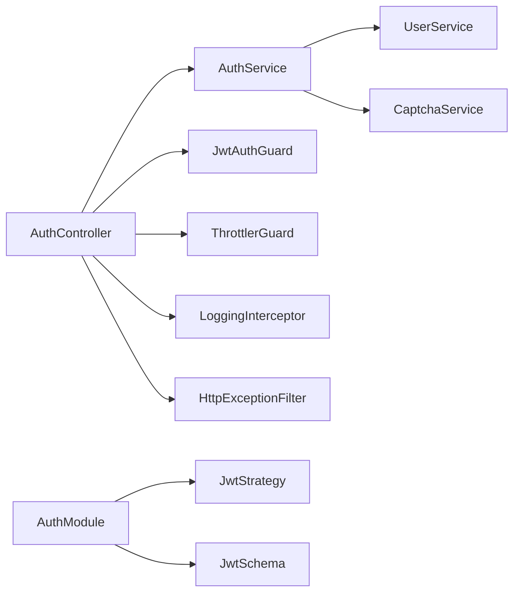

# 安全架构

<cite>
**本文引用的文件**
- [apps/nestjs-server/src/modules/auth/auth.service.ts](file://apps/nestjs-server/src/modules/auth/auth.service.ts)
- [apps/nestjs-server/src/modules/auth/auth.controller.ts](file://apps/nestjs-server/src/modules/auth/auth.controller.ts)
- [apps/nestjs-server/src/modules/auth/strategies/jwt.strategy.ts](file://apps/nestjs-server/src/modules/auth/strategies/jwt.strategy.ts)
- [apps/nestjs-server/src/common/guards/jwt-auth.guard.ts](file://apps/nestjs-server/src/common/guards/jwt-auth.guard.ts)
- [apps/nestjs-server/src/common/guards/throttler.guard.ts](file://apps/nestjs-server/src/common/guards/throttler.guard.ts)
- [apps/nestjs-server/src/modules/auth/auth.module.ts](file://apps/nestjs-server/src/modules/auth/auth.module.ts)
- [apps/nestjs-server/src/common/decorators/public.decorator.ts](file://apps/nestjs-server/src/common/decorators/public.decorator.ts)
- [apps/nestjs-server/src/common/decorators/skip-throttle.decorator.ts](file://apps/nestjs-server/src/common/decorators/skip-throttle.decorator.ts)
- [apps/nestjs-server/src/common/interceptors/logging.interceptor.ts](file://apps/nestjs-server/src/common/interceptors/logging.interceptor.ts)
- [apps/nestjs-server/src/common/filters/http-exception.filter.ts](file://apps/nestjs-server/src/common/filters/http-exception.filter.ts)
- [apps/nestjs-server/src/config/schemas/jwt.schema.ts](file://apps/nestjs-server/src/config/schemas/jwt.schema.ts)
- [apps/nestjs-server/src/modules/auth/captcha.service.ts](file://apps/nestjs-server/src/modules/auth/captcha.service.ts)
- [apps/nestjs-server/src/common/utils/sanitize.util.ts](file://apps/nestjs-server/src/common/utils/sanitize.util.ts)
- [apps/nestjs-server/src/modules/user/user.service.ts](file://apps/nestjs-server/src/modules/user/user.service.ts)
- [apps/web/src/components/RequireAuth.tsx](file://apps/web/src/components/RequireAuth.tsx)
</cite>

## 目录

1. [引言](#引言)
2. [项目结构](#项目结构)
3. [核心组件](#核心组件)
4. [架构总览](#架构总览)
5. [详细组件分析](#详细组件分析)
6. [依赖关系分析](#依赖关系分析)
7. [性能与安全特性](#性能与安全特性)
8. [故障排查指南](#故障排查指南)
9. [结论](#结论)
10. [附录](#附录)

## 引言

本文件系统化梳理后端与前端的安全架构设计与实现，重点覆盖以下方面：

- JWT 令牌认证流程与密钥管理
- 权限控制策略与安全守卫
- 请求频率限制与验证码防护
- 输入验证与敏感信息脱敏
- 角色权限模型与资源访问控制
- 安全审计与异常处理
- 安全威胁分析、防护措施与最佳实践
- 安全配置示例与漏洞防护指南

## 项目结构

后端采用 NestJS 架构，安全相关能力集中在认证模块、守卫、拦截器、过滤器与配置中；前端通过路由守卫保障未授权访问拦截。

图表来源

- [apps/nestjs-server/src/modules/auth/auth.module.ts:12-34](file://apps/nestjs-server/src/modules/auth/auth.module.ts#L12-L34)
- [apps/nestjs-server/src/modules/auth/auth.controller.ts:30-114](file://apps/nestjs-server/src/modules/auth/auth.controller.ts#L30-L114)
- [apps/nestjs-server/src/modules/auth/auth.service.ts:14-150](file://apps/nestjs-server/src/modules/auth/auth.service.ts#L14-L150)
- [apps/nestjs-server/src/modules/user/user.service.ts:14-112](file://apps/nestjs-server/src/modules/user/user.service.ts#L14-L112)
- [apps/nestjs-server/src/modules/auth/captcha.service.ts:18-66](file://apps/nestjs-server/src/modules/auth/captcha.service.ts#L18-L66)
- [apps/nestjs-server/src/common/guards/jwt-auth.guard.ts:17-42](file://apps/nestjs-server/src/common/guards/jwt-auth.guard.ts#L17-L42)
- [apps/nestjs-server/src/common/guards/throttler.guard.ts:10-32](file://apps/nestjs-server/src/common/guards/throttler.guard.ts#L10-L32)
- [apps/nestjs-server/src/common/interceptors/logging.interceptor.ts:6-29](file://apps/nestjs-server/src/common/interceptors/logging.interceptor.ts#L6-L29)
- [apps/nestjs-server/src/common/filters/http-exception.filter.ts:16-68](file://apps/nestjs-server/src/common/filters/http-exception.filter.ts#L16-L68)
- [apps/nestjs-server/src/config/schemas/jwt.schema.ts:3-8](file://apps/nestjs-server/src/config/schemas/jwt.schema.ts#L3-L8)
- [apps/web/src/components/RequireAuth.tsx:4-13](file://apps/web/src/components/RequireAuth.tsx#L4-L13)

章节来源

- [apps/nestjs-server/src/modules/auth/auth.module.ts:12-34](file://apps/nestjs-server/src/modules/auth/auth.module.ts#L12-L34)
- [apps/nestjs-server/src/modules/auth/auth.controller.ts:30-114](file://apps/nestjs-server/src/modules/auth/auth.controller.ts#L30-L114)
- [apps/web/src/components/RequireAuth.tsx:4-13](file://apps/web/src/components/RequireAuth.tsx#L4-L13)

## 核心组件

- 认证服务：负责登录凭据校验、注册、令牌签发与刷新、登出撤销。
- 控制器：暴露认证相关接口，集成验证码、频率限制与公共接口标记。
- JWT 策略：从 Authorization 头提取令牌并验证签名，加载用户角色信息。
- JWT 守卫：统一鉴权入口，支持“公开”接口豁免。
- 频率限制守卫：基于元数据跳过特定端点，其余端点按配置节流。
- 验证码服务：生成 SVG 验证码并以 Redis 存储，一次性使用。
- 日志拦截器：记录请求方法、URL、用户标识、IP、UA 与耗时。
- 异常过滤器：统一业务码与错误响应，兼容 Zod 校验与 JSON 解析错误。
- 配置模式：对 JWT 密钥长度、有效期进行强约束。
- 敏感信息脱敏工具：对日志与输出中的敏感键进行掩码处理。
- 用户服务：密码哈希、查询与唯一性约束配合。

章节来源

- [apps/nestjs-server/src/modules/auth/auth.service.ts:14-150](file://apps/nestjs-server/src/modules/auth/auth.service.ts#L14-L150)
- [apps/nestjs-server/src/modules/auth/auth.controller.ts:30-114](file://apps/nestjs-server/src/modules/auth/auth.controller.ts#L30-L114)
- [apps/nestjs-server/src/modules/auth/strategies/jwt.strategy.ts:9-48](file://apps/nestjs-server/src/modules/auth/strategies/jwt.strategy.ts#L9-L48)
- [apps/nestjs-server/src/common/guards/jwt-auth.guard.ts:17-42](file://apps/nestjs-server/src/common/guards/jwt-auth.guard.ts#L17-L42)
- [apps/nestjs-server/src/common/guards/throttler.guard.ts:10-32](file://apps/nestjs-server/src/common/guards/throttler.guard.ts#L10-L32)
- [apps/nestjs-server/src/modules/auth/captcha.service.ts:18-66](file://apps/nestjs-server/src/modules/auth/captcha.service.ts#L18-L66)
- [apps/nestjs-server/src/common/interceptors/logging.interceptor.ts:6-29](file://apps/nestjs-server/src/common/interceptors/logging.interceptor.ts#L6-L29)
- [apps/nestjs-server/src/common/filters/http-exception.filter.ts:16-68](file://apps/nestjs-server/src/common/filters/http-exception.filter.ts#L16-L68)
- [apps/nestjs-server/src/config/schemas/jwt.schema.ts:3-8](file://apps/nestjs-server/src/config/schemas/jwt.schema.ts#L3-L8)
- [apps/nestjs-server/src/common/utils/sanitize.util.ts:18-40](file://apps/nestjs-server/src/common/utils/sanitize.util.ts#L18-L40)
- [apps/nestjs-server/src/modules/user/user.service.ts:14-112](file://apps/nestjs-server/src/modules/user/user.service.ts#L14-L112)

## 架构总览

下图展示认证与安全控制的关键交互路径，包括令牌签发、验证、刷新与登出。

图表来源

- [apps/nestjs-server/src/modules/auth/auth.controller.ts:38-89](file://apps/nestjs-server/src/modules/auth/auth.controller.ts#L38-L89)
- [apps/nestjs-server/src/modules/auth/captcha.service.ts:24-65](file://apps/nestjs-server/src/modules/auth/captcha.service.ts#L24-L65)
- [apps/nestjs-server/src/modules/auth/auth.service.ts:29-84](file://apps/nestjs-server/src/modules/auth/auth.service.ts#L29-L84)
- [apps/nestjs-server/src/modules/user/user.service.ts:53-101](file://apps/nestjs-server/src/modules/user/user.service.ts#L53-L101)

## 详细组件分析

### JWT 令牌认证流程

- 登录/注册：控制器接收账号、密码与验证码，先校验验证码，再调用认证服务完成凭据校验与令牌签发。
- 令牌签发：同时生成访问令牌与刷新令牌，访问令牌短时有效，刷新令牌长时有效，并在数据库中持久化哈希后的刷新令牌。
- 令牌刷新：使用哈希后的刷新令牌查询并校验有效性，撤销旧令牌，发放新令牌对。
- 令牌登出：撤销当前用户所有未撤销的刷新令牌，强制重新登录或刷新。

图表来源

- [apps/nestjs-server/src/modules/auth/auth.controller.ts:63-89](file://apps/nestjs-server/src/modules/auth/auth.controller.ts#L63-L89)
- [apps/nestjs-server/src/modules/auth/auth.service.ts:29-84](file://apps/nestjs-server/src/modules/auth/auth.service.ts#L29-L84)

章节来源

- [apps/nestjs-server/src/modules/auth/auth.controller.ts:63-89](file://apps/nestjs-server/src/modules/auth/auth.controller.ts#L63-L89)
- [apps/nestjs-server/src/modules/auth/auth.service.ts:29-84](file://apps/nestjs-server/src/modules/auth/auth.service.ts#L29-L84)

### 权限控制策略与安全守卫

- JWT 守卫：继承自 Passport 的 AuthGuard('jwt')，结合反射读取“公开”元数据，允许匿名访问；否则要求有效载荷存在且未过期。
- 公开接口：通过装饰器标记，绕过 JWT 校验，典型场景为验证码获取与注册登录。
- 频率限制守卫：基于元数据决定是否跳过节流；默认对受保护端点生效，健康检查等高频端点可通过装饰器豁免。

图表来源

- [apps/nestjs-server/src/common/guards/jwt-auth.guard.ts:23-41](file://apps/nestjs-server/src/common/guards/jwt-auth.guard.ts#L23-L41)
- [apps/nestjs-server/src/common/decorators/public.decorator.ts:3-4](file://apps/nestjs-server/src/common/decorators/public.decorator.ts#L3-L4)

章节来源

- [apps/nestjs-server/src/common/guards/jwt-auth.guard.ts:17-42](file://apps/nestjs-server/src/common/guards/jwt-auth.guard.ts#L17-L42)
- [apps/nestjs-server/src/common/decorators/public.decorator.ts:3-4](file://apps/nestjs-server/src/common/decorators/public.decorator.ts#L3-L4)
- [apps/nestjs-server/src/common/guards/throttler.guard.ts:10-32](file://apps/nestjs-server/src/common/guards/throttler.guard.ts#L10-L32)
- [apps/nestjs-server/src/common/decorators/skip-throttle.decorator.ts:3-11](file://apps/nestjs-server/src/common/decorators/skip-throttle.decorator.ts#L3-L11)

### 请求频率限制与验证码防护

- 验证码：登录前先获取验证码，返回 captchaId 与 SVG 图片；登录时需提交 captchaId 与 captchaCode。
- 验证码存储：使用 Redis 存储，键带前缀与固定 TTL，验证后立即删除，防止重放与复用。
- 登录/注册节流：对登录接口设置较低频次限制，验证码接口设置更严格限制，降低暴力破解与刷量风险。

图表来源

- [apps/nestjs-server/src/modules/auth/captcha.service.ts:24-65](file://apps/nestjs-server/src/modules/auth/captcha.service.ts#L24-L65)
- [apps/nestjs-server/src/modules/auth/auth.controller.ts:38-76](file://apps/nestjs-server/src/modules/auth/auth.controller.ts#L38-L76)

章节来源

- [apps/nestjs-server/src/modules/auth/captcha.service.ts:18-66](file://apps/nestjs-server/src/modules/auth/captcha.service.ts#L18-L66)
- [apps/nestjs-server/src/modules/auth/auth.controller.ts:38-76](file://apps/nestjs-server/src/modules/auth/auth.controller.ts#L38-L76)

### 输入验证与敏感信息脱敏

- DTO 层验证：控制器参数通过装饰器与 Zod 校验，异常统一由过滤器转换为业务码与友好消息。
- JSON 解析错误：检测并映射为统一的验证错误码，避免内部细节泄露。
- 敏感信息脱敏：对日志与输出中的敏感键（如 password、token、secret 等）进行掩码处理，降低信息泄露风险。

章节来源

- [apps/nestjs-server/src/common/filters/http-exception.filter.ts:105-185](file://apps/nestjs-server/src/common/filters/http-exception.filter.ts#L105-L185)
- [apps/nestjs-server/src/common/utils/sanitize.util.ts:18-40](file://apps/nestjs-server/src/common/utils/sanitize.util.ts#L18-L40)

### 角色权限管理与资源访问控制

- 角色加载：JWT 策略在验证通过后从数据库加载用户的角色列表，注入到请求上下文。
- 资源访问：当前守卫仅做“是否登录”的判定；若需细粒度 RBAC，可在控制器层基于请求上下文的角色集合进行二次校验（建议扩展）。

图表来源

- [apps/nestjs-server/src/modules/auth/strategies/jwt.strategy.ts:22-47](file://apps/nestjs-server/src/modules/auth/strategies/jwt.strategy.ts#L22-L47)

章节来源

- [apps/nestjs-server/src/modules/auth/strategies/jwt.strategy.ts:9-48](file://apps/nestjs-server/src/modules/auth/strategies/jwt.strategy.ts#L9-L48)

### 安全审计设计

- 日志拦截器：记录请求方法、URL、用户标识、IP、UA 与耗时，便于审计与追踪。
- 异常过滤器：统一错误码与消息，避免内部堆栈泄露；对 JSON 解析错误与 Zod 校验错误进行专门处理。

章节来源

- [apps/nestjs-server/src/common/interceptors/logging.interceptor.ts:6-29](file://apps/nestjs-server/src/common/interceptors/logging.interceptor.ts#L6-L29)
- [apps/nestjs-server/src/common/filters/http-exception.filter.ts:16-68](file://apps/nestjs-server/src/common/filters/http-exception.filter.ts#L16-L68)

### 前端安全控制

- 路由守卫：未登录用户被重定向至登录页，保证受保护页面不会在未认证状态下渲染。

章节来源

- [apps/web/src/components/RequireAuth.tsx:4-13](file://apps/web/src/components/RequireAuth.tsx#L4-L13)

## 依赖关系分析

- 认证模块导入 Passport 与 JwtModule，并注册 JwtStrategy；控制器依赖认证服务与验证码服务。
- 守卫与拦截器/过滤器在全局管道中生效，形成统一的安全边界。
- 配置模式对 JWT 密钥长度与有效期进行约束，确保最小安全阈值。

图表来源

- [apps/nestjs-server/src/modules/auth/auth.module.ts:12-34](file://apps/nestjs-server/src/modules/auth/auth.module.ts#L12-L34)
- [apps/nestjs-server/src/modules/auth/auth.controller.ts:30-114](file://apps/nestjs-server/src/modules/auth/auth.controller.ts#L30-L114)

章节来源

- [apps/nestjs-server/src/modules/auth/auth.module.ts:12-34](file://apps/nestjs-server/src/modules/auth/auth.module.ts#L12-L34)

## 性能与安全特性

- 并发签发：访问/刷新令牌签发采用并发 Promise，减少延迟。
- 刷新令牌撤销：刷新成功后立即撤销旧刷新令牌，降低令牌泄露影响面。
- 一次性验证码：验证后即删除，避免重放攻击。
- 速率限制：对登录与验证码接口施加限制，缓解暴力破解与刷量。
- 密钥强度：配置模式要求密钥长度不低于指定阈值，提升抗破解能力。

章节来源

- [apps/nestjs-server/src/modules/auth/auth.service.ts:118-127](file://apps/nestjs-server/src/modules/auth/auth.service.ts#L118-L127)
- [apps/nestjs-server/src/modules/auth/auth.service.ts:75-78](file://apps/nestjs-server/src/modules/auth/auth.service.ts#L75-L78)
- [apps/nestjs-server/src/modules/auth/captcha.service.ts:57-65](file://apps/nestjs-server/src/modules/auth/captcha.service.ts#L57-L65)
- [apps/nestjs-server/src/common/guards/throttler.guard.ts:20-31](file://apps/nestjs-server/src/common/guards/throttler.guard.ts#L20-L31)
- [apps/nestjs-server/src/config/schemas/jwt.schema.ts:4-7](file://apps/nestjs-server/src/config/schemas/jwt.schema.ts#L4-L7)

## 故障排查指南

- 未授权访问
  - 现象：返回统一未授权业务码。
  - 排查：确认请求头是否包含有效的 Bearer 令牌；检查守卫是否被“公开”装饰器豁免；核对令牌是否过期。
- 验证码无效/过期
  - 现象：验证码相关业务码。
  - 排查：确认验证码 ID 是否正确；检查 Redis 中是否存在对应键且未过期；确认验证码已被一次性消费。
- 登录失败
  - 现象：凭据无效业务码。
  - 排查：确认账号是否存在且密码正确；检查验证码是否通过；核对速率限制是否触发。
- 令牌刷新失败
  - 现象：刷新令牌无效业务码。
  - 排查：确认刷新令牌是否已撤销或过期；检查数据库中是否已撤销；确认刷新令牌哈希一致。
- 错误响应不一致
  - 现象：异常未按预期映射。
  - 排查：检查异常过滤器对 Zod 与 JSON 解析错误的处理分支；确认业务异常类型与状态码映射。

章节来源

- [apps/nestjs-server/src/common/guards/jwt-auth.guard.ts:36-41](file://apps/nestjs-server/src/common/guards/jwt-auth.guard.ts#L36-L41)
- [apps/nestjs-server/src/modules/auth/captcha.service.ts:52-65](file://apps/nestjs-server/src/modules/auth/captcha.service.ts#L52-L65)
- [apps/nestjs-server/src/modules/auth/auth.service.ts:64-84](file://apps/nestjs-server/src/modules/auth/auth.service.ts#L64-L84)
- [apps/nestjs-server/src/common/filters/http-exception.filter.ts:105-185](file://apps/nestjs-server/src/common/filters/http-exception.filter.ts#L105-L185)

## 结论

本项目在后端实现了完善的 JWT 认证闭环、验证码防刷、速率限制与统一异常处理；在前端通过路由守卫强化了访问控制。整体设计遵循最小暴露面、强密钥与一次性使用的原则，具备良好的可扩展性与可维护性。建议后续在控制器层引入基于角色的细粒度权限校验，进一步完善 RBAC。

## 附录

### 安全威胁分析与防护措施

- 令牌泄露
  - 风险：访问令牌长期有效导致泄露扩大。
  - 措施：短 TTL 访问令牌 + 刷新令牌撤销机制；数据库持久化刷新令牌并支持撤销。
- 暴力破解
  - 风险：弱口令与无限制尝试。
  - 措施：登录接口限流；验证码强制；密码使用 bcrypt 哈希。
- 重放攻击
  - 风险：验证码或刷新令牌被重复使用。
  - 措施：验证码一次性消费；刷新令牌撤销旧令牌。
- 信息泄露
  - 风险：日志与响应中暴露敏感字段。
  - 措施：统一脱敏工具；异常过滤器屏蔽内部细节。

章节来源

- [apps/nestjs-server/src/modules/auth/auth.service.ts:64-84](file://apps/nestjs-server/src/modules/auth/auth.service.ts#L64-L84)
- [apps/nestjs-server/src/modules/auth/captcha.service.ts:57-65](file://apps/nestjs-server/src/modules/auth/captcha.service.ts#L57-L65)
- [apps/nestjs-server/src/common/utils/sanitize.util.ts:18-40](file://apps/nestjs-server/src/common/utils/sanitize.util.ts#L18-L40)
- [apps/nestjs-server/src/common/filters/http-exception.filter.ts:16-68](file://apps/nestjs-server/src/common/filters/http-exception.filter.ts#L16-L68)

### 最佳实践

- 密钥管理
  - 使用足够长度的随机密钥；定期轮换；分离访问与刷新密钥。
- 令牌生命周期
  - 访问令牌短 TTL；刷新令牌长 TTL；实现撤销与黑名单机制。
- 输入与输出
  - 所有输入均进行严格校验；输出前进行敏感信息脱敏。
- 审计与监控
  - 启用统一日志拦截器；对异常与高危操作进行告警。

章节来源

- [apps/nestjs-server/src/config/schemas/jwt.schema.ts:4-7](file://apps/nestjs-server/src/config/schemas/jwt.schema.ts#L4-L7)
- [apps/nestjs-server/src/common/interceptors/logging.interceptor.ts:6-29](file://apps/nestjs-server/src/common/interceptors/logging.interceptor.ts#L6-L29)

### 安全配置示例

- JWT 配置要点
  - 密钥长度：至少满足最小长度约束。
  - 有效期：访问令牌短 TTL，刷新令牌长 TTL。
  - 分离密钥：访问与刷新使用不同密钥，降低影响面。
- 验证码配置要点
  - Redis TTL：合理设置过期时间，避免长期驻留。
  - 一次性使用：验证后立即删除键。
- 速率限制配置要点
  - 登录/验证码接口：低频次限制。
  - 健康检查等高频接口：通过装饰器跳过限制。

章节来源

- [apps/nestjs-server/src/config/schemas/jwt.schema.ts:4-7](file://apps/nestjs-server/src/config/schemas/jwt.schema.ts#L4-L7)
- [apps/nestjs-server/src/modules/auth/captcha.service.ts:9-10](file://apps/nestjs-server/src/modules/auth/captcha.service.ts#L9-L10)
- [apps/nestjs-server/src/common/guards/throttler.guard.ts:20-31](file://apps/nestjs-server/src/common/guards/throttler.guard.ts#L20-L31)
