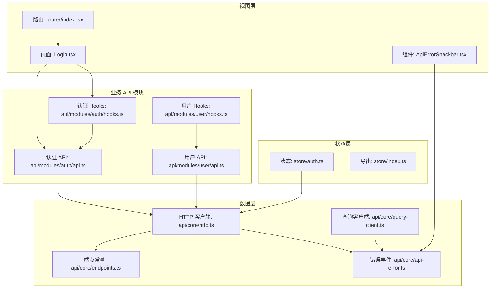
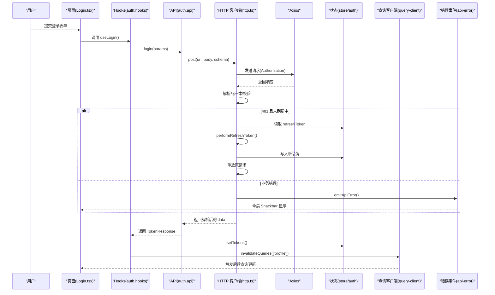
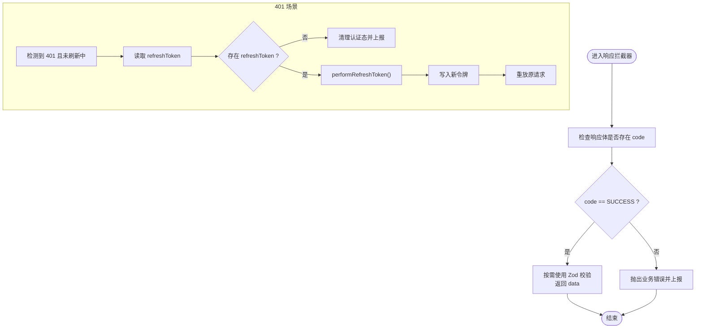
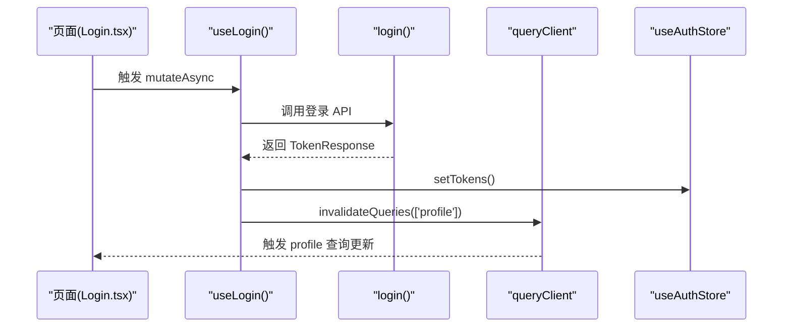
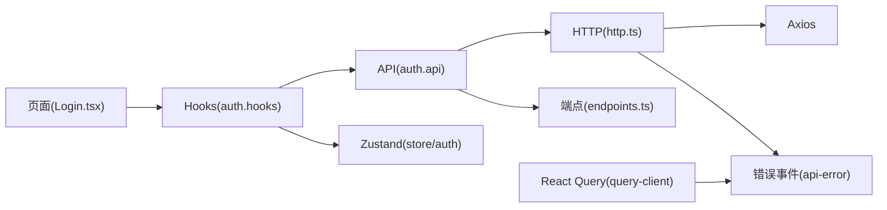

# 数据流设计

<cite>
**本文引用的文件**
- [apps/web/src/main.tsx](file://apps/web/src/main.tsx)
- [apps/web/src/router/index.tsx](file://apps/web/src/router/index.tsx)
- [apps/web/src/store/auth.ts](file://apps/web/src/store/auth.ts)
- [apps/web/src/store/index.ts](file://apps/web/src/store/index.ts)
- [apps/web/src/api/core/query-client.ts](file://apps/web/src/api/core/query-client.ts)
- [apps/web/src/api/core/http.ts](file://apps/web/src/api/core/http.ts)
- [apps/web/src/api/core/endpoints.ts](file://apps/web/src/api/core/endpoints.ts)
- [apps/web/src/api/core/api-error.ts](file://apps/web/src/api/core/api-error.ts)
- [apps/web/src/api/modules/auth/api.ts](file://apps/web/src/api/modules/auth/api.ts)
- [apps/web/src/api/modules/auth/hooks.ts](file://apps/web/src/api/modules/auth/hooks.ts)
- [apps/web/src/api/modules/user/api.ts](file://apps/web/src/api/modules/user/api.ts)
- [apps/web/src/api/modules/user/hooks.ts](file://apps/web/src/api/modules/user/hooks.ts)
- [apps/web/src/pages/Login.tsx](file://apps/web/src/pages/Login.tsx)
- [apps/web/src/components/ApiErrorSnackbar.tsx](file://apps/web/src/components/ApiErrorSnackbar.tsx)
- [packages/shared/src/types/api.types.ts](file://packages/shared/src/types/api.types.ts)
</cite>

## 目录
1. 引言
2. 项目结构
3. 核心组件
4. 架构总览
5. 详细组件分析
6. 依赖关系分析
7. 性能考量
8. 故障排查指南
9. 结论
10. 附录

## 引言
本文件面向前端数据流设计，系统性梳理从页面到 API 层的完整数据交互路径，重点阐释以下主题：
- 前后端统一响应模型与错误语义
- React Query 的查询/变更生命周期、缓存与状态同步
- Axios 封装的请求拦截、响应解析、鉴权刷新与错误冒泡
- 端点常量与模块化 API 设计
- 状态管理模式与跨模块联动
- 数据流图、请求响应模式与性能优化策略
- 具体示例与最佳实践

## 项目结构
前端采用模块化组织：页面组件负责用户交互；API 模块封装具体业务请求；核心层提供 HTTP 客户端、查询客户端与错误事件机制；状态层通过 Zustand 管理认证态；路由层控制访问守卫。

**图表来源**
- [apps/web/src/main.tsx:12-22](file://apps/web/src/main.tsx#L12-L22)
- [apps/web/src/router/index.tsx:12-48](file://apps/web/src/router/index.tsx#L12-L48)
- [apps/web/src/store/auth.ts:30-63](file://apps/web/src/store/auth.ts#L30-L63)
- [apps/web/src/api/core/query-client.ts:5-31](file://apps/web/src/api/core/query-client.ts#L5-L31)
- [apps/web/src/api/core/http.ts:66-80](file://apps/web/src/api/core/http.ts#L66-L80)
- [apps/web/src/api/core/endpoints.ts:1-21](file://apps/web/src/api/core/endpoints.ts#L1-L21)
- [apps/web/src/api/core/api-error.ts:16-42](file://apps/web/src/api/core/api-error.ts#L16-L42)
- [apps/web/src/api/modules/auth/api.ts:17-44](file://apps/web/src/api/modules/auth/api.ts#L17-L44)
- [apps/web/src/api/modules/auth/hooks.ts:1-49](file://apps/web/src/api/modules/auth/hooks.ts#L1-L49)
- [apps/web/src/api/modules/user/api.ts:10-33](file://apps/web/src/api/modules/user/api.ts#L10-L33)
- [apps/web/src/api/modules/user/hooks.ts:1-56](file://apps/web/src/api/modules/user/hooks.ts#L1-L56)
- [apps/web/src/pages/Login.tsx:60-92](file://apps/web/src/pages/Login.tsx#L60-L92)
- [apps/web/src/components/ApiErrorSnackbar.tsx:7-57](file://apps/web/src/components/ApiErrorSnackbar.tsx#L7-L57)

**章节来源**
- [apps/web/src/main.tsx:12-22](file://apps/web/src/main.tsx#L12-L22)
- [apps/web/src/router/index.tsx:12-48](file://apps/web/src/router/index.tsx#L12-L48)
- [apps/web/src/store/auth.ts:30-63](file://apps/web/src/store/auth.ts#L30-L63)
- [apps/web/src/api/core/query-client.ts:5-31](file://apps/web/src/api/core/query-client.ts#L5-L31)
- [apps/web/src/api/core/http.ts:66-80](file://apps/web/src/api/core/http.ts#L66-L80)
- [apps/web/src/api/core/endpoints.ts:1-21](file://apps/web/src/api/core/endpoints.ts#L1-L21)
- [apps/web/src/api/core/api-error.ts:16-42](file://apps/web/src/api/core/api-error.ts#L16-L42)
- [apps/web/src/api/modules/auth/api.ts:17-44](file://apps/web/src/api/modules/auth/api.ts#L17-L44)
- [apps/web/src/api/modules/auth/hooks.ts:1-49](file://apps/web/src/api/modules/auth/hooks.ts#L1-L49)
- [apps/web/src/api/modules/user/api.ts:10-33](file://apps/web/src/api/modules/user/api.ts#L10-L33)
- [apps/web/src/api/modules/user/hooks.ts:1-56](file://apps/web/src/api/modules/user/hooks.ts#L1-L56)
- [apps/web/src/pages/Login.tsx:60-92](file://apps/web/src/pages/Login.tsx#L60-L92)
- [apps/web/src/components/ApiErrorSnackbar.tsx:7-57](file://apps/web/src/components/ApiErrorSnackbar.tsx#L7-L57)

## 核心组件
- 查询客户端与缓存策略
  - 默认查询重试次数限制为 2 次，针对业务错误且为未授权时禁用重试；设置默认 staleTime 为 30 秒；窗口焦点不自动回填。
  - 变更默认不重试，避免副作用重复执行。
  - 全局 onError 统一上报业务错误。
- HTTP 客户端与拦截器
  - 自动注入 Authorization 头；基于响应体 code 字段判断业务成功与否；支持按需启用响应体 Zod 校验。
  - 401 未授权时触发令牌刷新流程：串行化刷新、队列等待、失败清理与错误冒泡。
  - 支持自定义跳过刷新的元信息字段。
- 端点常量
  - 统一维护后端 API 路径，便于集中管理与重构。
- 错误事件机制
  - 通过自定义事件向全局组件广播错误详情，避免在深层组件树中重复传递。
- 认证状态管理
  - 使用 Zustand 管理 accessToken、refreshToken、用户信息与登录态，并持久化部分字段。
- 页面与 Hooks
  - 页面通过 React Query Hooks 发起查询/变更；变更成功后主动失效相关查询键，保证状态一致性。
  - 登录页展示验证码加载、错误提示与提交状态。

**章节来源**
- [apps/web/src/api/core/query-client.ts:5-31](file://apps/web/src/api/core/query-client.ts#L5-L31)
- [apps/web/src/api/core/http.ts:94-179](file://apps/web/src/api/core/http.ts#L94-L179)
- [apps/web/src/api/core/endpoints.ts:1-21](file://apps/web/src/api/core/endpoints.ts#L1-L21)
- [apps/web/src/api/core/api-error.ts:16-42](file://apps/web/src/api/core/api-error.ts#L16-L42)
- [apps/web/src/store/auth.ts:30-63](file://apps/web/src/store/auth.ts#L30-L63)
- [apps/web/src/api/modules/auth/hooks.ts:12-48](file://apps/web/src/api/modules/auth/hooks.ts#L12-L48)
- [apps/web/src/pages/Login.tsx:60-92](file://apps/web/src/pages/Login.tsx#L60-L92)

## 架构总览
下图展示了从前端页面到后端服务的完整数据流，包括鉴权刷新与错误传播路径。

**图表来源**
- [apps/web/src/pages/Login.tsx:60-92](file://apps/web/src/pages/Login.tsx#L60-L92)
- [apps/web/src/api/modules/auth/hooks.ts:12-22](file://apps/web/src/api/modules/auth/hooks.ts#L12-L22)
- [apps/web/src/api/modules/auth/api.ts:24-30](file://apps/web/src/api/modules/auth/api.ts#L24-L30)
- [apps/web/src/api/core/http.ts:94-179](file://apps/web/src/api/core/http.ts#L94-L179)
- [apps/web/src/store/auth.ts:36-46](file://apps/web/src/store/auth.ts#L36-L46)
- [apps/web/src/api/core/query-client.ts:5-31](file://apps/web/src/api/core/query-client.ts#L5-L31)
- [apps/web/src/api/core/api-error.ts:16-32](file://apps/web/src/api/core/api-error.ts#L16-L32)

## 详细组件分析

### React Query 数据获取与缓存
- 查询键设计
  - 认证模块使用固定键如 ['profile']，便于在登录成功后统一失效。
  - 用户模块使用 ['users'] 或 ['users', id]，实现列表与单项的隔离缓存。
- 缓存策略
  - 默认 staleTime=30000ms，减少不必要的网络请求。
  - refetchOnWindowFocus=false，避免频繁回填导致抖动。
  - 查询默认最多重试 2 次，但对 UNAUTHORIZED 业务错误禁用重试，防止无意义的循环。
- 状态同步
  - 变更成功回调中调用 invalidateQueries，使相关查询重新拉取最新数据，保持 UI 与服务端一致。

**章节来源**
- [apps/web/src/api/modules/auth/hooks.ts:42-48](file://apps/web/src/api/modules/auth/hooks.ts#L42-L48)
- [apps/web/src/api/modules/user/hooks.ts:9-22](file://apps/web/src/api/modules/user/hooks.ts#L9-L22)
- [apps/web/src/api/modules/user/hooks.ts:24-55](file://apps/web/src/api/modules/user/hooks.ts#L24-L55)
- [apps/web/src/api/core/query-client.ts:16-30](file://apps/web/src/api/core/query-client.ts#L16-L30)

### HTTP 客户端与拦截器
- 请求阶段
  - 自动从状态中读取 accessToken 并注入 Authorization 头。
- 响应阶段
  - 若响应体包含 code 字段且非 SUCCESS，则抛出业务错误；否则返回 data。
  - 若未提供 responseSchema，则直接返回 data；否则使用 Zod 进行运行时校验。
- 401 未授权处理
  - 若存在 refreshToken 且未处于刷新中，则串行执行刷新流程：写入新令牌、清空等待队列、重放原请求；若刷新失败则清理认证态并上报错误。
- 错误冒泡
  - 所有业务错误均通过 emitApiError 上报，统一由全局 Snackbar 展示。

**图表来源**
- [apps/web/src/api/core/http.ts:102-179](file://apps/web/src/api/core/http.ts#L102-L179)
- [apps/web/src/api/core/api-error.ts:16-32](file://apps/web/src/api/core/api-error.ts#L16-L32)

**章节来源**
- [apps/web/src/api/core/http.ts:94-179](file://apps/web/src/api/core/http.ts#L94-L179)
- [apps/web/src/api/core/api-error.ts:16-32](file://apps/web/src/api/core/api-error.ts#L16-L32)

### 认证模块数据流
- 登录流程
  - 页面读取验证码并提交登录参数；登录成功后写入令牌并使 ['profile'] 相关查询失效。
- 个人资料
  - 仅在存在 accessToken 时启用查询，避免无效请求。
- 注销流程
  - 清理认证态并清空查询缓存，确保本地无残留。

**图表来源**
- [apps/web/src/pages/Login.tsx:60-92](file://apps/web/src/pages/Login.tsx#L60-L92)
- [apps/web/src/api/modules/auth/hooks.ts:12-22](file://apps/web/src/api/modules/auth/hooks.ts#L12-L22)
- [apps/web/src/api/modules/auth/api.ts:24-30](file://apps/web/src/api/modules/auth/api.ts#L24-L30)
- [apps/web/src/store/auth.ts:36-46](file://apps/web/src/store/auth.ts#L36-L46)

**章节来源**
- [apps/web/src/api/modules/auth/hooks.ts:12-22](file://apps/web/src/api/modules/auth/hooks.ts#L12-L22)
- [apps/web/src/api/modules/auth/api.ts:24-30](file://apps/web/src/api/modules/auth/api.ts#L24-L30)
- [apps/web/src/store/auth.ts:36-46](file://apps/web/src/store/auth.ts#L36-L46)

### 用户管理模块数据流
- 列表与单项
  - ['users'] 用于列表；['users', id] 用于单项；二者互不影响，提升缓存命中率。
- 新增/修改/删除
  - 成功回调统一失效 ['users']，确保列表与详情同步最新数据。
- 参数与返回值
  - 所有请求均使用 Zod Schema 进行参数与返回值校验，保障类型安全。

**章节来源**
- [apps/web/src/api/modules/user/hooks.ts:9-22](file://apps/web/src/api/modules/user/hooks.ts#L9-L22)
- [apps/web/src/api/modules/user/hooks.ts:24-55](file://apps/web/src/api/modules/user/hooks.ts#L24-L55)
- [apps/web/src/api/modules/user/api.ts:15-33](file://apps/web/src/api/modules/user/api.ts#L15-L33)

### 错误处理与全局提示
- 错误事件
  - emitApiError 接收业务错误或通用错误，去重后通过自定义事件广播。
- 全局 Snackbar
  - 监听错误事件并在 3 秒后自动隐藏，支持手动关闭。
- 与 React Query 的结合
  - Query/Mutation 的 onError 会触发 emitApiError，形成统一的错误上报闭环。

**章节来源**
- [apps/web/src/api/core/api-error.ts:16-42](file://apps/web/src/api/core/api-error.ts#L16-L42)
- [apps/web/src/components/ApiErrorSnackbar.tsx:7-57](file://apps/web/src/components/ApiErrorSnackbar.tsx#L7-L57)
- [apps/web/src/api/core/query-client.ts:7-15](file://apps/web/src/api/core/query-client.ts#L7-L15)

## 依赖关系分析
- 组件耦合
  - 页面仅依赖 Hooks，Hooks 依赖具体 API，API 依赖 HTTP 客户端，形成清晰的单向依赖。
  - 状态层被 HTTP 与 Hooks 共同消费，避免循环依赖。
- 外部依赖
  - React Query 提供缓存与并发控制；Axios 提供请求能力；Zustand 提供轻量状态管理；Zod 提供运行时校验。
- 端点集中化
  - 端点常量统一管理，降低硬编码风险，便于迁移与测试。

**图表来源**
- [apps/web/src/pages/Login.tsx:60-92](file://apps/web/src/pages/Login.tsx#L60-L92)
- [apps/web/src/api/modules/auth/hooks.ts:12-22](file://apps/web/src/api/modules/auth/hooks.ts#L12-L22)
- [apps/web/src/api/modules/auth/api.ts:24-30](file://apps/web/src/api/modules/auth/api.ts#L24-L30)
- [apps/web/src/api/core/http.ts:94-179](file://apps/web/src/api/core/http.ts#L94-L179)
- [apps/web/src/store/auth.ts:36-46](file://apps/web/src/store/auth.ts#L36-L46)
- [apps/web/src/api/core/endpoints.ts:1-21](file://apps/web/src/api/core/endpoints.ts#L1-L21)
- [apps/web/src/api/core/api-error.ts:16-32](file://apps/web/src/api/core/api-error.ts#L16-L32)
- [apps/web/src/api/core/query-client.ts:5-31](file://apps/web/src/api/core/query-client.ts#L5-L31)

**章节来源**
- [apps/web/src/pages/Login.tsx:60-92](file://apps/web/src/pages/Login.tsx#L60-L92)
- [apps/web/src/api/modules/auth/hooks.ts:12-22](file://apps/web/src/api/modules/auth/hooks.ts#L12-L22)
- [apps/web/src/api/modules/auth/api.ts:24-30](file://apps/web/src/api/modules/auth/api.ts#L24-L30)
- [apps/web/src/api/core/http.ts:94-179](file://apps/web/src/api/core/http.ts#L94-L179)
- [apps/web/src/store/auth.ts:36-46](file://apps/web/src/store/auth.ts#L36-L46)
- [apps/web/src/api/core/endpoints.ts:1-21](file://apps/web/src/api/core/endpoints.ts#L1-L21)
- [apps/web/src/api/core/api-error.ts:16-32](file://apps/web/src/api/core/api-error.ts#L16-L32)
- [apps/web/src/api/core/query-client.ts:5-31](file://apps/web/src/api/core/query-client.ts#L5-L31)

## 性能考量
- 缓存与回填
  - 合理设置 staleTime，避免频繁网络请求；对高频变更场景可考虑缩短 staleTime 或使用主动 invalidates。
  - 关闭 refetchOnWindowFocus 以减少不必要的回填，提升交互流畅度。
- 重试策略
  - 查询默认最多重试 2 次，且对 UNAUTHORIZED 禁止重试，避免无效循环。
  - 变更默认不重试，确保幂等性与副作用可控。
- 并发与队列
  - 401 刷新采用串行化与队列等待，避免并发刷新导致的状态竞争。
- 类型校验成本
  - 在关键响应上启用 Zod 校验，将编译期保障延伸至运行时，降低后续处理分支复杂度。
- 网络超时与基础 URL
  - 统一超时时间与基础 URL，便于统一治理与压测。

[本节为通用指导，无需列出章节来源]

## 故障排查指南
- 登录失败
  - 检查验证码是否有效、账号密码是否正确；查看全局 Snackbar 是否显示业务错误；确认后端返回 code 与 message。
- 401 未授权
  - 确认 refreshToken 是否存在；观察是否触发了刷新流程；若刷新失败，确认状态是否被清理。
- 查询不更新
  - 确认变更回调是否调用了 invalidateQueries；确认查询键是否匹配；检查 staleTime 设置。
- 错误未显示
  - 确认 emitApiError 是否被触发；确认全局监听是否注册；确认 Snackbar 是否渲染。

**章节来源**
- [apps/web/src/pages/Login.tsx:198-203](file://apps/web/src/pages/Login.tsx#L198-L203)
- [apps/web/src/api/core/http.ts:133-175](file://apps/web/src/api/core/http.ts#L133-L175)
- [apps/web/src/api/core/api-error.ts:16-32](file://apps/web/src/api/core/api-error.ts#L16-L32)
- [apps/web/src/components/ApiErrorSnackbar.tsx:7-57](file://apps/web/src/components/ApiErrorSnackbar.tsx#L7-L57)

## 结论
本数据流设计以“统一响应模型 + React Query 缓存 + Axios 拦截器 + Zustand 状态”为核心，实现了：
- 前后端一致的错误语义与响应结构
- 可控的重试与刷新策略
- 明确的查询键与失效机制
- 全局错误事件与可视化提示
- 模块化的 API 设计与类型安全

建议在后续迭代中持续关注缓存命中率、错误分类细化与可观测性增强。

[本节为总结性内容，无需列出章节来源]

## 附录

### 请求响应模式与最佳实践
- 请求模式
  - 使用 ENDPOINTS 常量集中管理端点；在 API 层对入参与返回进行 Zod 校验；必要时在 HTTP 层启用响应体校验。
- 响应模式
  - 严格依据业务码判断成功与否；错误统一通过 emitApiError 上报；全局 Snackbar 展示。
- 最佳实践
  - 查询键命名规范：['resource', id?]；变更成功后优先失效相关列表键；对高敏感操作禁用自动重试。
  - 401 场景：确保 refreshToken 存在与刷新流程串行化；失败后清理认证态并引导登录。
  - 状态持久化：仅持久化必要字段，避免敏感信息泄露。

**章节来源**
- [apps/web/src/api/core/endpoints.ts:1-21](file://apps/web/src/api/core/endpoints.ts#L1-L21)
- [apps/web/src/api/modules/auth/api.ts:24-30](file://apps/web/src/api/modules/auth/api.ts#L24-L30)
- [apps/web/src/api/core/http.ts:102-179](file://apps/web/src/api/core/http.ts#L102-L179)
- [apps/web/src/api/core/api-error.ts:16-32](file://apps/web/src/api/core/api-error.ts#L16-L32)
- [apps/web/src/store/auth.ts:48-60](file://apps/web/src/store/auth.ts#L48-L60)