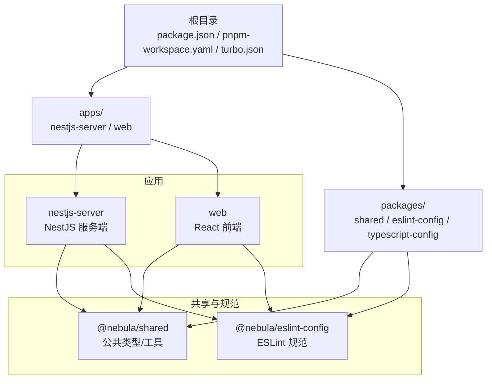
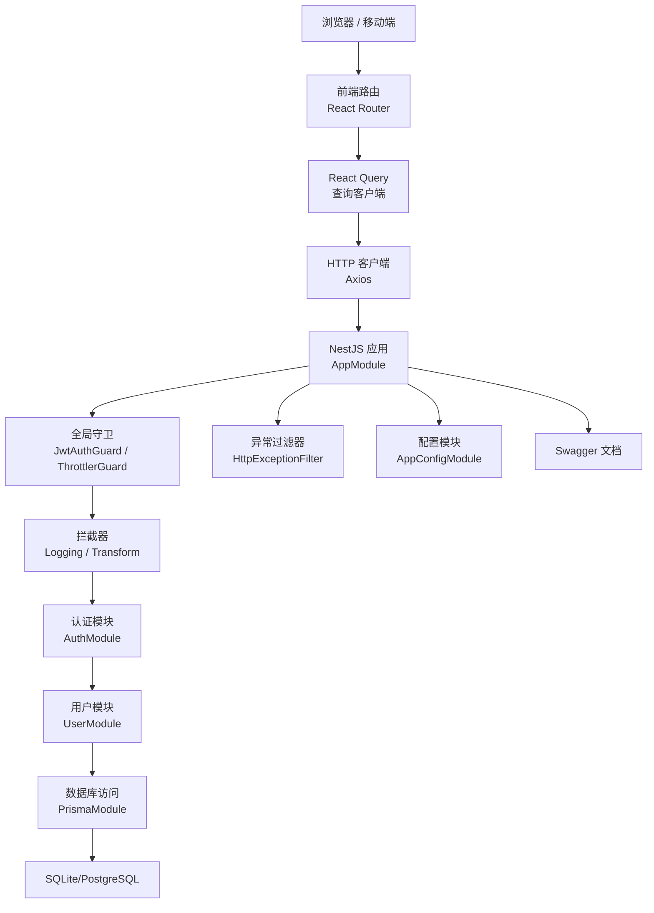
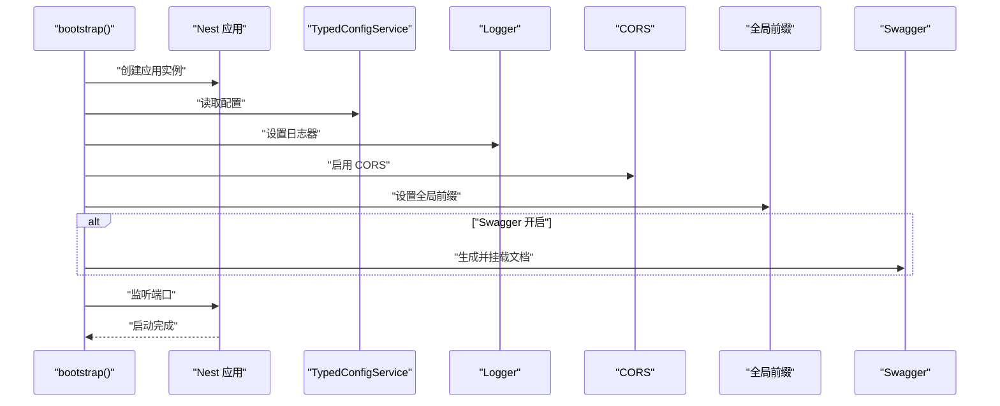
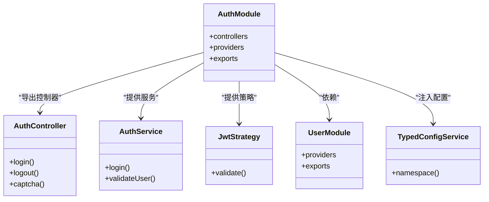
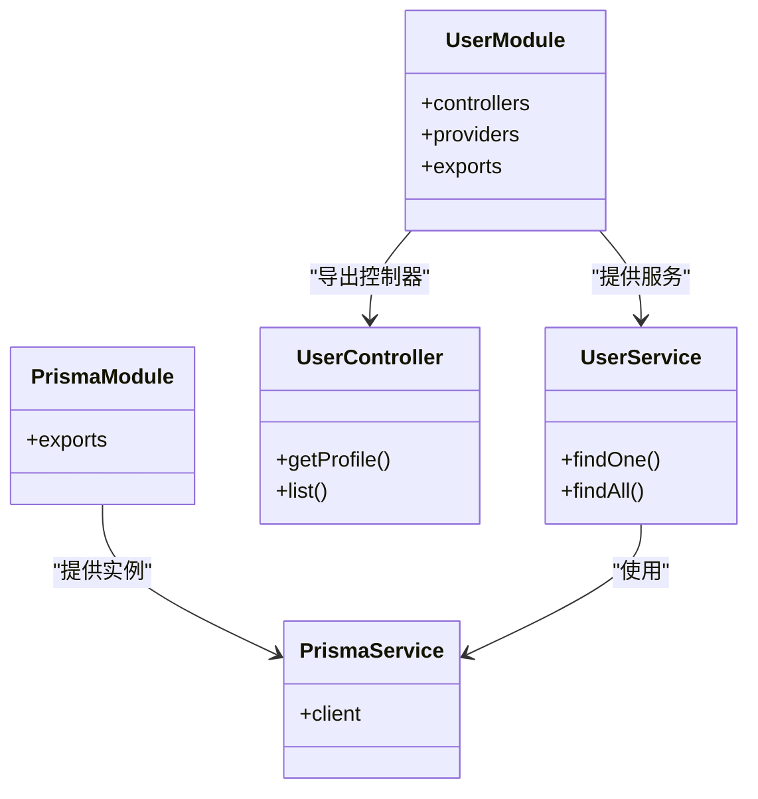
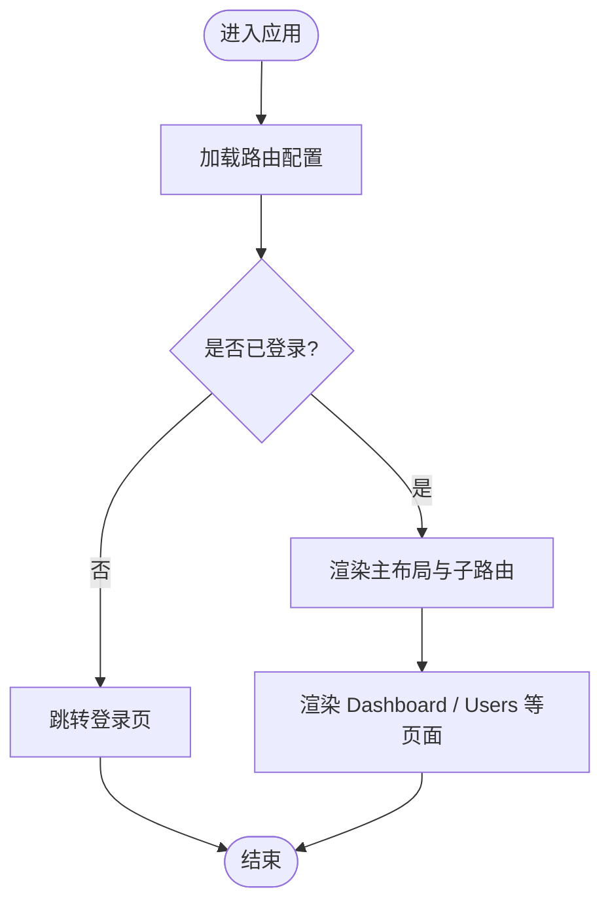
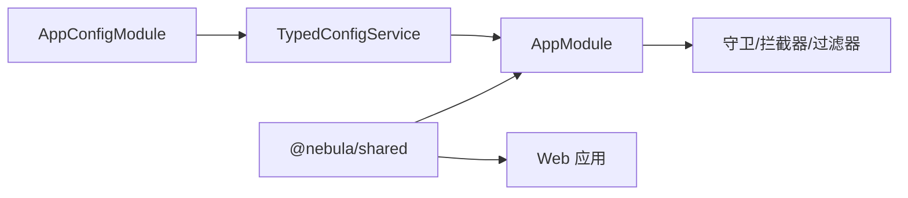
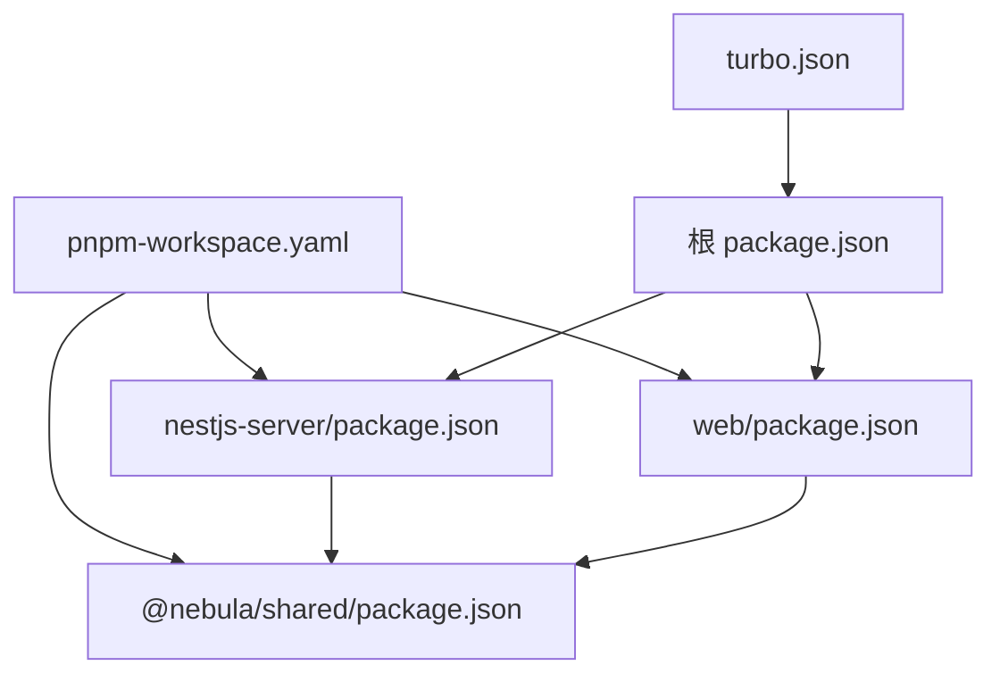
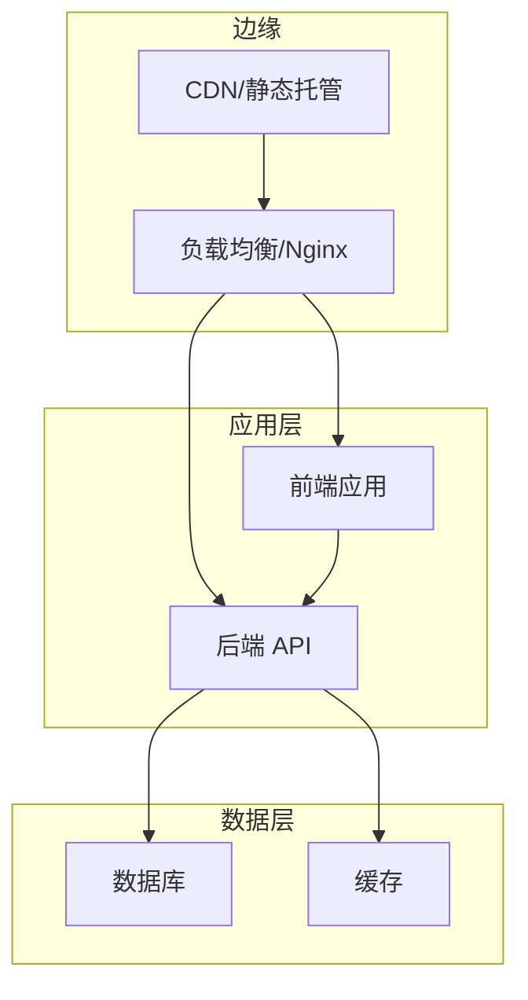

# 架构设计

<cite>
**本文引用的文件**
- [package.json](file://package.json)
- [pnpm-workspace.yaml](file://pnpm-workspace.yaml)
- [turbo.json](file://turbo.json)
- [nestjs-server/package.json](file://apps/nestjs-server/package.json)
- [web/package.json](file://apps/web/package.json)
- [app.module.ts](file://apps/nestjs-server/src/app.module.ts)
- [main.ts](file://apps/nestjs-server/src/main.ts)
- [config.module.ts](file://apps/nestjs-server/src/config/config.module.ts)
- [auth.module.ts](file://apps/nestjs-server/src/modules/auth/auth.module.ts)
- [user.module.ts](file://apps/nestjs-server/src/modules/user/user.module.ts)
- [prisma.module.ts](file://apps/nestjs-server/src/prisma/prisma.module.ts)
- [main.tsx](file://apps/web/src/main.tsx)
- [router/index.tsx](file://apps/web/src/router/index.tsx)
- [store/index.ts](file://apps/web/src/store/index.ts)
- [shared/package.json](file://packages/shared/package.json)
- [eslint-config/package.json](file://packages/eslint-config/package.json)
</cite>

## 目录
1. [引言](#引言)
2. [项目结构](#项目结构)
3. [核心组件](#核心组件)
4. [架构总览](#架构总览)
5. [详细组件分析](#详细组件分析)
6. [依赖分析](#依赖分析)
7. [性能考量](#性能考量)
8. [故障排查指南](#故障排查指南)
9. [结论](#结论)
10. [附录](#附录)

## 引言
本文件系统性梳理 Nebula 项目的整体架构与技术决策，重点覆盖以下方面：
- Monorepo 架构：pnpm workspace 与 Turbo 的组织与构建策略
- 前后端分离：服务端基于 NestJS，前端基于 React 的分层与模块化设计
- 模块化与依赖注入：NestJS 的模块与全局提供者、拦截器、守卫、过滤器等横切能力
- 层间交互与数据流：从路由到控制器、服务、数据库的完整链路
- 安全边界：认证授权、速率限制、CORS、日志与异常处理
- 可扩展性与运维：可演进的模块边界、缓存与日志、容器化与编排基础

## 项目结构
Nebula 采用 Monorepo 管理，根目录通过 pnpm workspace 统一管理多包；Turbo 负责跨包的任务编排与缓存加速。应用层包含一个 NestJS 后端服务与一个 Vite+React 前端；共享层提供类型、工具与校验等通用能力；规范层提供 ESLint 配置。

**图表来源**
- [package.json:1-22](file://package.json#L1-L22)
- [pnpm-workspace.yaml:1-12](file://pnpm-workspace.yaml#L1-L12)
- [turbo.json:1-26](file://turbo.json#L1-L26)
- [nestjs-server/package.json:1-82](file://apps/nestjs-server/package.json#L1-L82)
- [web/package.json:1-44](file://apps/web/package.json#L1-L44)
- [shared/package.json:1-80](file://packages/shared/package.json#L1-L80)
- [eslint-config/package.json:1-23](file://packages/eslint-config/package.json#L1-L23)

**章节来源**
- [package.json:1-22](file://package.json#L1-L22)
- [pnpm-workspace.yaml:1-12](file://pnpm-workspace.yaml#L1-L12)
- [turbo.json:1-26](file://turbo.json#L1-L26)

## 核心组件
- 应用入口与启动
  - 服务端：NestJS 应用模块集中注册全局守卫、拦截器、过滤器与验证管道，并启用 CORS、全局前缀与 Swagger（按配置）
  - 前端：React 根节点挂载 RouterProvider 与 React Query Provider，统一错误提示与开发调试工具
- 配置体系：全局配置模块加载环境变量与自定义配置，提供强类型访问
- 认证与授权：基于 Passport/JWT 的策略与守卫，结合速率限制与日志拦截
- 数据访问：Prisma 全局模块提供数据库连接与查询能力
- 模块边界：按业务域拆分模块（如 auth、user、health、logger、cache），清晰职责与依赖方向

**章节来源**
- [app.module.ts:1-61](file://apps/nestjs-server/src/app.module.ts#L1-L61)
- [main.ts:1-47](file://apps/nestjs-server/src/main.ts#L1-L47)
- [config.module.ts:1-20](file://apps/nestjs-server/src/config/config.module.ts#L1-L20)
- [auth.module.ts:1-35](file://apps/nestjs-server/src/modules/auth/auth.module.ts#L1-L35)
- [user.module.ts:1-11](file://apps/nestjs-server/src/modules/user/user.module.ts#L1-L11)
- [prisma.module.ts:1-10](file://apps/nestjs-server/src/prisma/prisma.module.ts#L1-L10)
- [main.tsx:1-20](file://apps/web/src/main.tsx#L1-L20)

## 架构总览
下图展示从浏览器到服务端再到数据库的端到端流程，以及关键横切关注点（认证、限流、日志、异常）在请求生命周期中的位置。

**图表来源**
- [main.tsx:1-20](file://apps/web/src/main.tsx#L1-L20)
- [router/index.tsx:1-51](file://apps/web/src/router/index.tsx#L1-L51)
- [main.ts:1-47](file://apps/nestjs-server/src/main.ts#L1-L47)
- [app.module.ts:1-61](file://apps/nestjs-server/src/app.module.ts#L1-L61)
- [auth.module.ts:1-35](file://apps/nestjs-server/src/modules/auth/auth.module.ts#L1-L35)
- [user.module.ts:1-11](file://apps/nestjs-server/src/modules/user/user.module.ts#L1-L11)
- [prisma.module.ts:1-10](file://apps/nestjs-server/src/prisma/prisma.module.ts#L1-L10)

## 详细组件分析

### 服务端启动与全局配置
- 启动流程要点
  - 创建 Nest 应用实例，启用关闭钩子
  - 读取 TypedConfigService 获取运行参数（端口、前缀、CORS、Swagger 开关）
  - 设置全局 CORS 与前缀
  - 条件启用 Swagger 并清理 OpenAPI 文档
  - 输出启动日志与文档地址
- 全局横切能力
  - 守卫：JWT 认证与速率限制
  - 拦截器：日志记录与响应结构转换
  - 过滤器：统一异常处理
  - 验证管道：Zod 校验

**图表来源**
- [main.ts:9-38](file://apps/nestjs-server/src/main.ts#L9-L38)

**章节来源**
- [main.ts:1-47](file://apps/nestjs-server/src/main.ts#L1-L47)
- [app.module.ts:18-59](file://apps/nestjs-server/src/app.module.ts#L18-L59)
- [config.module.ts:6-19](file://apps/nestjs-server/src/config/config.module.ts#L6-L19)

### 认证与授权模块
- 模块组成
  - 控制器：对外暴露登录、登出、验证码等接口
  - 服务：封装 JWT 签发、用户凭证校验、验证码生成
  - 策略：Passport JWT 策略解析 Token
  - 依赖：User 模块、配置服务、时间工具
- 关键行为
  - JWT 注册使用配置中心提供的密钥与过期时间
  - 通过全局守卫强制保护受控路由
  - 结合限流与日志拦截提升安全性与可观测性

**图表来源**
- [auth.module.ts:12-34](file://apps/nestjs-server/src/modules/auth/auth.module.ts#L12-L34)

**章节来源**
- [auth.module.ts:1-35](file://apps/nestjs-server/src/modules/auth/auth.module.ts#L1-L35)

### 用户模块与数据访问
- 用户模块
  - 提供用户相关控制器与服务，作为认证模块的上游依赖
- 数据访问
  - Prisma 全局模块提供 PrismaService，贯穿用户与其它领域模块

**图表来源**
- [user.module.ts:5-10](file://apps/nestjs-server/src/modules/user/user.module.ts#L5-L10)
- [prisma.module.ts:4-9](file://apps/nestjs-server/src/prisma/prisma.module.ts#L4-L9)

**章节来源**
- [user.module.ts:1-11](file://apps/nestjs-server/src/modules/user/user.module.ts#L1-L11)
- [prisma.module.ts:1-10](file://apps/nestjs-server/src/prisma/prisma.module.ts#L1-L10)

### 前端路由与状态管理
- 路由
  - 使用 React Router v7 管理页面级导航，登录页与受保护页面通过 RequireAuth 组件进行权限拦截
- 状态
  - Zustand 提供轻量状态管理，导出 useAuthStore/useUiStore 以支持登录态与 UI 状态
- 查询
  - React Query 管理服务端数据缓存与刷新，配合全局错误提示组件统一处理异常

**图表来源**
- [router/index.tsx:12-48](file://apps/web/src/router/index.tsx#L12-L48)

**章节来源**
- [router/index.tsx:1-51](file://apps/web/src/router/index.tsx#L1-L51)
- [store/index.ts:1-3](file://apps/web/src/store/index.ts#L1-L3)
- [main.tsx:1-20](file://apps/web/src/main.tsx#L1-L20)

### 配置与共享包
- 配置模块
  - 全局注册 ConfigModule，支持自定义配置加载与生产环境忽略 .env 文件
  - 提供 TypedConfigService 以命名空间方式访问配置
- 共享包
  - 导出 types、schemas、errors、utils 等子路径，便于前后端复用
  - 通过 tsdown 构建多格式产物，满足 ESM/CJS 类型需求

**图表来源**
- [config.module.ts:6-19](file://apps/nestjs-server/src/config/config.module.ts#L6-L19)
- [shared/package.json:6-63](file://packages/shared/package.json#L6-L63)

**章节来源**
- [config.module.ts:1-20](file://apps/nestjs-server/src/config/config.module.ts#L1-L20)
- [shared/package.json:1-80](file://packages/shared/package.json#L1-L80)

## 依赖分析
- 包管理与工作区
  - pnpm workspace 将 apps 与 packages 下所有包纳入统一管理
  - 仅构建依赖项白名单减少无关二进制安装
- 构建与任务编排
  - Turbo 定义 build/dev/lint/typecheck/test/clean 等任务，支持依赖拓扑与缓存
  - 根脚本聚合至 Turbo，便于一键执行
- 应用内依赖
  - NestJS 服务端依赖 @nebula/shared 与各类 Nest 生态模块
  - React 前端依赖 @nebula/shared 与 React Query、TanStack Router 等生态

**图表来源**
- [pnpm-workspace.yaml:1-12](file://pnpm-workspace.yaml#L1-L12)
- [turbo.json:1-26](file://turbo.json#L1-L26)
- [package.json:5-15](file://package.json#L5-L15)
- [nestjs-server/package.json:26-56](file://apps/nestjs-server/package.json#L26-L56)
- [web/package.json:14-29](file://apps/web/package.json#L14-L29)
- [shared/package.json:1-80](file://packages/shared/package.json#L1-L80)

**章节来源**
- [pnpm-workspace.yaml:1-12](file://pnpm-workspace.yaml#L1-L12)
- [turbo.json:1-26](file://turbo.json#L1-L26)
- [package.json:1-22](file://package.json#L1-L22)

## 性能考量
- 构建与缓存
  - Turbo 任务依赖拓扑与持久化缓存显著缩短增量构建时间
  - 仅构建依赖白名单避免不必要的原生依赖安装
- 运行时优化
  - 服务端启用 CORS 白名单与全局前缀，减少无效请求
  - 通过拦截器统一响应结构与日志，降低重复逻辑
  - 限流守卫控制突发流量，保护下游资源
- 前端体验
  - React Query 缓存与后台刷新策略减少网络开销
  - 路由懒加载与状态隔离降低首屏压力

[本节为通用指导，无需列出具体文件来源]

## 故障排查指南
- 启动与配置
  - 若 Swagger 无法访问或端口不正确，检查 TypedConfigService 中 app 命名空间配置与 main.ts 启动逻辑
- 认证问题
  - 登录失败或 Token 失效：核对 AuthModule 中 JWT 策略与过期时间配置
  - 未登录被拦截：确认路由是否包裹 RequireAuth，前端 Store 是否正确同步登录态
- 数据访问
  - 查询异常：检查 PrismaModule 提供的 PrismaService 实例与数据库连接
- 日志与异常
  - 统一异常：查看 HttpExceptionFilter 的处理范围与日志输出
  - 请求追踪：通过 LoggingInterceptor 的上下文信息定位问题

**章节来源**
- [main.ts:14-38](file://apps/nestjs-server/src/main.ts#L14-L38)
- [auth.module.ts:16-28](file://apps/nestjs-server/src/modules/auth/auth.module.ts#L16-L28)
- [prisma.module.ts:4-9](file://apps/nestjs-server/src/prisma/prisma.module.ts#L4-L9)
- [app.module.ts:42-57](file://apps/nestjs-server/src/app.module.ts#L42-L57)

## 结论
Nebula 以 Monorepo 为基础，结合 pnpm workspace 与 Turbo，实现了前后端一体化的工程化体系。服务端通过模块化与全局横切能力保障了安全与可观测性，前端以路由与状态管理实现清晰的用户体验边界。整体架构具备良好的可扩展性与可维护性，适合持续演进与团队协作。

[本节为总结性内容，无需列出具体文件来源]

## 附录
- 部署拓扑建议（概念示意）
  - 前端：静态资源托管于 CDN 或 Nginx，通过反向代理指向后端 API
  - 后端：容器化运行，挂载日志卷与数据库卷，按需水平扩展
  - 数据库：使用 Prisma 管理迁移与连接池，结合备份与监控

[本图为概念性部署拓扑，不对应具体源码文件，故无图表来源]