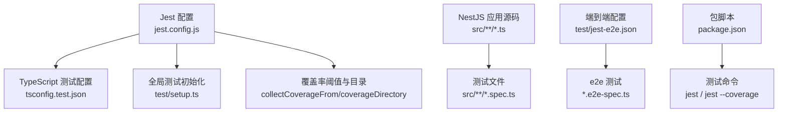
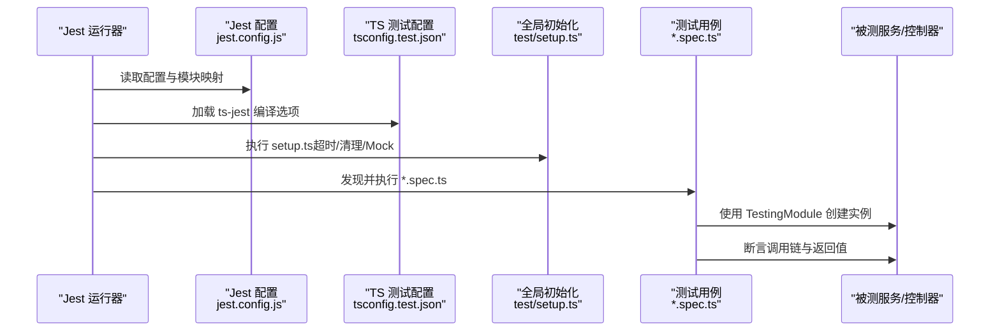
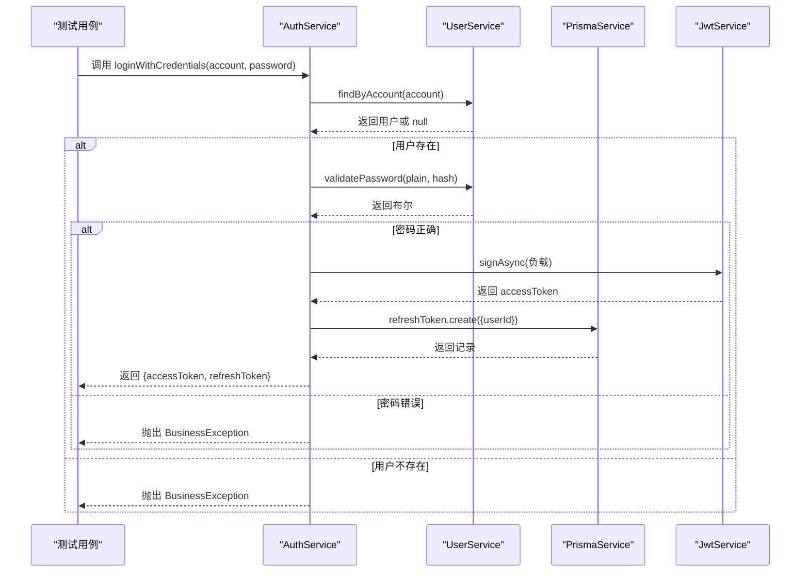
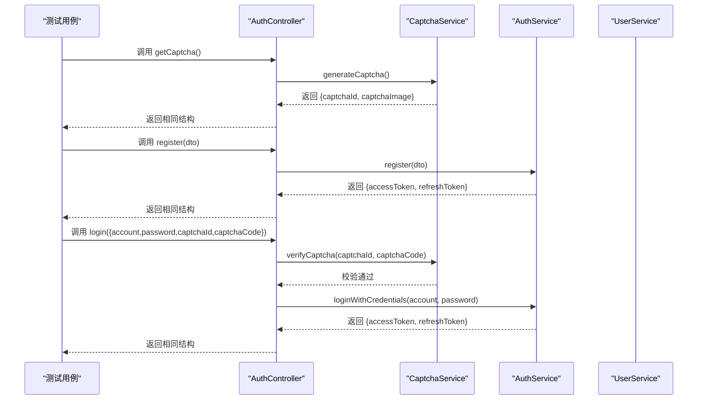
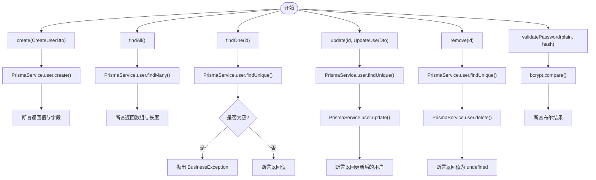
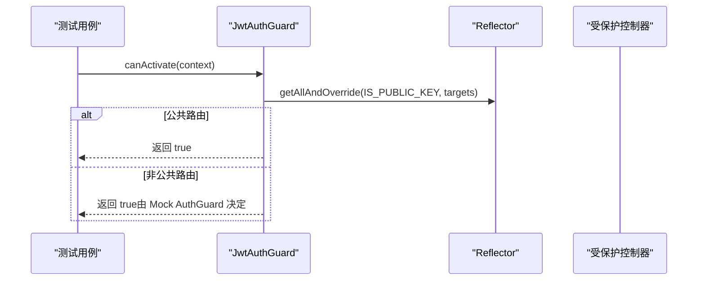
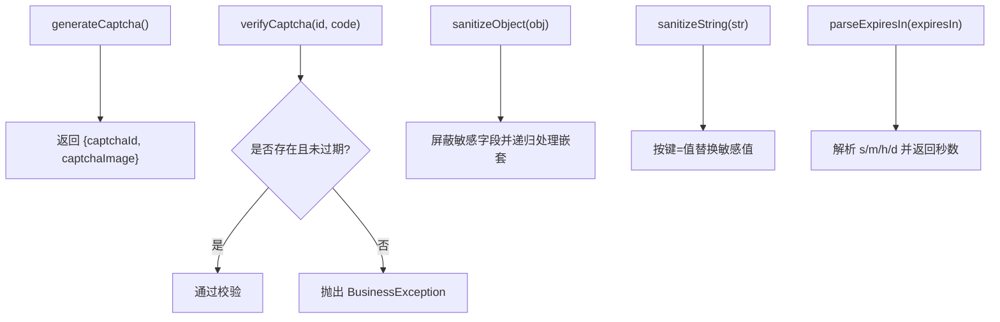
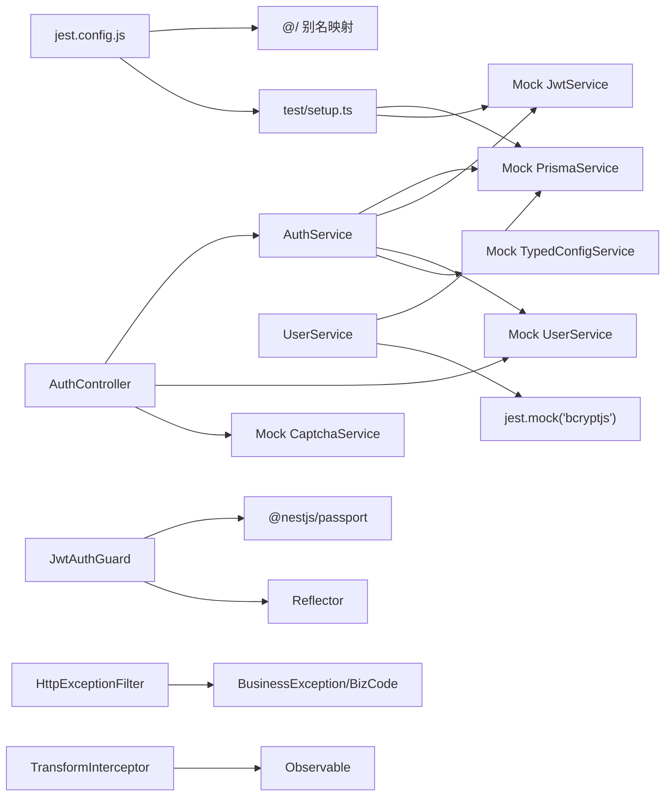

# 单元测试

<cite>
**本文引用的文件**
- [jest.config.js](file://apps/nestjs-server/jest.config.js)
- [setup.ts](file://apps/nestjs-server/test/setup.ts)
- [jest-e2e.json](file://apps/nestjs-server/test/jest-e2e.json)
- [tsconfig.test.json](file://apps/nestjs-server/tsconfig.test.json)
- [package.json](file://apps/nestjs-server/package.json)
- [auth.service.spec.ts](file://apps/nestjs-server/src/modules/auth/auth.service.spec.ts)
- [auth.controller.spec.ts](file://apps/nestjs-server/src/modules/auth/auth.controller.spec.ts)
- [user.service.spec.ts](file://apps/nestjs-server/src/modules/user/user.service.spec.ts)
- [jwt-auth.guard.spec.ts](file://apps/nestjs-server/src/common/guards/jwt-auth.guard.spec.ts)
- [http-exception.filter.spec.ts](file://apps/nestjs-server/src/common/filters/http-exception.filter.spec.ts)
- [transform.interceptor.spec.ts](file://apps/nestjs-server/src/common/interceptors/transform.interceptor.spec.ts)
- [captcha.service.spec.ts](file://apps/nestjs-server/src/modules/auth/captcha.service.spec.ts)
- [sanitize.util.spec.ts](file://apps/nestjs-server/src/common/utils/sanitize.util.spec.ts)
- [sanitize.util.ts](file://apps/nestjs-server/src/common/utils/sanitize.util.ts)
- [time.util.spec.ts](file://apps/nestjs-server/src/common/utils/time.util.spec.ts)
- [time.util.ts](file://apps/nestjs-server/src/common/utils/time.util.ts)
- [biz-code.enum.ts](file://apps/nestjs-server/src/common/enums/biz-code.enum.ts)
</cite>

## 目录
1. [简介](#简介)
2. [项目结构](#项目结构)
3. [核心组件](#核心组件)
4. [架构总览](#架构总览)
5. [详细组件分析](#详细组件分析)
6. [依赖关系分析](#依赖关系分析)
7. [性能考量](#性能考量)
8. [故障排查指南](#故障排查指南)
9. [结论](#结论)
10. [附录](#附录)

## 简介
本文件系统性梳理 NestJS 应用中的单元测试实现，覆盖测试文件组织、Jest 配置与环境设置、服务层/控制器层/通用中间件与工具类的测试策略，以及依赖注入 Mock、异步操作与错误场景的测试方法。文档同时给出认证服务、用户服务等核心功能的测试用例编写思路，并总结测试覆盖率配置、断言方法与测试数据准备的最佳实践。

## 项目结构
- 测试运行器：Jest
- 测试入口与根目录：Jest 根目录指向 src，测试文件以 .spec.ts 结尾
- TypeScript 编译：使用独立的 tsconfig.test.json，包含 src 与 test 下的 TS 文件
- 全局环境初始化：通过 setup.ts 注入全局超时与清理逻辑，并提供常用 Mock 对象（PrismaService、JwtService）
- 覆盖率与阈值：开启覆盖率收集，排除 spec/e2e 文件与主入口，设定全局阈值
- 命令脚本：提供 test、test:watch、test:cov、test:debug、test:e2e 等命令

**图表来源**
- [jest.config.js:1-34](file://apps/nestjs-server/jest.config.js#L1-L34)
- [tsconfig.test.json:1-8](file://apps/nestjs-server/tsconfig.test.json#L1-L8)
- [setup.ts:1-47](file://apps/nestjs-server/test/setup.ts#L1-L47)
- [jest-e2e.json:1-10](file://apps/nestjs-server/test/jest-e2e.json#L1-L10)
- [package.json:8-25](file://apps/nestjs-server/package.json#L8-L25)

**章节来源**
- [jest.config.js:1-34](file://apps/nestjs-server/jest.config.js#L1-L34)
- [tsconfig.test.json:1-8](file://apps/nestjs-server/tsconfig.test.json#L1-L8)
- [setup.ts:1-47](file://apps/nestjs-server/test/setup.ts#L1-L47)
- [jest-e2e.json:1-10](file://apps/nestjs-server/test/jest-e2e.json#L1-L10)
- [package.json:8-25](file://apps/nestjs-server/package.json#L8-L25)

## 核心组件
- Jest 配置与环境
  - 模块映射：支持 @/、@modules/、@common/、@config/ 的路径别名
  - 测试正则：仅匹配 .spec.ts
  - 转换器：ts-jest + tsconfig.test.json
  - 覆盖率：按全局阈值收集，排除 main.ts、生成代码与 e2e/spec 文件
  - 初始化：加载 test/setup.ts，设置超时与 afterEach 清理
- 全局 Mock
  - PrismaService：模拟 user/role/menu/refreshToken 及事务
  - JwtService：模拟签名/验证/解码
- 测试脚本：提供开发调试与覆盖率统计命令

**章节来源**
- [jest.config.js:1-34](file://apps/nestjs-server/jest.config.js#L1-L34)
- [setup.ts:7-47](file://apps/nestjs-server/test/setup.ts#L7-L47)
- [package.json:20-24](file://apps/nestjs-server/package.json#L20-L24)

## 架构总览
下图展示了测试执行流程与关键组件交互：

**图表来源**
- [jest.config.js:1-34](file://apps/nestjs-server/jest.config.js#L1-L34)
- [tsconfig.test.json:1-8](file://apps/nestjs-server/tsconfig.test.json#L1-L8)
- [setup.ts:1-47](file://apps/nestjs-server/test/setup.ts#L1-L47)

## 详细组件分析

### 认证服务（AuthService）测试策略
- 依赖注入 Mock
  - PrismaService：刷新令牌表 CRUD、事务
  - JwtService：签名/验证/解码
  - UserService：账户查询、创建、密码校验
  - TypedConfigService：读取 JWT 秘钥与 TTL
- 异步操作测试
  - 登录：校验账户存在与密码正确后签发访问/刷新令牌
  - 注册：检查邮箱/用户名唯一性，创建用户并签发令牌
  - 刷新：校验旧令牌状态（存在/未撤销/未过期），撤销旧令牌并签发新令牌
  - 注销：批量撤销用户所有未撤销的刷新令牌
- 错误场景
  - 用户不存在、密码错误、重复邮箱/用户名、令牌不存在/已撤销/已过期
- 断言要点
  - 验证外部依赖调用次数与参数
  - 断言返回对象包含 accessToken/refreshToken
  - 使用 BusinessException 抛错进行错误路径断言

**图表来源**
- [auth.service.spec.ts:71-120](file://apps/nestjs-server/src/modules/auth/auth.service.spec.ts#L71-L120)
- [auth.service.spec.ts:122-177](file://apps/nestjs-server/src/modules/auth/auth.service.spec.ts#L122-L177)
- [auth.service.spec.ts:179-258](file://apps/nestjs-server/src/modules/auth/auth.service.spec.ts#L179-L258)
- [auth.service.spec.ts:260-276](file://apps/nestjs-server/src/modules/auth/auth.service.spec.ts#L260-L276)

**章节来源**
- [auth.service.spec.ts:1-278](file://apps/nestjs-server/src/modules/auth/auth.service.spec.ts#L1-L278)

### 认证控制器（AuthController）测试策略
- 依赖注入 Mock
  - AuthService：登录/注册/刷新/注销
  - UserService：获取用户资料
  - CaptchaService：验证码生成与校验
- 接口行为验证
  - 获取验证码：返回结构化响应
  - 注册：转发 DTO 并返回令牌
  - 登录：先校验验证码再调用登录并返回令牌
  - 刷新：调用刷新接口并返回新令牌
  - 注销：基于请求上下文中的用户 ID 调用服务层
  - 获取个人资料：调用用户服务并裁剪返回字段
- 断言要点
  - 验证对外部服务的调用参数与返回值
  - 针对空名称字段的边界情况断言

**图表来源**
- [auth.controller.spec.ts:46-110](file://apps/nestjs-server/src/modules/auth/auth.controller.spec.ts#L46-L110)
- [auth.controller.spec.ts:112-141](file://apps/nestjs-server/src/modules/auth/auth.controller.spec.ts#L112-L141)
- [auth.controller.spec.ts:143-183](file://apps/nestjs-server/src/modules/auth/auth.controller.spec.ts#L143-L183)

**章节来源**
- [auth.controller.spec.ts:1-185](file://apps/nestjs-server/src/modules/auth/auth.controller.spec.ts#L1-L185)

### 用户服务（UserService）测试策略
- 依赖注入 Mock
  - PrismaService：user 表 CRUD
  - bcryptjs：密码哈希与比较（jest.mock）
- 关键能力
  - 创建用户：断言写入与返回值
  - 查询列表/单个：断言查询条件与返回长度
  - 按邮箱/用户名/账号查询：断言不同 where 条件
  - 更新用户：断言 find+update 的组合与返回值
  - 删除用户：断言 find+delete 的组合
  - 密码校验：断言 bcrypt.compare 的返回值
- 错误场景
  - 查无用户时抛出 BusinessException
- 断言要点
  - 验证 PrismaService 调用次数与 where/select 参数
  - 针对 null/undefined 的边界处理

**图表来源**
- [user.service.spec.ts:46-74](file://apps/nestjs-server/src/modules/user/user.service.spec.ts#L46-L74)
- [user.service.spec.ts:76-126](file://apps/nestjs-server/src/modules/user/user.service.spec.ts#L76-L126)
- [user.service.spec.ts:128-165](file://apps/nestjs-server/src/modules/user/user.service.spec.ts#L128-L165)
- [user.service.spec.ts:167-198](file://apps/nestjs-server/src/modules/user/user.service.spec.ts#L167-L198)
- [user.service.spec.ts:200-231](file://apps/nestjs-server/src/modules/user/user.service.spec.ts#L200-L231)
- [user.service.spec.ts:233-290](file://apps/nestjs-server/src/modules/user/user.service.spec.ts#L233-L290)
- [user.service.spec.ts:292-355](file://apps/nestjs-server/src/modules/user/user.service.spec.ts#L292-L355)
- [user.service.spec.ts:357-399](file://apps/nestjs-server/src/modules/user/user.service.spec.ts#L357-L399)
- [user.service.spec.ts:401-423](file://apps/nestjs-server/src/modules/user/user.service.spec.ts#L401-L423)

**章节来源**
- [user.service.spec.ts:1-425](file://apps/nestjs-server/src/modules/user/user.service.spec.ts#L1-L425)

### 守卫与过滤器测试策略
- JwtAuthGuard
  - 通过 @nestjs/passport 的 AuthGuard 进行 Mock
  - 使用 Reflector 控制公共路由判定
  - 验证 public 装饰器影响下的行为分支
- HttpExceptionFilter
  - 针对 BusinessException、通用 HttpException、UnauthorizedException 的统一响应格式
  - 验证状态码与业务码映射、详情信息与默认消息
  - **更新** 移除了 BizCode 枚举导入，简化了测试文件结构
- TransformInterceptor
  - 将控制器返回包装为统一 ApiResponse 格式
  - 验证 null/undefined 数据的兼容处理

**图表来源**
- [jwt-auth.guard.spec.ts:44-95](file://apps/nestjs-server/src/common/guards/jwt-auth.guard.spec.ts#L44-L95)

**章节来源**
- [jwt-auth.guard.spec.ts:1-97](file://apps/nestjs-server/src/common/guards/jwt-auth.guard.spec.ts#L1-L97)
- [http-exception.filter.spec.ts:1-122](file://apps/nestjs-server/src/common/filters/http-exception.filter.spec.ts#L1-L122)
- [transform.interceptor.spec.ts:1-97](file://apps/nestjs-server/src/common/interceptors/transform.interceptor.spec.ts#L1-L97)

### 工具类测试策略
- 验证码服务（CaptchaService）
  - 生成：返回唯一 captchaId 与图像字符串
  - 校验：大小写不敏感、过期删除、错误与过期抛出 BusinessException
  - **更新** 测试文件结构得到简化，移除了不必要的依赖导入
- 数据清洗（sanitize.util）
  - 对象：递归屏蔽敏感字段（password/token 等）
  - 字符串：按键=值模式替换敏感值
- 时间工具（time.util）
  - 解析有效期、格式化日期、解析日期字符串、获取当前时间与格式化输出

**图表来源**
- [captcha.service.spec.ts:16-32](file://apps/nestjs-server/src/modules/auth/captcha.service.spec.ts#L16-L32)
- [captcha.service.spec.ts:34-86](file://apps/nestjs-server/src/modules/auth/captcha.service.spec.ts#L34-L86)
- [sanitize.util.spec.ts:4-85](file://apps/nestjs-server/src/common/utils/sanitize.util.spec.ts#L4-L85)
- [sanitize.util.ts:18-40](file://apps/nestjs-server/src/common/utils/sanitize.util.ts#L18-L40)
- [time.util.spec.ts:16-44](file://apps/nestjs-server/src/common/utils/time.util.spec.ts#L16-L44)
- [time.util.ts:12-31](file://apps/nestjs-server/src/common/utils/time.util.ts#L12-L31)

**章节来源**
- [captcha.service.spec.ts:1-124](file://apps/nestjs-server/src/modules/auth/captcha.service.spec.ts#L1-L124)
- [sanitize.util.spec.ts:1-130](file://apps/nestjs-server/src/common/utils/sanitize.util.spec.ts#L1-L130)
- [sanitize.util.ts:1-41](file://apps/nestjs-server/src/common/utils/sanitize.util.ts#L1-L41)
- [time.util.spec.ts:1-162](file://apps/nestjs-server/src/common/utils/time.util.spec.ts#L1-L162)
- [time.util.ts:1-72](file://apps/nestjs-server/src/common/utils/time.util.ts#L1-L72)

## 依赖关系分析
- 测试配置对源码的耦合
  - jest.config.js 通过 moduleNameMapper 支持 @/ 等别名，确保测试可定位 src 下模块
  - setup.ts 提供全局 Mock，降低各测试文件重复样板
- 服务层与外部依赖
  - AuthService 依赖 JwtService、PrismaService、UserService、TypedConfigService
  - UserService 依赖 PrismaService 与 bcryptjs
- 控制器层与服务层
  - AuthController 依赖 AuthService、UserService、CaptchaService
- 中间件与守卫
  - JwtAuthGuard 依赖 @nestjs/passport 与 Reflector
  - HttpExceptionFilter 依赖异常类型与业务码枚举
  - TransformInterceptor 依赖 RxJS Observable
- **更新** 业务码枚举依赖简化
  - BizCode 枚举在验证码服务测试中不再需要导入
  - HttpExceptionFilter 仍保留 BizCode 使用但测试文件结构得到优化

**图表来源**
- [jest.config.js:27-32](file://apps/nestjs-server/jest.config.js#L27-L32)
- [setup.ts:7-47](file://apps/nestjs-server/test/setup.ts#L7-L47)
- [auth.service.spec.ts:4-62](file://apps/nestjs-server/src/modules/auth/auth.service.spec.ts#L4-L62)
- [user.service.spec.ts:31-38](file://apps/nestjs-server/src/modules/user/user.service.spec.ts#L31-L38)
- [auth.controller.spec.ts:32-38](file://apps/nestjs-server/src/modules/auth/auth.controller.spec.ts#L32-L38)
- [jwt-auth.guard.spec.ts:7-32](file://apps/nestjs-server/src/common/guards/jwt-auth.guard.spec.ts#L7-L32)
- [http-exception.filter.spec.ts:10-13](file://apps/nestjs-server/src/common/filters/http-exception.filter.spec.ts#L10-L13)
- [transform.interceptor.spec.ts:10-12](file://apps/nestjs-server/src/common/interceptors/transform.interceptor.spec.ts#L10-L12)

**章节来源**
- [jest.config.js:1-34](file://apps/nestjs-server/jest.config.js#L1-L34)
- [setup.ts:1-47](file://apps/nestjs-server/test/setup.ts#L1-L47)
- [auth.service.spec.ts:1-278](file://apps/nestjs-server/src/modules/auth/auth.service.spec.ts#L1-L278)
- [user.service.spec.ts:1-425](file://apps/nestjs-server/src/modules/user/user.service.spec.ts#L1-L425)
- [auth.controller.spec.ts:1-185](file://apps/nestjs-server/src/modules/auth/auth.controller.spec.ts#L1-L185)
- [jwt-auth.guard.spec.ts:1-97](file://apps/nestjs-server/src/common/guards/jwt-auth.guard.spec.ts#L1-L97)
- [http-exception.filter.spec.ts:1-122](file://apps/nestjs-server/src/common/filters/http-exception.filter.spec.ts#L1-L122)
- [transform.interceptor.spec.ts:1-97](file://apps/nestjs-server/src/common/interceptors/transform.interceptor.spec.ts#L1-L97)

## 性能考量
- 测试并发与隔离
  - 使用 TestingModule 逐用例构建容器，避免跨用例状态污染
  - 通过 afterEach 清理所有 Mock，确保每次测试从干净状态开始
- Mock 层优化
  - 将外部依赖（数据库、加密库、JWT）全部 Mock，减少 IO 与计算开销
  - 对于 bcryptjs 使用 jest.mock 直接返回 Promise 结果，避免真实哈希计算
- 覆盖率与性能平衡
  - 合理设置覆盖率阈值，避免过度追求 100% 导致维护成本上升
  - 优先保证关键路径（登录/注册/刷新/注销）与错误分支的覆盖

## 故障排查指南
- 常见问题
  - 路径别名导致找不到模块：确认 jest.config.js 的 moduleNameMapper 与 @ 别名一致
  - 超时导致用例失败：适当提高 jest.setTimeout 或优化 Mock 行为
  - Mock 未清理导致状态泄漏：确保 afterEach 中调用 jest.clearAllMocks
  - 覆盖率不达标：补充关键分支与错误场景用例
- 排查步骤
  - 使用 test:debug 启动带断点的调试会话
  - 在 setup.ts 中添加日志，确认全局 Mock 是否生效
  - 对复杂流程（如登录）拆分断言，定位具体依赖调用失败点

**章节来源**
- [setup.ts:3-5](file://apps/nestjs-server/test/setup.ts#L3-L5)
- [package.json:22-23](file://apps/nestjs-server/package.json#L22-L23)
- [jest.config.js:27-32](file://apps/nestjs-server/jest.config.js#L27-L32)

## 结论
本项目采用 Jest + ts-jest 的测试体系，结合全局 Mock 与 TestingModule，实现了对服务层、控制器层及通用中间件/工具类的全面单元测试覆盖。通过严格的依赖注入 Mock、异步操作断言与错误场景覆盖，有效保障了认证与用户管理等核心功能的稳定性与可维护性。**更新** 最新的验证码服务测试清理工作进一步简化了测试文件结构，移除了未使用的 BizCode 枚举导入，提升了测试代码的简洁性和维护效率。建议持续完善边界与异常分支用例，保持覆盖率阈值与代码质量同步提升。

## 附录
- 测试覆盖率配置
  - 覆盖范围：包含所有 .ts 文件，排除 spec/e2e、main.ts、生成代码
  - 全局阈值：分支、函数、行、语句均为 80%
- 断言方法最佳实践
  - 对外部依赖调用使用 toHaveBeenCalledWith/toHaveBeenCalledTimes
  - 对返回值使用 toHaveProperty/toEqual/toBe
  - 对异常使用 rejects.toThrow(BusinessException)
- 测试数据准备
  - 使用 DTO 对象与固定时间戳构造稳定输入
  - 对 bcrypt/时间等外部依赖使用 jest.mock 或固定值
- 命令参考
  - 运行测试：npm run test
  - 监听模式：npm run test:watch
  - 覆盖率：npm run test:cov
  - 调试：npm run test:debug
  - 端到端：npm run test:e2e

**章节来源**
- [jest.config.js:9-24](file://apps/nestjs-server/jest.config.js#L9-L24)
- [package.json:20-24](file://apps/nestjs-server/package.json#L20-L24)