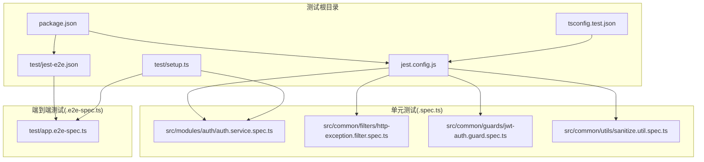
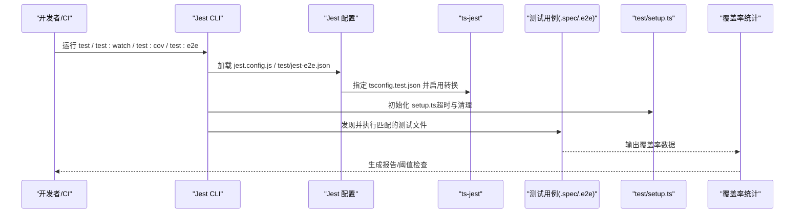
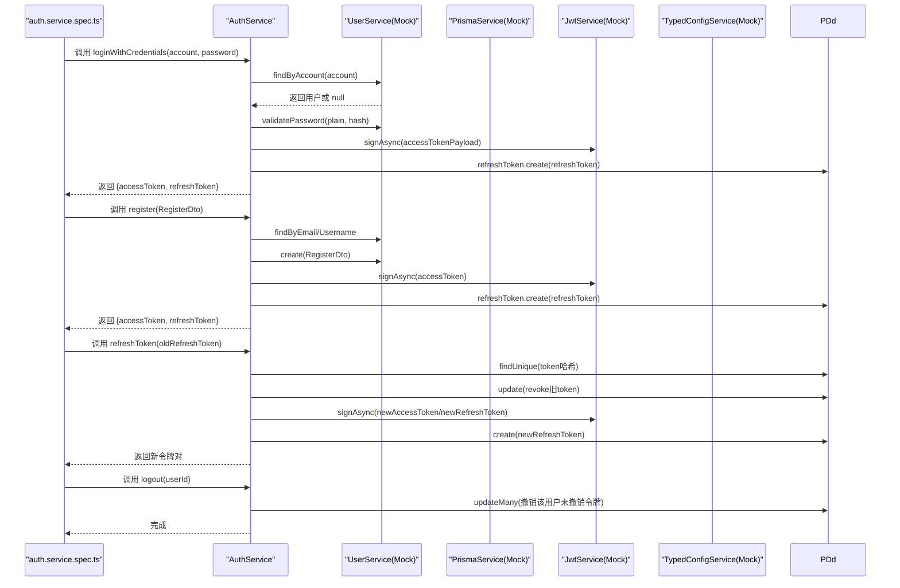
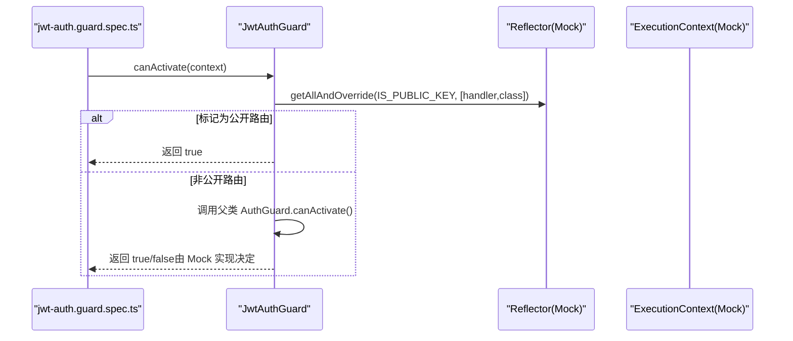
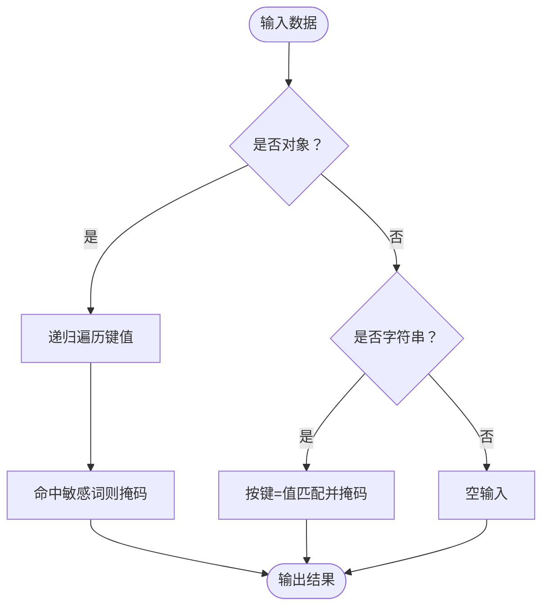
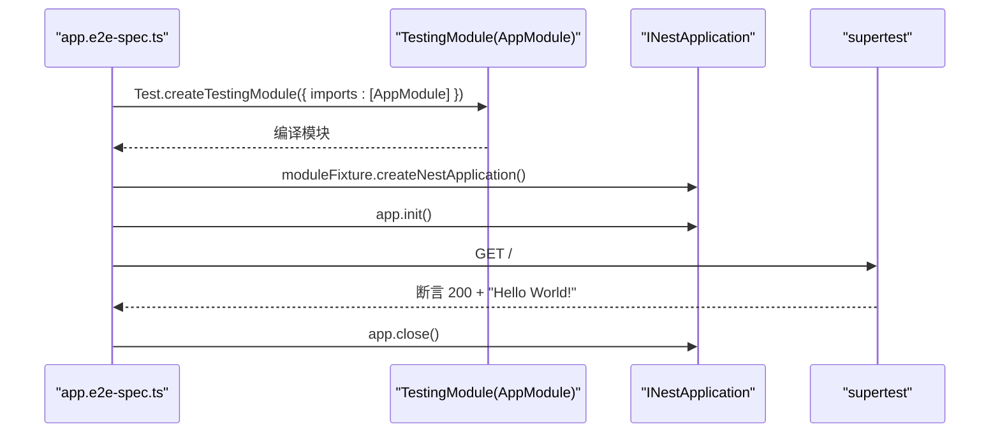
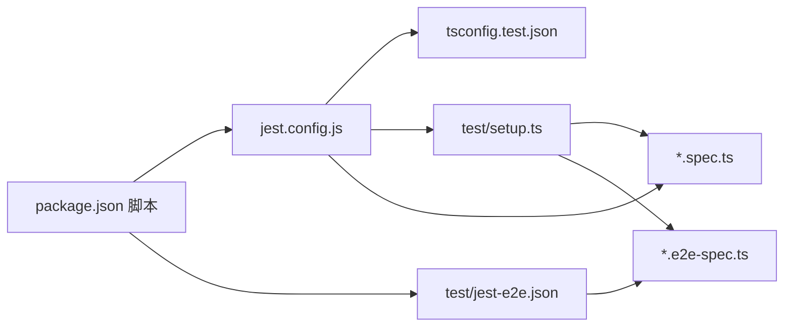

# 测试策略

<cite>
**本文引用的文件**
- [jest.config.js](file://apps/nestjs-server/jest.config.js)
- [jest-e2e.json](file://apps/nestjs-server/test/jest-e2e.json)
- [setup.ts](file://apps/nestjs-server/test/setup.ts)
- [package.json](file://apps/nestjs-server/package.json)
- [tsconfig.test.json](file://apps/nestjs-server/tsconfig.test.json)
- [app.e2e-spec.ts](file://apps/nestjs-server/test/app.e2e-spec.ts)
- [auth.service.spec.ts](file://apps/nestjs-server/src/modules/auth/auth.service.spec.ts)
- [http-exception.filter.spec.ts](file://apps/nestjs-server/src/common/filters/http-exception.filter.spec.ts)
- [jwt-auth.guard.spec.ts](file://apps/nestjs-server/src/common/guards/jwt-auth.guard.spec.ts)
- [sanitize.util.spec.ts](file://apps/nestjs-server/src/common/utils/sanitize.util.spec.ts)
- [nestjs.js](file://packages/eslint-config/nestjs.js)
</cite>

## 目录

1. [引言](#引言)
2. [项目结构](#项目结构)
3. [核心组件](#核心组件)
4. [架构总览](#架构总览)
5. [详细组件分析](#详细组件分析)
6. [依赖关系分析](#依赖关系分析)
7. [性能考量](#性能考量)
8. [故障排查指南](#故障排查指南)
9. [结论](#结论)
10. [附录](#附录)

## 引言

本测试策略文档系统性阐述后端 NestJS 应用的测试架构与实践，覆盖单元测试、集成测试与端到端测试的组织方式与执行策略；详解 Jest 配置、Mock 机制与覆盖率门槛；说明测试数据与环境管理以及在持续集成中的执行建议。同时提供测试编写指南、最佳实践与调试技巧，并通过真实测试文件路径示例展示 TDD 流程。

## 项目结构

后端应用采用单体仓库，测试集中在 apps/nestjs-server 下：

- 单元测试：以 .spec.ts 结尾，位于各模块源码目录中，遵循按功能分层组织。
- 端到端测试：位于 apps/nestjs-server/test/，以 .e2e-spec.ts 命名。
- 测试运行配置：Jest 根配置与端测专用配置分离，便于隔离与扩展。
- 公共测试工具：统一在 test/setup.ts 中定义全局 Mock 与超时设置。



图表来源

- [jest.config.js:1-34](file://apps/nestjs-server/jest.config.js#L1-L34)
- [jest-e2e.json:1-10](file://apps/nestjs-server/test/jest-e2e.json#L1-L10)
- [setup.ts:1-47](file://apps/nestjs-server/test/setup.ts#L1-L47)
- [package.json:1-85](file://apps/nestjs-server/package.json#L1-L85)
- [tsconfig.test.json:1-8](file://apps/nestjs-server/tsconfig.test.json#L1-L8)
- [auth.service.spec.ts:1-278](file://apps/nestjs-server/src/modules/auth/auth.service.spec.ts#L1-L278)
- [http-exception.filter.spec.ts:1-122](file://apps/nestjs-server/src/common/filters/http-exception.filter.spec.ts#L1-L122)
- [jwt-auth.guard.spec.ts:1-97](file://apps/nestjs-server/src/common/guards/jwt-auth.guard.spec.ts#L1-L97)
- [sanitize.util.spec.ts:1-130](file://apps/nestjs-server/src/common/utils/sanitize.util.spec.ts#L1-L130)
- [app.e2e-spec.ts:1-27](file://apps/nestjs-server/test/app.e2e-spec.ts#L1-L27)

章节来源

- [jest.config.js:1-34](file://apps/nestjs-server/jest.config.js#L1-L34)
- [jest-e2e.json:1-10](file://apps/nestjs-server/test/jest-e2e.json#L1-L10)
- [setup.ts:1-47](file://apps/nestjs-server/test/setup.ts#L1-L47)
- [package.json:1-85](file://apps/nestjs-server/package.json#L1-L85)
- [tsconfig.test.json:1-8](file://apps/nestjs-server/tsconfig.test.json#L1-L8)

## 核心组件

- Jest 核心配置
  - 模块解析与转换：使用 ts-jest 并指定 tsconfig.test.json，确保测试编译选项与生产隔离。
  - 测试文件匹配：仅扫描 .spec.ts 文件，避免 .e2e-spec.ts 与生成代码进入单元测试范围。
  - 覆盖率收集：排除 spec/e2e 文件、入口 main.ts 与 generated 目录，目标为全局分支、函数、行、语句均≥80%。
  - 环境与初始化：Node 环境，加载 test/setup.ts 进行全局超时与清理。
  - 别名映射：支持 @/、@modules/、@common/、@config/ 等路径别名，提升可读性与迁移性。
- 端到端配置
  - 使用独立 jest-e2e.json，testRegex 限定 .e2e-spec.ts，便于与单元测试并行执行。
- 全局测试工具
  - 超时：默认 10 秒，适合大多数 API 场景。
  - 清理：afterEach 自动清空所有 Mock 调用历史，避免跨用例污染。
  - Mock 集合：提供 PrismaService 与 JwtService 的常用方法 Mock，覆盖用户、角色、菜单、刷新令牌等模型操作与 JWT 签发/验证/解码。
- 包脚本
  - test、test:watch、test:cov、test:debug、test:e2e，满足本地开发与 CI 执行需求。

章节来源

- [jest.config.js:1-34](file://apps/nestjs-server/jest.config.js#L1-L34)
- [jest-e2e.json:1-10](file://apps/nestjs-server/test/jest-e2e.json#L1-L10)
- [setup.ts:1-47](file://apps/nestjs-server/test/setup.ts#L1-L47)
- [package.json:1-85](file://apps/nestjs-server/package.json#L1-L85)

## 架构总览

下图展示了测试生命周期的关键节点：配置加载、测试发现、执行与覆盖率统计。



图表来源

- [jest.config.js:1-34](file://apps/nestjs-server/jest.config.js#L1-L34)
- [jest-e2e.json:1-10](file://apps/nestjs-server/test/jest-e2e.json#L1-L10)
- [setup.ts:1-47](file://apps/nestjs-server/test/setup.ts#L1-L47)
- [tsconfig.test.json:1-8](file://apps/nestjs-server/tsconfig.test.json#L1-L8)

## 详细组件分析

### 单元测试：认证服务（AuthService）

该测试用例覆盖登录凭据校验、注册、刷新令牌与登出等核心流程，充分展示依赖注入、Mock 与断言策略。



图表来源

- [auth.service.spec.ts:1-278](file://apps/nestjs-server/src/modules/auth/auth.service.spec.ts#L1-L278)
- [setup.ts:7-46](file://apps/nestjs-server/test/setup.ts#L7-L46)

章节来源

- [auth.service.spec.ts:1-278](file://apps/nestjs-server/src/modules/auth/auth.service.spec.ts#L1-L278)
- [setup.ts:1-47](file://apps/nestjs-server/test/setup.ts#L1-L47)

### 单元测试：异常过滤器（HttpExceptionFilter）

验证不同异常类型（业务异常、参数校验异常、通用 HttpException、未授权）的响应格式与状态码。

```mermaid
flowchart TD
Start(["进入 catch(exception, host)"]) --> Type{"异常类型？"}
Type --> |BusinessException| Biz["提取 bizCode 与消息"]
Type --> |HttpException(数组消息)| Val["封装为统一校验错误"]
Type --> |HttpException(字符串消息)| Gen["使用默认 bizCode 映射"]
Type --> |UnauthorizedException| Ua["返回 UNAUTHORIZED 错误"]
Biz --> Resp["设置状态码并返回 {code,message}"]
Val --> Resp
Gen --> Resp
Ua --> Resp
Resp --> End(["完成"])
```

图表来源

- [http-exception.filter.spec.ts:1-122](file://apps/nestjs-server/src/common/filters/http-exception.filter.spec.ts#L1-L122)

章节来源

- [http-exception.filter.spec.ts:1-122](file://apps/nestjs-server/src/common/filters/http-exception.filter.spec.ts#L1-L122)

### 单元测试：JWT 认证守卫（JwtAuthGuard）

通过模拟 @nestjs/passport 的 AuthGuard，验证公开路由与受保护路由的行为差异。



图表来源

- [jwt-auth.guard.spec.ts:1-97](file://apps/nestjs-server/src/common/guards/jwt-auth.guard.spec.ts#L1-L97)

章节来源

- [jwt-auth.guard.spec.ts:1-97](file://apps/nestjs-server/src/common/guards/jwt-auth.guard.spec.ts#L1-L97)

### 单元测试：工具函数（sanitize.util）

验证对象与字符串中敏感字段的掩码处理逻辑，包括递归掩码、自定义掩码符与边界情况。



图表来源

- [sanitize.util.spec.ts:1-130](file://apps/nestjs-server/src/common/utils/sanitize.util.spec.ts#L1-L130)

章节来源

- [sanitize.util.spec.ts:1-130](file://apps/nestjs-server/src/common/utils/sanitize.util.spec.ts#L1-L130)

### 端到端测试（E2E）

基于 @nestjs/testing 创建最小化应用实例，使用 supertest 发起 HTTP 请求进行端到端验证。



图表来源

- [app.e2e-spec.ts:1-27](file://apps/nestjs-server/test/app.e2e-spec.ts#L1-L27)

章节来源

- [app.e2e-spec.ts:1-27](file://apps/nestjs-server/test/app.e2e-spec.ts#L1-L27)

## 依赖关系分析

- 测试配置依赖
  - jest.config.js 依赖 tsconfig.test.json 提供的编译选项。
  - setup.ts 作为 setupFilesAfterEnv 被加载，统一注入 Mock 与超时。
  - package.json 的脚本分别调用 Jest 主配置与端测配置。
- 组件耦合
  - 单元测试通过 @nestjs/testing 注入 Mock 服务，降低对外部依赖的耦合。
  - E2E 测试通过 AppModule 启动完整应用，验证真实路由与中间件链路。
- 可能的循环依赖
  - 测试文件不导入生产实现，仅通过 provide/useValue 注入 Mock，避免循环依赖风险。



图表来源

- [package.json:1-85](file://apps/nestjs-server/package.json#L1-L85)
- [jest.config.js:1-34](file://apps/nestjs-server/jest.config.js#L1-L34)
- [jest-e2e.json:1-10](file://apps/nestjs-server/test/jest-e2e.json#L1-L10)
- [tsconfig.test.json:1-8](file://apps/nestjs-server/tsconfig.test.json#L1-L8)
- [setup.ts:1-47](file://apps/nestjs-server/test/setup.ts#L1-L47)

章节来源

- [package.json:1-85](file://apps/nestjs-server/package.json#L1-L85)
- [jest.config.js:1-34](file://apps/nestjs-server/jest.config.js#L1-L34)
- [jest-e2e.json:1-10](file://apps/nestjs-server/test/jest-e2e.json#L1-L10)
- [tsconfig.test.json:1-8](file://apps/nestjs-server/tsconfig.test.json#L1-L8)
- [setup.ts:1-47](file://apps/nestjs-server/test/setup.ts#L1-L47)

## 性能考量

- 测试并发与隔离
  - 使用 Jest 默认并发策略，避免过度并发导致资源争用。
  - 通过 afterEach 清理 Mock，减少内存泄漏与跨用例干扰。
- 覆盖率与性能平衡
  - 覆盖率阈值较高（80%），建议优先保证关键路径与异常分支，避免为覆盖而写冗余用例。
- 端到端测试成本
  - E2E 测试启动完整应用，建议仅保留核心场景，其余逻辑下沉到单元测试。

## 故障排查指南

- 超时问题
  - 若出现超时，检查 jest.config.js 中的超时设置与网络依赖（数据库、缓存）可用性。
- Mock 不生效
  - 确认 provide/useValue 是否正确注入，且被测试模块的构造函数或方法使用了注入的服务。
- 路径别名报错
  - 确保 moduleNameMapper 正确映射 @/、@modules/、@common/、@config/，并在 tsconfig.test.json 中包含测试目录。
- 覆盖率不足
  - 分析覆盖率报告，补充关键分支与异常路径的用例；注意排除项（如 main.ts、generated 目录）不会计入覆盖率。
- ESLint 与 Jest 全局变量
  - eslint-config-nestjs 已声明 Jest 全局，若编辑器提示未定义，确认使用的 ESLint 配置已正确应用。

章节来源

- [jest.config.js:1-34](file://apps/nestjs-server/jest.config.js#L1-L34)
- [nestjs.js:1-16](file://packages/eslint-config/nestjs.js#L1-L16)

## 结论

本项目采用“单元测试为主、端到端测试兜底”的测试金字塔：单元测试聚焦业务逻辑与边界条件，E2E 测试验证端到端链路。Jest 配置清晰、Mock 体系完善、覆盖率门槛明确，结合统一的测试工具与脚本，能够高效支撑迭代与回归。建议在 CI 中同时执行单元测试与覆盖率检查，并对 E2E 用例进行分层执行以优化整体耗时。

## 附录

### 测试组织与执行策略

- 单元测试
  - 命名：模块名+.service/.controller/.filter/.guard/.util.spec.ts
  - 组织：按功能模块分层，每个服务/拦截器/守卫/工具函数均配套测试
  - 执行：npm run test 或 npm run test:watch
- 集成测试（建议）
  - 通过 @nestjs/testing 的 TestingModule 组合多个模块，验证模块间协作
  - 将集成测试置于 src/.../\*.integration.spec.ts，便于与单元测试区分
- 端到端测试
  - 命名：\*.e2e-spec.ts
  - 执行：npm run test:e2e
- 覆盖率
  - 通过 npm run test:cov 生成报告，关注全局分支、函数、行、语句覆盖率
  - 阈值：80%
- 测试数据管理
  - 使用 Mock 数据与假 ID，避免真实数据库副作用
  - 对需要持久化的场景，可在 CI 中使用临时数据库快照或只读副本
- 测试环境配置
  - 使用独立的 tsconfig.test.json，隔离测试编译选项
  - 在 setup.ts 中集中管理全局 Mock 与超时，减少重复配置
- 持续集成
  - 建议在流水线中并行执行单元测试与覆盖率检查，E2E 测试单独阶段执行
  - 失败即中断，覆盖率低于阈值时阻断合并

### 测试编写指南与最佳实践

- 好的测试命名
  - 使用行为驱动的描述，如 shouldXXX whenYYY
- 测试结构
  - Arrange（准备）、Act（执行）、Assert（断言）三段式
- Mock 策略
  - 优先使用 provide/useValue 注入简单 Mock
  - 对复杂外部依赖（如 Passport）使用 jest.mock
- 断言策略
  - 关注关键输出与副作用（如数据库调用次数与参数）
  - 对异常场景使用 expect().rejects.toThrow(...)
- 调试技巧
  - 使用 test:debug 启动断点调试
  - 在 setup.ts 中增加日志或简化 Mock 以定位问题
  - 对 E2E 使用更宽松的超时并逐步缩小问题范围

### 测试驱动开发（TDD）流程示例

- 从失败用例开始：新增一个 .spec.ts 文件，编写一个失败的断言
- 最小实现：编写最少代码使用例通过
- 重构：保持用例通过的前提下优化代码结构与可测试性
- 重复：对下一个需求重复上述流程
