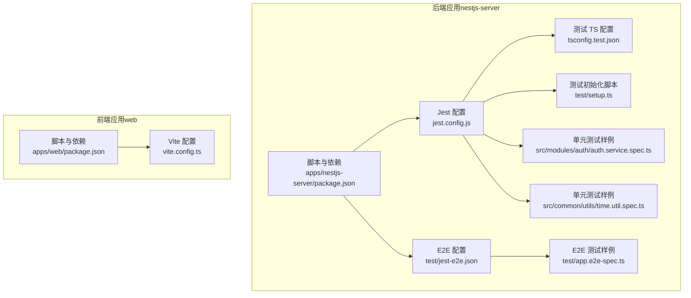
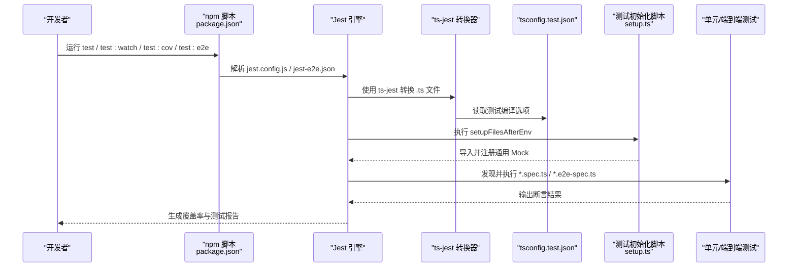
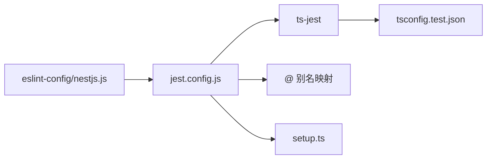

# 测试配置

<cite>
**本文引用的文件**
- [jest.config.js](file://apps/nestjs-server/jest.config.js)
- [tsconfig.test.json](file://apps/nestjs-server/tsconfig.test.json)
- [jest-e2e.json](file://apps/nestjs-server/test/jest-e2e.json)
- [setup.ts](file://apps/nestjs-server/test/setup.ts)
- [package.json（nestjs-server）](file://apps/nestjs-server/package.json)
- [auth.service.spec.ts](file://apps/nestjs-server/src/modules/auth/auth.service.spec.ts)
- [app.e2e-spec.ts](file://apps/nestjs-server/test/app.e2e-spec.ts)
- [time.util.spec.ts](file://apps/nestjs-server/src/common/utils/time.util.spec.ts)
- [vite.config.ts（web 应用）](file://apps/web/vite.config.ts)
- [package.json（web 应用）](file://apps/web/package.json)
- [config.module.ts](file://apps/nestjs-server/src/config/config.module.ts)
- [config-loader.ts](file://apps/nestjs-server/src/config/config-loader.ts)
- [typed-config.service.ts](file://apps/nestjs-server/src/config/typed-config.service.ts)
- [database.schema.ts](file://apps/nestjs-server/src/config/schemas/database.schema.ts)
- [nestjs.js（ESLint 配置）](file://packages/eslint-config/nestjs.js)
</cite>

## 目录

1. [简介](#简介)
2. [项目结构](#项目结构)
3. [核心组件](#核心组件)
4. [架构总览](#架构总览)
5. [详细组件分析](#详细组件分析)
6. [依赖分析](#依赖分析)
7. [性能考虑](#性能考虑)
8. [故障排查指南](#故障排查指南)
9. [结论](#结论)
10. [附录](#附录)

## 简介

本文件系统性梳理并解释本仓库的测试配置与工具链，重点覆盖以下方面：

- Jest 单元测试与端到端测试配置项与行为
- TypeScript 测试编译配置与路径映射
- 测试覆盖率阈值与输出目录
- 测试环境变量加载与验证机制
- Mock 模块与测试辅助脚手架
- 在不同环境（开发、CI、生产）中运行测试的方法
- 调试技巧与常见问题的解决方案

## 项目结构

本项目采用多包工作区布局，测试相关的核心位置集中在后端应用的测试目录与配置文件中；前端应用使用 Vite 开发服务器，不包含内置的单元测试配置。

图表来源

- [jest.config.js:1-34](file://apps/nestjs-server/jest.config.js#L1-L34)
- [tsconfig.test.json:1-8](file://apps/nestjs-server/tsconfig.test.json#L1-L8)
- [jest-e2e.json:1-10](file://apps/nestjs-server/test/jest-e2e.json#L1-L10)
- [setup.ts:1-47](file://apps/nestjs-server/test/setup.ts#L1-L47)
- [auth.service.spec.ts:1-278](file://apps/nestjs-server/src/modules/auth/auth.service.spec.ts#L1-L278)
- [time.util.spec.ts:1-162](file://apps/nestjs-server/src/common/utils/time.util.spec.ts#L1-L162)
- [app.e2e-spec.ts:1-27](file://apps/nestjs-server/test/app.e2e-spec.ts#L1-L27)
- [vite.config.ts:1-23](file://apps/web/vite.config.ts#L1-L23)
- [package.json（nestjs-server）:1-85](file://apps/nestjs-server/package.json#L1-L85)
- [package.json（web 应用）:1-44](file://apps/web/package.json#L1-L44)

章节来源

- [jest.config.js:1-34](file://apps/nestjs-server/jest.config.js#L1-L34)
- [tsconfig.test.json:1-8](file://apps/nestjs-server/tsconfig.test.json#L1-L8)
- [jest-e2e.json:1-10](file://apps/nestjs-server/test/jest-e2e.json#L1-L10)
- [setup.ts:1-47](file://apps/nestjs-server/test/setup.ts#L1-L47)
- [package.json（nestjs-server）:1-85](file://apps/nestjs-server/package.json#L1-L85)
- [vite.config.ts（web 应用）:1-23](file://apps/web/vite.config.ts#L1-L23)
- [package.json（web 应用）:1-44](file://apps/web/package.json#L1-L44)

## 核心组件

- Jest 单元测试配置（apps/nestjs-server/jest.config.js）
  - 指定测试文件匹配规则、转换器、覆盖率收集范围、覆盖率阈值、测试环境与模块名映射等。
- TypeScript 测试编译配置（apps/nestjs-server/tsconfig.test.json）
  - 扩展根 tsconfig，并限定测试包含范围，确保测试与源码均被正确编译。
- E2E 测试配置（apps/nestjs-server/test/jest-e2e.json）
  - 专用于端到端测试的 Jest 配置，独立于单元测试配置。
- 测试初始化脚本（apps/nestjs-server/test/setup.ts）
  - 统一设置超时、清理 Mock、导出常用 Mock 对象，便于各测试文件复用。
- 后端应用脚本与依赖（apps/nestjs-server/package.json）
  - 提供 test、test:watch、test:cov、test:debug、test:e2e 等脚本，以及 Jest、ts-jest、@nestjs/testing 等依赖。
- 前端应用配置（apps/web/vite.config.ts）
  - 提供别名与代理，便于本地联调；前端无内置测试配置，建议通过独立工具链集成。

章节来源

- [jest.config.js:1-34](file://apps/nestjs-server/jest.config.js#L1-L34)
- [tsconfig.test.json:1-8](file://apps/nestjs-server/tsconfig.test.json#L1-L8)
- [jest-e2e.json:1-10](file://apps/nestjs-server/test/jest-e2e.json#L1-L10)
- [setup.ts:1-47](file://apps/nestjs-server/test/setup.ts#L1-L47)
- [package.json（nestjs-server）:1-85](file://apps/nestjs-server/package.json#L1-L85)
- [vite.config.ts（web 应用）:1-23](file://apps/web/vite.config.ts#L1-L23)

## 架构总览

下图展示了测试执行的关键流程：从 npm 脚本触发 Jest，到 ts-jest 使用测试 tsconfig 编译，再到模块名映射与 Mock 初始化，最终产出覆盖率与测试结果。

图表来源

- [package.json（nestjs-server）:8-25](file://apps/nestjs-server/package.json#L8-L25)
- [jest.config.js:1-34](file://apps/nestjs-server/jest.config.js#L1-L34)
- [tsconfig.test.json:1-8](file://apps/nestjs-server/tsconfig.test.json#L1-L8)
- [setup.ts:1-47](file://apps/nestjs-server/test/setup.ts#L1-L47)
- [jest-e2e.json:1-10](file://apps/nestjs-server/test/jest-e2e.json#L1-L10)

## 详细组件分析

### Jest 单元测试配置（jest.config.js）

- 关键参数说明
  - 模块扩展与根目录：限定扫描范围与文件类型。
  - 测试正则：仅匹配以 .spec.ts 结尾的文件。
  - 转换器：使用 ts-jest 并指定测试 tsconfig。
  - 覆盖率收集：排除 spec/e2e 文件、入口与生成代码。
  - 覆盖率输出目录与阈值：统一输出至 coverage 目录，设定全局阈值。
  - 测试环境：Node 环境。
  - 初始化脚本：加载测试初始化脚本。
  - 模块名映射：支持 @、@modules、@common、@config 的路径别名，便于模块导入。
- 影响范围
  - 决定测试发现、编译、覆盖率统计与输出格式。
  - 与 tsconfig.test.json 协同，确保测试编译上下文一致。

章节来源

- [jest.config.js:1-34](file://apps/nestjs-server/jest.config.js#L1-L34)

### TypeScript 测试编译配置（tsconfig.test.json）

- 关键点
  - 继承根 tsconfig，保证与生产构建一致的编译策略。
  - include 明确包含 src 与 test 下的 TypeScript 文件，避免遗漏或误包含。
  - rootDir 指向项目根，配合 Jest 的 moduleNameMapper 保持路径解析一致。
- 作用
  - 为 ts-jest 提供稳定的编译上下文，减少“编译差异”导致的测试失败。

章节来源

- [tsconfig.test.json:1-8](file://apps/nestjs-server/tsconfig.test.json#L1-L8)

### E2E 测试配置（test/jest-e2e.json）

- 关键点
  - rootDir 指向项目根，测试正则限定为 .e2e-spec.ts。
  - 使用 ts-jest 转换器，无需额外 tsconfig 指定。
  - 测试环境为 Node。
- 作用
  - 将端到端测试与单元测试隔离，避免相互干扰。

章节来源

- [jest-e2e.json:1-10](file://apps/nestjs-server/test/jest-e2e.json#L1-L10)

### 测试初始化脚本（test/setup.ts）

- 功能
  - 设置默认测试超时。
  - 在每个测试用例后清理所有 Mock。
  - 导出常用 Mock（如 PrismaService、JwtService），供测试文件按需引入与注入。
- 价值
  - 统一测试基线，减少重复样板代码，提升可维护性。

章节来源

- [setup.ts:1-47](file://apps/nestjs-server/test/setup.ts#L1-L47)

### 测试脚本与工具链（nestjs-server/package.json）

- 脚本
  - test：运行 Jest 默认配置（单元测试）。
  - test:watch：监听模式运行单元测试。
  - test:cov：运行单元测试并生成覆盖率。
  - test:debug：启用断点调试模式。
  - test:e2e：使用 E2E 配置运行端到端测试。
- 依赖
  - Jest、ts-jest、@nestjs/testing、supertest、@types/jest 等。

章节来源

- [package.json（nestjs-server）:8-25](file://apps/nestjs-server/package.json#L8-L25)

### Mock 模块与测试样例（auth.service.spec.ts、time.util.spec.ts）

- Mock 使用
  - 在测试中通过 @nestjs/testing 的 TestingModule 提供 provide/useValue 注入 Mock。
  - 复用 test/setup.ts 中导出的 Mock 对象，简化测试准备。
- 断言策略
  - 针对业务逻辑分支进行充分断言，包括正常流程、异常场景与边界条件。
- 参考路径
  - [auth.service.spec.ts:1-278](file://apps/nestjs-server/src/modules/auth/auth.service.spec.ts#L1-L278)
  - [time.util.spec.ts:1-162](file://apps/nestjs-server/src/common/utils/time.util.spec.ts#L1-L162)

章节来源

- [auth.service.spec.ts:1-278](file://apps/nestjs-server/src/modules/auth/auth.service.spec.ts#L1-L278)
- [time.util.spec.ts:1-162](file://apps/nestjs-server/src/common/utils/time.util.spec.ts#L1-L162)
- [setup.ts:1-47](file://apps/nestjs-server/test/setup.ts#L1-L47)

### 端到端测试样例（app.e2e-spec.ts）

- 行为
  - 使用 @nestjs/testing 创建应用实例，初始化后通过 supertest 发起请求断言。
- 注意
  - 测试结束后关闭应用，释放资源。

章节来源

- [app.e2e-spec.ts:1-27](file://apps/nestjs-server/test/app.e2e-spec.ts#L1-L27)

### 前端应用的测试定位（web 应用）

- 当前状态
  - vite.config.ts 提供别名与代理，便于本地联调。
  - 未包含内置的单元测试配置文件。
- 建议
  - 如需前端单元测试，可在 web 应用中引入合适的测试框架与配置（例如 Vitest 或 Jest），并在 package.json 中添加相应脚本。

章节来源

- [vite.config.ts（web 应用）:1-23](file://apps/web/vite.config.ts#L1-L23)
- [package.json（web 应用）:1-44](file://apps/web/package.json#L1-L44)

## 依赖分析

- Jest 与 ts-jest
  - Jest 通过 ts-jest 转换 TypeScript 文件，tsconfig.test.json 提供编译上下文。
- 模块名映射
  - jest.config.js 的 moduleNameMapper 与 tsconfig.test.json 的 rootDir 协同，确保 @、@modules、@common、@config 的路径解析一致。
- 测试初始化
  - setup.ts 作为 setupFilesAfterEnv，统一注入 Mock 与清理逻辑。
- ESLint 全局 Jest 支持
  - eslint-config 包含 Jest 全局变量配置，便于编辑器与 Lint 工具识别测试代码。

图表来源

- [jest.config.js:1-34](file://apps/nestjs-server/jest.config.js#L1-L34)
- [tsconfig.test.json:1-8](file://apps/nestjs-server/tsconfig.test.json#L1-L8)
- [setup.ts:1-47](file://apps/nestjs-server/test/setup.ts#L1-L47)
- [nestjs.js（ESLint 配置）:1-16](file://packages/eslint-config/nestjs.js#L1-L16)

章节来源

- [jest.config.js:1-34](file://apps/nestjs-server/jest.config.js#L1-L34)
- [tsconfig.test.json:1-8](file://apps/nestjs-server/tsconfig.test.json#L1-L8)
- [setup.ts:1-47](file://apps/nestjs-server/test/setup.ts#L1-L47)
- [nestjs.js（ESLint 配置）:1-16](file://packages/eslint-config/nestjs.js#L1-L16)

## 性能考虑

- 测试发现与编译
  - 使用精确的 testRegex 与 moduleNameMapper，减少不必要的文件扫描与解析。
  - 将测试 tsconfig 与生产 tsconfig 分离，避免在测试中引入过多无关模块。
- 覆盖率与阈值
  - 合理设置覆盖率阈值，避免过度严格导致 CI 频繁失败；同时确保关键路径被覆盖。
- 并行与缓存
  - Jest 默认支持并发执行，结合 watch 模式提升迭代效率；必要时可调整缓存策略以优化冷启动。

## 故障排查指南

- 测试找不到模块或路径解析失败
  - 检查 jest.config.js 的 moduleNameMapper 是否与 tsconfig.test.json 的 rootDir 一致。
  - 确认 @、@modules、@common、@config 的别名是否在 tsconfig 中生效。
- 转换器报错或类型检查失败
  - 确保 ts-jest 使用的是 tsconfig.test.json，且 include 覆盖了测试文件。
- 覆盖率不更新或为空
  - 检查 collectCoverageFrom 排除规则，确认目标文件未被错误排除。
  - 确认 test 脚本使用了 --coverage 参数。
- 端到端测试无法启动
  - 确认 test:e2e 脚本指向 jest-e2e.json，且测试文件命名符合 .e2e-spec.ts 规范。
- 调试困难
  - 使用 test:debug 脚本启用断点调试；在 setup.ts 中适当增加日志以便定位问题。
- 环境变量与配置
  - 若涉及环境变量，请参考后端配置模块与加载器，确保变量存在且通过 Zod 校验。

章节来源

- [jest.config.js:1-34](file://apps/nestjs-server/jest.config.js#L1-L34)
- [tsconfig.test.json:1-8](file://apps/nestjs-server/tsconfig.test.json#L1-L8)
- [jest-e2e.json:1-10](file://apps/nestjs-server/test/jest-e2e.json#L1-L10)
- [setup.ts:1-47](file://apps/nestjs-server/test/setup.ts#L1-L47)
- [config.module.ts:1-19](file://apps/nestjs-server/src/config/config.module.ts#L1-L19)
- [config-loader.ts:36-59](file://apps/nestjs-server/src/config/config-loader.ts#L36-L59)
- [typed-config.service.ts:1-45](file://apps/nestjs-server/src/config/typed-config.service.ts#L1-L45)
- [database.schema.ts:1-10](file://apps/nestjs-server/src/config/schemas/database.schema.ts#L1-L10)

## 结论

本项目的测试体系以 Jest 为核心，辅以 ts-jest、测试 tsconfig 与统一的初始化脚本，形成可维护、可扩展的测试基础设施。通过明确的模块名映射、覆盖率阈值与脚本约定，能够在不同环境下稳定运行单元与端到端测试。建议在后续迭代中持续完善覆盖率目标与测试用例质量，并根据需要为前端应用引入合适的测试工具链。

## 附录

- 在不同环境运行测试
  - 开发环境：使用 test:watch 快速反馈；使用 test:debug 进行断点调试。
  - CI 环境：使用 test:cov 生成覆盖率报告；确保覆盖率阈值通过后再合并。
  - 端到端：使用 test:e2e 运行 E2E 测试，确保服务端口与数据库可用。
- 常见问题与解决
  - 路径别名不生效：核对 moduleNameMapper 与 rootDir。
  - 类型错误：检查 tsconfig.test.json 的 include 与 exclude。
  - 覆盖率异常：检查 collectCoverageFrom 与覆盖率阈值配置。
  - 环境变量校验失败：检查 config-loader 的 Zod 校验与 .env 文件（非生产环境）。
