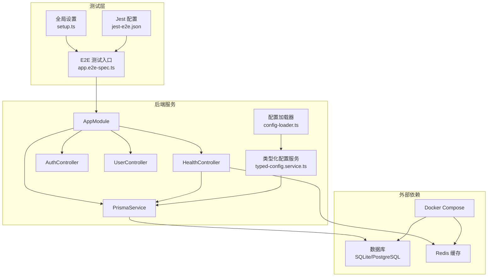
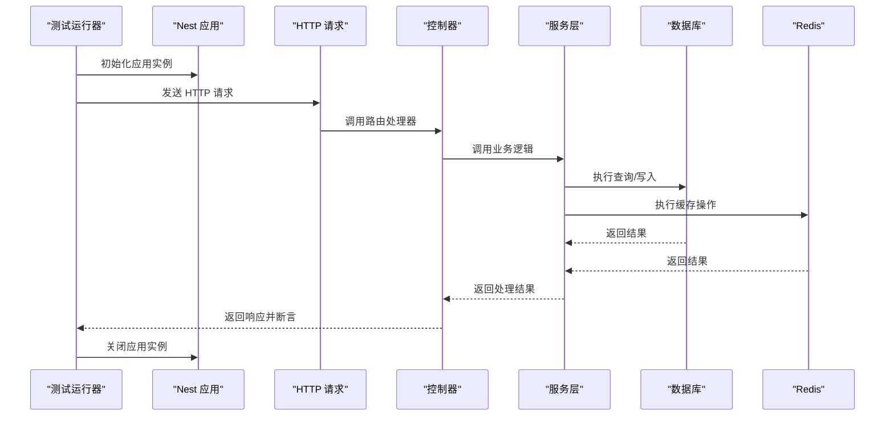
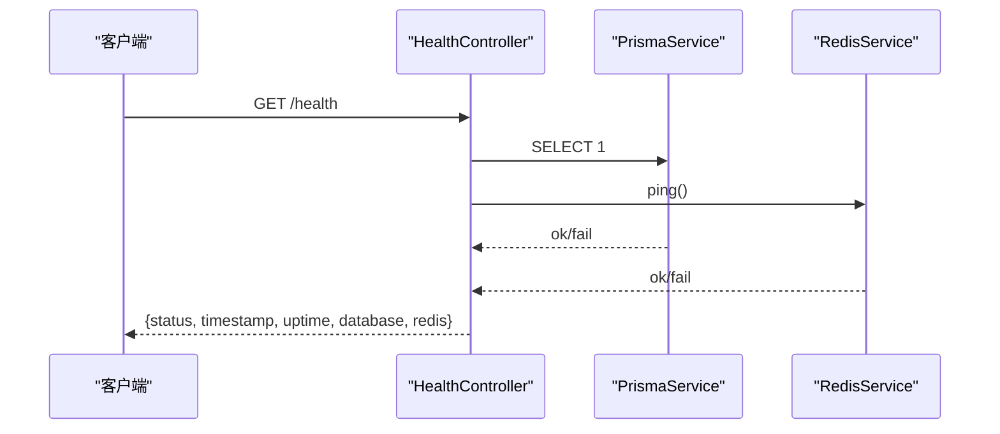
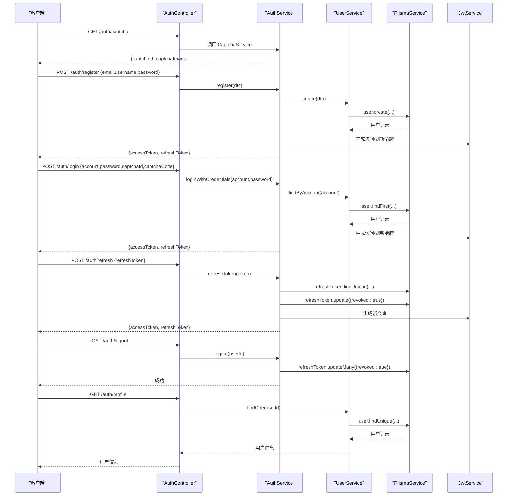
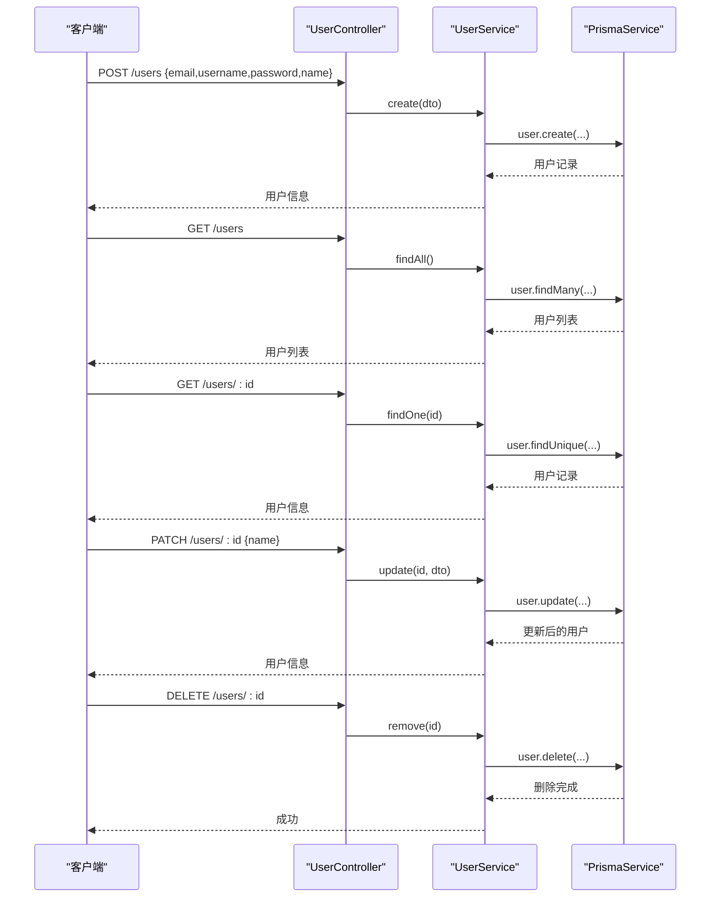
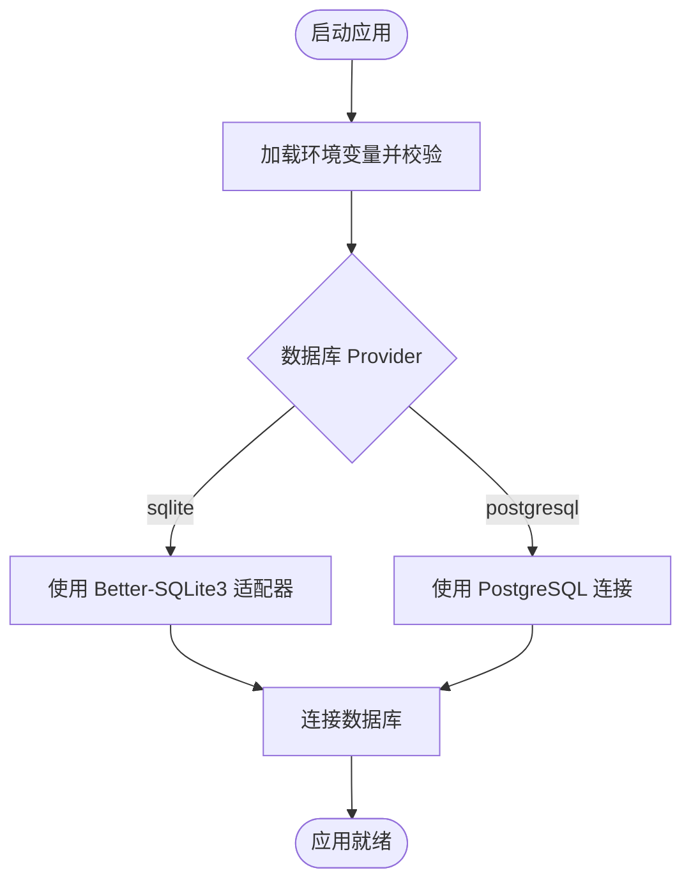
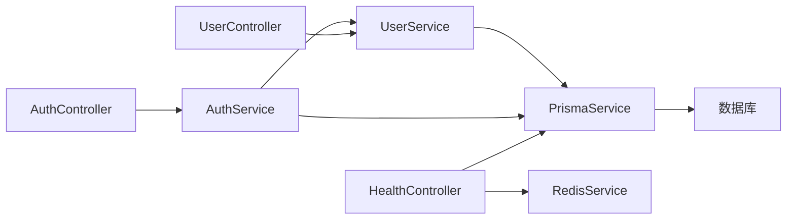

# 集成测试

<cite>
**本文引用的文件**   
- [apps/nestjs-server/test/app.e2e-spec.ts](file://apps/nestjs-server/test/app.e2e-spec.ts)
- [apps/nestjs-server/test/setup.ts](file://apps/nestjs-server/test/setup.ts)
- [apps/nestjs-server/test/jest-e2e.json](file://apps/nestjs-server/test/jest-e2e.json)
- [apps/nestjs-server/src/modules/health/health.controller.ts](file://apps/nestjs-server/src/modules/health/health.controller.ts)
- [apps/nestjs-server/src/modules/auth/auth.controller.ts](file://apps/nestjs-server/src/modules/auth/auth.controller.ts)
- [apps/nestjs-server/src/modules/auth/auth.service.ts](file://apps/nestjs-server/src/modules/auth/auth.service.ts)
- [apps/nestjs-server/src/modules/user/user.controller.ts](file://apps/nestjs-server/src/modules/user/user.controller.ts)
- [apps/nestjs-server/src/modules/user/user.service.ts](file://apps/nestjs-server/src/modules/user/user.service.ts)
- [apps/nestjs-server/src/prisma/prisma.service.ts](file://apps/nestjs-server/src/prisma/prisma.service.ts)
- [apps/nestjs-server/docker-compose.yml](file://apps/nestjs-server/docker-compose.yml)
- [apps/nestjs-server/src/config/config-loader.ts](file://apps/nestjs-server/src/config/config-loader.ts)
- [apps/nestjs-server/src/config/typed-config.service.ts](file://apps/nestjs-server/src/config/typed-config.service.ts)
- [apps/nestjs-server/package.json](file://apps/nestjs-server/package.json)
</cite>

## 目录
1. [引言](#引言)
2. [项目结构](#项目结构)
3. [核心组件](#核心组件)
4. [架构总览](#架构总览)
5. [详细组件分析](#详细组件分析)
6. [依赖关系分析](#依赖关系分析)
7. [性能考虑](#性能考虑)
8. [故障排查指南](#故障排查指南)
9. [结论](#结论)
10. [附录](#附录)

## 引言
本文件面向集成测试与端到端测试（E2E）的架构设计与实现方法，覆盖以下主题：
- E2E 测试配置项、测试环境搭建与数据库连接策略
- API 接口测试、认证流程测试与业务场景测试的编写方法
- 具体测试示例：用户认证、用户管理、健康检查等核心功能
- 测试数据清理、环境隔离与测试结果验证策略
- 在 CI/CD 中执行集成测试的建议

## 项目结构
本项目采用多包工作区结构，集成测试位于后端应用的 test 目录下，使用 Jest + Supertest 进行端到端测试；数据库通过 Prisma 客户端连接，支持 SQLite 与 PostgreSQL 两种 Provider；健康检查模块同时检测数据库与 Redis 的可用性。

图表来源
- [apps/nestjs-server/test/app.e2e-spec.ts:1-27](file://apps/nestjs-server/test/app.e2e-spec.ts#L1-L27)
- [apps/nestjs-server/test/setup.ts:1-47](file://apps/nestjs-server/test/setup.ts#L1-L47)
- [apps/nestjs-server/test/jest-e2e.json:1-10](file://apps/nestjs-server/test/jest-e2e.json#L1-L10)
- [apps/nestjs-server/src/modules/health/health.controller.ts:1-99](file://apps/nestjs-server/src/modules/health/health.controller.ts#L1-L99)
- [apps/nestjs-server/src/modules/auth/auth.controller.ts:1-115](file://apps/nestjs-server/src/modules/auth/auth.controller.ts#L1-L115)
- [apps/nestjs-server/src/modules/user/user.controller.ts:1-79](file://apps/nestjs-server/src/modules/user/user.controller.ts#L1-L79)
- [apps/nestjs-server/src/prisma/prisma.service.ts:1-36](file://apps/nestjs-server/src/prisma/prisma.service.ts#L1-L36)
- [apps/nestjs-server/src/config/config-loader.ts:1-60](file://apps/nestjs-server/src/config/config-loader.ts#L1-L60)
- [apps/nestjs-server/src/config/typed-config.service.ts:1-46](file://apps/nestjs-server/src/config/typed-config.service.ts#L1-L46)
- [apps/nestjs-server/docker-compose.yml:1-54](file://apps/nestjs-server/docker-compose.yml#L1-L54)

章节来源
- [apps/nestjs-server/test/app.e2e-spec.ts:1-27](file://apps/nestjs-server/test/app.e2e-spec.ts#L1-L27)
- [apps/nestjs-server/test/jest-e2e.json:1-10](file://apps/nestjs-server/test/jest-e2e.json#L1-L10)
- [apps/nestjs-server/docker-compose.yml:1-54](file://apps/nestjs-server/docker-compose.yml#L1-L54)

## 核心组件
- 测试入口与生命周期
  - E2E 测试入口文件负责创建 Nest 应用实例并在每个测试前后初始化/关闭应用。
  - 全局设置文件统一设置 Jest 超时与清理 Mock，便于稳定复现。
- 控制器与服务
  - 认证控制器与服务：提供验证码、注册、登录、刷新令牌、登出、获取个人资料等能力。
  - 用户控制器与服务：提供用户创建、查询、更新、删除等能力。
  - 健康检查控制器：同时检查数据库与 Redis 可用性，并返回服务状态。
- 数据库与配置
  - PrismaService 支持 SQLite 与 PostgreSQL 两种 Provider，依据配置动态选择适配器。
  - 配置加载器与类型化配置服务确保环境变量严格校验与类型安全访问。

章节来源
- [apps/nestjs-server/test/app.e2e-spec.ts:10-25](file://apps/nestjs-server/test/app.e2e-spec.ts#L10-L25)
- [apps/nestjs-server/test/setup.ts:1-47](file://apps/nestjs-server/test/setup.ts#L1-L47)
- [apps/nestjs-server/src/modules/auth/auth.controller.ts:1-115](file://apps/nestjs-server/src/modules/auth/auth.controller.ts#L1-L115)
- [apps/nestjs-server/src/modules/auth/auth.service.ts:1-151](file://apps/nestjs-server/src/modules/auth/auth.service.ts#L1-L151)
- [apps/nestjs-server/src/modules/user/user.controller.ts:1-79](file://apps/nestjs-server/src/modules/user/user.controller.ts#L1-L79)
- [apps/nestjs-server/src/modules/user/user.service.ts:1-113](file://apps/nestjs-server/src/modules/user/user.service.ts#L1-L113)
- [apps/nestjs-server/src/modules/health/health.controller.ts:1-99](file://apps/nestjs-server/src/modules/health/health.controller.ts#L1-L99)
- [apps/nestjs-server/src/prisma/prisma.service.ts:1-36](file://apps/nestjs-server/src/prisma/prisma.service.ts#L1-L36)
- [apps/nestjs-server/src/config/config-loader.ts:1-60](file://apps/nestjs-server/src/config/config-loader.ts#L1-L60)
- [apps/nestjs-server/src/config/typed-config.service.ts:1-46](file://apps/nestjs-server/src/config/typed-config.service.ts#L1-L46)

## 架构总览
下图展示了 E2E 测试从启动到请求发送再到响应断言的整体流程，以及与控制器、服务、数据库和 Redis 的交互关系。

图表来源
- [apps/nestjs-server/test/app.e2e-spec.ts:10-25](file://apps/nestjs-server/test/app.e2e-spec.ts#L10-L25)
- [apps/nestjs-server/src/modules/health/health.controller.ts:58-76](file://apps/nestjs-server/src/modules/health/health.controller.ts#L58-L76)
- [apps/nestjs-server/src/modules/auth/auth.controller.ts:59-88](file://apps/nestjs-server/src/modules/auth/auth.controller.ts#L59-L88)
- [apps/nestjs-server/src/modules/user/user.controller.ts:35-76](file://apps/nestjs-server/src/modules/user/user.controller.ts#L35-L76)
- [apps/nestjs-server/src/prisma/prisma.service.ts:28-34](file://apps/nestjs-server/src/prisma/prisma.service.ts#L28-L34)

## 详细组件分析

### E2E 测试配置与运行
- 测试框架与环境
  - 使用 Jest 与 ts-jest 转换器，测试文件以 .e2e-spec.ts 结尾，测试环境为 Node。
  - 全局超时时间与 Mock 清理在 setup.ts 中集中配置。
- 应用初始化与关闭
  - 在 beforeEach 中创建 TestingModule 并初始化 Nest 应用，在 afterEach 中关闭应用，避免资源泄漏。
- 示例用法
  - 通过 supertest 发起 HTTP 请求并断言状态码与响应体。

章节来源
- [apps/nestjs-server/test/jest-e2e.json:1-10](file://apps/nestjs-server/test/jest-e2e.json#L1-L10)
- [apps/nestjs-server/test/setup.ts:1-5](file://apps/nestjs-server/test/setup.ts#L1-L5)
- [apps/nestjs-server/test/app.e2e-spec.ts:10-25](file://apps/nestjs-server/test/app.e2e-spec.ts#L10-L25)

### 健康检查接口测试
- 接口定义
  - GET / 健康检查：返回服务状态、时间戳、运行时长、数据库与 Redis 连接状态。
  - GET /ping：返回简单“pong”响应。
- 测试要点
  - 断言返回字段类型与枚举值范围。
  - 断言数据库与 Redis 可达性的一致性。
- 数据流
  - 控制器并发检查数据库与 Redis，聚合结果后返回。

图表来源
- [apps/nestjs-server/src/modules/health/health.controller.ts:58-76](file://apps/nestjs-server/src/modules/health/health.controller.ts#L58-L76)

章节来源
- [apps/nestjs-server/src/modules/health/health.controller.ts:18-97](file://apps/nestjs-server/src/modules/health/health.controller.ts#L18-L97)

### 认证流程测试
- 接口定义
  - 获取验证码、注册、登录、刷新令牌、登出、获取个人资料。
- 测试要点
  - 验证码：断言返回结构与内容。
  - 登录/注册：断言返回访问令牌与刷新令牌；登录前需先获取验证码。
  - 刷新令牌：断言旧令牌失效且返回新令牌。
  - 登出：断言撤销用户所有刷新令牌。
  - 获取个人资料：断言返回用户基本信息。
- 数据流
  - 控制器调用 CaptchaService、AuthService、UserService；AuthService 内部使用 PrismaService 与 JwtService。

图表来源
- [apps/nestjs-server/src/modules/auth/auth.controller.ts:38-113](file://apps/nestjs-server/src/modules/auth/auth.controller.ts#L38-L113)
- [apps/nestjs-server/src/modules/auth/auth.service.ts:29-142](file://apps/nestjs-server/src/modules/auth/auth.service.ts#L29-L142)
- [apps/nestjs-server/src/modules/user/user.service.ts:17-56](file://apps/nestjs-server/src/modules/user/user.service.ts#L17-L56)
- [apps/nestjs-server/src/prisma/prisma.service.ts:28-34](file://apps/nestjs-server/src/prisma/prisma.service.ts#L28-L34)

章节来源
- [apps/nestjs-server/src/modules/auth/auth.controller.ts:1-115](file://apps/nestjs-server/src/modules/auth/auth.controller.ts#L1-L115)
- [apps/nestjs-server/src/modules/auth/auth.service.ts:1-151](file://apps/nestjs-server/src/modules/auth/auth.service.ts#L1-L151)
- [apps/nestjs-server/src/modules/user/user.service.ts:1-113](file://apps/nestjs-server/src/modules/user/user.service.ts#L1-L113)

### 用户管理接口测试
- 接口定义
  - 创建用户、获取所有用户、按 ID 查询、更新用户、删除用户。
- 测试要点
  - 创建用户：断言密码加密存储与返回字段。
  - 查询列表：断言返回数组与字段完整性。
  - 更新与删除：断言抛出“用户不存在”的业务异常。
- 数据流
  - 控制器调用 UserService；UserService 使用 PrismaService 执行数据库操作。

图表来源
- [apps/nestjs-server/src/modules/user/user.controller.ts:28-77](file://apps/nestjs-server/src/modules/user/user.controller.ts#L28-L77)
- [apps/nestjs-server/src/modules/user/user.service.ts:17-97](file://apps/nestjs-server/src/modules/user/user.service.ts#L17-L97)
- [apps/nestjs-server/src/prisma/prisma.service.ts:28-34](file://apps/nestjs-server/src/prisma/prisma.service.ts#L28-L34)

章节来源
- [apps/nestjs-server/src/modules/user/user.controller.ts:1-79](file://apps/nestjs-server/src/modules/user/user.controller.ts#L1-L79)
- [apps/nestjs-server/src/modules/user/user.service.ts:1-113](file://apps/nestjs-server/src/modules/user/user.service.ts#L1-L113)

### 数据库连接策略与环境隔离
- 数据库 Provider 选择
  - PrismaService 根据配置决定使用 SQLite 或 PostgreSQL；SQLite 使用 Better-SQLite3 适配器，PostgreSQL 由 Prisma 通过配置文件管理连接。
- 环境变量与配置校验
  - config-loader 将 process.env 映射为分层结构并通过 Zod 校验，失败则阻止启动。
  - typed-config.service 提供类型安全的配置读取。
- Docker Compose 集成
  - 提供 PostgreSQL 与 Redis 服务，定义健康检查与持久化卷，便于本地与 CI 环境快速拉起依赖。

图表来源
- [apps/nestjs-server/src/prisma/prisma.service.ts:10-26](file://apps/nestjs-server/src/prisma/prisma.service.ts#L10-L26)
- [apps/nestjs-server/src/config/config-loader.ts:5-58](file://apps/nestjs-server/src/config/config-loader.ts#L5-L58)
- [apps/nestjs-server/src/config/typed-config.service.ts:23-36](file://apps/nestjs-server/src/config/typed-config.service.ts#L23-L36)
- [apps/nestjs-server/docker-compose.yml:1-54](file://apps/nestjs-server/docker-compose.yml#L1-L54)

章节来源
- [apps/nestjs-server/src/prisma/prisma.service.ts:1-36](file://apps/nestjs-server/src/prisma/prisma.service.ts#L1-L36)
- [apps/nestjs-server/src/config/config-loader.ts:1-60](file://apps/nestjs-server/src/config/config-loader.ts#L1-L60)
- [apps/nestjs-server/src/config/typed-config.service.ts:1-46](file://apps/nestjs-server/src/config/typed-config.service.ts#L1-L46)
- [apps/nestjs-server/docker-compose.yml:1-54](file://apps/nestjs-server/docker-compose.yml#L1-L54)

### 测试数据清理与环境隔离
- 测试数据清理
  - 使用 beforeEach/beforeAll 初始化最小化数据集；在 afterEach/afterAll 中清理或回滚事务。
  - 对于需要真实数据库写入的场景，可在测试结束后执行删除或 truncate。
- 环境隔离
  - 使用独立的测试数据库（例如 SQLite 文件或专用 PostgreSQL 数据库）与开发/生产环境分离。
  - 通过环境变量切换 Provider 与连接字符串，确保测试与生产无耦合。
- 结果验证
  - 使用断言验证响应状态码、响应头、响应体结构与业务规则一致性。

章节来源
- [apps/nestjs-server/test/app.e2e-spec.ts:10-25](file://apps/nestjs-server/test/app.e2e-spec.ts#L10-L25)
- [apps/nestjs-server/src/prisma/prisma.service.ts:28-34](file://apps/nestjs-server/src/prisma/prisma.service.ts#L28-L34)

### 在 CI/CD 中执行集成测试
- 执行命令
  - 使用 npm/yarn/pnpm 的脚本直接运行 E2E 测试。
- 环境准备
  - 在流水线中拉起 PostgreSQL 与 Redis 服务（可参考 docker-compose），等待健康检查通过后再执行测试。
- 并发与稳定性
  - 设置合理的 Jest 超时与重试策略，避免网络抖动导致的偶发失败。
- 结果输出
  - 保留测试报告与日志，便于问题定位与回归分析。

章节来源
- [apps/nestjs-server/package.json:8-25](file://apps/nestjs-server/package.json#L8-L25)
- [apps/nestjs-server/docker-compose.yml:17-21](file://apps/nestjs-server/docker-compose.yml#L17-L21)

## 依赖关系分析
- 组件耦合
  - 控制器仅依赖服务接口，服务依赖 Prisma/JWT/配置服务，降低耦合度。
  - 健康检查控制器同时依赖数据库与 Redis，体现跨子系统的集成验证。
- 外部依赖
  - 数据库与缓存通过容器编排提供，测试阶段可替换为内存数据库或专用测试实例。
- 循环依赖
  - 当前结构未见循环依赖迹象；若后续扩展模块，需保持单向依赖。

图表来源
- [apps/nestjs-server/src/modules/auth/auth.controller.ts:32-36](file://apps/nestjs-server/src/modules/auth/auth.controller.ts#L32-L36)
- [apps/nestjs-server/src/modules/user/user.controller.ts:26](file://apps/nestjs-server/src/modules/user/user.controller.ts#L26)
- [apps/nestjs-server/src/modules/health/health.controller.ts:13-16](file://apps/nestjs-server/src/modules/health/health.controller.ts#L13-L16)
- [apps/nestjs-server/src/modules/auth/auth.service.ts:16-21](file://apps/nestjs-server/src/modules/auth/auth.service.ts#L16-L21)
- [apps/nestjs-server/src/modules/user/user.service.ts:14-15](file://apps/nestjs-server/src/modules/user/user.service.ts#L14-L15)
- [apps/nestjs-server/src/prisma/prisma.service.ts:28-34](file://apps/nestjs-server/src/prisma/prisma.service.ts#L28-L34)

章节来源
- [apps/nestjs-server/src/modules/auth/auth.controller.ts:1-115](file://apps/nestjs-server/src/modules/auth/auth.controller.ts#L1-L115)
- [apps/nestjs-server/src/modules/user/user.controller.ts:1-79](file://apps/nestjs-server/src/modules/user/user.controller.ts#L1-L79)
- [apps/nestjs-server/src/modules/health/health.controller.ts:1-99](file://apps/nestjs-server/src/modules/health/health.controller.ts#L1-L99)
- [apps/nestjs-server/src/modules/auth/auth.service.ts:1-151](file://apps/nestjs-server/src/modules/auth/auth.service.ts#L1-L151)
- [apps/nestjs-server/src/modules/user/user.service.ts:1-113](file://apps/nestjs-server/src/modules/user/user.service.ts#L1-L113)
- [apps/nestjs-server/src/prisma/prisma.service.ts:1-36](file://apps/nestjs-server/src/prisma/prisma.service.ts#L1-L36)

## 性能考虑
- 并发健康检查
  - 健康检查对数据库与 Redis 的检查采用并发执行，缩短响应时间。
- 事务与批量操作
  - 对于批量写入或复杂业务，优先使用数据库事务保证一致性。
- 超时与重试
  - 在 CI 环境中适当增加超时阈值，减少瞬时网络波动影响。

章节来源
- [apps/nestjs-server/src/modules/health/health.controller.ts:59-62](file://apps/nestjs-server/src/modules/health/health.controller.ts#L59-L62)

## 故障排查指南
- 配置校验失败
  - 若启动时报错提示环境变量无效，检查 config-loader 的校验结果并修正环境变量。
- 数据库连接失败
  - 确认 PrismaService 的 Provider 与连接字符串正确；在 CI 中确保依赖服务已健康就绪。
- Redis 不可达
  - 检查 Redis 服务健康状态与网络连通性；必要时在测试中降级或跳过相关断言。
- 令牌签发异常
  - 检查 JWT 密钥与过期时间配置；确认 AuthService 的 generateTokens 流程未被 Mock 干扰。

章节来源
- [apps/nestjs-server/src/config/config-loader.ts:46-53](file://apps/nestjs-server/src/config/config-loader.ts#L46-L53)
- [apps/nestjs-server/src/prisma/prisma.service.ts:10-26](file://apps/nestjs-server/src/prisma/prisma.service.ts#L10-L26)
- [apps/nestjs-server/src/modules/auth/auth.service.ts:105-142](file://apps/nestjs-server/src/modules/auth/auth.service.ts#L105-L142)

## 结论
本项目的集成测试通过 Jest + Supertest 实现端到端验证，结合健康检查、认证与用户管理等核心模块，形成覆盖数据库、缓存与业务流程的完整测试闭环。配合 Docker Compose 与严格的配置校验，能够在本地与 CI 环境中稳定运行。建议在持续集成中引入数据库快照与隔离策略，进一步提升测试效率与可靠性。

## 附录
- 快速开始
  - 在本地启动依赖服务（PostgreSQL 与 Redis），然后执行 E2E 测试脚本。
- 常用命令
  - 运行 E2E 测试：参考脚本定义。
- 建议实践
  - 为每个业务场景编写独立测试文件，拆分前置数据准备与断言步骤，提高可维护性。

章节来源
- [apps/nestjs-server/package.json:8-25](file://apps/nestjs-server/package.json#L8-L25)
- [apps/nestjs-server/docker-compose.yml:1-54](file://apps/nestjs-server/docker-compose.yml#L1-L54)