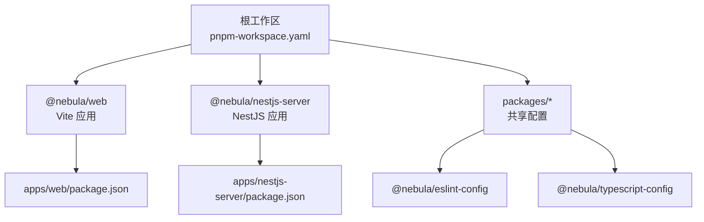
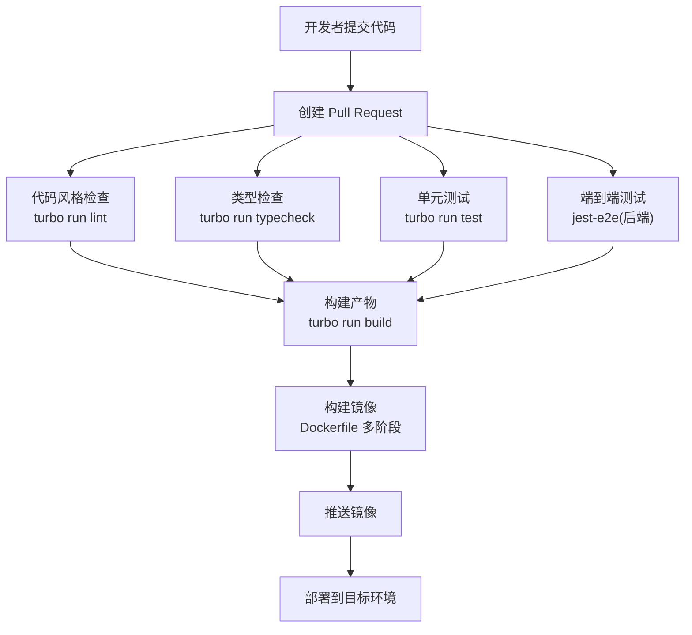
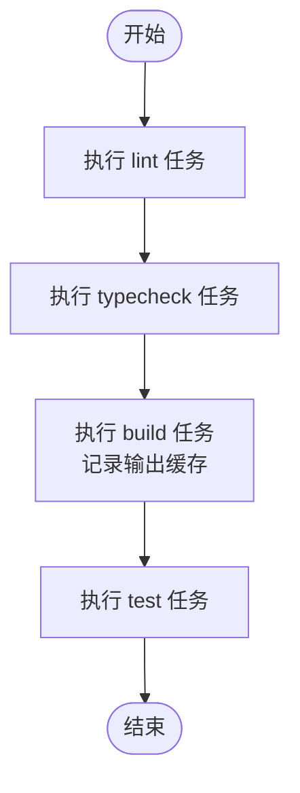
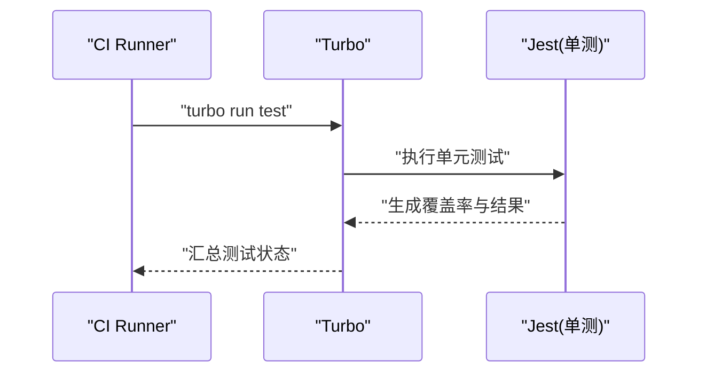
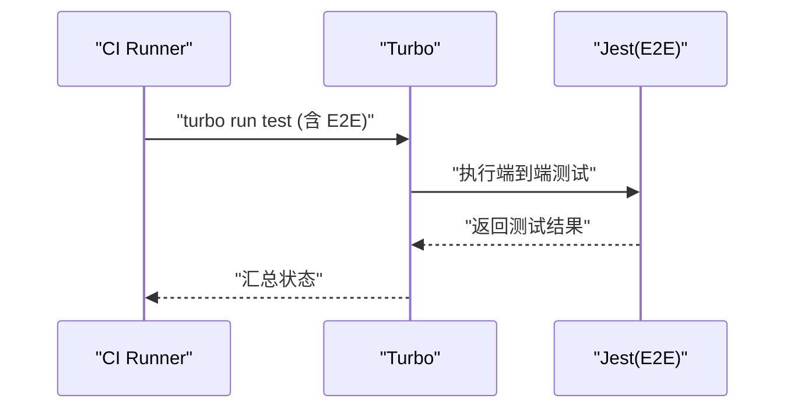
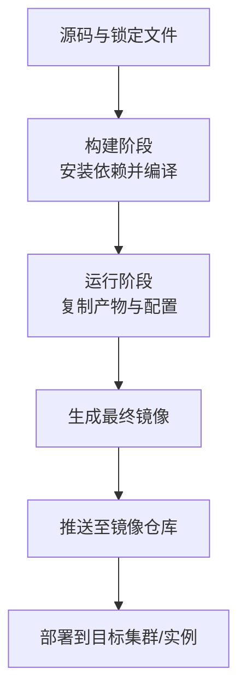
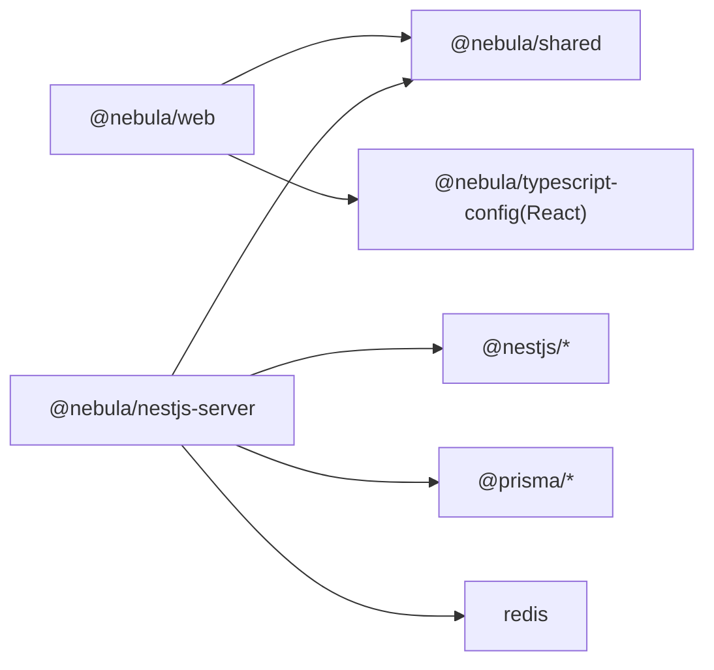

# CI/CD 流水线

<cite>
**本文引用的文件**
- [turbo.json](file://turbo.json)
- [package.json](file://package.json)
- [pnpm-workspace.yaml](file://pnpm-workspace.yaml)
- [apps/nestjs-server/package.json](file://apps/nestjs-server/package.json)
- [apps/web/package.json](file://apps/web/package.json)
- [apps/nestjs-server/Dockerfile](file://apps/nestjs-server/Dockerfile)
- [apps/nestjs-server/docker-compose.yml](file://apps/nestjs-server/docker-compose.yml)
- [apps/nestjs-server/jest.config.js](file://apps/nestjs-server/jest.config.js)
- [apps/nestjs-server/test/jest-e2e.json](file://apps/nestjs-server/test/jest-e2e.json)
- [apps/nestjs-server/tsconfig.json](file://apps/nestjs-server/tsconfig.json)
- [apps/web/vite.config.ts](file://apps/web/vite.config.ts)
- [apps/web/tsconfig.json](file://apps/web/tsconfig.json)
- [apps/nestjs-server/prisma.config.ts](file://apps/nestjs-server/prisma.config.ts)
- [apps/nestjs-server/nest-cli.json](file://apps/nestjs-server/nest-cli.json)
</cite>

## 目录
1. [简介](#简介)
2. [项目结构](#项目结构)
3. [核心组件](#核心组件)
4. [架构总览](#架构总览)
5. [详细组件分析](#详细组件分析)
6. [依赖关系分析](#依赖关系分析)
7. [性能考虑](#性能考虑)
8. [故障排查指南](#故障排查指南)
9. [结论](#结论)
10. [附录](#附录)

## 简介
本文件面向 CI/CD 流水线的完整配置与最佳实践，覆盖自动化构建、测试（单元、集成、端到端）、代码质量检查、容器镜像构建与部署、以及分支策略、版本发布与回滚建议。项目采用 pnpm 工作区与 Turbo 引擎进行多包管理与任务编排，前端使用 Vite，后端基于 NestJS，数据库与缓存通过 Docker Compose 进行本地与流水线环境准备。

## 项目结构
- monorepo 根目录通过 pnpm 工作区组织，包含两个应用与共享包：
  - apps/web：React/Vite 前端应用
  - apps/nestjs-server：NestJS 后端服务
  - packages：共享 ESLint 与 TypeScript 配置
- 根级脚本通过 Turbo 统一调度各子包任务，实现增量构建与缓存优化

**图表来源**
- [pnpm-workspace.yaml:1-12](file://pnpm-workspace.yaml#L1-L12)
- [apps/web/package.json:1-44](file://apps/web/package.json#L1-L44)
- [apps/nestjs-server/package.json:1-85](file://apps/nestjs-server/package.json#L1-L85)

**章节来源**
- [pnpm-workspace.yaml:1-12](file://pnpm-workspace.yaml#L1-L12)
- [package.json:1-22](file://package.json#L1-L22)

## 核心组件
- Turbo 任务编排
  - 任务定义：build、dev、lint、typecheck、test、clean
  - 依赖链：lint/typecheck 依赖上游构建；test 依赖 build；dev/persistent/clean 控制缓存与持久化
  - 输出缓存：前端 Next 输出目录、后端 dist 目录
- pnpm 工作区
  - 包含范围：apps/* 与 packages/*
  - 仅构建依赖：Prisma、Redis、SQLite 等二进制依赖在安装阶段被限制为仅构建
- 前端构建
  - Vite + React + TailwindCSS，开发代理指向后端 3000 端口
- 后端构建与测试
  - NestJS 编译与 Jest 单元测试，E2E 使用独立 jest 配置
- 容器化
  - 多阶段 Dockerfile：构建阶段安装依赖并编译，运行阶段仅复制产物与必要资源
  - docker-compose 提供数据库与缓存服务健康检查

**章节来源**
- [turbo.json:1-26](file://turbo.json#L1-L26)
- [pnpm-workspace.yaml:1-12](file://pnpm-workspace.yaml#L1-L12)
- [apps/web/vite.config.ts:1-23](file://apps/web/vite.config.ts#L1-L23)
- [apps/nestjs-server/Dockerfile:1-20](file://apps/nestjs-server/Dockerfile#L1-L20)
- [apps/nestjs-server/docker-compose.yml:1-54](file://apps/nestjs-server/docker-compose.yml#L1-L54)

## 架构总览
下图展示从代码提交到容器部署的关键路径，涵盖质量门禁、构建、测试与镜像推送：

**图表来源**
- [turbo.json:1-26](file://turbo.json#L1-L26)
- [apps/nestjs-server/jest.config.js:1-34](file://apps/nestjs-server/jest.config.js#L1-L34)
- [apps/nestjs-server/test/jest-e2e.json:1-10](file://apps/nestjs-server/test/jest-e2e.json#L1-L10)
- [apps/nestjs-server/Dockerfile:1-20](file://apps/nestjs-server/Dockerfile#L1-L20)

## 详细组件分析

### Turbo 构建系统与缓存策略
- 任务依赖
  - lint/typecheck 依赖上游包的 build，确保在下游构建前完成静态检查
  - test 依赖 build，保证测试在最新产物上执行
- 缓存与输出
  - build 任务声明输出目录，Turbo 将自动缓存这些产物，加速重复执行
  - dev 任务关闭缓存并启用持久化，适合本地开发
  - clean 关闭缓存，避免误用过期产物
- 调度方式
  - 根脚本通过 turbo run 调用各任务，支持按过滤器选择包（如 web 或 server）

**图表来源**
- [turbo.json:1-26](file://turbo.json#L1-L26)
- [package.json:5-15](file://package.json#L5-L15)

**章节来源**
- [turbo.json:1-26](file://turbo.json#L1-L26)
- [package.json:5-15](file://package.json#L5-L15)

### 代码质量检查（ESLint）
- 共享配置
  - packages 内置 @nebula/eslint-config，统一前端与后端规则
- 执行入口
  - 通过 turbo run lint 在根层统一调度
- 建议
  - 在 CI 中将 ESLint 作为质量门禁，失败即阻断合并

**章节来源**
- [apps/web/package.json:30-32](file://apps/web/package.json#L30-L32)
- [apps/nestjs-server/package.json:60-82](file://apps/nestjs-server/package.json#L60-L82)
- [package.json:10-10](file://package.json#L10-L10)

### 类型检查（TypeScript）
- 配置继承
  - 前端：apps/web/tsconfig.json 继承 @nebula/typescript-config/react.json
  - 后端：apps/nestjs-server/tsconfig.json 继承 @nebula/typescript-config/nestjs.json
- 执行入口
  - 通过 turbo run typecheck 在根层统一调度

**章节来源**
- [apps/web/tsconfig.json:1-15](file://apps/web/tsconfig.json#L1-L15)
- [apps/nestjs-server/tsconfig.json:1-16](file://apps/nestjs-server/tsconfig.json#L1-L16)
- [package.json:11-11](file://package.json#L11-L11)

### 单元测试（Jest）
- 配置要点
  - 单测覆盖率阈值：全局分支、函数、行、语句均不低于 80%
  - 自动引入测试前置脚本，模块别名映射
- 执行入口
  - apps/nestjs-server/package.json 中的 test 脚本由 Turbo 调用
- 建议
  - 在 CI 中开启覆盖率报告上传与阈值校验

**图表来源**
- [apps/nestjs-server/jest.config.js:1-34](file://apps/nestjs-server/jest.config.js#L1-L34)
- [apps/nestjs-server/package.json:20-24](file://apps/nestjs-server/package.json#L20-L24)
- [package.json:12-12](file://package.json#L12-L12)

**章节来源**
- [apps/nestjs-server/jest.config.js:1-34](file://apps/nestjs-server/jest.config.js#L1-L34)
- [apps/nestjs-server/package.json:20-24](file://apps/nestjs-server/package.json#L20-L24)
- [package.json:12-12](file://package.json#L12-L12)

### 端到端测试（E2E）
- 配置要点
  - 独立 jest-e2e.json，测试文件以 .e2e-spec.ts 结尾
  - 测试环境为 node，便于直接连接后端或数据库
- 执行入口
  - apps/nestjs-server/package.json 中的 test:e2e 脚本由 Turbo 调用
- 建议
  - 在 CI 中结合 docker-compose 提供的数据库与缓存服务，确保 E2E 可靠性

**图表来源**
- [apps/nestjs-server/test/jest-e2e.json:1-10](file://apps/nestjs-server/test/jest-e2e.json#L1-L10)
- [apps/nestjs-server/package.json:24-24](file://apps/nestjs-server/package.json#L24-L24)
- [package.json:12-12](file://package.json#L12-L12)

**章节来源**
- [apps/nestjs-server/test/jest-e2e.json:1-10](file://apps/nestjs-server/test/jest-e2e.json#L1-L10)
- [apps/nestjs-server/package.json:24-24](file://apps/nestjs-server/package.json#L24-L24)
- [package.json:12-12](file://package.json#L12-L12)

### 容器镜像构建、推送与部署
- 多阶段 Dockerfile
  - 构建阶段：启用 Corepack 与 pnpm，安装依赖并编译
  - 运行阶段：仅复制 dist、prisma 配置与迁移文件，安装生产依赖
- docker-compose
  - 提供数据库与 Redis 的健康检查，便于本地与 CI 环境快速拉起依赖
- 推荐流程
  - 在 CI 中构建镜像并推送到镜像仓库，随后触发部署（Kubernetes/Helm/平台托管服务等）

**图表来源**
- [apps/nestjs-server/Dockerfile:1-20](file://apps/nestjs-server/Dockerfile#L1-L20)
- [apps/nestjs-server/docker-compose.yml:1-54](file://apps/nestjs-server/docker-compose.yml#L1-L54)

**章节来源**
- [apps/nestjs-server/Dockerfile:1-20](file://apps/nestjs-server/Dockerfile#L1-L20)
- [apps/nestjs-server/docker-compose.yml:1-54](file://apps/nestjs-server/docker-compose.yml#L1-L54)

### 数据库与 Prisma 配置
- Prisma 配置
  - schema 与 migrations 目录分离，种子脚本通过 ts-node 执行
  - 数据源 URL 来自环境变量，便于在不同环境切换
- NestJS CLI
  - 指定源码目录与编译输出清理策略

**章节来源**
- [apps/nestjs-server/prisma.config.ts:1-14](file://apps/nestjs-server/prisma.config.ts#L1-L14)
- [apps/nestjs-server/nest-cli.json:1-9](file://apps/nestjs-server/nest-cli.json#L1-L9)

## 依赖关系分析
- 包间依赖
  - apps/web 依赖 @nebula/shared 与 @nebula/typescript-config
  - apps/nestjs-server 依赖 @nestjs/*、Prisma、Redis 等，并依赖 @nebula/shared
- 工作区与安装策略
  - pnpm-workspace.yaml 指定包范围
  - onlyBuiltDependencies 限定二进制依赖仅在构建时安装，减少运行时体积与安全风险

**图表来源**
- [pnpm-workspace.yaml:1-12](file://pnpm-workspace.yaml#L1-L12)
- [apps/web/package.json:14-29](file://apps/web/package.json#L14-L29)
- [apps/nestjs-server/package.json:26-58](file://apps/nestjs-server/package.json#L26-L58)

**章节来源**
- [pnpm-workspace.yaml:1-12](file://pnpm-workspace.yaml#L1-L12)
- [apps/web/package.json:14-29](file://apps/web/package.json#L14-L29)
- [apps/nestjs-server/package.json:26-58](file://apps/nestjs-server/package.json#L26-L58)

## 性能考虑
- Turbo 缓存
  - 正确声明 build 输出目录，可显著缩短重复构建时间
  - dev 关闭缓存并持久化，提升开发体验
- pnpm 安装优化
  - onlyBuiltDependencies 减少运行时安装的二进制依赖数量
- Docker 层缓存
  - 保持依赖安装与源码复制顺序，利用镜像层缓存
- 测试并行
  - 在 CI 中并行执行 lint、typecheck、unit 与 e2e，缩短总耗时

## 故障排查指南
- 构建失败
  - 检查 Turbo 任务依赖是否正确（lint/typecheck 依赖 build）
  - 确认输出目录声明与实际产物一致
- 测试失败
  - 单测覆盖率未达标：提升测试用例或调整阈值
  - E2E 依赖不可用：确认 docker-compose 服务健康与网络连通
- 容器启动异常
  - 确认运行阶段仅复制 dist 与必要配置文件
  - 检查环境变量（数据库 URL、Redis 地址、JWT 密钥）是否正确
- 本地联调
  - 前端代理已配置到后端 3000 端口，确保后端服务可用

**章节来源**
- [turbo.json:1-26](file://turbo.json#L1-L26)
- [apps/nestjs-server/jest.config.js:17-24](file://apps/nestjs-server/jest.config.js#L17-L24)
- [apps/nestjs-server/docker-compose.yml:6-21](file://apps/nestjs-server/docker-compose.yml#L6-L21)
- [apps/web/vite.config.ts:13-21](file://apps/web/vite.config.ts#L13-L21)

## 结论
本方案以 Turbo 为核心统一调度多包任务，结合 pnpm 工作区与 Docker 多阶段构建，形成从质量门禁、构建测试到容器部署的闭环。建议在 CI 中严格执行 lint/typecheck/test/e2e，并通过 docker-compose 快速拉起依赖服务，最终完成镜像构建与部署。

## 附录

### 分支策略与版本发布建议
- 分支模型
  - develop：日常集成分支
  - release/x.y：预发布分支，冻结功能并进行回归测试
  - hotfix/x.y.z：紧急修复分支，快速回滚并打补丁标签
- 版本号
  - 采用语义化版本：主版本.次版本.修订号
  - 发布前在 release 分支打 tag，触发 CI 构建镜像并部署
- 回滚机制
  - 保留最近若干镜像版本，支持一键回滚
  - 回滚时同步回滚数据库迁移（谨慎操作）

### CI 平台工作流配置要点（概念性）
- 触发条件
  - push 到 develop/release/* 与 main
  - pull_request 到 develop/main
- 步骤建议
  - 安装 pnpm 与 Corepack
  - 还原依赖（使用 pnpm-workspace.yaml）
  - 代码质量：lint、typecheck
  - 测试：unit、e2e（配合 docker-compose）
  - 构建：turbo run build
  - 构建镜像并推送
  - 部署（Kubernetes/Helm/平台托管服务）
- 缓存策略
  - 缓存 pnpm store 与 Turbo cache 目录
  - 避免缓存 dev 与 clean 任务