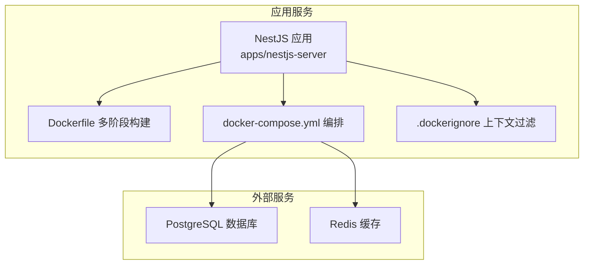
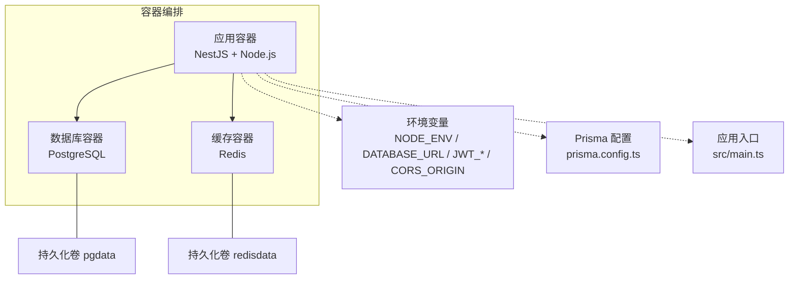
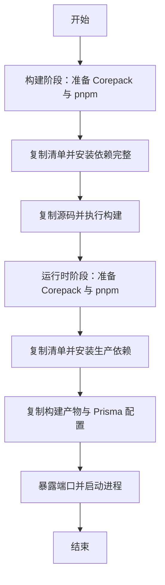
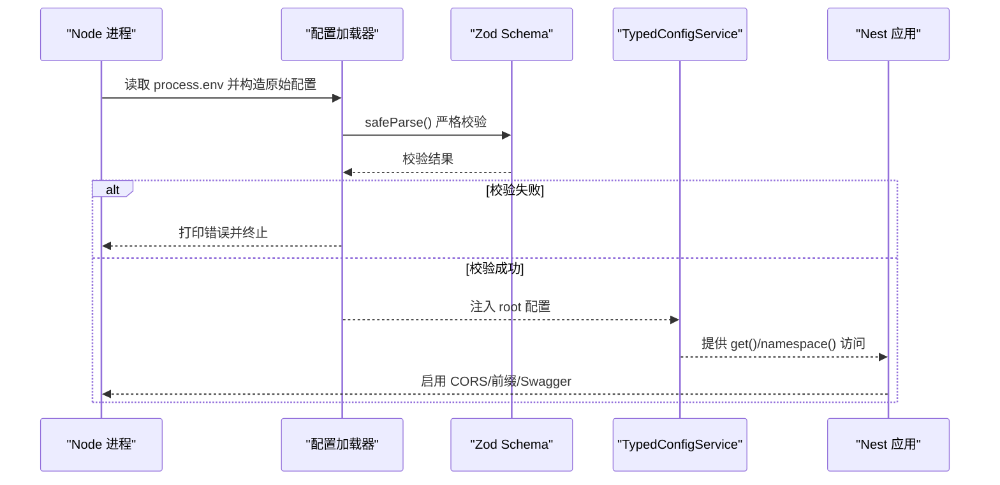
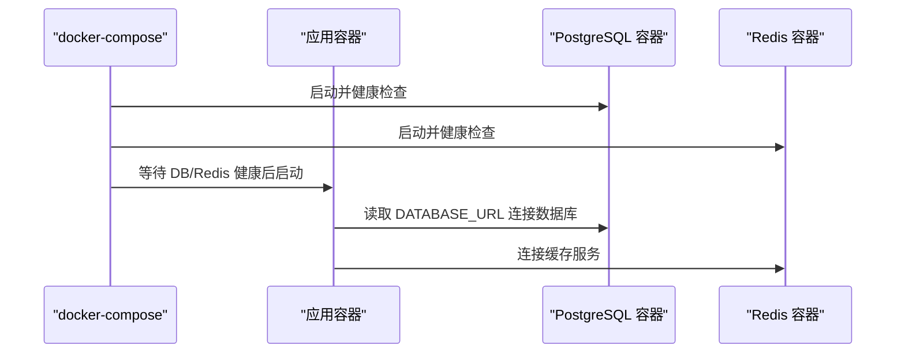
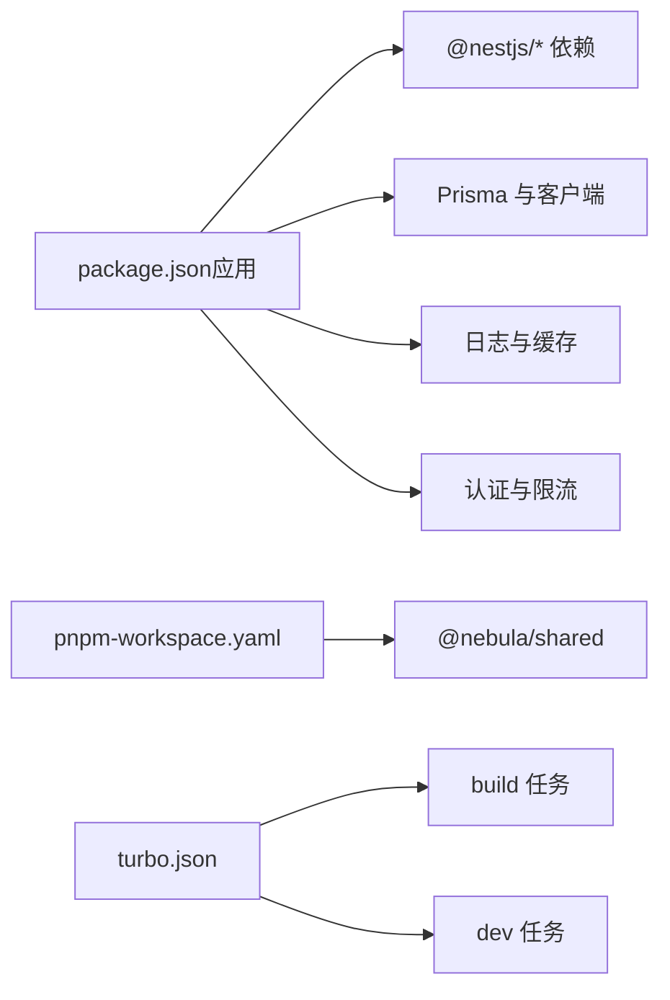

# 容器化部署

<cite>
**本文引用的文件**
- [apps/nestjs-server/Dockerfile](file://apps/nestjs-server/Dockerfile)
- [apps/nestjs-server/docker-compose.yml](file://apps/nestjs-server/docker-compose.yml)
- [apps/nestjs-server/.dockerignore](file://apps/nestjs-server/.dockerignore)
- [apps/nestjs-server/package.json](file://apps/nestjs-server/package.json)
- [apps/nestjs-server/prisma.config.ts](file://apps/nestjs-server/prisma.config.ts)
- [apps/nestjs-server/src/main.ts](file://apps/nestjs-server/src/main.ts)
- [apps/nestjs-server/src/config/config-loader.ts](file://apps/nestjs-server/src/config/config-loader.ts)
- [apps/nestjs-server/src/config/typed-config.service.ts](file://apps/nestjs-server/src/config/typed-config.service.ts)
- [apps/nestjs-server/src/config/schemas/root.schema.ts](file://apps/nestjs-server/src/config/schemas/root.schema.ts)
- [apps/nestjs-server/src/config/schemas/app.schema.ts](file://apps/nestjs-server/src/config/schemas/app.schema.ts)
- [apps/nestjs-server/src/config/schemas/database.schema.ts](file://apps/nestjs-server/src/config/schemas/database.schema.ts)
- [apps/nestjs-server/src/config/schemas/jwt.schema.ts](file://apps/nestjs-server/src/config/schemas/jwt.schema.ts)
- [apps/nestjs-server/src/config/types.ts](file://apps/nestjs-server/src/config/types.ts)
- [package.json](file://package.json)
- [pnpm-workspace.yaml](file://pnpm-workspace.yaml)
- [turbo.json](file://turbo.json)
</cite>

## 目录

1. [简介](#简介)
2. [项目结构](#项目结构)
3. [核心组件](#核心组件)
4. [架构总览](#架构总览)
5. [详细组件分析](#详细组件分析)
6. [依赖关系分析](#依赖关系分析)
7. [性能考虑](#性能考虑)
8. [故障排除指南](#故障排除指南)
9. [结论](#结论)
10. [附录](#附录)

## 简介

本文件面向需要在生产环境中以容器方式部署 NestJS 应用的工程团队，系统性说明基于 Docker 多阶段构建的镜像制作流程、Node.js 运行时与包管理器配置、依赖安装策略、镜像优化与安全实践、容器启动参数、端口映射与卷挂载策略，并提供调试与排障建议。文档中的所有技术细节均来自仓库现有实现，确保可操作与可验证。

## 项目结构

本仓库采用 monorepo 架构，应用位于 apps/nestjs-server，其容器化相关的关键文件包括：

- Dockerfile：定义多阶段构建（构建阶段与运行时阶段），启用 Corepack 并使用 pnpm
- docker-compose.yml：编排应用、数据库与缓存服务，声明环境变量与健康检查
- .dockerignore：控制构建上下文与缓存层的复制范围
- package.json（应用级）：定义构建脚本与依赖
- pnpm-workspace.yaml：声明工作区与仅构建依赖列表
- turbo.json：统一的任务编排与缓存策略

图表来源

- [apps/nestjs-server/Dockerfile:1-20](file://apps/nestjs-server/Dockerfile#L1-L20)
- [apps/nestjs-server/docker-compose.yml:1-54](file://apps/nestjs-server/docker-compose.yml#L1-L54)

章节来源

- [apps/nestjs-server/Dockerfile:1-20](file://apps/nestjs-server/Dockerfile#L1-L20)
- [apps/nestjs-server/docker-compose.yml:1-54](file://apps/nestjs-server/docker-compose.yml#L1-L54)
- [apps/nestjs-server/.dockerignore:1-8](file://apps/nestjs-server/.dockerignore#L1-L8)
- [apps/nestjs-server/package.json:1-85](file://apps/nestjs-server/package.json#L1-L85)
- [pnpm-workspace.yaml:1-12](file://pnpm-workspace.yaml#L1-L12)
- [turbo.json:1-26](file://turbo.json#L1-L26)

## 核心组件

- 多阶段 Dockerfile：构建阶段安装 pnpm 并执行完整构建；运行时阶段仅安装生产依赖并复制构建产物，最小化运行时镜像体积
- Corepack 与 pnpm：通过 Corepack 启用并激活 pnpm，确保包管理器版本与仓库一致
- Monorepo 工作区：使用 pnpm-workspace.yaml 声明包范围与仅构建依赖，减少不必要的二进制安装
- 配置加载与校验：通过自定义配置加载器与 Zod Schema 在启动前完成严格校验，失败即阻断启动
- 编排与健康检查：compose 文件定义数据库与缓存服务的健康检查，确保应用启动顺序与可用性

章节来源

- [apps/nestjs-server/Dockerfile:1-20](file://apps/nestjs-server/Dockerfile#L1-L20)
- [apps/nestjs-server/package.json:1-85](file://apps/nestjs-server/package.json#L1-L85)
- [pnpm-workspace.yaml:1-12](file://pnpm-workspace.yaml#L1-L12)
- [apps/nestjs-server/src/config/config-loader.ts:1-60](file://apps/nestjs-server/src/config/config-loader.ts#L1-L60)
- [apps/nestjs-server/src/config/schemas/root.schema.ts:1-23](file://apps/nestjs-server/src/config/schemas/root.schema.ts#L1-L23)
- [apps/nestjs-server/docker-compose.yml:1-54](file://apps/nestjs-server/docker-compose.yml#L1-L54)

## 架构总览

容器化部署的整体架构由“应用容器 + 数据库容器 + 缓存容器”组成，应用通过环境变量与 Prisma 配置连接数据库，通过 Swagger 模块提供接口文档（受配置开关控制）。

图表来源

- [apps/nestjs-server/docker-compose.yml:1-54](file://apps/nestjs-server/docker-compose.yml#L1-L54)
- [apps/nestjs-server/prisma.config.ts:1-14](file://apps/nestjs-server/prisma.config.ts#L1-L14)
- [apps/nestjs-server/src/main.ts:1-47](file://apps/nestjs-server/src/main.ts#L1-L47)

## 详细组件分析

### Docker 多阶段构建流程

- 构建阶段（build）：基于 node:22-alpine，启用 Corepack 并准备 pnpm，复制 pnpm 相关清单后以只读锁文件安装依赖，随后复制源码并执行构建
- 运行时阶段（runtime）：同样基于 node:22-alpine，启用 Corepack 与 pnpm，但仅安装生产依赖，复制构建产物与 Prisma 相关文件，暴露 3000 端口并以 Node 直接运行主入口

图表来源

- [apps/nestjs-server/Dockerfile:1-20](file://apps/nestjs-server/Dockerfile#L1-L20)

章节来源

- [apps/nestjs-server/Dockerfile:1-20](file://apps/nestjs-server/Dockerfile#L1-L20)

### Corepack 与 pnpm 配置

- Corepack 启用与激活：在两个阶段均执行 Corepack 指令，确保 pnpm 版本与仓库一致
- pnpm 工作区：通过 pnpm-workspace.yaml 声明包范围，结合 onlyBuiltDependencies 列表，仅对必要包进行原生二进制构建，降低安装复杂度与镜像体积
- 顶层 package.json 指定 packageManager 为 pnpm，保证本地开发一致性

章节来源

- [apps/nestjs-server/Dockerfile:3-11](file://apps/nestjs-server/Dockerfile#L3-L11)
- [pnpm-workspace.yaml:1-12](file://pnpm-workspace.yaml#L1-L12)
- [package.json:20-20](file://package.json#L20-L20)

### 依赖管理与安装策略

- 构建阶段：使用只读锁文件安装完整依赖，确保构建可复现
- 运行时阶段：仅安装生产依赖，避免开发依赖进入运行时镜像
- 仅构建依赖：通过工作区配置限定需要原生编译的包，减少二进制安装与体积

章节来源

- [apps/nestjs-server/Dockerfile:5-13](file://apps/nestjs-server/Dockerfile#L5-L13)
- [pnpm-workspace.yaml:5-11](file://pnpm-workspace.yaml#L5-L11)

### 运行时配置加载与校验

- 配置加载器：从 process.env 构造分层配置对象，使用 Zod Schema 进行严格校验与类型转换
- 根 Schema：聚合 app、database、jwt、logger、redis 等命名空间
- 类型安全：TypedConfigService 提供点语法访问与命名空间读取，缺失根配置时直接退出进程
- 应用入口：根据配置启用 CORS、全局前缀与 Swagger 文档（受开关控制）

图表来源

- [apps/nestjs-server/src/config/config-loader.ts:1-60](file://apps/nestjs-server/src/config/config-loader.ts#L1-L60)
- [apps/nestjs-server/src/config/typed-config.service.ts:1-46](file://apps/nestjs-server/src/config/typed-config.service.ts#L1-L46)
- [apps/nestjs-server/src/config/schemas/root.schema.ts:1-23](file://apps/nestjs-server/src/config/schemas/root.schema.ts#L1-L23)
- [apps/nestjs-server/src/main.ts:1-47](file://apps/nestjs-server/src/main.ts#L1-L47)

章节来源

- [apps/nestjs-server/src/config/config-loader.ts:1-60](file://apps/nestjs-server/src/config/config-loader.ts#L1-L60)
- [apps/nestjs-server/src/config/typed-config.service.ts:1-46](file://apps/nestjs-server/src/config/typed-config.service.ts#L1-L46)
- [apps/nestjs-server/src/config/schemas/root.schema.ts:1-23](file://apps/nestjs-server/src/config/schemas/root.schema.ts#L1-L23)
- [apps/nestjs-server/src/config/schemas/app.schema.ts:1-12](file://apps/nestjs-server/src/config/schemas/app.schema.ts#L1-L12)
- [apps/nestjs-server/src/config/schemas/database.schema.ts:1-11](file://apps/nestjs-server/src/config/schemas/database.schema.ts#L1-L11)
- [apps/nestjs-server/src/config/schemas/jwt.schema.ts:1-11](file://apps/nestjs-server/src/config/schemas/jwt.schema.ts#L1-L11)
- [apps/nestjs-server/src/config/types.ts:1-29](file://apps/nestjs-server/src/config/types.ts#L1-L29)
- [apps/nestjs-server/src/main.ts:1-47](file://apps/nestjs-server/src/main.ts#L1-L47)

### 编排与服务发现

- 应用服务：映射宿主 3000 端口到容器 3000，注入环境变量（数据库、缓存、JWT、CORS 等），等待数据库与缓存健康
- 数据库服务：PostgreSQL 17，持久化卷 pgdata，健康检查基于 pg_isready
- 缓存服务：Redis 7，持久化卷 redisdata，健康检查基于 redis-cli ping

图表来源

- [apps/nestjs-server/docker-compose.yml:1-54](file://apps/nestjs-server/docker-compose.yml#L1-L54)

章节来源

- [apps/nestjs-server/docker-compose.yml:1-54](file://apps/nestjs-server/docker-compose.yml#L1-L54)

### 镜像优化与安全最佳实践

- 最小化镜像：运行时阶段仅复制生产依赖与构建产物，不包含开发工具链
- 仅构建依赖：通过工作区配置限定原生二进制安装范围，减少体积与攻击面
- 上下文过滤：.dockerignore 排除 node_modules、dist、覆盖率等目录，避免无谓复制
- Corepack 固定包管理器版本：确保构建一致性，避免不同 pnpm 版本导致的差异
- 环境变量校验：启动前严格校验关键配置（如 JWT 密钥长度、数据库 URL 等），失败即停机，避免静默错误

章节来源

- [apps/nestjs-server/Dockerfile:1-20](file://apps/nestjs-server/Dockerfile#L1-L20)
- [apps/nestjs-server/.dockerignore:1-8](file://apps/nestjs-server/.dockerignore#L1-L8)
- [pnpm-workspace.yaml:5-11](file://pnpm-workspace.yaml#L5-L11)
- [apps/nestjs-server/src/config/config-loader.ts:46-53](file://apps/nestjs-server/src/config/config-loader.ts#L46-L53)

### 容器启动参数、端口映射与卷挂载

- 端口映射：宿主 3000:3000，便于本地访问与调试
- 环境变量：NODE*ENV、DATABASE_PROVIDER、DATABASE_URL、REDIS*_、JWT\__、CORS_ORIGIN 等
- 卷挂载：PostgreSQL 数据目录与 Redis 数据目录分别挂载至 pgdata 与 redisdata，保障数据持久化
- 健康检查：数据库与缓存服务均配置健康检查，确保应用启动前依赖可用

章节来源

- [apps/nestjs-server/docker-compose.yml:4-16](file://apps/nestjs-server/docker-compose.yml#L4-L16)
- [apps/nestjs-server/docker-compose.yml:23-49](file://apps/nestjs-server/docker-compose.yml#L23-L49)

### 调试技巧与故障排除

- 启动失败排查：配置加载器会在校验失败时输出详细错误并终止进程，优先检查环境变量是否满足 Zod 校验规则
- 日志与可观测性：应用入口注入自定义日志工厂，可通过配置调整日志级别与输出位置
- Swagger 文档：受开关控制，可在开发或测试环境开启以便联调
- 数据库连接：确认 DATABASE_URL 与 Prisma 配置一致，Compose 中数据库服务已健康后再启动应用
- 缓存连通性：确认 REDIS_HOST/PORT 可达，必要时临时关闭缓存功能以定位问题

章节来源

- [apps/nestjs-server/src/config/config-loader.ts:46-53](file://apps/nestjs-server/src/config/config-loader.ts#L46-L53)
- [apps/nestjs-server/src/main.ts:14-33](file://apps/nestjs-server/src/main.ts#L14-L33)
- [apps/nestjs-server/prisma.config.ts:10-13](file://apps/nestjs-server/prisma.config.ts#L10-L13)
- [apps/nestjs-server/docker-compose.yml:17-21](file://apps/nestjs-server/docker-compose.yml#L17-L21)

## 依赖关系分析

- 应用依赖：NestJS 核心模块、Prisma 客户端、缓存与日志、认证与限流等
- Monorepo 依赖：共享包通过 workspace:\* 引用，避免重复打包
- Turbo 任务：统一构建、测试、类型检查与清理任务，提升多包协作效率

图表来源

- [apps/nestjs-server/package.json:26-58](file://apps/nestjs-server/package.json#L26-L58)
- [pnpm-workspace.yaml:1-3](file://pnpm-workspace.yaml#L1-L3)
- [turbo.json:3-24](file://turbo.json#L3-L24)

章节来源

- [apps/nestjs-server/package.json:1-85](file://apps/nestjs-server/package.json#L1-L85)
- [pnpm-workspace.yaml:1-12](file://pnpm-workspace.yaml#L1-L12)
- [turbo.json:1-26](file://turbo.json#L1-L26)

## 性能考虑

- 多阶段构建：分离构建与运行时，显著减小最终镜像体积
- 仅构建依赖：减少原生二进制安装数量，缩短构建时间并降低镜像大小
- 缓存利用：pnpm 与 Docker 层缓存配合，增量构建更快
- 运行时精简：移除开发依赖与源码，仅保留运行所需文件

## 故障排除指南

- 环境变量校验失败：检查各命名空间字段（应用、数据库、JWT、日志、Redis）是否符合 Zod 规则
- 数据库不可达：确认 DATABASE_URL 与网络连通性，查看数据库健康检查状态
- 缓存不可用：确认 Redis 主机与端口，必要时临时禁用缓存定位问题
- Swagger 未生效：确认开关变量与全局前缀配置
- 构建失败：核对 pnpm 锁文件与 Corepack 激活状态，确保版本一致

章节来源

- [apps/nestjs-server/src/config/config-loader.ts:46-53](file://apps/nestjs-server/src/config/config-loader.ts#L46-L53)
- [apps/nestjs-server/src/config/schemas/root.schema.ts:11-17](file://apps/nestjs-server/src/config/schemas/root.schema.ts#L11-L17)
- [apps/nestjs-server/docker-compose.yml:23-49](file://apps/nestjs-server/docker-compose.yml#L23-L49)

## 结论

该容器化方案通过多阶段构建与 Corepack/pnpm 配置实现了可复现、体积小、安全性高的运行时镜像；结合严格的环境变量校验与健康检查编排，能够在生产环境中稳定运行。建议在生产部署中进一步强化密钥管理、网络隔离与资源配额，持续监控日志与指标以保障稳定性。

## 附录

- 关键配置项速查
  - 应用：端口、API 前缀、CORS、Swagger 开关
  - 数据库：提供者、URL、最大连接数、日志开关
  - JWT：密钥与 TTL（访问与刷新）
  - Redis：主机、端口、密码、DB、Key 前缀
- 建议的安全加固
  - 使用只读根文件系统与非 root 用户（需在 Dockerfile 中扩展）
  - 限制 CPU/内存资源配额（Compose 中添加 deploy 或 docker run 参数）
  - 使用 Docker secrets 管理敏感环境变量
  - 启用 HTTPS 与反向代理（在上游网关层实施）
