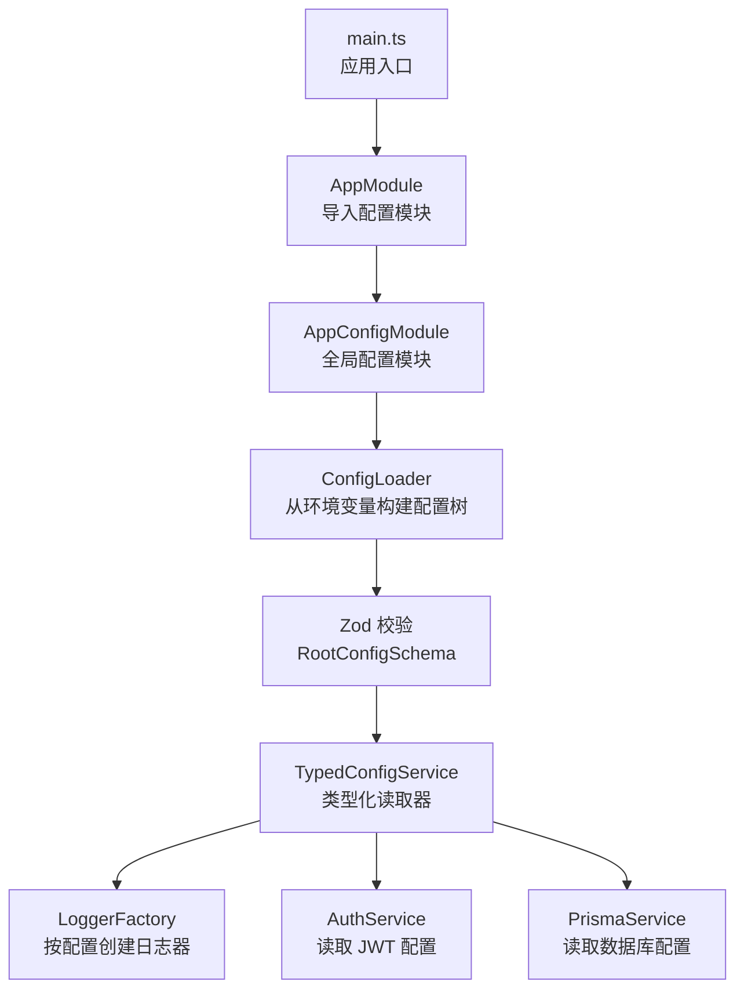
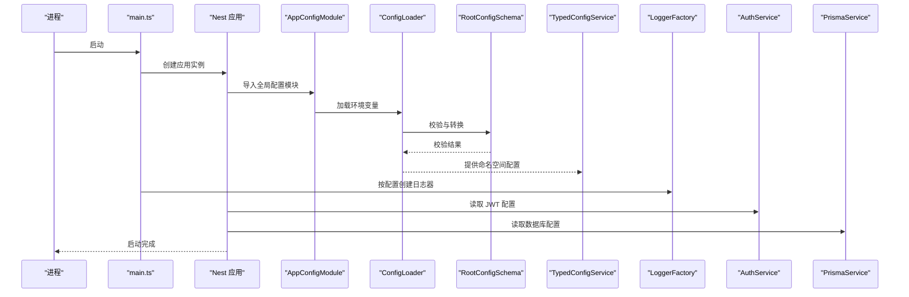
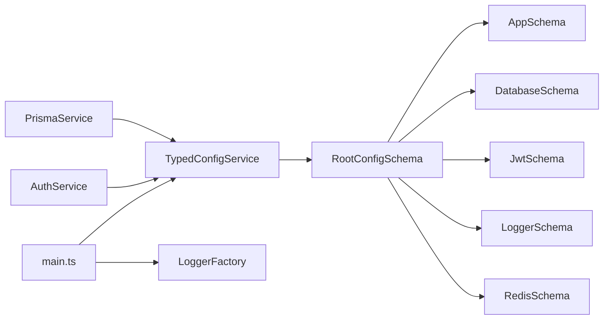

# 环境配置

<cite>
**本文引用的文件**
- [apps/nestjs-server/src/config/config.module.ts](file://apps/nestjs-server/src/config/config.module.ts)
- [apps/nestjs-server/src/config/config-loader.ts](file://apps/nestjs-server/src/config/config-loader.ts)
- [apps/nestjs-server/src/config/typed-config.service.ts](file://apps/nestjs-server/src/config/typed-config.service.ts)
- [apps/nestjs-server/src/config/types.ts](file://apps/nestjs-server/src/config/types.ts)
- [apps/nestjs-server/src/config/schemas/root.schema.ts](file://apps/nestjs-server/src/config/schemas/root.schema.ts)
- [apps/nestjs-server/src/config/schemas/app.schema.ts](file://apps/nestjs-server/src/config/schemas/app.schema.ts)
- [apps/nestjs-server/src/config/schemas/database.schema.ts](file://apps/nestjs-server/src/config/schemas/database.schema.ts)
- [apps/nestjs-server/src/config/schemas/jwt.schema.ts](file://apps/nestjs-server/src/config/schemas/jwt.schema.ts)
- [apps/nestjs-server/src/config/schemas/logger.schema.ts](file://apps/nestjs-server/src/config/schemas/logger.schema.ts)
- [apps/nestjs-server/src/config/schemas/redis.schema.ts](file://apps/nestjs-server/src/config/schemas/redis.schema.ts)
- [apps/nestjs-server/src/common/constants/log-level.constants.ts](file://apps/nestjs-server/src/common/constants/log-level.constants.ts)
- [apps/nestjs-server/src/modules/logger/logger.factory.ts](file://apps/nestjs-server/src/modules/logger/logger.factory.ts)
- [apps/nestjs-server/src/modules/auth/auth.service.ts](file://apps/nestjs-server/src/modules/auth/auth.service.ts)
- [apps/nestjs-server/src/prisma/prisma.service.ts](file://apps/nestjs-server/src/prisma/prisma.service.ts)
- [apps/nestjs-server/src/main.ts](file://apps/nestjs-server/src/main.ts)
- [apps/nestjs-server/docker-compose.yml](file://apps/nestjs-server/docker-compose.yml)
- [apps/nestjs-server/package.json](file://apps/nestjs-server/package.json)
</cite>

## 目录

1. [简介](#简介)
2. [项目结构](#项目结构)
3. [核心组件](#核心组件)
4. [架构总览](#架构总览)
5. [详细组件分析](#详细组件分析)
6. [依赖关系分析](#依赖关系分析)
7. [性能考量](#性能考量)
8. [故障排查指南](#故障排查指南)
9. [结论](#结论)
10. [附录](#附录)

## 简介

本文件面向生产环境，系统性梳理应用在不同部署阶段（开发、测试、生产）所需的配置项与最佳实践，涵盖应用配置、数据库连接、JWT 令牌、日志系统、缓存与限流、以及环境变量的安全管理、配置文件版本控制与敏感信息保护策略。同时给出配置验证、启动流程、以及可选的热重载与动态更新思路。

## 项目结构

- 配置体系位于后端服务的应用目录内，采用“命名空间聚合 + 运行时严格校验”的设计，通过全局注册的配置模块向全应用提供类型安全的配置读取能力。
- 关键位置：
  - 配置模块与加载器：apps/nestjs-server/src/config
  - 应用入口与日志初始化：apps/nestjs-server/src/main.ts
  - 日志工厂：apps/nestjs-server/src/modules/logger/logger.factory.ts
  - 认证与令牌生成：apps/nestjs-server/src/modules/auth/auth.service.ts
  - 数据库客户端：apps/nestjs-server/src/prisma/prisma.service.ts
  - Docker Compose 示例：apps/nestjs-server/docker-compose.yml

图表来源

- [apps/nestjs-server/src/main.ts:1-47](file://apps/nestjs-server/src/main.ts#L1-L47)
- [apps/nestjs-server/src/app.module.ts:1-63](file://apps/nestjs-server/src/app.module.ts#L1-L63)
- [apps/nestjs-server/src/config/config.module.ts:1-20](file://apps/nestjs-server/src/config/config.module.ts#L1-L20)
- [apps/nestjs-server/src/config/config-loader.ts:1-60](file://apps/nestjs-server/src/config/config-loader.ts#L1-L60)
- [apps/nestjs-server/src/config/schemas/root.schema.ts:1-23](file://apps/nestjs-server/src/config/schemas/root.schema.ts#L1-L23)
- [apps/nestjs-server/src/config/typed-config.service.ts:1-46](file://apps/nestjs-server/src/config/typed-config.service.ts#L1-L46)
- [apps/nestjs-server/src/modules/logger/logger.factory.ts:1-127](file://apps/nestjs-server/src/modules/logger/logger.factory.ts#L1-L127)
- [apps/nestjs-server/src/modules/auth/auth.service.ts:1-151](file://apps/nestjs-server/src/modules/auth/auth.service.ts#L1-L151)
- [apps/nestjs-server/src/prisma/prisma.service.ts:1-36](file://apps/nestjs-server/src/prisma/prisma.service.ts#L1-L36)

章节来源

- [apps/nestjs-server/src/config/config.module.ts:1-20](file://apps/nestjs-server/src/config/config.module.ts#L1-L20)
- [apps/nestjs-server/src/config/config-loader.ts:1-60](file://apps/nestjs-server/src/config/config-loader.ts#L1-L60)
- [apps/nestjs-server/src/config/schemas/root.schema.ts:1-23](file://apps/nestjs-server/src/config/schemas/root.schema.ts#L1-L23)
- [apps/nestjs-server/src/config/typed-config.service.ts:1-46](file://apps/nestjs-server/src/config/typed-config.service.ts#L1-L46)

## 核心组件

- 全局配置模块：以全局方式注册 NestJS 配置模块，并通过自定义加载器一次性读取并校验全部环境变量，输出统一的命名空间配置树。
- 类型化配置服务：提供基于点语法的类型安全读取与命名空间读取能力，缺失根配置时会阻断启动，确保运行前发现配置问题。
- 分层 Schema 校验：使用 Zod 对各命名空间进行强约束，自动完成字符串到数字、布尔、枚举等类型的转换与默认值填充。
- 日志工厂：依据配置决定是否启用文件日志、日志级别、轮转大小与保留天数等，结合着色格式化输出。
- 认证与令牌：从配置读取密钥与过期时间，生成访问令牌与刷新令牌，并对刷新令牌进行安全哈希存储。
- 数据库适配：根据配置选择 SQLite 或 PostgreSQL，SQLite 使用 Better-SQLite3 适配器，PostgreSQL 由 Prisma 在外部配置中指定数据源。

章节来源

- [apps/nestjs-server/src/config/config.module.ts:1-20](file://apps/nestjs-server/src/config/config.module.ts#L1-L20)
- [apps/nestjs-server/src/config/typed-config.service.ts:1-46](file://apps/nestjs-server/src/config/typed-config.service.ts#L1-L46)
- [apps/nestjs-server/src/config/schemas/root.schema.ts:1-23](file://apps/nestjs-server/src/config/schemas/root.schema.ts#L1-L23)
- [apps/nestjs-server/src/modules/logger/logger.factory.ts:1-127](file://apps/nestjs-server/src/modules/logger/logger.factory.ts#L1-L127)
- [apps/nestjs-server/src/modules/auth/auth.service.ts:1-151](file://apps/nestjs-server/src/modules/auth/auth.service.ts#L1-L151)
- [apps/nestjs-server/src/prisma/prisma.service.ts:1-36](file://apps/nestjs-server/src/prisma/prisma.service.ts#L1-L36)

## 架构总览

下图展示从进程启动到配置生效的关键交互：

图表来源

- [apps/nestjs-server/src/main.ts:1-47](file://apps/nestjs-server/src/main.ts#L1-L47)
- [apps/nestjs-server/src/config/config.module.ts:1-20](file://apps/nestjs-server/src/config/config.module.ts#L1-L20)
- [apps/nestjs-server/src/config/config-loader.ts:1-60](file://apps/nestjs-server/src/config/config-loader.ts#L1-L60)
- [apps/nestjs-server/src/config/schemas/root.schema.ts:1-23](file://apps/nestjs-server/src/config/schemas/root.schema.ts#L1-L23)
- [apps/nestjs-server/src/config/typed-config.service.ts:1-46](file://apps/nestjs-server/src/config/typed-config.service.ts#L1-L46)
- [apps/nestjs-server/src/modules/logger/logger.factory.ts:1-127](file://apps/nestjs-server/src/modules/logger/logger.factory.ts#L1-L127)
- [apps/nestjs-server/src/modules/auth/auth.service.ts:1-151](file://apps/nestjs-server/src/modules/auth/auth.service.ts#L1-L151)
- [apps/nestjs-server/src/prisma/prisma.service.ts:1-36](file://apps/nestjs-server/src/prisma/prisma.service.ts#L1-L36)

## 详细组件分析

### 应用配置（App）

- 关键项
  - 运行环境：development / production / test
  - 端口：默认 3000
  - API 前缀：默认 api/v1
  - CORS 来源：默认 \*
  - Swagger 开关：默认开启
- 生产建议
  - 固定端口与前缀，避免动态变更导致网关映射复杂化
  - 生产关闭 Swagger，或仅在受限网络开放
  - 明确 CORS 白名单，避免通配符带来的跨域风险

章节来源

- [apps/nestjs-server/src/config/schemas/app.schema.ts:1-12](file://apps/nestjs-server/src/config/schemas/app.schema.ts#L1-L12)
- [apps/nestjs-server/src/main.ts:19-33](file://apps/nestjs-server/src/main.ts#L19-L33)

### 数据库配置（Database）

- 关键项
  - 提供方：sqlite / postgresql
  - 连接串：DATABASE_URL
  - 最大连接数：默认 10
  - 是否开启查询日志：默认关闭
- 生产建议
  - 生产使用 PostgreSQL，连接串应指向托管数据库
  - 控制最大连接数与超时，避免资源耗尽
  - 生产禁用查询日志，避免敏感信息泄露与性能开销

章节来源

- [apps/nestjs-server/src/config/schemas/database.schema.ts:1-11](file://apps/nestjs-server/src/config/schemas/database.schema.ts#L1-L11)
- [apps/nestjs-server/src/prisma/prisma.service.ts:10-26](file://apps/nestjs-server/src/prisma/prisma.service.ts#L10-L26)

### JWT 令牌配置（JWT）

- 关键项
  - 秘钥：长度至少 32 位
  - 访问令牌过期：默认 15 分钟
  - 刷新令牌过期：默认 7 天
  - 刷新秘钥：长度至少 32 位
- 生产建议
  - 使用强随机生成的长秘钥，定期轮换
  - 刷新令牌独立密钥，降低泄露影响面
  - 严格控制刷新令牌生命周期与撤销机制

章节来源

- [apps/nestjs-server/src/config/schemas/jwt.schema.ts:1-11](file://apps/nestjs-server/src/config/schemas/jwt.schema.ts#L1-L11)
- [apps/nestjs-server/src/modules/auth/auth.service.ts:105-142](file://apps/nestjs-server/src/modules/auth/auth.service.ts#L105-L142)

### 日志系统配置（Logger）

- 关键项
  - 日志目录：默认 logs
  - 日志级别：基于枚举，默认 info
  - 是否启用文件日志：默认 false
  - 单文件最大大小：默认 20m
  - 保留文件数量：默认 7
- 生产建议
  - 开启文件日志，配合轮转策略
  - 生产使用 error 级别或以上，减少噪音
  - 敏感字段在日志中脱敏，避免明文输出

章节来源

- [apps/nestjs-server/src/config/schemas/logger.schema.ts:1-13](file://apps/nestjs-server/src/config/schemas/logger.schema.ts#L1-L13)
- [apps/nestjs-server/src/common/constants/log-level.constants.ts:1-10](file://apps/nestjs-server/src/common/constants/log-level.constants.ts#L1-L10)
- [apps/nestjs-server/src/modules/logger/logger.factory.ts:85-126](file://apps/nestjs-server/src/modules/logger/logger.factory.ts#L85-L126)

### 缓存与限流配置（Redis/Throttler）

- 关键项
  - Redis 主机、端口、密码、库号、键前缀
  - 限流规则：短、中、长三档
- 生产建议
  - Redis 使用专用实例，开启认证与网络隔离
  - 限流阈值按业务峰值评估，避免误伤正常流量

章节来源

- [apps/nestjs-server/src/config/schemas/redis.schema.ts:1-12](file://apps/nestjs-server/src/config/schemas/redis.schema.ts#L1-L12)
- [apps/nestjs-server/src/app.module.ts:22-26](file://apps/nestjs-server/src/app.module.ts#L22-L26)

### 配置加载与类型安全

- 加载流程
  - 从环境变量构建原始配置树
  - 使用 Zod 对各命名空间进行校验与转换
  - 返回带 root 键的对象，供类型化服务读取
- 类型安全
  - 通过点语法与命名空间读取，TS 可推导具体类型
  - 路径深度限制，避免 TS 性能问题
- 启动校验
  - 缺失根配置将记录错误并终止进程
  - 校验失败时输出详细错误，便于定位

章节来源

- [apps/nestjs-server/src/config/config-loader.ts:5-59](file://apps/nestjs-server/src/config/config-loader.ts#L5-L59)
- [apps/nestjs-server/src/config/typed-config.service.ts:23-44](file://apps/nestjs-server/src/config/typed-config.service.ts#L23-L44)
- [apps/nestjs-server/src/config/types.ts:1-29](file://apps/nestjs-server/src/config/types.ts#L1-L29)

### 启动与配置生效

- 入口逻辑
  - 创建应用实例并启用关闭钩子
  - 读取应用配置：端口、前缀、CORS、Swagger
  - 初始化日志器并设置全局前缀
  - 可选启动 Swagger 文档
- 生产注意
  - 生产环境忽略 .env 文件，避免本地变量污染
  - CORS 来源需明确白名单，禁止通配符

章节来源

- [apps/nestjs-server/src/main.ts:9-44](file://apps/nestjs-server/src/main.ts#L9-L44)
- [apps/nestjs-server/src/config/config.module.ts:13](file://apps/nestjs-server/src/config/config.module.ts#L13)

### Docker Compose 示例（生产）

- 包含应用、数据库与缓存服务
- 生产环境示例变量：数据库提供方、连接串、Redis 地址、JWT 秘钥与时长、CORS
- 健康检查保障依赖可用性

章节来源

- [apps/nestjs-server/docker-compose.yml:1-54](file://apps/nestjs-server/docker-compose.yml#L1-L54)

## 依赖关系分析

- 组件耦合
  - main.ts 依赖 TypedConfigService 与 LoggerFactory
  - AuthService 依赖 TypedConfigService 读取 JWT 配置
  - PrismaService 依赖 TypedConfigService 读取数据库提供方与连接串
- 外部依赖
  - NestJS Config、Zod、Winston、Prisma、Redis 等
- 风险点
  - 配置缺失或类型不符会导致启动失败
  - 日志配置不当可能泄露敏感信息

图表来源

- [apps/nestjs-server/src/main.ts:14-17](file://apps/nestjs-server/src/main.ts#L14-L17)
- [apps/nestjs-server/src/modules/auth/auth.service.ts:20-21](file://apps/nestjs-server/src/modules/auth/auth.service.ts#L20-L21)
- [apps/nestjs-server/src/prisma/prisma.service.ts:10-12](file://apps/nestjs-server/src/prisma/prisma.service.ts#L10-L12)
- [apps/nestjs-server/src/config/schemas/root.schema.ts:11-17](file://apps/nestjs-server/src/config/schemas/root.schema.ts#L11-L17)

章节来源

- [apps/nestjs-server/src/main.ts:14-17](file://apps/nestjs-server/src/main.ts#L14-L17)
- [apps/nestjs-server/src/modules/auth/auth.service.ts:20-21](file://apps/nestjs-server/src/modules/auth/auth.service.ts#L20-L21)
- [apps/nestjs-server/src/prisma/prisma.service.ts:10-12](file://apps/nestjs-server/src/prisma/prisma.service.ts#L10-L12)
- [apps/nestjs-server/src/config/schemas/root.schema.ts:11-17](file://apps/nestjs-server/src/config/schemas/root.schema.ts#L11-L17)

## 性能考量

- 配置校验成本
  - Zod 校验发生在启动阶段，属于一次性成本；建议在 CI 中提前验证，减少线上失败概率
- 日志性能
  - 文件日志与轮转会带来磁盘 IO，生产建议合理设置大小与保留数量
- 数据库连接
  - 控制最大连接数与查询日志开关，避免高并发下的资源争用
- 限流策略
  - 合理设置短/中/长三档阈值，避免误杀与攻击放大

## 故障排查指南

- 启动即停
  - 症状：启动时报错并退出
  - 排查：检查根配置是否存在；查看环境变量是否满足最小长度与枚举要求
- Swagger 不可用
  - 症状：生产环境无法访问文档
  - 排查：确认 Swagger 开关与 CORS 设置
- 日志无输出或异常
  - 症状：控制台无日志或文件未生成
  - 排查：确认日志级别、文件开关、目录权限与轮转参数
- 令牌签发失败
  - 症状：登录或刷新失败
  - 排查：核对密钥长度与过期时间配置，检查密钥是否被轮换
- 数据库连接失败
  - 症状：应用启动后立即报数据库错误
  - 排查：核对连接串、提供方、网络连通性与凭据

章节来源

- [apps/nestjs-server/src/config/typed-config.service.ts:14-18](file://apps/nestjs-server/src/config/typed-config.service.ts#L14-L18)
- [apps/nestjs-server/src/config/config-loader.ts:46-53](file://apps/nestjs-server/src/config/config-loader.ts#L46-L53)
- [apps/nestjs-server/src/main.ts:24-33](file://apps/nestjs-server/src/main.ts#L24-L33)
- [apps/nestjs-server/src/modules/logger/logger.factory.ts:100-120](file://apps/nestjs-server/src/modules/logger/logger.factory.ts#L100-L120)
- [apps/nestjs-server/src/modules/auth/auth.service.ts:110-116](file://apps/nestjs-server/src/modules/auth/auth.service.ts#L110-L116)
- [apps/nestjs-server/src/prisma/prisma.service.ts:14-23](file://apps/nestjs-server/src/prisma/prisma.service.ts#L14-L23)

## 结论

本配置体系通过“命名空间聚合 + Zod 校验 + 类型化读取”的方式，在启动阶段即完成对环境变量的严格把关，显著降低了运行期配置错误的风险。生产环境建议：

- 忽略 .env 文件，使用平台级环境变量注入
- 所有敏感项（数据库、Redis、JWT）均通过密钥管理服务或平台机密存储提供
- 开启文件日志与轮转，严格控制日志级别与脱敏
- 明确 CORS 白名单，关闭不必要的调试功能
- 对关键配置建立 CI 校验与发布前审计

## 附录

### 不同部署环境的配置差异与切换机制

- 开发环境
  - 默认运行环境 development
  - Swagger 默认开启，便于联调
  - 日志级别可设为更详细，必要时启用文件日志
  - 数据库可使用 sqlite，便于快速启动
- 测试环境
  - 运行环境 test
  - 与生产一致的校验规则，但可使用独立数据库与 Redis 实例
- 生产环境
  - 运行环境 production
  - 忽略 .env 文件，使用平台注入的环境变量
  - 关闭 Swagger，严格限制 CORS
  - 启用文件日志与轮转，日志级别不低于 info

章节来源

- [apps/nestjs-server/src/config/schemas/app.schema.ts:4](file://apps/nestjs-server/src/config/schemas/app.schema.ts#L4)
- [apps/nestjs-server/src/config/config.module.ts:13](file://apps/nestjs-server/src/config/config.module.ts#L13)
- [apps/nestjs-server/src/main.ts:24-33](file://apps/nestjs-server/src/main.ts#L24-L33)
- [apps/nestjs-server/src/modules/logger/logger.factory.ts:100-120](file://apps/nestjs-server/src/modules/logger/logger.factory.ts#L100-L120)
- [apps/nestjs-server/src/prisma/prisma.service.ts:14-23](file://apps/nestjs-server/src/prisma/prisma.service.ts#L14-L23)

### 环境变量与配置文件版本控制

- 环境变量
  - 所有环境变量通过平台注入，不在仓库中保存真实值
  - 使用 .gitignore 屏蔽 .env 文件，生产环境忽略 .env
- 配置文件
  - 配置模式文件（Zod Schema）纳入版本控制，作为“配置契约”
  - 运行时配置树由环境变量生成，不写回仓库
- 敏感信息保护
  - 使用密钥管理服务或平台机密存储提供数据库、Redis、JWT 等敏感项
  - 日志中避免输出敏感字段，必要时进行脱敏

章节来源

- [apps/nestjs-server/src/config/config.module.ts:13](file://apps/nestjs-server/src/config/config.module.ts#L13)
- [apps/nestjs-server/src/config/config-loader.ts:7-41](file://apps/nestjs-server/src/config/config-loader.ts#L7-L41)
- [apps/nestjs-server/src/modules/logger/logger.factory.ts:53-78](file://apps/nestjs-server/src/modules/logger/logger.factory.ts#L53-L78)

### 配置验证、热重载与动态更新

- 配置验证
  - 启动阶段一次性校验，失败即停，保证运行稳定
- 热重载与动态更新
  - 当前实现未内置热重载；如需动态更新，可在应用内引入配置中心或监听文件变化的机制，并在受控范围内更新内存配置
  - 对于日志级别、限流阈值等非关键路径，可考虑在运行时通过管理接口进行调整（需自行扩展）

章节来源

- [apps/nestjs-server/src/config/config-loader.ts:46-53](file://apps/nestjs-server/src/config/config-loader.ts#L46-L53)
- [apps/nestjs-server/src/config/typed-config.service.ts:23-36](file://apps/nestjs-server/src/config/typed-config.service.ts#L23-L36)
