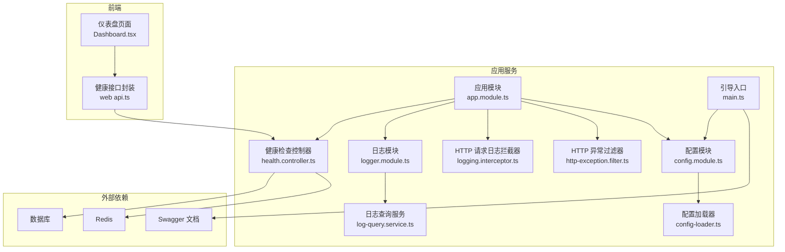
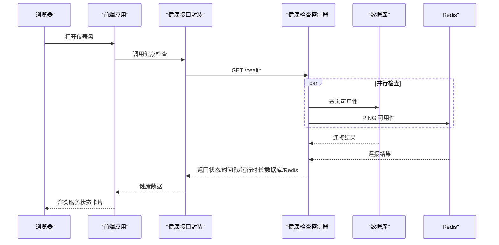
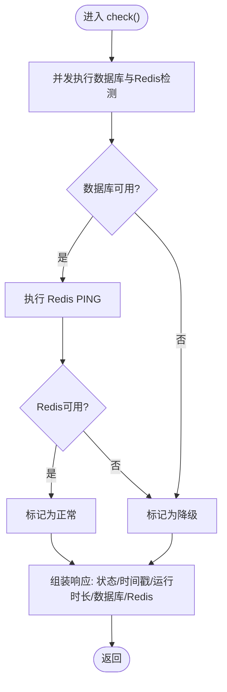
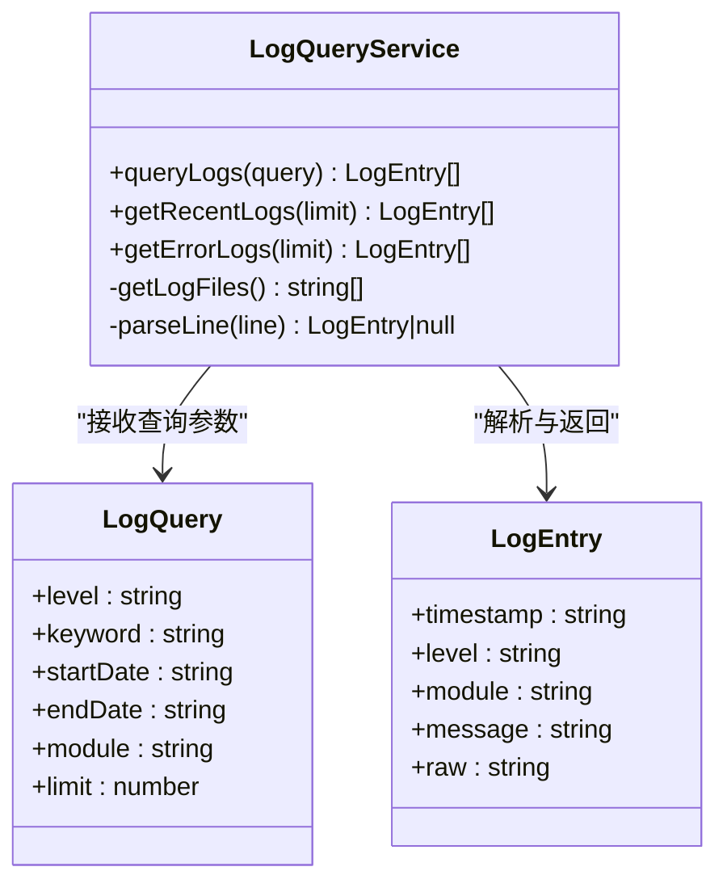
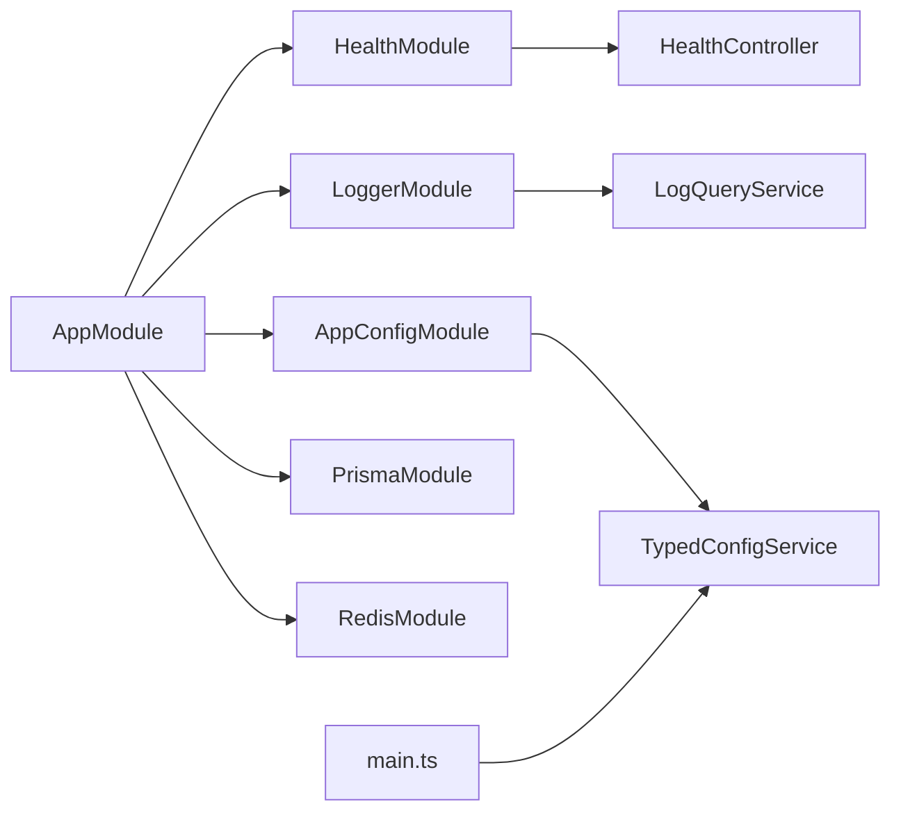

# 监控告警

<cite>
**本文引用的文件**
- [apps/nestjs-server/src/modules/health/health.controller.ts](file://apps/nestjs-server/src/modules/health/health.controller.ts)
- [apps/nestjs-server/src/modules/logger/logger.module.ts](file://apps/nestjs-server/src/modules/logger/logger.module.ts)
- [apps/nestjs-server/src/modules/logger/log-query.service.ts](file://apps/nestjs-server/src/modules/logger/log-query.service.ts)
- [apps/nestjs-server/src/common/interceptors/logging.interceptor.ts](file://apps/nestjs-server/src/common/interceptors/logging.interceptor.ts)
- [apps/nestjs-server/src/common/filters/http-exception.filter.ts](file://apps/nestjs-server/src/common/filters/http-exception.filter.ts)
- [apps/nestjs-server/src/common/constants/log-level.constants.ts](file://apps/nestjs-server/src/common/constants/log-level.constants.ts)
- [apps/nestjs-server/src/config/schemas/logger.schema.ts](file://apps/nestjs-server/src/config/schemas/logger.schema.ts)
- [apps/nestjs-server/src/config/config.module.ts](file://apps/nestjs-server/src/config/config.module.ts)
- [apps/nestjs-server/src/config/config-loader.ts](file://apps/nestjs-server/src/config/config-loader.ts)
- [apps/nestjs-server/src/app.module.ts](file://apps/nestjs-server/src/app.module.ts)
- [apps/nestjs-server/src/main.ts](file://apps/nestjs-server/src/main.ts)
- [apps/nestjs-server/docker-compose.yml](file://apps/nestjs-server/docker-compose.yml)
- [apps/nestjs-server/Dockerfile](file://apps/nestjs-server/Dockerfile)
- [apps/web/src/api/modules/health/api.ts](file://apps/web/src/api/modules/health/api.ts)
- [apps/web/src/pages/Dashboard.tsx](file://apps/web/src/pages/Dashboard.tsx)
</cite>

## 目录

1. [简介](#简介)
2. [项目结构](#项目结构)
3. [核心组件](#核心组件)
4. [架构总览](#架构总览)
5. [详细组件分析](#详细组件分析)
6. [依赖关系分析](#依赖关系分析)
7. [性能考量](#性能考量)
8. [故障排查指南](#故障排查指南)
9. [结论](#结论)
10. [附录](#附录)

## 简介

本文件面向生产环境的监控与告警体系建设，系统性梳理后端健康检查接口、日志采集与查询、异常过滤与追踪、以及前端可视化展示的完整链路。同时给出第三方监控工具的集成建议、自定义指标定义思路、告警规则设置要点、性能分析与用户体验监控方案，以及监控数据可视化与告警通知的配置方法。

## 项目结构

后端采用 NestJS 架构，监控相关能力主要分布在以下模块：

- 健康检查：提供服务整体健康状态与基础指标
- 日志模块：统一日志输出、文件落盘与查询能力
- 全局拦截器与异常过滤器：记录请求链路与异常信息
- 配置系统：集中管理日志级别、文件开关、大小与保留等参数
- 前端仪表盘：调用健康接口并展示服务状态

图表来源

- [apps/nestjs-server/src/modules/health/health.controller.ts:1-99](file://apps/nestjs-server/src/modules/health/health.controller.ts#L1-L99)
- [apps/nestjs-server/src/modules/logger/logger.module.ts:1-9](file://apps/nestjs-server/src/modules/logger/logger.module.ts#L1-L9)
- [apps/nestjs-server/src/modules/logger/log-query.service.ts:1-122](file://apps/nestjs-server/src/modules/logger/log-query.service.ts#L1-L122)
- [apps/nestjs-server/src/common/interceptors/logging.interceptor.ts:1-30](file://apps/nestjs-server/src/common/interceptors/logging.interceptor.ts#L1-L30)
- [apps/nestjs-server/src/common/filters/http-exception.filter.ts:1-208](file://apps/nestjs-server/src/common/filters/http-exception.filter.ts#L1-L208)
- [apps/nestjs-server/src/config/config.module.ts:1-20](file://apps/nestjs-server/src/config/config.module.ts#L1-L20)
- [apps/nestjs-server/src/config/config-loader.ts:1-63](file://apps/nestjs-server/src/config/config-loader.ts#L1-L63)
- [apps/nestjs-server/src/app.module.ts:1-63](file://apps/nestjs-server/src/app.module.ts#L1-L63)
- [apps/nestjs-server/src/main.ts:1-47](file://apps/nestjs-server/src/main.ts#L1-L47)
- [apps/web/src/api/modules/health/api.ts:1-25](file://apps/web/src/api/modules/health/api.ts#L1-L25)
- [apps/web/src/pages/Dashboard.tsx:1-140](file://apps/web/src/pages/Dashboard.tsx#L1-L140)

章节来源

- [apps/nestjs-server/src/app.module.ts:1-63](file://apps/nestjs-server/src/app.module.ts#L1-L63)
- [apps/nestjs-server/src/main.ts:1-47](file://apps/nestjs-server/src/main.ts#L1-L47)

## 核心组件

- 健康检查控制器：提供综合健康状态、时间戳、运行时长及数据库与缓存连通性
- 日志模块与查询服务：统一日志输出、可选文件落盘、按条件检索与最近错误日志
- 全局拦截器：记录请求方法、URL、用户标识、IP、UA、耗时与状态码
- 异常过滤器：将 HTTP 异常映射为业务码与统一错误响应，并记录告警级别日志
- 配置系统：集中化环境变量加载与类型安全读取，支持日志目录、级别、文件开关与轮转参数
- 前端健康接口封装与仪表盘：调用后端健康接口并在页面展示状态

章节来源

- [apps/nestjs-server/src/modules/health/health.controller.ts:1-99](file://apps/nestjs-server/src/modules/health/health.controller.ts#L1-L99)
- [apps/nestjs-server/src/modules/logger/log-query.service.ts:1-122](file://apps/nestjs-server/src/modules/logger/log-query.service.ts#L1-L122)
- [apps/nestjs-server/src/common/interceptors/logging.interceptor.ts:1-30](file://apps/nestjs-server/src/common/interceptors/logging.interceptor.ts#L1-L30)
- [apps/nestjs-server/src/common/filters/http-exception.filter.ts:1-208](file://apps/nestjs-server/src/common/filters/http-exception.filter.ts#L1-L208)
- [apps/nestjs-server/src/config/config-loader.ts:1-63](file://apps/nestjs-server/src/config/config-loader.ts#L1-L63)
- [apps/web/src/api/modules/health/api.ts:1-25](file://apps/web/src/api/modules/health/api.ts#L1-L25)
- [apps/web/src/pages/Dashboard.tsx:1-140](file://apps/web/src/pages/Dashboard.tsx#L1-L140)

## 架构总览

下图展示了从浏览器到后端服务、再到数据库与缓存的健康检查与日志链路，以及前端如何消费健康接口进行可视化展示。

图表来源

- [apps/nestjs-server/src/modules/health/health.controller.ts:58-76](file://apps/nestjs-server/src/modules/health/health.controller.ts#L58-L76)
- [apps/web/src/api/modules/health/api.ts:19-21](file://apps/web/src/api/modules/health/api.ts#L19-L21)
- [apps/web/src/pages/Dashboard.tsx:120-140](file://apps/web/src/pages/Dashboard.tsx#L120-L140)

## 详细组件分析

### 健康检查组件

- 接口职责：返回服务整体健康状态、当前时间、运行时长，以及数据库与 Redis 的连通性
- 自检逻辑：并发执行数据库可用性检测与 Redis PING，任一失败即判定为降级状态
- 输出结构：包含状态枚举、时间戳、运行时长、数据库与 Redis 连接状态
- Ping 接口：轻量级存活探测，返回固定字符串

图表来源

- [apps/nestjs-server/src/modules/health/health.controller.ts:58-76](file://apps/nestjs-server/src/modules/health/health.controller.ts#L58-L76)

章节来源

- [apps/nestjs-server/src/modules/health/health.controller.ts:18-98](file://apps/nestjs-server/src/modules/health/health.controller.ts#L18-L98)

### 日志与日志查询组件

- 日志模块：提供日志查询服务，支持按级别、关键词、模块、时间范围与条数限制检索
- 文件落盘：可通过配置开启文件日志、设置最大文件大小与保留天数
- 最近日志与错误日志：提供便捷查询接口
- 日志格式：解析形如“[时间] 级别 [模块] 消息”的行，提取字段用于查询

图表来源

- [apps/nestjs-server/src/modules/logger/log-query.service.ts:6-122](file://apps/nestjs-server/src/modules/logger/log-query.service.ts#L6-L122)

章节来源

- [apps/nestjs-server/src/modules/logger/log-query.service.ts:1-122](file://apps/nestjs-server/src/modules/logger/log-query.service.ts#L1-L122)
- [apps/nestjs-server/src/config/schemas/logger.schema.ts:1-13](file://apps/nestjs-server/src/config/schemas/logger.schema.ts#L1-L13)
- [apps/nestjs-server/src/common/constants/log-level.constants.ts:1-10](file://apps/nestjs-server/src/common/constants/log-level.constants.ts#L1-L10)

### 全局 HTTP 日志拦截器

- 记录维度：请求方法、URL、用户 ID、客户端 IP、User-Agent
- 统计维度：耗时（毫秒）、响应状态码
- 日志级别：统一以 INFO 级别输出，便于后续检索与聚合

章节来源

- [apps/nestjs-server/src/common/interceptors/logging.interceptor.ts:1-30](file://apps/nestjs-server/src/common/interceptors/logging.interceptor.ts#L1-L30)

### HTTP 异常过滤器

- 业务异常：透传业务码与消息，记录告警示例日志
- 其他 HTTP 异常：根据响应内容或状态码映射为业务码，统一输出错误响应
- 特殊处理：对 JSON 解析错误、Zod 校验错误、类校验错误进行识别与格式化
- 日志级别：使用告警示例日志记录异常上下文

章节来源

- [apps/nestjs-server/src/common/filters/http-exception.filter.ts:1-208](file://apps/nestjs-server/src/common/filters/http-exception.filter.ts#L1-L208)

### 配置系统与启动流程

- 配置加载：将扁平环境变量映射为命名空间结构，使用 Zod 进行严格校验与类型转换
- 启动阶段：启用关闭钩子、设置 CORS、注册全局前缀、按需启用 Swagger 文档
- 日志初始化：在引导阶段创建并注入统一 Logger 实例

章节来源

- [apps/nestjs-server/src/config/config-loader.ts:1-63](file://apps/nestjs-server/src/config/config-loader.ts#L1-L63)
- [apps/nestjs-server/src/config/config.module.ts:1-20](file://apps/nestjs-server/src/config/config.module.ts#L1-L20)
- [apps/nestjs-server/src/main.ts:1-47](file://apps/nestjs-server/src/main.ts#L1-L47)

### 前端健康接口与仪表盘

- 健康接口封装：定义健康状态与 Ping 响应的数据模型，提供调用函数
- 仪表盘展示：拉取健康数据，渲染服务状态卡片，加载失败显示告警提示

章节来源

- [apps/web/src/api/modules/health/api.ts:1-25](file://apps/web/src/api/modules/health/api.ts#L1-L25)
- [apps/web/src/pages/Dashboard.tsx:1-140](file://apps/web/src/pages/Dashboard.tsx#L1-L140)

## 依赖关系分析

- 应用模块装配：全局注册守卫、拦截器、管道、过滤器与健康模块、日志模块、配置模块
- 健康检查依赖：Prisma 与 Redis 服务；前端通过健康接口封装调用
- 配置依赖：配置模块作为全局模块被主模块导入，提供类型安全读取

图表来源

- [apps/nestjs-server/src/app.module.ts:1-63](file://apps/nestjs-server/src/app.module.ts#L1-L63)
- [apps/nestjs-server/src/main.ts:1-47](file://apps/nestjs-server/src/main.ts#L1-L47)

章节来源

- [apps/nestjs-server/src/app.module.ts:1-63](file://apps/nestjs-server/src/app.module.ts#L1-L63)
- [apps/nestjs-server/src/main.ts:1-47](file://apps/nestjs-server/src/main.ts#L1-L47)

## 性能考量

- 健康检查：并发检测数据库与 Redis，避免串行阻塞；仅返回必要字段，降低网络负载
- 日志落盘：控制单文件大小与保留天数，避免磁盘膨胀；按需开启文件日志，减少 IO 压力
- 请求日志：记录关键维度但不输出敏感信息；避免在高并发场景下产生过多日志
- 异常处理：统一映射与格式化，减少重复判断与字符串拼接

## 故障排查指南

- 健康检查失败
  - 检查数据库与 Redis 服务连通性与健康状态
  - 查看健康接口返回的数据库与 Redis 字段，定位具体依赖
- 日志无法查询
  - 确认日志目录配置与文件权限
  - 检查日志文件是否按日期轮转，确认查询时间范围
- 异常未被捕获
  - 确认全局异常过滤器已注册
  - 检查异常是否为业务异常，确保抛出类型正确
- 前端健康状态异常
  - 检查健康接口封装与调用链路
  - 确认网络连通与跨域配置

章节来源

- [apps/nestjs-server/src/modules/health/health.controller.ts:58-76](file://apps/nestjs-server/src/modules/health/health.controller.ts#L58-L76)
- [apps/nestjs-server/src/modules/logger/log-query.service.ts:31-83](file://apps/nestjs-server/src/modules/logger/log-query.service.ts#L31-L83)
- [apps/nestjs-server/src/common/filters/http-exception.filter.ts:16-68](file://apps/nestjs-server/src/common/filters/http-exception.filter.ts#L16-L68)
- [apps/web/src/api/modules/health/api.ts:19-21](file://apps/web/src/api/modules/health/api.ts#L19-L21)

## 结论

该监控体系以健康检查为核心入口，结合全局日志拦截与异常过滤，形成完整的可观测性闭环。通过配置系统实现参数化治理，前端仪表盘直观呈现服务状态。建议在此基础上扩展自定义指标、接入第三方监控平台并完善告警规则与通知机制。

## 附录

### 生产环境监控与告警配置清单

- 健康检查
  - 接口：/health（综合状态）、/health/ping（存活探测）
  - 建议：在网关/负载均衡中配置探针，间隔与超时依据实例规模调整
- 日志策略
  - 日志级别：生产环境建议 Info 或更高
  - 文件落盘：开启并设置合理大小与保留天数
  - 关键字段：时间戳、级别、模块、消息、用户标识、请求耗时
- 异常追踪
  - 使用异常过滤器统一输出业务码与消息
  - 在告警示例中记录请求方法、URL 与状态码，便于快速定位
- 用户体验监控
  - 前端埋点：记录页面加载耗时、关键交互延迟与错误率
  - 与后端日志联动：通过 TraceId 关联前后端日志
- 可视化与报表
  - 健康状态卡片：展示服务状态、数据库与缓存连通性
  - 日志检索面板：支持按级别、关键词、时间范围筛选
- 告警规则建议
  - 健康状态：连续 N 次返回非 ok 或 degraded
  - 数据库/缓存：连续 N 次不可用
  - 错误率：接口错误率超过阈值
  - 响应时间：P95/P99 超过阈值
- 第三方监控工具集成
  - 指标采集：Prometheus Exporter 或 Pushgateway（可选）
  - 日志采集：Filebeat/Fluent Bit 收集日志文件
  - 告警通知：钉钉/企业微信/Webhook
  - 可观测性平台：ELK/Graylog/Loki/Grafana 或云厂商 SaaS

### 部署与容器化

- 容器镜像：基于 Node.js Alpine，分阶段构建
- 端口暴露：服务监听 3000
- 健康检查：Compose 中定义数据库与 Redis 的健康检查命令

章节来源

- [apps/nestjs-server/Dockerfile:1-20](file://apps/nestjs-server/Dockerfile#L1-L20)
- [apps/nestjs-server/docker-compose.yml:1-54](file://apps/nestjs-server/docker-compose.yml#L1-L54)
