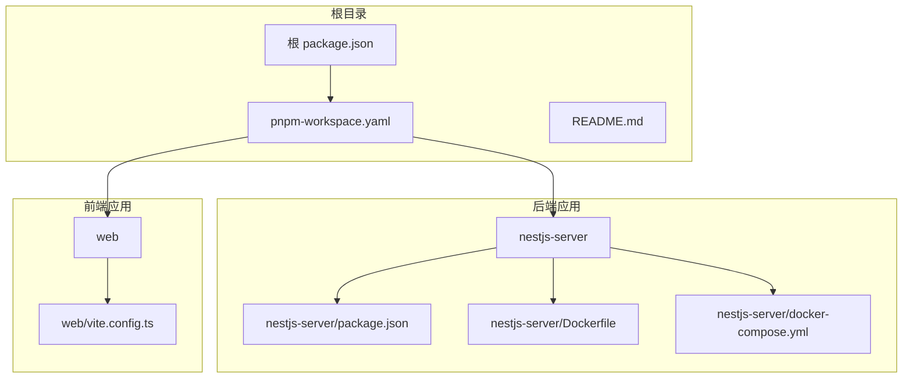
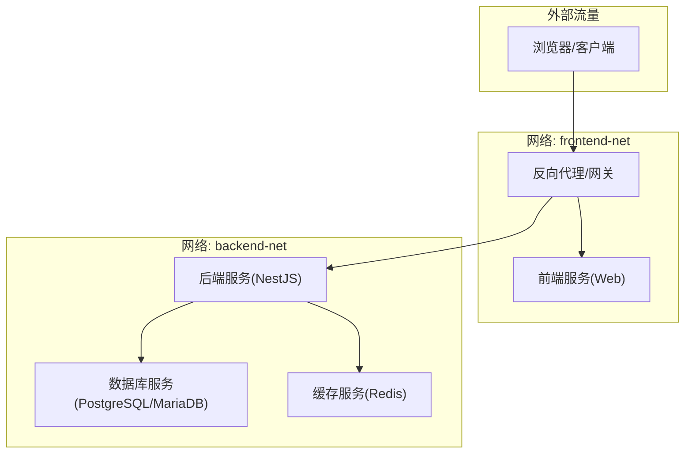
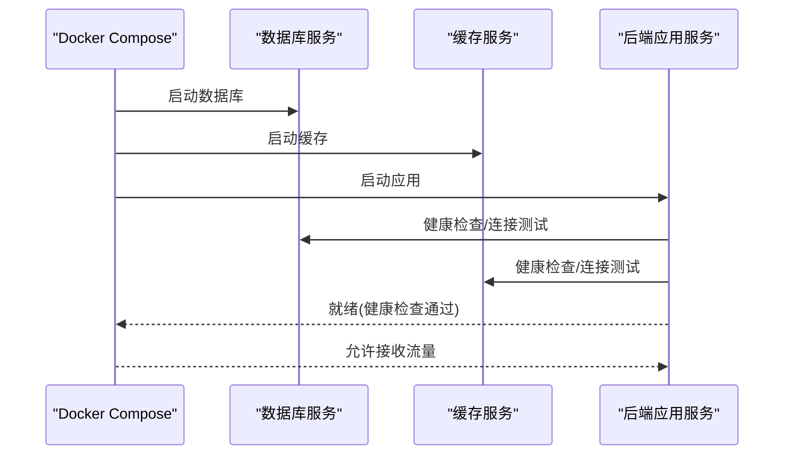
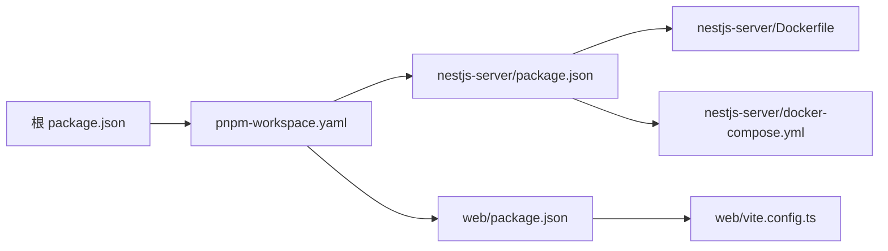

# 编排部署

<cite>
**本文引用的文件**
- [docker-compose.yml](file://apps/nestjs-server/docker-compose.yml)
- [Dockerfile](file://apps/nestjs-server/Dockerfile)
- [package.json](file://apps/nestjs-server/package.json)
- [vite.config.ts](file://apps/web/vite.config.ts)
- [pnpm-workspace.yaml](file://pnpm-workspace.yaml)
- [README.md](file://README.md)
</cite>

## 目录

1. [简介](#简介)
2. [项目结构](#项目结构)
3. [核心组件](#核心组件)
4. [架构总览](#架构总览)
5. [详细组件分析](#详细组件分析)
6. [依赖分析](#依赖分析)
7. [性能考虑](#性能考虑)
8. [故障排查指南](#故障排查指南)
9. [结论](#结论)
10. [附录](#附录)

## 简介

本文件面向运维与开发团队，系统化梳理基于 Docker Compose 的编排部署方案，覆盖数据库服务、应用服务与前端服务的编排策略，明确服务间依赖关系、启动顺序与健康检查机制，并给出环境变量传递、数据卷管理、网络隔离、多环境部署、扩缩容与负载均衡、故障恢复与滚动更新等最佳实践。

## 项目结构

本仓库采用多包工作区（monorepo）组织方式，核心应用分为后端 NestJS 服务与前端 Web 应用，二者通过 Docker Compose 进行统一编排。根目录提供工作区与构建配置，后端应用包含独立的 Dockerfile 与 docker-compose.yml，前端应用提供 Vite 开发与构建配置。

**图表来源**

- [pnpm-workspace.yaml](file://pnpm-workspace.yaml)
- [package.json](file://apps/nestjs-server/package.json)
- [Dockerfile](file://apps/nestjs-server/Dockerfile)
- [docker-compose.yml](file://apps/nestjs-server/docker-compose.yml)
- [vite.config.ts](file://apps/web/vite.config.ts)

**章节来源**

- [pnpm-workspace.yaml](file://pnpm-workspace.yaml)
- [README.md](file://README.md)

## 核心组件

- 数据库服务：负责持久化存储与连接池管理，作为后端应用的上游依赖。
- 后端应用服务（NestJS）：提供业务接口、认证授权、日志与健康检查能力，依赖数据库与缓存等中间件。
- 前端应用服务（Web）：提供用户界面与 API 调用，通过反向代理或直接访问后端服务。
- 反向代理/网关：用于路由转发、静态资源分发与 TLS 终止（可选）。
- 缓存/消息队列：根据业务需要可选引入 Redis 或消息中间件。

上述组件在 docker-compose 中以服务形式定义，通过 networks 实现网络隔离与互通，通过 volumes 实现数据持久化与共享。

**章节来源**

- [docker-compose.yml](file://apps/nestjs-server/docker-compose.yml)

## 架构总览

下图展示容器编排的整体拓扑：前端服务与后端服务通过自定义网络互联；后端服务依赖数据库服务；健康检查确保服务可用性；数据卷保障持久化需求。

**图表来源**

- [docker-compose.yml](file://apps/nestjs-server/docker-compose.yml)

## 详细组件分析

### 数据库服务

- 作用：承载应用数据模型与事务处理，支持备份、迁移与高可用配置。
- 关键点：
  - 使用官方镜像或社区镜像，设置初始化脚本与种子数据。
  - 挂载数据卷实现持久化，避免容器重建导致数据丢失。
  - 配置只读副本与主从复制，满足读写分离与灾备。
- 健康检查：通过执行 SQL 查询或连接测试确认可用性。
- 安全：限制网络访问、启用 TLS、最小权限账号与密钥轮换。

**章节来源**

- [docker-compose.yml](file://apps/nestjs-server/docker-compose.yml)

### 后端应用服务（NestJS）

- 作用：提供 REST/GraphQL 接口、鉴权、限流、日志与健康检查。
- 关键点：
  - Dockerfile 使用多阶段构建，优化镜像体积与安全基线。
  - 通过环境变量注入数据库连接、JWT 密钥、日志级别等配置。
  - 依赖数据库与缓存服务，启动顺序由 depends_on 与健康检查共同保证。
  - 提供 /health 端点，便于编排层进行存活/就绪探针。
- 扩展：支持水平扩展，结合负载均衡与会话亲和策略。

**图表来源**

- [docker-compose.yml](file://apps/nestjs-server/docker-compose.yml)

**章节来源**

- [Dockerfile](file://apps/nestjs-server/Dockerfile)
- [docker-compose.yml](file://apps/nestjs-server/docker-compose.yml)
- [package.json](file://apps/nestjs-server/package.json)

### 前端应用服务（Web）

- 作用：提供用户界面与交互，调用后端 API。
- 关键点：
  - Vite 提供开发与生产构建，支持热重载与产物优化。
  - 生产环境可打包为静态资源，由反向代理或 CDN 分发。
  - 通过环境变量配置 API 基础地址、功能开关与第三方集成参数。
- 网络：与后端服务处于同一网络，便于内网直连；也可通过反向代理对外暴露。

**章节来源**

- [vite.config.ts](file://apps/web/vite.config.ts)

### 网络配置与隔离

- 自定义网络：为不同层级的服务划分网络，实现隔离与互通控制。
- 端口映射：仅对需要外网访问的服务进行端口映射，内部服务通过服务名通信。
- DNS 与服务发现：容器间通过服务名解析，简化配置与迁移。

**章节来源**

- [docker-compose.yml](file://apps/nestjs-server/docker-compose.yml)

### 依赖关系与启动顺序

- 明确的依赖链：后端服务依赖数据库与缓存；前端服务依赖后端服务。
- 启动顺序：通过 depends_on 与健康检查双重保障，确保下游服务在上游可用后再启动。
- 并发启动：对无依赖或弱依赖的服务可并发启动以缩短总启动时间。

**章节来源**

- [docker-compose.yml](file://apps/nestjs-server/docker-compose.yml)

### 健康检查机制

- 存活探针（liveness）：检测进程是否仍在运行，失败时触发重启。
- 就绪探针（readiness）：检测服务是否已准备好接收流量，未就绪时不参与负载均衡。
- 健康检查策略：HTTP GET /health、TCP 端口探测或自定义命令。

**章节来源**

- [docker-compose.yml](file://apps/nestjs-server/docker-compose.yml)

### 环境变量传递

- 方式一：在 docker-compose.yml 中通过 environment 或 env_file 注入。
- 方式二：在 CI/CD 中通过 secrets 或外部配置中心动态注入。
- 最佳实践：区分通用配置与敏感配置，敏感信息使用密文存储与解密流程。

**章节来源**

- [docker-compose.yml](file://apps/nestjs-server/docker-compose.yml)

### 数据卷管理

- 类型：命名卷用于持久化数据库与缓存数据；绑定挂载用于日志与配置热更新。
- 生命周期：随服务生命周期管理，删除服务不会自动清理命名卷。
- 备份策略：定期导出数据库快照与归档日志，验证恢复流程。

**章节来源**

- [docker-compose.yml](file://apps/nestjs-server/docker-compose.yml)

## 依赖分析

- 工作区依赖：根级 package.json 与 pnpm-workspace.yaml 组织多包依赖，确保版本一致性与构建顺序。
- 应用依赖：后端 NestJS 依赖 Prisma、JWT、日志与数据库驱动；前端 Web 依赖 React/Vite 生态。
- 运行时依赖：Dockerfile 中声明基础镜像与运行时库，减少攻击面。

**图表来源**

- [pnpm-workspace.yaml](file://pnpm-workspace.yaml)
- [package.json](file://apps/nestjs-server/package.json)
- [Dockerfile](file://apps/nestjs-server/Dockerfile)
- [docker-compose.yml](file://apps/nestjs-server/docker-compose.yml)
- [vite.config.ts](file://apps/web/vite.config.ts)

**章节来源**

- [pnpm-workspace.yaml](file://pnpm-workspace.yaml)
- [package.json](file://apps/nestjs-server/package.json)

## 性能考虑

- 资源限制：为数据库与应用设置 CPU/内存上限，避免资源争用。
- 连接池：合理配置数据库连接池大小与超时，避免峰值拥塞。
- 缓存策略：利用缓存降低数据库压力，结合失效策略与预热。
- 静态资源：前端产物由 CDN 加速，减少后端带宽占用。
- 日志与监控：集中化日志与指标采集，及时发现性能瓶颈。

## 故障排查指南

- 健康检查失败：
  - 检查数据库连接字符串与凭据。
  - 查看应用日志与数据库慢查询日志。
  - 确认网络连通性与防火墙规则。
- 启动顺序问题：
  - 确认 depends_on 与健康检查配置。
  - 检查服务间依赖是否完整（如缓存服务）。
- 数据丢失或损坏：
  - 校验数据卷挂载路径与权限。
  - 执行数据库备份与恢复演练。
- 性能退化：
  - 分析慢请求与热点接口。
  - 评估连接池与缓存命中率。
- 升级回滚：
  - 使用蓝绿/金丝雀发布策略，逐步切换流量。
  - 准备回滚镜像与数据迁移脚本。

## 结论

通过 Docker Compose 对数据库、后端与前端服务进行统一编排，配合健康检查、网络隔离与数据卷管理，可实现稳定、可观测且可扩展的应用交付。建议在生产环境中进一步完善监控告警、备份恢复与灾难演练，持续优化资源配额与缓存策略，确保系统在高并发场景下的可靠性与性能。

## 附录

- 多环境部署策略：通过环境变量与 env_file 切换开发/测试/生产配置；使用不同 compose 文件叠加覆盖。
- 服务扩缩容：在负载均衡器后对后端服务进行横向扩展，注意状态与会话一致性。
- 滚动更新：结合健康检查与就绪探针，逐批替换实例，保障业务连续性。
- 安全加固：最小权限原则、镜像扫描、密钥管理与网络隔离。
