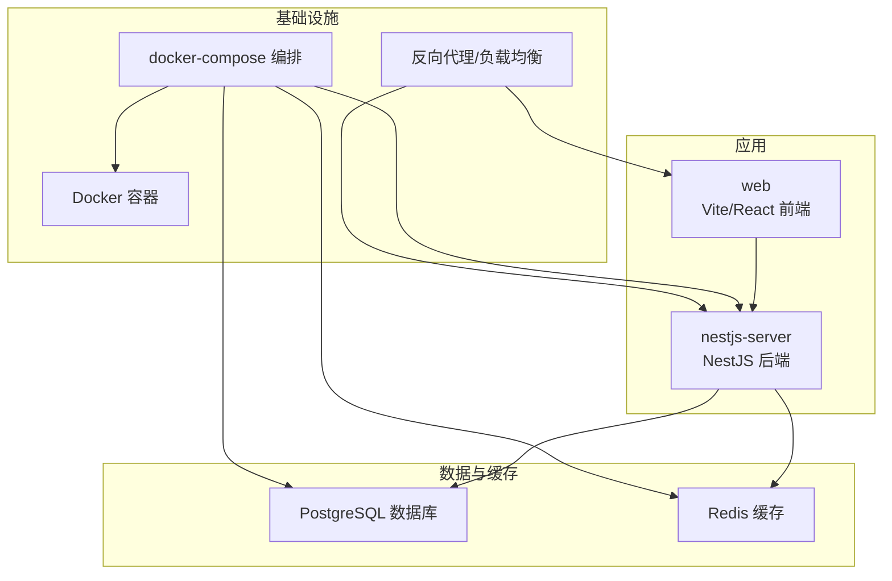
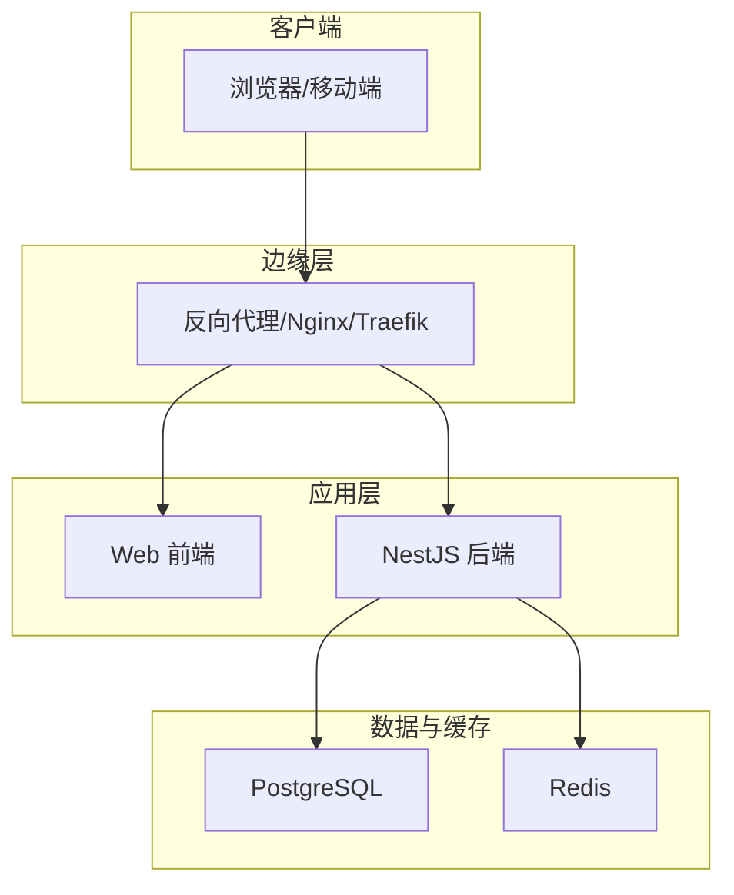
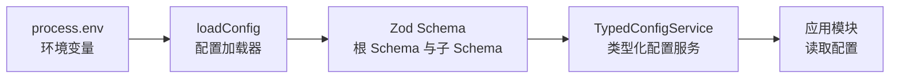

# 部署指南

<cite>
**本文引用的文件**
- [apps/nestjs-server/Dockerfile](file://apps/nestjs-server/Dockerfile)
- [apps/nestjs-server/docker-compose.yml](file://apps/nestjs-server/docker-compose.yml)
- [apps/nestjs-server/.dockerignore](file://apps/nestjs-server/.dockerignore)
- [apps/nestjs-server/package.json](file://apps/nestjs-server/package.json)
- [apps/web/package.json](file://apps/web/package.json)
- [apps/nestjs-server/src/config/config-loader.ts](file://apps/nestjs-server/src/config/config-loader.ts)
- [apps/nestjs-server/src/config/typed-config.service.ts](file://apps/nestjs-server/src/config/typed-config.service.ts)
- [apps/nestjs-server/src/config/schemas/root.schema.ts](file://apps/nestjs-server/src/config/schemas/root.schema.ts)
- [apps/nestjs-server/src/config/schemas/app.schema.ts](file://apps/nestjs-server/src/config/schemas/app.schema.ts)
- [apps/nestjs-server/src/config/schemas/database.schema.ts](file://apps/nestjs-server/src/config/schemas/database.schema.ts)
- [apps/nestjs-server/src/config/schemas/jwt.schema.ts](file://apps/nestjs-server/src/config/schemas/jwt.schema.ts)
- [apps/nestjs-server/src/config/schemas/logger.schema.ts](file://apps/nestjs-server/src/config/schemas/logger.schema.ts)
- [apps/nestjs-server/src/config/schemas/redis.schema.ts](file://apps/nestjs-server/src/config/schemas/redis.schema.ts)
- [apps/nestjs-server/src/modules/health/health.controller.ts](file://apps/nestjs-server/src/modules/health/health.controller.ts)
- [apps/nestjs-server/src/modules/health/health.module.ts](file://apps/nestjs-server/src/modules/health/health.module.ts)
</cite>

## 目录
1. [简介](#简介)
2. [项目结构](#项目结构)
3. [核心组件](#核心组件)
4. [架构总览](#架构总览)
5. [详细组件分析](#详细组件分析)
6. [依赖关系分析](#依赖关系分析)
7. [性能考虑](#性能考虑)
8. [故障排除指南](#故障排除指南)
9. [结论](#结论)
10. [附录](#附录)

## 简介
本指南面向生产环境部署 Nebula 项目，涵盖容器化与编排、服务发现、环境变量与配置、数据库连接、日志与健康检查、CI/CD 最佳实践以及云平台部署建议。文档以仓库中的实际配置为依据，确保可操作性与一致性。

## 项目结构
Nebula 采用多包工作区结构，后端基于 NestJS，前端基于 Vite/React，数据库使用 Prisma，容器化通过 Dockerfile 与 docker-compose 实现。生产部署推荐使用 docker-compose 编排应用与数据库，并结合外部负载均衡与反向代理。

图示来源
- [apps/nestjs-server/docker-compose.yml:1-37](file://apps/nestjs-server/docker-compose.yml#L1-L37)
- [apps/nestjs-server/Dockerfile:1-20](file://apps/nestjs-server/Dockerfile#L1-L20)

章节来源
- [apps/nestjs-server/docker-compose.yml:1-37](file://apps/nestjs-server/docker-compose.yml#L1-L37)
- [apps/nestjs-server/Dockerfile:1-20](file://apps/nestjs-server/Dockerfile#L1-L20)
- [apps/web/package.json:1-44](file://apps/web/package.json#L1-L44)

## 核心组件
- 应用容器镜像构建：使用双阶段构建，先安装依赖与构建，再复制到运行时镜像，仅包含生产依赖与产物。
- 编排与服务发现：通过 docker-compose 定义服务、网络与健康检查；应用通过服务名进行内部通信。
- 配置系统：基于环境变量映射到分层命名空间，使用 Zod 在启动前严格校验与转换。
- 健康检查：提供 /health 与 /health/ping 接口，数据库连通性与进程运行时长等指标。
- 日志：Winston 配合按日滚动文件输出，支持目录、级别与文件大小/数量限制。
- 数据库：支持 PostgreSQL，Prisma 用于 ORM 与迁移；compose 中定义了健康检查与持久卷。
- 缓存：可选 Redis，用于会话、限流或键值缓存，支持密码与键前缀配置。

章节来源
- [apps/nestjs-server/Dockerfile:1-20](file://apps/nestjs-server/Dockerfile#L1-L20)
- [apps/nestjs-server/docker-compose.yml:1-37](file://apps/nestjs-server/docker-compose.yml#L1-L37)
- [apps/nestjs-server/src/config/config-loader.ts:1-60](file://apps/nestjs-server/src/config/config-loader.ts#L1-L60)
- [apps/nestjs-server/src/config/typed-config.service.ts:1-46](file://apps/nestjs-server/src/config/typed-config.service.ts#L1-L46)
- [apps/nestjs-server/src/modules/health/health.controller.ts:1-86](file://apps/nestjs-server/src/modules/health/health.controller.ts#L1-L86)

## 架构总览
下图展示生产部署的关键交互：前端通过反向代理访问后端；后端连接数据库与可选缓存；compose 管理容器生命周期与健康检查。

图示来源
- [apps/nestjs-server/docker-compose.yml:1-37](file://apps/nestjs-server/docker-compose.yml#L1-L37)
- [apps/nestjs-server/src/modules/health/health.controller.ts:1-86](file://apps/nestjs-server/src/modules/health/health.controller.ts#L1-L86)

## 详细组件分析

### 容器化与镜像构建
- 双阶段构建：第一阶段安装 pnpm 与依赖、执行构建；第二阶段仅拷贝生产依赖与 dist，暴露 3000 端口，CMD 启动。
- 运行时最小化：仅保留运行所需文件，减少攻击面。
- .dockerignore：排除 node_modules、dist、覆盖率、.env、README 等无关内容，提升构建效率与安全性。

章节来源
- [apps/nestjs-server/Dockerfile:1-20](file://apps/nestjs-server/Dockerfile#L1-L20)
- [apps/nestjs-server/.dockerignore:1-8](file://apps/nestjs-server/.dockerignore#L1-L8)

### docker-compose 编排与服务发现
- 服务定义：app 与 db 两个服务；app 依赖 db 的健康状态。
- 环境变量：NODE_ENV、数据库连接串、JWT 密钥与 TTL、CORS 来源等。
- 健康检查：PostgreSQL 使用 pg_isready 检测，健康间隔与重试次数可调。
- 卷：PostgreSQL 数据持久化至 pgdata 卷。

章节来源
- [apps/nestjs-server/docker-compose.yml:1-37](file://apps/nestjs-server/docker-compose.yml#L1-L37)

### 配置系统与环境变量
- 配置加载：将扁平的 process.env 映射为分层命名空间（app、database、jwt、logger、redis），Zod 校验与类型推断。
- 类型安全：TypedConfigService 提供 get 与 namespace 访问方式，支持点语法路径与命名空间对象读取。
- 根 Schema：聚合各子 Schema，形成完整配置树。
- 关键配置项：
  - 应用：NODE_ENV、PORT、API_PREFIX、CORS_ORIGIN、ENABLE_SWAGGER
  - 数据库：DATABASE_PROVIDER、DATABASE_URL、DB_MAX_CONNECTIONS、DB_LOGGING
  - JWT：JWT_SECRET、JWT_ACCESS_TTL、JWT_REFRESH_SECRET、JWT_REFRESH_TTL
  - 日志：LOGGER_DIR、LOGGER_LEVEL、LOGGER_ENABLE_FILE、LOGGER_MAX_FILES、LOGGER_MAX_SIZE
  - Redis：REDIS_HOST、REDIS_PORT、REDIS_PASSWORD、REDIS_DB、REDIS_KEY_PREFIX

章节来源
- [apps/nestjs-server/src/config/config-loader.ts:1-60](file://apps/nestjs-server/src/config/config-loader.ts#L1-L60)
- [apps/nestjs-server/src/config/typed-config.service.ts:1-46](file://apps/nestjs-server/src/config/typed-config.service.ts#L1-L46)
- [apps/nestjs-server/src/config/schemas/root.schema.ts:1-23](file://apps/nestjs-server/src/config/schemas/root.schema.ts#L1-L23)
- [apps/nestjs-server/src/config/schemas/app.schema.ts:1-12](file://apps/nestjs-server/src/config/schemas/app.schema.ts#L1-L12)
- [apps/nestjs-server/src/config/schemas/database.schema.ts:1-11](file://apps/nestjs-server/src/config/schemas/database.schema.ts#L1-L11)
- [apps/nestjs-server/src/config/schemas/jwt.schema.ts:1-11](file://apps/nestjs-server/src/config/schemas/jwt.schema.ts#L1-L11)
- [apps/nestjs-server/src/config/schemas/logger.schema.ts:1-13](file://apps/nestjs-server/src/config/schemas/logger.schema.ts#L1-L13)
- [apps/nestjs-server/src/config/schemas/redis.schema.ts:1-12](file://apps/nestjs-server/src/config/schemas/redis.schema.ts#L1-L12)

### 健康检查与可观测性
- 健康接口：GET /health 返回状态、时间戳、运行时长与数据库连接状态；GET /health/ping 返回简单响应。
- 数据库探测：通过 Prisma 执行轻量查询验证连通性。
- 建议：在生产中将健康检查暴露给负载均衡器或探针，结合日志与指标系统统一监控。

章节来源
- [apps/nestjs-server/src/modules/health/health.controller.ts:1-86](file://apps/nestjs-server/src/modules/health/health.controller.ts#L1-L86)
- [apps/nestjs-server/src/modules/health/health.module.ts:1-10](file://apps/nestjs-server/src/modules/health/health.module.ts#L1-L10)

### 数据库连接与迁移
- 支持 PostgreSQL：compose 中已内置数据库镜像与健康检查。
- 连接串：通过 DATABASE_URL 注入，建议使用强密码与只读用户分离。
- 迁移与种子：Prisma schema 位于 nestjs-server/prisma/schema，可通过 Prisma CLI 或脚本管理迁移。

章节来源
- [apps/nestjs-server/docker-compose.yml:19-33](file://apps/nestjs-server/docker-compose.yml#L19-L33)
- [apps/nestjs-server/src/config/schemas/database.schema.ts:1-11](file://apps/nestjs-server/src/config/schemas/database.schema.ts#L1-L11)

### 日志配置与输出
- Winston 日志：支持按日滚动文件，可配置日志目录、级别、最大文件数与单文件大小。
- 文件输出：通过 LOGGER_ENABLE_FILE 控制是否启用文件输出。
- 建议：生产中开启文件输出并配合集中式日志收集（如 Fluent Bit/Logstash）。

章节来源
- [apps/nestjs-server/src/config/schemas/logger.schema.ts:1-13](file://apps/nestjs-server/src/config/schemas/logger.schema.ts#L1-L13)

### 缓存（Redis）
- 可选配置：主机、端口、密码、数据库编号与键前缀。
- 典型用途：会话存储、限流、分布式锁、键值缓存。
- 建议：生产中启用密码与网络隔离，合理设置键前缀避免冲突。

章节来源
- [apps/nestjs-server/src/config/schemas/redis.schema.ts:1-12](file://apps/nestjs-server/src/config/schemas/redis.schema.ts#L1-L12)

### 前端构建与部署
- 前端使用 Vite/React，构建脚本与依赖在 web 包中定义。
- 生产建议：将构建产物部署至静态托管（如 Nginx/Apache/CDN），通过反向代理转发 API 请求到后端。

章节来源
- [apps/web/package.json:1-44](file://apps/web/package.json#L1-L44)

## 依赖关系分析
下图展示配置加载与类型系统的依赖关系，体现从环境变量到运行时配置的转换链路。

图示来源
- [apps/nestjs-server/src/config/config-loader.ts:1-60](file://apps/nestjs-server/src/config/config-loader.ts#L1-L60)
- [apps/nestjs-server/src/config/typed-config.service.ts:1-46](file://apps/nestjs-server/src/config/typed-config.service.ts#L1-L46)
- [apps/nestjs-server/src/config/schemas/root.schema.ts:1-23](file://apps/nestjs-server/src/config/schemas/root.schema.ts#L1-L23)

章节来源
- [apps/nestjs-server/src/config/config-loader.ts:1-60](file://apps/nestjs-server/src/config/config-loader.ts#L1-L60)
- [apps/nestjs-server/src/config/typed-config.service.ts:1-46](file://apps/nestjs-server/src/config/typed-config.service.ts#L1-L46)
- [apps/nestjs-server/src/config/schemas/root.schema.ts:1-23](file://apps/nestjs-server/src/config/schemas/root.schema.ts#L1-L23)

## 性能考虑
- 容器资源：为数据库与应用设置合理的 CPU/内存限制与重启策略。
- 数据库连接池：根据并发请求调整最大连接数与超时。
- 缓存命中：合理设置缓存 TTL 与键前缀，避免热点键与雪崩。
- 日志级别：生产中避免过高的日志级别导致 IO 压力。
- 健康检查频率：平衡探测频率与数据库压力。
- 前端静态资源：开启压缩与缓存头，CDN 加速静态资源访问。

## 故障排除指南
- 启动失败（配置校验错误）：检查环境变量是否满足 Zod 校验规则（如密钥长度、布尔值、数值范围）。
- 数据库不可达：确认 DATABASE_URL 正确、网络连通、数据库健康检查通过。
- 健康检查失败：查看 /health 输出，定位数据库连通性问题或进程异常。
- 日志未输出：确认 LOGGER_ENABLE_FILE 已启用且目录可写。
- Redis 连接问题：核对主机、端口、密码与数据库编号。
- 前端无法访问后端：确认 CORS 来源、反向代理路由与后端 API 前缀一致。

章节来源
- [apps/nestjs-server/src/config/config-loader.ts:46-53](file://apps/nestjs-server/src/config/config-loader.ts#L46-L53)
- [apps/nestjs-server/src/modules/health/health.controller.ts:48-63](file://apps/nestjs-server/src/modules/health/health.controller.ts#L48-L63)

## 结论
通过 docker-compose 编排与严格的配置校验，Nebula 项目可在生产环境中实现快速部署与稳定运行。建议结合外部负载均衡、集中式日志与监控体系，持续优化性能与可靠性。

## 附录

### 环境变量清单与默认值
- 应用
  - NODE_ENV：开发/生产/测试，默认开发
  - PORT：服务端口，默认 3000
  - API_PREFIX：API 前缀，默认 api/v1
  - CORS_ORIGIN：CORS 来源，默认 *
  - ENABLE_SWAGGER：是否启用 Swagger，默认 true
- 数据库
  - DATABASE_PROVIDER：驱动类型，sqlite/postgresql，默认 sqlite
  - DATABASE_URL：数据库连接串，必填
  - DB_MAX_CONNECTIONS：最大连接数，默认 10
  - DB_LOGGING：是否开启数据库日志，默认 false
- JWT
  - JWT_SECRET：访问令牌密钥，长度至少 32 位
  - JWT_ACCESS_TTL：访问令牌有效期，默认 15m
  - JWT_REFRESH_SECRET：刷新令牌密钥，长度至少 32 位
  - JWT_REFRESH_TTL：刷新令牌有效期，默认 7d
- 日志
  - LOGGER_DIR：日志目录，默认 logs
  - LOGGER_LEVEL：日志级别，默认 Info
  - LOGGER_ENABLE_FILE：是否启用文件输出，默认 false
  - LOGGER_MAX_FILES：保留日志文件数，默认 7
  - LOGGER_MAX_SIZE：单文件最大大小，默认 20m
- Redis
  - REDIS_HOST：主机，必填
  - REDIS_PORT：端口，默认 6379
  - REDIS_PASSWORD：密码（可选）
  - REDIS_DB：数据库编号，默认 0
  - REDIS_KEY_PREFIX：键前缀，默认 nebula:

章节来源
- [apps/nestjs-server/src/config/schemas/app.schema.ts:1-12](file://apps/nestjs-server/src/config/schemas/app.schema.ts#L1-L12)
- [apps/nestjs-server/src/config/schemas/database.schema.ts:1-11](file://apps/nestjs-server/src/config/schemas/database.schema.ts#L1-L11)
- [apps/nestjs-server/src/config/schemas/jwt.schema.ts:1-11](file://apps/nestjs-server/src/config/schemas/jwt.schema.ts#L1-L11)
- [apps/nestjs-server/src/config/schemas/logger.schema.ts:1-13](file://apps/nestjs-server/src/config/schemas/logger.schema.ts#L1-L13)
- [apps/nestjs-server/src/config/schemas/redis.schema.ts:1-12](file://apps/nestjs-server/src/config/schemas/redis.schema.ts#L1-L12)

### 健康检查接口定义
- GET /health
  - 返回字段：status、timestamp、uptime、database
  - 状态：ok/degraded
  - 数据库状态：connected/disconnected
- GET /health/ping
  - 返回字段：message（示例 pong）

章节来源
- [apps/nestjs-server/src/modules/health/health.controller.ts:14-84](file://apps/nestjs-server/src/modules/health/health.controller.ts#L14-L84)

### CI/CD 流水线建议
- 构建阶段：使用 pnpm 安装依赖，执行类型检查与单元测试，生成 Docker 镜像。
- 安全扫描：镜像漏洞扫描与依赖许可证检查。
- 部署阶段：将镜像推送至私有仓库，通过 docker-compose 或编排平台部署；执行集成测试与健康检查。
- 回滚策略：支持灰度发布与一键回滚。
- 自动化测试：单元测试、端到端测试与快照对比。

章节来源
- [apps/nestjs-server/package.json:8-25](file://apps/nestjs-server/package.json#L8-L25)
- [apps/web/package.json:6-13](file://apps/web/package.json#L6-L13)

### 云平台部署示例（概念性）
- AWS：ECS/Fargate 托管，RDS 托管数据库，ElastiCache Redis，CloudWatch 日志与告警。
- Azure：Container Instances/ACI，Azure SQL Database，Azure Cache for Redis，Log Analytics。
- GCP：Cloud Run/GKE，Cloud SQL，Cloud Memorystore，Cloud Logging/Cloud Monitoring。
- 注意事项：使用托管数据库与缓存降低运维复杂度；配置自动备份与高可用；使用 Secret Manager 存储敏感配置。