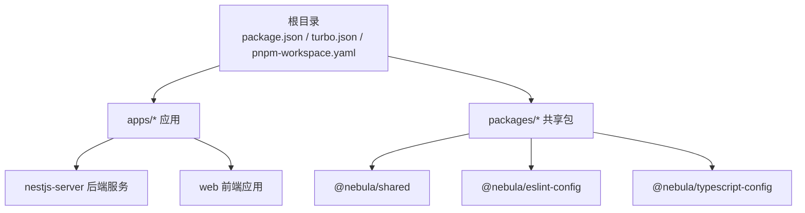
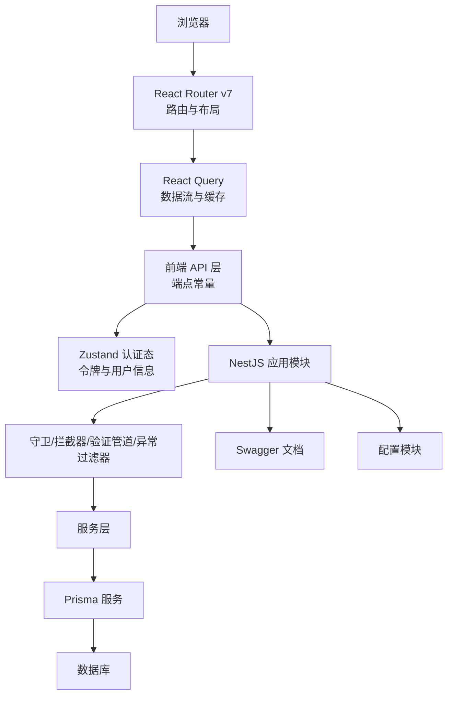
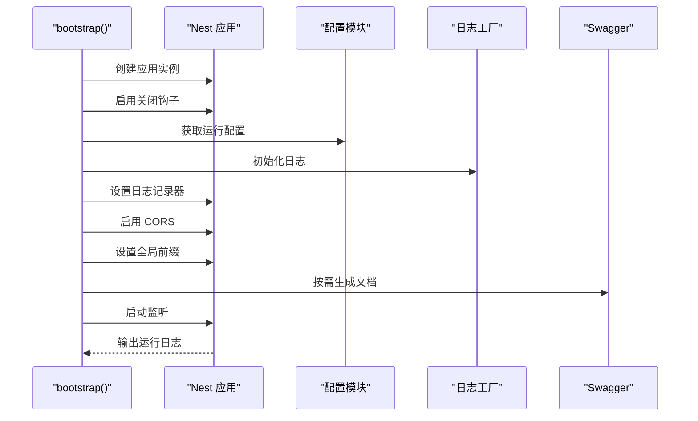
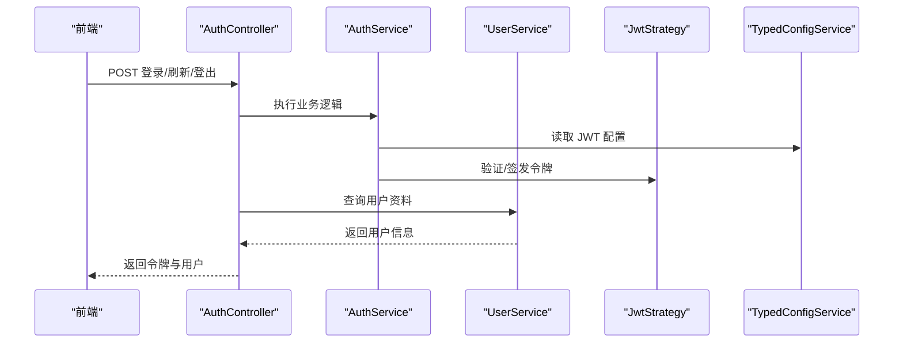
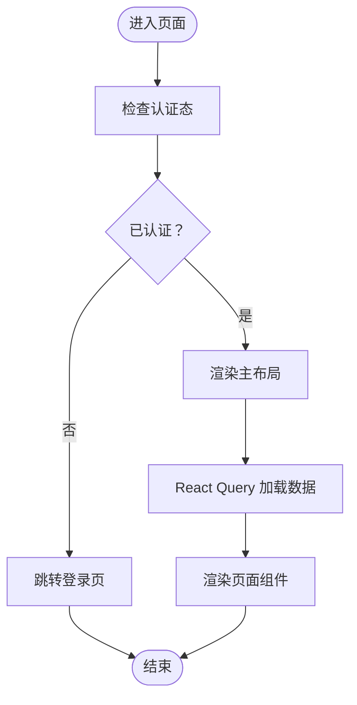
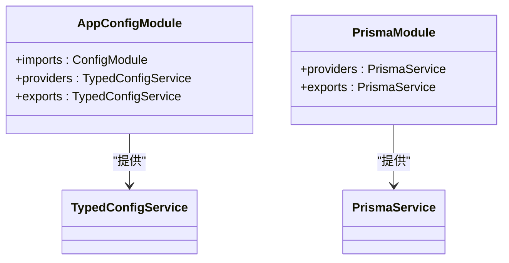
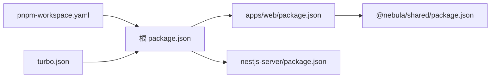

# 项目概述

<cite>
**本文引用的文件**
- [README.md](file://README.md)
- [package.json](file://package.json)
- [pnpm-workspace.yaml](file://pnpm-workspace.yaml)
- [turbo.json](file://turbo.json)
- [apps/nestjs-server/README.md](file://apps/nestjs-server/README.md)
- [apps/nestjs-server/src/main.ts](file://apps/nestjs-server/src/main.ts)
- [apps/nestjs-server/src/app.module.ts](file://apps/nestjs-server/src/app.module.ts)
- [apps/nestjs-server/src/modules/auth/auth.module.ts](file://apps/nestjs-server/src/modules/auth/auth.module.ts)
- [apps/nestjs-server/src/modules/user/user.module.ts](file://apps/nestjs-server/src/modules/user/user.module.ts)
- [apps/nestjs-server/src/config/config.module.ts](file://apps/nestjs-server/src/config/config.module.ts)
- [apps/nestjs-server/src/prisma/prisma.module.ts](file://apps/nestjs-server/src/prisma/prisma.module.ts)
- [apps/web/package.json](file://apps/web/package.json)
- [apps/web/src/main.tsx](file://apps/web/src/main.tsx)
- [apps/web/src/router/index.tsx](file://apps/web/src/router/index.tsx)
- [apps/web/src/store/auth.ts](file://apps/web/src/store/auth.ts)
- [apps/web/src/api/core/endpoints.ts](file://apps/web/src/api/core/endpoints.ts)
- [packages/shared/package.json](file://packages/shared/package.json)
</cite>

## 目录
1. [引言](#引言)
2. [项目结构](#项目结构)
3. [核心组件](#核心组件)
4. [架构总览](#架构总览)
5. [详细组件分析](#详细组件分析)
6. [依赖关系分析](#依赖关系分析)
7. [性能考量](#性能考量)
8. [故障排查指南](#故障排查指南)
9. [结论](#结论)
10. [附录](#附录)

## 引言
Nebula 是一个基于 Monorepo 的企业级全栈应用，旨在通过统一的工程化体系与一致的技术栈，实现前后端协同开发、共享能力复用与高效交付。项目采用 NestJS（后端）、React 19（前端）与 TypeScript，结合 Turbo、pnpm Workspace 与 Prisma，构建出可扩展、可观测、可维护的企业中后台解决方案。

本项目的核心目标包括：
- 统一工程化：以 Monorepo 管理多应用与共享包，提升协作效率与版本一致性。
- 企业级安全与稳定性：内置认证授权、速率限制、日志与异常过滤等基础设施。
- 开发体验：TypeScript 类型保障、Zod 校验、React Query 数据流、TailwindCSS 主题与状态管理。
- 可观测性：Swagger 文档、健康检查、查询缓存与日志工厂。
- 易于部署：Docker 支持与一键构建脚本。

## 项目结构
项目采用 Monorepo 结构，根目录通过 pnpm workspace 管理工作区，Turbo 负责任务编排与缓存加速。核心目录与职责如下：
- apps：多应用集合
  - nestjs-server：基于 NestJS 的后端服务，提供 REST API、认证授权、数据库访问与健康检查等能力。
  - web：基于 React 19 的前端应用，使用 React Router v7、TanStack React Query、Zustand 状态管理与 TailwindCSS。
- packages：共享包与工具链
  - shared：跨应用共享的类型、错误模型、Zod Schema 与工具函数。
  - eslint-config、typescript-config：统一的代码规范与 TS 配置。
- 根配置：package.json（Turbo 脚本）、turbo.json（任务依赖与缓存）、pnpm-workspace.yaml（工作区与仅构建依赖）。

图表来源
- [package.json:1-22](file://package.json#L1-L22)
- [turbo.json:1-26](file://turbo.json#L1-L26)
- [pnpm-workspace.yaml:1-12](file://pnpm-workspace.yaml#L1-L12)

章节来源
- [README.md:1-44](file://README.md#L1-L44)
- [package.json:1-22](file://package.json#L1-L22)
- [pnpm-workspace.yaml:1-12](file://pnpm-workspace.yaml#L1-L12)
- [turbo.json:1-26](file://turbo.json#L1-L26)

## 核心组件
- 后端服务（nestjs-server）
  - 应用入口与启动：负责 CORS、全局前缀、Swagger 文档、日志初始化与监听端口。
  - 应用模块：集中注册配置、缓存、限流、鉴权守卫、拦截器、验证管道与异常过滤器，并加载认证、用户、健康检查与日志模块。
  - 认证模块：集成 Passport/JWT，提供登录、刷新、登出、验证码与用户资料接口。
  - 用户模块：提供用户相关接口与服务。
  - 配置模块：全局加载环境变量与自定义配置，提供强类型配置服务。
  - 数据库模块：全局注入 Prisma 服务，提供 ORM 能力。
- 前端应用（web）
  - 应用入口：集成 React Router v7、React Query Provider、路由与全局样式。
  - 路由系统：登录页与受保护页面的嵌套路由，主布局与页面级组件。
  - 状态管理：Zustand 管理认证态（令牌与用户信息），持久化与调试中间件。
  - API 层：统一的端点常量与 React Query 客户端，模块化 API 与 Hooks。
- 共享包（shared）
  - 提供跨应用的类型导出、API 类型、Schema 与工具模块，支持 ESM/CJS 多格式分发。

章节来源
- [apps/nestjs-server/src/main.ts:1-47](file://apps/nestjs-server/src/main.ts#L1-L47)
- [apps/nestjs-server/src/app.module.ts:1-61](file://apps/nestjs-server/src/app.module.ts#L1-L61)
- [apps/nestjs-server/src/modules/auth/auth.module.ts:1-35](file://apps/nestjs-server/src/modules/auth/auth.module.ts#L1-L35)
- [apps/nestjs-server/src/modules/user/user.module.ts:1-11](file://apps/nestjs-server/src/modules/user/user.module.ts#L1-L11)
- [apps/nestjs-server/src/config/config.module.ts:1-20](file://apps/nestjs-server/src/config/config.module.ts#L1-L20)
- [apps/nestjs-server/src/prisma/prisma.module.ts:1-10](file://apps/nestjs-server/src/prisma/prisma.module.ts#L1-L10)
- [apps/web/src/main.tsx:1-20](file://apps/web/src/main.tsx#L1-L20)
- [apps/web/src/router/index.tsx:1-51](file://apps/web/src/router/index.tsx#L1-L51)
- [apps/web/src/store/auth.ts:1-64](file://apps/web/src/store/auth.ts#L1-L64)
- [apps/web/src/api/core/endpoints.ts:1-21](file://apps/web/src/api/core/endpoints.ts#L1-L21)
- [packages/shared/package.json:1-80](file://packages/shared/package.json#L1-L80)

## 架构总览
下图展示了 Nebula 的端到端交互：浏览器发起请求至前端路由，前端通过 React Query 调用后端 API；后端经由全局守卫与拦截器处理请求，调用服务层并访问数据库；Swagger 提供接口文档；Prisma 管理数据模型与迁移；配置模块提供统一的运行时配置。

图表来源
- [apps/web/src/main.tsx:1-20](file://apps/web/src/main.tsx#L1-L20)
- [apps/web/src/router/index.tsx:1-51](file://apps/web/src/router/index.tsx#L1-L51)
- [apps/web/src/store/auth.ts:1-64](file://apps/web/src/store/auth.ts#L1-L64)
- [apps/web/src/api/core/endpoints.ts:1-21](file://apps/web/src/api/core/endpoints.ts#L1-L21)
- [apps/nestjs-server/src/app.module.ts:1-61](file://apps/nestjs-server/src/app.module.ts#L1-L61)
- [apps/nestjs-server/src/main.ts:1-47](file://apps/nestjs-server/src/main.ts#L1-L47)
- [apps/nestjs-server/src/prisma/prisma.module.ts:1-10](file://apps/nestjs-server/src/prisma/prisma.module.ts#L1-L10)
- [apps/nestjs-server/src/config/config.module.ts:1-20](file://apps/nestjs-server/src/config/config.module.ts#L1-L20)

## 详细组件分析

### 后端应用启动流程
后端启动时完成以下关键步骤：创建 Nest 应用实例、启用关闭钩子、加载配置与日志、开启 CORS、设置全局前缀、按需启用 Swagger 文档、启动监听并输出运行日志。

图表来源
- [apps/nestjs-server/src/main.ts:1-47](file://apps/nestjs-server/src/main.ts#L1-L47)

章节来源
- [apps/nestjs-server/src/main.ts:1-47](file://apps/nestjs-server/src/main.ts#L1-L47)

### 认证模块与 JWT 流程
认证模块整合 Passport 与 JWT，提供登录、刷新、登出与用户资料接口；JWT 策略从配置中读取密钥与过期时间；用户模块提供用户服务与控制器。

图表来源
- [apps/nestjs-server/src/modules/auth/auth.module.ts:1-35](file://apps/nestjs-server/src/modules/auth/auth.module.ts#L1-L35)
- [apps/nestjs-server/src/modules/user/user.module.ts:1-11](file://apps/nestjs-server/src/modules/user/user.module.ts#L1-L11)

章节来源
- [apps/nestjs-server/src/modules/auth/auth.module.ts:1-35](file://apps/nestjs-server/src/modules/auth/auth.module.ts#L1-L35)
- [apps/nestjs-server/src/modules/user/user.module.ts:1-11](file://apps/nestjs-server/src/modules/user/user.module.ts#L1-L11)

### 前端路由与状态管理
前端使用 React Router v7 管理路由，RequireAuth 实现受保护页面；Zustand 管理认证态（令牌与用户），持久化存储在本地；React Query 管理数据流与缓存；API 层统一端点常量。

图表来源
- [apps/web/src/router/index.tsx:1-51](file://apps/web/src/router/index.tsx#L1-L51)
- [apps/web/src/store/auth.ts:1-64](file://apps/web/src/store/auth.ts#L1-L64)
- [apps/web/src/main.tsx:1-20](file://apps/web/src/main.tsx#L1-L20)
- [apps/web/src/api/core/endpoints.ts:1-21](file://apps/web/src/api/core/endpoints.ts#L1-L21)

章节来源
- [apps/web/src/router/index.tsx:1-51](file://apps/web/src/router/index.tsx#L1-L51)
- [apps/web/src/store/auth.ts:1-64](file://apps/web/src/store/auth.ts#L1-L64)
- [apps/web/src/main.tsx:1-20](file://apps/web/src/main.tsx#L1-L20)
- [apps/web/src/api/core/endpoints.ts:1-21](file://apps/web/src/api/core/endpoints.ts#L1-L21)

### 配置与数据库模块
- 配置模块：全局注册 ConfigModule，加载自定义配置，忽略生产环境的 .env 文件，提供强类型配置服务。
- 数据库模块：全局注入 Prisma 服务，提供 ORM 能力与数据访问。

图表来源
- [apps/nestjs-server/src/config/config.module.ts:1-20](file://apps/nestjs-server/src/config/config.module.ts#L1-L20)
- [apps/nestjs-server/src/prisma/prisma.module.ts:1-10](file://apps/nestjs-server/src/prisma/prisma.module.ts#L1-L10)

章节来源
- [apps/nestjs-server/src/config/config.module.ts:1-20](file://apps/nestjs-server/src/config/config.module.ts#L1-L20)
- [apps/nestjs-server/src/prisma/prisma.module.ts:1-10](file://apps/nestjs-server/src/prisma/prisma.module.ts#L1-L10)

## 依赖关系分析
- 工作区与包管理：pnpm workspace 将 apps 与 packages 纳入工作区；onlyBuiltDependencies 限定需要预构建的二进制依赖，减少安装体积。
- 任务编排：Turbo 为 build/dev/lint/typecheck/test/clean 等任务定义依赖与缓存策略，确保增量构建与并行执行。
- 应用依赖：前端应用依赖 @nebula/shared 与第三方库（React 19、React Router、React Query、Zustand、TailwindCSS 等）；后端依赖 NestJS 生态与 Prisma。

图表来源
- [pnpm-workspace.yaml:1-12](file://pnpm-workspace.yaml#L1-L12)
- [turbo.json:1-26](file://turbo.json#L1-L26)
- [package.json:1-22](file://package.json#L1-L22)
- [apps/web/package.json:1-44](file://apps/web/package.json#L1-L44)
- [packages/shared/package.json:1-80](file://packages/shared/package.json#L1-L80)

章节来源
- [pnpm-workspace.yaml:1-12](file://pnpm-workspace.yaml#L1-L12)
- [turbo.json:1-26](file://turbo.json#L1-L26)
- [package.json:1-22](file://package.json#L1-L22)
- [apps/web/package.json:1-44](file://apps/web/package.json#L1-L44)
- [packages/shared/package.json:1-80](file://packages/shared/package.json#L1-L80)

## 性能考量
- 构建与缓存：Turbo 通过任务依赖与输出缓存，避免重复构建；仅对变更模块进行增量编译。
- 运行时优化：后端启用限流守卫与日志拦截器，降低无效请求与提高可观测性；前端使用 React Query 缓存与懒加载，减少网络与渲染压力。
- 依赖精简：pnpm onlyBuiltDependencies 仅预构建必要二进制，缩短安装时间与占用空间。
- 开发体验：Vite 与 React 19 提供快速热更新；TypeScript 严格模式与 ESLint 规范保证质量。

## 故障排查指南
- 启动失败
  - 检查后端端口占用与 CORS 配置；确认 Swagger 是否启用及文档路径。
  - 查看日志输出与异常过滤器是否捕获错误。
- 认证问题
  - 核对 JWT 密钥与过期时间配置；确认前端是否正确保存与传递令牌。
  - 使用 React Query Devtools 观察请求状态与错误。
- 数据库问题
  - 确认 Prisma 服务是否正常注入；检查迁移与种子脚本是否执行。
- 环境变量
  - 生产环境忽略 .env 文件，确保通过配置模块正确加载变量。

章节来源
- [apps/nestjs-server/src/main.ts:1-47](file://apps/nestjs-server/src/main.ts#L1-L47)
- [apps/nestjs-server/src/app.module.ts:1-61](file://apps/nestjs-server/src/app.module.ts#L1-L61)
- [apps/web/src/store/auth.ts:1-64](file://apps/web/src/store/auth.ts#L1-L64)

## 结论
Nebula 通过 Monorepo 与统一技术栈，为企业级全栈应用提供了高内聚、低耦合的工程化基础。后端以 NestJS 为核心，结合 Prisma、JWT、限流与日志等企业级能力；前端以 React 19 为基础，配合 React Router、React Query 与 Zustand，形成现代化的数据流与状态管理模式。借助 Turbo 与 pnpm，项目具备优秀的开发体验与构建性能。未来可在现有基础上扩展更多业务域模块、完善测试覆盖与可观测性方案，并持续优化 DX 与运维自动化。

## 附录
- 快速开始
  - 安装依赖：使用 pnpm 安装工作区依赖。
  - 启动开发：执行根脚本启动所有应用或分别启动 web 与 nestjs-server。
  - 构建打包：统一构建或按需构建。
- 命令参考
  - 构建：build
  - 开发：dev、dev:web、dev:server
  - 代码检查：lint、typecheck
  - 测试：test
  - 清理：clean
  - 格式化：format

章节来源
- [README.md:17-44](file://README.md#L17-L44)
- [package.json:5-15](file://package.json#L5-L15)
- [apps/nestjs-server/README.md:28-68](file://apps/nestjs-server/README.md#L28-L68)