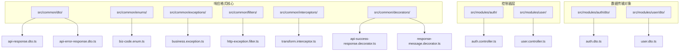
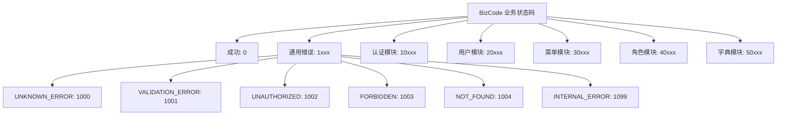
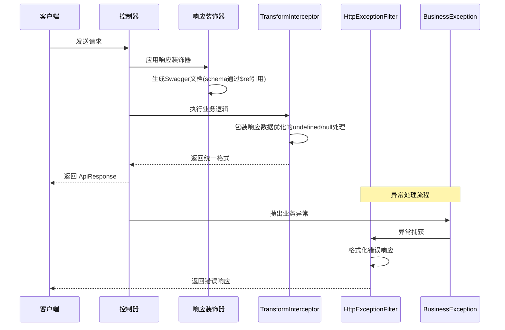
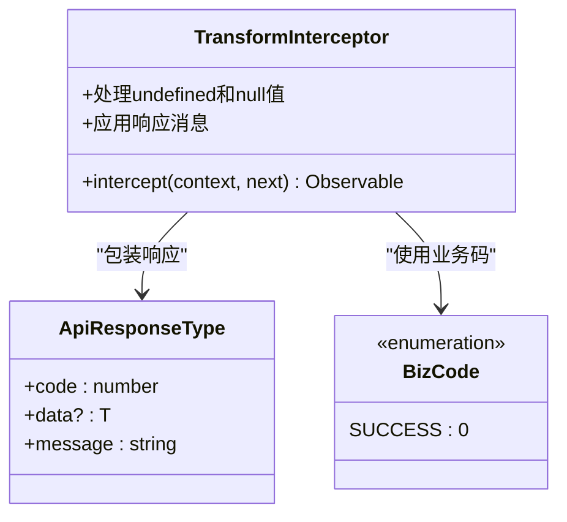
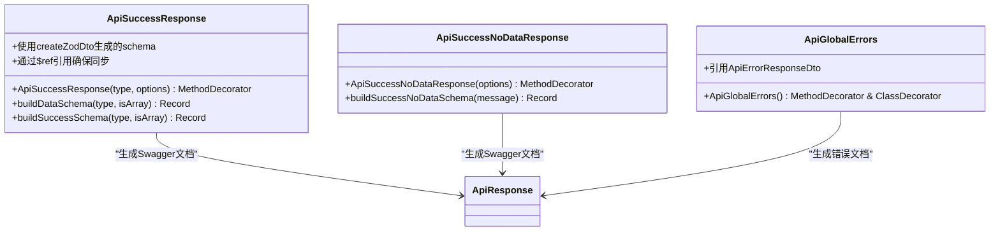
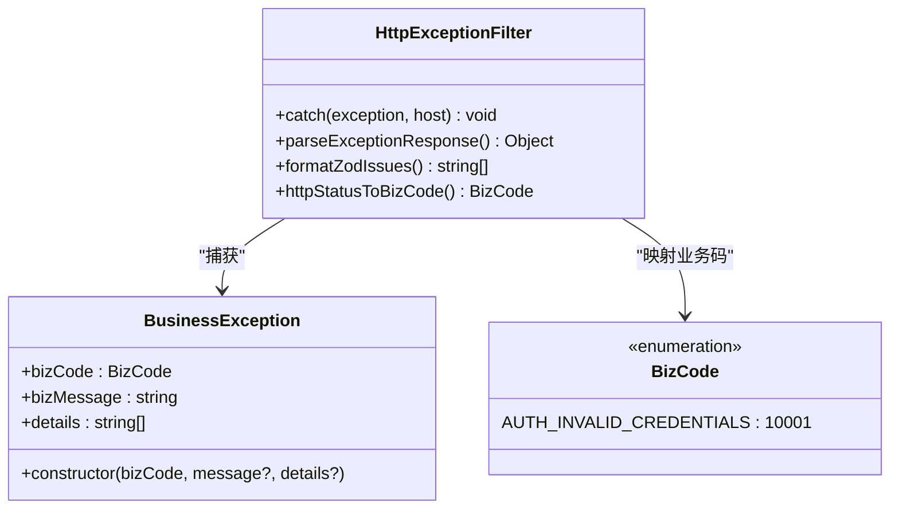
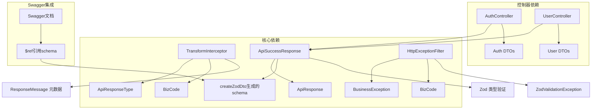

# API 响应格式规范

<cite>
**本文档引用的文件**
- [api-response.dto.ts](file://src/common/dto/api-response.dto.ts)
- [api-error-response.dto.ts](file://src/common/dto/api-error-response.dto.ts)
- [biz-code.enum.ts](file://src/common/enums/biz-code.enum.ts)
- [api-success-response.decorator.ts](file://src/common/decorators/api-success-response.decorator.ts)
- [response-message.decorator.ts](file://src/common/decorators/response-message.decorator.ts)
- [business.exception.ts](file://src/common/exceptions/business.exception.ts)
- [http-exception.filter.ts](file://src/common/filters/http-exception.filter.ts)
- [transform.interceptor.ts](file://src/common/interceptors/transform.interceptor.ts)
- [auth.controller.ts](file://src/modules/auth/auth.controller.ts)
- [user.controller.ts](file://src/modules/user/user.controller.ts)
- [auth.dto.ts](file://src/modules/auth/dto/auth.dto.ts)
- [user.dto.ts](file://src/modules/user/dto/user.dto.ts)
- [transform.interceptor.spec.ts](file://src/common/interceptors/transform.interceptor.spec.ts)
- [http-exception.filter.spec.ts](file://src/common/filters/http-exception.filter.spec.ts)
</cite>

## 更新摘要
**所做更改**
- 更新了响应装饰器与Swagger文档集成部分，强调使用createZodDto生成的schema通过$ref引用
- 优化了响应拦截器的数据字段处理逻辑，改进了undefined和null的处理
- 新增了Swagger文档与业务DTO同步的说明
- 更新了架构图和组件分析以反映最新的集成方式

## 目录
1. [简介](#简介)
2. [项目结构](#项目结构)
3. [核心组件](#核心组件)
4. [架构概览](#架构概览)
5. [详细组件分析](#详细组件分析)
6. [依赖关系分析](#依赖关系分析)
7. [性能考虑](#性能考虑)
8. [故障排除指南](#故障排除指南)
9. [结论](#结论)
10. [附录](#附录)

## 简介

本规范文档定义了系统统一的 API 响应格式标准，确保所有接口返回一致的数据结构和错误处理机制。该规范基于 NestJS 框架实现，采用响应装饰器、拦截器和过滤器的组合模式，提供标准化的成功响应、错误响应和业务异常处理。

**更新** 系统现已改进了API成功响应装饰器与Swagger文档的集成，现在使用createZodDto生成的schema通过$ref引用，确保文档与业务DTO完全同步。响应拦截器也优化了数据字段处理逻辑，提供了更精确的undefined和null值处理。

系统采用业务状态码与 HTTP 状态码分离的设计理念，通过业务状态码 BizCode 实现更精确的错误分类和国际化支持。所有响应数据均经过统一的转换和验证，确保客户端能够可靠地解析和处理 API 响应。

## 项目结构

系统响应格式规范涉及以下关键目录和文件：



**图表来源**
- [api-response.dto.ts:1-16](file://src/common/dto/api-response.dto.ts#L1-L16)
- [biz-code.enum.ts:1-171](file://src/common/enums/biz-code.enum.ts#L1-L171)
- [transform.interceptor.ts:1-47](file://src/common/interceptors/transform.interceptor.ts#L1-L47)

**章节来源**
- [api-response.dto.ts:1-16](file://src/common/dto/api-response.dto.ts#L1-L16)
- [biz-code.enum.ts:1-171](file://src/common/enums/biz-code.enum.ts#L1-L171)
- [transform.interceptor.ts:1-47](file://src/common/interceptors/transform.interceptor.ts#L1-L47)

## 核心组件

### 统一响应结构

系统采用标准化的响应结构，确保所有 API 接口返回一致的数据格式：

| 字段名 | 类型 | 必填 | 描述 | 示例值 |
|--------|------|------|------|--------|
| code | number | 是 | 业务状态码 | 0 |
| data | T | 否 | 业务数据，可能为 null 或具体对象 | { id: 1, name: "测试" } |
| message | string | 是 | 响应消息 | "操作成功" |

**更新** 响应结构现在通过Swagger装饰器直接定义，而非依赖特定DTO的职责。外层包装结构由TransformInterceptor在运行时统一构造，确保与Swagger文档保持一致。

### 错误响应格式

错误响应采用统一的错误结构，支持详细的错误信息：

| 字段名 | 类型 | 必填 | 描述 | 示例值 |
|--------|------|------|------|--------|
| code | number | 是 | 业务错误码 | 1001 |
| message | string | 是 | 错误消息 | "请求参数校验失败" |
| details | string[] | 否 | 错误详情列表 | ["邮箱格式不正确", "密码至少6个字符"] |

### 业务状态码规范

系统定义了完整的业务状态码体系，采用分层编码规则：



**图表来源**
- [biz-code.enum.ts:13-78](file://src/common/enums/biz-code.enum.ts#L13-L78)

**章节来源**
- [api-response.dto.ts:11-15](file://src/common/dto/api-response.dto.ts#L11-L15)
- [biz-code.enum.ts:13-78](file://src/common/enums/biz-code.enum.ts#L13-L78)

## 架构概览

系统采用拦截器、装饰器和过滤器的协作架构，实现统一的响应格式处理：



**更新** 架构图反映了最新的集成改进：响应装饰器现在直接生成Swagger文档，使用createZodDto生成的schema通过$ref引用，确保与业务DTO完全同步。

**图表来源**
- [transform.interceptor.ts:21-46](file://src/common/interceptors/transform.interceptor.ts#L21-L46)
- [api-success-response.decorator.ts:94-108](file://src/common/decorators/api-success-response.decorator.ts#L94-L108)
- [http-exception.filter.ts:28-78](file://src/common/filters/http-exception.filter.ts#L28-L78)

## 详细组件分析

### 响应拦截器 TransformInterceptor

TransformInterceptor 是系统响应格式的核心组件，负责将所有成功的 API 响应包装为统一格式：



**更新** 拦截器现在优化了数据字段处理逻辑，通过改进的条件判断确保undefined和null值都能正确处理。空值处理更加精确，避免了之前可能出现的边界情况。

拦截器的主要功能：
1. **统一响应包装**：将控制器返回的数据包装为 `{ code, data, message }` 结构
2. **优化的空值处理**：改进的条件判断确保undefined和null都被正确转换为null数据
3. **消息定制**：支持通过元数据设置自定义响应消息
4. **业务码应用**：默认使用 `BizCode.SUCCESS` (0)

**章节来源**
- [transform.interceptor.ts:15-46](file://src/common/interceptors/transform.interceptor.ts#L15-L46)
- [response-message.decorator.ts:1-6](file://src/common/decorators/response-message.decorator.ts#L1-L6)

### 响应装饰器系统

响应装饰器提供了声明式的 API 响应格式定义能力：



**更新** 响应装饰器系统现已完全集成Swagger文档生成，使用createZodDto生成的schema并通过$ref引用，确保Swagger文档与业务DTO始终保持同步。这解决了之前可能出现的文档与实现不一致的问题。

装饰器的功能特性：
1. **类型安全**：支持泛型类型定义，确保响应数据结构正确
2. **数组支持**：自动识别单对象和数组类型的响应
3. **Swagger 集成**：自动生成 API 文档结构，使用$ref引用确保同步
4. **消息定制**：支持设置自定义响应消息
5. **Zod schema 集成**：直接使用createZodDto生成的schema

**章节来源**
- [api-success-response.decorator.ts:94-156](file://src/common/decorators/api-success-response.decorator.ts#L94-L156)

### 业务异常处理

BusinessException 提供了统一的业务异常处理机制：



**图表来源**
- [business.exception.ts:16-41](file://src/common/exceptions/business.exception.ts#L16-L41)
- [http-exception.filter.ts:24-218](file://src/common/filters/http-exception.filter.ts#L24-L218)

异常处理流程：
1. **业务异常捕获**：识别并处理 BusinessException
2. **HTTP 状态码映射**：根据业务码映射到相应 HTTP 状态
3. **错误详情处理**：支持字段级校验错误的详细信息
4. **日志记录**：记录异常信息便于调试和监控

**章节来源**
- [business.exception.ts:16-41](file://src/common/exceptions/business.exception.ts#L16-L41)
- [http-exception.filter.ts:24-218](file://src/common/filters/http-exception.filter.ts#L24-L218)

### 控制器集成示例

系统中的控制器展示了响应格式的实际应用：

#### 认证模块控制器

认证模块使用了多种响应装饰器来定义不同的响应格式：

| 方法 | 响应装饰器 | HTTP 状态码 | 响应类型 | 说明 |
|------|------------|-------------|----------|------|
| getCaptcha | ApiSuccessResponse(CaptchaResponseDto) | 200 | 验证码信息 | 获取图形验证码 |
| register | ApiSuccessResponse(TokenResponseDto) | 201 | 令牌信息 | 用户注册并登录 |
| login | ApiSuccessResponse(TokenResponseDto) | 200 | 令牌信息 | 用户登录 |
| logout | ApiSuccessNoDataResponse | 200 | 无数据 | 退出登录 |
| getProfile | ApiSuccessResponse(ProfileResponseDto) | 200 | 用户信息 | 获取用户资料 |

#### 用户模块控制器

用户模块展示了 CRUD 操作的标准响应格式：

| 方法 | 响应装饰器 | HTTP 状态码 | 响应类型 | 说明 |
|------|------------|-------------|----------|------|
| create | ApiSuccessResponse(UserResponseDto) | 201 | 用户信息 | 创建用户 |
| findAll | ApiSuccessResponse(UserResponseDto, { isArray: true }) | 200 | 用户列表 | 获取用户列表 |
| findOne | ApiSuccessResponse(UserResponseDto) | 200 | 单个用户 | 根据ID获取用户 |
| update | ApiSuccessResponse(UserResponseDto) | 200 | 更新后的用户 | 更新用户信息 |
| remove | ApiSuccessNoDataResponse | 200 | 无数据 | 删除用户 |

**章节来源**
- [auth.controller.ts:46-129](file://src/modules/auth/auth.controller.ts#L46-L129)
- [user.controller.ts:33-88](file://src/modules/user/user.controller.ts#L33-L88)

## 依赖关系分析

系统响应格式规范的依赖关系如下：



**更新** 依赖关系图反映了最新的集成改进：响应装饰器现在直接依赖createZodDto生成的schema，并通过$ref引用确保Swagger文档与业务DTO同步。

**图表来源**
- [transform.interceptor.ts:10-12](file://src/common/interceptors/transform.interceptor.ts#L10-L12)
- [api-success-response.decorator.ts:100-108](file://src/common/decorators/api-success-response.decorator.ts#L100-L108)
- [http-exception.filter.ts:9-12](file://src/common/filters/http-exception.filter.ts#L9-L12)

**章节来源**
- [transform.interceptor.ts:10-12](file://src/common/interceptors/transform.interceptor.ts#L10-L12)
- [api-success-response.decorator.ts:100-108](file://src/common/decorators/api-success-response.decorator.ts#L100-L108)
- [http-exception.filter.ts:9-12](file://src/common/filters/http-exception.filter.ts#L9-L12)

## 性能考虑

系统响应格式规范在设计时充分考虑了性能因素：

1. **零拷贝优化**：拦截器采用流式处理，避免不必要的数据复制
2. **内存效率**：统一的响应结构减少了重复的对象创建
3. **缓存策略**：业务码到 HTTP 状态码的映射使用对象字面量实现快速查找
4. **延迟加载**：响应消息的国际化支持采用按需加载机制
5. **优化的空值处理**：改进的条件判断减少了不必要的类型检查

**更新** 性能考虑现在包含了拦截器优化的空值处理逻辑，通过更精确的条件判断提高了处理效率。

## 故障排除指南

### 常见问题及解决方案

#### 响应格式不符合预期

**问题**：API 响应缺少必要的字段或包含多余字段

**解决方案**：
1. 检查控制器是否正确应用了响应装饰器
2. 确认拦截器是否正常工作
3. 验证 DTO 定义是否符合预期

#### 业务异常未正确处理

**问题**：业务异常返回了错误的 HTTP 状态码

**解决方案**：
1. 确保使用 BusinessException 而不是普通 HttpException
2. 检查 BizCode 是否在枚举中正确定义
3. 验证 getHttpStatus 函数的映射关系

#### Swagger 文档不正确

**问题**：API 文档显示的响应格式与实际不符

**解决方案**：
1. 检查响应装饰器的类型参数是否正确
2. 确认 isArray 参数是否正确设置
3. 验证 DTO 的 Zod schema 定义
4. **新增** 确认createZodDto生成的schema是否正确生成

#### 响应拦截器数据处理异常

**问题**：undefined或null值处理不正确

**解决方案**：
1. 检查拦截器的条件判断逻辑
2. 确认数据类型转换是否符合预期
3. 验证响应消息的设置是否正确

**章节来源**
- [transform.interceptor.spec.ts:22-109](file://src/common/interceptors/transform.interceptor.spec.ts#L22-L109)
- [http-exception.filter.spec.ts:27-136](file://src/common/filters/http-exception.filter.spec.ts#L27-L136)

## 结论

本 API 响应格式规范通过拦截器、装饰器和过滤器的协同工作，实现了统一、标准化的响应处理机制。系统采用业务状态码与 HTTP 状态码分离的设计，提供了灵活的错误处理能力和良好的扩展性。

**更新** 最新的改进显著提升了系统的可靠性和维护性：响应装饰器与Swagger文档的深度集成确保了文档与实现的完全同步，而拦截器优化的数据处理逻辑则提高了系统的健壮性。

规范的核心优势包括：
1. **一致性**：所有 API 接口返回统一的响应格式
2. **可维护性**：通过装饰器和拦截器实现声明式编程
3. **可扩展性**：支持业务码的动态扩展和国际化
4. **可观测性**：完善的日志记录和错误追踪机制
5. **文档同步性**：Swagger文档与业务DTO实时同步

## 附录

### 响应示例

#### 成功响应示例

**单对象响应**：
```json
{
  "code": 0,
  "data": {
    "id": "user-id",
    "email": "user@example.com",
    "username": "testuser"
  },
  "message": "操作成功"
}
```

**数组响应**：
```json
{
  "code": 0,
  "data": [
    {
      "id": "user-1",
      "email": "user1@example.com"
    },
    {
      "id": "user-2", 
      "email": "user2@example.com"
    }
  ],
  "message": "操作成功"
}
```

**无数据响应**：
```json
{
  "code": 0,
  "data": null,
  "message": "退出成功"
}
```

#### 业务异常响应示例

**字段校验错误**：
```json
{
  "code": 1001,
  "message": "请求参数校验失败",
  "details": [
    "邮箱格式不正确",
    "密码至少6个字符"
  ]
}
```

**业务逻辑错误**：
```json
{
  "code": 10001,
  "message": "凭证无效（邮箱或密码错误）"
}
```

#### 系统异常响应示例

**服务器内部错误**：
```json
{
  "code": 1099,
  "message": "服务器内部错误"
}
```

**资源不存在**：
```json
{
  "code": 1004,
  "message": "资源不存在"
}
```

### API 版本兼容性

系统采用渐进式升级策略，确保向后兼容性：

1. **语义版本控制**：遵循语义化版本号规则
2. **弃用策略**：提供明确的弃用通知和迁移路径
3. **向后兼容**：新增字段时保持现有字段的兼容性
4. **文档更新**：及时更新 API 文档和变更日志

**更新** 版本兼容性现在包含了对Swagger文档同步改进的向后兼容性保证。

### 迁移指南

从旧版本迁移到新响应格式的步骤：

1. **更新依赖**：升级相关的包到最新版本
2. **检查装饰器**：确认所有控制器都正确应用了响应装饰器
3. **测试异常处理**：验证业务异常的处理逻辑
4. **更新客户端**：调整客户端代码以适配新的响应格式
5. **监控指标**：观察系统指标确保迁移成功
6. **验证Swagger文档**：确认Swagger文档与业务DTO同步更新

**更新** 迁移指南新增了Swagger文档验证和Zod schema同步的相关步骤。