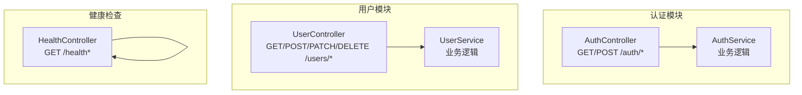
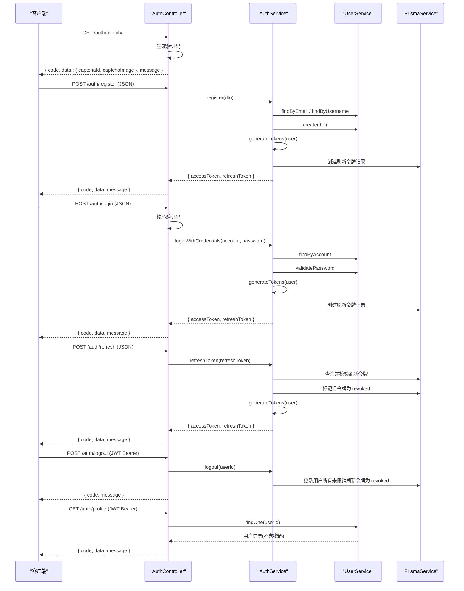
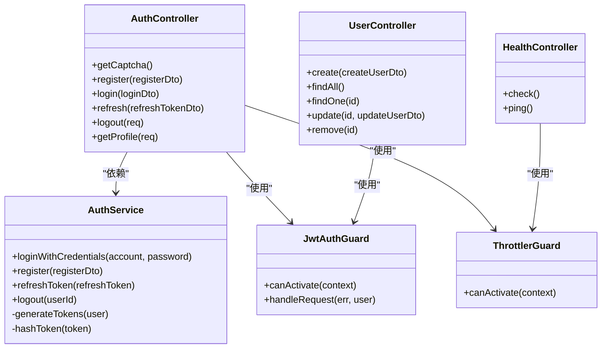

# API 接口文档

<cite>
**本文引用的文件**
- [src/modules/auth/auth.controller.ts](file://src/modules/auth/auth.controller.ts)
- [src/modules/auth/auth.service.ts](file://src/modules/auth/auth.service.ts)
- [src/modules/auth/dto/auth.dto.ts](file://src/modules/auth/dto/auth.dto.ts)
- [src/modules/user/user.controller.ts](file://src/modules/user/user.controller.ts)
- [src/modules/user/dto/user.dto.ts](file://src/modules/user/dto/user.dto.ts)
- [src/modules/health/health.controller.ts](file://src/modules/health/health.controller.ts)
- [src/common/decorators/api-success-response.decorator.ts](file://src/common/decorators/api-success-response.decorator.ts)
- [src/common/dto/api-response.dto.ts](file://src/common/dto/api-response.dto.ts)
- [src/common/dto/api-error-response.dto.ts](file://src/common/dto/api-error-response.dto.ts)
- [src/common/guards/jwt-auth.guard.ts](file://src/common/guards/jwt-auth.guard.ts)
- [src/common/guards/throttler.guard.ts](file://src/common/guards/throttler.guard.ts)
- [src/common/enums/biz-code.enum.ts](file://src/common/enums/biz-code.enum.ts)
- [src/common/exceptions/business.exception.ts](file://src/common/exceptions/business.exception.ts)
- [src/common/filters/http-exception.filter.ts](file://src/common/filters/http-exception.filter.ts)
- [src/common/interceptors/transform.interceptor.ts](file://src/common/interceptors/transform.interceptor.ts)
</cite>

## 目录
1. [简介](#简介)
2. [项目结构](#项目结构)
3. [核心组件](#核心组件)
4. [架构总览](#架构总览)
5. [详细组件分析](#详细组件分析)
6. [依赖关系分析](#依赖关系分析)
7. [性能与安全考量](#性能与安全考量)
8. [故障排查指南](#故障排查指南)
9. [结论](#结论)
10. [附录](#附录)

## 简介
本文件为该项目的公共 API 接口文档，覆盖认证接口（登录、注册、刷新令牌、登出）、用户管理接口（获取资料、更新信息、创建、查询、删除）以及健康检查接口。文档遵循 RESTful 设计规范，明确 HTTP 方法、URL 模式、请求参数、响应格式、状态码与错误处理策略，并提供认证流程、速率限制与安全建议。

## 项目结构
- 认证模块：负责验证码、注册、登录、刷新令牌、登出与获取当前用户资料。
- 用户模块：提供用户增删改查能力，支持分页与条件查询（由服务层实现）。
- 健康检查模块：提供服务健康状态与 Ping 接口，便于监控与运维。

图表来源
- [src/modules/auth/auth.controller.ts:35-128](file://src/modules/auth/auth.controller.ts#L35-L128)
- [src/modules/auth/auth.service.ts:14-161](file://src/modules/auth/auth.service.ts#L14-L161)
- [src/modules/user/user.controller.ts:25-87](file://src/modules/user/user.controller.ts#L25-L87)
- [src/modules/health/health.controller.ts:8-85](file://src/modules/health/health.controller.ts#L8-L85)

章节来源
- [src/modules/auth/auth.controller.ts:35-128](file://src/modules/auth/auth.controller.ts#L35-L128)
- [src/modules/user/user.controller.ts:25-87](file://src/modules/user/user.controller.ts#L25-L87)
- [src/modules/health/health.controller.ts:8-85](file://src/modules/health/health.controller.ts#L8-L85)

## 核心组件
- 统一响应结构：所有成功响应采用统一结构 { code, data, message }，其中 code=0 表示成功，data 可为空（表现为 null），message 为业务提示。
- 统一错误结构：所有错误响应采用 { code, message, details? } 结构，details 用于展示字段级校验错误。
- 业务码体系：定义了从 0 开始的成功码及各模块的错误码区间，错误码与 HTTP 状态码映射规则明确。
- 认证守卫：基于 JWT 的认证守卫，结合 @Public 装饰器控制公开接口。
- 速率限制守卫：基于 @nestjs/throttler 的守卫，支持跳过限制的装饰器。
- 成功响应装饰器：自动注入 Swagger 文档的统一成功响应结构，支持单对象与数组两种模式。
- 异常过滤器：将业务异常与通用 HttpException 映射为统一错误响应结构，并记录日志。

章节来源
- [src/common/dto/api-response.dto.ts:9-39](file://src/common/dto/api-response.dto.ts#L9-L39)
- [src/common/dto/api-error-response.dto.ts:4-13](file://src/common/dto/api-error-response.dto.ts#L4-L13)
- [src/common/enums/biz-code.enum.ts:13-170](file://src/common/enums/biz-code.enum.ts#L13-L170)
- [src/common/guards/jwt-auth.guard.ts:17-45](file://src/common/guards/jwt-auth.guard.ts#L17-L45)
- [src/common/guards/throttler.guard.ts:10-32](file://src/common/guards/throttler.guard.ts#L10-L32)
- [src/common/decorators/api-success-response.decorator.ts:88-128](file://src/common/decorators/api-success-response.decorator.ts#L88-L128)
- [src/common/filters/http-exception.filter.ts:24-78](file://src/common/filters/http-exception.filter.ts#L24-L78)
- [src/common/interceptors/transform.interceptor.ts:14-40](file://src/common/interceptors/transform.interceptor.ts#L14-L40)

## 架构总览
以下序列图展示了认证流程（登录、注册、刷新令牌、登出）与用户资料获取的整体交互。

图表来源
- [src/modules/auth/auth.controller.ts:44-127](file://src/modules/auth/auth.controller.ts#L44-L127)
- [src/modules/auth/auth.service.ts:29-161](file://src/modules/auth/auth.service.ts#L29-L161)
- [src/modules/user/user.controller.ts:116-127](file://src/modules/user/user.controller.ts#L116-L127)

## 详细组件分析

### 认证接口

- 获取验证码
  - 方法与路径：GET /auth/captcha
  - 认证要求：无需认证
  - 速率限制：每 60 秒最多 10 次
  - 请求参数：无
  - 响应数据：{ captchaId, captchaImage }
  - 状态码：200
  - 失败场景：无
  - 示例调用：见“附录”

- 用户注册
  - 方法与路径：POST /auth/register
  - 认证要求：无需认证
  - 速率限制：默认受全局速率限制
  - 请求体（JSON）：{ email, username, password, name? }
  - 响应数据：{ accessToken, refreshToken }
  - 状态码：201（成功）
  - 失败场景：
    - 邮箱已注册：409
    - 用户名已占用：409
    - 参数校验失败：400
  - 示例调用：见“附录”

- 用户登录
  - 方法与路径：POST /auth/login
  - 认证要求：无需认证
  - 速率限制：每 60 秒最多 5 次
  - 请求体（JSON）：{ account, password, captchaId, captchaCode }
  - 响应数据：{ accessToken, refreshToken }
  - 状态码：200（成功）
  - 失败场景：
    - 凭证无效：401
    - 验证码不存在/过期：404
    - 验证码过期：400
    - 验证码错误：400
    - 参数校验失败：400
  - 示例调用：见“附录”

- 刷新访问令牌
  - 方法与路径：POST /auth/refresh
  - 认证要求：无需认证
  - 请求体（JSON）：{ refreshToken }
  - 响应数据：{ accessToken, refreshToken }
  - 状态码：200（成功）
  - 失败场景：
    - 刷新令牌无效或已过期：401
    - 参数校验失败：400
  - 示例调用：见“附录”

- 退出登录
  - 方法与路径：POST /auth/logout
  - 认证要求：需要 JWT 令牌
  - 请求头：Authorization: Bearer <accessToken>
  - 请求体：无
  - 响应数据：无（返回 { code, message }）
  - 状态码：200（成功）
  - 失败场景：
    - 未提供有效令牌：401
  - 示例调用：见“附录”

- 获取当前用户信息
  - 方法与路径：GET /auth/profile
  - 认证要求：需要 JWT 令牌
  - 请求头：Authorization: Bearer <accessToken>
  - 请求体：无
  - 响应数据：{ id, email, username, name?, createdAt, updatedAt }
  - 状态码：200（成功）
  - 失败场景：
    - 未提供有效令牌：401
  - 示例调用：见“附录”

章节来源
- [src/modules/auth/auth.controller.ts:44-127](file://src/modules/auth/auth.controller.ts#L44-L127)
- [src/modules/auth/auth.service.ts:29-161](file://src/modules/auth/auth.service.ts#L29-L161)
- [src/modules/auth/dto/auth.dto.ts:44-89](file://src/modules/auth/dto/auth.dto.ts#L44-L89)
- [src/common/guards/jwt-auth.guard.ts:17-45](file://src/common/guards/jwt-auth.guard.ts#L17-L45)
- [src/common/guards/throttler.guard.ts:10-32](file://src/common/guards/throttler.guard.ts#L10-L32)

### 用户管理接口

- 创建用户
  - 方法与路径：POST /users
  - 认证要求：需要 JWT 令牌
  - 请求体（JSON）：{ email, username, password, name? }
  - 响应数据：{ id, email, username, name?, isActive, createdAt, updatedAt }
  - 状态码：201（成功）
  - 失败场景：
    - 用户邮箱已存在：409
    - 参数校验失败：400
  - 示例调用：见“附录”

- 获取所有用户
  - 方法与路径：GET /users
  - 认证要求：需要 JWT 令牌
  - 请求体：无
  - 响应数据：用户对象数组（同上字段）
  - 状态码：200（成功）
  - 示例调用：见“附录”

- 根据 ID 获取用户
  - 方法与路径：GET /users/:id
  - 认证要求：需要 JWT 令牌
  - 路径参数：id（字符串）
  - 响应数据：用户对象（同上字段）
  - 状态码：200（成功）
  - 失败场景：
    - 用户不存在：404
  - 示例调用：见“附录”

- 更新用户
  - 方法与路径：PATCH /users/:id
  - 认证要求：需要 JWT 令牌
  - 路径参数：id（字符串）
  - 请求体（JSON）：{ email?, username?, name? }（password 不允许更新）
  - 响应数据：用户对象（同上字段）
  - 状态码：200（成功）
  - 失败场景：
    - 用户不存在：404
    - 参数校验失败：400
  - 示例调用：见“附录”

- 删除用户
  - 方法与路径：DELETE /users/:id
  - 认证要求：需要 JWT 令牌
  - 路径参数：id（字符串）
  - 响应数据：无（返回 { code, message }）
  - 状态码：200（成功）
  - 失败场景：
    - 用户不存在：404
  - 示例调用：见“附录”

章节来源
- [src/modules/user/user.controller.ts:27-87](file://src/modules/user/user.controller.ts#L27-L87)
- [src/modules/user/dto/user.dto.ts:5-39](file://src/modules/user/dto/user.dto.ts#L5-L39)
- [src/common/guards/jwt-auth.guard.ts:17-45](file://src/common/guards/jwt-auth.guard.ts#L17-L45)

### 健康检查接口

- 健康检查
  - 方法与路径：GET /health
  - 认证要求：无需认证
  - 速率限制：跳过全局速率限制
  - 响应数据：{ status, timestamp, uptime, database }
  - 状态码：200（成功）
  - 示例调用：见“附录”

- Ping 检查
  - 方法与路径：GET /health/ping
  - 认证要求：无需认证
  - 速率限制：跳过全局速率限制
  - 响应数据：{ message: "pong" }
  - 状态码：200（成功）
  - 示例调用：见“附录”

章节来源
- [src/modules/health/health.controller.ts:8-85](file://src/modules/health/health.controller.ts#L8-L85)
- [src/common/guards/throttler.guard.ts:10-32](file://src/common/guards/throttler.guard.ts#L10-L32)

## 依赖关系分析

图表来源
- [src/modules/auth/auth.controller.ts:35-128](file://src/modules/auth/auth.controller.ts#L35-L128)
- [src/modules/auth/auth.service.ts:14-161](file://src/modules/auth/auth.service.ts#L14-L161)
- [src/modules/user/user.controller.ts:25-87](file://src/modules/user/user.controller.ts#L25-L87)
- [src/modules/health/health.controller.ts:8-85](file://src/modules/health/health.controller.ts#L8-L85)
- [src/common/guards/jwt-auth.guard.ts:17-45](file://src/common/guards/jwt-auth.guard.ts#L17-L45)
- [src/common/guards/throttler.guard.ts:10-32](file://src/common/guards/throttler.guard.ts#L10-L32)

## 性能与安全考量
- 速率限制
  - 登录接口：每 60 秒最多 5 次；验证码获取：每 60 秒最多 10 次。
  - 健康检查接口：跳过全局速率限制，避免影响监控探针。
- 安全措施
  - 刷新令牌以哈希形式存储于数据库，登录成功后即时创建对应记录。
  - 退出登录会撤销该用户所有未撤销的刷新令牌，确保令牌失效。
  - JWT 访问令牌与刷新令牌分别配置独立密钥与过期时间。
- 统一响应与错误处理
  - 所有接口返回统一响应结构，便于前端统一处理。
  - 业务异常与通用异常均映射为统一错误结构，减少前后端适配成本。
- 认证与授权
  - 通过 JWT 守卫进行认证，未标注 @Public 的接口均需有效访问令牌。
  - 业务码与 HTTP 状态码映射清晰，便于网关与代理层识别。

章节来源
- [src/modules/auth/auth.controller.ts:44-127](file://src/modules/auth/auth.controller.ts#L44-L127)
- [src/modules/auth/auth.service.ts:72-110](file://src/modules/auth/auth.service.ts#L72-L110)
- [src/common/enums/biz-code.enum.ts:127-170](file://src/common/enums/biz-code.enum.ts#L127-L170)
- [src/common/filters/http-exception.filter.ts:24-78](file://src/common/filters/http-exception.filter.ts#L24-L78)
- [src/common/interceptors/transform.interceptor.ts:14-40](file://src/common/interceptors/transform.interceptor.ts#L14-L40)

## 故障排查指南
- 常见错误码与含义
  - 1002 未授权，请先登录：缺少或无效的访问令牌。
  - 10001 凭证无效（邮箱或密码错误）：登录凭证实名校验失败。
  - 10002 邮箱已注册：注册时邮箱重复。
  - 10003 用户名已被占用：注册时用户名重复。
  - 10004 刷新令牌无效或已过期：刷新令牌不存在、已撤销或已过期。
  - 10005 验证码不存在或已过期：登录时验证码不存在或已过期。
  - 10006 验证码已过期：验证码超时。
  - 10007 验证码错误：验证码内容不匹配。
  - 20001 用户不存在：查询或更新用户时目标不存在。
  - 20002 用户邮箱已存在：更新用户邮箱冲突。
- 建议排查步骤
  - 确认请求头 Authorization 是否携带有效的访问令牌。
  - 若为登录/注册失败，检查验证码 ID 与验证码内容是否正确且未过期。
  - 若为刷新失败，确认刷新令牌是否仍在有效期内且未被撤销。
  - 若为用户不存在，确认传入的用户 ID 是否正确。
- 日志定位
  - 异常过滤器会记录业务码、HTTP 状态与请求路径，便于定位问题。

章节来源
- [src/common/enums/biz-code.enum.ts:31-78](file://src/common/enums/biz-code.enum.ts#L31-L78)
- [src/common/exceptions/business.exception.ts:16-41](file://src/common/exceptions/business.exception.ts#L16-L41)
- [src/common/filters/http-exception.filter.ts:24-78](file://src/common/filters/http-exception.filter.ts#L24-L78)

## 结论
本项目提供了完整、规范的公共 API 接口，覆盖认证、用户管理与健康检查三大领域。通过统一的响应与错误结构、完善的业务码体系、严格的认证与速率限制策略，能够满足生产环境对一致性、安全性与可维护性的要求。建议在客户端实现中严格遵循本文档的请求与响应格式，并结合速率限制与重试策略提升稳定性。

## 附录

### 统一响应与错误格式
- 成功响应结构
  - 字段：code（数字，0 表示成功）、data（对象或数组，可空）、message（字符串）
  - 示例：见“附录”中的示例请求与响应
- 错误响应结构
  - 字段：code（数字，非 0）、message（字符串）、details（可选，字符串数组）

章节来源
- [src/common/dto/api-response.dto.ts:9-39](file://src/common/dto/api-response.dto.ts#L9-L39)
- [src/common/dto/api-error-response.dto.ts:4-13](file://src/common/dto/api-error-response.dto.ts#L4-L13)

### 认证流程与示例

- 获取验证码
  - 请求：GET /auth/captcha
  - 响应：{ code, data: { captchaId, captchaImage }, message }
  - 示例：浏览器访问 /auth/captcha 或使用任意 HTTP 客户端发起请求

- 用户注册
  - 请求：POST /auth/register
  - 请求体：{ email, username, password, name? }
  - 响应：{ code, data: { accessToken, refreshToken }, message }
  - 失败：{ code, message, details? }

- 用户登录
  - 请求：POST /auth/login
  - 请求体：{ account, password, captchaId, captchaCode }
  - 响应：{ code, data: { accessToken, refreshToken }, message }
  - 失败：{ code, message, details? }

- 刷新访问令牌
  - 请求：POST /auth/refresh
  - 请求体：{ refreshToken }
  - 响应：{ code, data: { accessToken, refreshToken }, message }
  - 失败：{ code, message, details? }

- 退出登录
  - 请求：POST /auth/logout
  - 请求头：Authorization: Bearer <accessToken>
  - 响应：{ code, message }

- 获取当前用户信息
  - 请求：GET /auth/profile
  - 请求头：Authorization: Bearer <accessToken>
  - 响应：{ code, data: { id, email, username, name?, createdAt, updatedAt }, message }

章节来源
- [src/modules/auth/auth.controller.ts:44-127](file://src/modules/auth/auth.controller.ts#L44-L127)
- [src/modules/auth/dto/auth.dto.ts:44-89](file://src/modules/auth/dto/auth.dto.ts#L44-L89)

### 用户管理接口示例

- 创建用户
  - 请求：POST /users
  - 请求体：{ email, username, password, name? }
  - 响应：{ code, data: { id, email, username, name?, isActive, createdAt, updatedAt }, message }

- 获取所有用户
  - 请求：GET /users
  - 响应：{ code, data: [...], message }

- 根据 ID 获取用户
  - 请求：GET /users/:id
  - 响应：{ code, data: { id, email, username, name?, isActive, createdAt, updatedAt }, message }

- 更新用户
  - 请求：PATCH /users/:id
  - 请求体：{ email?, username?, name? }
  - 响应：{ code, data: { id, email, username, name?, isActive, createdAt, updatedAt }, message }

- 删除用户
  - 请求：DELETE /users/:id
  - 响应：{ code, message }

章节来源
- [src/modules/user/user.controller.ts:27-87](file://src/modules/user/user.controller.ts#L27-L87)
- [src/modules/user/dto/user.dto.ts:5-39](file://src/modules/user/dto/user.dto.ts#L5-L39)

### 健康检查接口示例

- 健康检查
  - 请求：GET /health
  - 响应：{ code, data: { status, timestamp, uptime, database }, message }

- Ping 检查
  - 请求：GET /health/ping
  - 响应：{ code, data: { message: "pong" }, message }

章节来源
- [src/modules/health/health.controller.ts:14-84](file://src/modules/health/health.controller.ts#L14-L84)

### 客户端实现要点
- 认证方式
  - 使用访问令牌：在请求头 Authorization 中携带 Bearer <accessToken>。
  - 登录后保存 accessToken 与 refreshToken，优先使用访问令牌。
- 令牌刷新
  - 当访问令牌过期时，使用 refreshToken 调用刷新接口获取新的令牌对。
  - 刷新成功后替换本地存储的两个令牌。
- 速率限制
  - 登录与验证码获取存在频率限制，建议在前端实现退避重试与节流。
- 错误处理
  - 根据 code 与 message 进行界面提示与用户引导。
  - 对于 401 未授权，引导用户重新登录或刷新令牌。

章节来源
- [src/common/guards/jwt-auth.guard.ts:17-45](file://src/common/guards/jwt-auth.guard.ts#L17-L45)
- [src/common/guards/throttler.guard.ts:10-32](file://src/common/guards/throttler.guard.ts#L10-L32)
- [src/common/enums/biz-code.enum.ts:127-170](file://src/common/enums/biz-code.enum.ts#L127-L170)