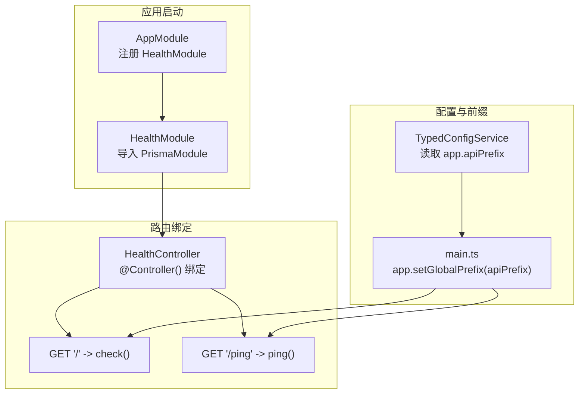
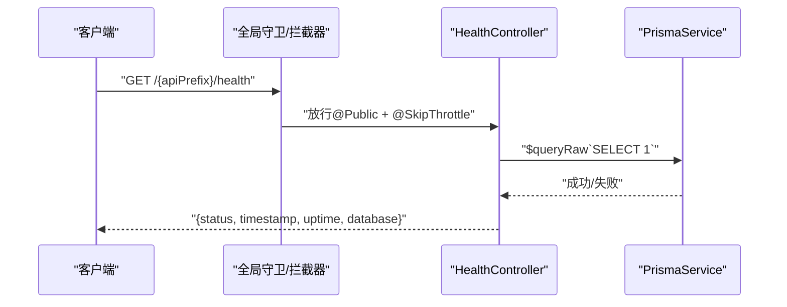
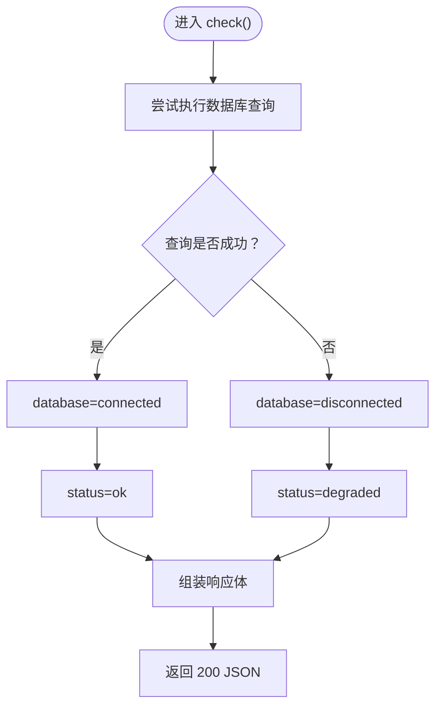
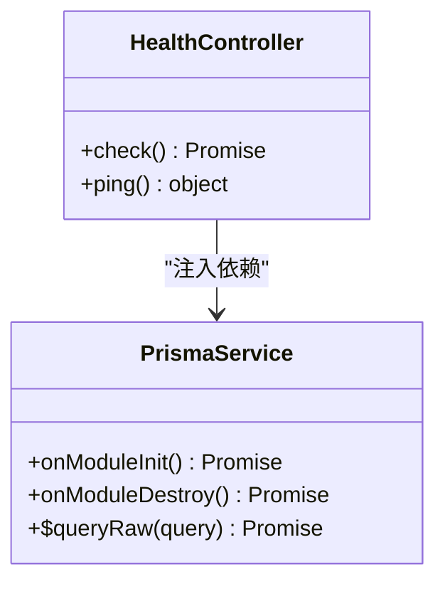

# 健康检查接口

<cite>
**本文引用的文件**
- [health.controller.ts](file://src/modules/health/health.controller.ts)
- [health.module.ts](file://src/modules/health/health.module.ts)
- [app.module.ts](file://src/app.module.ts)
- [main.ts](file://src/main.ts)
- [prisma.service.ts](file://src/prisma/prisma.service.ts)
- [time.util.ts](file://src/common/utils/time.util.ts)
- [public.decorator.ts](file://src/common/decorators/public.decorator.ts)
- [skip-throttle.decorator.ts](file://src/common/decorators/skip-throttle.decorator.ts)
- [typed-config.service.ts](file://src/config/typed-config.service.ts)
- [app.schema.ts](file://src/config/schemas/app.schema.ts)
- [root.schema.ts](file://src/config/schemas/root.schema.ts)
- [config-loader.ts](file://src/config/config-loader.ts)
</cite>

## 目录
1. [简介](#简介)
2. [项目结构](#项目结构)
3. [核心组件](#核心组件)
4. [架构总览](#架构总览)
5. [详细组件分析](#详细组件分析)
6. [依赖关系分析](#依赖关系分析)
7. [性能考量](#性能考量)
8. [故障排查指南](#故障排查指南)
9. [结论](#结论)
10. [附录](#附录)

## 简介
本文件面向健康检查 API 接口，聚焦 /health 与 /health/ping 两个端点，系统性说明其触发条件、检查内容、响应格式、在系统监控与编排中的作用，并提供调用示例与解析方法、最佳实践与故障排查建议。该接口用于快速评估服务可用性与数据库连通性，适合被负载均衡器、容器编排平台（如 Kubernetes）以及监控系统定时探测。

## 项目结构
健康检查功能位于独立模块中，通过全局前缀组合形成最终访问路径。关键要点如下：
- 健康检查模块在应用模块中注册，控制器暴露两个端点：
  - GET /health（受全局前缀影响）
  - GET /health/ping
- 全局前缀由配置决定，默认为 api/v1；最终访问路径为 {apiPrefix}/health 与 {apiPrefix}/health/ping。

**图表来源**
- [app.module.ts:18-32](file://src/app.module.ts#L18-L32)
- [health.module.ts:5-8](file://src/modules/health/health.module.ts#L5-L8)
- [health.controller.ts:9-12](file://src/modules/health/health.controller.ts#L9-L12)
- [main.ts:22](file://src/main.ts#L22)
- [typed-config.service.ts:44](file://src/config/typed-config.service.ts#L44)

**章节来源**
- [app.module.ts:18-32](file://src/app.module.ts#L18-L32)
- [health.module.ts:5-8](file://src/modules/health/health.module.ts#L5-L8)
- [health.controller.ts:9-12](file://src/modules/health/health.controller.ts#L9-L12)
- [main.ts:22](file://src/main.ts#L22)
- [typed-config.service.ts:44](file://src/config/typed-config.service.ts#L44)

## 核心组件
- 健康检查控制器：提供 /health 与 /health/ping 两个端点，均对公网开放且跳过速率限制。
- 数据库连通性检测：通过执行一次轻量查询验证数据库连接状态。
- 时间与运行时信息：返回当前时间与进程运行时长，便于定位异常。
- 公共访问与限流豁免：装饰器确保健康检查不被鉴权与限流拦截。

**章节来源**
- [health.controller.ts:14-63](file://src/modules/health/health.controller.ts#L14-L63)
- [health.controller.ts:65-84](file://src/modules/health/health.controller.ts#L65-L84)
- [public.decorator.ts:3-5](file://src/common/decorators/public.decorator.ts#L3-L5)
- [skip-throttle.decorator.ts:3-12](file://src/common/decorators/skip-throttle.decorator.ts#L3-L12)

## 架构总览
健康检查请求在进入控制器前，会经过全局中间件与守卫链路，但因装饰器豁免，不会触发鉴权与限流。控制器内部仅进行数据库连通性检查与时间/运行时信息拼装，返回标准化 JSON。

**图表来源**
- [health.controller.ts:48-63](file://src/modules/health/health.controller.ts#L48-L63)
- [prisma.service.ts:36-42](file://src/prisma/prisma.service.ts#L36-L42)

## 详细组件分析

### 健康检查端点 /health
- 触发条件
  - 任意 GET 请求命中 /{apiPrefix}/health。
  - 由于使用 @Public 与 @SkipThrottle，无需鉴权且不受速率限制。
- 检查内容
  - 数据库连通性：执行一次轻量查询以确认连接可用。
  - 当前时间：采用本地时间格式化工具输出。
  - 进程运行时长：使用 Node.js 内置进程运行时长。
- 响应格式
  - 字段
    - status：枚举值，ok 或 degraded
    - timestamp：字符串，当前时间
    - uptime：数字，服务运行秒数
    - database：枚举值，connected 或 disconnected
  - 成功状态码：200
- 实现要点
  - 数据库状态判定：捕获查询异常即视为断开。
  - 状态映射：数据库连通则返回 ok，否则返回 degraded。

**图表来源**
- [health.controller.ts:48-63](file://src/modules/health/health.controller.ts#L48-L63)

**章节来源**
- [health.controller.ts:14-63](file://src/modules/health/health.controller.ts#L14-L63)
- [time.util.ts:65-67](file://src/common/utils/time.util.ts#L65-L67)

### Ping 端点 /health/ping
- 触发条件
  - 任意 GET 请求命中 /{apiPrefix}/health/ping。
- 检查内容
  - 返回固定字符串“pong”，用于基础可达性验证。
- 响应格式
  - 字段
    - message：字符串，固定值“pong”
  - 成功状态码：200

**章节来源**
- [health.controller.ts:65-84](file://src/modules/health/health.controller.ts#L65-L84)

### 控制器与模块装配
- 控制器
  - 通过 @Controller() 绑定根路径，结合全局前缀形成最终路由。
  - 依赖 PrismaService 进行数据库连通性检测。
- 模块
  - HealthModule 导入 PrismaModule 并注册 HealthController。
- 应用模块
  - AppModule 注册 HealthModule，使健康检查端点生效。

**图表来源**
- [health.controller.ts:11-12](file://src/modules/health/health.controller.ts#L11-L12)
- [prisma.service.ts:12-42](file://src/prisma/prisma.service.ts#L12-L42)

**章节来源**
- [health.controller.ts:9-12](file://src/modules/health/health.controller.ts#L9-L12)
- [health.module.ts:5-8](file://src/modules/health/health.module.ts#L5-L8)
- [app.module.ts:29-30](file://src/app.module.ts#L29-L30)

### 公共访问与限流豁免
- @Public：标记接口为公开，绕过鉴权守卫。
- @SkipThrottle：标记接口跳过速率限制，避免健康检查被误伤。

**章节来源**
- [public.decorator.ts:3-5](file://src/common/decorators/public.decorator.ts#L3-L5)
- [skip-throttle.decorator.ts:3-12](file://src/common/decorators/skip-throttle.decorator.ts#L3-L12)
- [health.controller.ts:14-10](file://src/modules/health/health.controller.ts#L14-L10)

## 依赖关系分析
- 路由前缀依赖
  - TypedConfigService 读取 app.apiPrefix（默认 api/v1），main.ts 设置全局前缀。
- 数据库依赖
  - PrismaService 在模块初始化时建立连接，在销毁时断开。
- 健康检查依赖
  - 仅依赖 PrismaService 的连通性查询能力。

**图表来源**
- [typed-config.service.ts:23-38](file://src/config/typed-config.service.ts#L23-L38)
- [app.schema.ts:6](file://src/config/schemas/app.schema.ts#L6)
- [main.ts:22](file://src/main.ts#L22)
- [health.controller.ts:11-12](file://src/modules/health/health.controller.ts#L11-L12)
- [prisma.service.ts:36-42](file://src/prisma/prisma.service.ts#L36-L42)

**章节来源**
- [typed-config.service.ts:23-38](file://src/config/typed-config.service.ts#L23-L38)
- [app.schema.ts:6](file://src/config/schemas/app.schema.ts#L6)
- [main.ts:22](file://src/main.ts#L22)
- [prisma.service.ts:36-42](file://src/prisma/prisma.service.ts#L36-L42)

## 性能考量
- 查询成本极低：仅执行一次轻量查询，对生产环境几乎无压力。
- 适用场景：高频探测（如容器编排探针）与快速自检。
- 建议
  - 将健康检查端点置于独立的、低优先级的探针队列中，避免与业务流量叠加。
  - 如需更全面的指标，可扩展至多维度检查（磁盘、内存、缓存等），但需谨慎控制成本。

[本节为通用指导，不直接分析具体文件]

## 故障排查指南
- 无法访问 /health 或返回 404
  - 检查全局前缀是否正确设置（默认 api/v1），确认最终路径为 {apiPrefix}/health。
  - 确认 HealthModule 已在 AppModule 中注册。
- /health 返回 degraded
  - 数据库连接异常：检查数据库服务状态、连接串与网络连通性。
  - 临时性抖动：若为偶发，可结合 uptime 与 timestamp 判断是否为瞬时异常。
- /health/ping 返回 pong
  - 仅用于基础可达性验证，不代表数据库可用。
- 配置相关
  - 确认 TypedConfigService 能正确读取 app.apiPrefix。
  - 确认 main.ts 已调用 app.setGlobalPrefix(apiPrefix)。

**章节来源**
- [health.controller.ts:48-63](file://src/modules/health/health.controller.ts#L48-L63)
- [health.controller.ts:65-84](file://src/modules/health/health.controller.ts#L65-L84)
- [app.module.ts:29-30](file://src/app.module.ts#L29-L30)
- [main.ts:22](file://src/main.ts#L22)
- [typed-config.service.ts:23-38](file://src/config/typed-config.service.ts#L23-L38)

## 结论
健康检查接口以极低的成本提供服务可用性与数据库连通性的快速验证，适合作为负载均衡与编排系统的探测端点。通过公共访问与限流豁免装饰器，确保其高可用与高可达。建议在生产环境中结合更丰富的指标体系与告警策略，持续优化健康检查的覆盖范围与响应时效。

[本节为总结性内容，不直接分析具体文件]

## 附录

### 接口调用示例与响应解析
- 示例
  - GET {apiPrefix}/health
  - GET {apiPrefix}/health/ping
- 响应字段解析
  - /health
    - status：ok 表示健康，degraded 表示数据库不可用
    - timestamp：当前时间字符串
    - uptime：进程运行秒数
    - database：connected/disconnected
  - /health/ping
    - message：固定为“pong”

**章节来源**
- [health.controller.ts:17-47](file://src/modules/health/health.controller.ts#L17-L47)
- [health.controller.ts:68-81](file://src/modules/health/health.controller.ts#L68-L81)

### 最佳实践
- 将健康检查端点置于独立的、低优先级的探针队列中，避免与业务流量叠加。
- 在容器编排中，结合 liveness/readiness 探针分别用于存活与就绪判断。
- 对于复杂系统，逐步扩展健康检查维度（数据库、缓存、第三方服务等），但需控制检查成本。
- 使用统一的全局前缀管理，确保所有探针与监控工具的一致性。

[本节为通用指导，不直接分析具体文件]