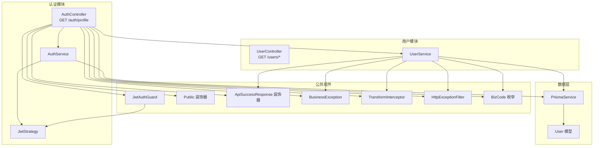
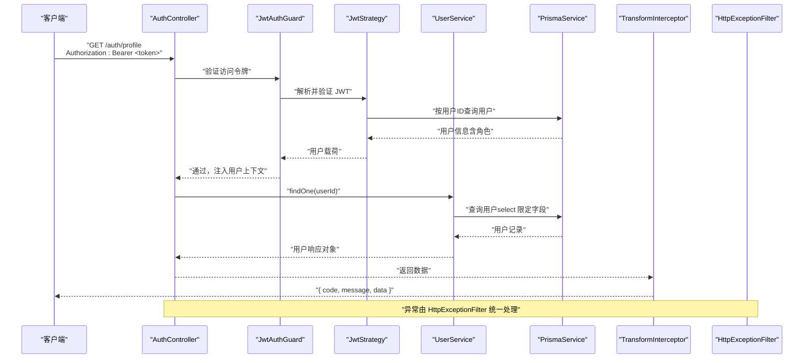
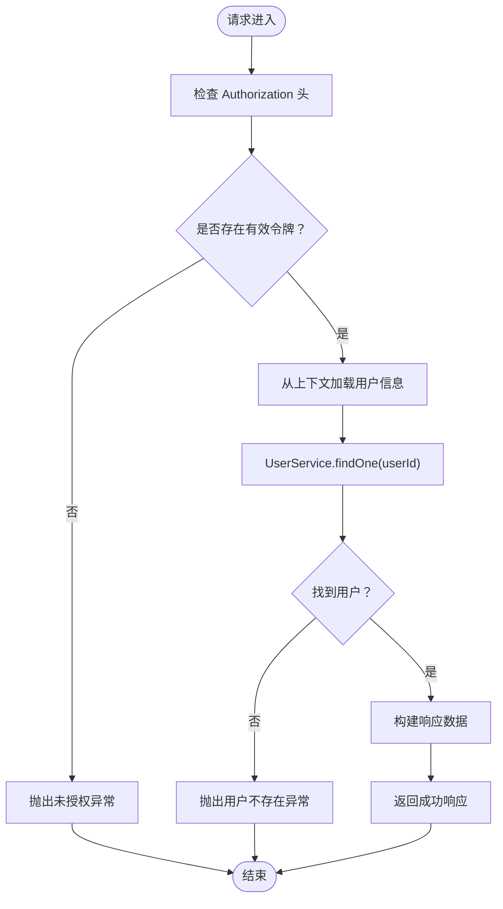
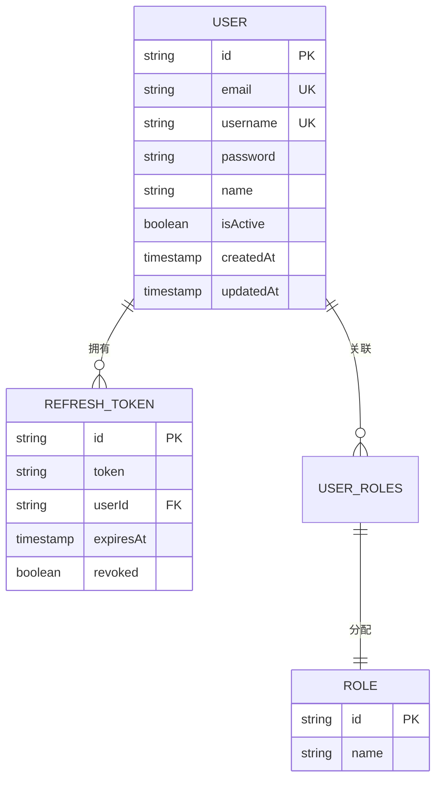
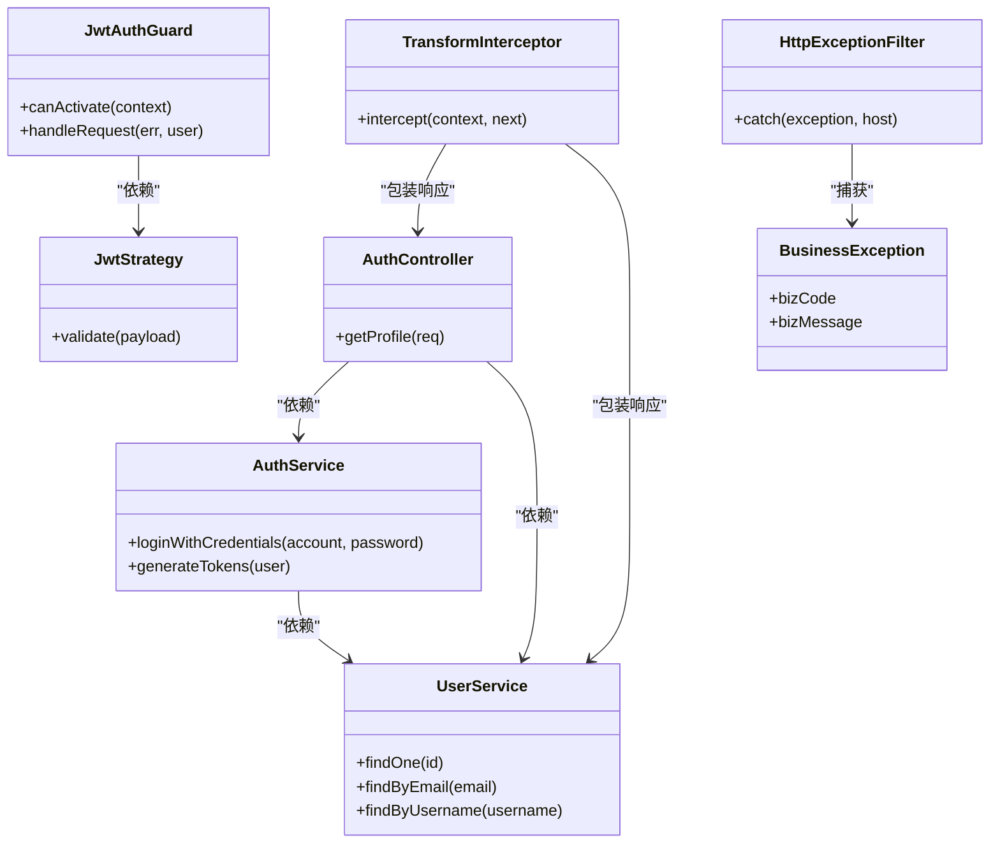

# 用户管理接口

<cite>
**本文引用的文件**
- [src/modules/auth/auth.controller.ts](file://src/modules/auth/auth.controller.ts)
- [src/modules/auth/auth.service.ts](file://src/modules/auth/auth.service.ts)
- [src/modules/auth/dto/auth.dto.ts](file://src/modules/auth/dto/auth.dto.ts)
- [src/modules/auth/strategies/jwt.strategy.ts](file://src/modules/auth/strategies/jwt.strategy.ts)
- [src/modules/user/user.controller.ts](file://src/modules/user/user.controller.ts)
- [src/modules/user/user.service.ts](file://src/modules/user/user.service.ts)
- [src/modules/user/dto/user.dto.ts](file://src/modules/user/dto/user.dto.ts)
- [src/common/guards/jwt-auth.guard.ts](file://src/common/guards/jwt-auth.guard.ts)
- [src/common/decorators/public.decorator.ts](file://src/common/decorators/public.decorator.ts)
- [src/common/decorators/api-success-response.decorator.ts](file://src/common/decorators/api-success-response.decorator.ts)
- [src/common/exceptions/business.exception.ts](file://src/common/exceptions/business.exception.ts)
- [src/common/interceptors/transform.interceptor.ts](file://src/common/interceptors/transform.interceptor.ts)
- [src/common/filters/http-exception.filter.ts](file://src/common/filters/http-exception.filter.ts)
- [src/common/enums/biz-code.enum.ts](file://src/common/enums/biz-code.enum.ts)
- [src/common/interfaces/user.interface.ts](file://src/common/interfaces/user.interface.ts)
- [src/common/interfaces/jwt.interface.ts](file://src/common/interfaces/jwt.interface.ts)
- [prisma/schema/User.prisma](file://prisma/schema/User.prisma)
</cite>

## 目录
1. [简介](#简介)
2. [项目结构](#项目结构)
3. [核心组件](#核心组件)
4. [架构总览](#架构总览)
5. [详细组件分析](#详细组件分析)
6. [依赖关系分析](#依赖关系分析)
7. [性能考量](#性能考量)
8. [故障排查指南](#故障排查指南)
9. [结论](#结论)
10. [附录](#附录)

## 简介
本文件聚焦于用户管理相关 API 接口，特别是用户资料获取接口 GET /auth/profile 的完整实现说明。内容涵盖：
- 认证要求与访问流程
- 响应数据结构与字段含义
- 业务逻辑与权限控制
- 完整接口示例（请求头、响应格式）
- 错误处理与异常映射
- 安全性与隐私保护措施

## 项目结构
用户管理与认证相关的核心模块与文件如下：
- 认证模块：负责登录、注册、刷新令牌、退出登录与当前用户资料获取
- 用户模块：负责用户增删改查等基础操作
- 公共组件：JWT 守卫、业务异常、统一响应与异常过滤器等

图表来源
- [src/modules/auth/auth.controller.ts:116-127](file://src/modules/auth/auth.controller.ts#L116-L127)
- [src/modules/auth/auth.service.ts:117-153](file://src/modules/auth/auth.service.ts#L117-L153)
- [src/modules/auth/strategies/jwt.strategy.ts:22-47](file://src/modules/auth/strategies/jwt.strategy.ts#L22-L47)
- [src/modules/user/user.controller.ts:43-61](file://src/modules/user/user.controller.ts#L43-L61)
- [src/modules/user/user.service.ts:39-57](file://src/modules/user/user.service.ts#L39-L57)
- [src/common/guards/jwt-auth.guard.ts:23-44](file://src/common/guards/jwt-auth.guard.ts#L23-L44)
- [src/common/decorators/api-success-response.decorator.ts:88-128](file://src/common/decorators/api-success-response.decorator.ts#L88-L128)
- [src/common/exceptions/business.exception.ts:16-41](file://src/common/exceptions/business.exception.ts#L16-L41)
- [src/common/interceptors/transform.interceptor.ts:21-39](file://src/common/interceptors/transform.interceptor.ts#L21-L39)
- [src/common/filters/http-exception.filter.ts:24-78](file://src/common/filters/http-exception.filter.ts#L24-L78)
- [src/common/enums/biz-code.enum.ts:13-78](file://src/common/enums/biz-code.enum.ts#L13-L78)
- [prisma/schema/User.prisma:1-15](file://prisma/schema/User.prisma#L1-L15)

章节来源
- [src/modules/auth/auth.controller.ts:116-127](file://src/modules/auth/auth.controller.ts#L116-L127)
- [src/modules/user/user.controller.ts:43-61](file://src/modules/user/user.controller.ts#L43-L61)

## 核心组件
- 认证控制器（AuthController）提供 GET /auth/profile 获取当前登录用户资料
- 用户服务（UserService）提供用户查询能力，并通过 Prisma 查询数据库
- JWT 守卫（JwtAuthGuard）与策略（JwtStrategy）保障接口的认证与鉴权
- 统一响应与异常处理：通过装饰器、拦截器与过滤器实现标准化输出与错误映射

章节来源
- [src/modules/auth/auth.controller.ts:116-127](file://src/modules/auth/auth.controller.ts#L116-L127)
- [src/modules/user/user.service.ts:46-57](file://src/modules/user/user.service.ts#L46-L57)
- [src/common/guards/jwt-auth.guard.ts:17-45](file://src/common/guards/jwt-auth.guard.ts#L17-L45)
- [src/common/interceptors/transform.interceptor.ts:14-40](file://src/common/interceptors/transform.interceptor.ts#L14-L40)
- [src/common/filters/http-exception.filter.ts:24-78](file://src/common/filters/http-exception.filter.ts#L24-L78)

## 架构总览
GET /auth/profile 的端到端调用链路如下：

图表来源
- [src/modules/auth/auth.controller.ts:116-127](file://src/modules/auth/auth.controller.ts#L116-L127)
- [src/common/guards/jwt-auth.guard.ts:23-44](file://src/common/guards/jwt-auth.guard.ts#L23-L44)
- [src/modules/auth/strategies/jwt.strategy.ts:22-47](file://src/modules/auth/strategies/jwt.strategy.ts#L22-L47)
- [src/modules/user/user.service.ts:46-57](file://src/modules/user/user.service.ts#L46-L57)
- [src/common/interceptors/transform.interceptor.ts:21-39](file://src/common/interceptors/transform.interceptor.ts#L21-L39)
- [src/common/filters/http-exception.filter.ts:28-78](file://src/common/filters/http-exception.filter.ts#L28-L78)

## 详细组件分析

### GET /auth/profile 接口详解
- 接口路径：GET /auth/profile
- 认证要求：需携带有效的访问令牌（Authorization: Bearer <token>），使用 JWT 守卫进行验证
- 权限控制：仅允许已登录用户访问；未提供令牌或令牌无效时返回未授权错误
- 业务逻辑：
  - 从请求上下文中提取当前用户 ID
  - 调用用户服务按 ID 查询用户
  - 返回用户资料（不包含密码字段）

图表来源
- [src/modules/auth/auth.controller.ts:116-127](file://src/modules/auth/auth.controller.ts#L116-L127)
- [src/common/guards/jwt-auth.guard.ts:36-44](file://src/common/guards/jwt-auth.guard.ts#L36-L44)
- [src/modules/user/user.service.ts:46-57](file://src/modules/user/user.service.ts#L46-L57)

章节来源
- [src/modules/auth/auth.controller.ts:116-127](file://src/modules/auth/auth.controller.ts#L116-L127)
- [src/common/guards/jwt-auth.guard.ts:23-44](file://src/common/guards/jwt-auth.guard.ts#L23-L44)
- [src/modules/user/user.service.ts:46-57](file://src/modules/user/user.service.ts#L46-L57)

### 数据模型与字段说明
- 用户数据模型（Prisma 模型）：包含 id、email、username、password、name、isActive、createdAt、updatedAt 等字段
- 当前用户资料响应模型（ProfileResponseSchema）：包含 id、email、username、name
- 用户查询响应模型（UserResponseSchema）：包含 id、email、username、name、isActive、createdAt、updatedAt
- 注意：所有响应均不包含密码字段，确保隐私安全

图表来源
- [prisma/schema/User.prisma:1-15](file://prisma/schema/User.prisma#L1-L15)
- [src/modules/auth/dto/auth.dto.ts:72-77](file://src/modules/auth/dto/auth.dto.ts#L72-L77)
- [src/modules/user/dto/user.dto.ts:25-33](file://src/modules/user/dto/user.dto.ts#L25-L33)

章节来源
- [prisma/schema/User.prisma:1-15](file://prisma/schema/User.prisma#L1-L15)
- [src/modules/auth/dto/auth.dto.ts:72-77](file://src/modules/auth/dto/auth.dto.ts#L72-L77)
- [src/modules/user/dto/user.dto.ts:25-33](file://src/modules/user/dto/user.dto.ts#L25-L33)

### 认证与权限控制
- JWT 守卫：对受保护路由进行认证，若令牌无效或缺失则抛出未授权异常
- 公共接口装饰器：用于标记公开接口（如登录、注册、验证码），与守卫配合决定是否放行
- JWT 策略：从 Authorization 头解析并验证 JWT，加载用户角色信息
- 业务异常：统一使用 BusinessException 抛出，便于拦截器与过滤器标准化处理

章节来源
- [src/common/guards/jwt-auth.guard.ts:17-45](file://src/common/guards/jwt-auth.guard.ts#L17-L45)
- [src/common/decorators/public.decorator.ts:1-5](file://src/common/decorators/public.decorator.ts#L1-L5)
- [src/modules/auth/strategies/jwt.strategy.ts:9-48](file://src/modules/auth/strategies/jwt.strategy.ts#L9-L48)
- [src/common/exceptions/business.exception.ts:16-41](file://src/common/exceptions/business.exception.ts#L16-L41)

### 响应格式与接口示例
- 统一响应结构：{ code, message, data }
- 成功响应：code=0，message 为“操作成功”，data 为具体数据
- 错误响应：code 为业务码，message 为错误信息，details 为可选的详细信息
- GET /auth/profile 示例：
  - 请求头：Authorization: Bearer <access_token>
  - 成功响应：{
      "code": 0,
      "message": "操作成功",
      "data": {
        "id": "用户唯一标识（UUID）",
        "email": "用户邮箱地址",
        "username": "用户名",
        "name": "用户显示名称（可空）"
      }
    }
  - 未授权响应：{
      "code": 1002,
      "message": "未授权，请先登录"
    }

章节来源
- [src/common/interceptors/transform.interceptor.ts:21-39](file://src/common/interceptors/transform.interceptor.ts#L21-L39)
- [src/common/filters/http-exception.filter.ts:36-78](file://src/common/filters/http-exception.filter.ts#L36-L78)
- [src/common/enums/biz-code.enum.ts:13-78](file://src/common/enums/biz-code.enum.ts#L13-L78)
- [src/modules/auth/dto/auth.dto.ts:72-77](file://src/modules/auth/dto/auth.dto.ts#L72-L77)

### 错误处理与异常映射
- 业务异常 BusinessException：携带业务码与消息，自动映射到对应 HTTP 状态码
- 异常过滤器 HttpExceptionFilter：统一捕获并格式化错误响应
- 常见错误码：
  - 1002：未授权（缺少或无效令牌）
  - 20001：用户不存在
  - 1001：参数校验失败
  - 1004：资源不存在
  - 1099：服务器内部错误

章节来源
- [src/common/exceptions/business.exception.ts:16-41](file://src/common/exceptions/business.exception.ts#L16-L41)
- [src/common/filters/http-exception.filter.ts:24-78](file://src/common/filters/http-exception.filter.ts#L24-L78)
- [src/common/enums/biz-code.enum.ts:13-78](file://src/common/enums/biz-code.enum.ts#L13-L78)

## 依赖关系分析
- 控制器依赖服务：AuthController 依赖 AuthService 与 UserService
- 服务依赖数据层：UserService 依赖 PrismaService 查询用户
- 中间件依赖：JwtAuthGuard 依赖 JwtStrategy 解析用户载荷
- 输出依赖：TransformInterceptor 统一包装响应；HttpExceptionFilter 统一错误处理
- 配置依赖：JwtStrategy 与 AuthService 依赖配置服务读取密钥与过期时间

图表来源
- [src/modules/auth/auth.controller.ts:116-127](file://src/modules/auth/auth.controller.ts#L116-L127)
- [src/modules/auth/auth.service.ts:29-65](file://src/modules/auth/auth.service.ts#L29-L65)
- [src/modules/user/user.service.ts:46-57](file://src/modules/user/user.service.ts#L46-L57)
- [src/common/guards/jwt-auth.guard.ts:17-45](file://src/common/guards/jwt-auth.guard.ts#L17-L45)
- [src/modules/auth/strategies/jwt.strategy.ts:22-47](file://src/modules/auth/strategies/jwt.strategy.ts#L22-L47)
- [src/common/interceptors/transform.interceptor.ts:14-40](file://src/common/interceptors/transform.interceptor.ts#L14-L40)
- [src/common/filters/http-exception.filter.ts:24-78](file://src/common/filters/http-exception.filter.ts#L24-L78)
- [src/common/exceptions/business.exception.ts:16-41](file://src/common/exceptions/business.exception.ts#L16-L41)

章节来源
- [src/modules/auth/auth.controller.ts:116-127](file://src/modules/auth/auth.controller.ts#L116-L127)
- [src/modules/user/user.controller.ts:43-61](file://src/modules/user/user.controller.ts#L43-L61)
- [src/common/guards/jwt-auth.guard.ts:17-45](file://src/common/guards/jwt-auth.guard.ts#L17-L45)

## 性能考量
- 查询优化：UserService 在查询用户时使用 select 限定字段，避免不必要的字段传输
- 并发处理：AuthService 生成访问令牌与刷新令牌采用并发 Promise.all，提升性能
- 缓存建议：可结合缓存中间件减少重复查询（需评估一致性与复杂度）

章节来源
- [src/modules/user/user.service.ts:115-123](file://src/modules/user/user.service.ts#L115-L123)
- [src/modules/auth/auth.service.ts:127-136](file://src/modules/auth/auth.service.ts#L127-L136)

## 故障排查指南
- 未授权（401）：检查 Authorization 头是否正确，令牌是否过期或被撤销
- 用户不存在（404）：确认用户 ID 是否正确，或用户是否被删除
- 参数校验失败（400）：检查请求体字段是否符合 DTO 校验规则
- 服务器内部错误（500）：查看日志定位异常，确认 Prisma 查询与业务逻辑

章节来源
- [src/common/enums/biz-code.enum.ts:127-170](file://src/common/enums/biz-code.enum.ts#L127-L170)
- [src/common/filters/http-exception.filter.ts:156-171](file://src/common/filters/http-exception.filter.ts#L156-L171)

## 结论
GET /auth/profile 接口通过严格的 JWT 认证与权限控制，确保只有合法用户可访问其个人资料。统一的响应与异常处理机制提升了接口的一致性与可观测性。数据模型与查询策略遵循最小暴露原则，保障了用户隐私与安全性。

## 附录
- 相关接口参考
  - GET /auth/profile：获取当前用户资料
  - POST /auth/login：用户登录
  - POST /auth/register：用户注册
  - POST /auth/refresh：刷新访问令牌
  - POST /auth/logout：退出登录
- 关键 DTO 与模型
  - ProfileResponseSchema：当前用户资料响应模型
  - UserResponseSchema：用户查询响应模型
  - User 模型：Prisma 用户实体

章节来源
- [src/modules/auth/auth.controller.ts:116-127](file://src/modules/auth/auth.controller.ts#L116-L127)
- [src/modules/auth/dto/auth.dto.ts:72-77](file://src/modules/auth/dto/auth.dto.ts#L72-L77)
- [src/modules/user/dto/user.dto.ts:25-33](file://src/modules/user/dto/user.dto.ts#L25-L33)
- [prisma/schema/User.prisma:1-15](file://prisma/schema/User.prisma#L1-L15)