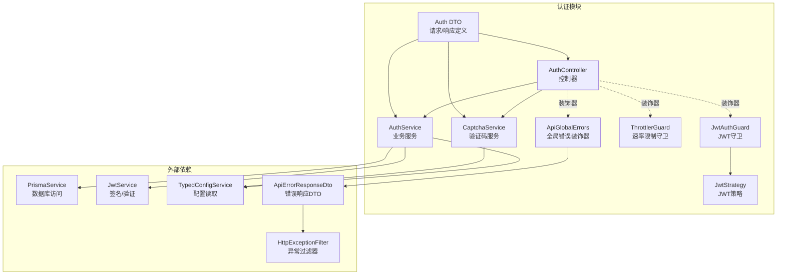
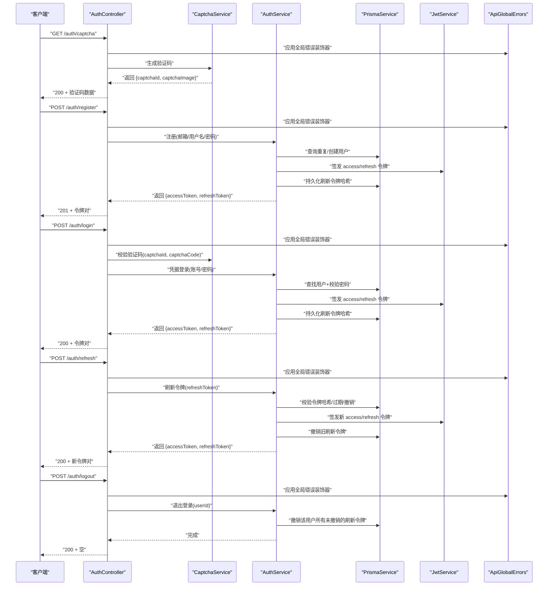
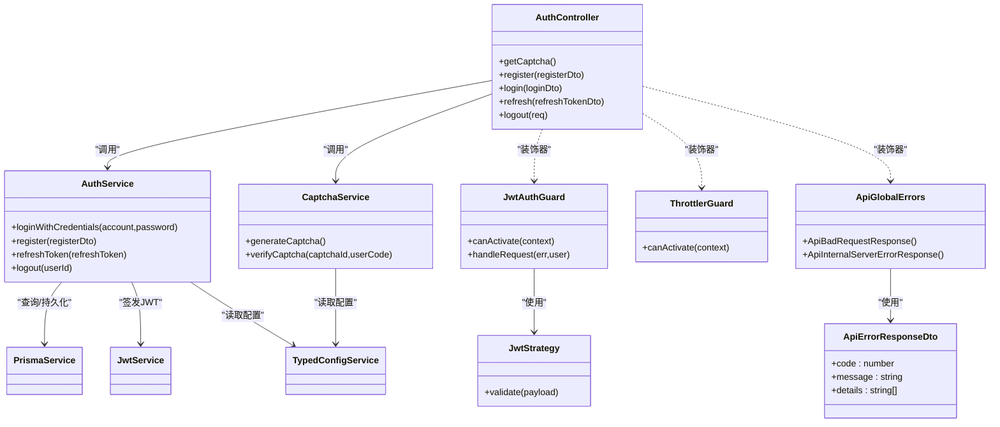

# 认证接口

<cite>
**本文引用的文件**
- [src/modules/auth/auth.controller.ts](file://src/modules/auth/auth.controller.ts)
- [src/modules/auth/auth.service.ts](file://src/modules/auth/auth.service.ts)
- [src/modules/auth/captcha.service.ts](file://src/modules/auth/captcha.service.ts)
- [src/modules/auth/dto/auth.dto.ts](file://src/modules/auth/dto/auth.dto.ts)
- [src/modules/auth/strategies/jwt.strategy.ts](file://src/modules/auth/strategies/jwt.strategy.ts)
- [src/common/guards/jwt-auth.guard.ts](file://src/common/guards/jwt-auth.guard.ts)
- [src/common/guards/throttler.guard.ts](file://src/common/guards/throttler.guard.ts)
- [src/common/decorators/public.decorator.ts](file://src/common/decorators/public.decorator.ts)
- [src/common/enums/biz-code.enum.ts](file://src/common/enums/biz-code.enum.ts)
- [src/config/schemas/jwt.schema.ts](file://src/config/schemas/jwt.schema.ts)
- [prisma/schema/RefreshToken.prisma](file://prisma/schema/RefreshToken.prisma)
- [src/common/decorators/api-success-response.decorator.ts](file://src/common/decorators/api-success-response.decorator.ts)
- [src/common/dto/api-error-response.dto.ts](file://src/common/dto/api-error-response.dto.ts)
- [src/common/filters/http-exception.filter.ts](file://src/common/filters/http-exception.filter.ts)
</cite>

## 更新摘要

**所做更改**

- 添加了 ApiGlobalErrors 装饰器的文档说明，确保所有端点的错误响应文档保持一致
- 更新了错误处理章节，详细说明统一的错误响应格式和 Swagger 文档集成
- 增强了故障排查指南，包含新的错误响应格式说明

## 目录

1. [简介](#简介)
2. [项目结构](#项目结构)
3. [核心组件](#核心组件)
4. [架构总览](#架构总览)
5. [详细接口文档](#详细接口文档)
6. [依赖关系分析](#依赖关系分析)
7. [性能与安全考虑](#性能与安全考虑)
8. [故障排查指南](#故障排查指南)
9. [结论](#结论)

## 简介

本文件面向认证相关 API 的使用者与维护者，系统性梳理验证码获取、用户注册、用户登录、令牌刷新与退出登录等接口的调用方式、参数约束、响应格式、状态码与错误处理策略，并深入解析 JWT 令牌机制、验证码验证流程、速率限制策略与安全要点。文档同时提供成功与失败场景的请求/响应示意路径，帮助快速定位问题并正确集成。

**更新** 认证控制器和用户控制器现已集成 ApiGlobalErrors 装饰器，确保所有端点的错误响应文档保持一致性和标准化。

## 项目结构

认证能力由控制器、服务层、验证码服务、DTO 定义、JWT 策略与守卫、速率限制守卫以及数据库模型共同组成。核心交互围绕 AuthController 展开，通过 AuthService 组织业务逻辑，使用 CaptchaService 生成与校验验证码，借助 Prisma 持久化刷新令牌，使用 Passport/JWT 实现鉴权。

**图表来源**

- [src/modules/auth/auth.controller.ts:35-129](file://src/modules/auth/auth.controller.ts#L35-L129)
- [src/modules/auth/auth.service.ts:14-162](file://src/modules/auth/auth.service.ts#L14-L162)
- [src/modules/auth/captcha.service.ts:20-98](file://src/modules/auth/captcha.service.ts#L20-L98)
- [src/modules/auth/strategies/jwt.strategy.ts:9-49](file://src/modules/auth/strategies/jwt.strategy.ts#L9-L49)
- [src/common/guards/jwt-auth.guard.ts:17-46](file://src/common/guards/jwt-auth.guard.ts#L17-L46)
- [src/common/guards/throttler.guard.ts:10-33](file://src/common/guards/throttler.guard.ts#L10-L33)
- [src/common/decorators/api-success-response.decorator.ts:144-156](file://src/common/decorators/api-success-response.decorator.ts#L144-L156)
- [src/common/dto/api-error-response.dto.ts:1-14](file://src/common/dto/api-error-response.dto.ts#L1-L14)
- [src/common/filters/http-exception.filter.ts:40-78](file://src/common/filters/http-exception.filter.ts#L40-L78)

**章节来源**

- [src/modules/auth/auth.controller.ts:35-129](file://src/modules/auth/auth.controller.ts#L35-L129)
- [src/modules/auth/auth.service.ts:14-162](file://src/modules/auth/auth.service.ts#L14-L162)
- [src/modules/auth/captcha.service.ts:20-98](file://src/modules/auth/captcha.service.ts#L20-L98)
- [src/modules/auth/strategies/jwt.strategy.ts:9-49](file://src/modules/auth/strategies/jwt.strategy.ts#L9-L49)
- [src/common/guards/jwt-auth.guard.ts:17-46](file://src/common/guards/jwt-auth.guard.ts#L17-L46)
- [src/common/guards/throttler.guard.ts:10-33](file://src/common/guards/throttler.guard.ts#L10-L33)

## 核心组件

- 控制器：暴露 /auth/\* 接口，负责参数接收、调用服务与返回响应。
- 服务层：实现登录凭据校验、注册、令牌签发与刷新、退出登录等业务逻辑。
- 验证码服务：生成 SVG 验证码、存储与清理、校验验证码并抛出相应业务异常。
- DTO：基于 Zod 定义请求/响应结构与校验规则。
- JWT 策略与守卫：从请求头提取并验证 JWT，注入用户上下文；对非公开接口进行鉴权拦截。
- 速率限制守卫：对特定接口施加速率限制，保护接口免受暴力破解与滥用。
- 数据模型：刷新令牌表用于持久化刷新令牌哈希、过期时间与撤销状态。
- **ApiGlobalErrors 装饰器**：统一注入 400 和 500 错误响应文档，确保所有端点的错误格式一致。

**更新** 认证控制器现已集成 ApiGlobalErrors 装饰器，提供标准化的错误响应文档支持。

**章节来源**

- [src/modules/auth/auth.controller.ts:35-129](file://src/modules/auth/auth.controller.ts#L35-L129)
- [src/modules/auth/auth.service.ts:14-162](file://src/modules/auth/auth.service.ts#L14-L162)
- [src/modules/auth/captcha.service.ts:20-98](file://src/modules/auth/captcha.service.ts#L20-L98)
- [src/modules/auth/dto/auth.dto.ts:1-89](file://src/modules/auth/dto/auth.dto.ts#L1-L89)
- [src/modules/auth/strategies/jwt.strategy.ts:9-49](file://src/modules/auth/strategies/jwt.strategy.ts#L9-L49)
- [src/common/guards/jwt-auth.guard.ts:17-46](file://src/common/guards/jwt-auth.guard.ts#L17-L46)
- [src/common/guards/throttler.guard.ts:10-33](file://src/common/guards/throttler.guard.ts#L10-L33)
- [prisma/schema/RefreshToken.prisma:1-12](file://prisma/schema/RefreshToken.prisma#L1-L12)
- [src/common/decorators/api-success-response.decorator.ts:144-156](file://src/common/decorators/api-success-response.decorator.ts#L144-L156)

## 架构总览

下图展示认证接口的典型调用链路与组件协作关系。

**图表来源**

- [src/modules/auth/auth.controller.ts:44-114](file://src/modules/auth/auth.controller.ts#L44-L114)
- [src/modules/auth/auth.service.ts:29-110](file://src/modules/auth/auth.service.ts#L29-L110)
- [src/modules/auth/captcha.service.ts:41-87](file://src/modules/auth/captcha.service.ts#L41-L87)
- [prisma/schema/RefreshToken.prisma:1-12](file://prisma/schema/RefreshToken.prisma#L1-L12)
- [src/common/decorators/api-success-response.decorator.ts:144-156](file://src/common/decorators/api-success-response.decorator.ts#L144-L156)

## 详细接口文档

### 获取验证码

- 方法与路径
  - GET /auth/captcha
- 认证要求
  - 公开接口，无需 JWT
- 速率限制
  - 短期窗口：最多 10 次/分钟；超过触发限流
- 请求参数
  - 无
- 响应体
  - captchaId: 验证码标识（UUID）
  - captchaImage: SVG 图片内容（字符串）
- 状态码
  - 200 成功
- 错误处理
  - 业务码：验证码存储容量告警时会清理过期项，通常不会直接返回错误
  - **统一错误响应**：通过 ApiGlobalErrors 装饰器自动注入 400/500 错误文档
- 示例
  - 成功：见 [验证码响应示例路径:67-70](file://src/modules/auth/dto/auth.dto.ts#L67-L70)
  - 失败：无，接口为公开且无输入参数

**章节来源**

- [src/modules/auth/auth.controller.ts:44-55](file://src/modules/auth/auth.controller.ts#L44-L55)
- [src/common/guards/throttler.guard.ts:10-33](file://src/common/guards/throttler.guard.ts#L10-L33)
- [src/modules/auth/dto/auth.dto.ts:67-70](file://src/modules/auth/dto/auth.dto.ts#L67-L70)
- [src/common/decorators/api-success-response.decorator.ts:144-156](file://src/common/decorators/api-success-response.decorator.ts#L144-L156)

### 用户注册

- 方法与路径
  - POST /auth/register
- 认证要求
  - 公开接口，无需 JWT
- 速率限制
  - 默认继承全局限流策略
- 请求体
  - email: 邮箱（必填，符合邮箱格式）
  - username: 用户名（必填，至少 3 字符）
  - password: 密码（必填，至少 6 字符）
  - name: 显示名称（可选）
- 响应体
  - accessToken: 访问令牌（JWT）
  - refreshToken: 刷新令牌（JWT）
- 状态码
  - 201 成功
  - 409 当邮箱或用户名已存在
- 错误处理
  - 业务码：邮箱已注册、用户名已占用
  - **统一错误响应**：通过 ApiGlobalErrors 装饰器自动注入 400/500 错误文档
- 示例
  - 成功：见 [注册响应示例路径:62-65](file://src/modules/auth/dto/auth.dto.ts#L62-L65)
  - 失败：邮箱已注册/用户名已占用

**章节来源**

- [src/modules/auth/auth.controller.ts:57-68](file://src/modules/auth/auth.controller.ts#L57-L68)
- [src/modules/auth/auth.service.ts:50-65](file://src/modules/auth/auth.service.ts#L50-L65)
- [src/modules/auth/dto/auth.dto.ts:44-48](file://src/modules/auth/dto/auth.dto.ts#L44-L48)
- [src/common/enums/biz-code.enum.ts:34-37](file://src/common/enums/biz-code.enum.ts#L34-L37)
- [src/common/decorators/api-success-response.decorator.ts:144-156](file://src/common/decorators/api-success-response.decorator.ts#L144-L156)

### 用户登录

- 方法与路径
  - POST /auth/login
- 认证要求
  - 公开接口，无需 JWT
- 速率限制
  - 短期窗口：最多 5 次/分钟；超过触发限流
- 请求体
  - account: 账号（邮箱或用户名，必填）
  - password: 密码（必填）
  - captchaId: 验证码标识（必填）
  - captchaCode: 验证码内容（必填，不区分大小写）
- 响应体
  - accessToken: 访问令牌（JWT）
  - refreshToken: 刷新令牌（JWT）
- 状态码
  - 200 成功
  - 401 凭证无效
  - 404 验证码不存在或已过期
  - 400 验证码已过期/验证码错误
- 错误处理
  - 业务码：凭证无效、验证码不存在/过期/错误
  - **统一错误响应**：通过 ApiGlobalErrors 装饰器自动注入 400/500 错误文档
- 示例
  - 成功：见 [令牌响应示例路径:62-65](file://src/modules/auth/dto/auth.dto.ts#L62-L65)
  - 失败：凭证无效、验证码错误

**章节来源**

- [src/modules/auth/auth.controller.ts:70-86](file://src/modules/auth/auth.controller.ts#L70-L86)
- [src/modules/auth/captcha.service.ts:69-87](file://src/modules/auth/captcha.service.ts#L69-L87)
- [src/modules/auth/auth.service.ts:29-43](file://src/modules/auth/auth.service.ts#L29-L43)
- [src/common/enums/biz-code.enum.ts:33-45](file://src/common/enums/biz-code.enum.ts#L33-L45)
- [src/common/decorators/api-success-response.decorator.ts:144-156](file://src/common/decorators/api-success-response.decorator.ts#L144-L156)

### 刷新访问令牌

- 方法与路径
  - POST /auth/refresh
- 认证要求
  - 公开接口，无需 JWT
- 速率限制
  - 默认继承全局限流策略
- 请求体
  - refreshToken: 刷新令牌（JWT，必填）
- 响应体
  - accessToken: 新的访问令牌（JWT）
  - refreshToken: 新的刷新令牌（JWT）
- 状态码
  - 200 成功
  - 401 刷新令牌无效或已过期
- 错误处理
  - 业务码：刷新令牌无效或已过期
  - **统一错误响应**：通过 ApiGlobalErrors 装饰器自动注入 400/500 错误文档
- 示例
  - 成功：见 [令牌响应示例路径:62-65](file://src/modules/auth/dto/auth.dto.ts#L62-L65)
  - 失败：刷新令牌无效或已过期

**章节来源**

- [src/modules/auth/auth.controller.ts:88-101](file://src/modules/auth/auth.controller.ts#L88-L101)
- [src/modules/auth/auth.service.ts:72-96](file://src/modules/auth/auth.service.ts#L72-L96)
- [src/common/enums/biz-code.enum.ts](file://src/common/enums/biz-code.enum.ts#L38)
- [src/common/decorators/api-success-response.decorator.ts:144-156](file://src/common/decorators/api-success-response.decorator.ts#L144-L156)

### 退出登录

- 方法与路径
  - POST /auth/logout
- 认证要求
  - 需要携带 Authorization: Bearer <access_token>
- 速率限制
  - 默认继承全局限流策略
- 请求体
  - 无
- 响应体
  - 无（空响应）
- 状态码
  - 200 成功
- 错误处理
  - 业务码：未授权时统一返回 401
  - **统一错误响应**：通过 ApiGlobalErrors 装饰器自动注入 400/500 错误文档
- 示例
  - 成功：无响应体
  - 失败：未携带有效 JWT 或令牌无效

**章节来源**

- [src/modules/auth/auth.controller.ts:103-114](file://src/modules/auth/auth.controller.ts#L103-L114)
- [src/common/guards/jwt-auth.guard.ts:23-44](file://src/common/guards/jwt-auth.guard.ts#L23-L44)
- [src/common/enums/biz-code.enum.ts](file://src/common/enums/biz-code.enum.ts#L22)
- [src/common/decorators/api-success-response.decorator.ts:144-156](file://src/common/decorators/api-success-response.decorator.ts#L144-L156)

## 依赖关系分析

- 控制器依赖服务与验证码服务；服务依赖 Prisma、JwtService、配置服务；策略依赖配置与 Prisma；守卫依赖反射与存储。
- DTO 作为契约贯穿控制器、服务与响应装饰器，保证请求/响应结构一致。
- 速率限制通过守卫与装饰器组合生效，公开接口可选择跳过限流。
- **ApiGlobalErrors 装饰器**：统一注入 400 和 500 错误响应文档，确保所有端点的错误格式一致。

**更新** 认证控制器和用户控制器现已集成 ApiGlobalErrors 装饰器，提供标准化的错误响应文档支持。

**图表来源**

- [src/modules/auth/auth.controller.ts:35-129](file://src/modules/auth/auth.controller.ts#L35-L129)
- [src/modules/auth/auth.service.ts:14-162](file://src/modules/auth/auth.service.ts#L14-L162)
- [src/modules/auth/captcha.service.ts:20-98](file://src/modules/auth/captcha.service.ts#L20-L98)
- [src/modules/auth/strategies/jwt.strategy.ts:9-49](file://src/modules/auth/strategies/jwt.strategy.ts#L9-L49)
- [src/common/guards/jwt-auth.guard.ts:17-46](file://src/common/guards/jwt-auth.guard.ts#L17-L46)
- [src/common/guards/throttler.guard.ts:10-33](file://src/common/guards/throttler.guard.ts#L10-L33)
- [src/common/decorators/api-success-response.decorator.ts:144-156](file://src/common/decorators/api-success-response.decorator.ts#L144-L156)
- [src/common/dto/api-error-response.dto.ts:1-14](file://src/common/dto/api-error-response.dto.ts#L1-L14)

**章节来源**

- [src/modules/auth/auth.controller.ts:35-129](file://src/modules/auth/auth.controller.ts#L35-L129)
- [src/modules/auth/auth.service.ts:14-162](file://src/modules/auth/auth.service.ts#L14-L162)
- [src/modules/auth/captcha.service.ts:20-98](file://src/modules/auth/captcha.service.ts#L20-L98)
- [src/modules/auth/strategies/jwt.strategy.ts:9-49](file://src/modules/auth/strategies/jwt.strategy.ts#L9-L49)
- [src/common/guards/jwt-auth.guard.ts:17-46](file://src/common/guards/jwt-auth.guard.ts#L17-L46)
- [src/common/guards/throttler.guard.ts:10-33](file://src/common/guards/throttler.guard.ts#L10-L33)

## 性能与安全考虑

- JWT 令牌机制
  - 访问令牌：短期有效，用于受保护接口的身份识别。
  - 刷新令牌：长期有效但仅用于换取新令牌，服务端会持久化其哈希并在刷新时撤销旧令牌，降低泄露风险。
  - 配置项：密钥长度要求、访问令牌与刷新令牌有效期。
- 验证码验证流程
  - 生成：返回 captchaId 与 SVG 图片；服务端内存中保存验证码与过期时间。
  - 校验：严格区分大小写（登录时对用户输入做小写处理），过期即删，错误即删。
  - 生产建议：多实例部署时需替换为共享缓存（如 Redis）以保证跨实例验证一致性。
- 速率限制策略
  - 登录接口：短时间窗口限制尝试次数，防止暴力破解。
  - 验证码接口：限制生成频率，避免滥用。
  - 可通过装饰器跳过限流（如健康检查等高频但低风险接口）。
- 安全要点
  - 所有敏感接口均需携带有效访问令牌。
  - 刷新令牌撤销机制确保一旦发现异常可立即失效旧令牌。
  - 密钥长度与强度满足配置校验，避免弱密钥导致的安全隐患。
  - 参数校验采用 Zod，确保入参合法性与最小约束。
- **统一错误响应**：通过 ApiGlobalErrors 装饰器确保所有端点使用相同的错误响应格式，便于客户端统一处理。

**更新** 新增统一错误响应机制，通过 ApiGlobalErrors 装饰器确保所有端点的错误格式一致。

**章节来源**

- [src/modules/auth/auth.service.ts:117-153](file://src/modules/auth/auth.service.ts#L117-L153)
- [src/modules/auth/captcha.service.ts:41-87](file://src/modules/auth/captcha.service.ts#L41-L87)
- [src/modules/auth/strategies/jwt.strategy.ts:15-19](file://src/modules/auth/strategies/jwt.strategy.ts#L15-L19)
- [src/common/guards/jwt-auth.guard.ts:23-44](file://src/common/guards/jwt-auth.guard.ts#L23-L44)
- [src/common/guards/throttler.guard.ts:10-33](file://src/common/guards/throttler.guard.ts#L10-L33)
- [src/config/schemas/jwt.schema.ts:3-8](file://src/config/schemas/jwt.schema.ts#L3-L8)
- [prisma/schema/RefreshToken.prisma:1-12](file://prisma/schema/RefreshToken.prisma#L1-L12)
- [src/common/decorators/api-success-response.decorator.ts:144-156](file://src/common/decorators/api-success-response.decorator.ts#L144-L156)

## 故障排查指南

- 常见错误与定位
  - 401 未授权：缺少或无效的访问令牌；检查 Authorization 头是否正确携带。
  - 401 凭证无效：账号或密码错误；确认账号是否存在且密码正确。
  - 404 验证码不存在或已过期：验证码 ID 错误或已过期；重新获取验证码。
  - 400 验证码错误/已过期：验证码不匹配或超时；注意验证码不区分大小写但需在有效期内。
  - 409 邮箱/用户名已占用：注册时重复；更换唯一值后重试。
  - 401 刷新令牌无效：刷新令牌已撤销或过期；使用登录流程重新获取。
  - **统一错误格式**：所有错误响应均遵循 ApiErrorResponseDto 格式，包含 code、message 和 details 字段。
- 排查步骤
  - 确认请求头 Authorization: Bearer <access_token> 是否存在且格式正确。
  - 登录前先调用获取验证码接口，记录 captchaId 并在登录时提交。
  - 若频繁触发限流，适当降低请求频率或联系管理员调整策略。
  - 检查服务端日志中的业务码映射，结合 BizCode 定位具体原因。
  - **错误响应格式**：所有错误响应包含统一的结构，便于客户端统一处理。
- 相关枚举与状态码映射
  - 业务码与 HTTP 状态码映射详见枚举定义。
  - **错误响应 DTO**：ApiErrorResponseDto 提供标准化的错误响应结构。

**更新** 新增统一错误响应格式说明，所有错误响应均遵循 ApiErrorResponseDto 格式。

**章节来源**

- [src/common/enums/biz-code.enum.ts:127-166](file://src/common/enums/biz-code.enum.ts#L127-L166)
- [src/common/guards/jwt-auth.guard.ts:36-44](file://src/common/guards/jwt-auth.guard.ts#L36-L44)
- [src/modules/auth/captcha.service.ts:69-87](file://src/modules/auth/captcha.service.ts#L69-L87)
- [src/modules/auth/auth.service.ts:72-96](file://src/modules/auth/auth.service.ts#L72-L96)
- [src/common/dto/api-error-response.dto.ts:1-14](file://src/common/dto/api-error-response.dto.ts#L1-L14)
- [src/common/filters/http-exception.filter.ts:40-78](file://src/common/filters/http-exception.filter.ts#L40-L78)

## 结论

本文档提供了认证接口的完整使用指南，覆盖了验证码、注册、登录、刷新与退出登录等核心能力。通过明确的参数约束、响应格式、状态码与错误处理策略，配合 JWT 机制与验证码校验、速率限制与安全配置，能够帮助开发者快速集成并稳定运行认证体系。

**更新** 新增的 ApiGlobalErrors 装饰器确保了所有端点的错误响应文档保持一致性和标准化，提升了 API 的可用性和维护性。生产部署时请特别关注验证码存储共享、密钥强度与限流策略的合理配置，以及统一错误响应格式的客户端适配。
