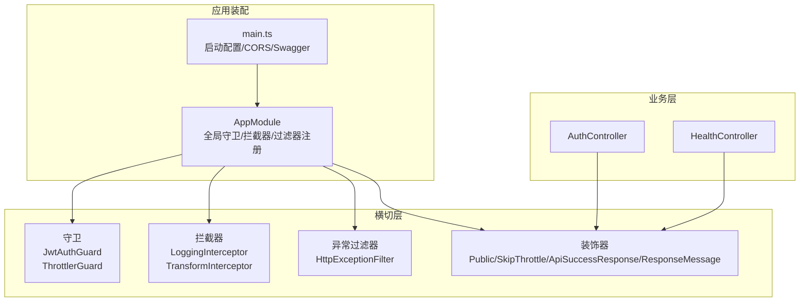
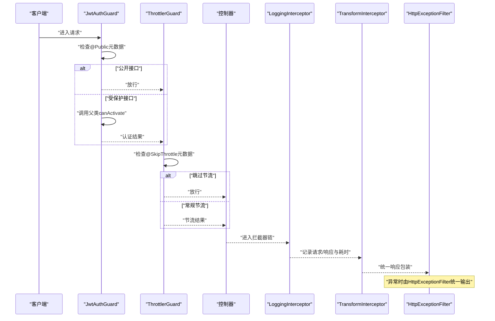
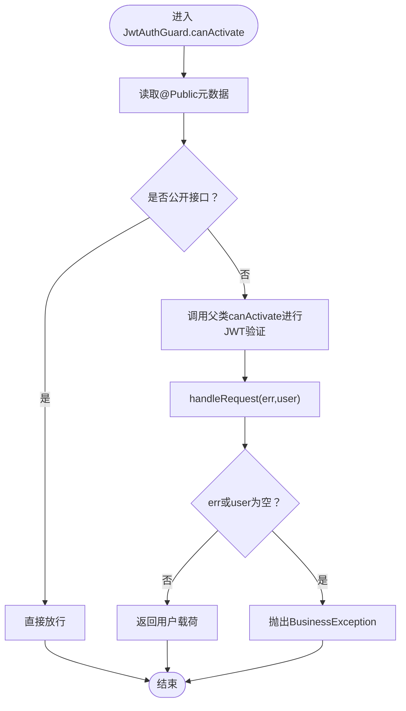
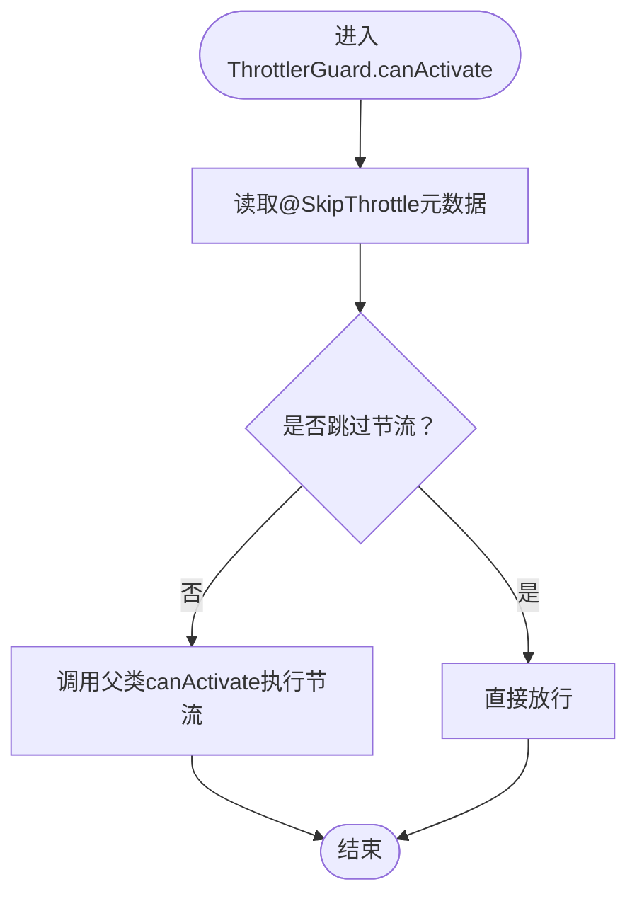
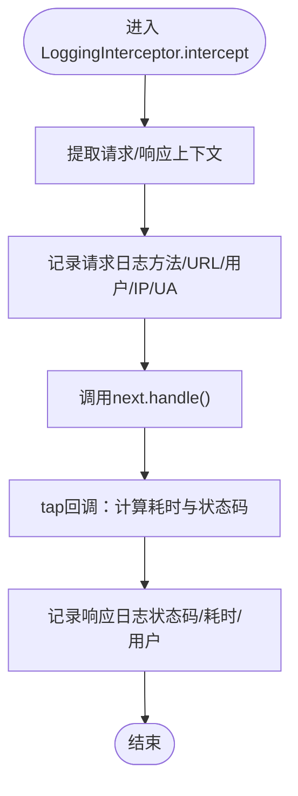
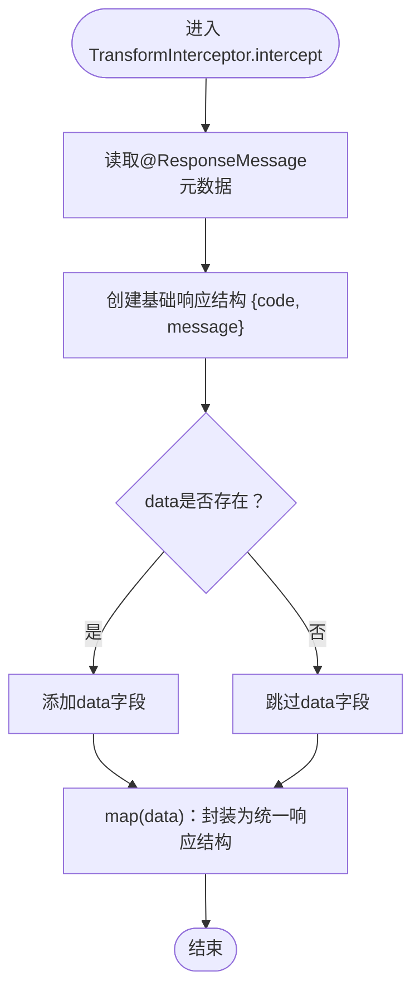
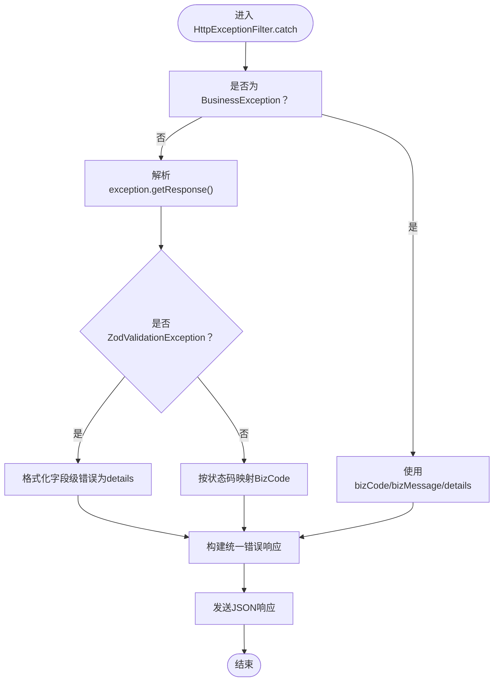
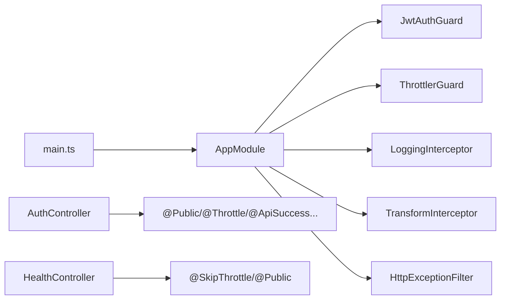

# 中间件和拦截器

<cite>
**本文引用的文件**
- [src/app.module.ts](file://src/app.module.ts)
- [src/main.ts](file://src/main.ts)
- [src/common/guards/jwt-auth.guard.ts](file://src/common/guards/jwt-auth.guard.ts)
- [src/common/guards/throttler.guard.ts](file://src/common/guards/throttler.guard.ts)
- [src/common/interceptors/logging.interceptor.ts](file://src/common/interceptors/logging.interceptor.ts)
- [src/common/interceptors/transform.interceptor.ts](file://src/common/interceptors/transform.interceptor.ts)
- [src/common/interceptors/transform.interceptor.spec.ts](file://src/common/interceptors/transform.interceptor.spec.ts)
- [src/common/filters/http-exception.filter.ts](file://src/common/filters/http-exception.filter.ts)
- [src/common/decorators/public.decorator.ts](file://src/common/decorators/public.decorator.ts)
- [src/common/decorators/skip-throttle.decorator.ts](file://src/common/decorators/skip-throttle.decorator.ts)
- [src/common/decorators/api-success-response.decorator.ts](file://src/common/decorators/api-success-response.decorator.ts)
- [src/common/decorators/response-message.decorator.ts](file://src/common/decorators/response-message.decorator.ts)
- [src/common/enums/biz-code.enum.ts](file://src/common/enums/biz-code.enum.ts)
- [src/common/interfaces/user.interface.ts](file://src/common/interfaces/user.interface.ts)
- [src/common/dto/api-response.dto.ts](file://src/common/dto/api-response.dto.ts)
- [src/common/dto/api-error-response.dto.ts](file://src/common/dto/api-error-response.dto.ts)
- [src/common/exceptions/business.exception.ts](file://src/common/exceptions/business.exception.ts)
- [src/modules/auth/auth.controller.ts](file://src/modules/auth/auth.controller.ts)
- [src/modules/health/health.controller.ts](file://src/modules/health/health.controller.ts)
</cite>

## 目录
1. [简介](#简介)
2. [项目结构](#项目结构)
3. [核心组件](#核心组件)
4. [架构总览](#架构总览)
5. [详细组件分析](#详细组件分析)
6. [依赖关系分析](#依赖关系分析)
7. [性能考量](#性能考量)
8. [故障排查指南](#故障排查指南)
9. [结论](#结论)
10. [附录：扩展指南](#附录扩展指南)

## 简介
本文件系统性阐述本项目的中间件与拦截器体系，覆盖以下主题：
- 守卫机制：JWT 认证守卫与节流守卫
- 拦截器实现：日志拦截器与数据转换拦截器
- 异常过滤器：统一错误响应与业务异常处理
- 自定义装饰器：公开接口、跳过节流、响应结构与消息
- 横切关注点与中间件链执行顺序
- 性能优化、错误处理与调试技巧
- 扩展指南：如何创建自定义守卫、拦截器与过滤器

## 项目结构
中间件与拦截器相关代码集中于以下目录：
- 守卫：src/common/guards
- 拦截器：src/common/interceptors
- 过滤器：src/common/filters
- 装饰器：src/common/decorators
- 枚举与接口：src/common/enums, src/common/interfaces
- DTO：src/common/dto
- 业务异常：src/common/exceptions
- 控制器示例：src/modules/*/controller.ts
- 应用装配：src/app.module.ts, src/main.ts

图表来源
- [src/app.module.ts:18-61](file://src/app.module.ts#L18-L61)
- [src/main.ts:8-47](file://src/main.ts#L8-L47)
- [src/common/guards/jwt-auth.guard.ts:17-46](file://src/common/guards/jwt-auth.guard.ts#L17-L46)
- [src/common/guards/throttler.guard.ts:10-33](file://src/common/guards/throttler.guard.ts#L10-L33)
- [src/common/interceptors/logging.interceptor.ts:12-40](file://src/common/interceptors/logging.interceptor.ts#L12-L40)
- [src/common/interceptors/transform.interceptor.ts:14-41](file://src/common/interceptors/transform.interceptor.ts#L14-L41)
- [src/common/filters/http-exception.filter.ts:24-173](file://src/common/filters/http-exception.filter.ts#L24-L173)
- [src/common/decorators/public.decorator.ts:1-5](file://src/common/decorators/public.decorator.ts#L1-L5)
- [src/common/decorators/skip-throttle.decorator.ts:1-12](file://src/common/decorators/skip-throttle.decorator.ts#L1-L12)
- [src/common/decorators/api-success-response.decorator.ts:1-172](file://src/common/decorators/api-success-response.decorator.ts#L1-L172)
- [src/common/decorators/response-message.decorator.ts:1-6](file://src/common/decorators/response-message.decorator.ts#L1-L6)
- [src/modules/auth/auth.controller.ts:36-129](file://src/modules/auth/auth.controller.ts#L36-L129)
- [src/modules/health/health.controller.ts:9-86](file://src/modules/health/health.controller.ts#L9-L86)

章节来源
- [src/app.module.ts:18-61](file://src/app.module.ts#L18-L61)
- [src/main.ts:8-47](file://src/main.ts#L8-L47)

## 核心组件
- 守卫
  - JwtAuthGuard：基于 Passport 的 JWT 守卫，结合反射判断是否为公开接口；认证失败时抛出业务异常。
  - ThrottlerGuard：继承 @nestjs/throttler 的 ThrottlerGuard，支持通过装饰器跳过速率限制。
- 拦截器
  - LoggingInterceptor：记录请求/响应元数据与耗时，支持从请求上下文提取用户标识。
  - TransformInterceptor：统一响应结构，读取方法级响应消息元数据，确保前后端一致。**智能数据字段处理**：仅在存在数据时包含 data 字段，避免 DELETE 等无返回数据操作产生 null 数据负载。
- 异常过滤器
  - HttpExceptionFilter：将 HttpException 映射为业务码与统一错误结构；对 Zod 校验异常进行格式化；区分业务异常与其他 HttpException。
- 装饰器
  - Public：标记公开接口，绕过 JwtAuthGuard。
  - SkipThrottle：标记高频但低风险接口，绕过 ThrottlerGuard。
  - ApiSuccessResponse/ApiSuccessNoDataResponse：生成统一响应的 Swagger 文档与元数据。
  - ResponseMessage：设置统一响应的消息文本。

章节来源
- [src/common/guards/jwt-auth.guard.ts:17-46](file://src/common/guards/jwt-auth.guard.ts#L17-L46)
- [src/common/guards/throttler.guard.ts:10-33](file://src/common/guards/throttler.guard.ts#L10-L33)
- [src/common/interceptors/logging.interceptor.ts:12-40](file://src/common/interceptors/logging.interceptor.ts#L12-L40)
- [src/common/interceptors/transform.interceptor.ts:14-41](file://src/common/interceptors/transform.interceptor.ts#L14-L41)
- [src/common/filters/http-exception.filter.ts:24-173](file://src/common/filters/http-exception.filter.ts#L24-L173)
- [src/common/decorators/public.decorator.ts:1-5](file://src/common/decorators/public.decorator.ts#L1-L5)
- [src/common/decorators/skip-throttle.decorator.ts:1-12](file://src/common/decorators/skip-throttle.decorator.ts#L1-L12)
- [src/common/decorators/api-success-response.decorator.ts:1-172](file://src/common/decorators/api-success-response.decorator.ts#L1-L172)
- [src/common/decorators/response-message.decorator.ts:1-6](file://src/common/decorators/response-message.decorator.ts#L1-L6)

## 架构总览
全局注册的中间件链（按注册顺序执行）：
1) 守卫链：JwtAuthGuard → ThrottlerGuard
2) 控制器处理
3) 拦截器链：LoggingInterceptor → TransformInterceptor
4) 异常过滤器：HttpExceptionFilter（捕获并统一输出）

图表来源
- [src/app.module.ts:34-57](file://src/app.module.ts#L34-L57)
- [src/common/guards/jwt-auth.guard.ts:23-34](file://src/common/guards/jwt-auth.guard.ts#L23-L34)
- [src/common/guards/throttler.guard.ts:20-31](file://src/common/guards/throttler.guard.ts#L20-L31)
- [src/common/interceptors/logging.interceptor.ts:16-38](file://src/common/interceptors/logging.interceptor.ts#L16-L38)
- [src/common/interceptors/transform.interceptor.ts:21-39](file://src/common/interceptors/transform.interceptor.ts#L21-L39)
- [src/common/filters/http-exception.filter.ts:28-78](file://src/common/filters/http-exception.filter.ts#L28-L78)

## 详细组件分析

### 守卫：JWT 认证守卫
- 功能要点
  - 继承自 AuthGuard('jwt')，复用 Passport 的 JWT 解析与验证流程。
  - 使用 Reflector 读取 @Public 元数据，若标记为公开接口则直接放行。
  - handleRequest 中对认证失败场景抛出 BusinessException，交由 HttpExceptionFilter 统一处理。
  - RequestWithUser 类型扩展，使后续拦截器与控制器可安全访问 req.user。
- 关键路径
  - 守卫实现：[src/common/guards/jwt-auth.guard.ts:17-46](file://src/common/guards/jwt-auth.guard.ts#L17-L46)
  - 用户载荷接口：[src/common/interfaces/user.interface.ts:6-9](file://src/common/interfaces/user.interface.ts#L6-L9)
  - 业务异常：[src/common/exceptions/business.exception.ts:16-42](file://src/common/exceptions/business.exception.ts#L16-L42)

图表来源
- [src/common/guards/jwt-auth.guard.ts:23-44](file://src/common/guards/jwt-auth.guard.ts#L23-L44)
- [src/common/exceptions/business.exception.ts:16-42](file://src/common/exceptions/business.exception.ts#L16-L42)

章节来源
- [src/common/guards/jwt-auth.guard.ts:17-46](file://src/common/guards/jwt-auth.guard.ts#L17-L46)
- [src/common/interfaces/user.interface.ts:6-9](file://src/common/interfaces/user.interface.ts#L6-L9)
- [src/common/exceptions/business.exception.ts:16-42](file://src/common/exceptions/business.exception.ts#L16-L42)

### 守卫：节流守卫
- 功能要点
  - 继承 NestThrottlerGuard，重写 canActivate。
  - 通过 Reflector 读取 @SkipThrottle 元数据，若标记则直接放行。
  - 否则委托父类执行节流策略（短/中/长窗口配置在 AppModule 中注册）。
- 关键路径
  - 守卫实现：[src/common/guards/throttler.guard.ts:10-33](file://src/common/guards/throttler.guard.ts#L10-L33)
  - 全局注册（含多窗口配置）：[src/app.module.ts:21-25](file://src/app.module.ts#L21-L25)

图表来源
- [src/common/guards/throttler.guard.ts:20-31](file://src/common/guards/throttler.guard.ts#L20-L31)

章节来源
- [src/common/guards/throttler.guard.ts:10-33](file://src/common/guards/throttler.guard.ts#L10-L33)
- [src/app.module.ts:21-25](file://src/app.module.ts#L21-L25)

### 拦截器：日志拦截器
- 功能要点
  - 在请求进入与响应完成两个阶段记录日志。
  - 提取 method、url、ip、user-agent、用户ID、状态码与耗时。
  - 依赖 RequestWithUser 类型以获取用户信息。
- 关键路径
  - 拦截器实现：[src/common/interceptors/logging.interceptor.ts:12-40](file://src/common/interceptors/logging.interceptor.ts#L12-L40)
  - 类型扩展：[src/common/guards/jwt-auth.guard.ts:13-15](file://src/common/guards/jwt-auth.guard.ts#L13-L15)

图表来源
- [src/common/interceptors/logging.interceptor.ts:16-38](file://src/common/interceptors/logging.interceptor.ts#L16-L38)
- [src/common/guards/jwt-auth.guard.ts:13-15](file://src/common/guards/jwt-auth.guard.ts#L13-L15)

章节来源
- [src/common/interceptors/logging.interceptor.ts:12-40](file://src/common/interceptors/logging.interceptor.ts#L12-L40)
- [src/common/guards/jwt-auth.guard.ts:13-15](file://src/common/guards/jwt-auth.guard.ts#L13-L15)

### 拦截器：数据转换拦截器
- 功能要点
  - 统一响应结构：{ code, data, message }。
  - 读取方法级 @ResponseMessage 或 @ApiSuccessNoDataResponse 的 message 元数据作为默认消息。
  - **智能数据字段处理**：仅在存在数据时包含 data 字段，避免 DELETE 等无返回数据操作产生 null 数据负载。
- 关键路径
  - 拦截器实现：[src/common/interceptors/transform.interceptor.ts:14-41](file://src/common/interceptors/transform.interceptor.ts#L14-L41)
  - 响应消息装饰器：[src/common/decorators/response-message.decorator.ts:1-6](file://src/common/decorators/response-message.decorator.ts#L1-L6)
  - Swagger 成功响应装饰器：[src/common/decorators/api-success-response.decorator.ts:70-128](file://src/common/decorators/api-success-response.decorator.ts#L70-L128)
  - 统一响应类型与 Zod Schema：[src/common/dto/api-response.dto.ts:35-40](file://src/common/dto/api-response.dto.ts#L35-L40)

**更新** 智能数据字段处理逻辑现已优化，仅在存在数据时包含 data 字段，避免 DELETE 等无返回数据操作产生 null 数据负载。

图表来源
- [src/common/interceptors/transform.interceptor.ts:21-41](file://src/common/interceptors/transform.interceptor.ts#L21-L41)
- [src/common/decorators/response-message.decorator.ts:4-5](file://src/common/decorators/response-message.decorator.ts#L4-L5)
- [src/common/dto/api-response.dto.ts:35-40](file://src/common/dto/api-response.dto.ts#L35-L40)

章节来源
- [src/common/interceptors/transform.interceptor.ts:14-41](file://src/common/interceptors/transform.interceptor.ts#L14-L41)
- [src/common/decorators/response-message.decorator.ts:1-6](file://src/common/decorators/response-message.decorator.ts#L1-L6)
- [src/common/decorators/api-success-response.decorator.ts:70-128](file://src/common/decorators/api-success-response.decorator.ts#L70-L128)
- [src/common/dto/api-response.dto.ts:35-40](file://src/common/dto/api-response.dto.ts#L35-L40)

### 异常过滤器：统一 HTTP 异常处理
- 功能要点
  - 捕获 HttpException，优先识别 BusinessException 并透传其业务码与消息。
  - 其他 HttpException：解析响应体，映射到 BizCode；对 ZodValidationException 进行字段级错误格式化。
  - 输出统一错误结构：{ code, message, details? }。
- 关键路径
  - 过滤器实现：[src/common/filters/http-exception.filter.ts:24-173](file://src/common/filters/http-exception.filter.ts#L24-L173)
  - 业务异常类：[src/common/exceptions/business.exception.ts:16-42](file://src/common/exceptions/business.exception.ts#L16-L42)
  - 业务码枚举与映射：[src/common/enums/biz-code.enum.ts:13-171](file://src/common/enums/biz-code.enum.ts#L13-L171)
  - 错误响应 DTO/Zod Schema：[src/common/dto/api-error-response.dto.ts:1-14](file://src/common/dto/api-error-response.dto.ts#L1-L14)

图表来源
- [src/common/filters/http-exception.filter.ts:28-78](file://src/common/filters/http-exception.filter.ts#L28-L78)
- [src/common/exceptions/business.exception.ts:16-42](file://src/common/exceptions/business.exception.ts#L16-L42)
- [src/common/enums/biz-code.enum.ts:156-171](file://src/common/enums/biz-code.enum.ts#L156-L171)
- [src/common/dto/api-error-response.dto.ts:4-13](file://src/common/dto/api-error-response.dto.ts#L4-L13)

章节来源
- [src/common/filters/http-exception.filter.ts:24-173](file://src/common/filters/http-exception.filter.ts#L24-L173)
- [src/common/exceptions/business.exception.ts:16-42](file://src/common/exceptions/business.exception.ts#L16-L42)
- [src/common/enums/biz-code.enum.ts:13-171](file://src/common/enums/biz-code.enum.ts#L13-L171)
- [src/common/dto/api-error-response.dto.ts:1-14](file://src/common/dto/api-error-response.dto.ts#L1-L14)

### 自定义装饰器与横切应用
- 公开接口装饰器
  - @Public：通过 SetMetadata 标记，JwtAuthGuard 读取并放行。
  - 示例：[src/common/decorators/public.decorator.ts:1-5](file://src/common/decorators/public.decorator.ts#L1-L5)
- 跳过节流装饰器
  - @SkipThrottle：标记高频但低风险接口，ThrottlerGuard 读取并放行。
  - 示例：[src/common/decorators/skip-throttle.decorator.ts:1-12](file://src/common/decorators/skip-throttle.decorator.ts#L1-L12)
- 响应结构与消息装饰器
  - @ApiSuccessResponse/@ApiSuccessNoDataResponse：生成 Swagger 文档与统一响应 Schema。
  - @ResponseMessage：设置统一响应的消息文本，供 TransformInterceptor 使用。
  - 示例：[src/common/decorators/api-success-response.decorator.ts:70-128](file://src/common/decorators/api-success-response.decorator.ts#L70-L128), [src/common/decorators/response-message.decorator.ts:1-6](file://src/common/decorators/response-message.decorator.ts#L1-L6)
- 控制器中的使用示例
  - 认证模块：[src/modules/auth/auth.controller.ts:44-101](file://src/modules/auth/auth.controller.ts#L44-L101)
  - 健康检查模块：[src/modules/health/health.controller.ts:10-11](file://src/modules/health/health.controller.ts#L10-L11)

章节来源
- [src/common/decorators/public.decorator.ts:1-5](file://src/common/decorators/public.decorator.ts#L1-L5)
- [src/common/decorators/skip-throttle.decorator.ts:1-12](file://src/common/decorators/skip-throttle.decorator.ts#L1-L12)
- [src/common/decorators/api-success-response.decorator.ts:70-128](file://src/common/decorators/api-success-response.decorator.ts#L70-L128)
- [src/common/decorators/response-message.decorator.ts:1-6](file://src/common/decorators/response-message.decorator.ts#L1-L6)
- [src/modules/auth/auth.controller.ts:44-101](file://src/modules/auth/auth.controller.ts#L44-L101)
- [src/modules/health/health.controller.ts:10-11](file://src/modules/health/health.controller.ts#L10-L11)

## 依赖关系分析
- 全局注册顺序
  - 守卫：JwtAuthGuard → ThrottlerGuard
  - 拦截器：LoggingInterceptor → TransformInterceptor
  - 过滤器：HttpExceptionFilter
- 关键依赖
  - AppModule 提供全局守卫/拦截器/过滤器实例。
  - main.ts 设置全局前缀、CORS、Swagger。
  - 控制器通过装饰器声明横切行为。

图表来源
- [src/app.module.ts:34-57](file://src/app.module.ts#L34-L57)
- [src/main.ts:14-33](file://src/main.ts#L14-L33)
- [src/modules/auth/auth.controller.ts:44-101](file://src/modules/auth/auth.controller.ts#L44-L101)
- [src/modules/health/health.controller.ts:10-11](file://src/modules/health/health.controller.ts#L10-L11)

章节来源
- [src/app.module.ts:34-57](file://src/app.module.ts#L34-L57)
- [src/main.ts:14-33](file://src/main.ts#L14-L33)

## 性能考量
- 日志开销
  - LoggingInterceptor 记录请求/响应与耗时，建议在高并发场景下控制日志级别与采样率。
- 节流策略
  - 多窗口配置（short/medium/long）需结合业务峰值流量调整，避免误伤正常请求。
- 响应统一
  - TransformInterceptor 为每个响应增加 map 操作，通常开销极小；智能数据字段处理进一步优化了空数据场景的响应体积。
- 异常处理
  - HttpExceptionFilter 对 Zod 校验错误进行格式化，注意避免在高频接口上产生过多校验异常。

## 故障排查指南
- 未授权访问
  - 现象：返回业务码 1002。
  - 排查：确认请求头是否携带有效 JWT；检查 JwtAuthGuard.handleRequest 是否被调用；查看 BusinessException 抛出位置。
  - 参考：[src/common/guards/jwt-auth.guard.ts:36-44](file://src/common/guards/jwt-auth.guard.ts#L36-L44), [src/common/exceptions/business.exception.ts:16-42](file://src/common/exceptions/business.exception.ts#L16-L42)
- 被节流限制
  - 现象：频繁请求被拒绝。
  - 排查：确认是否缺少 @SkipThrottle；核对 ThrottlerModule 配置与当前窗口限制。
  - 参考：[src/common/guards/throttler.guard.ts:20-31](file://src/common/guards/throttler.guard.ts#L20-L31), [src/app.module.ts:21-25](file://src/app.module.ts#L21-L25)
- 统一错误响应不符合预期
  - 现象：错误结构与业务码不匹配。
  - 排查：确认是否抛出了 BusinessException；检查 HttpExceptionFilter 的 parseExceptionResponse 分支；核对 BizCode 映射。
  - 参考：[src/common/filters/http-exception.filter.ts:28-78](file://src/common/filters/http-exception.filter.ts#L28-L78), [src/common/enums/biz-code.enum.ts:156-171](file://src/common/enums/biz-code.enum.ts#L156-L171)
- Swagger 文档与实际响应不一致
  - 现象：响应结构与文档不符。
  - 排查：确认是否使用了 @ApiSuccessResponse/@ApiSuccessNoDataResponse；检查 @ResponseMessage 是否正确设置。
  - 参考：[src/common/decorators/api-success-response.decorator.ts:70-128](file://src/common/decorators/api-success-response.decorator.ts#L70-L128), [src/common/decorators/response-message.decorator.ts:1-6](file://src/common/decorators/response-message.decorator.ts#L1-L6)
- **智能数据字段处理问题**
  - 现象：DELETE 等无返回数据操作仍然包含 data 字段。
  - 排查：确认 TransformInterceptor 中的条件判断逻辑；检查控制器方法返回类型是否为 void。
  - 参考：[src/common/interceptors/transform.interceptor.ts:37-40](file://src/common/interceptors/transform.interceptor.ts#L37-L40)

章节来源
- [src/common/guards/jwt-auth.guard.ts:36-44](file://src/common/guards/jwt-auth.guard.ts#L36-L44)
- [src/common/exceptions/business.exception.ts:16-42](file://src/common/exceptions/business.exception.ts#L16-L42)
- [src/common/guards/throttler.guard.ts:20-31](file://src/common/guards/throttler.guard.ts#L20-L31)
- [src/app.module.ts:21-25](file://src/app.module.ts#L21-L25)
- [src/common/filters/http-exception.filter.ts:28-78](file://src/common/filters/http-exception.filter.ts#L28-L78)
- [src/common/enums/biz-code.enum.ts:156-171](file://src/common/enums/biz-code.enum.ts#L156-L171)
- [src/common/decorators/api-success-response.decorator.ts:70-128](file://src/common/decorators/api-success-response.decorator.ts#L70-L128)
- [src/common/decorators/response-message.decorator.ts:1-6](file://src/common/decorators/response-message.decorator.ts#L1-L6)
- [src/common/interceptors/transform.interceptor.ts:37-40](file://src/common/interceptors/transform.interceptor.ts#L37-L40)

## 结论
本项目通过全局守卫、拦截器与异常过滤器实现了清晰的横切关注点分离：
- 安全：JwtAuthGuard 统一鉴权，@Public 放行公开接口。
- 限流：ThrottlerGuard 支持细粒度节流与 @SkipThrottle 特例。
- 可观测性：LoggingInterceptor 记录关键指标。
- 一致性：TransformInterceptor 统一响应结构，**智能数据字段处理优化了无数据场景的响应体积**，Swagger 装饰器保证文档与实现一致。
- 可靠性：HttpExceptionFilter 将异常映射为业务码与统一错误结构，便于前端处理。

## 附录：扩展指南
- 创建自定义守卫
  - 实现 CanActivate，必要时使用 Reflector 读取装饰器元数据。
  - 在 AppModule 的 APP_GUARD 注册为全局守卫。
  - 参考：[src/common/guards/jwt-auth.guard.ts:17-46](file://src/common/guards/jwt-auth.guard.ts#L17-L46), [src/app.module.ts:34-41](file://src/app.module.ts#L34-L41)
- 创建自定义拦截器
  - 实现 NestInterceptor，使用 tap 记录响应阶段信息，或使用 map 统一响应结构。
  - 在 AppModule 的 APP_INTERCEPTOR 注册为全局拦截器。
  - 参考：[src/common/interceptors/logging.interceptor.ts:12-40](file://src/common/interceptors/logging.interceptor.ts#L12-L40), [src/common/interceptors/transform.interceptor.ts:14-41](file://src/common/interceptors/transform.interceptor.ts#L14-L41), [src/app.module.ts:42-53](file://src/app.module.ts#L42-L53)
- 创建自定义异常过滤器
  - 实现 ExceptionFilter<Catch(HttpException)>，输出统一错误结构。
  - 在 AppModule 的 APP_FILTER 注册为全局过滤器。
  - 参考：[src/common/filters/http-exception.filter.ts:24-173](file://src/common/filters/http-exception.filter.ts#L24-L173), [src/app.module.ts:54-57](file://src/app.module.ts#L54-L57)
- 自定义装饰器
  - 使用 SetMetadata 注入元数据，守卫/拦截器/过滤器通过 Reflector 读取。
  - 参考：[src/common/decorators/public.decorator.ts:1-5](file://src/common/decorators/public.decorator.ts#L1-L5), [src/common/decorators/skip-throttle.decorator.ts:1-12](file://src/common/decorators/skip-throttle.decorator.ts#L1-L12), [src/common/decorators/api-success-response.decorator.ts:1-172](file://src/common/decorators/api-success-response.decorator.ts#L1-L172), [src/common/decorators/response-message.decorator.ts:1-6](file://src/common/decorators/response-message.decorator.ts#L1-L6)
- 最佳实践
  - 将装饰器与拦截器职责单一化，避免在一个拦截器中同时做日志与响应转换以外的复杂逻辑。
  - 对高频接口谨慎使用 LoggingInterceptor 的详细日志，必要时降级为 INFO。
  - 使用 @SkipThrottle 仅限于明确的健康检查、监控等低风险端点。
  - 业务异常统一使用 BusinessException，便于 HttpExceptionFilter 识别与输出。
  - **智能数据字段处理**：对于 DELETE 等无返回数据的操作，确保控制器方法返回 void 类型，以便 TransformInterceptor 正确处理响应结构。

章节来源
- [src/common/guards/jwt-auth.guard.ts:17-46](file://src/common/guards/jwt-auth.guard.ts#L17-L46)
- [src/common/interceptors/logging.interceptor.ts:12-40](file://src/common/interceptors/logging.interceptor.ts#L12-L40)
- [src/common/interceptors/transform.interceptor.ts:14-41](file://src/common/interceptors/transform.interceptor.ts#L14-L41)
- [src/common/filters/http-exception.filter.ts:24-173](file://src/common/filters/http-exception.filter.ts#L24-L173)
- [src/common/decorators/public.decorator.ts:1-5](file://src/common/decorators/public.decorator.ts#L1-L5)
- [src/common/decorators/skip-throttle.decorator.ts:1-12](file://src/common/decorators/skip-throttle.decorator.ts#L1-L12)
- [src/common/decorators/api-success-response.decorator.ts:1-172](file://src/common/decorators/api-success-response.decorator.ts#L1-L172)
- [src/common/decorators/response-message.decorator.ts:1-6](file://src/common/decorators/response-message.decorator.ts#L1-L6)
- [src/app.module.ts:34-57](file://src/app.module.ts#L34-L57)